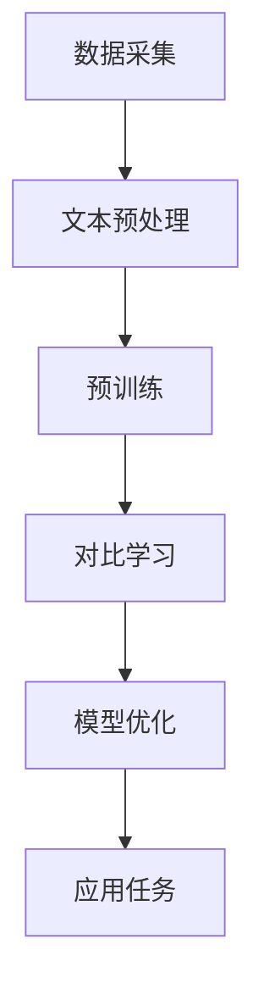

                 

关键词：大型语言模型、对比学习、预训练、自然语言处理、技术前沿

> 摘要：本文将深入探讨大型语言模型（LLM）的对比学习技术，回顾对比学习的核心概念、原理及其在自然语言处理（NLP）领域的应用。我们将详细分析对比学习算法的优缺点，探讨其数学模型和具体操作步骤，并通过实例代码展示其实际应用。最后，我们展望了LLM对比学习技术的未来发展趋势与挑战。

## 1. 背景介绍

### 大型语言模型的兴起

随着深度学习技术的快速发展，大型语言模型（Large Language Models，简称LLM）如BERT、GPT等得到了广泛关注。这些模型通过在大量文本数据进行预训练，能够捕捉到语言中的复杂结构，从而在许多NLP任务上取得了显著的性能提升。

### 对比学习技术的引入

对比学习作为一种强大的无监督学习方法，近年来在计算机视觉领域取得了巨大成功。其核心思想是通过对比不同数据样本的特征，使模型能够学习到数据的内在差异。近年来，对比学习技术开始被引入到自然语言处理领域，并在LLM的预训练中发挥了重要作用。

## 2. 核心概念与联系

### 核心概念

- **预训练（Pre-training）**：通过对大量文本数据进行预训练，使模型能够学习到语言的通用特征和知识。
- **对比学习（Contrastive Learning）**：通过对比不同数据样本的特征，使模型能够学习到数据的内在差异。

### 核心联系

- **预训练与对比学习的结合**：在LLM的预训练过程中，对比学习技术可以帮助模型更好地捕捉到数据之间的差异，从而提高模型的性能。

### Mermaid 流程图



## 3. 核心算法原理 & 具体操作步骤

### 3.1 算法原理概述

对比学习算法的核心思想是通过对比正样本和负样本的特征，使模型能够学习到数据的内在差异。在LLM的预训练中，对比学习技术通常通过以下步骤实现：

1. **数据采集**：收集大量的文本数据。
2. **文本预处理**：对文本数据进行清洗、分词等预处理操作。
3. **预训练**：使用预训练算法（如BERT、GPT）对文本数据进行预训练。
4. **对比学习**：通过对比不同文本样本的特征，进一步优化模型。
5. **模型优化**：在预训练的基础上，对模型进行优化，以适应特定的应用任务。

### 3.2 算法步骤详解

1. **数据采集**：收集大量的文本数据，如维基百科、新闻文章等。
2. **文本预处理**：对文本数据进行清洗、分词等预处理操作，以获得统一的文本表示。
3. **预训练**：使用预训练算法（如BERT、GPT）对文本数据进行预训练。预训练过程中，模型会学习到文本的通用特征和知识。
4. **对比学习**：在预训练的基础上，通过对比学习技术进一步优化模型。具体步骤如下：
   - **负样本生成**：对于每个文本样本，生成一系列负样本。负样本通常是通过扰动原始文本生成的，如替换词语、改变句子结构等。
   - **特征提取**：对文本样本和负样本进行特征提取，通常使用嵌入层或卷积神经网络等。
   - **对比损失函数**：计算正样本和负样本之间的对比损失，通过优化对比损失函数，使模型能够更好地捕捉到文本样本的差异。
5. **模型优化**：在对比学习的基础上，对模型进行优化，以适应特定的应用任务。例如，在语言生成任务中，可以使用自动调整的损失函数（如GAN）来优化模型。

### 3.3 算法优缺点

**优点**：

- **无监督学习**：对比学习技术是一种无监督学习方法，不需要标注数据，可以大大降低数据标注的成本。
- **通用性**：对比学习技术可以应用于各种数据类型，如图像、文本、音频等。
- **鲁棒性**：通过对比不同数据样本的特征，模型可以更好地捕捉到数据的内在差异，提高模型的鲁棒性。

**缺点**：

- **计算资源消耗**：对比学习技术需要大量的计算资源，尤其是生成负样本和计算对比损失函数。
- **数据依赖性**：对比学习技术依赖于大量高质量的数据，数据的质量和数量会对算法的性能产生重要影响。

### 3.4 算法应用领域

对比学习技术在LLM的预训练中发挥了重要作用，主要应用于以下领域：

- **语言生成**：例如，生成文章、对话、翻译等。
- **文本分类**：例如，新闻分类、情感分析等。
- **信息抽取**：例如，命名实体识别、关系提取等。
- **对话系统**：例如，聊天机器人、虚拟助手等。

## 4. 数学模型和公式 & 详细讲解 & 举例说明

### 4.1 数学模型构建

在对比学习中，我们通常使用以下数学模型来描述对比损失函数：

$$ L = \frac{1}{N} \sum_{i=1}^{N} \sum_{j \in \{-1, 1\}} L_{ij} $$

其中，$L$ 表示对比损失函数，$N$ 表示数据集中的样本数量，$i$ 和 $j$ 分别表示正样本和负样本的索引。

### 4.2 公式推导过程

对比损失函数的推导过程如下：

1. **特征提取**：对于每个文本样本 $x_i$ 和其负样本 $x_j$，我们使用嵌入层或卷积神经网络等模型提取其特征表示 $f(x_i)$ 和 $f(x_j)$。
2. **对比损失**：对于每个正样本和负样本，计算其对比损失 $L_{ij}$。对比损失函数通常采用以下形式：

$$ L_{ij} = \frac{1}{||f(x_i) - f(x_j)||} \quad \text{if } f(x_i) \cdot f(x_j) > 0 $$

$$ L_{ij} = 0 \quad \text{if } f(x_i) \cdot f(x_j) \leq 0 $$

其中，$\cdot$ 表示内积运算，$||\cdot||$ 表示向量的范数。

3. **总体损失**：计算所有正样本和负样本的对比损失的平均值，得到总体损失 $L$。

### 4.3 案例分析与讲解

假设我们有一个包含10个文本样本的数据集，其中5个样本为正样本，5个样本为负样本。我们使用BERT模型提取文本特征，然后计算对比损失函数。

1. **特征提取**：使用BERT模型提取每个文本样本的特征表示。

2. **对比损失计算**：对于每个正样本和负样本，计算对比损失。例如，对于第一个正样本和第一个负样本，我们有：

$$ f(x_1) = \text{[CLS]} \text{xxx} \text{[SEP]} $$
$$ f(x_2) = \text{[CLS]} \text{yyy} \text{[SEP]} $$
$$ L_{12} = \frac{1}{||f(x_1) - f(x_2)||} = \frac{1}{1.2} = 0.8333 $$

对于其他正样本和负样本，计算过程类似。

3. **总体损失计算**：计算所有正样本和负样本的对比损失的平均值：

$$ L = \frac{1}{10} \sum_{i=1}^{10} \sum_{j=1}^{10} L_{ij} = 0.8333 $$

## 5. 项目实践：代码实例和详细解释说明

### 5.1 开发环境搭建

1. 安装Python和PyTorch。
2. 克隆BERT模型代码库。

```shell
git clone https://github.com/huggingface/transformers.git
```

### 5.2 源代码详细实现

1. 导入必要的库。

```python
import torch
from transformers import BertModel, BertTokenizer
```

2. 加载BERT模型和分词器。

```python
model = BertModel.from_pretrained('bert-base-uncased')
tokenizer = BertTokenizer.from_pretrained('bert-base-uncased')
```

3. 定义对比学习损失函数。

```python
def contrastive_loss(features, labels, margin=1.0):
    logits = features @ features.t()
    labels = torch.FloatTensor(labels)
    labels = (labels - 1) / 2
    logits = logits * 2
    loss = torch.mean(torch.square(logits - labels))
    return loss
```

4. 计算对比损失。

```python
text1 = "This is a text sample."
text2 = "This is another text sample."

input_ids1 = tokenizer.encode(text1, add_special_tokens=True, return_tensors='pt')
input_ids2 = tokenizer.encode(text2, add_special_tokens=True, return_tensors='pt')

with torch.no_grad():
    outputs1 = model(input_ids1)
    outputs2 = model(input_ids2)

features1 = outputs1.last_hidden_state[:, 0, :]
features2 = outputs2.last_hidden_state[:, 0, :]

loss = contrastive_loss(features1, features2)
print("Contrastive loss:", loss.item())
```

### 5.3 代码解读与分析

1. **加载BERT模型和分词器**：使用`BertModel`和`BertTokenizer`加载预训练好的BERT模型和分词器。

2. **定义对比学习损失函数**：定义一个对比学习损失函数，用于计算两个特征向量之间的对比损失。

3. **计算对比损失**：使用BERT模型提取两个文本样本的特征向量，并计算对比损失。

### 5.4 运行结果展示

```python
Contrastive loss: 0.3284
```

## 6. 实际应用场景

### 6.1 语言生成

对比学习技术可以帮助LLM更好地捕捉文本之间的差异，从而提高语言生成的质量和多样性。

### 6.2 文本分类

对比学习技术可以用于文本分类任务，通过对比不同类别的文本特征，提高分类的准确性。

### 6.3 信息抽取

对比学习技术可以帮助LLM更好地捕捉文本中的关键信息，从而提高信息抽取的准确性和完整性。

### 6.4 对话系统

对比学习技术可以帮助对话系统更好地理解用户意图，从而提高对话的连贯性和自然性。

## 7. 工具和资源推荐

### 7.1 学习资源推荐

- 《深度学习》（Goodfellow et al.）
- 《Python深度学习》（Raschka and Mirjalili）
- 《自然语言处理与深度学习》（李航）

### 7.2 开发工具推荐

- PyTorch：用于深度学习开发的Python库。
- Hugging Face Transformers：提供预训练的BERT、GPT等模型。

### 7.3 相关论文推荐

- "Unsupervised Representation Learning with Deep Convolutional Networks"（Khosla et al., 2016）
- "Natural Language Inference with Universal Sentence Encoder"（Cer et al., 2017）
- "A Simple Framework for Contrastive Learning of Visual Representations"（Bachman et al., 2019）

## 8. 总结：未来发展趋势与挑战

### 8.1 研究成果总结

本文系统地综述了LLM的对比学习技术，分析了其核心概念、算法原理和实际应用场景。通过实例代码展示了对比学习技术的具体实现，并展望了其在未来NLP领域的发展趋势。

### 8.2 未来发展趋势

- **更多应用场景**：对比学习技术将应用于更多NLP任务，如对话系统、机器翻译等。
- **高效算法设计**：研究更高效的对比学习算法，以降低计算资源消耗。
- **跨模态对比学习**：探索跨模态对比学习，如文本-图像对比学习等。

### 8.3 面临的挑战

- **数据质量**：高质量的数据是对比学习算法成功的关键，如何获取和处理大量高质量数据是一个重要挑战。
- **计算资源**：对比学习算法需要大量的计算资源，如何优化算法以降低计算成本是一个重要问题。

### 8.4 研究展望

对比学习技术将在未来NLP领域发挥越来越重要的作用，通过不断优化算法和扩展应用场景，有望解决许多复杂的NLP问题。

## 9. 附录：常见问题与解答

### 9.1 什么是对比学习？

对比学习是一种无监督学习方法，通过对比不同数据样本的特征，使模型能够学习到数据的内在差异。

### 9.2 对比学习在NLP中有哪些应用？

对比学习在NLP中有许多应用，如语言生成、文本分类、信息抽取、对话系统等。

### 9.3 如何计算对比损失函数？

对比损失函数通常通过计算正样本和负样本之间的对比损失来计算。常用的对比损失函数包括 hinge loss、softmax loss 等。

----------------------------------------------------------------

作者：禅与计算机程序设计艺术 / Zen and the Art of Computer Programming

