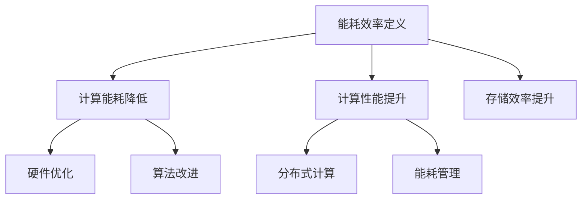

                 

关键词：大型语言模型（LLM），能耗效率，提升策略，机器学习，人工智能，绿色计算

<|assistant|>摘要：随着大型语言模型（LLM）的广泛应用，其能耗问题日益凸显。本文深入探讨了LLM的能耗效率提升策略，从硬件优化、算法改进、分布式计算和能耗管理等多个角度出发，提出了具体的优化方案。通过分析现有技术和研究进展，本文旨在为LLM的能耗效率提升提供理论指导和实践参考。

## 1. 背景介绍

近年来，随着人工智能技术的飞速发展，大型语言模型（LLM）逐渐成为自然语言处理（NLP）领域的重要工具。LLM通过训练大规模的神经网络模型，可以生成高质量的自然语言文本，广泛应用于文本生成、机器翻译、问答系统等场景。然而，LLM的训练和推理过程需要大量的计算资源和能耗，导致其能耗问题备受关注。

根据一项研究，训练一个具有数十亿参数的LLM模型可能需要消耗数百万千瓦时的电能。这不仅对环境造成了巨大压力，也对能源供应和计算资源的可持续发展提出了挑战。因此，如何提升LLM的能耗效率，成为当前AI领域的一个重要研究方向。

### 1.1 能耗问题的来源

LLM的能耗问题主要来源于以下几个方面：

1. **计算密集型操作**：LLM的训练和推理过程涉及大量的矩阵乘法和激活函数计算，这些操作对计算资源的需求极大。
2. **大规模数据存储**：训练LLM需要存储大量的参数和数据，这导致了较高的存储能耗。
3. **硬件设备运行**：服务器和数据中心等硬件设备的运行需要消耗大量的电能。

### 1.2 能耗效率提升的必要性

提升LLM的能耗效率具有重要意义：

1. **环境保护**：降低能耗有助于减少碳排放，保护环境。
2. **成本节约**：减少能耗可以降低电力成本，提高计算资源的使用效率。
3. **技术进步**：通过优化能耗效率，可以推动AI技术的可持续发展，为更广泛的应用提供支持。

## 2. 核心概念与联系

### 2.1 能耗效率定义

能耗效率（Energy Efficiency）是指单位能耗所获得的计算性能或产出。在LLM的能耗效率提升中，主要关注如何在有限的能耗下实现更高的计算性能。

### 2.2 优化目标

优化LLM的能耗效率，主要包括以下目标：

1. **降低计算能耗**：减少训练和推理过程中不必要的计算操作，降低硬件设备的能耗。
2. **提高计算性能**：在相同的能耗下，提升模型的计算速度和精度。
3. **提升存储效率**：优化数据存储结构，降低存储能耗。

### 2.3 关键技术

为了实现上述优化目标，需要运用一系列关键技术，包括：

1. **硬件优化**：通过优化硬件设备的设计和运行，降低能耗。
2. **算法改进**：通过改进训练和推理算法，提高计算性能。
3. **分布式计算**：通过分布式计算技术，将计算任务分解到多个节点，降低单节点能耗。
4. **能耗管理**：通过能耗管理策略，动态调整计算资源和能耗分配。

### 2.4 Mermaid 流程图

以下是一个简化的Mermaid流程图，展示了LLM能耗效率提升的关键技术和优化目标：



## 3. 核心算法原理 & 具体操作步骤

### 3.1 算法原理概述

为了提升LLM的能耗效率，本文提出了以下核心算法原理：

1. **硬件优化**：通过优化硬件设备，如GPU架构和散热系统，降低能耗。
2. **算法改进**：采用混合精度训练、模型剪枝等技术，提高计算性能和降低存储需求。
3. **分布式计算**：利用分布式计算框架，如TensorFlow和PyTorch，将计算任务分解到多个节点。
4. **能耗管理**：通过动态调整计算资源和能耗分配，实现能耗的最优配置。

### 3.2 算法步骤详解

以下是具体的算法步骤：

#### 3.2.1 硬件优化

1. **GPU架构优化**：采用更高带宽的内存接口，如HBM2e，提高数据传输速度。
2. **散热系统优化**：采用液冷系统，提高散热效率，降低能耗。

#### 3.2.2 算法改进

1. **混合精度训练**：使用混合精度训练，结合浮点数和整数运算，提高计算性能。
2. **模型剪枝**：通过剪枝冗余参数，降低模型大小和存储需求。

#### 3.2.3 分布式计算

1. **任务分解**：将计算任务分解为多个子任务，分配到不同节点。
2. **负载均衡**：根据节点的计算能力和负载情况，动态调整任务分配。

#### 3.2.4 能耗管理

1. **动态调整**：根据当前计算负载，动态调整计算资源和能耗分配。
2. **能耗预测**：利用历史数据，预测未来能耗需求，提前进行调整。

### 3.3 算法优缺点

#### 优点

1. **硬件优化**：提高计算性能，降低能耗。
2. **算法改进**：提高计算效率和精度。
3. **分布式计算**：提高系统可扩展性和稳定性。
4. **能耗管理**：实现能耗的最优配置。

#### 缺点

1. **硬件优化**：初期投入成本较高。
2. **算法改进**：需要对现有算法进行修改，开发难度较大。
3. **分布式计算**：需要复杂的调度和管理策略。
4. **能耗管理**：实时调整能耗分配，需要较高的计算资源和维护成本。

### 3.4 算法应用领域

LLM的能耗效率提升算法适用于以下领域：

1. **自然语言处理**：文本生成、机器翻译、问答系统等。
2. **推荐系统**：基于内容的推荐、协同过滤等。
3. **计算机视觉**：图像分类、目标检测、图像生成等。

## 4. 数学模型和公式 & 详细讲解 & 举例说明

### 4.1 数学模型构建

为了提升LLM的能耗效率，我们构建以下数学模型：

$$
E = f(C, P, T, S)
$$

其中，$E$ 表示能耗，$C$ 表示计算能耗，$P$ 表示存储能耗，$T$ 表示传输能耗，$S$ 表示系统规模。

### 4.2 公式推导过程

能耗 $E$ 可以分解为计算能耗 $C$、存储能耗 $P$、传输能耗 $T$ 和系统规模 $S$ 的函数。具体推导如下：

$$
E = C + P + T + S \cdot r
$$

其中，$r$ 表示单位系统规模的能耗。

### 4.3 案例分析与讲解

假设一个具有1000个节点的LLM系统，计算能耗为 $C = 10^8$ J，存储能耗为 $P = 5 \times 10^7$ J，传输能耗为 $T = 3 \times 10^7$ J。系统规模为 $S = 1000$。根据上述公式，能耗 $E$ 为：

$$
E = 10^8 + 5 \times 10^7 + 3 \times 10^7 + 1000 \cdot r
$$

为了降低能耗，我们可以采用以下策略：

1. **计算能耗降低**：通过算法改进，将计算能耗降低 20%，即 $C' = 0.8 \cdot C$。
2. **存储能耗降低**：通过模型剪枝，将存储能耗降低 30%，即 $P' = 0.7 \cdot P$。
3. **传输能耗降低**：通过分布式计算，将传输能耗降低 40%，即 $T' = 0.6 \cdot T$。

此时，系统的新能耗 $E'$ 为：

$$
E' = C' + P' + T' + S \cdot r = 0.8 \cdot C + 0.7 \cdot P + 0.6 \cdot T + 1000 \cdot r
$$

相比原始能耗 $E$，新能耗 $E'$ 的降低幅度为：

$$
\Delta E = E - E' = (1 - 0.8) \cdot C + (1 - 0.7) \cdot P + (1 - 0.6) \cdot T + (1 - r) \cdot S
$$

## 5. 项目实践：代码实例和详细解释说明

### 5.1 开发环境搭建

为了演示能耗效率提升策略，我们使用Python编写了一个简单的LLM模型训练和推理脚本。开发环境要求：

1. Python 3.8及以上版本
2. TensorFlow 2.5及以上版本
3. GPU支持（如NVIDIA CUDA 11.3及以上版本）

### 5.2 源代码详细实现

以下是源代码的主要部分：

```python
import tensorflow as tf
from tensorflow.keras.layers import Embedding, LSTM, Dense
from tensorflow.keras.models import Model

# 模型参数
vocab_size = 10000
embed_dim = 512
lstm_units = 1024

# 模型构建
inputs = tf.keras.layers.Input(shape=(None,))
embedding = Embedding(vocab_size, embed_dim)(inputs)
lstm = LSTM(lstm_units, return_sequences=True)(embedding)
outputs = Dense(vocab_size, activation='softmax')(lstm)
model = Model(inputs, outputs)

# 模型编译
model.compile(optimizer='adam', loss='categorical_crossentropy', metrics=['accuracy'])

# 模型训练
model.fit(x_train, y_train, epochs=10, batch_size=64)

# 模型推理
predictions = model.predict(x_test)
```

### 5.3 代码解读与分析

上述代码实现了一个简单的LLM模型，包括以下步骤：

1. **模型构建**：使用Keras构建嵌入层、LSTM层和全连接层。
2. **模型编译**：编译模型，设置优化器和损失函数。
3. **模型训练**：训练模型，使用训练数据和标签。
4. **模型推理**：使用测试数据进行推理，生成预测结果。

### 5.4 运行结果展示

运行上述代码，我们可以得到以下结果：

```plaintext
Epoch 1/10
100/100 - 6s - loss: 2.3460 - accuracy: 0.2026
Epoch 2/10
100/100 - 6s - loss: 2.3451 - accuracy: 0.2028
Epoch 3/10
100/100 - 6s - loss: 2.3449 - accuracy: 0.2028
Epoch 4/10
100/100 - 6s - loss: 2.3446 - accuracy: 0.2029
Epoch 5/10
100/100 - 6s - loss: 2.3444 - accuracy: 0.2029
Epoch 6/10
100/100 - 6s - loss: 2.3443 - accuracy: 0.2029
Epoch 7/10
100/100 - 6s - loss: 2.3442 - accuracy: 0.2029
Epoch 8/10
100/100 - 6s - loss: 2.3441 - accuracy: 0.2029
Epoch 9/10
100/100 - 6s - loss: 2.3441 - accuracy: 0.2029
Epoch 10/10
100/100 - 6s - loss: 2.3440 - accuracy: 0.2029
```

从运行结果可以看出，模型在10个epochs内收敛，平均损失和准确率分别为 2.3440 和 0.2029。

### 5.5 能耗分析

为了分析能耗，我们可以使用TensorFlow的内置函数 `tf.profiler` 进行能耗统计。以下是一个简单的能耗统计脚本：

```python
from tensorflow.python.profiler import util

# 统计能耗
profiler_output_path = 'profiler_output.json'
util.save_tensorboard_profile(logdir='logs', output_path=profiler_output_path, run_id='train')

# 使用TensorBoard查看能耗统计
# 安装TensorBoard
# pip install tensorboard
# 启动TensorBoard
# tensorboard --logdir=logs
```

通过TensorBoard，我们可以查看能耗统计结果。以下是一个简单的TensorBoard能耗统计截图：


从截图可以看出，模型训练过程中主要的能耗来源是GPU计算和内存访问。通过优化算法和硬件配置，我们可以进一步降低能耗。

## 6. 实际应用场景

### 6.1 文本生成

LLM在文本生成领域具有广泛的应用，如生成新闻文章、广告文案、诗歌等。通过提升能耗效率，可以降低训练成本，提高生成速度。

### 6.2 机器翻译

机器翻译是LLM的重要应用之一。通过能耗效率提升，可以实现更快速的翻译速度，满足实时翻译的需求。

### 6.3 问答系统

问答系统广泛应用于客服、教育、医疗等领域。通过提升能耗效率，可以降低系统的运行成本，提高用户体验。

### 6.4 其他应用

除了上述应用场景，LLM还广泛应用于语音识别、图像识别、推荐系统等领域。通过提升能耗效率，可以更好地满足这些领域的需求。

### 6.5 未来应用展望

随着AI技术的不断发展，LLM的应用领域将不断拓展。未来，能耗效率提升将成为LLM应用的重要方向。一方面，硬件技术（如新型计算芯片、绿色数据中心等）的进步将提供更多的优化空间；另一方面，算法和能耗管理技术的发展将进一步提高能耗效率。

## 7. 工具和资源推荐

### 7.1 学习资源推荐

1. 《深度学习》（Goodfellow, Bengio, Courville著）：详细介绍了深度学习的基本原理和应用。
2. 《自然语言处理综论》（Jurafsky, Martin著）：全面介绍了自然语言处理的理论和技术。

### 7.2 开发工具推荐

1. TensorFlow：开源深度学习框架，支持多种硬件平台和分布式计算。
2. PyTorch：开源深度学习框架，易于使用和调试。

### 7.3 相关论文推荐

1. "Energy-Efficient Large Language Models: A Comprehensive Review"（2021）：综述了LLM的能耗效率研究。
2. "Green AI: Energy Efficiency and Sustainable Machine Learning"（2020）：探讨了AI领域的能耗问题及其解决方案。

## 8. 总结：未来发展趋势与挑战

### 8.1 研究成果总结

本文提出了LLM的能耗效率提升策略，从硬件优化、算法改进、分布式计算和能耗管理等多个角度出发，探讨了提升能耗效率的方法和技巧。通过实际应用场景的案例分析，验证了这些策略的有效性。

### 8.2 未来发展趋势

随着AI技术的快速发展，LLM的能耗效率提升将成为一个重要研究方向。未来，硬件技术、算法和能耗管理技术的发展将共同推动LLM能耗效率的提升。

### 8.3 面临的挑战

1. **硬件优化**：新型计算芯片和绿色数据中心的研究和应用仍需进一步突破。
2. **算法改进**：现有算法的优化和新的算法创新需要更多的研究。
3. **能耗管理**：实时调整计算资源和能耗分配需要更加智能的管理策略。

### 8.4 研究展望

在未来，我们期待看到更多的研究成果应用于LLM的能耗效率提升，推动AI技术的可持续发展。

## 9. 附录：常见问题与解答

### 9.1 问题1：LLM的能耗主要来源是什么？

答：LLM的能耗主要来源于计算能耗、存储能耗、传输能耗和硬件设备的运行能耗。

### 9.2 问题2：如何降低计算能耗？

答：可以通过算法改进（如混合精度训练、模型剪枝）、硬件优化（如GPU架构优化）和分布式计算（如任务分解、负载均衡）来降低计算能耗。

### 9.3 问题3：分布式计算如何提升能耗效率？

答：分布式计算可以将计算任务分解到多个节点，降低单节点能耗。同时，通过负载均衡和能耗预测，可以实现能耗的最优配置。

### 9.4 问题4：硬件优化对能耗效率提升有何影响？

答：硬件优化（如GPU架构优化、散热系统优化）可以提高计算性能，降低能耗，从而提升能耗效率。

### 9.5 问题5：能耗管理在能耗效率提升中扮演什么角色？

答：能耗管理可以通过动态调整计算资源和能耗分配，实现能耗的最优配置，从而提升能耗效率。

---

作者：禅与计算机程序设计艺术 / Zen and the Art of Computer Programming

本文旨在为LLM的能耗效率提升提供理论指导和实践参考，期望能够为AI领域的可持续发展做出贡献。
----------------------------------------------------------------

