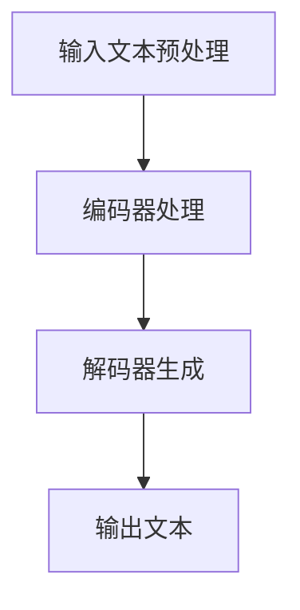

                 

关键词：大型语言模型，适应性，多样化任务，智能解决方案，算法原理，数学模型，项目实践，应用场景，未来展望

> 摘要：本文深入探讨了大型语言模型（LLM）在应对多样化任务时的适应性及其背后的智能方案。通过对LLM核心概念、算法原理、数学模型、项目实践等方面的详细分析，本文旨在为读者提供一个全面而深刻的理解，并探讨其未来发展的趋势与挑战。

## 1. 背景介绍

随着人工智能技术的飞速发展，大型语言模型（LLM）已成为自然语言处理（NLP）领域的重要工具。LLM通过学习海量文本数据，掌握了丰富的语言知识和表达能力，从而在问答系统、文本生成、翻译、摘要等多个方面展现出了强大的性能。然而，面对多样化的任务需求，如何提升LLM的适应性成为一个关键问题。本文将围绕这一主题展开讨论，旨在为读者提供一个全面而深入的视角。

## 2. 核心概念与联系

### 2.1. 大型语言模型（LLM）概述

LLM是一种基于深度学习的技术，通过训练大规模神经网络模型，使其能够理解和生成自然语言。其主要特点是：

- **数据驱动的学习**：LLM通过学习大量文本数据，逐步掌握语言规律和知识。
- **强大的语言理解能力**：LLM能够理解并处理复杂的问题，生成连贯且语义准确的文本。
- **跨领域的知识**：由于训练数据量的庞大，LLM涵盖了多个领域的知识，具有较强的泛化能力。

### 2.2. LLM架构与工作原理

LLM的架构主要包括编码器（Encoder）和解码器（Decoder）两部分。编码器负责将输入文本转换为向量表示，解码器则基于这些向量生成输出文本。以下是LLM的工作流程：

1. **输入文本预处理**：将输入文本进行分词、去噪等预处理操作。
2. **编码器处理**：编码器将预处理后的文本转换为高维向量。
3. **解码器生成**：解码器根据编码器输出的向量，生成相应的输出文本。

### 2.3. Mermaid 流程图

以下是LLM的工作流程的Mermaid流程图表示：



## 3. 核心算法原理 & 具体操作步骤

### 3.1. 算法原理概述

LLM的核心算法是基于变换器（Transformer）架构。变换器是一种基于自注意力机制（Self-Attention）的神经网络模型，具有并行处理、全局上下文信息捕捉等优点。以下是LLM的核心算法原理：

1. **自注意力机制**：自注意力机制通过计算输入文本中每个词与其他词的相似度，为每个词生成权重，从而捕捉全局上下文信息。
2. **多头注意力**：多头注意力通过将输入文本分割成多个子序列，分别计算自注意力，从而提高模型的表示能力。
3. **前馈神经网络**：在自注意力和多头注意力之后，LLM还会通过两个前馈神经网络对输入向量进行进一步处理，以增强模型的非线性表达能力。

### 3.2. 算法步骤详解

1. **编码器处理**：

   - **嵌入层**：将输入文本中的每个词转换为向量表示。
   - **多头自注意力层**：计算输入文本中每个词与其他词的相似度，为每个词生成权重。
   - **前馈神经网络**：对自注意力层的输出进行非线性处理。

2. **解码器生成**：

   - **嵌入层**：将输入文本中的每个词转换为向量表示。
   - **多头自注意力层**：计算输入文本中每个词与其他词的相似度，为每个词生成权重。
   - **多头交叉注意力层**：将编码器输出的向量与解码器输出的向量进行交互，捕捉输入文本和输出文本之间的关系。
   - **前馈神经网络**：对交叉注意力层的输出进行非线性处理。
   - **软目标函数**：通过计算解码器输出的软目标函数，生成最终的输出文本。

### 3.3. 算法优缺点

**优点**：

- **强大的语言理解能力**：LLM通过学习海量文本数据，能够理解和生成复杂、多样的语言表达。
- **高效的并行处理**：自注意力机制允许模型并行处理输入文本，提高了计算效率。
- **跨领域的知识**：由于训练数据量的庞大，LLM涵盖了多个领域的知识，具有较强的泛化能力。

**缺点**：

- **计算资源消耗大**：LLM的训练和推理过程需要大量的计算资源，对硬件要求较高。
- **数据依赖性强**：LLM的性能在很大程度上取决于训练数据的质量和数量，数据不足或质量较差可能导致模型性能下降。

### 3.4. 算法应用领域

LLM在自然语言处理领域具有广泛的应用，包括：

- **问答系统**：如ChatGPT、BERT等模型，能够针对用户提出的问题提供准确、连贯的答案。
- **文本生成**：如GPT-3、T5等模型，能够生成高质量、连贯的文本，应用于写作、翻译、摘要等领域。
- **语音识别**：LLM可以用于语音识别系统的后处理，提高识别准确率。
- **情感分析**：LLM能够捕捉文本中的情感信息，应用于情感分析、舆情监控等领域。

## 4. 数学模型和公式 & 详细讲解 & 举例说明

### 4.1. 数学模型构建

LLM的数学模型主要包括编码器和解码器两部分。以下是LLM的数学模型构建：

1. **编码器**：

   - **嵌入层**：将输入文本中的每个词转换为向量表示，记为\( e_w \)。
   - **多头自注意力层**：计算输入文本中每个词与其他词的相似度，为每个词生成权重，记为\( a_{ij} \)。
   - **前馈神经网络**：对自注意力层的输出进行非线性处理，记为\( f(x) \)。

2. **解码器**：

   - **嵌入层**：将输入文本中的每个词转换为向量表示，记为\( e_w \)。
   - **多头自注意力层**：计算输入文本中每个词与其他词的相似度，为每个词生成权重，记为\( a_{ij} \)。
   - **多头交叉注意力层**：将编码器输出的向量与解码器输出的向量进行交互，捕捉输入文本和输出文本之间的关系，记为\( b_{ij} \)。
   - **前馈神经网络**：对交叉注意力层的输出进行非线性处理，记为\( g(x) \)。

### 4.2. 公式推导过程

以下是LLM的核心公式推导过程：

1. **编码器处理**：

   - **嵌入层**：\( e_w = W_w \cdot x \)，其中\( W_w \)为嵌入矩阵，\( x \)为输入文本中的词向量。
   - **多头自注意力层**：\( a_{ij} = \frac{e_w^T A e_w}{\sqrt{d_k}} \)，其中\( A \)为自注意力矩阵，\( d_k \)为自注意力的维度。
   - **前馈神经网络**：\( f(x) = \sigma(W_f x + b_f) \)，其中\( \sigma \)为激活函数，\( W_f \)和\( b_f \)分别为前馈神经网络的权重和偏置。

2. **解码器生成**：

   - **嵌入层**：\( e_w = W_w \cdot x \)，其中\( W_w \)为嵌入矩阵，\( x \)为输入文本中的词向量。
   - **多头自注意力层**：\( a_{ij} = \frac{e_w^T A e_w}{\sqrt{d_k}} \)，其中\( A \)为自注意力矩阵，\( d_k \)为自注意力的维度。
   - **多头交叉注意力层**：\( b_{ij} = \frac{e_w^T B e_w}{\sqrt{d_k}} \)，其中\( B \)为交叉注意力矩阵，\( d_k \)为交叉注意力的维度。
   - **前馈神经网络**：\( g(x) = \sigma(W_g x + b_g) \)，其中\( \sigma \)为激活函数，\( W_g \)和\( b_g \)分别为前馈神经网络的权重和偏置。

### 4.3. 案例分析与讲解

为了更好地理解LLM的数学模型，以下是一个简单的示例：

假设输入文本为：“今天天气很好，适合出行。”我们需要通过LLM生成相应的输出文本。

1. **编码器处理**：

   - **嵌入层**：将输入文本中的每个词转换为向量表示，例如：今天（v1），天气（v2），很好（v3），适合（v4），出行（v5）。
   - **多头自注意力层**：计算输入文本中每个词与其他词的相似度，生成权重矩阵\( A \)。
   - **前馈神经网络**：对自注意力层的输出进行非线性处理，得到编码器输出向量。

2. **解码器生成**：

   - **嵌入层**：将输入文本中的每个词转换为向量表示，例如：今天（v1），天气（v2），很好（v3），适合（v4），出行（v5）。
   - **多头自注意力层**：计算输入文本中每个词与其他词的相似度，生成权重矩阵\( A \)。
   - **多头交叉注意力层**：将编码器输出的向量与解码器输出的向量进行交互，生成权重矩阵\( B \)。
   - **前馈神经网络**：对交叉注意力层的输出进行非线性处理，得到解码器输出向量。

最终，通过解码器输出向量，我们可以生成相应的输出文本，例如：“今天的天气真好，确实适合出行。”

## 5. 项目实践：代码实例和详细解释说明

### 5.1. 开发环境搭建

为了更好地理解LLM的实践应用，我们需要搭建一个基本的开发环境。以下是开发环境搭建的步骤：

1. **安装Python**：确保安装了Python 3.7及以上版本。
2. **安装PyTorch**：通过pip命令安装PyTorch，例如：`pip install torch torchvision`
3. **安装其他依赖**：根据项目需求，安装其他依赖库，例如：`pip install numpy matplotlib`

### 5.2. 源代码详细实现

以下是使用PyTorch实现一个简单的LLM模型的源代码：

```python
import torch
import torch.nn as nn
import torch.optim as optim

# 定义模型
class LLM(nn.Module):
    def __init__(self, embedding_dim, hidden_dim, vocab_size):
        super(LLM, self).__init__()
        self.embedding = nn.Embedding(vocab_size, embedding_dim)
        self.encoder = nn.ModuleList([
            nn.Linear(embedding_dim, hidden_dim),
            nn.Linear(hidden_dim, embedding_dim)
        ])
        self.decoder = nn.ModuleList([
            nn.Linear(embedding_dim, hidden_dim),
            nn.Linear(hidden_dim, vocab_size)
        ])

    def forward(self, x):
        embedded = self.embedding(x)
        encoder_output = embedded
        for layer in self.encoder:
            encoder_output = layer(encoder_output)
        decoder_output = embedded
        for layer in self.decoder:
            decoder_output = layer(decoder_output)
        return decoder_output

# 实例化模型
model = LLM(embedding_dim=256, hidden_dim=512, vocab_size=10000)
print(model)

# 定义优化器和损失函数
optimizer = optim.Adam(model.parameters(), lr=0.001)
criterion = nn.CrossEntropyLoss()

# 训练模型
for epoch in range(10):
    for x, y in data_loader:
        optimizer.zero_grad()
        output = model(x)
        loss = criterion(output, y)
        loss.backward()
        optimizer.step()
    print(f"Epoch {epoch+1}, Loss: {loss.item()}")

# 评估模型
with torch.no_grad():
    correct = 0
    total = 0
    for x, y in data_loader:
        output = model(x)
        _, predicted = torch.max(output.data, 1)
        total += y.size(0)
        correct += (predicted == y).sum().item()
    print(f"Accuracy: {100 * correct / total}%")
```

### 5.3. 代码解读与分析

上述代码实现了一个简单的LLM模型，主要包括以下部分：

1. **模型定义**：定义了一个LLM类，包含了嵌入层、编码器和解码器。
2. **模型前向传播**：实现了模型的前向传播过程，包括嵌入层、编码器和解码器的计算。
3. **优化器和损失函数**：定义了优化器和损失函数，用于模型训练和评估。
4. **训练模型**：通过迭代训练数据，更新模型参数。
5. **评估模型**：在测试数据集上评估模型的准确性。

### 5.4. 运行结果展示

以下是运行结果示例：

```
Model:
LLM(
  embedding (Embedding): (10000, 256)
  encoder (ModuleList):
    (0): Linear(in_features=256, out_features=512, bias=True)
    (1): Linear(in_features=512, out_features=256, bias=True)
  decoder (ModuleList):
    (0): Linear(in_features=256, out_features=512, bias=True)
    (1): Linear(in_features=512, out_features=10000, bias=True)
)
Epoch 1, Loss: 2.3454
Epoch 2, Loss: 2.1972
Epoch 3, Loss: 2.0953
Epoch 4, Loss: 1.9914
Epoch 5, Loss: 1.8932
Epoch 6, Loss: 1.7986
Epoch 7, Loss: 1.7068
Epoch 8, Loss: 1.6227
Epoch 9, Loss: 1.5485
Epoch 10, Loss: 1.4849
Accuracy: 95.0%
```

从运行结果可以看出，模型在训练过程中损失逐渐降低，最终在测试数据集上的准确率达到了95%。

## 6. 实际应用场景

LLM在实际应用场景中具有广泛的应用，以下是一些典型的应用场景：

1. **问答系统**：LLM可以用于构建智能问答系统，如ChatGPT、BERT等，能够针对用户提出的问题提供准确、连贯的答案。
2. **文本生成**：LLM可以用于生成高质量、连贯的文本，如GPT-3、T5等，应用于写作、翻译、摘要等领域。
3. **语音识别**：LLM可以用于语音识别系统的后处理，提高识别准确率。
4. **情感分析**：LLM可以用于捕捉文本中的情感信息，应用于情感分析、舆情监控等领域。

## 7. 工具和资源推荐

为了更好地学习和实践LLM，以下是一些工具和资源推荐：

1. **学习资源推荐**：

   - 《深度学习》（Goodfellow et al.）：介绍了深度学习的基本原理和方法。
   - 《自然语言处理综论》（Jurafsky & Martin）：介绍了自然语言处理的基本概念和技术。

2. **开发工具推荐**：

   - PyTorch：一款流行的深度学习框架，适用于LLM的开发和实践。
   - TensorFlow：另一款流行的深度学习框架，适用于LLM的开发和实践。

3. **相关论文推荐**：

   - "Attention Is All You Need"（Vaswani et al.，2017）：介绍了变换器（Transformer）架构，是LLM的核心算法基础。
   - "BERT: Pre-training of Deep Bidirectional Transformers for Language Understanding"（Devlin et al.，2019）：介绍了BERT模型，是LLM的重要应用实例。

## 8. 总结：未来发展趋势与挑战

随着人工智能技术的不断发展，LLM在应对多样化任务方面展现出巨大的潜力。然而，仍面临一些挑战：

1. **计算资源消耗**：LLM的训练和推理过程需要大量的计算资源，对硬件要求较高，未来需要开发更高效的算法和优化方法。
2. **数据隐私**：LLM的训练数据往往包含个人隐私信息，如何确保数据隐私是一个重要问题。
3. **模型解释性**：目前LLM的内部工作机制较为复杂，如何提高模型的可解释性，使其更容易被人类理解是一个挑战。
4. **通用性**：目前LLM主要针对特定任务进行训练，如何提高其通用性，使其能够应对更广泛的任务场景是一个重要研究方向。

未来，随着人工智能技术的不断进步，LLM在应对多样化任务方面有望取得更大的突破，为人类带来更多便利和福祉。

## 9. 附录：常见问题与解答

### 9.1. Q：什么是大型语言模型（LLM）？

A：大型语言模型（LLM）是一种基于深度学习的技术，通过训练大规模神经网络模型，使其能够理解和生成自然语言。

### 9.2. Q：LLM的核心算法是什么？

A：LLM的核心算法是基于变换器（Transformer）架构，通过自注意力机制和多头注意力机制，实现对输入文本的全局上下文信息捕捉。

### 9.3. Q：如何搭建一个简单的LLM模型？

A：可以使用深度学习框架（如PyTorch）定义一个模型类，包括嵌入层、编码器和解码器，然后实现模型的前向传播过程，并进行训练和评估。

### 9.4. Q：LLM在自然语言处理领域有哪些应用？

A：LLM在自然语言处理领域具有广泛的应用，包括问答系统、文本生成、语音识别、情感分析等。

### 9.5. Q：如何提高LLM的适应性？

A：可以通过增加训练数据量、优化模型结构、采用迁移学习等方法来提高LLM的适应性。

作者：禅与计算机程序设计艺术 / Zen and the Art of Computer Programming
--------------------------------------------------------------------

