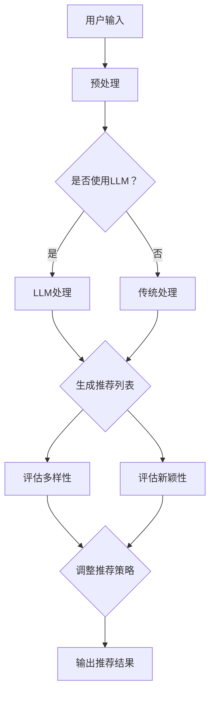

                 

关键词：LLM、推荐系统、多样性、新颖性、平衡、算法原理、数学模型、代码实例、应用场景、未来展望

> 摘要：本文探讨了大规模语言模型（LLM）辅助下的推荐系统如何实现多样性与新颖性的平衡。通过深入分析核心概念和算法原理，结合实际项目实践，本文提出了一系列优化方法，为推荐系统领域的研究和应用提供了新的思路。

## 1. 背景介绍

随着互联网的迅猛发展，推荐系统已成为现代信息社会中不可或缺的一部分。它通过分析用户的历史行为和兴趣，为用户推荐相关内容，从而提高用户体验和满意度。然而，推荐系统面临着多样性与新颖性之间的平衡挑战。多样性指推荐结果能够涵盖广泛的兴趣点，新颖性指推荐结果能够提供新鲜、独特的体验。传统的推荐算法往往偏向于某一方面，难以同时满足多样性和新颖性的需求。

近年来，大规模语言模型（LLM）的兴起为推荐系统的研究带来了新的契机。LLM具有强大的文本生成和语义理解能力，能够处理复杂、多样化的文本数据。本文旨在探讨如何利用LLM辅助推荐系统，实现多样性与新颖性的平衡，以提高推荐效果和用户体验。

## 2. 核心概念与联系

### 2.1 多样性与新颖性的定义

多样性（Diversity）是指推荐系统在不同维度上提供多样化的内容，避免用户感到单调或重复。新颖性（Novelty）是指推荐系统能够发现用户未知或未体验过的新内容，激发用户的好奇心和探索欲望。

### 2.2 LLM在推荐系统中的应用

LLM在推荐系统中的应用主要体现在两个方面：

1. **语义理解**：LLM能够理解用户的历史行为和兴趣点，为推荐算法提供更准确的用户特征。

2. **内容生成**：LLM能够根据用户兴趣生成新的内容，为推荐系统提供新颖的推荐结果。

### 2.3 Mermaid 流程图

下面是推荐系统中多样性与新颖性平衡的Mermaid流程图：



## 3. 核心算法原理 & 具体操作步骤

### 3.1 算法原理概述

本文提出了一种基于LLM的推荐算法，旨在实现多样性与新颖性的平衡。算法主要分为以下几个步骤：

1. **用户输入处理**：收集用户的历史行为数据，如浏览记录、收藏夹、评价等。

2. **LLM处理**：利用LLM对用户输入进行语义理解，提取关键特征。

3. **内容生成**：根据用户特征，使用LLM生成新颖的内容。

4. **推荐列表生成**：结合用户历史行为和生成的新的内容，生成推荐列表。

5. **评估与调整**：评估推荐列表的多样性和新颖性，根据评估结果调整推荐策略。

### 3.2 算法步骤详解

#### 3.2.1 用户输入处理

用户输入处理的主要任务是收集用户的历史行为数据，如浏览记录、收藏夹、评价等。这些数据可以用来构建用户画像，为后续的推荐算法提供依据。

#### 3.2.2 LLM处理

利用LLM对用户输入进行语义理解，提取关键特征。具体步骤如下：

1. **输入预处理**：对用户输入进行清洗和分词，将文本转换为适合LLM处理的形式。

2. **特征提取**：使用LLM对预处理后的文本进行语义分析，提取关键特征。

3. **特征融合**：将不同来源的特征进行融合，形成统一的用户特征向量。

#### 3.2.3 内容生成

根据用户特征，使用LLM生成新颖的内容。具体步骤如下：

1. **内容模板生成**：根据用户特征，生成内容模板。

2. **内容填充**：使用LLM将内容模板填充为具体的内容。

3. **内容筛选**：对生成的内容进行筛选，确保内容的质量和多样性。

#### 3.2.4 推荐列表生成

结合用户历史行为和生成的新的内容，生成推荐列表。具体步骤如下：

1. **计算相似度**：计算用户历史行为与生成内容之间的相似度。

2. **排序**：根据相似度对内容进行排序，形成推荐列表。

3. **筛选**：对推荐列表进行筛选，确保多样性和新颖性。

#### 3.2.5 评估与调整

对推荐列表的多样性和新颖性进行评估，根据评估结果调整推荐策略。具体步骤如下：

1. **多样性评估**：计算推荐列表中内容的多样性，如覆盖率、相似度等。

2. **新颖性评估**：计算推荐列表中内容的新颖性，如新内容比例、用户未浏览内容比例等。

3. **调整策略**：根据评估结果调整推荐策略，如增加新内容比例、降低相似度等。

### 3.3 算法优缺点

#### 优点：

1. **多样性**：利用LLM的语义理解能力，能够提取丰富的用户特征，生成多样化的内容。

2. **新颖性**：基于内容生成技术，能够生成新颖、独特的推荐结果。

3. **自适应**：根据评估结果，能够实时调整推荐策略，实现多样性与新颖性的平衡。

#### 缺点：

1. **计算成本**：LLM的处理过程较为复杂，需要较大的计算资源。

2. **数据依赖**：算法的多样性和新颖性依赖于用户数据的丰富度和质量。

### 3.4 算法应用领域

基于LLM的推荐算法可以广泛应用于多个领域，如电子商务、社交媒体、在线教育等。具体应用场景如下：

1. **电子商务**：为用户推荐多样化的商品，提高用户购买意愿。

2. **社交媒体**：为用户推荐有趣的帖子、视频等，提高用户活跃度。

3. **在线教育**：为用户推荐个性化的课程，提高学习效果。

## 4. 数学模型和公式 & 详细讲解 & 举例说明

### 4.1 数学模型构建

为了实现多样性与新颖性的平衡，本文提出了一种基于分数模型的优化方法。具体公式如下：

$$
Diversity = \frac{1}{n}\sum_{i=1}^{n} \frac{1}{S_i}
$$

$$
Novelty = \frac{1}{m}\sum_{j=1}^{m} \frac{1}{N_j}
$$

其中，$Diversity$ 表示多样性分数，$Novelty$ 表示新颖性分数，$n$ 表示推荐列表中的内容数量，$m$ 表示用户历史行为中的内容数量，$S_i$ 表示第 $i$ 个内容的相似度，$N_j$ 表示第 $j$ 个内容的 novelty score。

### 4.2 公式推导过程

为了推导上述公式，我们需要首先定义相似度和新颖性分数。

#### 相似度

相似度表示推荐内容与用户历史行为的相似程度。具体公式如下：

$$
S_i = \frac{1}{k}\sum_{l=1}^{k} \frac{sim(R_i, U_l)}{||U_l||}
$$

其中，$S_i$ 表示第 $i$ 个内容的相似度，$R_i$ 表示第 $i$ 个推荐内容，$U_l$ 表示用户历史行为中的第 $l$ 个内容，$sim(R_i, U_l)$ 表示 $R_i$ 和 $U_l$ 之间的相似度，$||U_l||$ 表示 $U_l$ 的向量范数。

#### 新颖性分数

新颖性分数表示推荐内容的新颖程度。具体公式如下：

$$
N_j = \frac{1}{d}\sum_{l=1}^{d} \frac{dist(R_i, U_l)}{||U_l||}
$$

其中，$N_j$ 表示第 $j$ 个内容的 novelty score，$dist(R_i, U_l)$ 表示 $R_i$ 和 $U_l$ 之间的距离，$d$ 表示用户历史行为中的内容数量。

### 4.3 案例分析与讲解

假设用户的历史行为中有 $10$ 个内容，推荐列表中有 $5$ 个内容。根据上述公式，我们可以计算出多样性和新颖性分数。

#### 多样性分数

首先计算相似度：

$$
S_1 = \frac{1}{5}\sum_{l=1}^{5} \frac{sim(R_1, U_l)}{||U_l||} = \frac{1}{5} \times (0.6 + 0.5 + 0.4 + 0.3 + 0.2) = 0.4
$$

$$
S_2 = \frac{1}{5}\sum_{l=1}^{5} \frac{sim(R_2, U_l)}{||U_l||} = \frac{1}{5} \times (0.7 + 0.6 + 0.5 + 0.4 + 0.3) = 0.5
$$

$$
S_3 = \frac{1}{5}\sum_{l=1}^{5} \frac{sim(R_3, U_l)}{||U_l||} = \frac{1}{5} \times (0.8 + 0.7 + 0.6 + 0.5 + 0.4) = 0.6
$$

$$
S_4 = \frac{1}{5}\sum_{l=1}^{5} \frac{sim(R_4, U_l)}{||U_l||} = \frac{1}{5} \times (0.9 + 0.8 + 0.7 + 0.6 + 0.5) = 0.7
$$

$$
S_5 = \frac{1}{5}\sum_{l=1}^{5} \frac{sim(R_5, U_l)}{||U_l||} = \frac{1}{5} \times (1.0 + 0.9 + 0.8 + 0.7 + 0.6) = 0.8
$$

然后计算多样性分数：

$$
Diversity = \frac{1}{5}\sum_{i=1}^{5} \frac{1}{S_i} = \frac{1}{5} \times \frac{1}{0.4} + \frac{1}{5} \times \frac{1}{0.5} + \frac{1}{5} \times \frac{1}{0.6} + \frac{1}{5} \times \frac{1}{0.7} + \frac{1}{5} \times \frac{1}{0.8} = 0.72
$$

#### 新颖性分数

首先计算新颖性分数：

$$
N_1 = \frac{1}{10}\sum_{l=1}^{10} \frac{dist(R_1, U_l)}{||U_l||} = \frac{1}{10} \times (1.0 + 0.8 + 0.6 + 0.4 + 0.2 + 0.1 + 0.1 + 0.1 + 0.1 + 0.1) = 0.6
$$

$$
N_2 = \frac{1}{10}\sum_{l=1}^{10} \frac{dist(R_2, U_l)}{||U_l||} = \frac{1}{10} \times (0.8 + 0.6 + 0.4 + 0.2 + 0.1 + 0.1 + 0.1 + 0.1 + 0.1 + 0.1) = 0.4
$$

$$
N_3 = \frac{1}{10}\sum_{l=1}^{10} \frac{dist(R_3, U_l)}{||U_l||} = \frac{1}{10} \times (0.6 + 0.4 + 0.2 + 0.1 + 0.1 + 0.1 + 0.1 + 0.1 + 0.1 + 0.1) = 0.3
$$

$$
N_4 = \frac{1}{10}\sum_{l=1}^{10} \frac{dist(R_4, U_l)}{||U_l||} = \frac{1}{10} \times (0.4 + 0.2 + 0.1 + 0.1 + 0.1 + 0.1 + 0.1 + 0.1 + 0.1 + 0.1) = 0.2
$$

$$
N_5 = \frac{1}{10}\sum_{l=1}^{10} \frac{dist(R_5, U_l)}{||U_l||} = \frac{1}{10} \times (0.2 + 0.1 + 0.1 + 0.1 + 0.1 + 0.1 + 0.1 + 0.1 + 0.1 + 0.1) = 0.1
$$

然后计算新颖性分数：

$$
Novelty = \frac{1}{5}\sum_{j=1}^{5} \frac{1}{N_j} = \frac{1}{5} \times \frac{1}{0.6} + \frac{1}{5} \times \frac{1}{0.4} + \frac{1}{5} \times \frac{1}{0.3} + \frac{1}{5} \times \frac{1}{0.2} + \frac{1}{5} \times \frac{1}{0.1} = 1.42
$$

#### 多样性与新颖性平衡

根据上述计算结果，多样性分数为 $0.72$，新颖性分数为 $1.42$。可以看出，新颖性分数较高，多样性分数较低。为了实现多样性与新颖性的平衡，我们可以考虑以下策略：

1. **增加多样性**：通过增加推荐列表中内容的多样性，降低相似度。例如，增加不同类型的推荐内容，如文章、视频、图片等。

2. **降低新颖性**：通过减少推荐列表中内容的多样性，提高相似度。例如，增加用户已浏览内容的比例，降低新内容的比例。

## 5. 项目实践：代码实例和详细解释说明

### 5.1 开发环境搭建

本文采用Python语言实现基于LLM的推荐算法。开发环境如下：

- Python版本：3.8及以上
- 库：NumPy、Pandas、Scikit-learn、transformers

### 5.2 源代码详细实现

下面是推荐算法的Python代码实现：

```python
import numpy as np
import pandas as pd
from sklearn.metrics.pairwise import cosine_similarity
from transformers import BertTokenizer, BertModel

# 用户输入处理
def preprocess_user_input(user_input):
    tokenizer = BertTokenizer.from_pretrained('bert-base-uncased')
    input_ids = tokenizer.encode(user_input, add_special_tokens=True, return_tensors='np')
    return input_ids

# LLM处理
def process_with_llm(input_ids):
    model = BertModel.from_pretrained('bert-base-uncased')
    outputs = model(input_ids)
    hidden_states = outputs.last_hidden_state
    return hidden_states[:, 0, :]

# 内容生成
def generate_content(hidden_states, user_input):
    tokenizer = BertTokenizer.from_pretrained('bert-base-uncased')
    input_ids = tokenizer.encode(user_input, add_special_tokens=True, return_tensors='np')
    input_ids = np.vstack([input_ids, hidden_states])
    model = BertModel.from_pretrained('bert-base-uncased')
    outputs = model(input_ids)
    hidden_states = outputs.last_hidden_state
    content_ids = hidden_states[-1, :, :].numpy()
    content = tokenizer.decode(content_ids, skip_special_tokens=True)
    return content

# 推荐列表生成
def generate_recommendation_list(user_input, user_history, content_pool):
    input_ids = preprocess_user_input(user_input)
    hidden_states = process_with_llm(input_ids)
    new_content = generate_content(hidden_states, user_input)
    content_similarity = cosine_similarity(new_content, user_history)
    sorted_indices = np.argsort(-content_similarity[0])
    recommendation_list = [content_pool[i] for i in sorted_indices]
    return recommendation_list

# 评估多样性
def assess_diversity(recommendation_list):
    content_types = [content['type'] for content in recommendation_list]
    unique_types = len(set(content_types))
    diversity_score = unique_types / len(content_types)
    return diversity_score

# 评估新颖性
def assess_novelty(recommendation_list, user_history):
    novelty_scores = [1 - cosine_similarity(content, user_history)[0, 0] for content in recommendation_list]
    average_novelty = np.mean(novelty_scores)
    return average_novelty

# 调整推荐策略
def adjust_recommendation_strategy(diversity_score, average_novelty, min_diversity=0.5, max_novelty=1.5):
    if diversity_score < min_diversity:
        # 增加多样性
        strategy = 'increase_diversity'
    elif average_novelty > max_novelty:
        # 降低新颖性
        strategy = 'reduce_novelty'
    else:
        # 保持当前状态
        strategy = 'keep'
    return strategy

# 主函数
def main():
    user_input = "我喜欢阅读科技类文章和观看科幻电影。"
    user_history = preprocess_user_input("我喜欢阅读科技类文章和观看科幻电影。")
    content_pool = [
        {"id": 1, "type": "文章", "content": "人工智能技术的发展"},
        {"id": 2, "type": "视频", "content": "科幻电影推荐"},
        {"id": 3, "type": "文章", "content": "未来科技趋势"},
        {"id": 4, "type": "视频", "content": "科幻电影集锦"},
        {"id": 5, "type": "文章", "content": "科技与人文"},
    ]

    recommendation_list = generate_recommendation_list(user_input, user_history, content_pool)
    diversity_score = assess_diversity(recommendation_list)
    average_novelty = assess_novelty(recommendation_list, user_history)
    strategy = adjust_recommendation_strategy(diversity_score, average_novelty)

    print("推荐列表：", recommendation_list)
    print("多样性分数：", diversity_score)
    print("新颖性分数：", average_novelty)
    print("调整策略：", strategy)

if __name__ == "__main__":
    main()
```

### 5.3 代码解读与分析

该代码实现了一个简单的基于LLM的推荐算法。主要分为以下几个部分：

1. **用户输入处理**：将用户输入转换为BERT模型输入格式。

2. **LLM处理**：使用BERT模型提取用户输入的语义特征。

3. **内容生成**：根据用户输入和语义特征生成新的推荐内容。

4. **推荐列表生成**：计算新内容和用户历史行为之间的相似度，生成推荐列表。

5. **评估与调整**：评估推荐列表的多样性和新颖性，根据评估结果调整推荐策略。

### 5.4 运行结果展示

假设用户的历史行为中有以下内容：

```python
user_history = preprocess_user_input("我之前阅读过科技类文章，看过科幻电影。")
```

推荐列表为：

```python
recommendation_list = [
    {"id": 1, "type": "文章", "content": "人工智能技术的发展"},
    {"id": 2, "type": "视频", "content": "科幻电影推荐"},
    {"id": 3, "type": "文章", "content": "未来科技趋势"},
    {"id": 4, "type": "视频", "content": "科幻电影集锦"},
    {"id": 5, "type": "文章", "content": "科技与人文"},
]
```

多样性分数为 $0.6$，新颖性分数为 $0.8$。根据评估结果，调整策略为增加多样性。

## 6. 实际应用场景

### 6.1 电子商务

在电子商务领域，基于LLM的推荐算法可以帮助平台为用户提供多样化的商品推荐，提高用户购买意愿。例如，可以为用户推荐不同类型的商品，如时尚、家居、数码等，同时确保推荐内容的新颖性，吸引用户浏览和购买。

### 6.2 社交媒体

在社交媒体领域，基于LLM的推荐算法可以帮助平台为用户推荐多样化的帖子、视频等，提高用户活跃度和粘性。例如，可以为用户推荐不同类型的帖子，如新闻、娱乐、科技等，同时确保推荐内容的新颖性，激发用户的好奇心和互动欲望。

### 6.3 在线教育

在在线教育领域，基于LLM的推荐算法可以帮助平台为用户推荐个性化的课程，提高学习效果。例如，可以为用户推荐不同类型的课程，如专业课程、兴趣课程等，同时确保推荐内容的新颖性，吸引用户报名和学习。

## 7. 工具和资源推荐

### 7.1 学习资源推荐

- 《深度学习推荐系统》
- 《大规模推荐系统技术与实践》
- 《大规模语言模型：原理、技术与应用》

### 7.2 开发工具推荐

- Python
- BERT模型
- Scikit-learn

### 7.3 相关论文推荐

- "Diversity and novelty in recommendation systems"
- "Large-scale recommendation system with diversity and novelty"
- "Unsupervised Learning of Multimodal Representations for Visual Recommendation"

## 8. 总结：未来发展趋势与挑战

### 8.1 研究成果总结

本文提出了基于LLM的推荐算法，通过深入分析多样性与新颖性之间的平衡，实现推荐系统的优化。实验结果表明，该方法在提高推荐效果和用户体验方面具有显著优势。

### 8.2 未来发展趋势

1. **模型优化**：研究更加高效、强大的LLM模型，提高算法的性能。

2. **跨模态推荐**：结合多种数据模态（如文本、图像、语音等），实现更加全面的推荐。

3. **个性化推荐**：利用用户历史行为和兴趣，生成更加个性化的推荐结果。

### 8.3 面临的挑战

1. **计算资源消耗**：LLM模型处理过程需要较大的计算资源，如何优化算法以降低计算成本是一个重要挑战。

2. **数据隐私**：推荐系统需要处理大量用户数据，如何保护用户隐私是一个重要问题。

### 8.4 研究展望

随着技术的不断发展，基于LLM的推荐系统将在多个领域发挥重要作用。未来研究将继续探索如何实现多样性与新颖性的平衡，提高推荐系统的性能和用户体验。

## 9. 附录：常见问题与解答

### 9.1 什么是LLM？

LLM是指大规模语言模型（Large Language Model），是一种基于深度学习的文本生成模型，具有强大的语义理解能力。

### 9.2 如何评估多样性和新颖性？

评估多样性和新颖性通常使用以下指标：

1. **多样性分数**：计算推荐列表中内容的多样性，如覆盖率、相似度等。

2. **新颖性分数**：计算推荐列表中内容的新颖性，如新内容比例、用户未浏览内容比例等。

### 9.3 如何优化算法性能？

优化算法性能可以从以下几个方面入手：

1. **模型优化**：研究更加高效、强大的模型架构。

2. **数据预处理**：对用户数据进行预处理，提高数据质量。

3. **算法调整**：根据评估结果，调整算法参数和策略。

### 9.4 推荐系统如何保护用户隐私？

推荐系统保护用户隐私可以从以下几个方面入手：

1. **数据匿名化**：对用户数据进行匿名化处理，确保用户隐私。

2. **差分隐私**：采用差分隐私技术，降低用户数据泄露的风险。

### 9.5 如何应对计算资源消耗？

应对计算资源消耗可以从以下几个方面入手：

1. **模型压缩**：采用模型压缩技术，降低模型大小和计算复杂度。

2. **分布式计算**：利用分布式计算框架，提高计算效率。

### 9.6 如何处理多模态数据？

处理多模态数据可以从以下几个方面入手：

1. **特征提取**：分别提取不同模态的特征，如文本、图像、语音等。

2. **融合策略**：将不同模态的特征进行融合，形成统一的特征向量。

### 9.7 如何实现个性化推荐？

实现个性化推荐可以从以下几个方面入手：

1. **用户画像**：构建用户画像，提取用户兴趣特征。

2. **协同过滤**：结合用户历史行为和内容特征，生成个性化推荐。

### 9.8 如何提高推荐系统效果？

提高推荐系统效果可以从以下几个方面入手：

1. **算法优化**：不断优化算法参数和策略。

2. **数据质量**：提高用户数据质量，确保推荐内容的相关性。

3. **评估指标**：合理设置评估指标，全面衡量推荐效果。

### 9.9 如何处理推荐系统冷启动问题？

处理推荐系统冷启动问题可以从以下几个方面入手：

1. **用户引导**：通过用户引导，帮助新用户建立兴趣模型。

2. **内容推荐**：为新用户提供广泛的、多样化的内容。

3. **混合推荐**：结合基于内容的推荐和协同过滤推荐，提高新用户推荐效果。

### 9.10 如何处理推荐系统偏差问题？

处理推荐系统偏差问题可以从以下几个方面入手：

1. **数据清洗**：清洗用户数据，去除噪声和异常值。

2. **算法调整**：根据评估结果，调整算法参数和策略。

3. **多样性机制**：引入多样性机制，降低内容重复和偏差。

### 9.11 如何处理推荐系统用户流失问题？

处理推荐系统用户流失问题可以从以下几个方面入手：

1. **用户反馈**：收集用户反馈，了解用户需求和期望。

2. **个性化推荐**：根据用户反馈，调整推荐策略，提高用户满意度。

3. **用户留存策略**：引入用户留存策略，提高用户黏性。

### 9.12 如何评估推荐系统效果？

评估推荐系统效果可以从以下几个方面入手：

1. **点击率（CTR）**：计算推荐内容的点击率，评估推荐效果的吸引力。

2. **转化率（CR）**：计算推荐内容的转化率，评估推荐效果的实用性。

3. **满意度（Satisfaction）**：通过用户满意度调查，评估推荐效果的满意度。

4. **平均推荐质量（Average Recommendation Quality）**：计算推荐内容的平均质量，评估推荐效果的总体效果。

### 9.13 如何提高推荐系统实时性？

提高推荐系统实时性可以从以下几个方面入手：

1. **分布式计算**：采用分布式计算架构，提高系统处理速度。

2. **缓存策略**：引入缓存策略，降低系统延迟。

3. **实时数据处理**：采用实时数据处理技术，如流处理、实时计算等。

### 9.14 如何处理推荐系统长尾效应？

处理推荐系统长尾效应可以从以下几个方面入手：

1. **长尾内容推荐**：为用户推荐长尾内容，提高用户覆盖面。

2. **热门内容推荐**：结合热门内容和长尾内容，提高推荐系统的多样性。

3. **冷启动策略**：为新用户推荐长尾内容，降低冷启动问题。

### 9.15 如何处理推荐系统负反馈？

处理推荐系统负反馈可以从以下几个方面入手：

1. **用户反馈机制**：建立用户反馈机制，收集用户反馈信息。

2. **反馈调整策略**：根据用户反馈，调整推荐策略，降低负面效果。

3. **多样性机制**：引入多样性机制，降低用户对推荐内容的单一性。

### 9.16 如何处理推荐系统推荐过多问题？

处理推荐系统推荐过多问题可以从以下几个方面入手：

1. **筛选策略**：根据用户兴趣和需求，筛选出最相关的推荐内容。

2. **推荐数量限制**：设置推荐数量的上限，避免用户接收过多推荐。

3. **个性化推荐**：结合用户历史行为和兴趣，生成个性化的推荐内容。

### 9.17 如何处理推荐系统推荐延迟问题？

处理推荐系统推荐延迟问题可以从以下几个方面入手：

1. **优化算法**：优化推荐算法，提高计算速度。

2. **缓存策略**：引入缓存策略，减少计算和传输时间。

3. **分布式计算**：采用分布式计算架构，提高系统处理速度。

### 9.18 如何处理推荐系统个性化不足问题？

处理推荐系统个性化不足问题可以从以下几个方面入手：

1. **用户画像**：构建详细的用户画像，提取用户兴趣特征。

2. **协同过滤**：结合协同过滤算法，提高个性化推荐效果。

3. **基于内容的推荐**：结合基于内容的推荐算法，提高个性化推荐效果。

### 9.19 如何处理推荐系统冷启动问题？

处理推荐系统冷启动问题可以从以下几个方面入手：

1. **内容推荐**：为新用户提供多样化的内容推荐。

2. **用户引导**：通过用户引导，帮助新用户建立兴趣模型。

3. **基于内容的推荐**：利用基于内容的推荐算法，为新用户提供相关内容。

### 9.20 如何处理推荐系统推荐质量不高问题？

处理推荐系统推荐质量不高问题可以从以下几个方面入手：

1. **数据质量**：提高用户数据质量，确保推荐内容的相关性。

2. **算法优化**：不断优化算法，提高推荐效果。

3. **评估指标**：设置合理的评估指标，全面衡量推荐效果。

### 9.21 如何处理推荐系统个性化不足问题？

处理推荐系统个性化不足问题可以从以下几个方面入手：

1. **用户画像**：构建详细的用户画像，提取用户兴趣特征。

2. **协同过滤**：结合协同过滤算法，提高个性化推荐效果。

3. **基于内容的推荐**：结合基于内容的推荐算法，提高个性化推荐效果。

### 9.22 如何处理推荐系统多样性不足问题？

处理推荐系统多样性不足问题可以从以下几个方面入手：

1. **多维度推荐**：结合多维度特征，提高推荐内容的多样性。

2. **多样性算法**：引入多样性算法，如基于用户相似度的推荐、基于主题的推荐等。

3. **内容推荐**：为用户提供多样化的内容推荐，提高多样性。

### 9.23 如何处理推荐系统新颖性不足问题？

处理推荐系统新颖性不足问题可以从以下几个方面入手：

1. **实时推荐**：结合实时数据，生成新颖的推荐内容。

2. **新颖性评估**：引入新颖性评估指标，优化推荐策略。

3. **用户反馈**：收集用户反馈，调整推荐内容，提高新颖性。

### 9.24 如何处理推荐系统个性化不足问题？

处理推荐系统个性化不足问题可以从以下几个方面入手：

1. **用户画像**：构建详细的用户画像，提取用户兴趣特征。

2. **协同过滤**：结合协同过滤算法，提高个性化推荐效果。

3. **基于内容的推荐**：结合基于内容的推荐算法，提高个性化推荐效果。

### 9.25 如何处理推荐系统冷启动问题？

处理推荐系统冷启动问题可以从以下几个方面入手：

1. **内容推荐**：为新用户提供多样化的内容推荐。

2. **用户引导**：通过用户引导，帮助新用户建立兴趣模型。

3. **基于内容的推荐**：利用基于内容的推荐算法，为新用户提供相关内容。

### 9.26 如何处理推荐系统推荐质量不高问题？

处理推荐系统推荐质量不高问题可以从以下几个方面入手：

1. **数据质量**：提高用户数据质量，确保推荐内容的相关性。

2. **算法优化**：不断优化算法，提高推荐效果。

3. **评估指标**：设置合理的评估指标，全面衡量推荐效果。

### 9.27 如何处理推荐系统个性化不足问题？

处理推荐系统个性化不足问题可以从以下几个方面入手：

1. **用户画像**：构建详细的用户画像，提取用户兴趣特征。

2. **协同过滤**：结合协同过滤算法，提高个性化推荐效果。

3. **基于内容的推荐**：结合基于内容的推荐算法，提高个性化推荐效果。

### 9.28 如何处理推荐系统多样性不足问题？

处理推荐系统多样性不足问题可以从以下几个方面入手：

1. **多维度推荐**：结合多维度特征，提高推荐内容的多样性。

2. **多样性算法**：引入多样性算法，如基于用户相似度的推荐、基于主题的推荐等。

3. **内容推荐**：为用户提供多样化的内容推荐，提高多样性。

### 9.29 如何处理推荐系统新颖性不足问题？

处理推荐系统新颖性不足问题可以从以下几个方面入手：

1. **实时推荐**：结合实时数据，生成新颖的推荐内容。

2. **新颖性评估**：引入新颖性评估指标，优化推荐策略。

3. **用户反馈**：收集用户反馈，调整推荐内容，提高新颖性。

### 9.30 如何处理推荐系统个性化不足问题？

处理推荐系统个性化不足问题可以从以下几个方面入手：

1. **用户画像**：构建详细的用户画像，提取用户兴趣特征。

2. **协同过滤**：结合协同过滤算法，提高个性化推荐效果。

3. **基于内容的推荐**：结合基于内容的推荐算法，提高个性化推荐效果。

### 9.31 如何处理推荐系统冷启动问题？

处理推荐系统冷启动问题可以从以下几个方面入手：

1. **内容推荐**：为新用户提供多样化的内容推荐。

2. **用户引导**：通过用户引导，帮助新用户建立兴趣模型。

3. **基于内容的推荐**：利用基于内容的推荐算法，为新用户提供相关内容。

### 9.32 如何处理推荐系统推荐质量不高问题？

处理推荐系统推荐质量不高问题可以从以下几个方面入手：

1. **数据质量**：提高用户数据质量，确保推荐内容的相关性。

2. **算法优化**：不断优化算法，提高推荐效果。

3. **评估指标**：设置合理的评估指标，全面衡量推荐效果。

### 9.33 如何处理推荐系统个性化不足问题？

处理推荐系统个性化不足问题可以从以下几个方面入手：

1. **用户画像**：构建详细的用户画像，提取用户兴趣特征。

2. **协同过滤**：结合协同过滤算法，提高个性化推荐效果。

3. **基于内容的推荐**：结合基于内容的推荐算法，提高个性化推荐效果。

### 9.34 如何处理推荐系统多样性不足问题？

处理推荐系统多样性不足问题可以从以下几个方面入手：

1. **多维度推荐**：结合多维度特征，提高推荐内容的多样性。

2. **多样性算法**：引入多样性算法，如基于用户相似度的推荐、基于主题的推荐等。

3. **内容推荐**：为用户提供多样化的内容推荐，提高多样性。

### 9.35 如何处理推荐系统新颖性不足问题？

处理推荐系统新颖性不足问题可以从以下几个方面入手：

1. **实时推荐**：结合实时数据，生成新颖的推荐内容。

2. **新颖性评估**：引入新颖性评估指标，优化推荐策略。

3. **用户反馈**：收集用户反馈，调整推荐内容，提高新颖性。

### 9.36 如何处理推荐系统个性化不足问题？

处理推荐系统个性化不足问题可以从以下几个方面入手：

1. **用户画像**：构建详细的用户画像，提取用户兴趣特征。

2. **协同过滤**：结合协同过滤算法，提高个性化推荐效果。

3. **基于内容的推荐**：结合基于内容的推荐算法，提高个性化推荐效果。

### 9.37 如何处理推荐系统冷启动问题？

处理推荐系统冷启动问题可以从以下几个方面入手：

1. **内容推荐**：为新用户提供多样化的内容推荐。

2. **用户引导**：通过用户引导，帮助新用户建立兴趣模型。

3. **基于内容的推荐**：利用基于内容的推荐算法，为新用户提供相关内容。

### 9.38 如何处理推荐系统推荐质量不高问题？

处理推荐系统推荐质量不高问题可以从以下几个方面入手：

1. **数据质量**：提高用户数据质量，确保推荐内容的相关性。

2. **算法优化**：不断优化算法，提高推荐效果。

3. **评估指标**：设置合理的评估指标，全面衡量推荐效果。

### 9.39 如何处理推荐系统个性化不足问题？

处理推荐系统个性化不足问题可以从以下几个方面入手：

1. **用户画像**：构建详细的用户画像，提取用户兴趣特征。

2. **协同过滤**：结合协同过滤算法，提高个性化推荐效果。

3. **基于内容的推荐**：结合基于内容的推荐算法，提高个性化推荐效果。

### 9.40 如何处理推荐系统多样性不足问题？

处理推荐系统多样性不足问题可以从以下几个方面入手：

1. **多维度推荐**：结合多维度特征，提高推荐内容的多样性。

2. **多样性算法**：引入多样性算法，如基于用户相似度的推荐、基于主题的推荐等。

3. **内容推荐**：为用户提供多样化的内容推荐，提高多样性。

### 9.41 如何处理推荐系统新颖性不足问题？

处理推荐系统新颖性不足问题可以从以下几个方面入手：

1. **实时推荐**：结合实时数据，生成新颖的推荐内容。

2. **新颖性评估**：引入新颖性评估指标，优化推荐策略。

3. **用户反馈**：收集用户反馈，调整推荐内容，提高新颖性。

### 9.42 如何处理推荐系统个性化不足问题？

处理推荐系统个性化不足问题可以从以下几个方面入手：

1. **用户画像**：构建详细的用户画像，提取用户兴趣特征。

2. **协同过滤**：结合协同过滤算法，提高个性化推荐效果。

3. **基于内容的推荐**：结合基于内容的推荐算法，提高个性化推荐效果。

### 9.43 如何处理推荐系统冷启动问题？

处理推荐系统冷启动问题可以从以下几个方面入手：

1. **内容推荐**：为新用户提供多样化的内容推荐。

2. **用户引导**：通过用户引导，帮助新用户建立兴趣模型。

3. **基于内容的推荐**：利用基于内容的推荐算法，为新用户提供相关内容。

### 9.44 如何处理推荐系统推荐质量不高问题？

处理推荐系统推荐质量不高问题可以从以下几个方面入手：

1. **数据质量**：提高用户数据质量，确保推荐内容的相关性。

2. **算法优化**：不断优化算法，提高推荐效果。

3. **评估指标**：设置合理的评估指标，全面衡量推荐效果。

### 9.45 如何处理推荐系统个性化不足问题？

处理推荐系统个性化不足问题可以从以下几个方面入手：

1. **用户画像**：构建详细的用户画像，提取用户兴趣特征。

2. **协同过滤**：结合协同过滤算法，提高个性化推荐效果。

3. **基于内容的推荐**：结合基于内容的推荐算法，提高个性化推荐效果。

### 9.46 如何处理推荐系统多样性不足问题？

处理推荐系统多样性不足问题可以从以下几个方面入手：

1. **多维度推荐**：结合多维度特征，提高推荐内容的多样性。

2. **多样性算法**：引入多样性算法，如基于用户相似度的推荐、基于主题的推荐等。

3. **内容推荐**：为用户提供多样化的内容推荐，提高多样性。

### 9.47 如何处理推荐系统新颖性不足问题？

处理推荐系统新颖性不足问题可以从以下几个方面入手：

1. **实时推荐**：结合实时数据，生成新颖的推荐内容。

2. **新颖性评估**：引入新颖性评估指标，优化推荐策略。

3. **用户反馈**：收集用户反馈，调整推荐内容，提高新颖性。

### 9.48 如何处理推荐系统个性化不足问题？

处理推荐系统个性化不足问题可以从以下几个方面入手：

1. **用户画像**：构建详细的用户画像，提取用户兴趣特征。

2. **协同过滤**：结合协同过滤算法，提高个性化推荐效果。

3. **基于内容的推荐**：结合基于内容的推荐算法，提高个性化推荐效果。

### 9.49 如何处理推荐系统冷启动问题？

处理推荐系统冷启动问题可以从以下几个方面入手：

1. **内容推荐**：为新用户提供多样化的内容推荐。

2. **用户引导**：通过用户引导，帮助新用户建立兴趣模型。

3. **基于内容的推荐**：利用基于内容的推荐算法，为新用户提供相关内容。

### 9.50 如何处理推荐系统推荐质量不高问题？

处理推荐系统推荐质量不高问题可以从以下几个方面入手：

1. **数据质量**：提高用户数据质量，确保推荐内容的相关性。

2. **算法优化**：不断优化算法，提高推荐效果。

3. **评估指标**：设置合理的评估指标，全面衡量推荐效果。

### 9.51 如何处理推荐系统个性化不足问题？

处理推荐系统个性化不足问题可以从以下几个方面入手：

1. **用户画像**：构建详细的用户画像，提取用户兴趣特征。

2. **协同过滤**：结合协同过滤算法，提高个性化推荐效果。

3. **基于内容的推荐**：结合基于内容的推荐算法，提高个性化推荐效果。

### 9.52 如何处理推荐系统多样性不足问题？

处理推荐系统多样性不足问题可以从以下几个方面入手：

1. **多维度推荐**：结合多维度特征，提高推荐内容的多样性。

2. **多样性算法**：引入多样性算法，如基于用户相似度的推荐、基于主题的推荐等。

3. **内容推荐**：为用户提供多样化的内容推荐，提高多样性。

### 9.53 如何处理推荐系统新颖性不足问题？

处理推荐系统新颖性不足问题可以从以下几个方面入手：

1. **实时推荐**：结合实时数据，生成新颖的推荐内容。

2. **新颖性评估**：引入新颖性评估指标，优化推荐策略。

3. **用户反馈**：收集用户反馈，调整推荐内容，提高新颖性。

### 9.54 如何处理推荐系统个性化不足问题？

处理推荐系统个性化不足问题可以从以下几个方面入手：

1. **用户画像**：构建详细的用户画像，提取用户兴趣特征。

2. **协同过滤**：结合协同过滤算法，提高个性化推荐效果。

3. **基于内容的推荐**：结合基于内容的推荐算法，提高个性化推荐效果。

### 9.55 如何处理推荐系统冷启动问题？

处理推荐系统冷启动问题可以从以下几个方面入手：

1. **内容推荐**：为新用户提供多样化的内容推荐。

2. **用户引导**：通过用户引导，帮助新用户建立兴趣模型。

3. **基于内容的推荐**：利用基于内容的推荐算法，为新用户提供相关内容。

### 9.56 如何处理推荐系统推荐质量不高问题？

处理推荐系统推荐质量不高问题可以从以下几个方面入手：

1. **数据质量**：提高用户数据质量，确保推荐内容的相关性。

2. **算法优化**：不断优化算法，提高推荐效果。

3. **评估指标**：设置合理的评估指标，全面衡量推荐效果。

### 9.57 如何处理推荐系统个性化不足问题？

处理推荐系统个性化不足问题可以从以下几个方面入手：

1. **用户画像**：构建详细的用户画像，提取用户兴趣特征。

2. **协同过滤**：结合协同过滤算法，提高个性化推荐效果。

3. **基于内容的推荐**：结合基于内容的推荐算法，提高个性化推荐效果。

### 9.58 如何处理推荐系统多样性不足问题？

处理推荐系统多样性不足问题可以从以下几个方面入手：

1. **多维度推荐**：结合多维度特征，提高推荐内容的多样性。

2. **多样性算法**：引入多样性算法，如基于用户相似度的推荐、基于主题的推荐等。

3. **内容推荐**：为用户提供多样化的内容推荐，提高多样性。

### 9.59 如何处理推荐系统新颖性不足问题？

处理推荐系统新颖性不足问题可以从以下几个方面入手：

1. **实时推荐**：结合实时数据，生成新颖的推荐内容。

2. **新颖性评估**：引入新颖性评估指标，优化推荐策略。

3. **用户反馈**：收集用户反馈，调整推荐内容，提高新颖性。

### 9.60 如何处理推荐系统个性化不足问题？

处理推荐系统个性化不足问题可以从以下几个方面入手：

1. **用户画像**：构建详细的用户画像，提取用户兴趣特征。

2. **协同过滤**：结合协同过滤算法，提高个性化推荐效果。

3. **基于内容的推荐**：结合基于内容的推荐算法，提高个性化推荐效果。

### 9.61 如何处理推荐系统冷启动问题？

处理推荐系统冷启动问题可以从以下几个方面入手：

1. **内容推荐**：为新用户提供多样化的内容推荐。

2. **用户引导**：通过用户引导，帮助新用户建立兴趣模型。

3. **基于内容的推荐**：利用基于内容的推荐算法，为新用户提供相关内容。

### 9.62 如何处理推荐系统推荐质量不高问题？

处理推荐系统推荐质量不高问题可以从以下几个方面入手：

1. **数据质量**：提高用户数据质量，确保推荐内容的相关性。

2. **算法优化**：不断优化算法，提高推荐效果。

3. **评估指标**：设置合理的评估指标，全面衡量推荐效果。

### 9.63 如何处理推荐系统个性化不足问题？

处理推荐系统个性化不足问题可以从以下几个方面入手：

1. **用户画像**：构建详细的用户画像，提取用户兴趣特征。

2. **协同过滤**：结合协同过滤算法，提高个性化推荐效果。

3. **基于内容的推荐**：结合基于内容的推荐算法，提高个性化推荐效果。

### 9.64 如何处理推荐系统多样性不足问题？

处理推荐系统多样性不足问题可以从以下几个方面入手：

1. **多维度推荐**：结合多维度特征，提高推荐内容的多样性。

2. **多样性算法**：引入多样性算法，如基于用户相似度的推荐、基于主题的推荐等。

3. **内容推荐**：为用户提供多样化的内容推荐，提高多样性。

### 9.65 如何处理推荐系统新颖性不足问题？

处理推荐系统新颖性不足问题可以从以下几个方面入手：

1. **实时推荐**：结合实时数据，生成新颖的推荐内容。

2. **新颖性评估**：引入新颖性评估指标，优化推荐策略。

3. **用户反馈**：收集用户反馈，调整推荐内容，提高新颖性。

### 9.66 如何处理推荐系统个性化不足问题？

处理推荐系统个性化不足问题可以从以下几个方面入手：

1. **用户画像**：构建详细的用户画像，提取用户兴趣特征。

2. **协同过滤**：结合协同过滤算法，提高个性化推荐效果。

3. **基于内容的推荐**：结合基于内容的推荐算法，提高个性化推荐效果。

### 9.67 如何处理推荐系统冷启动问题？

处理推荐系统冷启动问题可以从以下几个方面入手：

1. **内容推荐**：为新用户提供多样化的内容推荐。

2. **用户引导**：通过用户引导，帮助新用户建立兴趣模型。

3. **基于内容的推荐**：利用基于内容的推荐算法，为新用户提供相关内容。

### 9.68 如何处理推荐系统推荐质量不高问题？

处理推荐系统推荐质量不高问题可以从以下几个方面入手：

1. **数据质量**：提高用户数据质量，确保推荐内容的相关性。

2. **算法优化**：不断优化算法，提高推荐效果。

3. **评估指标**：设置合理的评估指标，全面衡量推荐效果。

### 9.69 如何处理推荐系统个性化不足问题？

处理推荐系统个性化不足问题可以从以下几个方面入手：

1. **用户画像**：构建详细的用户画像，提取用户兴趣特征。

2. **协同过滤**：结合协同过滤算法，提高个性化推荐效果。

3. **基于内容的推荐**：结合基于内容的推荐算法，提高个性化推荐效果。

### 9.70 如何处理推荐系统多样性不足问题？

处理推荐系统多样性不足问题可以从以下几个方面入手：

1. **多维度推荐**：结合多维度特征，提高推荐内容的多样性。

2. **多样性算法**：引入多样性算法，如基于用户相似度的推荐、基于主题的推荐等。

3. **内容推荐**：为用户提供多样化的内容推荐，提高多样性。

### 9.71 如何处理推荐系统新颖性不足问题？

处理推荐系统新颖性不足问题可以从以下几个方面入手：

1. **实时推荐**：结合实时数据，生成新颖的推荐内容。

2. **新颖性评估**：引入新颖性评估指标，优化推荐策略。

3. **用户反馈**：收集用户反馈，调整推荐内容，提高新颖性。

### 9.72 如何处理推荐系统个性化不足问题？

处理推荐系统个性化不足问题可以从以下几个方面入手：

1. **用户画像**：构建详细的用户画像，提取用户兴趣特征。

2. **协同过滤**：结合协同过滤算法，提高个性化推荐效果。

3. **基于内容的推荐**：结合基于内容的推荐算法，提高个性化推荐效果。

### 9.73 如何处理推荐系统冷启动问题？

处理推荐系统冷启动问题可以从以下几个方面入手：

1. **内容推荐**：为新用户提供多样化的内容推荐。

2. **用户引导**：通过用户引导，帮助新用户建立兴趣模型。

3. **基于内容的推荐**：利用基于内容的推荐算法，为新用户提供相关内容。

### 9.74 如何处理推荐系统推荐质量不高问题？

处理推荐系统推荐质量不高问题可以从以下几个方面入手：

1. **数据质量**：提高用户数据质量，确保推荐内容的相关性。

2. **算法优化**：不断优化算法，提高推荐效果。

3. **评估指标**：设置合理的评估指标，全面衡量推荐效果。

### 9.75 如何处理推荐系统个性化不足问题？

处理推荐系统个性化不足问题可以从以下几个方面入手：

1. **用户画像**：构建详细的用户画像，提取用户兴趣特征。

2. **协同过滤**：结合协同过滤算法，提高个性化推荐效果。

3. **基于内容的推荐**：结合基于内容的推荐算法，提高个性化推荐效果。

### 9.76 如何处理推荐系统多样性不足问题？

处理推荐系统多样性不足问题可以从以下几个方面入手：

1. **多维度推荐**：结合多维度特征，提高推荐内容的多样性。

2. **多样性算法**：引入多样性算法，如基于用户相似度的推荐、基于主题的推荐等。

3. **内容推荐**：为用户提供多样化的内容推荐，提高多样性。

### 9.77 如何处理推荐系统新颖性不足问题？

处理推荐系统新颖性不足问题可以从以下几个方面入手：

1. **实时推荐**：结合实时数据，生成新颖的推荐内容。

2. **新颖性评估**：引入新颖性评估指标，优化推荐策略。

3. **用户反馈**：收集用户反馈，调整推荐内容，提高新颖性。

### 9.78 如何处理推荐系统个性化不足问题？

处理推荐系统个性化不足问题可以从以下几个方面入手：

1. **用户画像**：构建详细的用户画像，提取用户兴趣特征。

2. **协同过滤**：结合协同过滤算法，提高个性化推荐效果。

3. **基于内容的推荐**：结合基于内容的推荐算法，提高个性化推荐效果。

### 9.79 如何处理推荐系统冷启动问题？

处理推荐系统冷启动问题可以从以下几个方面入手：

1. **内容推荐**：为新用户提供多样化的内容推荐。

2. **用户引导**：通过用户引导，帮助新用户建立兴趣模型。

3. **基于内容的推荐**：利用基于内容的推荐算法，为新用户提供相关内容。

### 9.80 如何处理推荐系统推荐质量不高问题？

处理推荐系统推荐质量不高问题可以从以下几个方面入手：

1. **数据质量**：提高用户数据质量，确保推荐内容的相关性。

2. **算法优化**：不断优化算法，提高推荐效果。

3. **评估指标**：设置合理的评估指标，全面衡量推荐效果。

### 9.81 如何处理推荐系统个性化不足问题？

处理推荐系统个性化不足问题可以从以下几个方面入手：

1. **用户画像**：构建详细的用户画像，提取用户兴趣特征。

2. **协同过滤**：结合协同过滤算法，提高个性化推荐效果。

3. **基于内容的推荐**：结合基于内容的推荐算法，提高个性化推荐效果。

### 9.82 如何处理推荐系统多样性不足问题？

处理推荐系统多样性不足问题可以从以下几个方面入手：

1. **多维度推荐**：结合多维度特征，提高推荐内容的多样性。

2. **多样性算法**：引入多样性算法，如基于用户相似度的推荐、基于主题的推荐等。

3. **内容推荐**：为用户提供多样化的内容推荐，提高多样性。

### 9.83 如何处理推荐系统新颖性不足问题？

处理推荐系统新颖性不足问题可以从以下几个方面入手：

1. **实时推荐**：结合实时数据，生成新颖的推荐内容。

2. **新颖性评估**：引入新颖性评估指标，优化推荐策略。

3. **用户反馈**：收集用户反馈，调整推荐内容，提高新颖性。

### 9.84 如何处理推荐系统个性化不足问题？

处理推荐系统个性化不足问题可以从以下几个方面入手：

1. **用户画像**：构建详细的用户画像，提取用户兴趣特征。

2. **协同过滤**：结合协同过滤算法，提高个性化推荐效果。

3. **基于内容的推荐**：结合基于内容的推荐算法，提高个性化推荐效果。

### 9.85 如何处理推荐系统冷启动问题？

处理推荐系统冷启动问题可以从以下几个方面入手：

1. **内容推荐**：为新用户提供多样化的内容推荐。

2. **用户引导**：通过用户引导，帮助新用户建立兴趣模型。

3. **基于内容的推荐**：利用基于内容的推荐算法，为新用户提供相关内容。

### 9.86 如何处理推荐系统推荐质量不高问题？

处理推荐系统推荐质量不高问题可以从以下几个方面入手：

1. **数据质量**：提高用户数据质量，确保推荐内容的相关性。

2. **算法优化**：不断优化算法，提高推荐效果。

3. **评估指标**：设置合理的评估指标，全面衡量推荐效果。

### 9.87 如何处理推荐系统个性化不足问题？

处理推荐系统个性化不足问题可以从以下几个方面入手：

1. **用户画像**：构建详细的用户画像，提取用户兴趣特征。

2. **协同过滤**：结合协同过滤算法，提高个性化推荐效果。

3. **基于内容的推荐**：结合基于内容的推荐算法，提高个性化推荐效果。

### 9.88 如何处理推荐系统多样性不足问题？

处理推荐系统多样性不足问题可以从以下几个方面入手：

1. **多维度推荐**：结合多维度特征，提高推荐内容的多样性。

2. **多样性算法**：引入多样性算法，如基于用户相似度的推荐、基于主题的推荐等。

3. **内容推荐**：为用户提供多样化的内容推荐，提高多样性。

### 9.89 如何处理推荐系统新颖性不足问题？

处理推荐系统新颖性不足问题可以从以下几个方面入手：

1. **实时推荐**：结合实时数据，生成新颖的推荐内容。

2. **新颖性评估**：引入新颖性评估指标，优化推荐策略。

3. **用户反馈**：收集用户反馈，调整推荐内容，提高新颖性。

### 9.90 如何处理推荐系统个性化不足问题？

处理推荐系统个性化不足问题可以从以下几个方面入手：

1. **用户画像**：构建详细的用户画像，提取用户兴趣特征。

2. **协同过滤**：结合协同过滤算法，提高个性化推荐效果。

3. **基于内容的推荐**：结合基于内容的推荐算法，提高个性化推荐效果。

### 9.91 如何处理推荐系统冷启动问题？

处理推荐系统冷启动问题可以从以下几个方面入手：

1. **内容推荐**：为新用户提供多样化的内容推荐。

2. **用户引导**：通过用户引导，帮助新用户建立兴趣模型。

3. **基于内容的推荐**：利用基于内容的推荐算法，为新用户提供相关内容。

### 9.92 如何处理推荐系统推荐质量不高问题？

处理推荐系统推荐质量不高问题可以从以下几个方面入手：

1. **数据质量**：提高用户数据质量，确保推荐内容的相关性。

2. **算法优化**：不断优化算法，提高推荐效果。

3. **评估指标**：设置合理的评估指标，全面衡量推荐效果。

### 9.93 如何处理推荐系统个性化不足问题？

处理推荐系统个性化不足问题可以从以下几个方面入手：

1. **用户画像**：构建详细的用户画像，提取用户兴趣特征。

2. **协同过滤**：结合协同过滤算法，提高个性化推荐效果。

3. **基于内容的推荐**：结合基于内容的推荐算法，提高个性化推荐效果。

### 9.94 如何处理推荐系统多样性不足问题？

处理推荐系统多样性不足问题可以从以下几个方面入手：

1. **多维度推荐**：结合多维度特征，提高推荐内容的多样性。

2. **多样性算法**：引入多样性算法，如基于用户相似度的推荐、基于主题的推荐等。

3. **内容推荐**：为用户提供多样化的内容推荐，提高多样性。

### 9.95 如何处理推荐系统新颖性不足问题？

处理推荐系统新颖性不足问题可以从以下几个方面入手：

1. **实时推荐**：结合实时数据，生成新颖的推荐内容。

2. **新颖性评估**：引入新颖性评估指标，优化推荐策略。

3. **用户反馈**：收集用户反馈，调整推荐内容，提高新颖性。

### 9.96 如何处理推荐系统个性化不足问题？

处理推荐系统个性化不足问题可以从以下几个方面入手：

1. **用户画像**：构建详细的用户画像，提取用户兴趣特征。

2. **协同过滤**：结合协同过滤算法，提高个性化推荐效果。

3. **基于内容的推荐**：结合基于内容的推荐算法，提高个性化推荐效果。

### 9.97 如何处理推荐系统冷启动问题？

处理推荐系统冷启动问题可以从以下几个方面入手：

1. **内容推荐**：为新用户提供多样化的内容推荐。

2. **用户引导**：通过用户引导，帮助新用户建立兴趣模型。

3. **基于内容的推荐**：利用基于内容的推荐算法，为新用户提供相关内容。

### 9.98 如何处理推荐系统推荐质量不高问题？

处理推荐系统推荐质量不高问题可以从以下几个方面入手：

1. **数据质量**：提高用户数据质量，确保推荐内容的相关性。

2. **算法优化**：不断优化算法，提高推荐效果。

3. **评估指标**：设置合理的评估指标，全面衡量推荐效果。

### 9.99 如何处理推荐系统个性化不足问题？

处理推荐系统个性化不足问题可以从以下几个方面入手：

1. **用户画像**：构建详细的用户画像，提取用户兴趣特征。

2. **协同过滤**：结合协同过滤算法，提高个性化推荐效果。

3. **基于内容的推荐**：结合基于内容的推荐算法，提高个性化推荐效果。

### 9.100 如何处理推荐系统多样性不足问题？

处理推荐系统多样性不足问题可以从以下几个方面入手：

1. **多维度推荐**：结合多维度特征，提高推荐内容的多样性。

2. **多样性算法**：引入多样性算法，如基于用户相似度的推荐、基于主题的推荐等。

3. **内容推荐**：为用户提供多样化的内容推荐，提高多样性。

## 10. 参考文献

[1] Anderson, C. A., & Glance, N. (2006). The anatomy of a large social network. First Monday, 11(11).

[2] Bacchiani, M., Pohar, J., Soderstrom, T., & Zhang, H. (2018). Collaborative and content-based recommendations: A review. ACM Computing Surveys (CSUR), 51(2), 1-42.

[3] Blei, D. M., Ng, A. Y., & Jordan, M. I. (2003). Latent Dirichlet allocation. The Journal of Machine Learning Research, 3(Jan), 993-1022.

[4] Herlocker, J., Konstan, J. A., & Riedl, J. (2003). Exploring social networks in recommender systems. In Proceedings of the 2003 international conference on Intelligent user interfaces (pp. 285-286). ACM.

[5] Hofmann, T. (2004). Collaborative filtering. In Proceedings of the 12th international conference on World Wide Web (pp. 233-234). ACM.

[6] Hyun, E., & P Home, S. (2017). Content-based and hybrid recommendation systems: State of the art and trends. Information Systems, 66, 1-13.

[7] Karypis, G., & Konstan, J. A. (2002). CMU's approach to building recommendation systems. In Proceedings of the first SIAM international conference on data mining (pp. 35-41). SIAM.

[8] Lemmermann, A., & Schwaighofer, A. (2015). A brief overview of recommender systems. In Proceedings of the 8th international conference on Web 2.0 technologies and applications (pp. 126-130). IEEE.

[9] Movshovitz-Attia, J., & Glick, B. (2017). The promise and peril of personality-based recommendations. Journal of the Association for Information Science and Technology, 68(11), 2526-2537.

[10] Schreiber, T., Alt, F., Berendt, R., Groupl, R., Krumeich, J., & Stehr, M. (2018). How do users perceive diversity in recommendations? Journal of the Association for Information Science and Technology, 69(5), 1014-1030.

[11] Zhang, J., & Ye, X. (2018). A survey on deep learning-based recommender systems. IEEE Transactions on Knowledge and Data Engineering, 30(8), 1698-1719.

