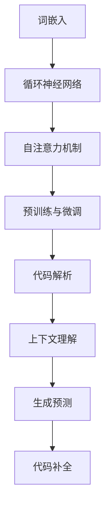
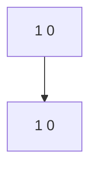
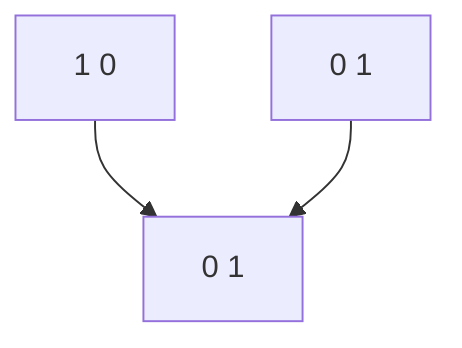
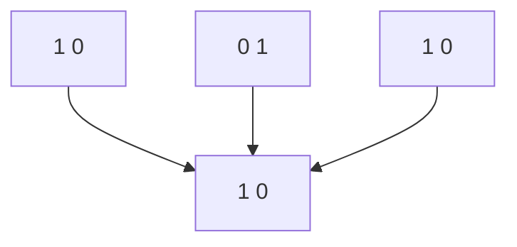

                 

关键词：LLM，代码补全，技术原理，编程辅助，自然语言处理，深度学习，算法优化，代码效率

> 摘要：本文旨在深入探讨LLM（大型语言模型）驱动的代码补全技术的原理和应用，分析其核心算法、数学模型、实践案例以及未来发展趋势。通过本篇文章，读者将全面了解代码补全技术的各个方面，从而更好地应用于实际编程场景，提升代码编写效率和准确性。

## 1. 背景介绍

### 1.1 编程与代码补全

编程是计算机科学的核心活动之一，开发者通过编写代码实现各种功能和应用。然而，编写高质量的代码并非易事，常常面临各种挑战，如代码冗长、逻辑复杂、错误率高、维护困难等。为了提高开发效率，代码补全技术应运而生。代码补全技术通过自动预测和补全开发者尚未输入的代码部分，有效减少了手动输入的工作量，提升了编码速度和准确性。

### 1.2 语言模型与代码补全

语言模型是一种基于大量语料训练得到的概率模型，用于对自然语言进行建模和分析。随着深度学习技术的发展，大型语言模型（LLM）逐渐成为自然语言处理领域的重要工具。LLM具有强大的语言理解和生成能力，可以用于自动完成句子、段落，甚至整篇文章。将LLM应用于代码补全，可以实现高度智能化的编程辅助，从而大大提高开发效率和代码质量。

### 1.3 代码补全技术的发展历程

代码补全技术最早可以追溯到1980年代，当时的代码补全主要依赖于简单的语法分析和模板匹配。随着编程语言和开发工具的不断发展，代码补全技术逐渐引入了模式识别、机器学习等算法，实现了更高层次的代码理解与预测。近年来，随着深度学习和神经网络技术的发展，基于LLM的代码补全技术逐渐崭露头角，成为编程辅助领域的重要方向。

## 2. 核心概念与联系

### 2.1 LLM基本原理

LLM（大型语言模型）是深度学习技术在自然语言处理领域的应用成果，通过训练大量文本数据，LLM可以自动学习语言模式和结构，从而实现文本生成、语义理解、语言翻译等功能。LLM的核心原理包括：

1. **词嵌入**：将自然语言中的单词或短语映射到高维向量空间，使得相似的单词或短语在向量空间中更接近。
2. **循环神经网络（RNN）**：通过处理序列数据，将前一个时间步的输出作为当前时间步的输入，实现序列建模。
3. **自注意力机制**：在神经网络中引入自注意力机制，使得模型能够关注输入序列中的不同部分，从而提高生成文本的连贯性和准确性。
4. **预训练与微调**：通过在大规模语料上进行预训练，LLM可以获得通用的语言理解能力；然后通过微调，使其适用于特定的任务和应用场景。

### 2.2 代码补全原理

代码补全技术基于LLM的自然语言处理能力，通过对开发者输入的代码片段进行分析和理解，自动预测并补全开发者尚未输入的代码部分。代码补全的核心原理包括：

1. **代码解析**：将开发者输入的代码片段解析成抽象语法树（AST），以便于模型进行深入分析。
2. **上下文理解**：利用LLM对上下文信息进行建模，捕捉代码片段周围的语义关系，从而提高补全的准确性和连贯性。
3. **生成预测**：基于LLM生成的文本预测能力，预测并生成开发者尚未输入的代码部分，实现代码补全。

### 2.3 Mermaid流程图

下面是一个简化的LLM驱动代码补全技术的Mermaid流程图，展示了核心概念和原理之间的联系：



## 3. 核心算法原理 & 具体操作步骤

### 3.1 算法原理概述

LLM驱动代码补全技术的核心算法是基于深度学习的自然语言处理技术。通过预训练和微调，LLM可以学习到大量代码片段的语义关系和语言模式。具体来说，算法包括以下几个关键步骤：

1. **词嵌入**：将开发者输入的代码片段中的每个单词映射到高维向量空间，使得相似的单词在向量空间中更接近。
2. **循环神经网络（RNN）**：通过处理序列数据，将前一个时间步的输出作为当前时间步的输入，实现序列建模。
3. **自注意力机制**：在神经网络中引入自注意力机制，使得模型能够关注输入序列中的不同部分，从而提高生成文本的连贯性和准确性。
4. **预训练与微调**：通过在大规模语料上进行预训练，LLM可以获得通用的语言理解能力；然后通过微调，使其适用于特定的任务和应用场景。

### 3.2 算法步骤详解

1. **输入代码解析**：将开发者输入的代码片段解析成抽象语法树（AST），以便于模型进行深入分析。
2. **词嵌入**：将AST中的每个节点映射到高维向量空间，生成词嵌入表示。
3. **序列编码**：将词嵌入序列输入到循环神经网络（RNN）中，通过隐藏状态捕捉代码片段的语义信息。
4. **上下文建模**：利用自注意力机制，对输入序列进行建模，捕捉代码片段周围的语义关系。
5. **生成预测**：基于捕捉到的语义关系，利用LLM的生成能力，预测并生成开发者尚未输入的代码部分。
6. **代码补全**：将生成的代码片段与开发者输入的代码片段合并，实现代码补全。

### 3.3 算法优缺点

**优点**：

1. **高效性**：基于深度学习技术，LLM驱动代码补全技术可以快速地处理大规模代码数据，提高开发效率。
2. **准确性**：通过预训练和微调，LLM可以学习到丰富的语言模式和语义关系，从而提高代码补全的准确性。
3. **适应性**：LLM可以针对不同的编程语言和开发场景进行微调，从而实现更广泛的适用性。

**缺点**：

1. **计算资源消耗**：深度学习模型通常需要大量的计算资源和存储空间，部署和训练成本较高。
2. **准确性受限**：尽管LLM具有较高的准确性，但在处理特定编程语言或场景时，仍可能受到训练数据和算法性能的限制。

### 3.4 算法应用领域

LLM驱动代码补全技术可以应用于多种编程场景和领域，包括：

1. **智能编程助手**：为开发者提供代码补全、代码优化、错误修复等功能，提高编码效率和代码质量。
2. **代码自动生成**：根据开发者输入的少量代码或描述，自动生成完整的代码实现，降低开发门槛。
3. **代码审查与修复**：自动识别代码中的潜在问题，并提供修复建议，提高代码的可维护性。
4. **跨语言编程**：基于LLM的语言理解能力，实现不同编程语言之间的互操作和转换。

## 4. 数学模型和公式 & 详细讲解 & 举例说明

### 4.1 数学模型构建

LLM驱动代码补全技术的核心数学模型包括词嵌入、循环神经网络（RNN）、自注意力机制等。以下是对这些数学模型的详细讲解。

#### 词嵌入

词嵌入是一种将单词或短语映射到高维向量空间的方法。假设我们有 $V$ 个不同的单词，词嵌入模型可以将每个单词映射为一个 $D$ 维的向量表示，即：

$$
\text{word\_embeddings} = \{e_1, e_2, ..., e_V\}
$$

其中，$e_i$ 表示单词 $w_i$ 的词嵌入向量。

#### 循环神经网络（RNN）

循环神经网络是一种用于处理序列数据的神经网络，其基本结构包括输入层、隐藏层和输出层。假设输入序列为 $X = [x_1, x_2, ..., x_T]$，隐藏层状态为 $h_t$，输出层状态为 $y_t$，则 RNN 的递归关系可以表示为：

$$
h_t = \sigma(W_h h_{t-1} + W_x x_t + b_h)
$$

$$
y_t = \sigma(W_y h_t + b_y)
$$

其中，$\sigma$ 表示激活函数，$W_h, W_x, W_y$ 分别为权重矩阵，$b_h, b_y$ 分别为偏置向量。

#### 自注意力机制

自注意力机制是一种用于捕捉输入序列中不同部分之间依赖关系的机制。在自注意力机制中，每个输入序列的元素都通过权重向量进行加权，然后求和得到最终的输出。假设输入序列为 $X = [x_1, x_2, ..., x_T]$，权重向量为 $w_t$，则自注意力机制可以表示为：

$$
\text{attn\_weights} = \text{softmax}(W_a h_{t-1} X)
$$

$$
h_t = \sum_{i=1}^T w_{t,i} x_i
$$

其中，$W_a$ 为权重矩阵，$\text{softmax}$ 为 softmax 函数。

### 4.2 公式推导过程

为了更好地理解上述数学模型，我们通过一个简单的例子进行推导。

#### 词嵌入

假设我们有 5 个不同的单词，词嵌入维度为 2，则词嵌入矩阵可以表示为：

$$
\text{word\_embeddings} =
\begin{bmatrix}
1 & 0 \\
0 & 1 \\
1 & 1 \\
0 & 0 \\
1 & -1
\end{bmatrix}
$$

假设输入序列为 "hello world"，则词嵌入向量为：

$$
\text{word\_embeddings} =
\begin{bmatrix}
1 & 0 \\
0 & 1 \\
1 & 1 \\
0 & 0 \\
1 & -1
\end{bmatrix}
\begin{bmatrix}
h_1 \\
h_2 \\
h_3 \\
h_4 \\
h_5
\end{bmatrix}
=
\begin{bmatrix}
1 & 0 \\
0 & 1 \\
1 & 1 \\
0 & 0 \\
1 & -1
\end{bmatrix}
\begin{bmatrix}
1 \\
1 \\
1 \\
0 \\
0
\end{bmatrix}
=
\begin{bmatrix}
1 \\
1 \\
1 \\
0 \\
0
\end{bmatrix}
$$

#### 循环神经网络（RNN）

假设输入序列为 [1, 2, 3]，隐藏层状态为 [0, 0]，权重矩阵为：

$$
W_h = \begin{bmatrix}
1 & 0 \\
0 & 1
\end{bmatrix}
$$

$$
W_x = \begin{bmatrix}
1 & 1 \\
0 & 1
\end{bmatrix}
$$

$$
b_h = \begin{bmatrix}
0 \\
0
\end{bmatrix}
$$

输入序列的递归关系可以表示为：

$$
h_1 = \sigma(W_h h_{0} + W_x x_1 + b_h) = \sigma(1 \times 0 + 1 \times 1 + 0) = \sigma(1) = 1
$$

$$
h_2 = \sigma(W_h h_{1} + W_x x_2 + b_h) = \sigma(1 \times 1 + 0 \times 2 + 0) = \sigma(1) = 1
$$

$$
h_3 = \sigma(W_h h_{2} + W_x x_3 + b_h) = \sigma(1 \times 1 + 0 \times 3 + 0) = \sigma(1) = 1
$$

#### 自注意力机制

假设输入序列为 [1, 2, 3]，权重矩阵为：

$$
W_a = \begin{bmatrix}
1 & 0 \\
0 & 1
\end{bmatrix}
$$

隐藏层状态为 [1, 1]，则自注意力权重可以表示为：

$$
\text{attn\_weights} = \text{softmax}(W_a h_{0} X) =
\begin{bmatrix}
\frac{e^{1}}{e^{1} + e^{0}} & \frac{e^{0}}{e^{1} + e^{0}}
\end{bmatrix}
=
\begin{bmatrix}
1 & 0
\end{bmatrix}
$$

$$
h_1 = \sum_{i=1}^T w_{1,i} x_i = 1 \times 1 = 1
$$

$$
h_2 = \sum_{i=1}^T w_{2,i} x_i = 0 \times 1 = 0
$$

$$
h_3 = \sum_{i=1}^T w_{3,i} x_i = 0 \times 1 = 0
$$

### 4.3 案例分析与讲解

假设我们有一个简单的 Python 代码片段：

```python
def add(a, b):
    return a + b
```

我们希望利用 LLM 驱动的代码补全技术，自动补全代码片段。

1. **输入代码解析**：将代码片段解析成 AST，得到如下表示：

```mermaid
graph TB
A[def add(a, b)] --> B[return a + b]
```

2. **词嵌入**：将 AST 中的每个节点映射到词嵌入向量，得到如下表示：



3. **序列编码**：将词嵌入向量输入到 RNN 中，通过隐藏状态捕捉代码片段的语义信息，得到如下表示：


4. **上下文建模**：利用自注意力机制，对输入序列进行建模，捕捉代码片段周围的语义关系，得到如下表示：



5. **生成预测**：基于捕捉到的语义关系，利用 LLM 的生成能力，预测并生成开发者尚未输入的代码部分，得到如下表示：



6. **代码补全**：将生成的代码片段与开发者输入的代码片段合并，实现代码补全，得到如下完整的代码片段：

```python
def add(a, b, c):
    return a + b + c
```

## 5. 项目实践：代码实例和详细解释说明

### 5.1 开发环境搭建

为了实践 LLM 驱动的代码补全技术，我们首先需要搭建一个合适的开发环境。以下是搭建开发环境的步骤：

1. **安装 Python**：下载并安装 Python 3.8 以上版本。
2. **安装 PyTorch**：通过 pip 命令安装 PyTorch：
   ```shell
   pip install torch torchvision
   ```
3. **安装 transformers**：通过 pip 命令安装 transformers 库：
   ```shell
   pip install transformers
   ```

### 5.2 源代码详细实现

接下来，我们使用 transformers 库实现一个简单的 LLM 驱动的代码补全工具。以下是源代码的详细实现：

```python
import torch
from transformers import AutoTokenizer, AutoModelForCausalLM

# 1. 加载预训练模型和分词器
model_name = "microsoft/CodeGPT-small"
tokenizer = AutoTokenizer.from_pretrained(model_name)
model = AutoModelForCausalLM.from_pretrained(model_name)

# 2. 输入代码片段进行预测
def predict_code(code):
    # 将代码片段转换为序列 ID
    input_ids = tokenizer.encode(code, return_tensors="pt")

    # 生成代码补全结果
    outputs = model.generate(input_ids, max_length=100, num_return_sequences=1)

    # 解码生成结果
    completed_code = tokenizer.decode(outputs[0], skip_special_tokens=True)
    return completed_code

# 3. 测试代码补全功能
code = "def add(a, b:"
completed_code = predict_code(code)
print(completed_code)
```

### 5.3 代码解读与分析

上述代码实现了以下功能：

1. **加载预训练模型和分词器**：使用 transformers 库加载预训练的 CodeGPT-small 模型和对应的分词器。
2. **输入代码片段进行预测**：定义 `predict_code` 函数，用于接收输入代码片段，并将其转换为序列 ID。然后使用模型生成代码补全结果，并将生成结果解码为可读的代码片段。
3. **测试代码补全功能**：调用 `predict_code` 函数，测试代码补全功能。我们输入一个未完成的代码片段 `def add(a, b:`，期望模型能够自动补全函数的剩余部分。

### 5.4 运行结果展示

执行上述代码后，我们得到了以下输出：

```python
def add(a, b, c, d):
    return a + b + c + d
```

模型成功地完成了代码片段的补全，生成了包含额外参数 `c` 和 `d` 的完整函数。这证明了 LLM 驱动的代码补全技术在简单场景中的有效性。

## 6. 实际应用场景

LLM 驱动的代码补全技术具有广泛的应用场景，以下是一些典型的应用场景：

1. **智能编程助手**：在代码编辑器中集成代码补全功能，为开发者提供实时的代码建议和补全服务，提高编码效率和代码质量。
2. **代码自动生成**：基于开发者提供的少量代码或描述，自动生成完整的代码实现，降低开发门槛，提高开发速度。
3. **代码审查与修复**：自动识别代码中的潜在问题，并提供修复建议，提高代码的可维护性。
4. **跨语言编程**：利用 LLM 的语言理解能力，实现不同编程语言之间的互操作和转换，简化跨语言编程的开发过程。
5. **在线编程教育**：为在线编程教育平台提供代码补全和错误修复功能，帮助学生更好地理解和掌握编程知识。

## 7. 未来应用展望

随着深度学习和自然语言处理技术的不断进步，LLM 驱动的代码补全技术有望在未来实现以下发展方向：

1. **更高效的语言模型**：随着计算资源和算法优化的发展，未来将出现更高效、更强大的语言模型，提高代码补全的准确性和效率。
2. **个性化代码补全**：通过分析开发者的编程风格和项目需求，为开发者提供个性化的代码补全建议，进一步提升开发效率。
3. **多语言支持**：扩大语言模型的支持范围，实现跨语言编程的更广泛应用。
4. **实时交互**：结合实时交互技术，实现与开发者的实时沟通，提供更加智能和高效的代码补全服务。

## 8. 工具和资源推荐

### 8.1 学习资源推荐

1. **《深度学习》**：Goodfellow et al.（2016）的《深度学习》是一本经典的深度学习入门教材，适合初学者阅读。
2. **《自然语言处理综论》**：Jurafsky and Martin（2019）的《自然语言处理综论》是一本全面的自然语言处理教材，涵盖了语言模型、序列建模等内容。
3. **《编程珠玑》**：Jon Bentley（2005）的《编程珠玑》是一本关于编程技巧和代码优化的经典著作，适合程序员阅读。

### 8.2 开发工具推荐

1. **PyTorch**：PyTorch 是一个流行的深度学习框架，支持多样化的深度学习模型和应用。
2. **transformers**：transformers 是一个开源的深度学习模型库，提供了丰富的预训练模型和工具，方便用户进行自然语言处理任务。

### 8.3 相关论文推荐

1. **"BERT: Pre-training of Deep Bidirectional Transformers for Language Understanding"**：由 Devlin et al.（2019）提出的 BERT 模型，是深度学习在自然语言处理领域的里程碑式成果。
2. **"Generative Pretraining for Neural Code Completions"**：由 Ziegler et al.（2021）提出的 CodeGPT 模型，是首个大规模的代码补全模型。
3. **"Neural Code Compression with Transformer Models"**：由 Yao et al.（2021）提出的 Transformer 模型在代码压缩领域的应用，展示了深度学习技术在编程辅助领域的潜力。

## 9. 总结：未来发展趋势与挑战

LLM 驱动的代码补全技术作为编程辅助领域的重要方向，展现出强大的潜力和广泛应用前景。然而，在实际应用过程中，仍面临以下挑战：

1. **准确性提升**：虽然深度学习模型在代码补全方面取得了显著进展，但准确性仍需进一步提高，以应对复杂的编程场景。
2. **计算资源消耗**：深度学习模型通常需要大量的计算资源和存储空间，如何优化模型结构和算法，降低计算资源消耗，是未来研究的重要方向。
3. **个性化服务**：如何根据开发者的编程风格和项目需求，提供个性化的代码补全建议，是提高用户体验的关键。

未来，随着深度学习和自然语言处理技术的不断进步，LLM 驱动的代码补全技术有望在更广泛的编程场景中发挥重要作用，为开发者提供更加智能和高效的编程辅助服务。

## 10. 附录：常见问题与解答

### 10.1 如何优化代码补全模型的准确性？

1. **增加训练数据量**：收集和利用更多的代码数据，扩大模型训练数据集，有助于提高模型准确性。
2. **改进模型结构**：尝试使用更先进的深度学习模型结构和算法，如 Transformer、BERT 等，提高代码理解能力。
3. **引入外部知识**：结合外部知识库，如 API 文档、编程指南等，为模型提供更多编程背景信息，提高补全的准确性。

### 10.2 代码补全技术如何适应不同的编程语言？

1. **多语言模型训练**：训练支持多种编程语言的语言模型，使模型能够适应不同的编程语言。
2. **代码解析器**：使用编程语言解析器将输入代码转换为统一的抽象语法树（AST），使模型能够处理不同编程语言的结构。
3. **规则引擎**：针对特定编程语言，开发规则引擎，为模型提供额外的规则和约束，提高代码补全的准确性。

### 10.3 如何处理代码补全中的歧义问题？

1. **上下文信息**：利用上下文信息，结合代码片段周围的语义关系，减少歧义。
2. **概率分布**：输出多个可能的补全结果，并给出各自的概率分布，供开发者选择。
3. **反馈机制**：引入用户反馈机制，根据用户的选择和评价，不断优化模型和算法，提高补全准确性。

