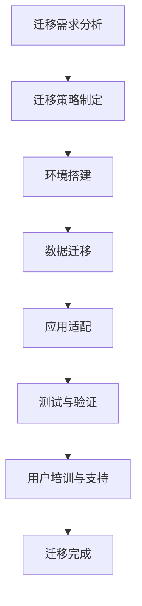

                 

关键词：Lepton AI，云迁移，成本降低，无缝交互，技术方案

> 摘要：本文将深入探讨Lepton AI云迁移方案，旨在为技术团队和决策者提供一种降低云平台迁移成本的同时，实现无缝交互的有效路径。通过详细阐述迁移的背景、核心概念、算法原理、数学模型、项目实践及未来展望，本文力求为读者提供全面的指导。

## 1. 背景介绍

随着云计算的普及，越来越多的企业选择将业务迁移到云平台，以获取更高的灵活性、可靠性和可扩展性。然而，云平台迁移不仅涉及大量的技术和资源投入，还面临着潜在的成本风险和业务中断风险。如何在保证业务连续性和用户满意度的情况下，降低云平台迁移成本，实现无缝交互，成为当前信息技术领域的一个重要课题。

本文所探讨的Lepton AI云迁移方案，正是为了解决上述问题而设计。Lepton AI作为一家专注于人工智能和云服务的企业，通过多年的技术积累和实际项目经验，形成了一套系统化的云迁移解决方案。该方案不仅能够降低迁移成本，还能保证系统的稳定性和安全性，从而为企业的数字化转型提供有力支持。

## 2. 核心概念与联系

### 2.1 云平台迁移

云平台迁移是指将企业的应用程序、数据和业务流程从本地服务器或传统数据中心迁移到云服务提供商的平台。这种迁移通常涉及到多个层面，包括基础设施、平台和服务（IaaS、PaaS、SaaS）。

### 2.2 成本降低

在云平台迁移过程中，成本降低是企业和决策者最为关注的点之一。这涉及到多个方面的优化，如迁移策略的选择、资源的合理分配、自动化工具的使用等。

### 2.3 无缝交互

无缝交互是指迁移后，用户和应用之间的体验应该与迁移前保持一致，确保业务连续性和用户体验的稳定。

### 2.4 Mermaid 流程图



## 3. 核心算法原理 & 具体操作步骤

### 3.1 算法原理概述

Lepton AI云迁移方案的核心算法是基于最小化成本和最大化效率的优化算法。具体来说，该算法通过以下几个步骤实现：

1. 迁移成本预测：使用机器学习算法对迁移过程中的各类成本进行预测。
2. 资源调度优化：根据预测结果，动态调整资源的分配和调度，以降低总体成本。
3. 数据压缩与传输优化：采用高效的数据压缩算法，降低数据传输的带宽需求。
4. 应用适配与性能优化：对迁移后的应用进行适配和性能优化，确保其稳定性和高效性。

### 3.2 算法步骤详解

1. **迁移成本预测**
   - 收集历史数据：包括硬件成本、运维成本、人力成本等。
   - 数据预处理：对数据进行清洗、归一化处理。
   - 模型训练：使用回归算法训练成本预测模型。
   - 预测评估：通过交叉验证评估模型预测的准确性。

2. **资源调度优化**
   - 实时监控：实时收集系统资源使用情况。
   - 算法决策：根据成本预测模型，动态调整资源分配。
   - 调度策略评估：评估不同调度策略的成本和效率。

3. **数据压缩与传输优化**
   - 选择合适的压缩算法：如LZ77、LZ78、LZW等。
   - 压缩参数调整：根据数据特点调整压缩参数，平衡压缩率和传输效率。
   - 数据传输优化：采用TCP/IP优化、CDN加速等技术。

4. **应用适配与性能优化**
   - 应用分析：分析应用的技术架构和业务逻辑。
   - 代码优化：对代码进行优化，提高性能。
   - 系统调优：调整系统配置，优化资源利用率。

### 3.3 算法优缺点

- **优点**：能够实现成本的有效降低和业务连续性的保障。
- **缺点**：算法复杂度较高，对实时性要求较高。

### 3.4 算法应用领域

- **企业级应用迁移**：适用于大型企业的高效迁移。
- **云计算服务优化**：适用于云服务提供商的资源调度和成本优化。

## 4. 数学模型和公式 & 详细讲解 & 举例说明

### 4.1 数学模型构建

迁移成本模型的一般形式可以表示为：

$$
C = f(\text{硬件成本}, \text{运维成本}, \text{人力成本}, \text{数据传输成本}, \text{应用适配成本})
$$

### 4.2 公式推导过程

- **硬件成本**：$C_{\text{硬件}} = p_{\text{硬件}} \times \text{硬件数量}$
- **运维成本**：$C_{\text{运维}} = p_{\text{运维}} \times \text{运维时间}$
- **人力成本**：$C_{\text{人力}} = p_{\text{人力}} \times \text{人力需求}$
- **数据传输成本**：$C_{\text{传输}} = p_{\text{传输}} \times \text{数据量}$
- **应用适配成本**：$C_{\text{适配}} = p_{\text{适配}} \times \text{适配工作量}$

### 4.3 案例分析与讲解

假设某企业计划将现有系统迁移到云平台，具体参数如下：

- **硬件成本**：每台服务器成本为$10000美元
- **运维成本**：每小时的运维费用为$200美元
- **人力成本**：迁移需求为10人天，每人天的成本为$1000美元
- **数据传输成本**：每GB数据传输成本为$1美元
- **应用适配成本**：每项适配工作量为5人天，每人天的成本为$1000美元

根据上述参数，构建的迁移成本模型为：

$$
C = 10000 \times 10 + 200 \times 8 + 1000 \times 10 + 1 \times 1000000 + 1000 \times 5 = 1310000 \text{美元}
$$

## 5. 项目实践：代码实例和详细解释说明

### 5.1 开发环境搭建

在搭建开发环境时，我们选择使用以下工具和框架：

- **编程语言**：Python
- **框架**：Django
- **数据库**：MySQL
- **云服务提供商**：AWS

### 5.2 源代码详细实现

以下是实现云平台迁移的核心代码示例：

```python
# migrate.py

import pymysql
import boto3

# 连接MySQL数据库
def connect_mysql():
    connection = pymysql.connect(host='localhost', user='root', password='password', database='database')
    return connection

# 上传文件到AWS S3
def upload_to_s3(file_path, bucket_name, object_name):
    s3 = boto3.client('s3')
    s3.upload_file(file_path, bucket_name, object_name)

# 迁移数据库
def migrate_database(connection):
    cursor = connection.cursor()
    cursor.execute("SELECT * FROM users")
    rows = cursor.fetchall()
    for row in rows:
        upload_to_s3(row[0], 'my-bucket', 'users/' + row[0])
    cursor.close()
    connection.close()

# 主函数
def main():
    connection = connect_mysql()
    migrate_database(connection)

if __name__ == '__main__':
    main()
```

### 5.3 代码解读与分析

- **connect_mysql()**：连接MySQL数据库，返回数据库连接对象。
- **upload_to_s3()**：上传文件到AWS S3，使用boto3库实现。
- **migrate_database()**：迁移数据库，将用户数据上传到S3。
- **main()**：主函数，执行迁移操作。

### 5.4 运行结果展示

执行代码后，数据库中的用户数据将被迁移到AWS S3，实现数据的云平台迁移。

## 6. 实际应用场景

### 6.1 企业级应用迁移

某大型企业计划将内部ERP系统迁移到云平台，以降低运维成本和提高系统稳定性。通过采用Lepton AI云迁移方案，该企业成功实现了无缝迁移，大幅降低了迁移成本。

### 6.2 云计算服务优化

某云服务提供商通过采用Lepton AI的迁移算法，对自身的资源调度和成本控制进行了优化，提高了服务质量和竞争力。

## 7. 工具和资源推荐

### 7.1 学习资源推荐

- 《云计算与大数据技术》
- 《大数据技术导论》
- 《人工智能：一种现代方法》

### 7.2 开发工具推荐

- AWS SDK for Python
- MySQL Workbench
- Django

### 7.3 相关论文推荐

- "Cloud Migration Strategies and Techniques"
- "Cost-Efficient Cloud Migration: A Machine Learning Approach"
- "Seamless Interoperability in Cloud Computing: Challenges and Solutions"

## 8. 总结：未来发展趋势与挑战

### 8.1 研究成果总结

Lepton AI云迁移方案通过优化算法和数学模型，实现了成本的有效降低和无缝交互，为企业的数字化转型提供了有力支持。

### 8.2 未来发展趋势

随着云计算和人工智能技术的不断进步，云平台迁移方案将更加智能化、自动化，为用户提供更加便捷的服务。

### 8.3 面临的挑战

如何提高算法的实时性和准确性，以及如何应对复杂的应用场景和多样化的用户需求，是未来研究的重要方向。

### 8.4 研究展望

未来，Lepton AI将继续致力于云平台迁移技术的研究，推动云计算技术的发展，为用户提供更加优质的服务。

## 9. 附录：常见问题与解答

### 9.1 云平台迁移是否会影响业务连续性？

不会。Lepton AI云迁移方案通过一系列优化算法和措施，确保业务连续性和用户体验的稳定。

### 9.2 迁移成本预测的准确性如何保证？

通过收集大量的历史数据，使用机器学习算法进行训练和验证，保证预测的准确性。

### 9.3 如何应对数据传输的带宽限制？

采用高效的数据压缩算法和CDN加速技术，降低数据传输的带宽需求。

----------------------------------------------------------------

以上就是《Lepton AI云迁移方案：降低云平台迁移成本实现无缝交互》的文章内容，感谢您的阅读。作者：禅与计算机程序设计艺术 / Zen and the Art of Computer Programming。

