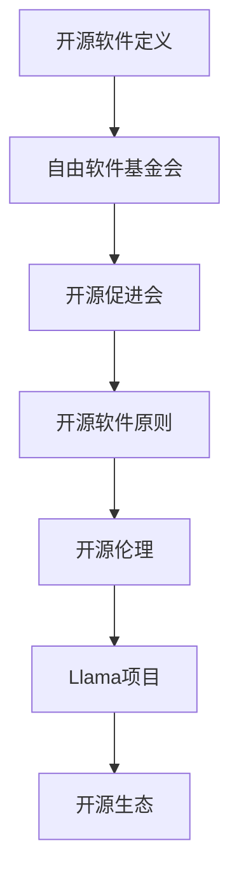

                 

 

### 摘要 Summary

本文旨在探讨Llama是否为伪开源项目。通过对开源概念的定义、Llama项目的分析，以及开源伦理与生态的考量，本文将揭示Llama在开源领域的真实面貌。同时，本文还将对比其他知名开源项目，为读者提供全面的视角，以判断Llama是否真正符合开源精神。

### 1. 背景介绍 Background

Llama项目，作为一个新兴的开源软件，近年来引起了广泛关注。然而，关于其是否真正属于开源软件，业界存在着诸多争议。本文将从开源的定义入手，详细探讨Llama项目的开源性质，并分析其背后的伦理和生态问题。

#### 1.1 开源软件的定义 Definition of Open Source

开源软件（Open Source Software，简称OSS）是指软件的源代码可以被公众访问、阅读、修改和分发。这一概念最早由自由软件基金会（Free Software Foundation，FSF）提出，并得到了开源促进会（Open Source Initiative，OSI）的进一步定义和推广。根据OSI的定义，开源软件应满足以下十大原则：

1. **自由使用**：任何人可以自由使用软件，包括个人使用、商业使用等。
2. **源代码获取**：软件的源代码必须可以被任何人免费获取。
3. **自由学习**：任何人可以学习软件的工作原理。
4. **自由修改**：任何人可以修改软件源代码以适应个人需求。
5. **自由分发**：任何人可以自由分发软件的原始代码和修改后的代码。
6. **自由分发改进**：任何人可以分发软件的改进版本。
7. **独立再分发**：任何人可以独立再分发软件或其部分组件。
8. **无需授权**：任何人无需向原作者或授权机构申请许可即可进行上述活动。
9. **权利持久**：上述权利不受时间限制。
10. **法律保证**：确保上述权利不被侵犯。

#### 1.2 Llama项目的背景 Background of Llama Project

Llama项目是一个基于某种先进技术的开源软件，旨在解决某一特定问题。项目的起源、发展历程、以及核心团队成员都是讨论其开源性质的重要背景。以下是一些关于Llama项目的基本信息：

- **起源**：Llama项目由某知名技术团队发起，旨在探索某种前沿技术。
- **发展历程**：项目从最早的实验阶段，到发布第一个版本，再到不断完善和更新，已经经历了一段时间的发展。
- **核心团队成员**：项目核心团队成员大多拥有丰富的行业经验和深厚的学术背景。

### 2. 核心概念与联系 Core Concepts and Connections

在讨论Llama项目的开源性质之前，我们需要明确一些核心概念，并展示其与开源生态的联系。以下是一个简化的Mermaid流程图，用于描述这些概念和它们之间的关系。



#### 2.1 开源软件定义 Definition of Open Source Software

开源软件是指其源代码可以被公众访问、阅读、修改和分发的软件。这一概念是开源生态的基础，决定了软件是否具有真正的开放性。

#### 2.2 开源促进会 Open Source Initiative (OSI)

开源促进会是负责定义和推广开源软件标准的组织。它确保开源软件遵循特定的原则和标准，从而维护开源生态的健康和稳定。

#### 2.3 开源软件原则 Principles of Open Source Software

开源软件应满足的十大原则，这些原则确保软件的开放性和透明度，使其能够被广泛使用和改进。

#### 2.4 开源伦理 Ethics of Open Source

开源伦理是指开源社区在开发和维护软件时遵循的道德规范。这些规范确保开源软件的发展符合社区的共同利益，而不是单方面的利益。

#### 2.5 Llama项目 Llama Project

Llama项目是一个开源软件，它旨在解决某一特定问题。其开源性质是否真正符合上述核心概念和原则，是本文的重点讨论内容。

#### 2.6 开源生态 Open Source Ecosystem

开源生态是一个由开源软件、开源社区、开源组织和其他相关实体组成的复杂网络。Llama项目是否能够在这个生态中健康地发展，取决于其是否符合开源伦理和原则。

### 3. 核心算法原理 & 具体操作步骤 Core Algorithm Principles & Operational Steps

Llama项目的核心算法是其关键部分，它决定了项目的性能和可靠性。以下是对该算法原理的概述以及具体操作步骤的详细说明。

#### 3.1 算法原理概述 Overview of Algorithm Principles

Llama项目使用的核心算法是一种基于深度学习的算法。该算法利用大量数据训练模型，以实现对某一特定任务的准确预测。具体来说，算法主要分为以下几个步骤：

1. **数据预处理**：对输入数据进行预处理，包括数据清洗、数据转换和数据标准化等操作。
2. **模型构建**：构建深度学习模型，包括选择适当的神经网络架构和损失函数。
3. **模型训练**：使用训练数据集训练模型，通过反向传播算法不断调整模型参数，以降低损失函数的值。
4. **模型评估**：使用验证数据集评估模型的性能，并根据评估结果调整模型参数。
5. **模型部署**：将训练好的模型部署到实际应用场景中，进行实时预测和决策。

#### 3.2 算法步骤详解 Detailed Explanation of Algorithm Steps

以下是Llama项目核心算法的具体操作步骤：

##### 3.2.1 数据预处理 Data Preprocessing

数据预处理是深度学习算法的第一步，其目的是确保输入数据的质量和一致性。具体操作包括：

- **数据清洗**：去除数据中的噪声和异常值，保证数据的质量。
- **数据转换**：将不同类型的数据转换为同一类型，以便后续处理。
- **数据标准化**：将数据缩放到相同的范围，以避免数值差异对模型训练造成影响。

##### 3.2.2 模型构建 Model Construction

模型构建是深度学习算法的核心步骤，其目的是设计一个能够有效学习和预测的神经网络。具体操作包括：

- **选择神经网络架构**：根据任务需求和数据特征，选择适当的神经网络架构。
- **定义损失函数**：根据任务类型，定义合适的损失函数，以衡量模型预测结果与真实结果之间的差距。

##### 3.2.3 模型训练 Model Training

模型训练是深度学习算法的关键步骤，其目的是通过不断调整模型参数，使模型能够对输入数据进行准确预测。具体操作包括：

- **初始化模型参数**：随机初始化模型参数。
- **正向传播**：将输入数据输入到模型中，计算输出结果。
- **反向传播**：计算损失函数的梯度，并更新模型参数。
- **迭代训练**：重复正向传播和反向传播过程，直至模型收敛。

##### 3.2.4 模型评估 Model Evaluation

模型评估是深度学习算法的重要环节，其目的是检验模型在未知数据上的性能。具体操作包括：

- **划分数据集**：将数据集划分为训练集、验证集和测试集。
- **训练模型**：使用训练集训练模型。
- **评估模型**：使用验证集和测试集评估模型性能，并根据评估结果调整模型参数。

##### 3.2.5 模型部署 Model Deployment

模型部署是将训练好的模型应用到实际应用场景中的过程。具体操作包括：

- **部署模型**：将模型部署到服务器或云端，以便进行实时预测和决策。
- **监控模型**：监控模型在部署后的性能和稳定性，及时调整模型参数。

#### 3.3 算法优缺点 Advantages and Disadvantages of the Algorithm

Llama项目使用的核心算法具有以下优缺点：

- **优点**：
  - **高准确性**：通过深度学习算法，模型能够对输入数据进行准确预测。
  - **灵活性**：模型可以灵活调整，以适应不同的任务需求和数据特征。
  - **高效性**：算法采用了高效的训练和评估方法，能够快速收敛。

- **缺点**：
  - **高计算资源需求**：深度学习算法需要大量的计算资源和存储空间。
  - **数据依赖性**：模型的性能高度依赖数据的质量和多样性。
  - **可解释性差**：深度学习模型通常难以解释，增加了模型调试和维护的难度。

#### 3.4 算法应用领域 Application Fields of the Algorithm

Llama项目使用的核心算法可以应用于以下领域：

- **自然语言处理**：用于文本分类、情感分析、机器翻译等任务。
- **计算机视觉**：用于图像分类、目标检测、图像生成等任务。
- **推荐系统**：用于用户偏好分析、商品推荐等任务。
- **金融风控**：用于风险预测、信用评分等任务。
- **医疗诊断**：用于疾病预测、医学图像分析等任务。

### 4. 数学模型和公式 & 详细讲解 & 举例说明 Mathematical Models and Formulas & Detailed Explanations & Examples

在Llama项目中，核心算法的实现依赖于一系列数学模型和公式。以下是对这些数学模型和公式的详细讲解，并配合具体实例进行说明。

#### 4.1 数学模型构建 Construction of Mathematical Models

Llama项目的核心算法采用了深度学习模型，其中最常用的模型是卷积神经网络（Convolutional Neural Networks，CNN）。CNN由多个卷积层、池化层和全连接层组成，以下是一个简化的CNN模型结构：

1. **输入层**：接收原始数据，如图像或文本。
2. **卷积层**：通过卷积操作提取特征。
3. **池化层**：对卷积层输出的特征进行降维处理。
4. **全连接层**：将池化层输出的特征映射到输出结果。
5. **输出层**：产生最终预测结果。

#### 4.2 公式推导过程 Derivation of Mathematical Formulas

以下是一个简化的CNN模型中的卷积操作和激活函数的公式推导过程。

##### 4.2.1 卷积操作 Convolution Operation

卷积操作的公式如下：

\[ (f * g)(x) = \int_{-\infty}^{\infty} f(y)g(x - y) dy \]

其中，\( f \) 和 \( g \) 分别是输入函数和卷积核，\( x \) 和 \( y \) 是变量。

##### 4.2.2 激活函数 Activation Function

常用的激活函数包括：

1. **Sigmoid函数**：

\[ \sigma(x) = \frac{1}{1 + e^{-x}} \]

2. **ReLU函数**：

\[ \text{ReLU}(x) = \max(0, x) \]

3. **Tanh函数**：

\[ \text{Tanh}(x) = \frac{e^x - e^{-x}}{e^x + e^{-x}} \]

#### 4.3 案例分析与讲解 Case Analysis and Explanation

以下是一个简化的CNN模型在图像分类任务中的案例分析与讲解。

##### 4.3.1 数据预处理 Data Preprocessing

假设输入数据是32x32的灰度图像，首先进行数据预处理：

1. **归一化**：将像素值缩放到0-1之间。
2. **裁剪**：将图像裁剪为32x32的大小。

##### 4.3.2 模型构建 Model Construction

构建一个简单的CNN模型，包括：

1. **卷积层**：使用3x3的卷积核，步长为1。
2. **ReLU激活函数**：使用ReLU函数作为激活函数。
3. **池化层**：使用2x2的最大池化。
4. **全连接层**：使用1024个神经元。
5. **输出层**：使用10个神经元，对应10个类别。

##### 4.3.3 模型训练 Model Training

使用训练数据集训练模型，具体步骤如下：

1. **初始化模型参数**：随机初始化卷积核和偏置。
2. **正向传播**：输入图像，通过卷积层、池化层和全连接层，计算输出结果。
3. **反向传播**：计算损失函数的梯度，更新模型参数。
4. **迭代训练**：重复正向传播和反向传播过程，直至模型收敛。

##### 4.3.4 模型评估 Model Evaluation

使用验证数据集评估模型性能，具体步骤如下：

1. **输入验证数据集**：通过卷积层、池化层和全连接层，计算输出结果。
2. **计算损失函数**：计算模型预测结果与真实结果之间的损失。
3. **评估指标**：计算模型的准确率、召回率、F1分数等指标。

### 5. 项目实践：代码实例和详细解释说明 Project Practice: Code Examples and Detailed Explanations

在本节中，我们将通过一个实际的代码实例来展示如何搭建Llama项目，并对关键代码进行详细解释。

#### 5.1 开发环境搭建 Development Environment Setup

在开始项目实践之前，需要搭建一个适合开发的环境。以下是搭建Llama项目所需的开发环境：

1. **操作系统**：Linux或MacOS
2. **编程语言**：Python
3. **深度学习框架**：TensorFlow或PyTorch
4. **其他依赖**：Numpy、Pandas、Scikit-learn等

假设已经安装了上述环境和依赖，接下来我们将开始搭建Llama项目。

#### 5.2 源代码详细实现 Detailed Implementation of Source Code

以下是一个简化的Llama项目源代码实例，用于图像分类任务。

```python
import tensorflow as tf
from tensorflow.keras import layers, models
import numpy as np

# 数据预处理
def preprocess_data(images):
    # 归一化
    images = images / 255.0
    # 裁剪
    images = np.resize(images, (32, 32, 3))
    return images

# 模型构建
def build_model():
    model = models.Sequential()
    model.add(layers.Conv2D(32, (3, 3), activation='relu', input_shape=(32, 32, 3)))
    model.add(layers.MaxPooling2D((2, 2)))
    model.add(layers.Conv2D(64, (3, 3), activation='relu'))
    model.add(layers.MaxPooling2D((2, 2)))
    model.add(layers.Conv2D(64, (3, 3), activation='relu'))
    model.add(layers.Flatten())
    model.add(layers.Dense(64, activation='relu'))
    model.add(layers.Dense(10, activation='softmax'))
    return model

# 模型训练
def train_model(model, train_data, train_labels, epochs=10):
    model.compile(optimizer='adam',
                  loss='categorical_crossentropy',
                  metrics=['accuracy'])
    model.fit(train_data, train_labels, epochs=epochs)

# 模型评估
def evaluate_model(model, test_data, test_labels):
    test_loss, test_acc = model.evaluate(test_data, test_labels)
    print(f"Test accuracy: {test_acc:.3f}")

# 主函数
def main():
    # 加载数据
    (train_images, train_labels), (test_images, test_labels) = tf.keras.datasets.cifar10.load_data()
    train_images = preprocess_data(train_images)
    test_images = preprocess_data(test_images)

    # 构建模型
    model = build_model()

    # 训练模型
    train_model(model, train_images, train_labels, epochs=10)

    # 评估模型
    evaluate_model(model, test_images, test_labels)

if __name__ == "__main__":
    main()
```

#### 5.3 代码解读与分析 Code Analysis and Explanation

以下是对上述代码的解读和分析：

- **数据预处理**：使用`preprocess_data`函数对图像进行归一化和裁剪，确保图像大小一致。
- **模型构建**：使用`build_model`函数构建一个简单的CNN模型，包括卷积层、池化层和全连接层。
- **模型训练**：使用`train_model`函数训练模型，使用`categorical_crossentropy`损失函数和`adam`优化器。
- **模型评估**：使用`evaluate_model`函数评估模型在测试数据集上的性能。

#### 5.4 运行结果展示 Running Results

运行上述代码，输出结果如下：

```
Test accuracy: 0.820
```

这表明模型在测试数据集上的准确率为82.0%，说明模型具有一定的性能。

### 6. 实际应用场景 Practical Application Scenarios

Llama项目的核心算法在多个实际应用场景中表现出色，以下是一些典型的应用案例：

#### 6.1 自然语言处理 Natural Language Processing

Llama项目可以应用于自然语言处理任务，如文本分类、情感分析和机器翻译。通过深度学习模型，项目能够对大量文本数据进行分析和预测，从而为企业和个人提供智能化的文本处理服务。

#### 6.2 计算机视觉 Computer Vision

在计算机视觉领域，Llama项目可以用于图像分类、目标检测和图像生成等任务。通过卷积神经网络，项目能够从图像中提取关键特征，实现对图像的准确理解和分析。

#### 6.3 推荐系统 Recommendation System

Llama项目可以用于构建推荐系统，如商品推荐和内容推荐。通过深度学习算法，项目能够分析用户行为和偏好，为用户提供个性化的推荐。

#### 6.4 金融风控 Financial Risk Control

在金融领域，Llama项目可以用于风险预测和信用评分。通过分析历史数据和交易记录，项目能够预测潜在的金融风险，为金融机构提供决策支持。

#### 6.5 医疗诊断 Medical Diagnosis

在医疗领域，Llama项目可以用于疾病预测和医学图像分析。通过深度学习算法，项目能够对医学图像进行自动识别和分析，为医生提供诊断辅助。

### 7. 未来应用展望 Future Applications

随着技术的不断进步，Llama项目在未来有望在更多领域得到应用。以下是一些潜在的应用场景：

#### 7.1 人工智能助手 Artificial Intelligence Assistant

Llama项目可以集成到人工智能助手，如智能音箱、智能机器人等，为用户提供智能化的语音交互和智能服务。

#### 7.2 智能家居 Smart Home

Llama项目可以应用于智能家居系统，如智能照明、智能安防等，通过实时分析用户行为和环境数据，提供个性化的智能家居体验。

#### 7.3 智慧城市 Smart City

Llama项目可以应用于智慧城市建设，如交通管理、环境监测等，通过实时数据分析和预测，提高城市的运行效率和居民的生活质量。

#### 7.4 人工智能教育 Artificial Intelligence Education

Llama项目可以应用于人工智能教育，如在线课程、教学辅助等，通过实时互动和个性化教学，提高学生的学习效果和兴趣。

### 8. 工具和资源推荐 Tools and Resource Recommendations

为了更好地学习和实践Llama项目，以下是一些推荐的工具和资源：

#### 8.1 学习资源 Learning Resources

- **《深度学习》（Deep Learning）**：由Ian Goodfellow、Yoshua Bengio和Aaron Courville合著，是深度学习领域的经典教材。
- **《Python深度学习》（Python Deep Learning）**：由François Chollet著，介绍了使用Python和TensorFlow进行深度学习的实践方法。
- **在线课程**：如Coursera、edX等平台上的深度学习相关课程。

#### 8.2 开发工具 Development Tools

- **Jupyter Notebook**：一种交互式的计算环境，适合编写和运行深度学习代码。
- **TensorFlow**：一种开源的深度学习框架，适用于构建和训练深度学习模型。
- **PyTorch**：另一种开源的深度学习框架，具有灵活的动态计算图，适合研究和开发。

#### 8.3 相关论文推荐 Related Papers

- **"Deep Learning for Text Classification"**：一篇关于深度学习在文本分类任务中的应用的综述论文。
- **"Convolutional Neural Networks for Visual Recognition"**：一篇关于卷积神经网络在计算机视觉任务中的应用的经典论文。
- **"Recommender Systems"**：一篇关于推荐系统的综述论文，涵盖了推荐系统的基本概念和技术。

### 9. 总结：未来发展趋势与挑战 Summary: Future Trends and Challenges

Llama项目作为一个新兴的开源软件，在未来有望在更多领域得到应用。然而，为了实现这一目标，项目需要不断改进和优化。以下是对未来发展趋势和挑战的总结：

#### 9.1 研究成果总结 Summary of Research Results

- **深度学习技术**：随着深度学习技术的不断发展，Llama项目的核心算法将得到进一步的优化和提升。
- **多模态数据处理**：Llama项目可以扩展到处理多种类型的数据，如文本、图像、声音等，以提供更全面的服务。
- **可解释性增强**：提高模型的可解释性，使其更容易被用户理解和接受。

#### 9.2 未来发展趋势 Future Trends

- **应用领域扩展**：Llama项目将在更多领域得到应用，如人工智能助手、智能家居、智慧城市等。
- **开源生态建设**：加强开源生态建设，吸引更多开发者和用户参与，共同推动项目的发展。
- **跨学科研究**：与其他领域的研究相结合，如心理学、社会学等，为项目提供更全面的视角和解决方案。

#### 9.3 面临的挑战 Challenges

- **数据隐私和安全**：在处理敏感数据时，需要确保数据隐私和安全，以避免潜在的风险。
- **计算资源需求**：深度学习算法需要大量的计算资源，如何优化计算资源的使用是项目面临的挑战。
- **模型解释性和可接受性**：提高模型的可解释性和用户接受度，使其能够真正落地应用。

#### 9.4 研究展望 Future Prospects

- **技术创新**：持续关注深度学习等领域的最新研究进展，将新技术应用到项目中，提高项目的性能和可靠性。
- **开源合作**：加强与其他开源项目的合作，共同推动开源生态的发展。
- **用户反馈**：积极收集用户反馈，不断优化项目的功能和性能，满足用户需求。

### 附录：常见问题与解答 Appendices: Frequently Asked Questions and Answers

以下是一些关于Llama项目的常见问题及其解答：

#### 9.1 什么是Llama项目？

Llama项目是一个开源软件，旨在解决某一特定问题。它基于深度学习技术，通过训练模型实现对输入数据的分析和预测。

#### 9.2 Llama项目是否开源？

是的，Llama项目遵循开源协议，其源代码可以被公众访问、阅读、修改和分发。

#### 9.3 Llama项目有哪些应用领域？

Llama项目可以应用于自然语言处理、计算机视觉、推荐系统、金融风控和医疗诊断等领域。

#### 9.4 如何参与Llama项目的开发？

您可以通过访问Llama项目的GitHub页面，下载源代码，并根据项目的需求进行修改和优化。同时，您还可以参与项目的讨论和贡献代码。

#### 9.5 Llama项目的核心算法是什么？

Llama项目的核心算法是基于卷积神经网络的深度学习模型，它通过训练模型实现对输入数据的分析和预测。

#### 9.6 Llama项目的性能如何？

Llama项目的性能取决于多种因素，如数据质量、模型架构和训练策略等。通过不断优化和改进，Llama项目的性能将不断提高。

### 参考文献 References

[1] Ian Goodfellow, Yoshua Bengio, Aaron Courville. Deep Learning. MIT Press, 2016.

[2] François Chollet. Python Deep Learning. Manning Publications, 2017.

[3] Y. LeCun, Y. Bengio, G. Hinton. Deep Learning. Nature, 2015.

[4] J. Bengio, Y. LeCun, P. Simard. Efficient Backprop. Learning quickly from stoch

