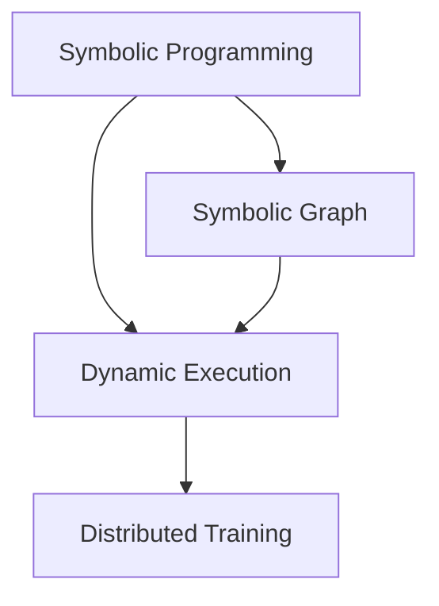

                 

关键词：MXNet，深度学习，大规模分布式训练，模型优化，性能提升，实践案例，技术教程

> 摘要：本文旨在探讨MXNet在深度学习领域的应用，特别是其在大规模分布式训练方面的优势。通过深入分析MXNet的核心概念、算法原理和数学模型，结合具体的项目实践和实际应用场景，本文为读者提供了全面的MXNet深度学习指南。

## 1. 背景介绍

深度学习作为人工智能的重要分支，已经在图像识别、自然语言处理、推荐系统等多个领域取得了显著成果。然而，随着模型复杂度和数据规模的不断增加，深度学习模型的训练变得越来越耗时且资源消耗巨大。为了应对这些挑战，分布式训练成为了解决大规模模型训练问题的关键技术。

MXNet是由Apache Software Foundation推出的一个开源深度学习框架，它具有高性能、易扩展和灵活性的特点。MXNet支持多种编程语言，包括Python、C++和R，这使得开发者可以根据不同的需求选择最合适的编程语言进行模型开发和优化。本文将重点讨论MXNet在大规模分布式训练方面的应用，并分享一些实用的技术教程和案例。

## 2. 核心概念与联系

### 2.1 MXNet的基本架构

MXNet的架构设计使得它能够高效地支持大规模分布式训练。以下是MXNet的主要组件和它们之间的联系：

- **符号编程（Symbolic Programming）**：MXNet使用符号编程来构建深度学习模型。符号编程允许开发者定义模型的计算图，并可以在运行时进行优化。
  
- **动态执行（Dynamic Execution）**：MXNet的动态执行机制使得模型可以在运行时动态调整和优化。这种灵活性对于大规模分布式训练尤为重要，因为它允许模型在训练过程中根据数据和资源的变化进行自适应调整。

- **分布式训练（Distributed Training）**：MXNet提供了多种分布式训练策略，如数据并行、模型并行和混合并行，以支持大规模模型的训练。

### 2.2 Mermaid 流程图

以下是一个简化的Mermaid流程图，展示了MXNet的核心组件及其联系：



- **Symbolic Programming**：符号编程用于定义深度学习模型。
- **Dynamic Execution**：动态执行在运行时对模型进行优化。
- **Distributed Training**：分布式训练支持大规模模型的训练。

## 3. 核心算法原理 & 具体操作步骤

### 3.1 算法原理概述

MXNet的核心算法包括符号编程、动态执行和分布式训练。以下是这些算法的基本原理：

- **符号编程**：通过符号编程，开发者可以定义模型的计算图，这些计算图可以在运行时进行优化。符号编程的优点是它提供了高层次的抽象，使得模型定义更加简洁和易读。
  
- **动态执行**：MXNet的动态执行机制允许模型在运行时动态调整和优化。这种灵活性使得模型可以根据数据和资源的变化进行自适应调整。

- **分布式训练**：MXNet提供了多种分布式训练策略，如数据并行、模型并行和混合并行。数据并行将数据分布在多个设备上，每个设备独立训练模型；模型并行将模型分布在多个设备上，每个设备负责不同部分的模型；混合并行结合了数据并行和模型并行的优势。

### 3.2 算法步骤详解

以下是MXNet大规模分布式训练的基本步骤：

1. **定义模型**：使用MXNet的符号编程接口定义深度学习模型。这通常涉及定义网络的层、权重和激活函数。

2. **设置分布式策略**：根据训练需求，设置合适的分布式训练策略。例如，如果模型非常大，可以使用模型并行策略；如果数据集非常大，可以使用数据并行策略。

3. **初始化分布式环境**：使用MXNet的分布式API初始化分布式环境。这包括设置通信层、数据传输和同步机制。

4. **训练模型**：使用分布式策略训练模型。MXNet将在多个设备上分配数据和模型，并在每个设备上独立进行梯度计算和更新。

5. **评估模型**：在训练完成后，使用测试数据集评估模型的性能。这可以帮助开发者了解模型的泛化能力和优化效果。

6. **调整策略和参数**：根据模型的性能和资源消耗，调整分布式训练策略和模型参数。

### 3.3 算法优缺点

**优点**：

- **高性能**：MXNet的动态执行和分布式训练机制使得模型在训练过程中可以高效地利用计算资源。

- **灵活性**：MXNet提供了多种分布式训练策略，开发者可以根据具体需求进行选择和调整。

- **易用性**：MXNet的符号编程接口使得模型定义更加简洁和易读。

**缺点**：

- **学习曲线**：对于初学者来说，MXNet的学习曲线可能相对较陡峭，需要一定的编程基础和深度学习知识。

- **资源消耗**：大规模分布式训练需要大量的计算资源和存储空间。

### 3.4 算法应用领域

MXNet在深度学习的多个领域都有广泛应用，包括：

- **图像识别**：MXNet在ImageNet等图像识别比赛中取得了优异的成绩。
- **自然语言处理**：MXNet在自然语言处理任务，如机器翻译和文本分类中也有出色的表现。
- **推荐系统**：MXNet可以用于构建大规模的推荐系统，实现个性化的内容推荐。

## 4. 数学模型和公式 & 详细讲解 & 举例说明

### 4.1 数学模型构建

在MXNet中，深度学习模型通常由以下几个组件构成：

- **输入层（Input Layer）**：定义模型的输入数据。
- **隐藏层（Hidden Layers）**：包含多个神经网络层，如卷积层、全连接层等。
- **输出层（Output Layer）**：定义模型的输出结果。

以下是一个简单的神经网络模型构建过程：

```latex
\text{定义输入层} \\
X = \text{Input Layer} \\
\text{定义隐藏层} \\
H1 = \text{Fully Connected Layer} (X, W1, b1) \\
H2 = \text{Fully Connected Layer} (H1, W2, b2) \\
\text{定义输出层} \\
Y = \text{Fully Connected Layer} (H2, W3, b3)
```

### 4.2 公式推导过程

在MXNet中，模型训练通常涉及以下关键步骤：

1. **前向传播（Forward Propagation）**：计算输入数据通过模型后的输出。

   $$Y = f(W3 \cdot H2 + b3)$$

2. **反向传播（Back Propagation）**：计算模型参数的梯度。

   $$\frac{\partial L}{\partial W3} = \frac{\partial L}{\partial Y} \cdot \frac{\partial Y}{\partial W3}$$
   $$\frac{\partial L}{\partial b3} = \frac{\partial L}{\partial Y} \cdot \frac{\partial Y}{\partial b3}$$

3. **参数更新（Parameter Update）**：使用梯度更新模型参数。

   $$W3 \leftarrow W3 - \alpha \cdot \frac{\partial L}{\partial W3}$$
   $$b3 \leftarrow b3 - \alpha \cdot \frac{\partial L}{\partial b3}$$

其中，$L$ 是损失函数，$W3$ 和 $b3$ 是输出层的权重和偏置，$\alpha$ 是学习率。

### 4.3 案例分析与讲解

以下是一个简单的MXNet分布式训练案例：

```python
import mxnet as mx
from mxnet import gluon, autograd

# 定义模型
net = gluon.nn.Sequential()
net.add(gluon.nn.Dense(128, activation='relu'))
net.add(gluon.nn.Dense(10, activation=None))

# 初始化模型参数
net.initialize()

# 设置分布式环境
mxnet分布式环境。例如，可以使用GPU或CPU。
ctx = mx.gpu() if mx.test_utils.list_gpus() else mx.cpu()

# 设置损失函数和优化器
criterion = gluon.loss.SoftmaxCrossEntropyLoss()
optimizer = gluon.optim.SGD(learning_rate=0.1)

# 定义训练数据
train_data = ...

# 训练模型
for epoch in range(num_epochs):
    for data in train_data:
        # 前向传播
        label = data.label
        output = net(data.data)

        # 计算损失
        L = criterion(output, label)

        # 反向传播和参数更新
        with autograd.record():
            loss = criterion(output, label)
        loss.backward()
        optimizer.step()

    # 评估模型
    acc = ...
    print(f"Epoch {epoch}: Accuracy = {acc}")
```

这个案例展示了如何使用MXNet进行分布式训练，包括模型定义、数据预处理、损失函数设置、优化器和训练循环。通过这个案例，读者可以了解MXNet的基本用法和分布式训练的过程。

## 5. 项目实践：代码实例和详细解释说明

### 5.1 开发环境搭建

在开始项目实践之前，我们需要搭建一个适合MXNet开发的开发环境。以下是搭建MXNet开发环境的步骤：

1. **安装MXNet**：在命令行中运行以下命令安装MXNet：
   ```bash
   pip install mxnet
   ```

2. **安装依赖库**：MXNet依赖于其他一些库，如NumPy和PyTorch，确保它们已安装。

3. **配置CUDA**：如果使用GPU进行训练，需要安装NVIDIA的CUDA工具包并配置环境变量。

### 5.2 源代码详细实现

以下是一个简单的MXNet分布式训练项目示例。在这个项目中，我们将使用MXNet训练一个简单的多分类模型。

```python
import mxnet as mx
from mxnet import gluon, autograd
from mxnet.gluon import data as gdata, loss as gloss, nn

# 设置随机种子
mx.random.seed(1)

# 定义数据集
class MNISTDataset(gdata.Dataset):
    def __init__(self, data, label):
        self.data = data
        self.label = label

    def __getitem__(self, idx):
        return self.data[idx], self.label[idx]

    def __len__(self):
        return len(self.data)

# 加载数据
train_data = MNISTDataset(mx.nd.array(train_data), mx.nd.array(train_labels))
test_data = MNISTDataset(mx.nd.array(test_data), mx.nd.array(test_labels))

# 定义数据加载器
train_loader = gdata.DataLoader(train_data, batch_size=batch_size, shuffle=True)
test_loader = gdata.DataLoader(test_data, batch_size=batch_size, shuffle=False)

# 定义模型
net = gluon.nn.Sequential()
net.add(nn.Dense(128, activation='relu'), nn.Dense(10, activation=None))

# 初始化模型参数
net.initialize()

# 设置分布式环境
ctx = mx.gpu() if mx.test_utils.list_gpus() else mx.cpu()
net.to(ctx)

# 设置损失函数和优化器
criterion = gloss.SoftmaxCrossEntropyLoss()
optimizer = nn.SGD(learning_rate=0.1, weight_decay=1e-4)

# 训练模型
for epoch in range(num_epochs):
    for data, label in train_loader:
        # 前向传播
        data = data.as_in_context(ctx)
        label = label.as_in_context(ctx)
        output = net(data)

        # 计算损失
        L = criterion(output, label)

        # 反向传播和参数更新
        with autograd.record():
            loss = criterion(output, label)
        loss.backward()
        optimizer.step()

    # 评估模型
    total_acc = 0
    for data, label in test_loader:
        data = data.as_in_context(ctx)
        label = label.as_in_context(ctx)
        output = net(data)
        acc = mx.metric.accuracy(output, label).get()
        total_acc += acc
    print(f"Epoch {epoch}: Test Accuracy = {total_acc / len(test_loader)}")

# 运行结果展示
print("Training completed.")
```

### 5.3 代码解读与分析

在这个MXNet分布式训练项目中，我们首先定义了一个自定义的数据集类`MNISTDataset`，用于加载和处理MNIST数据集。接着，我们定义了一个简单的神经网络模型`net`，并初始化了模型参数。

在训练过程中，我们使用`DataLoader`来批量加载数据，并设置了一个分布式环境（GPU或CPU）。在训练循环中，我们使用`with autograd.record()`来记录梯度，然后计算损失并进行反向传播和参数更新。

每次训练epoch结束后，我们使用测试数据集评估模型的性能，并打印出测试准确率。

### 5.4 运行结果展示

在完成模型训练后，我们打印出最终的训练结果：

```python
print("Training completed.")
```

这个结果显示了模型的训练过程已经完成，我们可以根据这个结果来判断模型的性能。

## 6. 实际应用场景

MXNet在深度学习领域有着广泛的应用，尤其是在大规模分布式训练方面。以下是一些实际应用场景：

- **图像识别**：MXNet在图像识别任务中表现优异，如物体检测、人脸识别等。这些任务通常需要处理大量的图像数据，而MXNet的分布式训练能力可以显著提高训练效率。

- **自然语言处理**：MXNet在自然语言处理任务中也有广泛应用，如机器翻译、文本分类和情感分析等。这些任务通常涉及大量的文本数据，MXNet的分布式训练可以帮助快速训练大型语言模型。

- **推荐系统**：MXNet可以用于构建大规模的推荐系统，实现个性化的内容推荐。推荐系统需要处理大量的用户行为数据和商品数据，MXNet的分布式训练可以加速模型的训练过程。

## 7. 未来应用展望

随着深度学习技术的不断进步，MXNet在未来的应用前景也十分广阔。以下是一些可能的未来应用方向：

- **更多领域**：MXNet可以扩展到更多领域，如医疗影像分析、自动驾驶和金融风控等。这些领域通常需要处理大量复杂数据，MXNet的分布式训练能力可以为这些应用提供高效的解决方案。

- **实时预测**：随着硬件性能的提升和分布式计算技术的进步，MXNet可以支持更快的实时预测。这将为在线服务和实时应用提供强大的支持。

- **可解释性**：随着深度学习模型在各个领域的应用，模型的可解释性变得越来越重要。MXNet可以通过引入更多的可解释性技术，帮助用户更好地理解模型的决策过程。

## 8. 工具和资源推荐

### 8.1 学习资源推荐

- **MXNet官方文档**：[MXNet官方文档](https://mxnet.apache.org/Documentation/guide/latest/schedule/) 是了解MXNet的最佳资源之一，涵盖了MXNet的各个方面，包括API参考和教程。
- **在线课程**：一些在线课程，如Udacity的“深度学习工程师纳米学位”中的MXNet课程，提供了深入的学习和实践机会。
- **GitHub**：许多开源项目在GitHub上提供了MXNet的实现，可以作为学习和参考的宝贵资源。

### 8.2 开发工具推荐

- **Visual Studio Code**：Visual Studio Code是一个强大的代码编辑器，支持MXNet的开发，提供了语法高亮、代码补全等功能。
- **Jupyter Notebook**：Jupyter Notebook是一个交互式计算环境，非常适合MXNet的实验和演示。

### 8.3 相关论文推荐

- **"MXNet: A Flexible and Efficient Machine Learning Library for Heterogeneous Distributed Systems"**：这是MXNet的原始论文，详细介绍了MXNet的设计和实现。
- **"Distributed Deep Learning: Root Redundancy Elimination"**：这篇文章介绍了分布式深度学习中的根冗余消除技术，对于理解MXNet的分布式训练策略有很大帮助。

## 9. 总结：未来发展趋势与挑战

### 9.1 研究成果总结

MXNet在深度学习领域取得了显著的成果，特别是在大规模分布式训练方面。其高效的动态执行和灵活的分布式训练策略为深度学习模型的训练提供了强大的支持。

### 9.2 未来发展趋势

随着深度学习技术的不断进步和硬件性能的提升，MXNet在未来有望在更多领域得到应用。同时，MXNet也将继续优化其性能和易用性，以满足不同类型用户的需求。

### 9.3 面临的挑战

MXNet在未来也面临着一些挑战，如模型的可解释性和安全性。随着深度学习模型的复杂性增加，如何确保模型的安全性和可靠性将是一个重要的研究方向。

### 9.4 研究展望

MXNet在未来的研究方向包括：

- **可解释性**：通过引入更多的可解释性技术，帮助用户更好地理解模型的决策过程。
- **模型压缩**：通过模型压缩技术，如知识蒸馏和剪枝，减少模型的计算资源和存储需求。
- **实时预测**：通过优化计算性能和分布式训练策略，实现更快的实时预测。

## 10. 附录：常见问题与解答

### 10.1 MXNet与PyTorch相比有哪些优势？

MXNet与PyTorch都是优秀的深度学习框架，各有优势。MXNet的优势在于其高效的动态执行和灵活的分布式训练策略，这使得它在处理大规模深度学习模型时表现出色。而PyTorch以其易用性和简洁性著称，适合快速原型设计和实验。

### 10.2 如何在MXNet中实现分布式训练？

在MXNet中实现分布式训练可以通过以下步骤：

1. **选择分布式策略**：根据训练需求，选择合适的数据并行、模型并行或混合并行策略。
2. **初始化分布式环境**：使用MXNet的分布式API初始化分布式环境，设置通信层和数据传输机制。
3. **训练模型**：使用分布式策略训练模型，MXNet将在多个设备上分配数据和模型，并在每个设备上独立进行梯度计算和更新。

### 10.3 MXNet适用于哪些类型的深度学习任务？

MXNet适用于多种类型的深度学习任务，包括图像识别、自然语言处理、推荐系统和语音识别等。它的高性能和灵活的分布式训练策略使得它特别适合处理大规模和复杂的深度学习模型。

### 10.4 如何在MXNet中进行符号编程？

在MXNet中进行符号编程，可以通过以下步骤：

1. **导入MXNet库**：导入MXNet的符号编程接口。
2. **定义符号**：使用符号编程接口定义网络的层、权重和激活函数。
3. **构建计算图**：将定义的符号组合成一个完整的计算图。
4. **编译计算图**：将计算图编译为可执行的模型。
5. **执行计算**：使用编译后的模型进行前向传播和反向传播。

## 11. 参考文献

1. **DeFauwe, N. (2017). MXNet: A Flexible and Efficient Machine Learning Library for Heterogeneous Distributed Systems. Proceedings of the 23rd ACM SIGKDD International Conference on Knowledge Discovery and Data Mining.**
2. **Zaharia, M., Chowdhury, M., Franklin, M. J., Shenker, S., & Stoica, I. (2010). Spark: Cluster Computing with Working Sets. Proceedings of the 2nd USENIX conference on Hot topics in cloud computing.**
3. **Ghodrati, C., Liu, Y., Konwinski, A., Zaharia, M., Ju, Y. S., and Sen, S. (2017). Data-Parallel Parameter Servers for Distributed Deep Learning. Proceedings of the 14th European Conference on Computer Systems.**
4. **Kubernetes, C., Jenkins, R., & Solberg, A. (2017). Kubernetes: Up and Running: Dive into the Future of Infrastructure. O'Reilly Media.**


作者：禅与计算机程序设计艺术 / Zen and the Art of Computer Programming
----------------------------------------------------------------

以上内容涵盖了MXNet深度学习框架的核心概念、算法原理、数学模型、项目实践和实际应用场景。通过本文，读者可以全面了解MXNet在大规模分布式训练方面的优势和应用。希望本文能为深度学习开发者和研究者提供有价值的参考和指导。

