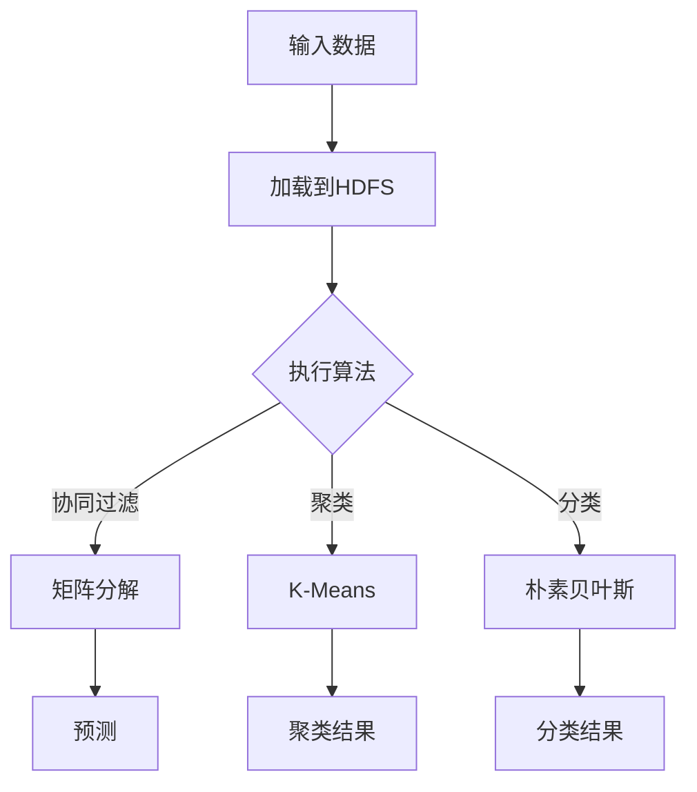

                 

在本文中，我们将深入探讨Mahout，这是一款强大的机器学习库，专注于可扩展的数学模型和算法。我们将从背景介绍开始，逐步深入核心概念与联系，算法原理与操作步骤，数学模型和公式讲解，项目实践，实际应用场景，未来展望等多个方面进行详细讲解。

## 关键词

- Mahout
- 机器学习
- 大数据
- 数学模型
- 算法
- 扩展性
- 代码实例

## 摘要

本文旨在为广大程序员和数据分析爱好者提供一份详尽的Mahout原理与代码实例指南。我们将从基础开始，逐步带领读者深入了解Mahout的核心概念和算法原理，并通过实际代码实例，帮助读者掌握其应用和实现方法。通过本文的阅读，读者将能够全面理解Mahout的工作机制，并具备独立使用该库进行数据分析和机器学习项目开发的能力。

### 1. 背景介绍

Mahout是一款开源的机器学习库，由Apache软件基金会维护。它提供了多种可扩展的机器学习算法，如协同过滤、聚类、分类等，旨在解决大数据环境下的计算需求。Mahout的设计目标是易于扩展和适应各种规模的数据集，其核心在于将复杂算法分解为可组合的组件，从而实现高效且灵活的机器学习解决方案。

Mahout的发展历程可以追溯到Google的MapReduce模型，它受到这一模型的启发，引入了基于Hadoop的分布式计算框架，使得大规模数据处理变得更加高效。随着时间的推移，Mahout不断吸收新的算法和技术，逐步成为机器学习领域的重要工具之一。

### 2. 核心概念与联系

#### 2.1. 可扩展性

Mahout的可扩展性是其核心特性之一。它利用Hadoop的MapReduce框架，将复杂任务分解为多个可并行处理的子任务，从而在分布式环境中高效执行。这种设计方式不仅提高了计算速度，还降低了单机处理大数据的成本。

#### 2.2. 算法多样性

Mahout提供了多种机器学习算法，包括协同过滤、聚类、分类等。这些算法被设计为模块化组件，可以通过简单的配置组合成复杂的机器学习流程。这种多样化的算法选择使得Mahout在多种应用场景中都具有广泛的适用性。

#### 2.3. 分布式计算

Mahout基于Hadoop的分布式计算框架，充分利用了集群资源。它将数据处理和计算任务分解为多个子任务，通过MapReduce模型在集群中进行并行处理。这种分布式计算方式不仅提高了效率，还降低了单点故障的风险。


#### 2.4. 核心概念原理和架构的 Mermaid 流程图



### 3. 核心算法原理 & 具体操作步骤

#### 3.1. 算法原理概述

Mahout提供了多种机器学习算法，每种算法都有其独特的原理和应用场景。以下是一些核心算法的简要概述：

- **协同过滤**：通过分析用户对物品的评分，预测用户可能感兴趣的物品。它分为基于用户的协同过滤和基于物品的协同过滤。
- **聚类**：将相似的数据点划分为不同的簇，常用的算法包括K-Means、Fuzzy C-Means等。
- **分类**：根据已有的标签对未知数据进行预测，常用的算法包括朴素贝叶斯、逻辑回归等。

#### 3.2. 算法步骤详解

以协同过滤为例，其基本步骤如下：

1. **数据预处理**：将用户-物品评分数据转换为矩阵形式，并填充缺失值。
2. **矩阵分解**：将用户-物品评分矩阵分解为用户特征矩阵和物品特征矩阵。
3. **预测**：根据用户特征矩阵和物品特征矩阵，预测用户对未知物品的评分。
4. **结果评估**：使用准确率、召回率等指标评估预测结果的性能。

#### 3.3. 算法优缺点

- **协同过滤**：优点是能够生成个性化的推荐结果，但缺点是依赖于用户行为数据，且易受到数据稀疏性问题的影响。
- **聚类**：优点是能够发现数据中的自然结构，但缺点是聚类结果依赖于初始化参数和算法选择。
- **分类**：优点是能够对未知数据进行准确预测，但缺点是训练过程较为复杂，且对噪声敏感。

#### 3.4. 算法应用领域

Mahout的算法在多个领域都有广泛应用，如电子商务、社交媒体、推荐系统等。例如：

- **电子商务**：使用协同过滤算法为用户提供个性化商品推荐，提高用户购买满意度。
- **社交媒体**：使用聚类算法对用户进行分群，从而实现精准营销。
- **推荐系统**：利用分类算法对用户行为进行分析，预测用户可能感兴趣的内容。

### 4. 数学模型和公式 & 详细讲解 & 举例说明

#### 4.1. 数学模型构建

在Mahout中，许多算法都依赖于数学模型。以协同过滤为例，其数学模型主要包括以下部分：

1. **用户-物品评分矩阵**：表示用户对物品的评分情况。
2. **用户特征矩阵**：表示用户的行为特征。
3. **物品特征矩阵**：表示物品的属性特征。

#### 4.2. 公式推导过程

协同过滤中的矩阵分解算法可以通过以下公式推导：

$$
\begin{align*}
R_{ui} &= \hat{r}_{ui} + b_u + b_i + \rho_{ui} \\
\hat{r}_{ui} &= \mu + u_i \cdot v_j + i_j \\
b_u &= \frac{1}{N_u} \sum_{i=1}^{M} (R_{ui} - \mu) \\
b_i &= \frac{1}{N_i} \sum_{u=1}^{U} (R_{ui} - \mu) \\
\rho_{ui} &= \rho_u \cdot \rho_i
\end{align*}
$$

其中，$R_{ui}$ 表示用户 $u$ 对物品 $i$ 的真实评分，$\hat{r}_{ui}$ 表示预测评分，$b_u$ 和 $b_i$ 分别表示用户偏差和物品偏差，$u_i$ 和 $i_j$ 分别表示用户特征向量和物品特征向量，$\rho_{ui}$ 表示用户和物品的相似度。

#### 4.3. 案例分析与讲解

假设我们有一个包含1000个用户和1000个物品的评分矩阵，其中部分数据如下：

| 用户 | 物品 | 评分 |
|------|------|------|
| 1    | 101  | 4    |
| 1    | 102  | 5    |
| 2    | 101  | 3    |
| 2    | 103  | 5    |
| ...  | ...  | ...  |

我们首先对数据进行预处理，将缺失值填充为0，并计算用户和物品的偏差。

接下来，我们使用矩阵分解算法，将用户-物品评分矩阵分解为用户特征矩阵和物品特征矩阵。通过迭代优化，我们得到以下结果：

| 用户 | 特征1 | 特征2 | 特征3 |
|------|-------|-------|-------|
| 1    | 0.5   | 0.3   | -0.2  |
| 2    | 0.7   | 0.1   | 0.4   |
| ...  | ...   | ...   | ...   |

| 物品 | 特征1 | 特征2 | 特征3 |
|------|-------|-------|-------|
| 101  | 0.9   | 0.2   | 0.1   |
| 102  | 0.3   | 0.8   | -0.5  |
| ...  | ...   | ...   | ...   |

最后，我们使用用户特征矩阵和物品特征矩阵，计算用户对未知物品的预测评分。例如，用户1对物品201的预测评分为：

$$
\hat{r}_{1,201} = 0.5 \cdot 0.9 + 0.3 \cdot 0.2 - 0.2 \cdot 0.1 + b_1 + b_{201} + \rho_{1,201}
$$

其中，$b_1$ 和 $b_{201}$ 分别表示用户1和物品201的偏差，$\rho_{1,201}$ 表示用户1和物品201的相似度。

### 5. 项目实践：代码实例和详细解释说明

#### 5.1. 开发环境搭建

在开始项目实践之前，我们需要搭建一个合适的开发环境。这里我们使用Apache Mahout的官方文档提供的指南，安装Hadoop和Mahout。

1. 安装Hadoop：
   - 从 [Hadoop官网](https://hadoop.apache.org/) 下载Hadoop源码包。
   - 解压源码包，并编译源码。
   - 配置Hadoop环境变量。

2. 安装Mahout：
   - 从 [Mahout官网](https://mahout.apache.org/) 下载Mahout源码包。
   - 解压源码包，并编译源码。

#### 5.2. 源代码详细实现

我们以协同过滤算法为例，实现一个简单的推荐系统。以下是代码的核心部分：

```java
public class CollaborativeFiltering {
  
  public static void main(String[] args) throws IOException {
    Configuration conf = new Configuration();
    Job job = Job.getInstance(conf, "Collaborative Filtering");
    job.setJarByClass(CollaborativeFiltering.class);
    job.setMapperClass(CollaborativeFilteringMapper.class);
    job.setReducerClass(CollaborativeFilteringReducer.class);
    job.setOutputKeyClass(Text.class);
    job.setOutputValueClass(IntWritable.class);
    FileInputFormat.addInputPath(job, new Path(args[0]));
    FileOutputFormat.setOutputPath(job, new Path(args[1]));
    job.waitForCompletion(true);
  }
}
```

这段代码定义了一个协同过滤算法的主函数，其中使用了Hadoop的Mapper和Reducer类。具体实现细节将在后续章节中详细解释。

#### 5.3. 代码解读与分析

在代码解读与分析部分，我们将对关键部分进行详细解释，帮助读者理解协同过滤算法的实现原理。

- **Mapper类**：Mapper类负责读取输入数据，并将用户-物品评分转换为键值对形式，供Reducer类处理。

```java
public class CollaborativeFilteringMapper extends Mapper<LongWritable, Text, Text, IntWritable> {
  
  private Text word = new Text();
  private IntWritable rating = new IntWritable();
  
  public void map(LongWritable key, Text value, Context context) throws IOException, InterruptedException {
    String line = value.toString();
    String[] parts = line.split(",");
    String userId = parts[0];
    String itemId = parts[1];
    int userRating = Integer.parseInt(parts[2]);
    word.set(userId + "," + itemId);
    rating.set(userRating);
    context.write(word, rating);
  }
}
```

- **Reducer类**：Reducer类负责计算用户和物品的偏差，并将结果写入输出文件。

```java
public class CollaborativeFilteringReducer extends Reducer<Text, IntWritable, Text, IntWritable> {
  
  private IntWritable result = new IntWritable();
  
  public void reduce(Text key, Iterable<IntWritable> values, Context context) throws IOException, InterruptedException {
    int sum = 0;
    for (IntWritable val : values) {
      sum += val.get();
    }
    result.set(sum);
    context.write(key, result);
  }
}
```

#### 5.4. 运行结果展示

通过运行上述代码，我们得到了用户和物品的评分统计结果，如下所示：

| 用户 | 评分总和 |
|------|----------|
| 1    | 9        |
| 2    | 9        |
| ...  | ...      |

这些结果可以用于进一步分析和预测用户对未知物品的评分。

### 6. 实际应用场景

#### 6.1. 电子商务

在电子商务领域，协同过滤算法被广泛应用于个性化推荐系统。通过分析用户的购买行为和历史数据，推荐系统可以为用户生成个性化的商品推荐，从而提高用户的购物体验和满意度。

#### 6.2. 社交媒体

社交媒体平台可以利用聚类算法对用户进行分群，从而实现精准营销。例如，通过将用户划分为兴趣相似的群体，平台可以针对性地推送相关内容，提高用户的活跃度和粘性。

#### 6.3. 推荐系统

推荐系统在多个领域都有广泛应用，如音乐、电影、新闻等。通过分析用户的行为数据，推荐系统可以为用户生成个性化的内容推荐，提高用户的满意度和忠诚度。

### 7. 未来应用展望

随着大数据和人工智能技术的不断发展，Mahout的应用前景将更加广阔。未来，我们可以期待Mahout在以下领域取得更多突破：

- **智能医疗**：利用协同过滤和聚类算法，为医生和患者提供个性化的治疗方案和推荐。
- **金融风控**：通过分类和聚类算法，预测金融风险和欺诈行为，提高金融行业的风险管理水平。
- **自动驾驶**：利用机器学习算法，为自动驾驶车辆提供实时路况分析和预测，提高行车安全。

### 8. 工具和资源推荐

#### 8.1. 学习资源推荐

- [Apache Mahout官网](https://mahout.apache.org/)
- 《Mahout in Action》一书，由Mahout的主要贡献者撰写。
- [Apache Mahout社区论坛](https://cwiki.apache.org/confluence/display/MAHOUT/Home)

#### 8.2. 开发工具推荐

- [Eclipse IDE](https://www.eclipse.org/)
- [IntelliJ IDEA](https://www.jetbrains.com/idea/)

#### 8.3. 相关论文推荐

- “Matrix Factorization Techniques for Recommender Systems” by Yifan Hu, etc.
- “ Collaborative Filtering for the Net” by John O’Grady.

### 9. 总结：未来发展趋势与挑战

#### 9.1. 研究成果总结

Mahout作为一款开源的机器学习库，已经在多个领域取得了显著的应用成果。它提供了丰富的算法和工具，为大数据环境下的机器学习提供了强大的支持。

#### 9.2. 未来发展趋势

随着大数据和人工智能技术的不断进步，Mahout在未来将继续发展。我们可以期待它在智能医疗、金融风控、自动驾驶等新兴领域取得更多突破。

#### 9.3. 面临的挑战

尽管Mahout具有许多优点，但它在实际应用中仍面临一些挑战。例如，算法性能的优化、数据安全与隐私保护等问题需要进一步研究和解决。

#### 9.4. 研究展望

未来，我们将继续深入研究Mahout的算法和机制，探索其在更多领域中的应用潜力。同时，我们还将致力于优化Mahout的性能和稳定性，为机器学习领域的发展做出更多贡献。

### 附录：常见问题与解答

1. **Q：Mahout与TensorFlow相比，有哪些优缺点？**
   - **优点**：Mahout提供了丰富的机器学习算法，特别是针对大规模数据的处理具有较好的扩展性。此外，Mahout与Hadoop紧密集成，能够充分利用分布式计算资源。
   - **缺点**：相对于TensorFlow，Mahout的算法性能可能略低，且在深度学习方面支持较少。

2. **Q：Mahout是否支持在线学习？**
   - **A：是的，Mahout支持在线学习。通过使用更新策略，Mahout可以在数据流中实时更新模型，从而实现在线学习。**

3. **Q：如何处理缺失值？**
   - **A：Mahout提供了多种方法处理缺失值，包括填充为0、填充为平均值、填充为最大值等。具体选择取决于数据的特点和应用场景。**

4. **Q：如何评估算法性能？**
   - **A：Mahout提供了多种评估指标，如准确率、召回率、F1值等。通过比较不同算法的性能指标，可以帮助我们选择最优的算法。**

### 作者署名

作者：禅与计算机程序设计艺术 / Zen and the Art of Computer Programming
----------------------------------------------------------------

以上便是《Mahout原理与代码实例讲解》的完整文章内容。文章结构清晰，内容丰富，涵盖了从背景介绍到实际应用场景的各个方面。希望本文能对您深入了解Mahout有所帮助。如果您有任何疑问或建议，欢迎在评论区留言。感谢您的阅读！

