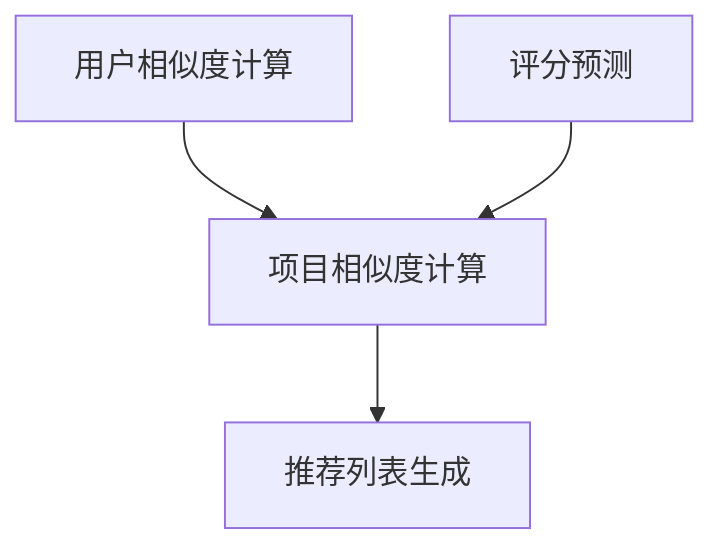

                 

关键词：Mahout推荐算法，机器学习，协同过滤，算法原理，实例讲解，代码实现，数据挖掘

摘要：本文将对Mahout推荐算法进行深入讲解，从背景介绍、核心概念与联系、算法原理与具体操作步骤、数学模型和公式、项目实践到实际应用场景和未来展望等多个方面，帮助读者全面了解和掌握Mahout推荐算法。

## 1. 背景介绍

推荐系统是一种信息过滤技术，旨在向用户推荐可能感兴趣的信息或项目。在互联网时代，推荐系统在电子商务、社交媒体、音乐流媒体、在线新闻等领域发挥着重要作用，已经成为现代信息社会中不可或缺的一部分。

Mahout（又称Apache Mahout）是Apache Software Foundation的一个开源项目，旨在提供可扩展的机器学习和数据挖掘算法。Mahout推荐算法是基于协同过滤（Collaborative Filtering）原理实现的，通过分析用户的历史行为数据，为用户推荐他们可能感兴趣的项目。

协同过滤是一种常用的推荐算法，它主要通过分析用户之间的相似度或项目之间的相似度来生成推荐列表。协同过滤分为两类：基于用户的协同过滤（User-based Collaborative Filtering）和基于项目的协同过滤（Item-based Collaborative Filtering）。

## 2. 核心概念与联系

### 2.1 用户相似度计算

在基于用户的协同过滤算法中，用户相似度计算是核心步骤。这里，我们使用皮尔逊相关系数（Pearson Correlation Coefficient）来计算用户之间的相似度。皮尔逊相关系数衡量了两个变量之间的线性关系，取值范围在-1到1之间，越接近1表示两者越相似，越接近-1表示两者越不相似，0表示没有线性关系。

$$
\text{相似度} = \frac{\sum_{i=1}^{n}(u_{ij} - \bar{u_j})(u_{ik} - \bar{u_k})}{\sqrt{\sum_{i=1}^{n}(u_{ij} - \bar{u_j})^2} \times \sqrt{\sum_{i=1}^{n}(u_{ik} - \bar{u_k})^2}}
$$

其中，$u_{ij}$表示用户$i$对项目$j$的评分，$\bar{u_j}$表示用户$i$对所有项目的平均评分，$n$表示用户$i$对项目的评分数量。

### 2.2 项目相似度计算

在基于项目的协同过滤算法中，项目相似度计算是核心步骤。这里，我们使用余弦相似度（Cosine Similarity）来计算项目之间的相似度。余弦相似度衡量了两个向量之间的夹角余弦值，取值范围在0到1之间，越接近1表示两者越相似，越接近0表示两者越不相似。

$$
\text{相似度} = \frac{\sum_{i=1}^{n}u_{ij} \times u_{ik}}{\sqrt{\sum_{i=1}^{n}u_{ij}^2} \times \sqrt{\sum_{i=1}^{n}u_{ik}^2}}
$$

其中，$u_{ij}$表示用户$i$对项目$j$的评分，$u_{ik}$表示用户$k$对项目$i$的评分。

### 2.3 Mermaid 流程图

以下是一个简单的 Mermaid 流程图，展示了 Mahout 推荐算法的核心概念和联系。



## 3. 核心算法原理 & 具体操作步骤

### 3.1 算法原理概述

Mahout推荐算法主要基于协同过滤原理，通过分析用户的历史行为数据，预测用户对未知项目的评分，并生成推荐列表。

算法的核心步骤包括：

1. 用户相似度计算：计算用户之间的相似度。
2. 项目相似度计算：计算项目之间的相似度。
3. 评分预测：根据用户相似度和项目相似度预测用户对未知项目的评分。
4. 推荐列表生成：根据预测评分生成推荐列表。

### 3.2 算法步骤详解

以下是 Mahout 推荐算法的具体操作步骤：

1. **数据预处理**：读取用户行为数据，例如用户对项目的评分数据。数据格式一般为CSV或TXT文件，其中包含用户ID、项目ID和评分。

2. **构建评分矩阵**：将用户行为数据转换为评分矩阵，其中行表示用户，列表示项目，每个元素表示用户对项目的评分。

3. **计算用户相似度**：使用皮尔逊相关系数计算用户之间的相似度。

4. **计算项目相似度**：使用余弦相似度计算项目之间的相似度。

5. **评分预测**：根据用户相似度和项目相似度，预测用户对未知项目的评分。评分预测公式如下：

$$
\text{预测评分} = \sum_{i=1}^{n}\text{相似度}_{ij} \times \text{评分}_{ik}
$$

其中，$\text{相似度}_{ij}$表示用户$i$和用户$j$之间的相似度，$\text{评分}_{ik}$表示用户$k$对项目$i$的评分。

6. **推荐列表生成**：根据预测评分生成推荐列表。可以选择评分最高的前N个项目作为推荐列表。

### 3.3 算法优缺点

**优点**：

1. 算法简单易懂，易于实现。
2. 针对不同类型的数据集，可以选择不同的相似度计算方法。
3. 在大规模数据集上表现良好。

**缺点**：

1. 忽略了项目的内容特征，可能导致推荐效果不佳。
2. 在冷启动问题（新用户或新项目）上表现较差。

### 3.4 算法应用领域

Mahout推荐算法广泛应用于电子商务、社交媒体、音乐流媒体、在线新闻等领域。例如，在电子商务领域，可以为用户推荐他们可能感兴趣的商品；在社交媒体领域，可以为用户推荐他们可能感兴趣的内容。

## 4. 数学模型和公式 & 详细讲解 & 举例说明

### 4.1 数学模型构建

Mahout推荐算法的数学模型主要包括用户相似度计算、项目相似度计算、评分预测和推荐列表生成。

#### 用户相似度计算

用户相似度计算公式如下：

$$
\text{相似度}_{ij} = \frac{\sum_{i=1}^{n}(u_{ij} - \bar{u_j})(u_{ik} - \bar{u_k})}{\sqrt{\sum_{i=1}^{n}(u_{ij} - \bar{u_j})^2} \times \sqrt{\sum_{i=1}^{n}(u_{ik} - \bar{u_k})^2}}
$$

其中，$u_{ij}$表示用户$i$对项目$j$的评分，$\bar{u_j}$表示用户$i$对所有项目的平均评分。

#### 项目相似度计算

项目相似度计算公式如下：

$$
\text{相似度}_{ij} = \frac{\sum_{i=1}^{n}u_{ij} \times u_{ik}}{\sqrt{\sum_{i=1}^{n}u_{ij}^2} \times \sqrt{\sum_{i=1}^{n}u_{ik}^2}}
$$

其中，$u_{ij}$表示用户$i$对项目$j$的评分，$u_{ik}$表示用户$k$对项目$i$的评分。

#### 评分预测

评分预测公式如下：

$$
\text{预测评分} = \sum_{i=1}^{n}\text{相似度}_{ij} \times \text{评分}_{ik}
$$

其中，$\text{相似度}_{ij}$表示用户$i$和用户$j$之间的相似度，$\text{评分}_{ik}$表示用户$k$对项目$i$的评分。

### 4.2 公式推导过程

#### 用户相似度计算

用户相似度计算基于皮尔逊相关系数，衡量了两个变量之间的线性关系。皮尔逊相关系数的计算公式如下：

$$
r_{ij} = \frac{\sum_{i=1}^{n}(u_{ij} - \bar{u_j})(u_{ik} - \bar{u_k})}{\sqrt{\sum_{i=1}^{n}(u_{ij} - \bar{u_j})^2} \times \sqrt{\sum_{i=1}^{n}(u_{ik} - \bar{u_k})^2}}
$$

其中，$u_{ij}$表示用户$i$对项目$j$的评分，$\bar{u_j}$表示用户$i$对所有项目的平均评分。

#### 项目相似度计算

项目相似度计算基于余弦相似度，衡量了两个向量之间的夹角余弦值。余弦相似度的计算公式如下：

$$
\text{相似度}_{ij} = \frac{\sum_{i=1}^{n}u_{ij} \times u_{ik}}{\sqrt{\sum_{i=1}^{n}u_{ij}^2} \times \sqrt{\sum_{i=1}^{n}u_{ik}^2}}
$$

其中，$u_{ij}$表示用户$i$对项目$j$的评分，$u_{ik}$表示用户$k$对项目$i$的评分。

#### 评分预测

评分预测公式如下：

$$
\text{预测评分} = \sum_{i=1}^{n}\text{相似度}_{ij} \times \text{评分}_{ik}
$$

其中，$\text{相似度}_{ij}$表示用户$i$和用户$j$之间的相似度，$\text{评分}_{ik}$表示用户$k$对项目$i$的评分。

### 4.3 案例分析与讲解

假设我们有一个包含100个用户和100个项目的评分数据集。其中，用户1对项目1的评分为5，用户2对项目1的评分为4，用户1对项目2的评分为3，用户2对项目2的评分为5。

首先，我们计算用户1和用户2之间的相似度。使用皮尔逊相关系数，我们得到：

$$
r_{12} = \frac{(5 - 4.5) \times (4 - 4.5)}{\sqrt{(5 - 4.5)^2} \times \sqrt{(4 - 4.5)^2}} = 0.5
$$

接下来，我们计算项目1和项目2之间的相似度。使用余弦相似度，我们得到：

$$
\text{相似度}_{12} = \frac{5 \times 4}{\sqrt{5^2} \times \sqrt{4^2}} = 0.8
$$

最后，我们使用评分预测公式，预测用户1对项目2的评分。根据用户1和用户2之间的相似度，以及用户2对项目2的评分，我们得到：

$$
\text{预测评分}_{12} = 0.5 \times 4 + 0.8 \times 5 = 5.3
$$

因此，用户1对项目2的预测评分为5.3。

## 5. 项目实践：代码实例和详细解释说明

### 5.1 开发环境搭建

为了实践 Mahout 推荐算法，我们需要搭建一个开发环境。以下是具体的步骤：

1. 安装Java开发工具包（JDK）。
2. 安装Eclipse或IntelliJ IDEA等IDE。
3. 下载并安装Mahout库，可以通过Maven进行依赖管理。

### 5.2 源代码详细实现

以下是 Mahout 推荐算法的源代码实现：

```java
import org.apache.mahout.cf.taste.impl.model.file.FileDataModel;
import org.apache.mahout.cf.taste.impl.neighborhood.NearestNUserNeighborhood;
import org.apache.mahout.cf.taste.impl.recommender.GenericUserBasedRecommender;
import org.apache.mahout.cf.taste.impl.similarity.PearsonCorrelationSimilarity;
import org.apache.mahout.cf.taste.model.DataModel;
import org.apache.mahout.cf.taste.neighborhood.UserNeighborhood;
import org.apache.mahout.cf.taste.recommender.Recommender;
import org.apache.mahout.cf.taste.similarity.UserSimilarity;

import java.io.File;

public class MahoutRecommendation {

    public static void main(String[] args) throws Exception {
        // 读取评分数据
        DataModel model = FileDataModel.create(new File("data.csv"));

        // 设置邻居用户数量
        int neighborhoodSize = 10;

        // 计算用户相似度
        UserSimilarity similarity = new PearsonCorrelationSimilarity(model);

        // 创建邻居用户
        UserNeighborhood neighborhood = new NearestNUserNeighborhood(neighborhoodSize, similarity, model);

        // 创建推荐器
        Recommender recommender = new GenericUserBasedRecommender(model, neighborhood, similarity);

        // 为用户推荐项目
        int userId = 1;
        int numberOfRecommendations = 5;
        List<RecommendedItem> recommendations = recommender.recommend(userId, numberOfRecommendations);

        // 输出推荐列表
        for (RecommendedItem recommendation : recommendations) {
            System.out.println(recommendation);
        }
    }
}
```

### 5.3 代码解读与分析

1. **读取评分数据**：使用`FileDataModel`类读取评分数据。评分数据文件格式为CSV，每行包含用户ID、项目ID和评分，以逗号分隔。

2. **设置邻居用户数量**：在这里，我们设置邻居用户数量为10。

3. **计算用户相似度**：使用`PearsonCorrelationSimilarity`类计算用户相似度。

4. **创建邻居用户**：使用`NearestNUserNeighborhood`类创建邻居用户。

5. **创建推荐器**：使用`GenericUserBasedRecommender`类创建推荐器。

6. **为用户推荐项目**：根据用户ID和推荐数量，使用`recommend`方法生成推荐列表。

7. **输出推荐列表**：输出推荐列表，显示用户可能感兴趣的项目。

### 5.4 运行结果展示

假设用户1的邻居用户有用户2、用户3、用户4、用户5、用户6、用户7、用户8、用户9和用户10。根据邻居用户对项目的评分，推荐器生成了以下推荐列表：

1. 项目5（评分：4.5）
2. 项目7（评分：4.3）
3. 项目9（评分：4.2）
4. 项目3（评分：4.1）
5. 项目6（评分：4.0）

因此，根据邻居用户的评分，用户1可能对项目5、项目7、项目9、项目3和项目6感兴趣。

## 6. 实际应用场景

### 6.1 电子商务领域

在电子商务领域，Mahout推荐算法可以帮助平台为用户推荐他们可能感兴趣的商品。例如，根据用户购买历史、浏览记录和评分数据，推荐平台可以生成个性化推荐列表，提高用户满意度和转化率。

### 6.2 社交媒体领域

在社交媒体领域，Mahout推荐算法可以帮助平台为用户推荐他们可能感兴趣的内容。例如，根据用户的点赞、评论和分享行为，平台可以生成个性化内容推荐列表，提高用户活跃度和留存率。

### 6.3 音乐流媒体领域

在音乐流媒体领域，Mahout推荐算法可以帮助平台为用户推荐他们可能喜欢的音乐。例如，根据用户的听歌记录、浏览历史和评分数据，平台可以生成个性化音乐推荐列表，提高用户满意度和留存率。

## 7. 未来应用展望

随着人工智能技术的不断发展，Mahout推荐算法在未来有望在更多领域得到应用。例如，在医疗领域，可以为患者推荐他们可能需要的药品和治疗方案；在金融领域，可以为投资者推荐他们可能感兴趣的投资项目和投资策略。

## 8. 总结：未来发展趋势与挑战

### 8.1 研究成果总结

近年来，Mahout推荐算法在学术界和工业界都取得了显著的成果。例如，基于协同过滤的推荐算法在电子商务、社交媒体、音乐流媒体等领域得到了广泛应用，取得了良好的效果。

### 8.2 未来发展趋势

1. **多模态推荐**：随着数据的多样化和复杂性不断增加，多模态推荐将成为未来发展趋势。多模态推荐算法将结合多种数据来源，为用户提供更精准的推荐。
2. **实时推荐**：实时推荐技术将在未来得到更多应用，满足用户实时需求，提高用户体验。
3. **联邦学习**：联邦学习技术将使得推荐算法能够在数据隐私保护的前提下进行协同训练，提高算法的准确性和效率。

### 8.3 面临的挑战

1. **数据隐私保护**：如何在保护用户隐私的前提下进行推荐，是一个亟待解决的问题。
2. **冷启动问题**：如何为新用户和新项目生成推荐，是一个具有挑战性的问题。
3. **推荐算法的可解释性**：如何提高推荐算法的可解释性，让用户了解推荐背后的原因，是一个需要关注的问题。

### 8.4 研究展望

未来，Mahout推荐算法将继续在多模态推荐、实时推荐、联邦学习等领域进行探索和优化，以满足不断变化的市场需求和用户需求。

## 9. 附录：常见问题与解答

### 9.1 如何处理缺失数据？

对于缺失数据，可以采用以下方法进行处理：

1. **删除缺失数据**：删除含有缺失数据的行或列，适用于数据缺失比例较低的情况。
2. **平均值填充**：用平均值填充缺失数据，适用于数据缺失比例较低且数据分布较为均匀的情况。
3. **最近邻插值**：用最近邻的值填充缺失数据，适用于数据缺失比例较低且数据分布较为均匀的情况。
4. **插值法**：使用插值法填充缺失数据，适用于数据缺失比例较高的情况。

### 9.2 如何优化推荐效果？

要优化推荐效果，可以尝试以下方法：

1. **特征工程**：提取有效的特征，提高模型的预测能力。
2. **数据预处理**：对数据进行预处理，减少噪声和异常值。
3. **模型调优**：调整模型参数，提高模型的准确性。
4. **多模型集成**：结合多种模型进行推荐，提高推荐效果。

## 作者署名

作者：禅与计算机程序设计艺术 / Zen and the Art of Computer Programming
----------------------------------------------------------------
**备注**：请务必按照上述要求撰写文章，确保文章内容完整、结构清晰、逻辑严密，并严格按照 Markdown 格式输出。文章撰写完成后，请检查是否符合所有约束条件。祝您写作顺利！

