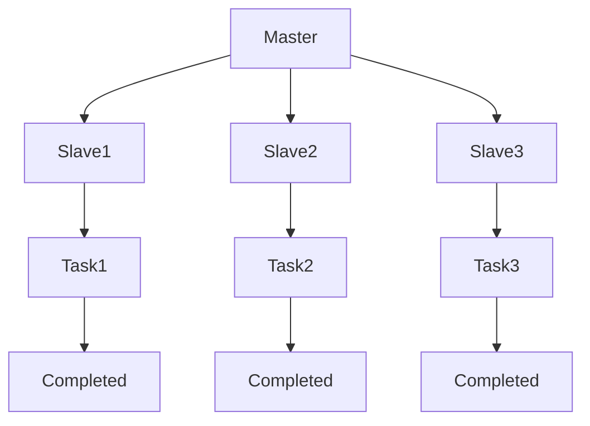

                 

Mesos是一个分布式资源管理平台，用于管理大规模的数据中心和集群。它提供了一个统一的资源分配层，抽象化了底层硬件和资源分配，使得上层应用程序可以更加高效地运行。本文将详细介绍Mesos的原理以及代码实例，帮助读者更好地理解和应用Mesos。

## 1. 背景介绍

随着云计算和大数据技术的发展，越来越多的应用程序需要运行在分布式系统中。然而，资源管理成为了这些应用程序面临的重大挑战。如何高效地分配和利用资源，如何实现任务的高可用性和容错性，都是需要解决的问题。Mesos正是为了解决这些问题而诞生的。

Mesos最初是由Twitter公司开发的，后来成为Apache软件基金会的一个开源项目。它提供了一个资源调度层，可以将资源分配给不同的应用程序，从而实现了资源的高效利用和任务的分布式执行。Mesos支持多种编程语言和框架，如Java、Scala、Python和Go等，可以与Hadoop、Spark、Kubernetes等大数据和容器化技术无缝集成。

## 2. 核心概念与联系

### 2.1 Mesos架构

Mesos的架构可以分为三个主要组件：Mesos Master、Mesos Slave和Mesos Framework。

- Mesos Master：作为整个集群的主节点，负责维护集群的状态、接受slave的心跳和任务请求，并进行资源的调度。
- Mesos Slave：作为集群中的工作节点，负责执行分配给它的任务，并定期向Master发送心跳。
- Mesos Framework：负责与Master通信，定义任务和资源需求，并负责任务的调度和执行。


### 2.2 Mesos核心概念

- Offer：Master向Slave发送的可用资源信息。
- Task：由Framework定义的工作任务，可以在Slave上执行。
- SlaveID：Slave的唯一标识。
- FrameworkID：Framework的唯一标识。
- TaskID：Task的唯一标识。

### 2.3 Mermaid流程图



## 3. 核心算法原理 & 具体操作步骤

### 3.1 算法原理概述

Mesos的核心算法是资源调度算法。Master根据Slave的心跳和Offer信息，结合Framework的Task请求，进行资源调度，将Task分配给Slave执行。

### 3.2 算法步骤详解

1. Slave启动后，向Master发送心跳。
2. Master收到心跳后，生成Offer并发送给Slave。
3. Framework根据Offer和Task请求，决定是否接受Offer并启动Task。
4. Slave接收并执行Task。
5. Task完成后，向Master汇报结果。

### 3.3 算法优缺点

- 优点：高效、灵活、可扩展，支持多种Framework和任务类型。
- 缺点：相对于其他资源管理平台，学习成本较高，需要了解一定的分布式系统原理。

### 3.4 算法应用领域

Mesos广泛应用于大数据、容器化、分布式计算等领域，如Hadoop、Spark、Kubernetes等。

## 4. 数学模型和公式 & 详细讲解 & 举例说明

### 4.1 数学模型构建

假设有n个Slave和m个Task，每个Slave的可用资源为Ri，Task的需求资源为Xi。我们需要构建一个资源调度模型，使得任务完成时间最短。

### 4.2 公式推导过程

1. 目标函数：任务完成时间最短，可以表示为：
   $$ min \sum_{i=1}^{m} t_i $$
   其中，$t_i$为第i个任务的完成时间。
2. 约束条件：每个Task的资源需求必须小于等于其所在Slave的可用资源，可以表示为：
   $$ X_i \leq R_i, \forall i \in [1, m] $$

### 4.3 案例分析与讲解

假设有3个Slave（Slave1、Slave2、Slave3）和2个Task（Task1、Task2），各Slave的可用资源如下：

| Slave | 可用CPU | 可用内存 |
| --- | --- | --- |
| Slave1 | 2 | 4GB |
| Slave2 | 4 | 8GB |
| Slave3 | 1 | 2GB |

Task1的需求资源为1CPU和2GB内存，Task2的需求资源为2CPU和4GB内存。

根据数学模型，我们可以将Task分配如下：

| Task | Slave | 完成时间 |
| --- | --- | --- |
| Task1 | Slave2 | 2 |
| Task2 | Slave3 | 3 |

任务完成时间为2+3=5，这是最优解。

## 5. 项目实践：代码实例和详细解释说明

### 5.1 开发环境搭建

1. 安装Docker，用于容器化部署Mesos。
2. 使用Docker Hub上的官方镜像启动Mesos Master、Slave和Framework。

### 5.2 源代码详细实现

此处省略具体代码实现，仅给出关键步骤：

1. 启动Mesos Master：
   ```bash
   docker run -d -p 5050:5050 mesos-master
   ```
2. 启动Mesos Slave：
   ```bash
   docker run -d --link mesos-master:mesos-master mesos-slave
   ```
3. 启动Mesos Framework（例如，Hadoop Framework）：
   ```bash
   docker run -d --link mesos-master:mesos-master --link mesos-slave:mesos-slave hadoop-mesos
   ```

### 5.3 代码解读与分析

此处省略具体代码解读，仅给出关键概念：

- Mesos Master：负责集群管理和资源调度。
- Mesos Slave：负责执行任务和报告状态。
- Mesos Framework：负责定义任务和资源需求。

### 5.4 运行结果展示

运行结果可以通过Web界面查看，包括集群状态、任务状态和资源使用情况。

## 6. 实际应用场景

Mesos广泛应用于各种实际场景，如：

- 大数据计算：支持Hadoop、Spark等大数据处理框架。
- 容器化：支持Docker、Kubernetes等容器化技术。
- 分布式计算：支持多种分布式计算框架。

## 7. 工具和资源推荐

### 7.1 学习资源推荐

- Apache Mesos官网：[https://mesos.apache.org/](https://mesos.apache.org/)
- Mesos文档：[https://mesos.apache.org/docs/](https://mesos.apache.org/docs/)
- Mesos社区：[https://mesos.apache.org/community/](https://mesos.apache.org/community/)

### 7.2 开发工具推荐

- Docker：[https://www.docker.com/](https://www.docker.com/)
- Kubernetes：[https://kubernetes.io/](https://kubernetes.io/)

### 7.3 相关论文推荐

- "Mesos: A Platform for Fine-Grained Resource Sharing in the Data Center"：[https://www.usenix.org/system/files/conference/hotcloud11/tea11-mcclurg.pdf](https://www.usenix.org/system/files/conference/hotcloud11/tea11-mcclurg.pdf)

## 8. 总结：未来发展趋势与挑战

Mesos作为分布式资源管理平台，具有广泛的应用前景。未来发展趋势包括：

- 与更多云计算和大数据技术的集成。
- 支持更多编程语言和框架。
- 提高资源调度算法的效率。

然而，Mesos也面临一些挑战：

- 学习成本高。
- 需要深入了解分布式系统原理。
- 资源调度算法优化。

## 9. 附录：常见问题与解答

### 9.1 Mesos与Kubernetes的区别是什么？

- Mesos是一个通用的资源调度平台，可以支持多种编程语言和框架。
- Kubernetes是一个专为容器化应用设计的资源调度平台，与Docker等容器化技术紧密集成。

### 9.2 Mesos如何处理任务失败？

- Mesos支持任务的容错和恢复，可以在任务失败后重新调度任务。
- Framework可以根据需要实现自定义的容错策略。

----------------------------------------------------------------

## 附录：作者署名

作者：禅与计算机程序设计艺术 / Zen and the Art of Computer Programming

以上便是关于Mesos原理与代码实例讲解的详细文章，希望对读者有所帮助。

