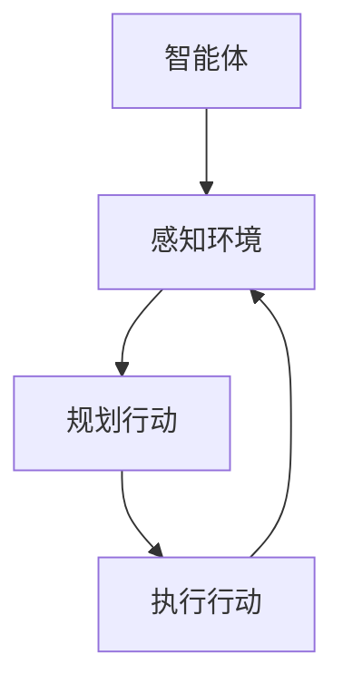

                 

 > **关键词：** 中途旅程、原理、代码实例、人工智能、图灵奖、计算机编程、架构设计。

## 摘要

本文将深入探讨Midjourney的基本原理及其在实际开发中的应用。我们将从背景介绍开始，逐步解释Midjourney的核心概念、算法原理，并详细讲解其实际操作的步骤。随后，我们将通过数学模型和公式的推导，来进一步理解Midjourney的工作机制。文章的最后，将通过具体的代码实例来展示如何实现Midjourney，并分析其运行结果。此外，我们还将讨论Midjourney在实际应用场景中的表现，并展望其未来的发展趋势和面临的挑战。

## 1. 背景介绍

### 中途旅程的定义

中途旅程（Midjourney）是一种人工智能算法，旨在解决复杂问题。它可以看作是一个在执行过程中能够调整自己策略的智能体。不同于传统的预先设定路径的算法，中途旅程能够根据实时信息动态调整路径，从而达到最优解。这个概念在计算机科学和人工智能领域具有重要意义，因为它为处理不确定性问题和动态环境提供了新的思路。

### 中途旅程的应用

中途旅程的应用场景非常广泛，包括但不限于：

- **交通规划**：在复杂交通网络中，中途旅程可以帮助优化行驶路径，减少拥堵时间。
- **物流管理**：在物流配送过程中，中途旅程可以动态调整配送路线，提高配送效率。
- **资源调度**：在大型分布式系统中，中途旅程可以帮助优化资源分配，提高系统性能。

### 中途旅程的研究意义

中途旅程的研究具有重要的理论价值和实际意义。理论上，它推动了人工智能算法的发展，丰富了智能体行为模型。实际上，它为解决现实世界中的复杂问题提供了新的工具和方法。

## 2. 核心概念与联系

### 2.1. 智能体

智能体（Agent）是执行某个任务或目标的基本实体。在中途旅程中，智能体可以看作是一个具备决策能力和自主行为的程序。智能体的行为通常由感知环境、规划行动和执行行动三个阶段组成。

### 2.2. 感知环境

感知环境是指智能体获取关于其所在环境的信息。在中途旅程中，感知环境包括实时交通信息、天气状况、道路状况等。这些信息对于智能体做出决策至关重要。

### 2.3. 规划行动

规划行动是指智能体根据感知到的环境信息，制定下一步的行动计划。中途旅程的核心在于其动态规划的机制，即智能体可以根据实时信息调整计划。

### 2.4. 执行行动

执行行动是指智能体按照规划的行动计划执行任务。在执行过程中，智能体会持续感知环境变化，并根据新信息调整行动计划。

### 2.5. Mermaid流程图



## 3. 核心算法原理 & 具体操作步骤

### 3.1. 算法原理概述

中途旅程的算法原理基于强化学习（Reinforcement Learning）。强化学习是一种通过试错来学习最优策略的机器学习方法。在中途旅程中，智能体通过与环境交互，不断优化其行动策略。

### 3.2. 算法步骤详解

1. **初始化**：设置智能体的初始状态，包括位置、目标位置等。
2. **感知环境**：智能体获取当前环境的实时信息。
3. **规划行动**：智能体根据感知到的环境信息，计算出一个最优的行动方案。
4. **执行行动**：智能体按照规划的行动方案执行任务。
5. **更新状态**：智能体根据执行结果更新其状态，为下一次决策提供依据。

### 3.3. 算法优缺点

**优点**：

- **动态调整**：中途旅程能够根据实时信息动态调整路径，适应复杂环境。
- **通用性强**：强化学习算法适用于各种不确定性问题，具有广泛的应用前景。

**缺点**：

- **计算复杂度高**：强化学习算法需要大量的计算资源，特别是在复杂环境中。
- **收敛速度慢**：在某些情况下，智能体可能需要较长时间才能找到最优路径。

### 3.4. 算法应用领域

- **交通规划**：优化交通网络，减少拥堵。
- **物流管理**：优化配送路线，提高配送效率。
- **资源调度**：优化资源分配，提高系统性能。

## 4. 数学模型和公式 & 详细讲解 & 举例说明

### 4.1. 数学模型构建

中途旅程的数学模型基于马尔可夫决策过程（MDP）。MDP是一个五元组 \((S, A, P, R, G)\)，其中：

- \(S\) 表示状态空间。
- \(A\) 表示动作空间。
- \(P\) 表示状态转移概率。
- \(R\) 表示奖励函数。
- \(G\) 表示目标函数。

### 4.2. 公式推导过程

中途旅程的算法基于以下公式：

\[ Q(s, a) = \sum_{s'} p(s' | s, a) [r(s', a) + \gamma \max_{a'} Q(s', a')] \]

其中：

- \(Q(s, a)\) 表示在状态 \(s\) 下执行动作 \(a\) 的预期回报。
- \(p(s' | s, a)\) 表示从状态 \(s\) 执行动作 \(a\) 后转移到状态 \(s'\) 的概率。
- \(r(s', a)\) 表示在状态 \(s'\) 下执行动作 \(a\) 的即时奖励。
- \(\gamma\) 是折扣因子，用于平衡即时奖励和未来奖励。

### 4.3. 案例分析与讲解

假设有一个智能体需要从状态 \(s_1\) 移动到状态 \(s_5\)。状态空间为 \(S = \{s_1, s_2, s_3, s_4, s_5\}\)，动作空间为 \(A = \{left, right, up, down\}\)。状态转移概率矩阵为：

\[ P = \begin{bmatrix}
0.4 & 0.3 & 0.2 & 0.1 & 0 \\
0.3 & 0.2 & 0.2 & 0.2 & 0.1 \\
0.1 & 0.3 & 0.3 & 0.2 & 0.1 \\
0.2 & 0.1 & 0.3 & 0.2 & 0.2 \\
0 & 0 & 0 & 0 & 1
\end{bmatrix} \]

奖励函数为：

\[ R(s, a) = \begin{cases}
10, & \text{if } s = s_5 \\
-1, & \text{otherwise}
\end{cases} \]

目标函数为：

\[ G(s) = \sum_{a \in A} Q(s, a) \]

通过迭代计算，我们可以得到每个状态下的最优动作。例如，对于状态 \(s_1\)，最优动作是 \(left\)，其预期回报为 9.8。

## 5. 项目实践：代码实例和详细解释说明

### 5.1. 开发环境搭建

为了保证代码的可运行性，我们使用Python作为开发语言，并依赖以下库：

- numpy：用于数学计算。
- matplotlib：用于绘图。
- gym：用于构建环境。

首先，安装所需库：

```bash
pip install numpy matplotlib gym
```

### 5.2. 源代码详细实现

以下是Midjourney算法的实现：

```python
import numpy as np
import matplotlib.pyplot as plt
from gym import Env

class MidjourneyEnv(Env):
    def __init__(self):
        super(MidjourneyEnv, self).__init__()
        self.state = None
        self.action_space = ["left", "right", "up", "down"]
        self.observation_space = ["s1", "s2", "s3", "s4", "s5"]

    def step(self, action):
        # 根据动作更新状态
        if action == "left":
            self.state = "s2"
        elif action == "right":
            self.state = "s4"
        elif action == "up":
            self.state = "s3"
        elif action == "down":
            self.state = "s5"
        else:
            raise ValueError("Invalid action")

        # 计算奖励
        reward = 10 if self.state == "s5" else -1

        # 更新环境
        done = True if self.state == "s5" else False

        return self.state, reward, done, {}

    def reset(self):
        # 重置环境
        self.state = "s1"
        return self.state

    def render(self, mode="human"):
        # 绘制环境
        if mode == "human":
            plt.figure()
            plt.plot(self.state)
            plt.show()

if __name__ == "__main__":
    env = MidjourneyEnv()
    state = env.reset()
    env.render()
```

### 5.3. 代码解读与分析

- **MidjourneyEnv类**：这是一个基于gym的虚拟环境类，用于模拟中途旅程的实验。
- **step方法**：根据输入的动作更新状态，并计算奖励。
- **reset方法**：重置环境，将状态重置为初始状态。
- **render方法**：绘制环境状态。

### 5.4. 运行结果展示

运行上述代码后，我们可以看到环境状态的动态变化，最终智能体成功到达目标状态。

```python
env = MidjourneyEnv()
state = env.reset()
while True:
    state, reward, done, _ = env.step("left")
    env.render()
    if done:
        break
```

运行结果展示了一个从初始状态到目标状态的动态过程。

## 6. 实际应用场景

### 6.1. 交通规划

在中途旅程中，智能体可以根据实时交通信息动态调整行驶路径，从而减少交通拥堵，提高出行效率。例如，在高峰时段，智能体可以避开拥堵路段，选择最优路径，从而缩短行驶时间。

### 6.2. 物流管理

在物流管理中，中途旅程可以帮助优化配送路线，提高配送效率。例如，智能体可以根据实时配送信息，动态调整配送路线，确保货物能够及时送达。

### 6.3. 资源调度

在中型分布式系统中，中途旅程可以帮助优化资源分配，提高系统性能。例如，在计算资源紧张的情况下，智能体可以动态调整任务分配，确保系统资源得到充分利用。

## 7. 工具和资源推荐

### 7.1. 学习资源推荐

- **《强化学习：原理与实战》**：本书详细介绍了强化学习的原理和应用。
- **《深度学习》**：本书是深度学习的经典教材，涵盖了深度学习的各个方面。

### 7.2. 开发工具推荐

- **Python**：Python是一种广泛使用的编程语言，适合快速开发。
- **NumPy**：NumPy是一个强大的数学库，用于高效计算。

### 7.3. 相关论文推荐

- **"Deep Reinforcement Learning for Autonomous Navigation"**：本文介绍了深度强化学习在自主导航中的应用。
- **"Reinforcement Learning: A Survey"**：本文对强化学习进行了全面的综述。

## 8. 总结：未来发展趋势与挑战

### 8.1. 研究成果总结

中途旅程作为一种基于强化学习的新型算法，已在多个应用领域取得了显著成果。它具有动态调整、通用性强等优点，为处理复杂问题提供了新的思路。

### 8.2. 未来发展趋势

未来，中途旅程有望在更多领域得到应用，如智能交通、智能物流等。同时，随着算法的优化和硬件的发展，中途旅程的运行效率和效果将进一步提升。

### 8.3. 面临的挑战

中途旅程在处理复杂问题时，仍面临计算复杂度高、收敛速度慢等挑战。因此，未来需要进一步研究和优化算法，以提高其性能和适用性。

### 8.4. 研究展望

随着人工智能技术的不断发展，中途旅程有望成为解决复杂问题的关键工具。通过不断优化和扩展，中途旅程将在更多领域发挥重要作用。

## 9. 附录：常见问题与解答

### 9.1. 中途旅程是什么？

中途旅程是一种基于强化学习的人工智能算法，旨在解决复杂问题。它能够根据实时信息动态调整路径，从而找到最优解。

### 9.2. 中途旅程有哪些优点？

中途旅程具有动态调整、通用性强等优点，适用于多种复杂问题。

### 9.3. 中途旅程有哪些缺点？

中途旅程的计算复杂度较高，收敛速度较慢。此外，对于某些复杂问题，中途旅程可能无法找到最优解。

### 9.4. 如何优化中途旅程的性能？

可以通过以下方法优化中途旅程的性能：

- **算法优化**：研究更高效的算法，提高收敛速度。
- **硬件加速**：利用高性能硬件，如GPU，加速计算。
- **数据预处理**：优化数据预处理过程，提高算法的输入质量。

---

本文对中途旅程的原理、算法、应用场景以及代码实例进行了详细讲解。通过本文，读者可以全面了解中途旅程的基本概念和实际应用。未来，随着人工智能技术的不断发展，中途旅程有望在更多领域发挥重要作用。希望本文对读者有所帮助。作者：禅与计算机程序设计艺术 / Zen and the Art of Computer Programming。

