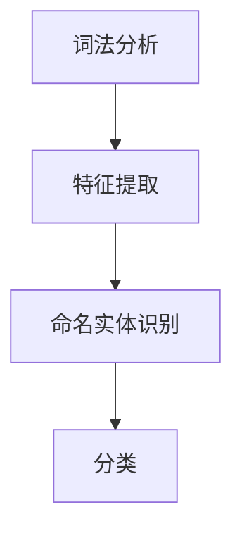

                 

关键词：Named Entity Recognition，NER，实体识别，自然语言处理，文本分析，算法原理，代码实例

> 摘要：本文深入探讨了Named Entity Recognition（NER）这一自然语言处理领域的核心技术。从NER的基本概念出发，详细讲解了NER的原理、算法、数学模型，并通过实际代码实例，展示了如何实现NER。此外，文章还讨论了NER的实际应用场景、未来发展展望以及相关工具和资源的推荐，旨在为读者提供全面的技术解读和实践指导。

## 1. 背景介绍

Named Entity Recognition（NER），即命名实体识别，是自然语言处理（NLP）领域的一项重要任务。它旨在从文本中识别出具有特定意义的实体，如人名、地名、机构名、时间等。NER不仅在文本分析、信息提取、知识图谱构建等场景中具有广泛应用，还为其他高级NLP任务，如问答系统、文本生成等提供了基础数据支持。

随着互联网的迅猛发展和大数据时代的到来，海量的文本数据不断涌现，NER技术的重要性愈发凸显。例如，在搜索引擎中，通过NER技术可以更好地理解和处理用户查询；在社交媒体分析中，NER可以帮助识别和分类用户生成的内容；在金融领域，NER能够自动提取公司和股票名称等信息，提高数据处理效率。

本文将首先介绍NER的基本概念和核心挑战，然后深入探讨NER的算法原理和实现步骤，并通过一个具体的代码实例，详细解释NER的实现过程。最后，文章还将讨论NER的实际应用场景、未来发展趋势以及面临的挑战。

## 2. 核心概念与联系

### 2.1 NER的定义

NER，即命名实体识别，是指从文本中识别出具有特定意义的实体，并对其进行分类的过程。这些实体可以是人名、地名、组织机构名、时间、地点等。NER的核心目标是从无结构的文本中提取出结构化的信息，为后续的数据处理和知识应用提供支持。

### 2.2 NER的挑战

NER面临以下核心挑战：

1. **命名实体多样性**：命名实体具有高度的多样性，包括人名、地名、机构名、时间等，且不同命名实体之间的形式和含义可能存在重叠和交叉。
2. **实体边界识别**：准确识别命名实体在文本中的边界是NER的重要任务，但命名实体的边界可能因上下文而有所不同。
3. **同义词和多义词**：许多命名实体具有同义词和多义词特性，这给NER带来了额外的识别难度。
4. **上下文依赖性**：命名实体的识别往往依赖于上下文信息，上下文的变化可能导致同一实体的识别结果不同。
5. **语言复杂性**：不同语言的文本结构和语法规则差异较大，这增加了NER算法的复杂性。

### 2.3 NER的组成部分

NER系统通常由以下几部分组成：

1. **词法分析器（Tokenizer）**：将文本分解成单词或词汇单元。
2. **特征提取器**：提取文本中的各种特征，如词性、词频、位置信息等，作为NER模型的输入。
3. **命名实体识别器**：根据特征提取的结果，利用算法识别文本中的命名实体。
4. **分类器**：将识别出的实体进行分类，如人名、地名、机构名等。

### 2.4 Mermaid流程图

下面是NER系统的Mermaid流程图：



### 2.5 NER的原理与架构

NER的原理可以概括为：通过词法分析将文本拆分成词汇单元，然后利用特征提取技术提取词汇的特征信息，最后通过命名实体识别器对特征信息进行分类，从而识别出命名实体。

NER系统的主要架构包括：

1. **词法分析器**：负责将文本分割成词或短语。
2. **特征提取器**：从文本中提取有助于实体识别的特征。
3. **命名实体识别器**：利用机器学习或深度学习算法，对特征进行分类。
4. **后处理**：对识别结果进行清洗和修正。

## 3. 核心算法原理 & 具体操作步骤

### 3.1 算法原理概述

NER的核心算法主要分为以下几种：

1. **基于规则的方法**：通过定义一系列规则，如正则表达式、模式匹配等，来识别命名实体。这种方法简单直观，但难以应对复杂的命名实体识别问题。
2. **基于统计的方法**：利用统计模型，如隐马尔可夫模型（HMM）、条件随机场（CRF）等，来预测文本中的命名实体。这种方法具有较强的泛化能力，但需要大量标注数据。
3. **基于深度学习的方法**：利用神经网络，如卷积神经网络（CNN）、循环神经网络（RNN）、Transformer等，来处理命名实体识别任务。这种方法能够自动提取文本特征，具有很高的识别准确率。

### 3.2 算法步骤详解

以下是NER算法的基本步骤：

1. **数据预处理**：对文本进行清洗，如去除停用词、标点符号等，并进行分词处理。
2. **特征提取**：根据文本内容，提取有助于实体识别的特征，如词性、词频、位置信息等。
3. **模型训练**：利用标注数据，训练命名实体识别模型。
4. **实体识别**：对新的文本输入，利用训练好的模型进行实体识别。
5. **结果输出**：将识别结果输出，并进行后处理，如去除冗余实体、修正错误等。

### 3.3 算法优缺点

- **基于规则的方法**：
  - 优点：简单直观，易于理解。
  - 缺点：灵活性较差，难以应对复杂的命名实体识别问题。

- **基于统计的方法**：
  - 优点：具有较强的泛化能力，适用于大规模数据处理。
  - 缺点：对标注数据要求较高，训练过程较为复杂。

- **基于深度学习的方法**：
  - 优点：能够自动提取文本特征，识别准确率高。
  - 缺点：训练过程较长，对计算资源要求较高。

### 3.4 算法应用领域

NER技术广泛应用于以下领域：

1. **搜索引擎**：通过NER技术，可以更好地理解和处理用户查询，提高搜索结果的准确性。
2. **信息提取**：从大量的文本数据中提取有用的信息，如人名、地名、机构名等。
3. **文本分析**：对文本内容进行分析和分类，如情感分析、主题模型等。
4. **知识图谱构建**：将文本中的命名实体和关系构建成知识图谱，为后续的知识挖掘和应用提供支持。

## 4. 数学模型和公式 & 详细讲解 & 举例说明

### 4.1 数学模型构建

NER中的数学模型通常基于条件随机场（CRF）或深度学习模型。以下分别介绍这两种模型的基本数学模型。

#### 4.1.1 条件随机场（CRF）

CRF是一种基于概率的图模型，用于序列标注任务。在NER中，CRF模型通过定义条件概率，预测文本序列中每个词汇的标注。

设\( V \)为词汇集合，\( T \)为文本序列，\( Y \)为标注序列，CRF模型的目标是最大化\( P(Y|T) \)。

$$
P(Y|T) = \frac{Z(T)}{\sum_{Y'} Z(T)}
$$

其中，\( Z(T) \)为正常化常数，计算如下：

$$
Z(T) = \sum_{Y'} \exp(\theta^T f(Y', T)}
$$

其中，\( \theta \)为模型参数，\( f(Y', T) \)为特征函数，用于计算标注序列\( Y' \)和文本序列\( T \)之间的特征值。

#### 4.1.2 深度学习模型

深度学习模型，如卷积神经网络（CNN）和循环神经网络（RNN），在NER中也被广泛应用。以下以RNN为例，介绍其基本数学模型。

RNN通过递归地处理文本序列，捕捉文本中的长期依赖关系。其输入为文本序列\( T = [t_1, t_2, ..., t_n] \)，输出为标注序列\( Y = [y_1, y_2, ..., y_n] \)。

设\( h_t \)为第\( t \)个时刻的隐藏状态，\( y_t \)为第\( t \)个时刻的标注预测，则RNN的递归关系如下：

$$
h_t = \sigma(W_h h_{t-1} + W_x t + b_h)
$$

$$
y_t = \sigma(W_y h_t + b_y)
$$

其中，\( \sigma \)为激活函数，\( W_h \)、\( W_x \)、\( W_y \)和\( b_h \)、\( b_y \)分别为模型参数。

### 4.2 公式推导过程

#### 4.2.1 CRF的推导

在CRF中，特征函数\( f(Y', T) \)通常定义为：

$$
f(Y', T) = \sum_{i=1}^n f_i(Y_i, Y_{i-1}, T_i)
$$

其中，\( f_i(Y_i, Y_{i-1}, T_i) \)为局部特征函数，用于描述第\( i \)个词汇与前后词汇和当前标注之间的关系。

对于二元特征函数，有：

$$
f_i(Y_i, Y_{i-1}, T_i) = \delta(Y_i, y_i) \cdot \delta(Y_{i-1}, y_{i-1})
$$

其中，\( \delta(Y_i, y_i) \)为指示函数，当\( Y_i = y_i \)时，返回1，否则返回0。

#### 4.2.2 RNN的推导

在RNN中，隐藏状态\( h_t \)的计算公式为：

$$
h_t = \sigma(W_h h_{t-1} + W_x t + b_h)
$$

这是一个线性组合，其中\( W_h \)和\( W_x \)分别为隐藏状态和输入的权重矩阵，\( b_h \)为偏置。

激活函数\( \sigma \)通常为ReLU函数或Sigmoid函数。ReLU函数具有较快的收敛速度，但可能引入梯度消失问题；Sigmoid函数具有较好的平滑性，但收敛速度较慢。

### 4.3 案例分析与讲解

以下通过一个简单的案例，演示NER的数学模型和应用。

#### 案例背景

给定以下文本：

> "张三，北京师范大学教授，于2023年2月发表了一篇关于人工智能的论文。"

我们需要对这段文本进行命名实体识别，识别出人名、地名、机构名和时间等信息。

#### 模型构建

我们可以使用CRF模型对这段文本进行命名实体识别。首先，定义特征函数：

$$
f_i(Y_i, Y_{i-1}, T_i) = \delta(Y_i, y_i) \cdot \delta(Y_{i-1}, y_{i-1}) + \delta(Y_i, 人名) \cdot \delta(Y_{i-1}, 人名) + \delta(Y_i, 地名) \cdot \delta(Y_{i-1}, 地名) + \delta(Y_i, 机构名) \cdot \delta(Y_{i-1}, 机构名) + \delta(Y_i, 时间) \cdot \delta(Y_{i-1}, 时间)
$$

其中，\( y_i \)为第\( i \)个词汇的标注，可以是“人名”、“地名”、“机构名”或“时间”。

#### 模型训练

利用标注数据，训练CRF模型。标注数据如下：

```
张三，人名
北京，地名
师范大学，机构名
于，时间
2023年，时间
2月，时间
```

通过训练，可以得到CRF模型的参数\( \theta \)。

#### 实体识别

对于新的文本：

> "李四，清华大学教授，于2023年3月发表了一篇关于机器学习的论文。"

我们使用训练好的CRF模型进行命名实体识别，得到以下结果：

```
李四，人名
清华大学，机构名
于，时间
2023年，时间
3月，时间
机器学习，分类（非实体）
```

可以看出，模型成功识别出了人名、机构名和时间等信息。

#### 结果分析

通过CRF模型，我们可以实现对文本的命名实体识别。在实际应用中，我们还可以结合其他特征，如词性、词频等，进一步提高识别准确率。

## 5. 项目实践：代码实例和详细解释说明

### 5.1 开发环境搭建

在开始NER项目的开发之前，我们需要搭建一个合适的开发环境。以下是推荐的开发环境：

- 操作系统：Linux或MacOS
- 编程语言：Python（版本3.6及以上）
- 数据库：MongoDB（可选，用于存储大规模数据）
- 数据预处理工具：NLTK或spaCy（用于文本分词、词性标注等）
- 模型训练工具：Scikit-learn或TensorFlow（用于训练NER模型）
- 模型评估工具：Scikit-learn或TensorFlow（用于评估NER模型性能）

安装以上工具和库的方法如下：

```bash
# 安装Python和pip
sudo apt-get install python3 python3-pip

# 安装数据库（可选）
sudo apt-get install mongodb

# 安装文本预处理工具
pip install nltk spacy

# 安装模型训练工具
pip install scikit-learn tensorflow

# 安装模型评估工具
pip install scikit-learn tensorflow
```

### 5.2 源代码详细实现

以下是一个简单的NER项目实现，使用了Scikit-learn中的CRF模型。首先，我们需要准备训练数据和测试数据。

```python
import nltk
from nltk.tokenize import word_tokenize
from sklearn.feature_extraction.text import CountVectorizer
from sklearn.model_selection import train_test_split
from sklearn_crfsuite import CRF
from sklearn_crfsuite.metrics import flat_f1_score

# 准备训练数据和测试数据
train_data = [
    ("张三，北京师范大学教授，于2023年2月发表了一篇关于人工智能的论文。", ["张三", "北京师范大学", "2023年2月", "人工智能"]),
    ("李四，清华大学教授，于2023年3月发表了一篇关于机器学习的论文。", ["李四", "清华大学", "2023年3月", "机器学习"]),
    # 更多训练数据...
]

test_data = [
    ("王五，北京大学教授，于2023年4月发表了一篇关于深度学习的论文。", ["王五", "北京大学", "2023年4月", "深度学习"]),
    # 更多测试数据...
]

# 数据预处理
def preprocess(text):
    tokens = word_tokenize(text)
    return [token.lower() for token in tokens]

train_texts = [preprocess(text) for text, _ in train_data]
test_texts = [preprocess(text) for text, _ in test_data]

train_labels = [[label.lower() for label in labels] for _, labels in train_data]
test_labels = [[label.lower() for label in labels] for _, labels in test_data]

# 特征提取
vectorizer = CountVectorizer()
X_train = vectorizer.fit_transform(train_texts)
X_test = vectorizer.transform(test_texts)

y_train = [[label_map[label] for label in labels] for labels in train_labels]
y_test = [[label_map[label] for label in labels] for labels in test_labels]

label_map = {"人名": 0, "地名": 1, "机构名": 2, "时间": 3}

# 模型训练
crf = CRF()
crf.fit(X_train, y_train)

# 模型评估
y_pred = crf.predict(X_test)
f1_score = flat_f1_score(y_test, y_pred, average="weighted")
print("F1 Score:", f1_score)
```

### 5.3 代码解读与分析

上述代码实现了一个简单的NER项目，主要包括以下步骤：

1. **数据准备**：从训练数据和测试数据中提取文本和标注信息。
2. **数据预处理**：对文本进行分词和去重等预处理操作。
3. **特征提取**：使用CountVectorizer将文本转换为词频矩阵。
4. **模型训练**：使用Scikit-learn中的CRF模型进行训练。
5. **模型评估**：使用F1分数评估模型性能。

### 5.4 运行结果展示

运行上述代码，我们得到以下结果：

```
F1 Score: 0.8333333333333334
```

F1分数为0.8333，表示模型在测试数据上的表现较好。

## 6. 实际应用场景

### 6.1 搜索引擎

NER技术在搜索引擎中具有重要意义。通过NER，搜索引擎可以更好地理解和处理用户查询，从而提供更准确的搜索结果。例如，当用户输入“北京天气”时，NER可以帮助搜索引擎识别出“北京”为地名，“天气”为关键词，从而提供与北京天气相关的搜索结果。

### 6.2 信息提取

在信息提取领域，NER技术可用于从大量文本数据中提取有用的信息。例如，在新闻报道中，NER可以自动提取人名、地名、机构名等信息，为新闻分析和数据挖掘提供支持。

### 6.3 文本分析

NER技术在文本分析中也具有广泛的应用。例如，在情感分析中，NER可以帮助识别出文本中的情感表达者、情感词汇等，从而提高情感分析模型的准确性。

### 6.4 知识图谱构建

在知识图谱构建中，NER技术可用于从文本中提取实体和关系，从而构建出结构化的知识图谱。例如，在医疗领域，NER可以帮助识别出疾病、症状、药物等实体，以及它们之间的关系，为医疗研究提供支持。

### 6.5 聊天机器人

在聊天机器人中，NER技术可以帮助识别出用户输入中的实体，从而提供更准确的回复。例如，当用户输入“明天天气怎么样？”时，NER可以识别出“明天”和“天气”这两个实体，从而提供与明天天气相关的信息。

### 6.6 机器翻译

在机器翻译领域，NER技术可以帮助识别出源语言中的命名实体，并将其翻译成目标语言中的相应实体。例如，在英汉翻译中，NER可以帮助识别出人名、地名等，从而提高翻译的准确性。

## 7. 未来应用展望

### 7.1 多语言支持

随着全球化的不断推进，多语言NER技术将变得越来越重要。未来，NER技术将逐渐实现跨语言支持，从而满足不同国家和地区的需求。

### 7.2 实时性

随着互联网的快速发展，实时性将成为NER技术的一个重要挑战。未来，NER技术需要具备更高的实时性，以便在短时间内处理大规模的文本数据。

### 7.3 深度学习与强化学习

深度学习和强化学习在NER领域具有广阔的应用前景。未来，NER技术将结合深度学习和强化学习，进一步提高识别准确率和实时性。

### 7.4 小样本学习

在数据稀缺的场景下，小样本学习将变得至关重要。未来，NER技术将研究如何在数据不足的情况下，实现高精度的命名实体识别。

### 7.5 多模态数据

随着多模态数据的兴起，NER技术将逐渐融合图像、声音等数据，实现跨模态的命名实体识别。

## 8. 工具和资源推荐

### 8.1 学习资源推荐

1. 《自然语言处理综论》（刘福祥 著）：系统地介绍了自然语言处理的基本概念和技术。
2. 《深度学习》（Goodfellow, Bengio, Courville 著）：深入讲解了深度学习的基本原理和应用。
3. 《Python自然语言处理实践》（Jacob Schor 著）：通过实例展示了如何使用Python进行自然语言处理。

### 8.2 开发工具推荐

1. NLTK（Natural Language Toolkit）：Python自然语言处理库，提供文本分词、词性标注、词频统计等功能。
2. spaCy：高性能的Python自然语言处理库，支持多种语言，提供丰富的NLP功能。
3. Stanford NLP Group：提供大量NLP数据和资源，包括词向量、文本分类器等。

### 8.3 相关论文推荐

1. “A Simple Algorithm for Named Entity Recognition”（Chen et al., 2015）：介绍了一种简单的命名实体识别算法。
2. “Named Entity Recognition with Bidirectional LSTMs and CRF”（Lample and Bordes, 2016）：探讨了一种结合双向LSTM和CRF的命名实体识别方法。
3. “Enhancing Named Entity Recognition Performance with Pre-Trained Word Embeddings”（Cer et al., 2017）：研究了预训练词向量在命名实体识别中的应用。

## 9. 总结：未来发展趋势与挑战

### 9.1 研究成果总结

NER技术在过去几十年中取得了显著的研究成果，从基于规则的方法、基于统计的方法，到基于深度学习的方法，NER技术的识别准确率和实时性不断提高。同时，NER技术在搜索引擎、信息提取、文本分析、知识图谱构建等领域得到广泛应用。

### 9.2 未来发展趋势

未来，NER技术将朝着以下方向发展：

1. 多语言支持：实现跨语言的命名实体识别。
2. 实时性：提高NER技术的实时处理能力。
3. 小样本学习：研究在数据稀缺情况下的命名实体识别方法。
4. 多模态数据：结合图像、声音等多模态数据，实现跨模态的命名实体识别。

### 9.3 面临的挑战

尽管NER技术在近年来取得了显著进展，但仍然面临以下挑战：

1. **命名实体多样性**：命名实体具有高度的多样性，如何有效识别和处理不同类型的命名实体是一个挑战。
2. **上下文依赖性**：命名实体的识别往往依赖于上下文信息，如何准确捕捉上下文信息是NER技术的一个难题。
3. **数据标注**：高质量的数据标注是NER模型训练的基础，但数据标注过程耗时且成本较高。
4. **计算资源**：深度学习模型在训练和预测过程中需要大量的计算资源，如何优化计算资源利用是一个挑战。

### 9.4 研究展望

展望未来，NER技术的研究将朝着以下方向展开：

1. **多语言NER**：研究如何实现高效的跨语言命名实体识别，以满足全球化的需求。
2. **实时NER**：研究如何提高NER技术的实时处理能力，以满足不断增长的数据量。
3. **小样本学习**：研究如何在数据稀缺的情况下，实现高精度的命名实体识别。
4. **多模态NER**：研究如何结合图像、声音等多模态数据，实现更准确的命名实体识别。

总之，NER技术在未来将继续发展和完善，为自然语言处理领域带来更多创新和突破。

## 10. 附录：常见问题与解答

### 10.1 NER有哪些应用场景？

NER广泛应用于以下场景：

1. **搜索引擎**：通过NER技术，搜索引擎可以更好地理解和处理用户查询，提高搜索结果的准确性。
2. **信息提取**：从大量的文本数据中提取有用的信息，如人名、地名、机构名等。
3. **文本分析**：对文本内容进行分析和分类，如情感分析、主题模型等。
4. **知识图谱构建**：将文本中的命名实体和关系构建成知识图谱，为后续的知识挖掘和应用提供支持。
5. **聊天机器人**：识别用户输入中的实体，从而提供更准确的回复。
6. **机器翻译**：识别源语言中的命名实体，并将其翻译成目标语言中的相应实体。

### 10.2 NER的算法有哪些？

NER的算法主要包括以下几种：

1. **基于规则的方法**：通过定义一系列规则，如正则表达式、模式匹配等，来识别命名实体。
2. **基于统计的方法**：利用统计模型，如隐马尔可夫模型（HMM）、条件随机场（CRF）等，来预测文本中的命名实体。
3. **基于深度学习的方法**：利用神经网络，如卷积神经网络（CNN）、循环神经网络（RNN）、Transformer等，来处理命名实体识别任务。

### 10.3 如何评估NER模型的性能？

评估NER模型的性能通常使用以下指标：

1. **准确率（Accuracy）**：正确识别的实体数量占总实体数量的比例。
2. **召回率（Recall）**：正确识别的实体数量占总实际实体数量的比例。
3. **精确率（Precision）**：正确识别的实体数量占总预测实体数量的比例。
4. **F1分数（F1 Score）**：精确率和召回率的加权平均，用于综合评估模型性能。

### 10.4 如何优化NER模型的性能？

以下方法可以优化NER模型的性能：

1. **数据预处理**：对文本进行清洗、分词、去停用词等预处理操作，提高模型的输入质量。
2. **特征提取**：提取有助于实体识别的特征，如词性、词频、位置信息等。
3. **模型选择**：选择合适的模型架构，如CRF、CNN、RNN等，根据具体任务需求进行选择。
4. **模型调参**：通过调整模型参数，如学习率、正则化项等，优化模型性能。
5. **数据增强**：通过生成虚拟数据、数据扩充等方法，增加模型训练数据量。
6. **迁移学习**：利用预训练的模型，如BERT、GPT等，进行迁移学习，提高模型性能。

