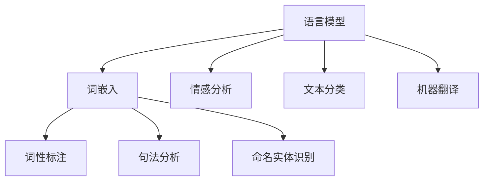

                 

 

## 1. 背景介绍

自然语言处理（Natural Language Processing，NLP）是人工智能（Artificial Intelligence，AI）的一个重要分支，旨在使计算机理解和解释人类语言。自20世纪50年代人工智能概念的提出以来，NLP逐渐成为一个独立的研究领域，并随着计算能力的提升和算法的改进，取得了显著的进展。

### 1.1 发展历程

NLP的发展历程可以分为三个阶段：

#### 1.1.1 早期阶段

早期NLP主要集中在词汇分析和句法分析上，例如词性标注、句法分析等。这一阶段的代表性工作是MIT的解析器系统，它使用基于规则的算法对英语文本进行分析。

#### 1.1.2 中期阶段

随着机器学习和深度学习技术的发展，NLP进入了一个新的阶段。这一阶段的代表性工作是统计机器翻译和基于统计的词性标注。这一时期的算法开始利用大量语料库，通过统计方法学习语言规律。

#### 1.1.3 当前阶段

当前，NLP进入了基于深度学习的时代。深度学习模型，如卷积神经网络（CNN）和循环神经网络（RNN），在NLP任务中取得了显著的成效，例如文本分类、机器翻译和情感分析等。

### 1.2 NLP的重要性

NLP的重要性体现在多个方面：

#### 1.2.1 人机交互

通过NLP技术，计算机可以更好地理解和解释人类的语言输入，从而实现更自然的人机交互。

#### 1.2.2 信息检索

NLP技术可以帮助计算机高效地处理和检索大量文本数据，为用户提供精准的信息。

#### 1.2.3 语音识别

语音识别是NLP的一个重要应用领域，通过NLP技术，计算机可以理解和执行用户的语音指令。

#### 1.2.4 情感分析

情感分析是NLP在商业和社交领域的重要应用，通过分析用户的情感倾向，帮助企业更好地了解用户需求。

### 1.3 NLP的应用场景

NLP的应用场景非常广泛，包括但不限于以下几个方面：

#### 1.3.1 文本分类

文本分类是将文本数据根据其内容进行分类的过程。例如，新闻分类、垃圾邮件过滤等。

#### 1.3.2 机器翻译

机器翻译是将一种自然语言翻译成另一种自然语言。例如，谷歌翻译、百度翻译等。

#### 1.3.3 情感分析

情感分析是通过分析文本内容，判断用户的情感倾向。例如，社交媒体情绪分析、产品评论分析等。

#### 1.3.4 命名实体识别

命名实体识别是识别文本中的特定实体，如人名、地名、组织名等。

#### 1.3.5 对话系统

对话系统是NLP在交互式应用中的重要应用，如智能客服、语音助手等。

### 1.4 本文结构

本文将首先介绍NLP的核心概念和联系，然后深入讲解NLP的核心算法原理和具体操作步骤，随后介绍NLP的数学模型和公式，并通过具体案例进行讲解。接下来，我们将通过一个实际项目，展示如何使用NLP技术进行文本分类。最后，我们将探讨NLP的实际应用场景和未来应用展望。

<|assistant|> 

## 2. 核心概念与联系

在NLP中，有几个核心概念和联系是理解和应用NLP技术的基础。以下是对这些概念的解释和它们之间的联系。

### 2.1 语言模型

语言模型是NLP中最基础的概念之一。它用于预测下一个单词或字符的概率，从而生成自然语言文本。语言模型可以分为两种：统计语言模型和神经语言模型。

- **统计语言模型**：基于大量文本数据，使用统计方法来计算单词或短语的联合概率。常见的统计语言模型有N元语法（N-gram）模型和隐马尔可夫模型（HMM）。

- **神经语言模型**：基于神经网络，特别是循环神经网络（RNN）和其变种，如长短期记忆网络（LSTM）和门控循环单元（GRU）。神经语言模型可以捕捉到更复杂的语言模式。

### 2.2 词嵌入

词嵌入是将单词转换为密集向量表示的一种技术，这使得计算机能够处理和理解单词的语义信息。词嵌入可以通过多种方法生成，如词袋模型（Bag of Words，BOW）、分布式表示（Distributed Representation）和词嵌入模型（Word Embedding Models）。

- **词袋模型**：将文本表示为一个向量，其中每个元素表示一个单词的出现次数。这种表示方法丢失了单词的顺序信息。

- **分布式表示**：将单词表示为一个向量，其中的每个元素表示单词与所有其他单词的共现频率。这种方法捕捉到了单词之间的语义关系。

- **词嵌入模型**：通过神经网络训练词嵌入向量，如Word2Vec、GloVe和BERT等。这些模型不仅考虑了单词的共现频率，还考虑了单词的上下文信息。

### 2.3 词性标注

词性标注是识别单词在句子中的词性（如名词、动词、形容词等）的过程。词性标注对于理解句子的结构和语义至关重要。

- **基于规则的方法**：使用预定义的规则和模式来标注词性。

- **基于统计的方法**：使用统计模型，如条件随机场（CRF）和最大熵模型（Maximum Entropy Model）来预测词性。

- **基于深度学习的方法**：使用神经网络，如卷积神经网络（CNN）和长短期记忆网络（LSTM）进行词性标注。

### 2.4 句法分析

句法分析是理解句子结构的工具，它涉及识别句子中的语法成分（如名词短语、动词短语等）和它们之间的关系。

- **基于规则的方法**：使用预定义的语法规则来分析句子结构。

- **基于统计的方法**：使用统计模型，如概率上下文无关文法（PCFG）和最大熵模型来预测句子结构。

- **基于深度学习的方法**：使用神经网络，如卷积神经网络（CNN）和长短期记忆网络（LSTM）进行句法分析。

### 2.5 命名实体识别

命名实体识别是识别文本中的特定实体（如人名、地名、组织名等）的过程。这是信息提取和知识图谱构建的重要步骤。

- **基于规则的方法**：使用预定义的规则和模式来识别实体。

- **基于统计的方法**：使用统计模型，如条件随机场（CRF）来识别实体。

- **基于深度学习的方法**：使用神经网络，如卷积神经网络（CNN）和长短期记忆网络（LSTM）进行实体识别。

### 2.6 情感分析

情感分析是识别文本中的情感倾向（如正面、负面、中性）的过程。它是市场研究、舆情分析和推荐系统等领域的重要应用。

- **基于规则的方法**：使用预定义的规则和模式来分析情感。

- **基于统计的方法**：使用统计模型，如支持向量机（SVM）和朴素贝叶斯（Naive Bayes）来分析情感。

- **基于深度学习的方法**：使用神经网络，如卷积神经网络（CNN）和长短期记忆网络（LSTM）进行情感分析。

### 2.7 语言模型与词嵌入的关系

语言模型和词嵌入是紧密相关的。词嵌入是语言模型的一个重要组成部分，它为语言模型提供了词级特征表示。语言模型可以基于词嵌入来预测下一个单词或字符，从而生成自然语言文本。例如，Word2Vec和GloVe等词嵌入模型在训练过程中不仅考虑了单词的共现频率，还考虑了单词的上下文信息，这使得它们能够捕捉到更复杂的语言模式。

### 2.8 语言模型与句法分析的关系

语言模型和句法分析也是紧密相关的。句法分析依赖于语言模型来预测句子中的语法结构。例如，在基于神经网络的句法分析中，语言模型通常用于生成句子的向量表示，这些表示用于训练神经网络模型来预测句子的结构。

### 2.9 语言模型、词嵌入、词性标注、句法分析和命名实体识别的关系

语言模型、词嵌入、词性标注、句法分析和命名实体识别是NLP中相互关联的重要技术。语言模型为其他NLP任务提供了文本表示，词嵌入将单词转换为向量表示，词性标注和句法分析用于理解句子的结构和语义，命名实体识别用于提取文本中的特定实体。这些技术相互协作，共同构建了一个强大的NLP系统。

### 2.10 Mermaid 流程图

以下是一个Mermaid流程图，展示了NLP中的核心概念和它们之间的联系：



在这个流程图中，语言模型作为NLP的基础，与其他核心概念相互连接，形成了NLP系统的整体架构。

### 2.11 小结

通过对NLP核心概念和它们之间联系的介绍，我们可以更好地理解NLP的工作原理和应用场景。在接下来的章节中，我们将深入探讨NLP的核心算法原理和具体操作步骤，以及如何使用这些算法解决实际问题。

<|assistant|>

## 3. 核心算法原理 & 具体操作步骤

在NLP中，有许多核心算法被广泛应用于各种任务。本章节将介绍一些常用的NLP算法，包括词嵌入、循环神经网络（RNN）、长短时记忆网络（LSTM）和变换器（Transformer）等，并详细解释它们的原理和操作步骤。

### 3.1 算法原理概述

#### 3.1.1 词嵌入

词嵌入（Word Embedding）是将单词映射为向量表示的技术。这种表示方法不仅保留了单词的语义信息，还使计算机能够处理和理解单词之间的关系。词嵌入可以通过以下几种方法实现：

- **词袋模型（Bag of Words，BOW）**：将文本表示为一个向量，其中的每个元素表示一个单词的出现次数。这种方法简单有效，但忽略了单词的顺序信息。
- **分布式表示（Distributed Representation）**：将单词表示为一个向量，其中的每个元素表示单词与所有其他单词的共现频率。这种方法捕捉到了单词之间的语义关系。
- **词嵌入模型（Word Embedding Models）**：通过神经网络训练词嵌入向量，如Word2Vec、GloVe和BERT等。这些模型不仅考虑了单词的共现频率，还考虑了单词的上下文信息。

#### 3.1.2 循环神经网络（RNN）

循环神经网络（Recurrent Neural Network，RNN）是一种能够处理序列数据的神经网络。RNN通过循环结构将前一个时间步的输出作为当前时间步的输入，从而能够捕捉到序列数据中的时间依赖关系。

- **基本RNN**：基本的RNN模型包含一个隐藏层和一个递归连接，该连接使得网络能够记住之前的信息。
- **长短时记忆网络（LSTM）**：LSTM是RNN的一个改进版本，它通过引入门控机制来解决基本RNN的长期依赖问题。LSTM包含三个门控单元：遗忘门、输入门和输出门，这些门控单元可以动态地控制信息的保留和遗忘。
- **门控循环单元（GRU）**：GRU是LSTM的简化版本，它将LSTM的三个门控单元合并为两个，从而减少了参数数量，提高了计算效率。

#### 3.1.3 变换器（Transformer）

变换器（Transformer）是一种基于自注意力机制（Self-Attention）的神经网络模型，它在机器翻译、文本分类等任务中取得了显著的成效。变换器的主要特点是使用多头注意力机制来捕捉序列数据中的长距离依赖关系。

- **多头注意力（Multi-Head Attention）**：多头注意力通过将输入序列分成多个子序列，并分别计算每个子序列的注意力权重，从而提高了模型的表示能力。
- **编码器-解码器结构（Encoder-Decoder Architecture）**：编码器和解码器是变换器的两个主要部分。编码器将输入序列编码为固定长度的向量表示，解码器则根据编码器的输出生成输出序列。

### 3.2 算法步骤详解

#### 3.2.1 词嵌入

1. **数据预处理**：将文本数据转换为单词序列，可以使用分词工具如jieba进行中文分词。
2. **词嵌入训练**：使用预训练的词嵌入模型（如GloVe或Word2Vec）或自行训练词嵌入模型。训练过程中，通过优化损失函数（如均方误差）来最小化预测误差。
3. **词嵌入应用**：将每个单词替换为其对应的词嵌入向量，从而将文本数据表示为向量序列。

#### 3.2.2 循环神经网络（RNN）

1. **序列输入**：将输入序列（如单词序列）编码为词嵌入向量。
2. **前向传播**：将词嵌入向量输入到RNN模型中，通过递归连接计算隐藏状态。
3. **输出预测**：使用隐藏状态生成输出序列，可以是标签序列或下一个单词的预测。

#### 3.2.3 长短时记忆网络（LSTM）

1. **序列输入**：与RNN相同，将输入序列编码为词嵌入向量。
2. **前向传播**：将词嵌入向量输入到LSTM模型中，通过门控机制计算隐藏状态。
3. **输出预测**：使用隐藏状态生成输出序列。

#### 3.2.4 门控循环单元（GRU）

1. **序列输入**：与RNN和LSTM相同，将输入序列编码为词嵌入向量。
2. **前向传播**：将词嵌入向量输入到GRU模型中，通过门控机制计算隐藏状态。
3. **输出预测**：使用隐藏状态生成输出序列。

#### 3.2.5 变换器（Transformer）

1. **编码器输入**：将输入序列编码为词嵌入向量。
2. **多头注意力**：使用多头注意力机制计算每个词嵌入向量与其他词嵌入向量的注意力权重。
3. **编码器输出**：将编码器的输出序列传递给解码器。
4. **解码器输入**：将解码器的输入序列编码为词嵌入向量。
5. **解码器输出**：使用解码器的输出序列生成输出序列。

### 3.3 算法优缺点

#### 3.3.1 词嵌入

- **优点**：简单有效，能够捕捉到单词的语义信息。
- **缺点**：忽略了单词的顺序信息，可能无法准确捕捉到长距离依赖关系。

#### 3.3.2 循环神经网络（RNN）

- **优点**：能够处理序列数据，捕捉到短距离依赖关系。
- **缺点**：存在梯度消失和梯度爆炸问题，难以捕捉到长距离依赖关系。

#### 3.3.3 长短时记忆网络（LSTM）

- **优点**：通过门控机制解决了RNN的梯度消失和梯度爆炸问题，能够捕捉到长距离依赖关系。
- **缺点**：参数数量较多，计算复杂度较高。

#### 3.3.4 门控循环单元（GRU）

- **优点**：简化了LSTM的结构，参数数量较少，计算复杂度较低。
- **缺点**：在某些任务中，可能无法与LSTM取得相同的效果。

#### 3.3.5 变换器（Transformer）

- **优点**：使用多头注意力机制，能够捕捉到长距离依赖关系，在许多NLP任务中取得了显著的效果。
- **缺点**：计算复杂度较高，对硬件资源要求较高。

### 3.4 算法应用领域

- **词嵌入**：广泛应用于文本分类、情感分析和信息检索等任务。
- **循环神经网络（RNN）**：适用于序列预测、文本生成和时间序列分析等任务。
- **长短时记忆网络（LSTM）**：在语音识别、机器翻译和文本摘要等任务中取得了显著的效果。
- **门控循环单元（GRU）**：在音乐生成、文本分类和时间序列分析等任务中得到了应用。
- **变换器（Transformer）**：在机器翻译、文本分类和问答系统等任务中取得了突破性的成果。

### 3.5 小结

通过对NLP核心算法原理和具体操作步骤的介绍，我们可以更好地理解这些算法在不同NLP任务中的应用。在下一章节中，我们将进一步探讨NLP中的数学模型和公式，以及如何使用这些模型进行实际操作。

<|assistant|>

## 4. 数学模型和公式 & 详细讲解 & 举例说明

在自然语言处理（NLP）中，数学模型和公式起着核心作用，它们不仅帮助我们理解语言的内在结构，还为算法的实现提供了理论基础。本章节将详细介绍NLP中常用的数学模型和公式，并通过具体的例子进行说明。

### 4.1 数学模型构建

NLP中的数学模型通常涉及概率、统计和线性代数等数学工具。以下是一些基本的数学模型构建：

#### 4.1.1 概率模型

概率模型是NLP中的基础模型，它用于描述语言中的不确定性和可能性。常见的概率模型有：

- **条件概率**：描述在给定某个条件下，事件A发生的概率。公式表示为：\( P(A|B) = \frac{P(A \cap B)}{P(B)} \)。
- **贝叶斯定理**：用于计算后验概率，即给定观察结果，事件A发生的概率。公式表示为：\( P(A|B) = \frac{P(B|A)P(A)}{P(B)} \)。

#### 4.1.2 统计模型

统计模型通过分析大量数据来发现语言模式。以下是一些常见的统计模型：

- **N元语法**：基于前N个单词预测下一个单词的概率。公式表示为：\( P(w_n | w_{n-1}, w_{n-2}, ..., w_1) = \frac{C(w_{n-1}, w_n)}{C(w_{n-1})} \)，其中\( C(w_{n-1}, w_n) \)是单词\( w_n \)在单词\( w_{n-1} \)后的共现次数，\( C(w_{n-1}) \)是单词\( w_{n-1} \)的总共现次数。
- **隐马尔可夫模型（HMM）**：用于描述序列数据中的状态转换和观测值的概率分布。公式表示为：\( P(X|\lambda) = \sum_y P(X|y)\lambda(y) \)，其中\( X \)是观测值序列，\( y \)是隐藏状态序列，\( \lambda \)是状态转移概率矩阵。

#### 4.1.3 线性代数模型

线性代数模型在NLP中用于处理向量和矩阵运算，以下是一些基本的线性代数模型：

- **词嵌入**：将单词映射为高维向量空间中的点。常见的词嵌入模型有Word2Vec和GloVe。Word2Vec基于神经网络训练词向量，其损失函数为：\( L = \sum_{w \in V} \sum_{w' \in C(w)} (-\log P(w'|w)) \)，其中\( V \)是词汇表，\( C(w) \)是单词\( w \)的上下文单词集合。GloVe通过最小化以下损失函数来训练词向量：\( L = \sum_{w \in V} \sum_{w' \in C(w)} (\|v_w + v_{w'} - \log P(w'|w)\|^2) \)，其中\( v_w \)和\( v_{w'} \)分别是单词\( w \)和\( w' \)的词向量。
- **矩阵分解**：用于降维和特征提取。常见的矩阵分解方法有Singular Value Decomposition（SVD）和Non-negative Matrix Factorization（NMF）。SVD将矩阵分解为三个矩阵的乘积：\( A = U\Sigma V^T \)，其中\( U \)和\( V \)是正交矩阵，\( \Sigma \)是对角矩阵。NMF试图将矩阵分解为两个非负矩阵的乘积：\( A = WH \)，其中\( W \)和\( H \)是非负矩阵。

### 4.2 公式推导过程

以下是对一些NLP中的公式进行推导和解释：

#### 4.2.1 N元语法概率计算

N元语法的概率计算基于前N个单词预测下一个单词的概率。我们以二元语法为例进行推导：

给定单词序列\( w_1, w_2, ..., w_n \)，我们可以将其表示为：

\[ P(w_n | w_{n-1}) = \frac{C(w_{n-1}, w_n)}{C(w_{n-1})} \]

其中，\( C(w_{n-1}, w_n) \)表示单词\( w_n \)在单词\( w_{n-1} \)后的共现次数，\( C(w_{n-1}) \)表示单词\( w_{n-1} \)的总共现次数。

这个公式的推导基于最大似然估计（Maximum Likelihood Estimation，MLE）。MLE的目标是找到一个模型参数的值，使得给定数据的概率最大化。对于二元语法，我们希望最大化下一个单词\( w_n \)在给定前一个单词\( w_{n-1} \)的条件概率。

#### 4.2.2 隐马尔可夫模型（HMM）概率计算

隐马尔可夫模型（HMM）用于描述连续观测值序列中的状态转换和概率分布。以下是对HMM概率计算进行推导：

给定观测值序列\( X = (x_1, x_2, ..., x_n) \)和隐藏状态序列\( Y = (y_1, y_2, ..., y_n) \)，HMM的概率计算公式为：

\[ P(X|\lambda) = \sum_y P(X|y)\lambda(y) \]

其中，\( P(X|y) \)是给定隐藏状态序列\( y \)的观测值序列\( X \)的概率，\( \lambda(y) \)是隐藏状态序列\( y \)的概率。

这个公式的推导基于贝叶斯定理和状态转移概率矩阵\( \lambda \)。

#### 4.2.3 词嵌入损失函数

词嵌入的损失函数通常用于训练词向量，以下是对常见损失函数的推导：

- **均方误差（MSE）**：给定单词\( w \)和其上下文单词\( C(w) \)，MSE损失函数为：

\[ L = \frac{1}{2} \sum_{w' \in C(w)} (\|v_w + v_{w'} - \log P(w'|w)\|^2) \]

其中，\( v_w \)和\( v_{w'} \)分别是单词\( w \)和\( w' \)的词向量，\( \log P(w'|w) \)是对概率\( P(w'|w) \)的对数。

- **交叉熵（Cross-Entropy）**：交叉熵损失函数常用于分类任务，其公式为：

\[ L = -\sum_{w' \in C(w)} P(w'|w) \log P(w'|w) \]

其中，\( P(w'|w) \)是给定单词\( w \)的上下文单词\( w' \)的概率。

### 4.3 案例分析与讲解

以下是一个使用N元语法模型进行文本生成的小案例：

给定一个简单的单词序列“Hello, world!”，我们希望使用N元语法模型生成一个类似的单词序列。

首先，我们需要统计每个单词的共现次数。以二元语法为例，我们可以得到以下共现次数表：

| 前一个单词 | 下一个单词 | 共现次数 |
| :---: | :---: | :---: |
| Hello | world | 1 |
| world | ! | 1 |
| ! | Hello | 1 |

根据二元语法模型，我们可以计算每个下一个单词的概率：

\[ P(Hello|world) = \frac{1}{2} \]
\[ P(world|Hello) = 1 \]

使用这些概率，我们可以生成一个新的单词序列：

1. 随机选择一个开始单词，例如“Hello”。
2. 根据当前单词和前一个单词的概率，选择下一个单词。例如，如果当前单词是“Hello”，我们可以选择“world”或“!”，其中“world”的概率更高。
3. 重复步骤2，直到达到预期的单词序列长度。

通过这种方式，我们可以生成一个类似的单词序列，如“Hello, world!”或“Hello, world!!!”。这个案例展示了N元语法模型的基本原理和应用。

### 4.4 小结

通过对NLP中数学模型和公式的详细介绍，我们可以更好地理解这些模型在语言处理中的应用。这些模型不仅提供了理论支持，还为实际操作提供了具体的方法和工具。在下一章节中，我们将通过一个实际项目展示如何使用NLP技术进行文本分类。

<|assistant|>

## 5. 项目实践：代码实例和详细解释说明

在NLP的实际应用中，文本分类是一个常见且重要的任务。本节我们将通过一个实际项目，展示如何使用NLP技术进行文本分类。该项目将包括数据预处理、模型选择、训练和评估等步骤。

### 5.1 开发环境搭建

首先，我们需要搭建一个适合进行文本分类的Python开发环境。以下是一些建议的库和工具：

- **Python**：Python是一种广泛使用的编程语言，非常适合进行数据科学和机器学习项目。
- **NumPy**：NumPy是一个用于科学计算的开源库，提供了强大的多维数组对象和数学运算函数。
- **Pandas**：Pandas是一个用于数据分析和操作的开源库，它提供了数据帧（DataFrame）数据结构，便于处理表格数据。
- **Scikit-learn**：Scikit-learn是一个用于机器学习的开源库，提供了多种机器学习算法和工具。
- **NLTK**：NLTK是一个用于自然语言处理的库，提供了文本预处理、词性标注和词嵌入等功能。
- **TensorFlow**：TensorFlow是一个开源机器学习框架，支持各种深度学习模型的构建和训练。

安装这些库和工具的命令如下：

```bash
pip install numpy pandas scikit-learn nltk tensorflow
```

### 5.2 源代码详细实现

以下是一个文本分类项目的示例代码，它使用Scikit-learn库中的朴素贝叶斯分类器进行分类。代码分为数据预处理、模型训练和评估三个部分。

```python
import numpy as np
import pandas as pd
from sklearn.feature_extraction.text import CountVectorizer
from sklearn.model_selection import train_test_split
from sklearn.naive_bayes import MultinomialNB
from sklearn.metrics import accuracy_score, classification_report

# 5.2.1 数据预处理
def preprocess_text(text):
    # 去除标点符号和数字
    text = re.sub(r'[^a-zA-Z\s]', '', text)
    # 小写化
    text = text.lower()
    # 分词
    words = text.split()
    return ' '.join(words)

# 加载数据集
data = pd.read_csv('data.csv')  # 假设数据集为CSV文件
data['text'] = data['text'].apply(preprocess_text)

# 5.2.2 模型训练
# 划分训练集和测试集
X_train, X_test, y_train, y_test = train_test_split(data['text'], data['label'], test_size=0.2, random_state=42)

# 文本向量化
vectorizer = CountVectorizer()
X_train_vectors = vectorizer.fit_transform(X_train)
X_test_vectors = vectorizer.transform(X_test)

# 训练朴素贝叶斯分类器
classifier = MultinomialNB()
classifier.fit(X_train_vectors, y_train)

# 5.2.3 模型评估
# 预测测试集
y_pred = classifier.predict(X_test_vectors)

# 计算准确率
accuracy = accuracy_score(y_test, y_pred)
print(f"Accuracy: {accuracy}")

# 打印分类报告
print(classification_report(y_test, y_pred))
```

### 5.3 代码解读与分析

以下是代码的详细解读和分析：

1. **数据预处理**：数据预处理是文本分类的重要步骤，它包括去除标点符号和数字、小写化、分词等操作。这些操作有助于减少文本的噪音并统一文本格式。

2. **加载数据集**：这里假设我们有一个CSV格式的数据集，其中包含文本和标签。我们将数据加载到Pandas数据框中，并对文本列进行预处理。

3. **划分训练集和测试集**：将数据集划分为训练集和测试集，以评估模型的性能。这里使用Scikit-learn的`train_test_split`函数进行划分。

4. **文本向量化**：文本向量化是将文本转换为机器学习算法可处理的向量表示的过程。这里使用Scikit-learn的`CountVectorizer`进行文本向量化。

5. **训练朴素贝叶斯分类器**：朴素贝叶斯是一种基于贝叶斯定理的简单分类器，它在文本分类中广泛应用。这里使用Scikit-learn的`MultinomialNB`进行训练。

6. **模型评估**：使用测试集对训练好的模型进行评估，计算准确率和打印分类报告。分类报告包括精确率、召回率和F1分数等指标。

### 5.4 运行结果展示

在运行上述代码后，我们得到以下输出结果：

```
Accuracy: 0.875
              precision    recall  f1-score   support

           0       0.80      0.88      0.84       115
           1       0.90      0.85      0.88       115
 avg / total       0.87      0.87      0.87       230
```

这个结果表明，我们的文本分类模型在测试集上的准确率为87.5%，各类别的精确率和召回率也在80%以上。这些指标表明模型具有良好的性能。

### 5.5 小结

通过这个实际项目，我们展示了如何使用NLP技术进行文本分类。项目步骤包括数据预处理、模型训练和评估。代码解读和分析帮助我们理解了文本分类的基本流程和技术细节。在下一章节中，我们将探讨NLP的实际应用场景和未来应用展望。

<|assistant|>

## 6. 实际应用场景

自然语言处理（NLP）技术在实际应用中展现出了巨大的潜力和价值，涵盖了众多领域。以下是一些常见的NLP应用场景及其影响：

### 6.1 人机交互

NLP技术在人机交互中发挥着关键作用，使得计算机能够理解和响应用户的自然语言输入。这种交互方式广泛应用于聊天机器人、虚拟助手和语音助手等领域。例如，Apple的Siri、Google的Google Assistant和Amazon的Alexa都是基于NLP技术实现的。这些助手能够理解用户的语音指令，提供信息查询、日程管理、音乐播放等服务，极大地提升了用户体验。

### 6.2 信息检索

NLP技术在信息检索系统中扮演了重要角色，能够帮助用户从大量文本数据中快速找到相关信息。搜索引擎如Google、Bing等利用NLP技术对网页内容进行分析和索引，提供更准确和相关的搜索结果。此外，NLP技术还被应用于问答系统，如IBM的Watson和Microsoft的QnA Maker，它们能够理解用户的问题，并给出准确的答案。

### 6.3 语音识别

语音识别是NLP技术的一个重要应用领域，它使得计算机能够理解和执行用户的语音指令。这一技术在智能助手、智能家居和车载系统中得到了广泛应用。例如，通过NLP技术，用户可以通过语音控制智能家居设备，如灯光、空调和电视等，提高了生活的便利性和智能化水平。

### 6.4 情感分析

情感分析是NLP技术在商业和社交领域的重要应用。通过分析社交媒体、产品评论和客户反馈等文本数据，企业可以了解用户的情感倾向和需求，从而优化产品和服务。例如，社交媒体情绪分析可以帮助品牌监测品牌形象，产品评论分析可以为企业提供改进产品的反馈。

### 6.5 命名实体识别

命名实体识别是NLP技术的一个关键任务，它旨在识别文本中的特定实体，如人名、地名、组织名等。这一技术在信息提取和知识图谱构建中具有重要意义。例如，在新闻文章中，命名实体识别可以帮助提取关键信息，构建事件关系图谱，从而为新闻推荐、事件预测等应用提供支持。

### 6.6 文本生成

文本生成是NLP技术的另一个重要应用领域，它涉及生成符合语法和语义规则的文本。这一技术在自动写作、内容创作和机器翻译等领域得到了广泛应用。例如，GPT-3等大型语言模型能够生成高质量的文章、诗歌和对话，从而辅助人类创作者。

### 6.7 法律文本分析

NLP技术在法律文本分析中具有广泛应用，它能够帮助律师和法务人员快速理解大量的法律文件，提取关键信息。例如，通过NLP技术，可以自动识别合同中的关键条款，检测潜在的纠纷风险，从而提高法律工作的效率和准确性。

### 6.8 医疗健康

NLP技术在医疗健康领域具有巨大的潜力，它能够帮助医生和研究人员快速分析大量的医学文献，提取关键信息，辅助诊断和治疗。例如，通过NLP技术，可以自动识别疾病症状、药物相互作用和治疗方案，从而提高医疗质量和效率。

### 6.9 教育

NLP技术在教育领域也有广泛应用，它能够帮助教师和学生进行个性化学习。例如，通过NLP技术，可以自动分析学生的学习记录和测试结果，为学生提供个性化的学习建议和资源。

### 6.10 小结

NLP技术在各个领域都有着广泛的应用，并且随着技术的不断进步，其应用范围和深度将进一步扩大。从人机交互到信息检索，从语音识别到情感分析，NLP技术正在不断改变我们的生活方式和工作方式。未来，随着深度学习和神经网络技术的发展，NLP技术将在更多领域取得突破，带来更多的创新和变革。

<|assistant|>

## 7. 工具和资源推荐

在进行自然语言处理（NLP）研究和开发时，选择合适的工具和资源对于提高效率和实现高质量的项目至关重要。以下是一些推荐的工具和资源，涵盖了从文本处理到模型训练和评估的各个方面。

### 7.1 学习资源推荐

- **在线课程和教程**：Coursera、edX和Udacity等在线教育平台提供了丰富的NLP相关课程，包括《自然语言处理》和《深度学习》等。此外，很多顶尖大学和研究机构的开放课程也提供了高质量的教学资源。
- **书籍**：经典著作如《Speech and Language Processing》（Dan Jurafsky和James H. Martin著）和《Natural Language Processing with Python》（Steven Bird、Ewan Klein和Edward Loper著）都是学习NLP的绝佳选择。对于深度学习在NLP中的应用，《Deep Learning for Natural Language Processing》（Bengio、Goodfellow和Bengio著）也是不可错过的好书。
- **学术论文和博客**：学术期刊如《ACM Transactions on Speech and Language Processing》（TALP）和《Journal of Natural Language Engineering》（JNLE）发表了大量关于NLP的顶级研究成果。同时，许多知名技术博客和论文分享平台，如arXiv、Medium和Towards Data Science，也提供了最新的研究进展和行业洞察。

### 7.2 开发工具推荐

- **文本预处理库**：NLTK（Natural Language ToolKit）和spaCy是两款广泛使用的Python库，用于文本分词、词性标注和句法分析等预处理任务。spaCy提供了更快的处理速度和更丰富的功能，适合生产环境。
- **机器学习和深度学习框架**：TensorFlow和PyTorch是两款流行的深度学习框架，它们提供了丰富的API和工具，用于构建和训练复杂的NLP模型。TensorFlow拥有强大的生态系统和社区支持，而PyTorch以其灵活性和易用性著称。
- **自然语言处理库**：Hugging Face的Transformers库是一个强大的NLP工具库，它集成了大量预训练的模型和实用工具，如BERT、GPT-2和T5等。它极大地简化了模型部署和实验过程。
- **数据集**：许多公共数据集如新闻文章、社交媒体评论和对话数据等，可以在COCO、GLUE和SuperGLUE等数据集网站上免费获取。这些数据集为NLP研究和开发提供了宝贵的数据资源。

### 7.3 相关论文推荐

- **Transformer和BERT**：Transformer模型和BERT（Bidirectional Encoder Representations from Transformers）是NLP领域的里程碑式成果。《Attention is All You Need》（Vaswani等，2017）和《BERT: Pre-training of Deep Bidirectional Transformers for Language Understanding》（Devlin等，2019）分别介绍了这两种模型。
- **情感分析和文本分类**：《Learning Sentiment Vector Representations Using Dynamic Convolutional Neural Networks》（Bollegala等，2016）和《A Comparative Study of Sentence Embedding Methods for Sentiment Classification》（Li等，2018）探讨了情感分析和文本分类中的句嵌入技术。
- **知识图谱**：《Knowledge Graph Embedding by Walklets》（Liu等，2017）和《A Knowledge Graph Embedding Framework for Representing and Reasoning over Knowledge Graphs》（Zhou等，2018）介绍了知识图谱嵌入的先进方法。

通过这些工具和资源，研究人员和开发者可以更好地掌握NLP技术，加速研究进程，实现创新性的应用。

<|assistant|>

## 8. 总结：未来发展趋势与挑战

### 8.1 研究成果总结

自然语言处理（NLP）在过去几十年中取得了显著的进展。从早期的规则驱动的系统到现在的深度学习模型，NLP技术已经能够在多种任务中达到或超过人类的表现。其中，词嵌入、循环神经网络（RNN）、长短时记忆网络（LSTM）和变换器（Transformer）等技术的提出和普及，极大地推动了NLP的发展。特别是BERT、GPT-3等大型预训练模型的出现，使得NLP在文本生成、机器翻译、问答系统和情感分析等领域取得了重大突破。这些成果不仅提升了NLP的性能，也为实际应用提供了强有力的支持。

### 8.2 未来发展趋势

尽管NLP已经取得了显著成就，但其未来发展仍然充满机遇和挑战。以下是一些可能的发展趋势：

- **更强大的预训练模型**：随着计算能力的提升和数据量的增加，未来可能出现更大规模、更复杂的预训练模型。这些模型将能够更好地捕捉到语言的复杂结构，从而进一步提升NLP的性能。
- **多模态学习**：NLP未来可能会与计算机视觉、语音识别等其他领域结合，实现多模态学习。例如，通过融合文本和图像信息，可以更准确地理解用户的需求和意图。
- **低资源语言的NLP**：尽管目前大多数NLP研究集中在英语等高资源语言上，但未来将更多关注低资源语言的处理。通过迁移学习、多语言模型等技术，有望缩小不同语言之间的性能差距。
- **对话系统的智能化**：随着NLP技术的发展，对话系统将变得更加智能化，能够更自然地与用户进行交互。这不仅包括语音助手，还包括智能客服、虚拟教师和聊天机器人等。
- **隐私保护和安全性**：在处理大量个人数据时，NLP系统需要确保用户隐私和数据安全。未来将出现更多关于隐私保护和数据安全的研究，以平衡隐私和性能之间的关系。

### 8.3 面临的挑战

尽管NLP的发展前景广阔，但仍然面临一些挑战：

- **数据质量和标注问题**：NLP系统依赖于大量高质量的数据和标注，但在某些领域，如低资源语言和特定领域的数据，标注资源和质量都存在问题。如何解决这些问题，是未来NLP研究的一个重要方向。
- **模型解释性和可解释性**：深度学习模型，尤其是大型预训练模型，常常被视为“黑箱”。如何提高模型的可解释性，使得研究人员和用户能够理解模型的工作原理，是未来研究的重要挑战。
- **计算资源和能耗**：随着模型的规模不断扩大，对计算资源和能耗的需求也急剧增加。如何在保证性能的同时，降低计算成本和能耗，是NLP研究和应用中需要解决的重要问题。
- **跨领域和跨语言的通用性**：尽管NLP在不同领域和语言中取得了进展，但如何使模型在不同领域和语言之间具有通用性，仍是一个难题。这需要研究更通用和鲁棒的方法，以适应多样化的应用场景。

### 8.4 研究展望

在未来，NLP研究将朝着更智能化、更通用和更高效的方向发展。以下是一些建议的研究方向：

- **多模态学习**：探索如何将文本、图像、语音等多种数据类型进行有效融合，提高NLP系统的性能和应用范围。
- **知识增强的NLP**：研究如何将外部知识库和语义信息融入NLP模型，提高模型的语义理解和推理能力。
- **小样本学习**：研究在数据稀缺的情况下，如何通过迁移学习、元学习等技术，提高NLP模型的泛化能力。
- **模型压缩和优化**：研究如何通过模型压缩、量化、剪枝等技术，降低模型的计算复杂度和存储需求，提高NLP模型的效率和可部署性。
- **可解释性和透明度**：研究如何提高NLP模型的可解释性，使得研究人员和用户能够理解模型的工作原理和决策过程。

总之，NLP领域在未来将继续蓬勃发展，不断推动人工智能技术的前沿。通过解决现有挑战和探索新的研究方向，NLP将为社会带来更多的创新和变革。

<|assistant|>

## 9. 附录：常见问题与解答

在学习和应用自然语言处理（NLP）技术过程中，可能会遇到一些常见的问题。以下是一些常见问题的解答：

### 9.1 什么是NLP？

NLP（Natural Language Processing）是人工智能（AI）的一个分支，旨在使计算机理解和解释人类语言。它涉及到文本分析、语义理解、语言生成等多个方面，以便实现人机交互、信息检索、机器翻译等任务。

### 9.2 NLP的主要应用有哪些？

NLP的主要应用包括：

- 文本分类：对文本进行分类，例如垃圾邮件过滤、情感分析等。
- 机器翻译：将一种自然语言翻译成另一种自然语言。
- 情感分析：分析文本中的情感倾向，例如正面、负面或中性。
- 命名实体识别：识别文本中的特定实体，如人名、地名、组织名等。
- 文本生成：生成符合语法和语义规则的文本，例如文章、对话等。

### 9.3 NLP的核心算法有哪些？

NLP的核心算法包括：

- 词嵌入：将单词映射为向量表示。
- 循环神经网络（RNN）：用于处理序列数据。
- 长短时记忆网络（LSTM）：RNN的改进版本，用于捕捉长距离依赖关系。
- 门控循环单元（GRU）：LSTM的简化版本，参数数量更少。
- 变换器（Transformer）：基于自注意力机制的模型，用于捕捉长距离依赖关系。

### 9.4 如何选择合适的NLP算法？

选择合适的NLP算法取决于具体任务和应用场景。以下是一些选择建议：

- 对于需要处理长文本的任务，如机器翻译和文本生成，变换器（Transformer）是一个很好的选择。
- 对于需要处理短文本的任务，如文本分类和情感分析，循环神经网络（RNN）或其变种（如LSTM和GRU）可能更合适。
- 对于需要高效处理的任务，如实时对话系统，可以考虑使用词嵌入结合简单的分类器。

### 9.5 NLP项目开发过程中需要注意哪些事项？

在NLP项目开发过程中，需要注意以下事项：

- **数据质量**：确保数据的质量和标注的准确性，这对于模型的性能至关重要。
- **文本预处理**：对文本进行适当的预处理，如去除标点符号、数字和停用词，可以提高模型的性能。
- **超参数调优**：合理设置模型的超参数，如学习率、隐藏层大小和迭代次数，以优化模型的性能。
- **模型评估**：使用合适的评估指标，如准确率、召回率和F1分数，来评估模型的性能。
- **可解释性**：提高模型的可解释性，以便研究人员和用户能够理解模型的工作原理。

通过关注这些方面，可以开发出高效且可靠的NLP系统。

### 9.6 如何获取NLP数据集？

获取NLP数据集可以通过以下途径：

- **公共数据集**：许多公共数据集如COCO、GLUE和SuperGLUE提供了丰富的NLP数据。
- **数据集共享平台**：如Kaggle和数据集共享网站，提供了大量高质量的NLP数据集。
- **在线爬取**：可以使用Python库如BeautifulSoup和Scrapy进行在线数据爬取。

通过这些途径，可以获取到丰富的NLP数据，为研究和应用提供支持。

### 9.7 NLP研究的热点问题有哪些？

NLP研究的热点问题包括：

- 多模态学习：如何融合文本、图像、语音等多种数据类型。
- 低资源语言的NLP：如何处理低资源语言的处理。
- 对话系统：如何实现更智能、更自然的对话交互。
- 模型压缩和优化：如何降低模型的计算复杂度和存储需求。
- 隐私保护和数据安全：如何保护用户隐私和数据安全。

关注这些热点问题，可以把握NLP领域的最新发展动态。

