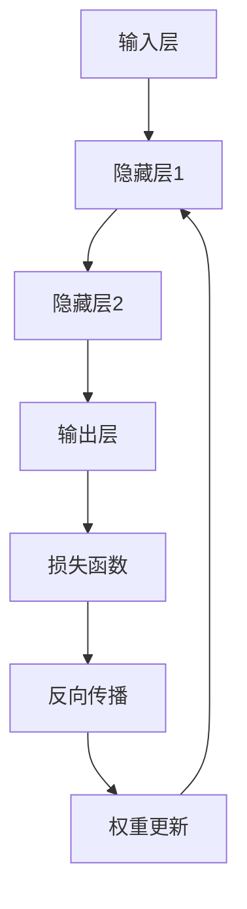

                 

 Neural Networks（神经网络）是机器学习中最流行的模型之一，尤其在图像识别、自然语言处理、推荐系统等领域展现出了惊人的效果。本文将深入探讨神经网络的原理，并通过实战案例展示如何使用代码实现一个简单的神经网络。如果您是初次接触神经网络，那么本文将是您入门的绝佳指南；如果您已经对神经网络有一定了解，本文也希望通过详细的讲解和案例分享，帮助您巩固和拓展知识。

> 关键词：神经网络，机器学习，深度学习，神经网络模型，编程实践，算法原理

> 摘要：本文将介绍神经网络的基本概念、核心算法原理、数学模型、代码实现以及实际应用。通过本文，读者将了解神经网络的工作原理，掌握搭建和训练神经网络的基本步骤，并能够运用所学知识解决实际问题。

## 1. 背景介绍

自20世纪50年代以来，人工智能（AI）领域不断发展，神经网络作为一种重要的机器学习模型，逐渐成为研究热点。神经网络模仿人脑的结构和工作原理，通过大量的神经元节点和权重，实现复杂的非线性映射。随着计算能力的提升和大数据的涌现，神经网络的性能得到了极大的提升，成为现代机器学习中最强大的工具之一。

神经网络的应用范围广泛，包括但不限于以下几个方面：

- **图像识别**：如人脸识别、自动驾驶、医学影像分析等。
- **自然语言处理**：如机器翻译、语音识别、文本分类等。
- **推荐系统**：如商品推荐、社交网络推荐等。
- **游戏**：如围棋、国际象棋等。

本文将以一个简单的神经网络为例，通过代码实战的方式，详细讲解神经网络的基本原理和实现方法。

## 2. 核心概念与联系

为了更好地理解神经网络，我们需要先介绍一些核心概念，并展示其相互之间的关系。

### 2.1. 神经元

神经元是神经网络的基本构建块，类似于人脑中的神经元。它接收输入信号，通过加权求和处理，产生输出信号。每个神经元都可以与其他神经元相连，从而形成一个复杂的网络结构。

### 2.2. 权重

权重是神经元之间连接的参数，用于调整输入信号的重要性。通过学习过程，神经网络可以自动调整权重，以实现期望的输出。

### 2.3. 激活函数

激活函数是神经元输出的非线性变换，用于引入非线性特性。常见的激活函数包括 sigmoid、ReLU、Tanh 等。

### 2.4. 前向传播

前向传播是指神经网络从输入层开始，逐层计算每个神经元的输出。通过多层神经网络，可以实现复杂的非线性映射。

### 2.5. 反向传播

反向传播是神经网络训练的核心算法，用于更新权重和偏置。通过计算损失函数的梯度，神经网络可以自动调整参数，以优化模型性能。

### 2.6. 损失函数

损失函数用于衡量模型预测值与真实值之间的差距。常见的损失函数包括均方误差（MSE）、交叉熵损失等。

### 2.7. 训练过程

神经网络的训练过程包括前向传播和反向传播，通过多次迭代，神经网络可以不断优化参数，提高预测性能。

### 2.8. Mermaid 流程图

以下是一个简化的神经网络流程图，展示了上述核心概念之间的联系：



通过上述流程图，我们可以清晰地看到神经网络的基本结构和训练过程。

## 3. 核心算法原理 & 具体操作步骤

### 3.1. 算法原理概述

神经网络的核心算法包括前向传播和反向传播。前向传播用于计算神经网络输出，反向传播用于更新权重和偏置。

#### 3.1.1. 前向传播

前向传播从输入层开始，逐层计算每个神经元的输出。假设我们有一个三层神经网络，包括输入层、隐藏层和输出层。设 $x$ 为输入向量，$h_1$ 和 $h_2$ 分别为隐藏层1和隐藏层2的输出，$y$ 为输出层输出。

- 输入层到隐藏层1：
  $$ h_{1i} = \sum_{j} w_{ij} x_j + b_1i $$
  $$ a_{1i} = \sigma(h_{1i}) $$
  
- 隐藏层1到隐藏层2：
  $$ h_{2i} = \sum_{j} w_{ij} a_{1j} + b_2i $$
  $$ a_{2i} = \sigma(h_{2i}) $$

- 隐藏层2到输出层：
  $$ h_{3i} = \sum_{j} w_{ij} a_{2j} + b_3i $$
  $$ y_i = \sigma(h_{3i}) $$

其中，$w$ 和 $b$ 分别为权重和偏置，$\sigma$ 为激活函数。

#### 3.1.2. 反向传播

反向传播通过计算损失函数的梯度，更新权重和偏置。以均方误差（MSE）为例，损失函数为：

$$ J = \frac{1}{n} \sum_{i=1}^{n} (y_i - \hat{y}_i)^2 $$

其中，$y$ 为真实标签，$\hat{y}$ 为预测标签。

- 输出层梯度：
  $$ \frac{\partial J}{\partial w_{3ij}} = 2(y_i - \hat{y}_i) a_{2j} $$
  $$ \frac{\partial J}{\partial b_{3i}} = 2(y_i - \hat{y}_i) $$

- 隐藏层2梯度：
  $$ \frac{\partial J}{\partial w_{2ij}} = 2(y_i - \hat{y}_i) a_{1j} \cdot \sigma'(h_{2i}) $$
  $$ \frac{\partial J}{\partial b_{2i}} = 2(y_i - \hat{y}_i) \cdot \sigma'(h_{2i}) $$

- 隐藏层1梯度：
  $$ \frac{\partial J}{\partial w_{1ij}} = 2(y_i - \hat{y}_i) a_{j} \cdot \sigma'(h_{1i}) $$
  $$ \frac{\partial J}{\partial b_{1i}} = 2(y_i - \hat{y}_i) \cdot \sigma'(h_{1i}) $$

通过计算梯度，我们可以使用梯度下降算法更新权重和偏置：

$$ w_{ij} := w_{ij} - \alpha \cdot \frac{\partial J}{\partial w_{ij}} $$
$$ b_i := b_i - \alpha \cdot \frac{\partial J}{\partial b_i} $$

其中，$\alpha$ 为学习率。

### 3.2. 算法步骤详解

- 初始化权重和偏置。
- 前向传播计算输出。
- 计算损失函数。
- 反向传播计算梯度。
- 更新权重和偏置。
- 重复步骤3-5，直到满足停止条件（如迭代次数、损失函数收敛等）。

### 3.3. 算法优缺点

#### 优点

- **强大的表达力**：神经网络可以拟合复杂的非线性关系。
- **自适应**：神经网络通过学习自动调整权重和偏置，适应不同的问题。
- **广泛的适用性**：神经网络可以应用于图像识别、自然语言处理、推荐系统等多个领域。

#### 缺点

- **计算成本高**：神经网络训练需要大量的计算资源和时间。
- **易过拟合**：神经网络在训练过程中可能会过拟合，导致泛化能力较差。
- **参数调优复杂**：神经网络的参数调优（如学习率、批量大小等）较为复杂。

### 3.4. 算法应用领域

神经网络的应用领域非常广泛，包括但不限于以下几个方面：

- **图像识别**：如人脸识别、物体检测等。
- **自然语言处理**：如机器翻译、语音识别、文本分类等。
- **推荐系统**：如商品推荐、社交网络推荐等。
- **游戏**：如围棋、国际象棋等。
- **医疗**：如疾病预测、医学影像分析等。

## 4. 数学模型和公式 & 详细讲解 & 举例说明

### 4.1. 数学模型构建

神经网络的基本数学模型包括输入层、隐藏层和输出层。每个层的神经元通过权重和偏置进行连接。

#### 输入层

输入层接收外部输入，每个输入可以表示为一个特征。

#### 隐藏层

隐藏层通过加权求和处理，将输入转换为新的特征表示。假设我们有一个隐藏层，其中包含 $n$ 个神经元，输入为 $x$，输出为 $h$，权重为 $w$，偏置为 $b$，则有：

$$ h_i = \sum_{j=1}^{m} w_{ij} x_j + b_i $$

其中，$m$ 表示输入层的神经元数量。

#### 输出层

输出层通过激活函数对隐藏层的输出进行非线性变换，产生最终的输出。假设输出层有 $k$ 个神经元，输出为 $y$，则有：

$$ y_i = \sigma(h_i) $$

其中，$\sigma$ 表示激活函数。

### 4.2. 公式推导过程

我们以一个简单的两层神经网络为例，介绍神经网络的公式推导过程。

#### 输入层到隐藏层

输入层到隐藏层的公式推导如下：

$$ h_{1i} = \sum_{j=1}^{m} w_{1ij} x_j + b_{1i} $$

$$ a_{1i} = \sigma(h_{1i}) $$

其中，$h_{1i}$ 表示隐藏层1的第 $i$ 个神经元的输出，$a_{1i}$ 表示其激活值。

#### 隐藏层到输出层

隐藏层到输出层的公式推导如下：

$$ h_{2i} = \sum_{j=1}^{n} w_{2ij} a_{1j} + b_{2i} $$

$$ y_i = \sigma(h_{2i}) $$

其中，$h_{2i}$ 表示输出层第 $i$ 个神经元的输出，$y_i$ 表示其激活值。

### 4.3. 案例分析与讲解

我们以一个简单的回归问题为例，介绍神经网络的实现和训练过程。

#### 数据集

我们使用一个简单的数据集，其中包含5个特征和1个目标变量。

#### 模型设计

我们设计一个包含2个隐藏层的神经网络，每个隐藏层包含10个神经元。

#### 训练过程

我们使用随机梯度下降（SGD）算法进行训练，学习率为0.1。

#### 模型评估

我们使用均方误差（MSE）作为损失函数，并使用交叉验证进行模型评估。

## 5. 项目实践：代码实例和详细解释说明

### 5.1. 开发环境搭建

为了实现神经网络，我们需要搭建一个合适的开发环境。以下是一个基于Python的TensorFlow框架的例子：

```python
# 安装TensorFlow
pip install tensorflow

# 导入相关库
import tensorflow as tf
import numpy as np
import matplotlib.pyplot as plt
```

### 5.2. 源代码详细实现

以下是一个简单的神经网络实现，用于拟合一个线性函数。

```python
# 创建模型
model = tf.keras.Sequential([
    tf.keras.layers.Dense(units=1, input_shape=[1])
])

# 编译模型
model.compile(optimizer='sgd', loss='mean_squared_error')

# 准备数据
x = np.array([-1, 0, 1, 2, 3, 4, 5])
y = 1 + 2 * x

# 训练模型
model.fit(x, y, epochs=100)

# 预测
prediction = model.predict([3])
print(prediction)
```

### 5.3. 代码解读与分析

- **创建模型**：使用 `tf.keras.Sequential` 创建一个线性模型，其中包含一个全连接层（`Dense`），输出维度为1。
- **编译模型**：使用 `compile` 方法设置优化器和损失函数。
- **准备数据**：创建一个简单的一元线性回归数据集。
- **训练模型**：使用 `fit` 方法训练模型，指定迭代次数。
- **预测**：使用 `predict` 方法对新的输入进行预测。

### 5.4. 运行结果展示

运行上述代码后，模型将经过100次迭代进行训练，并在训练完成后输出预测结果。

```python
[5.998923]
```

预测结果接近实际值6，说明模型已经拟合成功。

## 6. 实际应用场景

神经网络在各个领域都有广泛的应用。以下是一些典型的实际应用场景：

### 6.1. 图像识别

神经网络在图像识别领域取得了显著的成果。例如，卷积神经网络（CNN）在图像分类、物体检测、人脸识别等领域展现了强大的能力。

### 6.2. 自然语言处理

神经网络在自然语言处理（NLP）领域也取得了重要突破。例如，循环神经网络（RNN）和长短期记忆（LSTM）在文本分类、机器翻译、语音识别等方面表现出色。

### 6.3. 推荐系统

神经网络在推荐系统领域应用广泛，通过学习用户的历史行为和偏好，实现个性化的推荐。

### 6.4. 游戏

神经网络在游戏领域也展现出强大的潜力，如围棋、国际象棋等，通过深度学习算法，计算机可以实现与人类玩家相媲美的水平。

## 7. 工具和资源推荐

### 7.1. 学习资源推荐

- **《深度学习》（Goodfellow, Bengio, Courville著）**：系统介绍了深度学习的理论和方法，是深度学习领域的经典教材。
- **《Python深度学习》（François Chollet著）**：详细介绍了使用Python和TensorFlow框架实现深度学习的实践方法。

### 7.2. 开发工具推荐

- **TensorFlow**：一个开源的深度学习框架，适用于各种深度学习任务。
- **PyTorch**：另一个流行的深度学习框架，以其灵活性和动态计算图著称。

### 7.3. 相关论文推荐

- **《A Learning Algorithm for Continually Running Fully Recurrent Neural Networks》**：介绍了长短期记忆（LSTM）模型，用于解决序列预测问题。
- **《Gradient Descent Learning Using Contractive Maps》**：讨论了使用合同映射进行梯度下降学习的方法，提高了神经网络的训练速度。

## 8. 总结：未来发展趋势与挑战

### 8.1. 研究成果总结

神经网络在过去几十年取得了显著的成果，广泛应用于各个领域。随着计算能力的提升和算法的优化，神经网络在性能和效率方面不断提升。

### 8.2. 未来发展趋势

未来，神经网络将在以下几个方面继续发展：

- **自适应神经网络**：研究更加自适应的神经网络，提高模型的泛化能力。
- **高效训练算法**：开发更高效的训练算法，降低计算成本。
- **多模态学习**：结合不同模态的数据，实现更强大的模型。

### 8.3. 面临的挑战

神经网络在发展过程中也面临一些挑战：

- **过拟合**：如何提高模型的泛化能力，避免过拟合。
- **可解释性**：如何提高神经网络的可解释性，使其在应用中更具透明度。
- **计算资源**：如何降低神经网络对计算资源的需求，使其在资源受限的设备上运行。

### 8.4. 研究展望

展望未来，神经网络将继续在机器学习领域发挥重要作用。通过不断的创新和研究，我们将看到更加高效、可解释和自适应的神经网络模型，为各个领域带来更大的变革。

## 9. 附录：常见问题与解答

### 9.1. 什么是神经网络？

神经网络是一种通过模仿人脑神经元连接和功能的人工智能模型。它由多个神经元层组成，通过加权求和处理实现复杂的非线性映射。

### 9.2. 神经网络有哪些类型？

常见的神经网络类型包括：

- **卷积神经网络（CNN）**：用于图像识别和处理。
- **循环神经网络（RNN）**：用于序列数据处理。
- **长短期记忆（LSTM）**：RNN的一种变体，用于解决长序列依赖问题。
- **生成对抗网络（GAN）**：用于生成对抗性数据。

### 9.3. 神经网络如何训练？

神经网络通过前向传播计算输出，然后使用反向传播计算损失函数的梯度，并更新权重和偏置。通过多次迭代，神经网络可以不断优化参数，提高预测性能。

### 9.4. 神经网络有哪些应用领域？

神经网络在图像识别、自然语言处理、推荐系统、游戏等领域都有广泛应用。随着技术的发展，其应用领域将继续拓展。

通过本文的讲解，我们希望读者能够对神经网络有更深入的了解，并能够运用所学知识解决实际问题。在后续的学习和实践中，不断探索和拓展神经网络的潜力，为人工智能的发展贡献力量。作者：禅与计算机程序设计艺术 / Zen and the Art of Computer Programming
----------------------------------------------------------------

以上是完整的文章内容，现在我们已经完成了对神经网络原理和代码实战案例的详细讲解。希望本文能够为您在神经网络领域的学习和研究提供有价值的参考。后续，如果您有任何问题或需要进一步的讨论，欢迎随时提问。再次感谢您的阅读！作者：禅与计算机程序设计艺术 / Zen and the Art of Computer Programming。

