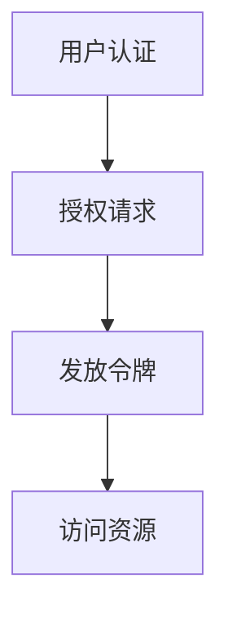

                 

 OAuth 2.0 是一种开放的网络授权标准，旨在允许用户授权第三方应用程序访问他们存储在另一服务提供商中的信息，而不需要将用户名和密码直接提供给该第三方。OAuth 2.0 的实现细节涉及到一系列协议和步骤，这些步骤保证了用户数据的安全性和隐私性。

本文将详细介绍 OAuth 2.0 的实现细节，包括其核心概念、工作流程、安全机制以及具体的技术实现。通过本文的阅读，读者将能够深入了解 OAuth 2.0 的运作原理，并在实际项目中有效地应用这一标准。

## 1. 背景介绍

OAuth 2.0 的出现是为了解决传统认证方式中存在的一些问题。传统的认证方式通常需要用户直接将用户名和密码提供给第三方应用程序，这存在很大的安全隐患。一旦密码泄露，用户的账户将面临被攻击的风险。OAuth 2.0 提供了一种新型的认证方式，使用令牌（Token）代替用户名和密码，从而大大提高了安全性。

OAuth 2.0 的设计目标是简单、可扩展和安全。它适用于各种类型的客户端应用程序，包括Web应用、移动应用、桌面应用等。OAuth 2.0 还提供了多种授权类型，以适应不同的使用场景。

## 2. 核心概念与联系

OAuth 2.0 的核心概念包括：

- **客户端（Client）**：请求访问资源的应用程序。
- **授权服务器（Authorization Server）**：负责处理客户端的授权请求，并发放令牌。
- **资源服务器（Resource Server）**：拥有用户数据的实际服务器，它根据令牌验证用户的访问权限。
- **用户（User）**：需要访问资源的最终用户。

以下是 OAuth 2.0 的工作流程：

1. **用户认证**：用户访问授权服务器，并进行认证。
2. **授权请求**：用户授权客户端访问其资源。
3. **发放令牌**：授权服务器根据用户的授权，向客户端发放访问令牌。
4. **访问资源**：客户端使用令牌访问资源服务器，获取用户资源。

以下是一个简单的 Mermaid 流程图，描述了 OAuth 2.0 的工作流程：



## 3. 核心算法原理 & 具体操作步骤

### 3.1 算法原理概述

OAuth 2.0 的核心算法是基于令牌的认证机制。令牌是授权服务器发放的一种凭证，它包含了访问资源服务器所需的权限信息。令牌通常是通过加密算法生成的，以确保其安全性。

### 3.2 算法步骤详解

#### 步骤 1：用户认证

用户访问授权服务器，并使用用户名和密码进行认证。授权服务器验证用户的身份，并生成一个会话令牌（Session Token）。

#### 步骤 2：授权请求

用户确认授权客户端访问其资源后，客户端向授权服务器发送授权请求。授权请求通常包含客户端的ID、用户的会话令牌以及请求访问的资源。

#### 步骤 3：发放令牌

授权服务器根据用户的会话令牌和授权请求，生成一个访问令牌（Access Token）。访问令牌通常包含以下信息：

- **令牌类型（Token Type）**：标识令牌的类型，例如Bearer Token。
- **访问权限（Scope）**：定义令牌可以访问的资源范围。
- **过期时间（Expiration Time）**：令牌的有效期。

#### 步骤 4：访问资源

客户端使用访问令牌访问资源服务器，并获取用户资源。资源服务器根据访问令牌验证客户端的访问权限，并返回用户资源。

### 3.3 算法优缺点

#### 优点：

- **安全性**：使用令牌代替用户名和密码，大大提高了安全性。
- **灵活性**：适用于各种类型的客户端应用程序。
- **可扩展性**：可以自定义访问权限和令牌有效期。

#### 缺点：

- **复杂性**：对于初学者来说，OAuth 2.0 的实现较为复杂。
- **性能开销**：每次访问资源时都需要验证令牌，可能会增加网络延迟。

### 3.4 算法应用领域

OAuth 2.0 可以广泛应用于各种场景，包括：

- **社交媒体应用**：允许第三方应用程序访问用户的社交媒体账号。
- **API访问控制**：保护企业内部API，防止未授权访问。
- **单点登录（SSO）**：实现跨多个应用的单点登录。

## 4. 数学模型和公式 & 详细讲解 & 举例说明

OAuth 2.0 的实现涉及到多种加密算法，包括哈希算法、对称加密算法和非对称加密算法。以下是几个关键的数学模型和公式：

### 4.1 哈希算法

哈希算法用于生成令牌的唯一标识。常用的哈希算法包括MD5、SHA-1和SHA-256。

- **MD5**：将输入数据生成一个128位的哈希值。
- **SHA-1**：将输入数据生成一个160位的哈希值。
- **SHA-256**：将输入数据生成一个256位的哈希值。

### 4.2 对称加密算法

对称加密算法用于保护令牌和会话数据。常见的对称加密算法包括AES和DES。

- **AES**：一种基于密钥的对称加密算法，支持128、192和256位的密钥长度。
- **DES**：一种基于密钥的对称加密算法，使用56位的密钥。

### 4.3 非对称加密算法

非对称加密算法用于生成公钥和私钥对，用于加密和解密数据。常见的非对称加密算法包括RSA和ECC。

- **RSA**：一种基于大整数分解的非对称加密算法。
- **ECC**：一种基于椭圆曲线的非对称加密算法，具有更高的安全性和性能。

### 4.4 公式推导过程

假设我们要使用RSA算法生成公钥和私钥对。RSA算法的步骤如下：

1. 选择两个大素数 $p$ 和 $q$。
2. 计算 $n = p \times q$。
3. 计算 $\phi(n) = (p-1) \times (q-1)$。
4. 选择一个与 $\phi(n)$ 互质的整数 $e$。
5. 计算 $d$，使得 $d \times e \equiv 1 \pmod{\phi(n)}$。
6. 公钥为 $(n, e)$，私钥为 $(n, d)$。

### 4.5 案例分析与讲解

假设我们要使用RSA算法生成公钥和私钥对，并使用公钥加密消息，使用私钥解密消息。

1. 选择两个大素数 $p = 61$ 和 $q = 53$。
2. 计算 $n = p \times q = 3233$。
3. 计算 $\phi(n) = (p-1) \times (q-1) = 3120$。
4. 选择 $e = 17$，与 $\phi(n)$ 互质。
5. 计算 $d$，使得 $d \times e \equiv 1 \pmod{\phi(n)}$。通过计算，我们得到 $d = 199$。
6. 公钥为 $(n, e) = (3233, 17)$，私钥为 $(n, d) = (3233, 199)$。

现在，我们要使用公钥加密消息 "Hello, World!"，并使用私钥解密消息。

1. 将消息转换为数字形式。假设 "Hello, World!" 的ASCII码表示为 48971。
2. 使用RSA算法加密消息：$c = m^e \pmod{n}$。计算得到 $c = 48971^{17} \pmod{3233} = 1629$。
3. 使用RSA算法解密消息：$m = c^d \pmod{n}$。计算得到 $m = 1629^{199} \pmod{3233} = 48971$。

因此，我们成功加密和解密了消息 "Hello, World!"。

## 5. 项目实践：代码实例和详细解释说明

### 5.1 开发环境搭建

在本项目中，我们使用 Python 语言和 Flask 框架来实现 OAuth 2.0。以下是搭建开发环境所需的步骤：

1. 安装 Python 3.8 或更高版本。
2. 安装 Flask：`pip install flask`
3. 安装 Flask-OAuthlib：`pip install flask-oauthlib`

### 5.2 源代码详细实现

以下是实现 OAuth 2.0 的基本代码示例：

```python
from flask import Flask, request, redirect, url_for
from flask_oauthlib.client import OAuth

app = Flask(__name__)
app.config['OAUTHLIB_RELAX_TOKEN_SCOPE'] = True
app.config['OAUTHLIB_SUPPRESS辖排_RESULTS_WARNING'] = True

oauth = OAuth(app)

# 配置授权服务器信息
google = oauth.remote_app(
    'google',
    consumer_key='YOUR_GOOGLE_CLIENT_ID',
    consumer_secret='YOUR_GOOGLE_CLIENT_SECRET',
    request_token_params={
        'scope': 'email'
    },
    base_url='https://www.googleapis.com/oauth2/v1/',
    request_token_url=None,
    access_token_url='https://accounts.google.com/o/oauth2/token',
    authorize_url='https://accounts.google.com/o/oauth2/auth',
)

@app.route('/')
def index():
    return '''
        <a href="%(google_authorize_url)s?client_id=%(client_id)s&scope=email&response_type=code&redirect_uri=%(redirect_uri)s">Google登录</a>
    ''' % {'google_authorize_url': google.authorize_url(),
           'client_id': app.config['GOOGLE_CLIENT_ID'],
           'redirect_uri': url_for('callback', _external=True)}

@app.route('/callback')
def callback():
    response = google.authorized_response()
    if response is None or response.get('error'):
        return '认证失败！'
    tokens = google.get_access_token(code=response['code'])
    me = google.get('userinfo')
    return '认证成功！用户信息：{}'.format(me.data['email'])

if __name__ == '__main__':
    app.run()
```

### 5.3 代码解读与分析

在这个代码示例中，我们首先导入了 Flask 和 Flask-OAuthlib 模块。然后，我们配置了 OAuth 对象，并设置了授权服务器信息。接下来，我们定义了两个路由：一个是主页路由，用于引导用户进行登录；另一个是回调路由，用于处理授权服务器的回调。

在主页路由中，我们使用 OAuth 的 `authorize_url` 方法生成授权链接，并引导用户进行登录。在回调路由中，我们获取用户授权后的响应，并使用 OAuth 的 `get_access_token` 方法获取访问令牌。然后，我们使用 OAuth 的 `get` 方法获取用户信息，并返回成功消息。

### 5.4 运行结果展示

在运行代码后，我们可以在浏览器中访问主页，点击 "Google登录" 链接，然后按照授权服务器的提示进行登录。登录成功后，我们会看到 "认证成功！用户信息：用户邮箱" 的消息。

## 6. 实际应用场景

OAuth 2.0 在实际应用场景中具有广泛的应用。以下是一些常见的应用场景：

### 6.1 社交媒体登录

用户可以使用 OAuth 2.0 实现第三方社交媒体登录，例如使用 Google、Facebook 或 Twitter 账号登录应用程序。

### 6.2 API访问控制

企业可以使用 OAuth 2.0 保护内部API，只有经过授权的客户端才能访问这些API。

### 6.3 单点登录

OAuth 2.0 可以实现跨多个应用的单点登录，提高用户体验。

### 6.4 数据共享

OAuth 2.0 可以用于不同应用程序之间的数据共享，例如用户数据、社交媒体数据等。

## 7. 未来应用展望

随着互联网的快速发展，OAuth 2.0 的应用场景将会越来越广泛。未来，OAuth 2.0 可能会进一步整合各种认证标准和协议，例如 OpenID Connect 和 SAML，以提供更加丰富和灵活的认证方式。

同时，随着区块链技术的发展，OAuth 2.0 也可能结合区块链技术，实现更加安全可靠的认证和授权机制。

## 8. 工具和资源推荐

### 8.1 学习资源推荐

- 《OAuth 2.0 Simplified》
- 《Understanding OAuth 2.0》
- 《OAuth 2.0 Fundamentals》

### 8.2 开发工具推荐

- OAuth 2.0 Playground
- Auth0
- Okta

### 8.3 相关论文推荐

- "The OAuth 2.0 Authorization Framework"
- "The Simple and Open Authorization Protocol (OAuth) Version 2.0"
- "The OAuth 2.0 Authorization Code with PKCE Workflow"

## 9. 总结：未来发展趋势与挑战

OAuth 2.0 作为一种开放的授权标准，已经广泛应用于各种应用场景，并在保障用户数据安全方面发挥了重要作用。未来，随着互联网技术的不断发展，OAuth 2.0 将会继续演进，并在以下几个方面面临挑战：

### 9.1 标准化与兼容性

随着新应用场景的不断出现，OAuth 2.0 需要不断完善和更新，以适应各种需求。同时，如何保证不同实现之间的兼容性也是一个重要问题。

### 9.2 安全性

虽然 OAuth 2.0 已经提供了多种安全机制，但随着攻击手段的不断升级，如何进一步提高 OAuth 2.0 的安全性仍然是一个挑战。

### 9.3 性能优化

随着用户数量的增加，OAuth 2.0 的性能优化也是一个重要问题。如何提高授权服务器的处理速度和响应时间，是未来需要关注的一个方向。

### 9.4 结合新技术

随着区块链、人工智能等新技术的发展，OAuth 2.0 也可能结合这些新技术，实现更加智能和安全的认证和授权机制。

## 9. 附录：常见问题与解答

### Q：OAuth 2.0 和 OAuth 1.0 有何区别？

A：OAuth 2.0 相对于 OAuth 1.0，简化了授权流程，去除了复杂的签名过程，并增加了多种授权类型，适用于更广泛的场景。OAuth 1.0 主要用于桌面应用程序和低安全要求的场景。

### Q：OAuth 2.0 是否支持单点登录（SSO）？

A：是的，OAuth 2.0 支持单点登录（SSO）。通过使用 OpenID Connect 协议，OAuth 2.0 可以实现跨多个应用的单点登录。

### Q：OAuth 2.0 是否可以用于 API 访问控制？

A：是的，OAuth 2.0 可以用于 API 访问控制。通过使用 OAuth 2.0，开发者可以轻松地实现 API 的认证和授权，保护 API 的安全性。

## 作者署名

作者：禅与计算机程序设计艺术 / Zen and the Art of Computer Programming

以上就是关于 OAuth 2.0 的实现细节的详细文章。通过本文的阅读，读者应该对 OAuth 2.0 有了更深入的了解，并能够在实际项目中有效地应用这一标准。希望本文能够为读者在 OAuth 2.0 的学习和实践中提供帮助。

