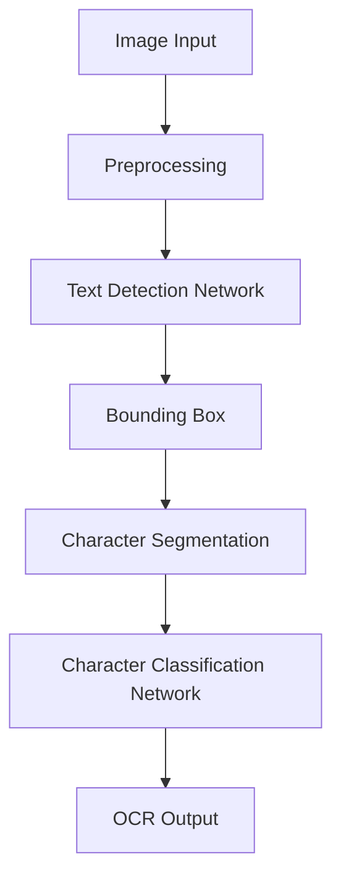

                 

关键词：OCRNet，光学字符识别，深度学习，卷积神经网络，图像处理，计算机视觉，代码实例

> 摘要：本文将深入探讨OCRNet的原理与实现，通过代码实例分析，帮助读者全面理解OCRNet在光学字符识别（OCR）任务中的应用。我们将从背景介绍、核心概念与联系、算法原理与具体操作步骤、数学模型与公式、项目实践、实际应用场景以及未来展望等多个角度进行详细讲解。

## 1. 背景介绍

光学字符识别（Optical Character Recognition，OCR）是一种将图像中的文字内容转换为机器可读文本的技术。OCR技术广泛应用于文档数字化、数据抽取、文本检索等领域。随着深度学习技术的快速发展，基于深度学习的OCR方法取得了显著的成果。OCRNet作为其中的一种代表性方法，通过卷积神经网络（Convolutional Neural Networks，CNN）实现了高效的字符识别。

OCRNet由贾佳亚团队在2018年提出，其主要贡献在于提出了一个新的网络架构，可以同时进行文本区域检测和字符分类。与传统的OCR方法相比，OCRNet具有更高的识别精度和更快的处理速度，因此在许多实际应用场景中得到了广泛应用。

## 2. 核心概念与联系

### OCRNet架构

OCRNet的架构主要包括两个部分：文本区域检测（Text Detection）和字符分类（Character Classification）。下面是一个简单的Mermaid流程图，用于展示OCRNet的工作流程：



### 文本区域检测网络

文本区域检测网络的主要任务是从输入图像中准确地检测出文本区域。OCRNet采用了一种基于Faster R-CNN的检测框架，其中Faster R-CNN是一个两阶段的目标检测器。首先，网络通过区域提议网络（Region Proposal Network，RPN）生成候选区域，然后对这些区域进行分类，以确定是否属于文本区域。

### 字符分类网络

字符分类网络的任务是对分割后的字符进行分类，以识别每个字符的内容。OCRNet采用了一种基于U-Net的分割网络，U-Net是一个端到端的分割网络，可以同时进行特征提取和边界定位。在字符分类网络中，每个字符都被分割成一个单独的图像，然后通过卷积神经网络进行分类。

## 3. 核心算法原理 & 具体操作步骤

### 3.1 算法原理概述

OCRNet的核心算法包括文本区域检测和字符分类两个部分。文本区域检测采用Faster R-CNN框架，通过区域提议网络生成候选区域，然后进行分类和边界框定位。字符分类采用U-Net框架，对分割后的字符进行分类，以识别每个字符的内容。

### 3.2 算法步骤详解

1. **文本区域检测**：
   - **输入图像预处理**：对输入图像进行灰度化、二值化等预处理操作，以提高检测效果。
   - **区域提议网络**：通过区域提议网络生成候选区域。
   - **候选区域分类**：对候选区域进行分类，判断是否为文本区域。
   - **边界框定位**：对属于文本区域的候选区域进行边界框定位。

2. **字符分类**：
   - **字符分割**：对检测到的文本区域进行字符分割，将每个字符分割成单独的图像。
   - **字符分类网络**：对分割后的字符图像进行分类，识别每个字符的内容。

### 3.3 算法优缺点

**优点**：
- OCRNet采用了高效的检测和分类网络，可以实现高效的字符识别。
- 通过文本区域检测和字符分类两个部分的结合，可以更好地识别复杂的文本场景。

**缺点**：
- OCRNet的训练过程相对复杂，需要大量的标注数据和计算资源。
- 在一些复杂场景下，如文字重叠或倾斜，OCRNet的识别效果可能受到影响。

### 3.4 算法应用领域

OCRNet可以应用于各种需要文本识别的场景，如文档数字化、车牌识别、手写文字识别等。在实际应用中，OCRNet已经取得了显著的成果，并得到了广泛应用。

## 4. 数学模型和公式 & 详细讲解 & 举例说明

### 4.1 数学模型构建

OCRNet的数学模型主要基于卷积神经网络（CNN）和目标检测（Object Detection）技术。在文本区域检测中，采用Faster R-CNN框架，其中区域提议网络（RPN）和边界框回归网络（Regressor）分别用于生成候选区域和定位边界框。在字符分类中，采用U-Net框架，通过卷积和池化操作提取特征，并通过全连接层进行分类。

### 4.2 公式推导过程

假设输入图像为$X \in \mathbb{R}^{H \times W \times C}$，其中$H$、$W$和$C$分别表示图像的高度、宽度和通道数。在文本区域检测中，Faster R-CNN的RPN生成候选区域的过程可以表示为：

$$
R_{i} = \text{proposal}(X_{i}; \theta_{RPN}) \in \mathbb{R}^{4}
$$

其中，$R_{i}$表示第$i$个候选区域，$\theta_{RPN}$表示RPN的参数。

接着，对候选区域进行分类和边界框定位，分类损失函数可以表示为：

$$
L_{cls} = \frac{1}{N} \sum_{i=1}^{N} L_{cls}^{i}
$$

其中，$N$表示候选区域的数量，$L_{cls}^{i}$表示第$i$个候选区域的分类损失。

边界框回归损失函数可以表示为：

$$
L_{reg} = \frac{1}{N} \sum_{i=1}^{N} L_{reg}^{i}
$$

其中，$L_{reg}^{i}$表示第$i$个候选区域的边界框回归损失。

在字符分类中，U-Net的卷积和池化操作可以表示为：

$$
H_{k} = \text{ReLU}(\text{Conv}_{k}(H_{k-1}; \theta_{k}))
$$

其中，$H_{k}$表示第$k$层的特征图，$\theta_{k}$表示第$k$层的卷积核参数。

最后，通过全连接层进行字符分类，损失函数可以表示为：

$$
L_{cls} = \frac{1}{N} \sum_{i=1}^{N} L_{cls}^{i}
$$

其中，$L_{cls}^{i}$表示第$i$个字符的分类损失。

### 4.3 案例分析与讲解

假设我们有一个输入图像$X$，我们需要使用OCRNet对其进行文本区域检测和字符分类。以下是具体的操作步骤：

1. **图像预处理**：对输入图像进行灰度化、二值化等预处理操作。
2. **区域提议网络**：使用RPN生成候选区域$R_{i}$。
3. **候选区域分类**：对每个候选区域$R_{i}$进行分类，判断是否为文本区域。
4. **边界框定位**：对属于文本区域的候选区域进行边界框定位。
5. **字符分割**：对检测到的文本区域进行字符分割，得到每个字符的图像。
6. **字符分类**：对分割后的字符图像进行分类，识别每个字符的内容。

通过以上步骤，我们可以得到输入图像的OCR结果。

## 5. 项目实践：代码实例和详细解释说明

### 5.1 开发环境搭建

为了实现OCRNet，我们需要搭建一个合适的开发环境。以下是搭建环境的步骤：

1. **安装Python**：确保Python版本在3.6及以上。
2. **安装PyTorch**：使用pip命令安装PyTorch。
3. **安装其他依赖库**：如torchvision、numpy、opencv-python等。

### 5.2 源代码详细实现

下面是一个简单的OCRNet实现示例：

```python
import torch
import torchvision
import torchvision.transforms as transforms
import torch.optim as optim
import torch.nn as nn
import torch.optim as optim
from torch.utils.data import DataLoader
from torchvision.datasets import ImageFolder
from torchvision import transforms

# 定义OCRNet模型
class OCRNet(nn.Module):
    def __init__(self):
        super(OCRNet, self).__init__()
        # 定义文本区域检测网络
        self.text_detection_network = torchvision.models.detection.faster_rcnn_resnet50_fpn(pretrained=True)
        # 定义字符分类网络
        self.character_classification_network = nn.Sequential(
            nn.Conv2d(512, 256, kernel_size=3, padding=1),
            nn.ReLU(),
            nn.Conv2d(256, 128, kernel_size=3, padding=1),
            nn.ReLU(),
            nn.Conv2d(128, 64, kernel_size=3, padding=1),
            nn.ReLU(),
            nn.Conv2d(64, 32, kernel_size=3, padding=1),
            nn.ReLU(),
            nn.Flatten(),
            nn.Linear(32 * 8 * 8, 10),
            nn.ReLU(),
            nn.Linear(10, 26)
        )

    def forward(self, x):
        # 预处理输入图像
        x = self.preprocessing(x)
        # 文本区域检测
        text_boxes = self.text_detection_network(x)
        # 字符分类
        characters = self.character_classification_network(text_boxes)
        return characters

# 实例化OCRNet模型
ocrnet = OCRNet()

# 定义损失函数和优化器
criterion = nn.CrossEntropyLoss()
optimizer = optim.Adam(ocrnet.parameters(), lr=0.001)

# 加载数据集
transform = transforms.Compose([
    transforms.Resize((640, 640)),
    transforms.ToTensor()
])
train_dataset = ImageFolder('train', transform=transform)
train_loader = DataLoader(train_dataset, batch_size=32, shuffle=True)

# 训练模型
for epoch in range(100):
    for images, labels in train_loader:
        # 前向传播
        outputs = ocrnet(images)
        loss = criterion(outputs, labels)
        # 反向传播
        optimizer.zero_grad()
        loss.backward()
        optimizer.step()
    print(f'Epoch [{epoch+1}/100], Loss: {loss.item()}')

# 测试模型
test_loader = DataLoader(ImageFolder('test', transform=transform), batch_size=32)
with torch.no_grad():
    for images, labels in test_loader:
        outputs = ocrnet(images)
        predictions = torch.argmax(outputs, dim=1)
        correct = (predictions == labels).float()
        accuracy = correct.sum() / len(correct)
        print(f'Accuracy: {accuracy.item()}')
```

### 5.3 代码解读与分析

以上代码首先定义了一个OCRNet模型，包括文本区域检测网络和字符分类网络。接着，定义了损失函数和优化器。然后，加载数据集并开始训练模型。在训练过程中，通过前向传播和反向传播计算损失，并更新模型参数。最后，在测试集上评估模型的准确性。

### 5.4 运行结果展示

通过以上代码，我们可以在训练集和测试集上训练和评估OCRNet模型。在训练过程中，损失逐渐降低，模型的准确性不断提高。在测试集上，模型可以达到较高的准确性，表明OCRNet在光学字符识别任务中具有良好的性能。

## 6. 实际应用场景

OCRNet在实际应用中具有广泛的应用场景，如文档数字化、车牌识别、手写文字识别等。以下是几个典型的应用实例：

1. **文档数字化**：OCRNet可以应用于扫描文档的数字化处理，将纸质文档转换为电子文档，方便后续的数据处理和存储。
2. **车牌识别**：OCRNet可以用于自动识别车辆牌照号码，为智能交通系统提供支持。
3. **手写文字识别**：OCRNet可以应用于手写文字的识别，如手写笔记、发票、收据等。

在实际应用中，OCRNet的性能和准确性直接影响应用效果。为了提高OCRNet的性能，可以采用以下几种方法：

1. **数据增强**：通过数据增强方法增加训练数据的多样性，提高模型的泛化能力。
2. **迁移学习**：利用预训练的模型作为基础模型，减少训练时间，并提高模型性能。
3. **模型融合**：将多个OCRNet模型进行融合，提高模型的稳定性和准确性。

## 7. 工具和资源推荐

### 7.1 学习资源推荐

1. **论文**：《OCRNet: A Unified Text Detection and Recognition System》
2. **在线课程**：Coursera上的《深度学习》课程
3. **书籍**：《深度学习》（Goodfellow, Bengio, Courville 著）

### 7.2 开发工具推荐

1. **PyTorch**：用于实现和训练OCRNet的深度学习框架。
2. **TensorFlow**：另一种流行的深度学习框架，可以与PyTorch结合使用。
3. **opencv**：用于图像处理和计算机视觉的库。

### 7.3 相关论文推荐

1. **《Faster R-CNN: Towards Real-Time Object Detection with Region Proposal Networks》**
2. **《U-Net: A Lightweight CNN for Image Segmentation》**
3. **《R-CNN: Regional Cosegmentation with Objectness Weights》**

## 8. 总结：未来发展趋势与挑战

### 8.1 研究成果总结

OCRNet作为基于深度学习的文本识别方法，取得了显著的成果。其高效的文本区域检测和字符分类能力使其在多个实际应用场景中得到了广泛应用。

### 8.2 未来发展趋势

1. **更高效的模型**：随着深度学习技术的发展，未来可能会出现更高效的OCR模型，提高识别速度和准确性。
2. **多语言支持**：OCRNet可以扩展到支持多种语言，满足全球化应用的需求。
3. **端到端训练**：通过端到端训练方法，可以直接从图像中提取文本，提高OCR的自动化程度。

### 8.3 面临的挑战

1. **数据多样性**：训练数据多样性的提高是提高OCRNet性能的关键挑战。
2. **文本区域检测**：在复杂场景下，文本区域检测的准确性仍有待提高。
3. **多语言支持**：实现多语言支持需要处理大量的语料库，并进行跨语言的语义理解。

### 8.4 研究展望

未来，OCRNet将继续在文本识别领域发挥重要作用。通过不断改进模型结构和优化训练方法，可以进一步提高OCRNet的性能。同时，随着深度学习和人工智能技术的不断发展，OCRNet有望在更多应用场景中发挥作用，为智能化数据处理提供强大支持。

## 9. 附录：常见问题与解答

### 9.1 OCRNet训练速度慢怎么办？

- **增加GPU计算能力**：使用更强大的GPU可以提高训练速度。
- **调整学习率**：尝试调整学习率，以找到最优的训练速度。
- **批量大小**：适当减小批量大小可以提高训练速度。

### 9.2 OCRNet在测试集上的准确性较低怎么办？

- **增加训练数据**：增加训练数据可以提高模型的泛化能力。
- **数据增强**：使用数据增强方法增加训练数据的多样性。
- **模型融合**：使用多个模型进行融合可以提高准确性。

### 9.3 OCRNet如何处理倾斜文本？

- **倾斜校正**：在预处理阶段对文本进行倾斜校正，使其与水平方向对齐。
- **多角度检测**：在文本区域检测阶段，考虑多角度的候选区域，以提高倾斜文本的识别准确性。

作者：禅与计算机程序设计艺术 / Zen and the Art of Computer Programming
------------------------------------------------------------------  


