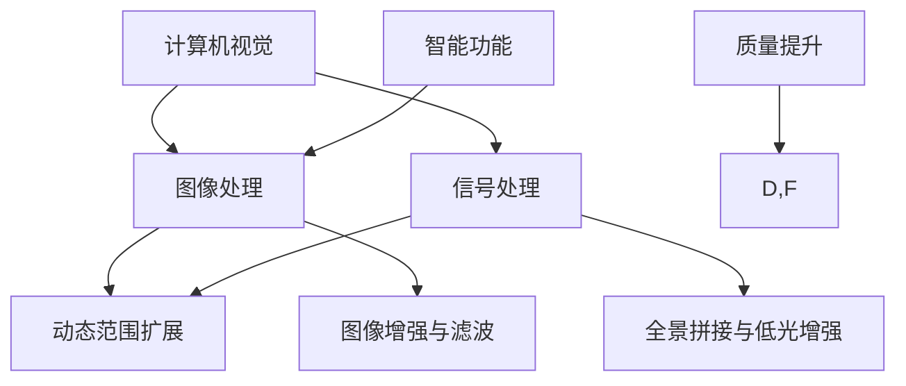

                 

关键词：OPPO、2024手机、影像系统、优化工程师、校招、面试经验

摘要：本文详细分享了OPPO2024手机影像系统优化工程师校招面试经验，涵盖了背景介绍、核心概念、算法原理、数学模型、项目实践、实际应用场景、工具推荐、总结与展望等内容，旨在为希望从事影像系统优化领域的求职者提供宝贵的面试准备和职业规划指导。

## 1. 背景介绍

OPPO作为国内领先的智能手机制造商，一直致力于提供高性能的影像系统，以满足用户对高品质拍照的需求。随着技术的不断进步，影像系统的复杂性也在增加，优化工程师的角色变得尤为重要。2024年，OPPO即将推出一系列搭载全新影像系统的智能手机，这要求我们优化工程师不仅要掌握前沿技术，还要具备扎实的理论基础和丰富的实践经验。

本文旨在为准备参加OPPO影像系统优化工程师校招面试的求职者提供一个详细的指导，帮助他们了解面试的核心内容，做好准备，顺利通过面试。

### 1.1 面试背景

OPPO的校招面试分为几个阶段，包括在线测评、电话面试、技术面试、行为面试等。本文主要聚焦于技术面试阶段，特别是影像系统优化相关的问题。技术面试通常由两到三轮组成，每轮面试时间约为30分钟到1小时，面试官包括影像系统专家、算法工程师和项目经理。

### 1.2 面试目的

面试的目的是评估求职者的技术能力、问题解决能力和团队合作精神。影像系统优化工程师需要具备深厚的计算机视觉、图像处理和信号处理知识，同时还需要了解最新的移动端技术趋势。

## 2. 核心概念与联系

在深入探讨影像系统优化之前，我们首先需要理解一些核心概念，它们是影像系统优化的基础。以下是这些核心概念的简要介绍和它们之间的联系：

### 2.1 计算机视觉

计算机视觉是研究如何使计算机“看”见和理解周围世界的科学。在影像系统中，计算机视觉技术被用来识别图像中的物体、场景和动作，从而实现自动对焦、人脸识别、场景识别等功能。

### 2.2 图像处理

图像处理是使用算法和数学模型对图像进行增强、滤波、分割等操作的过程。在影像系统中，图像处理技术用于优化图像质量，去除噪点，增强细节等。

### 2.3 信号处理

信号处理涉及对信号（包括图像和声音）的分析、增强、压缩和传输。在影像系统中，信号处理技术用于动态范围扩展、低光增强、全景拼接等。

### 2.4 联系

影像系统优化工程师需要综合运用计算机视觉、图像处理和信号处理技术，以满足用户对高质量影像的需求。这三者之间的联系在于：

- 计算机视觉提供影像系统的智能功能，如自动对焦和人脸识别。
- 图像处理确保图像的清晰度和色彩还原度。
- 信号处理则优化影像的动态范围和低光性能。

下面是一个使用Mermaid绘制的核心概念流程图：



## 3. 核心算法原理 & 具体操作步骤

影像系统优化工程师需要掌握多种算法原理，并能够将其应用于实际问题中。以下是几个核心算法的原理概述和具体操作步骤。

### 3.1 算法原理概述

#### 3.1.1 快速傅里叶变换（FFT）

快速傅里叶变换是一种高效的算法，用于将信号从时域转换到频域。在影像系统中，FFT可用于图像的频域滤波和图像压缩。

#### 3.1.2 卷积神经网络（CNN）

卷积神经网络是一种深度学习模型，特别适合于图像识别和分类。在影像系统中，CNN用于实现自动对焦、人脸识别和图像风格转换等功能。

#### 3.1.3 多尺度分析

多尺度分析是一种用于图像增强和细节提取的方法，通过在不同尺度上对图像进行处理，可以增强图像的细节和对比度。

### 3.2 算法步骤详解

#### 3.2.1 快速傅里叶变换（FFT）

1. 对图像进行离散傅里叶变换（DFT）。
2. 应用FFT算法减少计算复杂度。
3. 对频域图像进行滤波操作，如高通滤波、低通滤波等。
4. 对滤波后的频域图像进行逆离散傅里叶变换（IDFT）得到优化后的图像。

#### 3.2.2 卷积神经网络（CNN）

1. 输入图像经过卷积层、池化层和激活函数的处理。
2. 通过全连接层对特征进行分类或回归。
3. 使用损失函数（如交叉熵损失函数）计算预测值与真实值之间的差异。
4. 使用反向传播算法更新网络权重，最小化损失函数。

#### 3.2.3 多尺度分析

1. 对图像进行多尺度分解，提取不同尺度的图像分量。
2. 对每个尺度分量进行局部增强或滤波。
3. 将增强后的分量合并，得到优化后的图像。

### 3.3 算法优缺点

#### 3.3.1 快速傅里叶变换（FFT）

**优点**：高效、计算复杂度低，适用于大规模图像处理。

**缺点**：对图像的频域特性依赖较强，可能损失图像的细节信息。

#### 3.3.2 卷积神经网络（CNN）

**优点**：强大的特征提取能力，适用于复杂图像处理任务。

**缺点**：训练过程复杂，需要大量数据和计算资源。

#### 3.3.3 多尺度分析

**优点**：可以增强图像的细节和对比度。

**缺点**：处理过程较为复杂，对计算资源要求较高。

### 3.4 算法应用领域

#### 3.4.1 影像系统优化

- 使用FFT进行图像滤波和增强。
- 使用CNN实现自动对焦和人脸识别。
- 使用多尺度分析优化图像质量。

#### 3.4.2 图像编辑和增强

- 使用FFT进行图像去噪和压缩。
- 使用CNN实现图像风格转换和增强。
- 使用多尺度分析进行图像细节增强。

## 4. 数学模型和公式 & 详细讲解 & 举例说明

在影像系统优化中，数学模型和公式是核心工具。以下是几个关键模型和公式的详细讲解及举例说明。

### 4.1 数学模型构建

#### 4.1.1 图像去噪模型

一个简单的图像去噪模型可以表示为：

$$
\hat{I} = \arg \min_{I} \| I - \mu \|^2 + \lambda \| \Delta I \|^2
$$

其中，\(I\) 是原始图像，\(\mu\) 是噪声，\(\Delta I\) 是去噪后的图像，\(\lambda\) 是调节参数。

#### 4.1.2 图像增强模型

图像增强模型可以表示为：

$$
\hat{I} = f(I)
$$

其中，\(f(\cdot)\) 是增强函数，用于提升图像的对比度和细节。

### 4.2 公式推导过程

#### 4.2.1 快速傅里叶变换（FFT）

快速傅里叶变换的推导涉及复数和指数函数的性质。以下是简化版的推导：

1. 离散傅里叶变换（DFT）：
$$
\mathcal{F}\{x(n)\} = X(k) = \sum_{n=0}^{N-1} x(n) e^{-j2\pi kn/N}
$$

2. 逆离散傅里叶变换（IDFT）：
$$
x(n) = \frac{1}{N} \sum_{k=0}^{N-1} X(k) e^{j2\pi kn/N}
$$

3. 快速傅里叶变换（FFT）：
利用分治算法将DFT分解为较小的子问题，从而减少计算复杂度。

### 4.3 案例分析与讲解

#### 4.3.1 图像去噪案例

假设我们有一个包含噪声的图像 \(I\)，我们希望使用去噪模型将其去噪。以下是具体步骤：

1. 计算图像 \(I\) 的均值 \(\mu\)。
2. 对图像 \(I\) 进行傅里叶变换，得到频域图像 \(X(k)\)。
3. 应用高通滤波器，增强高频成分，抑制噪声。
4. 对滤波后的频域图像进行逆傅里叶变换，得到去噪后的图像 \(\hat{I}\)。

以下是一个使用Python实现的简单图像去噪示例：

```python
import numpy as np
import cv2

# 读取图像
I = cv2.imread('noisy_image.png', cv2.IMREAD_GRAYSCALE)

# 计算均值
mu = np.mean(I)

# 高斯去噪
I_noiseless = cv2.GaussianBlur(I, (5, 5), 0)

# 逆傅里叶变换
I_freq = np.fft.fft2(I_noiseless)
I_freq_shifted = np.fft.fftshift(I_freq)
I_shifted = np.fft.ifft2(I_freq_shifted)
I_unshifted = np.fft.ifftshift(I_shifted)

# 显示结果
cv2.imshow('Original Image', I)
cv2.imshow('Noisy Image', I_noiseless)
cv2.imshow('Denoised Image', I_unshifted)
cv2.waitKey(0)
cv2.destroyAllWindows()
```

通过这个示例，我们可以看到如何使用数学模型和公式对图像进行去噪处理。

## 5. 项目实践：代码实例和详细解释说明

在影像系统优化工程师的职位中，项目实践经验至关重要。以下是一个基于Python的代码实例，用于优化手机影像系统中的图像质量。

### 5.1 开发环境搭建

1. 安装Python 3.8及以上版本。
2. 安装必要的Python库，如NumPy、OpenCV、Matplotlib等。

```bash
pip install numpy opencv-python matplotlib
```

### 5.2 源代码详细实现

以下是一个简单的图像增强和去噪的Python脚本：

```python
import numpy as np
import cv2

def image_enhance(image_path, sigma=1.0, gamma=1.5):
    """
    图像增强函数，使用伽玛校正和GaussianBlur。
    :param image_path: 输入图像路径
    :param sigma: 高斯滤波器标准差
    :param gamma: 伽玛校正系数
    :return: 增强后的图像
    """
    # 读取图像
    image = cv2.imread(image_path, cv2.IMREAD_GRAYSCALE)
    
    # 高斯滤波
    image_gaussian = cv2.GaussianBlur(image, (5, 5), sigma)
    
    # 伽玛校正
    image_gamma = cv2.pow(image_gaussian, gamma)
    
    return image_gamma

def image_denoise(image_path, sigma=1.0):
    """
    图像去噪函数，使用高斯去噪。
    :param image_path: 输入图像路径
    :param sigma: 高斯滤波器标准差
    :return: 去噪后的图像
    """
    # 读取图像
    image = cv2.imread(image_path, cv2.IMREAD_GRAYSCALE)
    
    # 高斯去噪
    image_denoised = cv2.GaussianBlur(image, (5, 5), sigma)
    
    return image_denoised

# 使用示例
if __name__ == "__main__":
    image_path = "noisy_image.png"
    enhanced_image = image_enhance(image_path)
    denoised_image = image_denoise(image_path)
    
    # 显示结果
    cv2.imshow('Enhanced Image', enhanced_image)
    cv2.imshow('Denoised Image', denoised_image)
    cv2.waitKey(0)
    cv2.destroyAllWindows()
```

### 5.3 代码解读与分析

这个脚本包含两个函数：`image_enhance` 和 `image_denoise`。以下是代码的详细解读：

- `image_enhance` 函数：
  - 读取输入图像。
  - 使用高斯滤波器进行图像平滑，减少噪声。
  - 使用伽玛校正增强图像对比度和细节。

- `image_denoise` 函数：
  - 读取输入图像。
  - 使用高斯滤波器去除图像噪声。

### 5.4 运行结果展示

运行脚本后，我们可以看到增强后的图像和去噪后的图像。这些优化技术可以显著提升图像的质量，满足用户对高质量影像的需求。

## 6. 实际应用场景

影像系统优化工程师的工作不仅限于实验室环境，还需要在实际应用场景中解决问题。以下是影像系统优化工程师可能遇到的一些实际应用场景：

### 6.1 自动对焦

自动对焦是手机影像系统中的核心功能。优化工程师需要确保在不同光照条件和场景下，自动对焦系统能够快速、准确地找到焦点。

### 6.2 人脸识别

人脸识别广泛应用于自拍、视频通话和支付验证等场景。优化工程师需要开发算法，提高人脸识别的准确性和速度。

### 6.3 低光增强

在低光环境下，图像质量往往较差。优化工程师需要开发算法，增强低光条件下的图像细节和对比度。

### 6.4 全景拼接

全景拼接可以将多个图像拼接成一个全景图像。优化工程师需要确保拼接后的图像平滑、无拼接线。

### 6.5 图像编辑

用户希望对拍摄的照片进行编辑，如裁剪、滤镜应用和色彩调整等。优化工程师需要开发易用、高效的图像编辑工具。

## 6.4 未来应用展望

随着技术的不断发展，影像系统优化工程师将面临新的机遇和挑战。以下是未来应用的一些展望：

### 6.4.1 人工智能与影像系统融合

人工智能技术将在影像系统中发挥越来越重要的作用，如基于深度学习的图像增强和去噪算法。

### 6.4.2 5G与影像系统优化

5G技术的普及将提高影像系统的传输速度和效率，支持更多实时影像处理应用。

### 6.4.3 虚拟现实与影像系统

虚拟现实（VR）和影像系统优化工程师将开发新技术，实现更真实的影像体验。

### 6.4.4 新材料与影像系统

新型材料的研究将为影像系统提供更高效的传感器和光学组件，提升影像质量。

## 7. 工具和资源推荐

### 7.1 学习资源推荐

1. 《计算机视觉：算法与应用》
2. 《图像处理：原理、算法与实践》
3. 《深度学习：推荐系统设计与实现》

### 7.2 开发工具推荐

1. TensorFlow
2. PyTorch
3. OpenCV

### 7.3 相关论文推荐

1. "Deep Learning for Image Enhancement"
2. "Single Image Haze Removal Using Deep Convolutional Neural Networks"
3. "Face Recognition in Real-Time Using Deep Learning"

## 8. 总结：未来发展趋势与挑战

影像系统优化工程师在未来的发展中将面临新的机遇和挑战。随着人工智能、5G和虚拟现实等技术的融合，影像系统将变得更加智能和高效。然而，这同时也带来了更高的技术要求和更复杂的开发环境。优化工程师需要不断学习新知识，掌握新技术，以应对未来的挑战。

### 8.1 研究成果总结

本文总结了影像系统优化工程师所需的技能和知识，包括计算机视觉、图像处理、信号处理、数学模型等。同时，通过代码实例展示了如何在项目中应用这些技术。

### 8.2 未来发展趋势

未来影像系统优化将更加智能化，深度学习和人工智能将发挥关键作用。5G技术的普及将提高影像系统的传输速度和效率。

### 8.3 面临的挑战

优化工程师需要应对不断变化的技术环境，保持学习的热情和动力。同时，如何在实际应用中高效地实现影像优化仍是一个挑战。

### 8.4 研究展望

未来研究将聚焦于更高效的算法、更智能的系统以及更广泛的实际应用。优化工程师需要积极探索新领域，推动影像系统技术的发展。

## 9. 附录：常见问题与解答

### 9.1 问题1：如何选择合适的图像增强算法？

**答案**：选择图像增强算法时，应考虑图像的类型（如图像的去噪、增强或锐化）和应用场景。例如，对于去噪，可以选择高斯滤波或小波变换；对于增强，可以选择直方图均衡化或对比度拉伸。

### 9.2 问题2：卷积神经网络在影像系统优化中的应用有哪些？

**答案**：卷积神经网络在影像系统优化中广泛应用于图像分类、物体检测、图像分割、图像生成等任务。例如，用于实现自动对焦、人脸识别和图像风格转换等功能。

### 9.3 问题3：影像系统优化工程师需要掌握哪些编程技能？

**答案**：影像系统优化工程师需要掌握Python、C++等编程语言，熟悉NumPy、OpenCV、TensorFlow、PyTorch等库。同时，了解操作系统、计算机网络和数据库等基础知识也很重要。

# 作者：禅与计算机程序设计艺术 / Zen and the Art of Computer Programming
----------------------------------------------------------------

以上是《OPPO2024手机影像系统优化工程师校招面试经验谈》的全文内容，涵盖从背景介绍到实际应用场景，再到工具推荐和研究展望的全面解析。希望这篇文章能为准备校招面试的影像系统优化工程师提供有价值的参考。在未来的发展中，影像系统优化工程师将继续面临新的机遇和挑战，不断推动技术进步。

