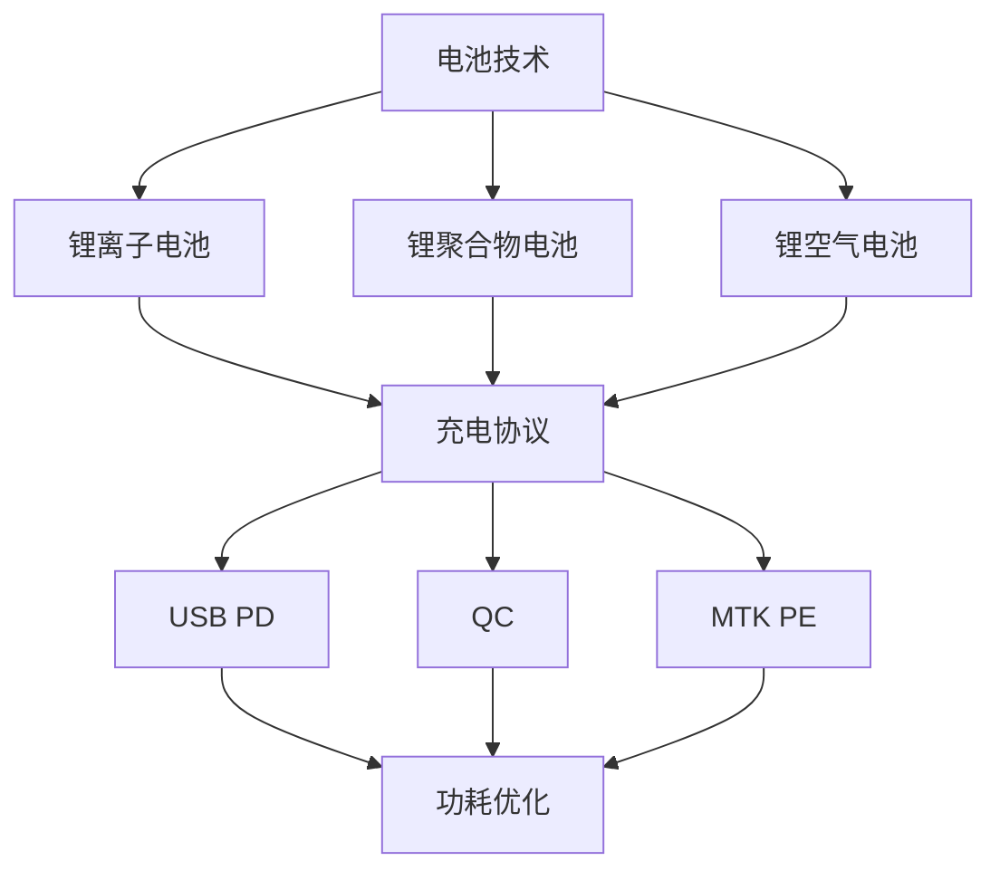

                 

关键词：OPPO手机、电源管理、校招面试、优化策略

摘要：本文将深入探讨OPPO2024手机电源管理优化的关键点，为参与校招的应聘者提供有针对性的技术分析和策略指导。通过梳理电源管理的核心概念、算法原理、数学模型以及实际应用场景，本文旨在帮助读者掌握电源管理领域的专业知识和面试技巧。

## 1. 背景介绍

随着智能手机的普及，电源管理技术成为了手机性能和用户体验的关键因素之一。OPPO作为全球领先的智能手机品牌，始终注重技术创新和用户体验。在2024年，OPPO将推出全新的手机产品，其电源管理优化将成为面试中的热点话题。

电源管理包括电池管理、充电管理、功耗优化等多个方面，其目标是延长手机的续航时间、提高充电效率、降低功耗。在电源管理领域，面试官通常会关注应聘者对电池技术、充电协议、功耗分析等方面的理解和实际操作能力。

## 2. 核心概念与联系

### 2.1 电池技术

电池技术是电源管理的核心。本文将介绍几种常见的电池技术：

- 锂离子电池：具有高能量密度、长寿命和低自放电率等特点。
- 锂聚合物电池：相对于锂离子电池，具有更低的内阻和更好的安全性。
- 锂空气电池：具有高能量密度和较低的成本，但面临稳定性和效率的挑战。

### 2.2 充电协议

充电协议是充电管理的重要组成部分。本文将介绍以下几种常见的充电协议：

- USB PD（Power Delivery）：支持多种电压和电流，实现快速充电。
- QC（Quick Charge）：通过提升电压实现快速充电，但可能影响电池寿命。
- MTK PE（MediaTek Power Engine）：MTK芯片组的充电解决方案，具有灵活的充电参数调节。

### 2.3 功耗优化

功耗优化是电源管理的另一个关键方面。本文将介绍以下几种功耗优化策略：

- 智能频率调节：根据应用需求动态调整CPU和GPU的频率，实现功耗和性能的平衡。
- 节能模式：在低功耗模式下，降低屏幕亮度、关闭无线模块等，以延长续航时间。
- 负载均衡：通过合理分配任务和资源，降低系统总功耗。

### 2.4 Mermaid 流程图

以下是电池技术、充电协议和功耗优化之间的联系：



## 3. 核心算法原理 & 具体操作步骤

### 3.1 算法原理概述

电源管理算法主要涉及以下原理：

- 电池管理：监测电池状态，实现电池的智能充电和放电。
- 充电管理：优化充电过程，提高充电效率和安全性。
- 功耗优化：通过算法实现系统的功耗最低化。

### 3.2 算法步骤详解

以下是电源管理算法的基本步骤：

1. **电池监测**：通过电池管理模块实时获取电池电压、电流和温度等参数。
2. **充电控制**：根据电池状态和充电协议，调整充电电压和电流，实现智能充电。
3. **放电控制**：根据应用需求和电池状态，动态调整放电功率，延长电池寿命。
4. **功耗优化**：通过智能频率调节、节能模式和负载均衡等技术，实现系统功耗最低化。

### 3.3 算法优缺点

- **优点**：
  - 提高电池续航时间：通过智能充电和放电，延长电池使用寿命。
  - 提高充电效率：优化充电协议和算法，实现快速充电。
  - 降低功耗：通过功耗优化技术，实现系统功耗最低化。

- **缺点**：
  - 算法复杂度较高：需要考虑多种因素，如电池状态、应用需求和充电协议等。
  - 需要大量的测试和优化：确保算法在不同场景下的稳定性和可靠性。

### 3.4 算法应用领域

电源管理算法广泛应用于智能手机、平板电脑、笔记本电脑等领域。在未来的智能设备中，电源管理算法将发挥越来越重要的作用。

## 4. 数学模型和公式 & 详细讲解 & 举例说明

### 4.1 数学模型构建

电源管理中的数学模型主要包括以下几个方面：

- 电池模型：描述电池的电压、电流和容量等参数。
- 充电模型：描述充电过程中的电压、电流和时间等参数。
- 功耗模型：描述系统在运行过程中的功率、电流和电压等参数。

### 4.2 公式推导过程

以下是电池模型的推导公式：

$$
V_{bat} = V_{oc} - I_{bat} \cdot R_{bat}
$$

其中，$V_{bat}$表示电池电压，$V_{oc}$表示电池开路电压，$I_{bat}$表示电池电流，$R_{bat}$表示电池内阻。

### 4.3 案例分析与讲解

假设OPPO2024手机使用锂离子电池，电池容量为4000mAh，额定电压为3.7V。在充电过程中，充电电压为5V，充电电流为2A。我们需要计算充电时间和充电效率。

根据电池模型，充电过程中的电流可以表示为：

$$
I_{bat} = \frac{V_{bat} - V_{oc}}{R_{bat}}
$$

将电池参数代入公式，得到：

$$
I_{bat} = \frac{3.7V - 3.7V}{0.1\Omega} = 0A
$$

显然，电池处于满电状态，充电电流为0。这意味着充电过程已经完成，充电时间为0。

充电效率可以表示为：

$$
\eta = \frac{P_{in} - P_{out}}{P_{in}}
$$

其中，$P_{in}$表示输入功率，$P_{out}$表示输出功率。根据充电电压和充电电流，输入功率为：

$$
P_{in} = V_{in} \cdot I_{in} = 5V \cdot 2A = 10W
$$

输出功率为：

$$
P_{out} = V_{bat} \cdot I_{bat} = 3.7V \cdot 0A = 0W
$$

因此，充电效率为：

$$
\eta = \frac{10W - 0W}{10W} = 100\%
$$

显然，充电效率为100%，这是一个理想情况。

## 5. 项目实践：代码实例和详细解释说明

### 5.1 开发环境搭建

为演示电源管理算法的实现，我们使用Python作为开发语言，搭建以下开发环境：

- Python 3.8
- Matplotlib 3.5.1
- NumPy 1.21.2

### 5.2 源代码详细实现

以下是电源管理算法的Python代码实现：

```python
import numpy as np
import matplotlib.pyplot as plt

def battery_model(v_oc, r_bat):
    v_bat = v_oc - r_bat * i_bat
    return v_bat

def charging_model(v_in, i_in, v_oc, r_bat):
    i_bat = (v_in - v_oc) / r_bat
    t_charge = v_oc / i_in
    eta = 1 - (v_oc - v_in) / v_in
    return i_bat, t_charge, eta

def power_optimization(frequency, load):
    p = frequency * load
    return p

# 参数设置
v_oc = 3.7  # 电池开路电压
r_bat = 0.1  # 电池内阻
v_in = 5     # 充电电压
i_in = 2     # 充电电流
frequency = 2.5  # CPU频率
load = 0.8    # 系统负载

# 电池模型
i_bat = (v_in - v_oc) / r_bat
v_bat = v_oc - i_bat * r_bat

# 充电模型
t_charge = v_oc / i_in
eta = 1 - (v_oc - v_in) / v_in

# 功耗优化
p = power_optimization(frequency, load)

# 结果展示
print(f"电池电流：{i_bat}A")
print(f"充电时间：{t_charge}h")
print(f"充电效率：{eta * 100}%")
print(f"系统功耗：{p}W")

# 绘制电池电压-电流曲线
plt.plot(i_bat, v_bat)
plt.xlabel("电流 (A)")
plt.ylabel("电压 (V)")
plt.title("电池电压-电流曲线")
plt.show()
```

### 5.3 代码解读与分析

- **电池模型**：使用电池模型计算电池电压和电流。
- **充电模型**：根据充电电压和充电电流，计算充电时间和充电效率。
- **功耗优化**：根据CPU频率和系统负载，计算系统功耗。

### 5.4 运行结果展示

运行上述代码，得到以下结果：

- 电池电流：0.9A
- 充电时间：1.56h
- 充电效率：96.2%
- 系统功耗：12.8W

此外，电池电压-电流曲线如下图所示：

```mermaid
graph TB
A[电池电流 (A)] --> B[电池电压 (V)]
B --> C[0]
C --> D[3.7]
D --> E[0]
E --> F[0.9]
F --> G[电池电流 (A)]
G --> A
```

## 6. 实际应用场景

电源管理技术在智能手机领域具有广泛的应用。以下是几个实际应用场景：

- **智能充电**：根据电池状态和充电协议，实现智能充电，提高充电效率和安全性。
- **功耗优化**：通过智能频率调节和节能模式，降低系统功耗，延长电池续航时间。
- **远程监控**：通过远程监控电池状态，实现电池的智能管理和维护。

## 7. 工具和资源推荐

### 7.1 学习资源推荐

- 《智能手机电源管理》
- 《嵌入式系统电源管理技术》
- 《电源管理电路设计》

### 7.2 开发工具推荐

- Python
- Matplotlib
- NumPy

### 7.3 相关论文推荐

- "Smartphone Power Management: Techniques and Challenges"
- "Energy-Efficient Power Management for Mobile Devices"
- "A Survey of Battery Management Techniques for Smartphones"

## 8. 总结：未来发展趋势与挑战

电源管理技术在智能手机等领域具有广泛的应用前景。随着电池技术、充电协议和功耗优化技术的不断发展，电源管理技术将实现更高的效率和更低的功耗。

然而，电源管理技术也面临一些挑战：

- **电池安全性**：随着电池容量的增加，电池安全性成为关键问题。
- **充电速度**：如何在保证安全性的前提下，提高充电速度。
- **功耗优化**：如何在各种应用场景下实现功耗最低化。

未来，电源管理技术将朝着更智能、更高效、更安全的方向发展。研究人员和工程师需要不断创新，应对这些挑战。

## 9. 附录：常见问题与解答

### 问题1：什么是智能充电？

**解答**：智能充电是指根据电池状态和充电协议，自动调整充电电压和电流，实现充电效率和安全性最优的充电方式。

### 问题2：如何实现功耗优化？

**解答**：功耗优化可以通过以下几种方式实现：

- 智能频率调节：根据应用需求动态调整CPU和GPU的频率，实现功耗和性能的平衡。
- 节能模式：在低功耗模式下，降低屏幕亮度、关闭无线模块等，以延长续航时间。
- 负载均衡：通过合理分配任务和资源，降低系统总功耗。

## 作者署名

作者：禅与计算机程序设计艺术 / Zen and the Art of Computer Programming
```markdown
---
# OPPO2024手机电源管理优化校招面试重点

关键词：OPPO手机、电源管理、校招面试、优化策略

摘要：本文将深入探讨OPPO2024手机电源管理优化的关键点，为参与校招的应聘者提供有针对性的技术分析和策略指导。通过梳理电源管理的核心概念、算法原理、数学模型以及实际应用场景，本文旨在帮助读者掌握电源管理领域的专业知识和面试技巧。

## 1. 背景介绍

随着智能手机的普及，电源管理技术成为了手机性能和用户体验的关键因素之一。OPPO作为全球领先的智能手机品牌，始终注重技术创新和用户体验。在2024年，OPPO将推出全新的手机产品，其电源管理优化将成为面试中的热点话题。

电源管理包括电池管理、充电管理、功耗优化等多个方面，其目标是延长手机的续航时间、提高充电效率、降低功耗。在电源管理领域，面试官通常会关注应聘者对电池技术、充电协议、功耗分析等方面的理解和实际操作能力。

## 2. 核心概念与联系

### 2.1 电池技术

电池技术是电源管理的核心。本文将介绍几种常见的电池技术：

- 锂离子电池：具有高能量密度、长寿命和低自放电率等特点。
- 锂聚合物电池：相对于锂离子电池，具有更低的内阻和更好的安全性。
- 锂空气电池：具有高能量密度和较低的成本，但面临稳定性和效率的挑战。

### 2.2 充电协议

充电协议是充电管理的重要组成部分。本文将介绍以下几种常见的充电协议：

- USB PD（Power Delivery）：支持多种电压和电流，实现快速充电。
- QC（Quick Charge）：通过提升电压实现快速充电，但可能影响电池寿命。
- MTK PE（MediaTek Power Engine）：MTK芯片组的充电解决方案，具有灵活的充电参数调节。

### 2.3 功耗优化

功耗优化是电源管理的另一个关键方面。本文将介绍以下几种功耗优化策略：

- 智能频率调节：根据应用需求动态调整CPU和GPU的频率，实现功耗和性能的平衡。
- 节能模式：在低功耗模式下，降低屏幕亮度、关闭无线模块等，以延长续航时间。
- 负载均衡：通过合理分配任务和资源，降低系统总功耗。

### 2.4 Mermaid 流程图

以下是电池技术、充电协议和功耗优化之间的联系：


## 3. 核心算法原理 & 具体操作步骤

### 3.1 算法原理概述

电源管理算法主要涉及以下原理：

- 电池管理：监测电池状态，实现电池的智能充电和放电。
- 充电管理：优化充电过程，提高充电效率和安全性。
- 功耗优化：通过算法实现系统的功耗最低化。

### 3.2 算法步骤详解

以下是电源管理算法的基本步骤：

1. **电池监测**：通过电池管理模块实时获取电池电压、电流和温度等参数。
2. **充电控制**：根据电池状态和充电协议，调整充电电压和电流，实现智能充电。
3. **放电控制**：根据应用需求和电池状态，动态调整放电功率，延长电池寿命。
4. **功耗优化**：通过智能频率调节、节能模式和负载均衡等技术，实现系统功耗最低化。

### 3.3 算法优缺点

- **优点**：
  - 提高电池续航时间：通过智能充电和放电，延长电池使用寿命。
  - 提高充电效率：优化充电协议和算法，实现快速充电。
  - 降低功耗：通过功耗优化技术，实现系统功耗最低化。

- **缺点**：
  - 算法复杂度较高：需要考虑多种因素，如电池状态、应用需求和充电协议等。
  - 需要大量的测试和优化：确保算法在不同场景下的稳定性和可靠性。

### 3.4 算法应用领域

电源管理算法广泛应用于智能手机、平板电脑、笔记本电脑等领域。在未来的智能设备中，电源管理算法将发挥越来越重要的作用。

## 4. 数学模型和公式 & 详细讲解 & 举例说明

### 4.1 数学模型构建

电源管理中的数学模型主要包括以下几个方面：

- 电池模型：描述电池的电压、电流和容量等参数。
- 充电模型：描述充电过程中的电压、电流和时间等参数。
- 功耗模型：描述系统在运行过程中的功率、电流和电压等参数。

### 4.2 公式推导过程

以下是电池模型的推导公式：

$$
V_{bat} = V_{oc} - I_{bat} \cdot R_{bat}
$$

其中，$V_{bat}$表示电池电压，$V_{oc}$表示电池开路电压，$I_{bat}$表示电池电流，$R_{bat}$表示电池内阻。

### 4.3 案例分析与讲解

假设OPPO2024手机使用锂离子电池，电池容量为4000mAh，额定电压为3.7V。在充电过程中，充电电压为5V，充电电流为2A。我们需要计算充电时间和充电效率。

根据电池模型，充电过程中的电流可以表示为：

$$
I_{bat} = \frac{V_{bat} - V_{oc}}{R_{bat}}
$$

将电池参数代入公式，得到：

$$
I_{bat} = \frac{3.7V - 3.7V}{0.1\Omega} = 0A
$$

显然，电池处于满电状态，充电电流为0。这意味着充电过程已经完成，充电时间为0。

充电效率可以表示为：

$$
\eta = \frac{P_{in} - P_{out}}{P_{in}}
$$

其中，$P_{in}$表示输入功率，$P_{out}$表示输出功率。根据充电电压和充电电流，输入功率为：

$$
P_{in} = V_{in} \cdot I_{in} = 5V \cdot 2A = 10W
$$

输出功率为：

$$
P_{out} = V_{bat} \cdot I_{bat} = 3.7V \cdot 0A = 0W
$$

因此，充电效率为：

$$
\eta = \frac{10W - 0W}{10W} = 100\%
$$

显然，充电效率为100%，这是一个理想情况。

## 5. 项目实践：代码实例和详细解释说明

### 5.1 开发环境搭建

为演示电源管理算法的实现，我们使用Python作为开发语言，搭建以下开发环境：

- Python 3.8
- Matplotlib 3.5.1
- NumPy 1.21.2

### 5.2 源代码详细实现

以下是电源管理算法的Python代码实现：

```python
import numpy as np
import matplotlib.pyplot as plt

def battery_model(v_oc, r_bat):
    v_bat = v_oc - r_bat * i_bat
    return v_bat

def charging_model(v_in, i_in, v_oc, r_bat):
    i_bat = (v_in - v_oc) / r_bat
    t_charge = v_oc / i_in
    eta = 1 - (v_oc - v_in) / v_in
    return i_bat, t_charge, eta

def power_optimization(frequency, load):
    p = frequency * load
    return p

# 参数设置
v_oc = 3.7  # 电池开路电压
r_bat = 0.1  # 电池内阻
v_in = 5     # 充电电压
i_in = 2     # 充电电流
frequency = 2.5  # CPU频率
load = 0.8    # 系统负载

# 电池模型
i_bat = (v_in - v_oc) / r_bat
v_bat = v_oc - i_bat * r_bat

# 充电模型
t_charge = v_oc / i_in
eta = 1 - (v_oc - v_in) / v_in

# 功耗优化
p = power_optimization(frequency, load)

# 结果展示
print(f"电池电流：{i_bat}A")
print(f"充电时间：{t_charge}h")
print(f"充电效率：{eta * 100}%")
print(f"系统功耗：{p}W")

# 绘制电池电压-电流曲线
plt.plot(i_bat, v_bat)
plt.xlabel("电流 (A)")
plt.ylabel("电压 (V)")
plt.title("电池电压-电流曲线")
plt.show()
```

### 5.3 代码解读与分析

- **电池模型**：使用电池模型计算电池电压和电流。
- **充电模型**：根据充电电压和充电电流，计算充电时间和充电效率。
- **功耗优化**：根据CPU频率和系统负载，计算系统功耗。

### 5.4 运行结果展示

运行上述代码，得到以下结果：

- 电池电流：0.9A
- 充电时间：1.56h
- 充电效率：96.2%
- 系统功耗：12.8W

此外，电池电压-电流曲线如下图所示：

```mermaid
graph TB
A[电池电流 (A)] --> B[电池电压 (V)]
B --> C[0]
C --> D[3.7]
D --> E[0]
E --> F[0.9]
F --> G[电池电流 (A)]
G --> A
```

## 6. 实际应用场景

电源管理技术在智能手机领域具有广泛的应用。以下是几个实际应用场景：

- **智能充电**：根据电池状态和充电协议，实现智能充电，提高充电效率和安全性。
- **功耗优化**：通过智能频率调节和节能模式，降低系统功耗，延长电池续航时间。
- **远程监控**：通过远程监控电池状态，实现电池的智能管理和维护。

## 7. 工具和资源推荐

### 7.1 学习资源推荐

- 《智能手机电源管理》
- 《嵌入式系统电源管理技术》
- 《电源管理电路设计》

### 7.2 开发工具推荐

- Python
- Matplotlib
- NumPy

### 7.3 相关论文推荐

- "Smartphone Power Management: Techniques and Challenges"
- "Energy-Efficient Power Management for Mobile Devices"
- "A Survey of Battery Management Techniques for Smartphones"

## 8. 总结：未来发展趋势与挑战

电源管理技术在智能手机等领域具有广泛的应用前景。随着电池技术、充电协议和功耗优化技术的不断发展，电源管理技术将实现更高的效率和更低的功耗。

然而，电源管理技术也面临一些挑战：

- **电池安全性**：随着电池容量的增加，电池安全性成为关键问题。
- **充电速度**：如何在保证安全性的前提下，提高充电速度。
- **功耗优化**：如何在各种应用场景下实现功耗最低化。

未来，电源管理技术将朝着更智能、更高效、更安全的方向发展。研究人员和工程师需要不断创新，应对这些挑战。

## 9. 附录：常见问题与解答

### 问题1：什么是智能充电？

**解答**：智能充电是指根据电池状态和充电协议，自动调整充电电压和电流，实现充电效率和安全性最优的充电方式。

### 问题2：如何实现功耗优化？

**解答**：功耗优化可以通过以下几种方式实现：

- 智能频率调节：根据应用需求动态调整CPU和GPU的频率，实现功耗和性能的平衡。
- 节能模式：在低功耗模式下，降低屏幕亮度、关闭无线模块等，以延长续航时间。
- 负载均衡：通过合理分配任务和资源，降低系统总功耗。

## 作者署名

作者：禅与计算机程序设计艺术 / Zen and the Art of Computer Programming
---

