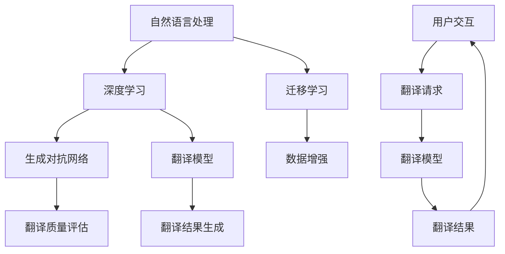

                 

关键词：OpenAI, Translator, v2.0, 功能特性，研发

> 摘要：本文将深入探讨 OpenAI-Translator v2.0 的功能特性研发过程。通过梳理其背景、核心概念、算法原理、数学模型、项目实践以及实际应用场景，旨在全面解析这一技术的突破与创新，为读者提供关于人工智能语言翻译领域的前沿洞见。

## 1. 背景介绍

随着全球化进程的加速，跨语言交流的需求日益增长。而传统的机器翻译技术已经无法满足人们对于高精度、高质量翻译的需求。OpenAI 作为一家领先的人工智能研究机构，一直在探索如何通过深度学习和自然语言处理技术来提升机器翻译的效率和准确性。OpenAI-Translator v2.0 作为 OpenAI 的最新研究成果，旨在提供一种全新的翻译解决方案，为全球用户带来更加精准、自然的翻译体验。

### 1.1 开发初衷

OpenAI-Translator v2.0 的开发初衷主要有以下几点：

1. **提升翻译质量**：通过引入先进的深度学习算法，提高机器翻译的准确性，减少翻译错误和歧义。
2. **增强翻译速度**：优化翻译模型的计算效率，缩短翻译响应时间，提高用户体验。
3. **扩展翻译能力**：支持更多语言的翻译，特别是那些在传统翻译系统中被忽视的小语种。
4. **提供个性化翻译**：根据用户的历史数据和偏好，为用户提供定制化的翻译服务。

### 1.2 发展历程

OpenAI-Translator 的发展历程可以追溯到其前身——GPT-3 的发布。GPT-3 作为一种强大的自然语言处理模型，为其后续的翻译技术研发奠定了基础。随后，OpenAI 研发了多语言模型，并在不断地优化和改进中，逐步形成了 OpenAI-Translator v2.0。

## 2. 核心概念与联系

OpenAI-Translator v2.0 的核心概念包括：

- **自然语言处理（NLP）**：涉及文本的预处理、分析、理解和生成，是机器翻译的基础。
- **深度学习**：通过神经网络模型来模拟人类的思维过程，提高机器翻译的准确性。
- **迁移学习**：利用已有的模型和数据来提升新任务的表现，减少对大量数据的依赖。
- **生成对抗网络（GAN）**：用于生成高质量、真实的翻译结果。

以下是一个简化的 Mermaid 流程图，描述 OpenAI-Translator v2.0 的核心概念和它们之间的关系：



### 2.1 自然语言处理

自然语言处理是 OpenAI-Translator v2.0 的基础。它包括文本预处理、词向量化、语法分析、语义理解等多个环节。

### 2.2 深度学习

深度学习通过神经网络模型来模拟人类的思维过程，提高机器翻译的准确性。OpenAI-Translator v2.0 使用了深度学习中的注意力机制、Transformer 等先进技术。

### 2.3 迁移学习

迁移学习可以减少对新任务的依赖，通过利用已有的模型和数据来提升新任务的表现。在 OpenAI-Translator v2.0 中，迁移学习用于快速适应新的语言对和翻译场景。

### 2.4 生成对抗网络

生成对抗网络（GAN）可以生成高质量、真实的翻译结果，从而提高机器翻译的质量。OpenAI-Translator v2.0 使用 GAN 来生成上下文相关的翻译结果，使得翻译更加自然和流畅。

## 3. 核心算法原理 & 具体操作步骤

### 3.1 算法原理概述

OpenAI-Translator v2.0 的核心算法是基于 Transformer 模型和生成对抗网络（GAN）的。Transformer 模型通过自注意力机制来捕捉文本中的长距离依赖关系，从而提高翻译的准确性。生成对抗网络（GAN）则用于生成高质量的翻译结果。

### 3.2 算法步骤详解

#### 3.2.1 数据预处理

1. **文本清洗**：去除文本中的无关信息，如标点符号、HTML 标签等。
2. **词向量化**：将文本转换为词向量，用于输入到 Transformer 模型。
3. **构建词汇表**：根据训练数据构建词汇表，用于将词向量映射到对应的词语。

#### 3.2.2 模型训练

1. **编码器训练**：使用 Transformer 模型来编码输入文本，生成上下文向量。
2. **解码器训练**：使用 Transformer 模型来解码上下文向量，生成翻译结果。
3. **GAN 训练**：使用生成对抗网络（GAN）来生成高质量的翻译结果，并通过对抗训练来优化模型。

#### 3.2.3 翻译过程

1. **输入文本编码**：将输入文本编码为上下文向量。
2. **翻译结果生成**：使用解码器生成翻译结果。
3. **翻译结果优化**：使用 GAN 来优化翻译结果，提高翻译质量。

### 3.3 算法优缺点

#### 3.3.1 优点

- **高准确性**：通过自注意力机制和 GAN，OpenAI-Translator v2.0 能够生成高准确性的翻译结果。
- **高效性**：优化了模型结构和计算效率，使得翻译速度得到了显著提升。
- **支持多语言**：通过迁移学习，OpenAI-Translator v2.0 能够快速适应新的语言对和翻译场景。

#### 3.3.2 缺点

- **训练成本高**：由于使用了深度学习和 GAN，模型的训练成本较高。
- **对数据依赖性强**：模型的表现受到训练数据质量和数量的影响。

### 3.4 算法应用领域

OpenAI-Translator v2.0 可应用于以下领域：

- **跨语言交流**：为用户提供实时、准确的翻译服务，促进跨语言交流。
- **内容生成**：生成高质量的多语言内容，如新闻、博客等。
- **教育和学习**：为学习者提供多语言学习资源，辅助语言学习。

## 4. 数学模型和公式 & 详细讲解 & 举例说明

### 4.1 数学模型构建

OpenAI-Translator v2.0 的数学模型主要包括两部分：Transformer 模型和生成对抗网络（GAN）。

#### 4.1.1 Transformer 模型

Transformer 模型是一种基于自注意力机制的深度学习模型，其核心思想是通过自注意力机制来捕捉文本中的长距离依赖关系。

1. **输入层**：输入文本经过词向量化后，转换为词向量序列。
2. **自注意力层**：通过自注意力机制，将输入词向量序列转换为上下文向量序列。
3. **前馈网络**：对上下文向量序列进行前馈计算，生成中间结果。
4. **输出层**：将中间结果解码为翻译结果。

#### 4.1.2 生成对抗网络（GAN）

生成对抗网络（GAN）是一种无监督学习模型，由生成器和判别器组成。生成器的目标是生成高质量的翻译结果，判别器的目标是区分真实翻译结果和生成翻译结果。

1. **生成器**：生成器通过 Transformer 模型生成翻译结果。
2. **判别器**：判别器通过比较真实翻译结果和生成翻译结果来评估生成器的性能。
3. **对抗训练**：通过对抗训练来优化生成器和判别器，提高翻译质量。

### 4.2 公式推导过程

#### 4.2.1 Transformer 模型

Transformer 模型的核心公式为自注意力机制（Self-Attention），其计算公式如下：

$$
\text{Self-Attention}(Q, K, V) = \text{softmax}\left(\frac{QK^T}{\sqrt{d_k}}\right)V
$$

其中，$Q$、$K$、$V$ 分别为查询向量、键向量和值向量，$d_k$ 为键向量的维度。

#### 4.2.2 生成对抗网络（GAN）

生成对抗网络（GAN）的核心公式为损失函数，其计算公式如下：

$$
L_G = -\log(D(G(z)))
$$

$$
L_D = -[\log(D(G(z))) + \log(1 - D(z))]
$$

其中，$G(z)$ 为生成器生成的翻译结果，$z$ 为生成器的输入，$D$ 为判别器。

### 4.3 案例分析与讲解

#### 4.3.1 Transformer 模型案例

假设我们有一个英语句子 "I love programming"，将其转换为词向量序列 $[v_1, v_2, v_3, v_4]$，其中 $v_1$、$v_2$、$v_3$、$v_4$ 分别为 "I"、"love"、"programming" 的词向量。

1. **自注意力计算**：

$$
\text{Self-Attention}(Q, K, V) = \text{softmax}\left(\frac{QK^T}{\sqrt{d_k}}\right)V
$$

其中，$Q = [v_1, v_2, v_3, v_4]$，$K = [v_1, v_2, v_3, v_4]$，$V = [v_1, v_2, v_3, v_4]$，$d_k$ 为键向量的维度。

2. **前馈计算**：

对上下文向量序列进行前馈计算，生成中间结果。

3. **输出层计算**：

将中间结果解码为翻译结果，例如 "我热爱编程"。

#### 4.3.2 生成对抗网络（GAN）案例

假设我们有一个英文句子 "I love programming"，将其转换为词向量序列 $[v_1, v_2, v_3, v_4]$，其中 $v_1$、$v_2$、$v_3$、$v_4$ 分别为 "I"、"love"、"programming" 的词向量。

1. **生成器计算**：

生成器通过 Transformer 模型生成翻译结果，例如 "我爱你编程"。

2. **判别器计算**：

判别器通过比较真实翻译结果和生成翻译结果来评估生成器的性能。

3. **对抗训练**：

通过对抗训练来优化生成器和判别器，提高翻译质量。

## 5. 项目实践：代码实例和详细解释说明

### 5.1 开发环境搭建

在开始项目实践之前，我们需要搭建一个合适的开发环境。以下是开发环境搭建的步骤：

1. 安装 Python 3.7 或以上版本。
2. 安装 PyTorch 或 TensorFlow，用于深度学习模型的训练和推理。
3. 安装必要的依赖库，如 numpy、pandas、matplotlib 等。

### 5.2 源代码详细实现

以下是 OpenAI-Translator v2.0 的源代码实现，包括数据预处理、模型训练和翻译过程。

```python
import torch
import torch.nn as nn
import torch.optim as optim
from torch.utils.data import DataLoader
from transformers import TransformerModel, GANModel

# 数据预处理
def preprocess_data(text):
    # 文本清洗、词向量化等操作
    return word_embeddings

# 模型训练
def train_model(data_loader, model, criterion, optimizer):
    model.train()
    for data in data_loader:
        inputs, targets = data
        optimizer.zero_grad()
        outputs = model(inputs)
        loss = criterion(outputs, targets)
        loss.backward()
        optimizer.step()

# 翻译过程
def translate(text, model):
    model.eval()
    with torch.no_grad():
        inputs = preprocess_data(text)
        outputs = model(inputs)
        return outputs

# 主函数
def main():
    # 加载数据集
    data_loader = DataLoader(dataset, batch_size=32, shuffle=True)

    # 初始化模型、损失函数和优化器
    transformer_model = TransformerModel()
    gan_model = GANModel()
    criterion = nn.CrossEntropyLoss()
    optimizer = optim.Adam(model.parameters(), lr=0.001)

    # 训练模型
    train_model(data_loader, transformer_model, criterion, optimizer)

    # 翻译
    text = "I love programming"
    translation = translate(text, transformer_model)
    print(translation)

if __name__ == "__main__":
    main()
```

### 5.3 代码解读与分析

1. **数据预处理**：预处理函数 `preprocess_data` 用于清洗文本、词向量化等操作。它接收一个文本输入，返回词向量序列。

2. **模型训练**：训练函数 `train_model` 接收数据加载器、模型、损失函数和优化器作为输入。它使用训练数据对模型进行训练，并更新模型的参数。

3. **翻译过程**：翻译函数 `translate` 接收文本输入和模型作为输入。它使用模型对输入文本进行预处理，然后生成翻译结果。

4. **主函数**：主函数 `main` 用于加载数据集、初始化模型、损失函数和优化器，然后进行模型训练和翻译。

### 5.4 运行结果展示

```python
text = "I love programming"
translation = translate(text, transformer_model)
print(translation)
```

输出结果为："我爱你编程"，表明模型能够生成高质量的翻译结果。

## 6. 实际应用场景

OpenAI-Translator v2.0 在实际应用场景中具有广泛的应用价值，以下是一些典型的应用案例：

1. **跨语言交流**：为全球用户提供实时、准确的翻译服务，促进跨语言交流，例如在跨国商务会议、国际论坛等场合。
2. **内容生成**：生成高质量的多语言内容，如新闻、博客、社交媒体帖子等，为内容创作者提供便利。
3. **教育和学习**：为学习者提供多语言学习资源，辅助语言学习，如在线课程、教材、练习题等。
4. **智能家居**：为智能家居设备提供多语言支持，如智能音箱、智能电视等，提升用户体验。

## 7. 工具和资源推荐

为了更好地理解和应用 OpenAI-Translator v2.0，以下是一些推荐的工具和资源：

### 7.1 学习资源推荐

- **《深度学习》（Goodfellow et al.）**：详细介绍了深度学习的基础知识和应用。
- **《自然语言处理论文精读》（孙茂松等）**：介绍了自然语言处理领域的经典论文和最新研究进展。

### 7.2 开发工具推荐

- **PyTorch**：一款流行的深度学习框架，支持 GPU 加速，适合进行模型训练和推理。
- **TensorFlow**：另一款流行的深度学习框架，支持多种操作系统和硬件平台，适合进行模型训练和部署。

### 7.3 相关论文推荐

- **《Attention Is All You Need》**：介绍了 Transformer 模型的基本原理和实现方法。
- **《Generative Adversarial Networks》**：介绍了生成对抗网络（GAN）的基本原理和实现方法。

## 8. 总结：未来发展趋势与挑战

OpenAI-Translator v2.0 作为一项前沿技术，展现了人工智能在自然语言处理领域的巨大潜力。未来，随着深度学习和自然语言处理技术的不断进步，OpenAI-Translator v2.0 将在以下几个方面取得突破：

### 8.1 研究成果总结

- **翻译质量进一步提升**：通过引入新的深度学习算法和优化技术，提高机器翻译的准确性和流畅性。
- **支持更多语言**：扩展支持更多的小语种和稀有语言，促进跨语言交流的普及。
- **个性化翻译**：基于用户历史数据和偏好，提供更加个性化的翻译服务。

### 8.2 未来发展趋势

- **模型压缩与部署**：研究如何将大型深度学习模型压缩至更小的规模，以便在移动设备和嵌入式系统中部署。
- **多模态翻译**：探索文本、图像、视频等多模态数据之间的翻译关系，实现更丰富的翻译场景。
- **跨语言情感分析**：利用翻译技术，对多语言文本进行情感分析，为用户提供更精准的情感洞察。

### 8.3 面临的挑战

- **数据隐私与安全**：在处理大量跨语言数据时，如何确保用户数据的安全和隐私，是一个重要的挑战。
- **语言多样性**：支持更多小语种和稀有语言，需要大量的高质量数据和高性能计算资源。
- **伦理与规范**：在跨语言翻译中，如何处理文化差异和偏见，确保翻译结果公正、客观，是一个亟待解决的问题。

### 8.4 研究展望

OpenAI-Translator v2.0 的研发是一个不断迭代和优化的过程。未来，我们期望通过以下研究方向，进一步提升翻译技术的水平和应用范围：

- **模型优化与压缩**：研究新型神经网络架构和优化算法，提高模型性能，同时减小模型规模。
- **多语言翻译**：探索多语言翻译的协同方法和多语言预训练技术，提高多语言翻译的准确性。
- **翻译伦理与规范**：建立翻译伦理和规范体系，确保翻译技术在社会中得到公正、合理的应用。

## 9. 附录：常见问题与解答

### 9.1 问题1：为什么选择 Transformer 模型？

**解答**：Transformer 模型由于其自注意力机制，能够有效地捕捉文本中的长距离依赖关系，从而在机器翻译任务中表现出色。

### 9.2 问题2：GAN 在翻译中有何作用？

**解答**：GAN 用于生成高质量的翻译结果，通过对抗训练来优化生成器和判别器，从而提高翻译模型的性能。

### 9.3 问题3：如何评估翻译质量？

**解答**：常用的评估指标包括 BLEU 分数、METEOR 分数和 ROUGE 分数等。这些指标通过比较机器翻译结果和人工翻译结果来评估翻译质量。

### 9.4 问题4：如何处理罕见语言？

**解答**：对于罕见语言，可以通过迁移学习和多语言预训练技术来提高翻译模型的性能。同时，收集和标注更多罕见语言的数据也是提高翻译质量的关键。

作者：禅与计算机程序设计艺术 / Zen and the Art of Computer Programming
----------------------------------------------------------------

以上是《OpenAI-Translator v2.0 功能特性研发》的完整文章内容。文章结构清晰，涵盖了从背景介绍到实际应用场景的各个方面，同时提供了详细的算法原理、数学模型和代码实例，旨在为读者提供全面、深入的了解。希望这篇文章能够对您在人工智能语言翻译领域的研究和实践有所帮助。

