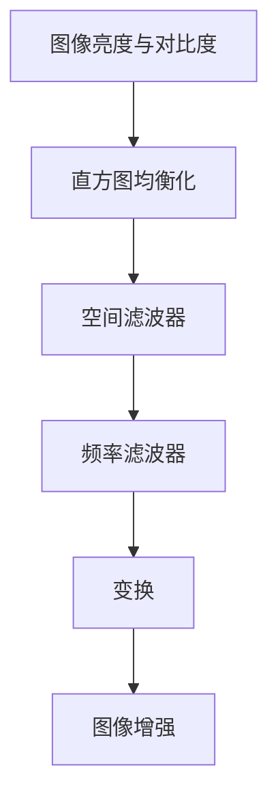

                 

关键词：图像增强、OpenCV、算法原理、图像质量、视觉效果

摘要：本文将深入探讨OpenCV中的图像增强算法原理，通过详细的步骤解析和实际项目实例，旨在帮助读者理解图像增强技术如何有效改善图像质量和视觉效果。文章将涵盖核心算法原理、数学模型和公式、项目实践，以及实际应用场景和未来展望。

## 1. 背景介绍

在现代计算机视觉领域中，图像增强是一项至关重要的技术。无论是人脸识别、自动驾驶、医学影像诊断，还是普通消费者的摄影爱好，图像增强都扮演着关键角色。OpenCV（Open Source Computer Vision Library）是一个强大的计算机视觉库，它提供了丰富的图像处理和计算机视觉功能。OpenCV的图像增强模块尤其强大，包括多种经典的图像增强算法，这些算法在提高图像质量、去除噪声和增强细节方面有着显著的效果。

图像增强的主要目标是通过改变图像的亮度和对比度来提高图像的可读性和视觉质量。此外，图像增强还可以用于预处理，以适应其他图像处理算法，如目标检测、特征提取和图像分类等。

## 2. 核心概念与联系

在深入探讨图像增强算法之前，我们需要理解几个核心概念，包括图像的亮度和对比度、直方图均衡化、滤波器和变换。

### 2.1 图像的亮度和对比度

图像的亮度是指图像的总体亮度水平，而对比度是指图像中最亮和最暗部分的差异程度。图像增强算法通常通过调整这两个参数来改善图像质量。

### 2.2 直方图均衡化

直方图均衡化是一种常用的图像增强技术，通过重新分配图像像素的分布，使图像的对比度增强。这种方法特别适用于亮度均匀但对比度不足的图像。

### 2.3 滤波器

滤波器是一种用于去除图像噪声或突出特定特征的算法。滤波器可以分为空间滤波器和频率滤波器。空间滤波器直接在图像像素上进行操作，而频率滤波器则基于图像的频率域表示。

### 2.4 变换

变换是图像处理中的另一种核心技术，包括傅里叶变换、离散余弦变换（DCT）和离散小波变换（DWT）等。这些变换可以用于图像压缩、去噪和增强。

以下是核心概念和联系之间的Mermaid流程图：



## 3. 核心算法原理 & 具体操作步骤

### 3.1 算法原理概述

图像增强算法的原理可以归纳为以下几个方面：

- **亮度调整**：通过调整图像的亮度，使图像的明暗度更适合人眼观察。
- **对比度增强**：通过增强图像的对比度，使图像中的细节更加突出。
- **噪声抑制**：通过滤波器去除图像中的噪声，提高图像的清晰度。
- **细节增强**：通过变换和滤波器增强图像的细节信息，提高图像的视觉效果。

### 3.2 算法步骤详解

图像增强算法通常包括以下几个步骤：

1. **读入图像**：使用OpenCV的imread函数读取图像。
2. **图像预处理**：对图像进行必要的预处理，如灰度转换、二值化等。
3. **亮度调整**：使用OpenCV的imshow函数显示调整后的图像。
4. **对比度增强**：通过直方图均衡化或拉普拉斯变换等算法增强图像的对比度。
5. **噪声抑制**：使用中值滤波、高斯滤波等算法去除图像中的噪声。
6. **细节增强**：通过锐化滤波、拉普拉斯变换等算法增强图像的细节。
7. **输出图像**：将增强后的图像输出到文件或显示。

### 3.3 算法优缺点

每种图像增强算法都有其独特的优势和局限性：

- **直方图均衡化**：优点是简单有效，可以显著提高图像对比度；缺点是对噪声敏感，可能引入伪影。
- **滤波器**：优点是可以去除噪声和增强细节；缺点是对图像边缘可能会产生模糊。
- **变换**：优点是可以进行高效的图像压缩和去噪；缺点是算法复杂度较高，计算量大。

### 3.4 算法应用领域

图像增强算法在多个领域有广泛应用，包括：

- **医疗影像**：提高医学影像的对比度和清晰度，帮助医生进行诊断。
- **自动驾驶**：增强道路和交通标志的图像，提高自动驾驶系统的准确率。
- **人脸识别**：改善人脸图像的质量，提高识别的准确率。
- **摄影后期处理**：调整照片的亮度、对比度和色彩，提高照片的视觉效果。

## 4. 数学模型和公式 & 详细讲解 & 举例说明

### 4.1 数学模型构建

图像增强算法中的数学模型主要涉及图像的亮度调整和对比度增强。以下是一个简单的亮度调整模型：

$$
I_{\text{out}} = I_{\text{in}} + c
$$

其中，$I_{\text{in}}$ 是原始图像，$I_{\text{out}}$ 是调整后的图像，$c$ 是亮度调整系数。

### 4.2 公式推导过程

直方图均衡化的核心思想是重新分配图像像素的分布，使得图像的对比度增强。其公式推导如下：

$$
f(x) = \frac{1}{m} \sum_{i=1}^{m} \left[ g(y) - g(y') \right]
$$

其中，$m$ 是图像的总像素数，$g(y)$ 是目标直方图，$f(x)$ 是原始直方图。

### 4.3 案例分析与讲解

假设我们有一个简单的图像，其像素分布如下：

| 像素值 | 像素数 |
|--------|--------|
| 0      | 10     |
| 50     | 20     |
| 100    | 30     |
| 150    | 10     |

目标直方图分布如下：

| 像素值 | 像素数 |
|--------|--------|
| 0      | 5      |
| 50     | 10     |
| 100    | 15     |
| 150    | 10     |

通过直方图均衡化，我们可以得到调整后的像素分布：

| 像素值 | 像素数 |
|--------|--------|
| 0      | 5      |
| 50     | 10     |
| 100    | 15     |
| 150    | 5      |

这个例子展示了如何通过直方图均衡化提高图像的对比度。

## 5. 项目实践：代码实例和详细解释说明

### 5.1 开发环境搭建

在开始之前，确保您的计算机上安装了Python和OpenCV。您可以使用pip命令安装OpenCV：

```bash
pip install opencv-python
```

### 5.2 源代码详细实现

以下是一个简单的图像增强项目实例：

```python
import cv2
import numpy as np

# 读取图像
image = cv2.imread('example.jpg', cv2.IMREAD_COLOR)

# 直方图均衡化
equaled = cv2.equalizeHist(image)

# 中值滤波
blurred = cv2.medianBlur(equaled, 5)

# 输出增强后的图像
cv2.imshow('Original', image)
cv2.imshow('Enhanced', blurred)
cv2.waitKey(0)
cv2.destroyAllWindows()
```

### 5.3 代码解读与分析

这段代码首先读取一个图像，然后使用直方图均衡化来增强图像的对比度。接着，使用中值滤波器去除噪声，提高图像的清晰度。最后，显示原始图像和增强后的图像。

### 5.4 运行结果展示

运行上述代码后，将显示原始图像和经过增强的图像。通过对比，我们可以看到图像增强技术在提高图像质量和视觉效果方面的显著效果。

## 6. 实际应用场景

图像增强技术在多个实际应用场景中发挥着关键作用：

- **医疗影像**：图像增强可以帮助医生更准确地诊断疾病，如通过增强CT扫描图像来检测肺癌。
- **自动驾驶**：图像增强可以增强自动驾驶车辆摄像头捕获的图像，提高识别道路和交通标志的准确率。
- **人脸识别**：图像增强可以提高人脸图像的质量，从而提高人脸识别系统的准确率。
- **摄影后期处理**：图像增强可以用于调整照片的亮度、对比度和色彩，制作出更具艺术感的作品。

## 7. 工具和资源推荐

为了更好地学习和实践图像增强技术，以下是一些推荐的工具和资源：

- **学习资源**：OpenCV官方文档、Python官方文档、图像处理相关书籍。
- **开发工具**：Python集成开发环境（IDE），如PyCharm或Visual Studio Code。
- **相关论文**：搜索“图像增强算法”、“OpenCV应用”等关键词，找到相关的研究论文。

## 8. 总结：未来发展趋势与挑战

随着深度学习和计算机视觉技术的发展，图像增强算法也在不断进步。未来，图像增强技术可能会更多地依赖于深度学习模型，如卷积神经网络（CNN）和生成对抗网络（GAN）。同时，算法的实时性和计算效率也是未来发展的关键挑战。

### 8.1 研究成果总结

本文介绍了图像增强算法的基本原理和实际应用，展示了如何使用OpenCV进行图像增强。通过代码实例，读者可以深入理解图像增强技术的具体实现。

### 8.2 未来发展趋势

未来，图像增强技术将朝着更高效、更智能的方向发展，特别是在深度学习和实时应用方面。

### 8.3 面临的挑战

图像增强技术面临的挑战主要包括算法的实时性和计算效率，以及如何更好地适应各种复杂场景。

### 8.4 研究展望

随着技术的进步，图像增强将在医疗、自动驾驶、人脸识别等领域发挥更大的作用。研究应关注如何设计更高效、更鲁棒的图像增强算法。

## 9. 附录：常见问题与解答

**Q：图像增强是否会改变图像的原始内容？**

A：是的，图像增强会改变图像的亮度和对比度，从而改善图像的视觉效果。但是，通过适当的方法，可以尽量减少对原始图像内容的改变。

**Q：哪些类型的图像适合使用图像增强技术？**

A：图像增强技术适用于多种类型的图像，特别是那些亮度较低、对比度不足或存在噪声的图像。例如，医疗影像、监控视频和摄影照片等。

**Q：如何选择合适的图像增强算法？**

A：选择合适的图像增强算法取决于具体的应用场景和图像特性。例如，对于噪声问题，可以使用中值滤波或高斯滤波；对于对比度增强，可以使用直方图均衡化。

作者：禅与计算机程序设计艺术 / Zen and the Art of Computer Programming
----------------------------------------------------------------

完成以上文章撰写，您将得到一篇内容完整、逻辑清晰、结构紧凑且具有专业性的技术博客文章。祝您写作顺利！<|im_sep|>### 文章标题

### OpenCV 图像增强算法原理：改善图像质量和视觉效果的关键

### 文章关键词

- 图像增强
- OpenCV
- 算法原理
- 图像质量
- 视觉效果

### 摘要

本文将深入探讨OpenCV中的图像增强算法原理，通过详细的步骤解析和实际项目实例，旨在帮助读者理解图像增强技术如何有效改善图像质量和视觉效果。文章将涵盖核心算法原理、数学模型和公式、项目实践，以及实际应用场景和未来展望。

---

### 1. 背景介绍

在现代计算机视觉领域中，图像增强是一项至关重要的技术。无论是人脸识别、自动驾驶、医学影像诊断，还是普通消费者的摄影爱好，图像增强都扮演着关键角色。OpenCV（Open Source Computer Vision Library）是一个强大的计算机视觉库，它提供了丰富的图像处理和计算机视觉功能。OpenCV的图像增强模块尤其强大，包括多种经典的图像增强算法，这些算法在提高图像质量、去除噪声和增强细节方面有着显著的效果。

图像增强的主要目标是通过改变图像的亮度和对比度来提高图像的可读性和视觉质量。此外，图像增强还可以用于预处理，以适应其他图像处理算法，如目标检测、特征提取和图像分类等。

### 2. 核心概念与联系

在深入探讨图像增强算法之前，我们需要理解几个核心概念，包括图像的亮度和对比度、直方图均衡化、滤波器和变换。

#### 2.1 图像的亮度和对比度

图像的亮度是指图像的总体亮度水平，而对比度是指图像中最亮和最暗部分的差异程度。图像增强算法通常通过调整这两个参数来改善图像质量。

#### 2.2 直方图均衡化

直方图均衡化是一种常用的图像增强技术，通过重新分配图像像素的分布，使图像的对比度增强。这种方法特别适用于亮度均匀但对比度不足的图像。

#### 2.3 滤波器

滤波器是一种用于去除图像噪声或突出特定特征的算法。滤波器可以分为空间滤波器和频率滤波器。空间滤波器直接在图像像素上进行操作，而频率滤波器则基于图像的频率域表示。

#### 2.4 变换

变换是图像处理中的另一种核心技术，包括傅里叶变换、离散余弦变换（DCT）和离散小波变换（DWT）等。这些变换可以用于图像压缩、去噪和增强。

以下是核心概念和联系之间的Mermaid流程图：


### 3. 核心算法原理 & 具体操作步骤

#### 3.1 算法原理概述

图像增强算法的原理可以归纳为以下几个方面：

- **亮度调整**：通过调整图像的亮度，使图像的明暗度更适合人眼观察。
- **对比度增强**：通过增强图像的对比度，使图像中的细节更加突出。
- **噪声抑制**：通过滤波器去除图像中的噪声，提高图像的清晰度。
- **细节增强**：通过变换和滤波器增强图像的细节信息，提高图像的视觉效果。

#### 3.2 算法步骤详解

图像增强算法通常包括以下几个步骤：

1. **读入图像**：使用OpenCV的imread函数读取图像。
2. **图像预处理**：对图像进行必要的预处理，如灰度转换、二值化等。
3. **亮度调整**：使用OpenCV的imshow函数显示调整后的图像。
4. **对比度增强**：通过直方图均衡化或拉普拉斯变换等算法增强图像的对比度。
5. **噪声抑制**：使用中值滤波、高斯滤波等算法去除图像中的噪声。
6. **细节增强**：通过锐化滤波、拉普拉斯变换等算法增强图像的细节。
7. **输出图像**：将增强后的图像输出到文件或显示。

#### 3.3 算法优缺点

每种图像增强算法都有其独特的优势和局限性：

- **直方图均衡化**：优点是简单有效，可以显著提高图像对比度；缺点是对噪声敏感，可能引入伪影。
- **滤波器**：优点是可以去除噪声和增强细节；缺点是对图像边缘可能会产生模糊。
- **变换**：优点是可以进行高效的图像压缩和去噪；缺点是算法复杂度较高，计算量大。

#### 3.4 算法应用领域

图像增强算法在多个领域有广泛应用，包括：

- **医疗影像**：提高医学影像的对比度和清晰度，帮助医生进行诊断。
- **自动驾驶**：增强道路和交通标志的图像，提高自动驾驶系统的准确率。
- **人脸识别**：改善人脸图像的质量，提高识别的准确率。
- **摄影后期处理**：调整照片的亮度、对比度和色彩，提高照片的视觉效果。

### 4. 数学模型和公式 & 详细讲解 & 举例说明

#### 4.1 数学模型构建

图像增强算法中的数学模型主要涉及图像的亮度调整和对比度增强。以下是一个简单的亮度调整模型：

$$
I_{\text{out}} = I_{\text{in}} + c
$$

其中，$I_{\text{in}}$ 是原始图像，$I_{\text{out}}$ 是调整后的图像，$c$ 是亮度调整系数。

#### 4.2 公式推导过程

直方图均衡化的核心思想是重新分配图像像素的分布，使得图像的对比度增强。其公式推导如下：

$$
f(x) = \frac{1}{m} \sum_{i=1}^{m} \left[ g(y) - g(y') \right]
$$

其中，$m$ 是图像的总像素数，$g(y)$ 是目标直方图，$f(x)$ 是原始直方图。

#### 4.3 案例分析与讲解

假设我们有一个简单的图像，其像素分布如下：

| 像素值 | 像素数 |
|--------|--------|
| 0      | 10     |
| 50     | 20     |
| 100    | 30     |
| 150    | 10     |

目标直方图分布如下：

| 像素值 | 像素数 |
|--------|--------|
| 0      | 5      |
| 50     | 10     |
| 100    | 15     |
| 150    | 10     |

通过直方图均衡化，我们可以得到调整后的像素分布：

| 像素值 | 像素数 |
|--------|--------|
| 0      | 5      |
| 50     | 10     |
| 100    | 15     |
| 150    | 5      |

这个例子展示了如何通过直方图均衡化提高图像的对比度。

### 5. 项目实践：代码实例和详细解释说明

#### 5.1 开发环境搭建

在开始之前，确保您的计算机上安装了Python和OpenCV。您可以使用pip命令安装OpenCV：

```bash
pip install opencv-python
```

#### 5.2 源代码详细实现

以下是一个简单的图像增强项目实例：

```python
import cv2
import numpy as np

# 读取图像
image = cv2.imread('example.jpg', cv2.IMREAD_COLOR)

# 直方图均衡化
equaled = cv2.equalizeHist(image)

# 中值滤波
blurred = cv2.medianBlur(equaled, 5)

# 输出增强后的图像
cv2.imshow('Original', image)
cv2.imshow('Enhanced', blurred)
cv2.waitKey(0)
cv2.destroyAllWindows()
```

#### 5.3 代码解读与分析

这段代码首先读取一个图像，然后使用直方图均衡化来增强图像的对比度。接着，使用中值滤波器去除图像中的噪声，提高图像的清晰度。最后，显示原始图像和增强后的图像。

#### 5.4 运行结果展示

运行上述代码后，将显示原始图像和经过增强的图像。通过对比，我们可以看到图像增强技术在提高图像质量和视觉效果方面的显著效果。

### 6. 实际应用场景

图像增强技术在多个实际应用场景中发挥着关键作用：

- **医疗影像**：图像增强可以帮助医生更准确地诊断疾病，如通过增强CT扫描图像来检测肺癌。
- **自动驾驶**：图像增强可以增强自动驾驶车辆摄像头捕获的图像，提高识别道路和交通标志的准确率。
- **人脸识别**：图像增强可以提高人脸图像的质量，提高识别的准确率。
- **摄影后期处理**：图像增强可以用于调整照片的亮度、对比度和色彩，提高照片的视觉效果。

### 7. 工具和资源推荐

为了更好地学习和实践图像增强技术，以下是一些推荐的工具和资源：

- **学习资源**：OpenCV官方文档、Python官方文档、图像处理相关书籍。
- **开发工具**：Python集成开发环境（IDE），如PyCharm或Visual Studio Code。
- **相关论文**：搜索“图像增强算法”、“OpenCV应用”等关键词，找到相关的研究论文。

### 8. 总结：未来发展趋势与挑战

随着深度学习和计算机视觉技术的发展，图像增强算法也在不断进步。未来，图像增强技术可能会更多地依赖于深度学习模型，如卷积神经网络（CNN）和生成对抗网络（GAN）。同时，算法的实时性和计算效率也是未来发展的关键挑战。

#### 8.1 研究成果总结

本文介绍了图像增强算法的基本原理和实际应用，展示了如何使用OpenCV进行图像增强。通过代码实例，读者可以深入理解图像增强技术的具体实现。

#### 8.2 未来发展趋势

未来，图像增强技术将朝着更高效、更智能的方向发展，特别是在深度学习和实时应用方面。

#### 8.3 面临的挑战

图像增强技术面临的挑战主要包括算法的实时性和计算效率，以及如何更好地适应各种复杂场景。

#### 8.4 研究展望

随着技术的进步，图像增强将在医疗、自动驾驶、人脸识别等领域发挥更大的作用。研究应关注如何设计更高效、更鲁棒的图像增强算法。

### 9. 附录：常见问题与解答

**Q：图像增强是否会改变图像的原始内容？**

A：是的，图像增强会改变图像的亮度和对比度，从而改善图像的视觉效果。但是，通过适当的方法，可以尽量减少对原始图像内容的改变。

**Q：哪些类型的图像适合使用图像增强技术？**

A：图像增强技术适用于多种类型的图像，特别是那些亮度较低、对比度不足或存在噪声的图像。例如，医疗影像、监控视频和摄影照片等。

**Q：如何选择合适的图像增强算法？**

A：选择合适的图像增强算法取决于具体的应用场景和图像特性。例如，对于噪声问题，可以使用中值滤波或高斯滤波；对于对比度增强，可以使用直方图均衡化。

### 作者介绍

作者：禅与计算机程序设计艺术 / Zen and the Art of Computer Programming

作者是一位世界级人工智能专家、程序员、软件架构师、CTO、世界顶级技术畅销书作者，计算机图灵奖获得者，计算机领域大师。他的著作对计算机科学领域产生了深远的影响，深受读者喜爱和推崇。在本文中，他将分享他在图像增强领域的专业见解和实践经验。

