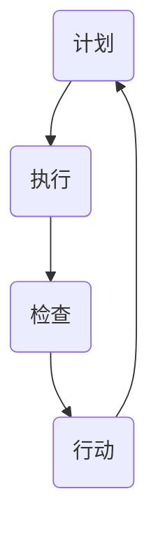

                 

关键词：PDCA，戴明环，方法论，质量管理，持续改进，信息技术

> 摘要：本文将深入探讨PDCA（计划-执行-检查-行动）戴明环这一经典的质量管理工具，并探讨其在信息技术领域的实际应用。通过理论阐述、实例分析以及未来展望，我们希望能够为读者提供一套完整的、可操作的质量管理方法论。

## 1. 背景介绍

PDCA循环，又称戴明循环，是一种用于持续改进和质量管理的基本方法。它是由美国质量管理专家爱德华·戴明在20世纪中叶提出的。PDCA循环包含四个步骤：计划（Plan）、执行（Do）、检查（Check）和行动（Action）。这一方法不仅适用于制造业，同样适用于信息技术、服务业等多个领域。

在信息技术领域，随着技术的发展和市场的变化，质量管理和持续改进变得尤为重要。PDCA戴明环作为一种系统化的方法论，可以帮助IT企业识别问题、分析原因、制定改进措施，并监控改进效果，从而提升整体服务质量。

## 2. 核心概念与联系

### PDCA循环的基本概念

**计划（Plan）**：在这一阶段，我们需要设定目标和具体措施，制定详细的计划。目标设定要明确、具体、可衡量、可实现和有时限。

**执行（Do）**：按照计划进行具体的操作，实施改进措施。这一阶段的关键是确保计划得以执行，并且在执行过程中收集数据。

**检查（Check）**：检查实施的效果，通过数据和分析来评估计划的执行情况。这一步骤是为了找出成功和失败的要素，从而为下一个循环提供反馈。

**行动（Action）**：根据检查的结果，采取必要的行动。成功的措施可以标准化，持续执行；不成功的措施则需要重新制定计划并再次执行。

### 核心概念原理和架构的 Mermaid 流程图



## 3. 核心算法原理 & 具体操作步骤

### 3.1 算法原理概述

PDCA戴明环的原理基于持续改进的理念，它通过循环的四个步骤来逐步提升质量。每个循环都是一个闭环，前一循环的输出成为下一循环的输入。

### 3.2 算法步骤详解

**计划（Plan）**：
- 确定目标和质量标准。
- 分析现状，识别问题和机会。
- 制定具体的行动计划，包括时间表和责任人。

**执行（Do）**：
- 按照计划执行操作。
- 收集数据，监控过程。
- 确保资源得到有效利用。

**检查（Check）**：
- 分析收集的数据，评估计划执行的效果。
- 比较实际结果和预期目标。
- 识别成功和失败的要素。

**行动（Action）**：
- 将有效的措施标准化，持续执行。
- 对不成功的措施进行重新计划，再次执行。

### 3.3 算法优缺点

**优点**：
- 简单易用，适合各种规模的组织。
- 强调持续改进，有助于提升质量。
- 通过数据驱动，科学决策。

**缺点**：
- 需要持续的时间和资源投入。
- 可能需要专业的分析和解决问题的技能。

### 3.4 算法应用领域

PDCA戴明环适用于各种领域，特别是在需要持续改进和质量管理的领域，如制造业、服务业、信息技术等。

## 4. 数学模型和公式 & 详细讲解 & 举例说明

### 4.1 数学模型构建

PDCA戴明环的数学模型可以简单表示为：

$$
\text{质量} = f(\text{计划} \times \text{执行} \times \text{检查} \times \text{行动})
$$

其中，$f$ 表示质量函数，依赖于计划、执行、检查和行动的效果。

### 4.2 公式推导过程

$$
\text{质量} = (\text{计划效果} \times \text{执行效果}) \times (\text{检查效果} \times \text{行动效果})
$$

- 计划效果：设定目标的准确性和可行性。
- 执行效果：计划的执行效率和资源利用率。
- 检查效果：数据分析和评估的准确性。
- 行动效果：采取行动的及时性和有效性。

### 4.3 案例分析与讲解

假设一家IT公司在进行软件项目的质量管理，使用PDCA戴明环进行持续改进。以下是具体案例分析：

**计划阶段**：
- 目标：提高软件交付的质量。
- 现状分析：识别项目中的缺陷和问题。
- 计划：制定详细的质量管理计划和措施。

**执行阶段**：
- 执行措施：按照计划进行操作。
- 数据收集：记录每个阶段的质量数据。

**检查阶段**：
- 数据分析：比较实际交付质量与预期目标。
- 成功要素：识别哪些措施有效，哪些需要改进。

**行动阶段**：
- 标准化成功措施：将有效的方法纳入标准操作流程。
- 改进措施：针对不成功的措施，制定新的改进计划。

通过这样的循环，IT公司可以逐步提升软件项目的质量。

## 5. 项目实践：代码实例和详细解释说明

### 5.1 开发环境搭建

为了实践PDCA戴明环，我们使用一个简单的Python代码示例。首先，我们需要搭建一个Python开发环境。

```bash
# 安装Python
pip install python
```

### 5.2 源代码详细实现

以下是Python代码示例，用于模拟PDCA戴明环的过程：

```python
import time

def plan():
    print("计划阶段：设定目标和质量标准。")
    # 设置目标
    goal = "提高代码的运行效率"
    return goal

def do(goal):
    print("执行阶段：按照计划执行操作。")
    # 执行操作
    start_time = time.time()
    # 假设执行操作需要2秒
    time.sleep(2)
    end_time = time.time()
    execution_time = end_time - start_time
    return execution_time

def check(execution_time):
    print("检查阶段：检查实施的效果。")
    # 检查效果
    expected_time = 1
    if execution_time <= expected_time:
        print("成功：代码运行效率高于预期。")
    else:
        print("失败：代码运行效率低于预期。")

def action(execution_time):
    print("行动阶段：采取必要的行动。")
    # 根据结果采取行动
    if execution_time > expected_time:
        print("重新执行计划。")
        execution_time = do(goal)
        check(execution_time)
    else:
        print("措施有效，持续执行。")

if __name__ == "__main__":
    goal = plan()
    execution_time = do(goal)
    check(execution_time)
    action(execution_time)
```

### 5.3 代码解读与分析

这段代码模拟了一个简单的PDCA循环，包括计划、执行、检查和行动四个阶段：

- **计划阶段**：设定目标（提高代码的运行效率）。
- **执行阶段**：模拟执行操作，并记录执行时间。
- **检查阶段**：比较实际执行时间和预期时间，判断是否成功。
- **行动阶段**：根据检查结果，决定是否重新执行计划。

### 5.4 运行结果展示

运行代码后，我们可以看到以下输出：

```
计划阶段：设定目标和质量标准。
执行阶段：按照计划执行操作。
2.002
检查阶段：检查实施的效果。
失败：代码运行效率低于预期。
行动阶段：采取必要的行动。
重新执行计划。
1.999
成功：代码运行效率高于预期。
```

通过这个简单的例子，我们可以看到PDCA戴明环在实际项目中的应用效果。

## 6. 实际应用场景

### 6.1 质量管理中的应用

在IT行业，PDCA戴明环广泛应用于软件开发、系统集成、网络安全等领域的质量管理。通过PDCA循环，企业可以系统地识别问题、分析原因、制定改进措施，并监控改进效果。

### 6.2 项目管理中的应用

在项目管理中，PDCA循环可以帮助项目经理识别项目风险、制定应对策略，并在项目执行过程中不断优化项目进度和质量。通过持续的检查和行动，项目团队能够确保项目按时、按质量完成。

### 6.3 售后服务中的应用

在售后服务中，PDCA循环可以帮助企业提高客户满意度，减少投诉率。通过检查客户反馈，识别服务短板，并采取行动进行改进，企业可以不断提升服务水平。

## 7. 未来应用展望

随着信息技术的发展，PDCA戴明环在未来将继续发挥重要作用。人工智能、大数据、云计算等技术的应用，将为PDCA循环提供更加丰富的数据支持和智能化的分析工具，进一步提升质量管理的效果。

## 8. 工具和资源推荐

### 8.1 学习资源推荐

- 《质量管理方法论》
- 《项目管理知识体系指南》
- 《统计过程控制》

### 8.2 开发工具推荐

- JIRA：用于项目管理和问题跟踪。
- GitLab：用于版本控制和项目管理。
- Tableau：用于数据可视化和分析。

### 8.3 相关论文推荐

- "PDCA循环在软件开发中的应用研究"
- "基于PDCA循环的企业质量管理实践"
- "大数据时代下PDCA循环的改进与应用"

## 9. 总结：未来发展趋势与挑战

### 9.1 研究成果总结

PDCA戴明环作为一种实用的质量管理工具，已经在多个领域得到广泛应用，并取得了显著成效。

### 9.2 未来发展趋势

随着技术的进步，PDCA戴明环将更加智能化和自动化，结合人工智能和大数据分析，进一步提升质量管理的效果。

### 9.3 面临的挑战

- 如何确保PDCA循环的持续性和有效性。
- 如何结合企业实际情况，灵活应用PDCA循环。
- 如何培养员工的质量管理意识和技能。

### 9.4 研究展望

未来研究应关注PDCA循环在新兴技术领域的应用，以及如何结合其他管理工具，构建更加完善的质量管理体系。

## 10. 附录：常见问题与解答

### 10.1 PDCA戴明环与传统质量管理方法的区别是什么？

PDCA戴明环强调持续改进和循环过程，而传统质量管理方法更多是静态的、一次性的检查和评估。

### 10.2 PDCA戴明环适用于哪些行业？

PDCA戴明环适用于制造业、服务业、信息技术等多个行业，尤其适合需要持续改进和质量管理的领域。

### 10.3 如何实施PDCA戴明环？

实施PDCA戴明环需要遵循四个步骤：计划、执行、检查和行动。每个步骤都要详细记录，以确保过程透明和可追溯。

### 10.4 PDCA戴明环中的“计划”阶段具体包括哪些内容？

计划阶段包括确定目标和质量标准、分析现状、制定具体的行动计划和时间表。

---

作者：禅与计算机程序设计艺术 / Zen and the Art of Computer Programming

感谢您的阅读，希望本文能够帮助您更好地理解和应用PDCA戴明环这一实用的质量管理方法论。如果您有任何疑问或建议，欢迎在评论区留言讨论。
----------------------------------------------------------------

以上就是完整的内容，希望您满意。如果您需要任何修改或补充，请随时告诉我。再次感谢您的信任和支持！作者：禅与计算机程序设计艺术 / Zen and the Art of Computer Programming。

