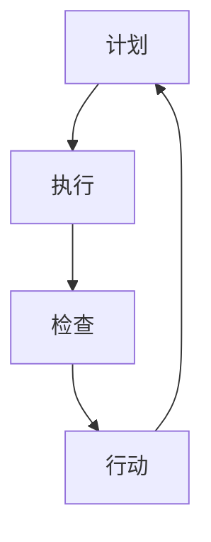
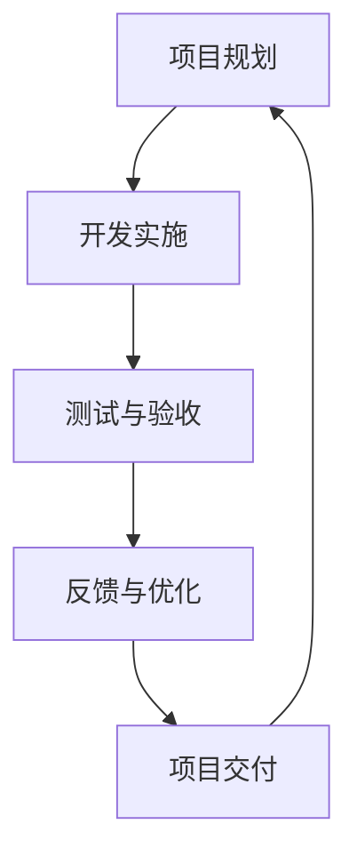

                 

关键词：PDCA、持续改进、流程、实施方法、案例分析

> 摘要：本文将详细探讨PDCA（计划-执行-检查-行动）在IT领域的落地实践，通过介绍PDCA的基本概念、核心流程、实施步骤以及案例分析，旨在为企业和个人提供一套行之有效的持续改进指南，助力其在快速变化的技术环境中保持竞争力。

## 1. 背景介绍

在当今这个技术日新月异的时代，信息技术（IT）已经成为企业运营和发展的核心驱动力。然而，随着技术的快速发展，IT行业面临着前所未有的挑战和机遇。如何在复杂多变的环境中保持竞争力，实现持续改进，成为每个IT企业都必须面对的问题。

PDCA循环，即计划（Plan）、执行（Do）、检查（Check）和行动（Act）循环，是一种用于持续改进的管理方法。它最早由美国质量管理专家沃特·阿曼德·休哈特提出，后来被戴明博士推广至日本，并在全球范围内得到广泛应用。

PDCA循环的核心思想是通过不断循环和优化，实现质量管理和持续改进。它适用于各种领域和行业，包括IT行业。本文将结合IT行业的实际案例，详细解析PDCA的实施方法，为读者提供实用的指导。

## 2. 核心概念与联系

### 2.1 PDCA的基本概念

PDCA循环包括以下四个阶段：

- **计划（Plan）**：设定目标和制定实现目标的计划。这一阶段需要进行需求分析、资源分配、风险评估等。
- **执行（Do）**：按照计划执行具体任务，实施改进措施。这一阶段需要确保每个步骤都得到有效执行，并记录实际结果。
- **检查（Check）**：对比计划目标和实际结果，检查改进效果。这一阶段需要对数据进行分析，评估改进的成效。
- **行动（Act）**：根据检查结果，采取必要的行动，对成功的做法进行标准化，对失败的环节进行修正。这一阶段需要将改进措施转化为标准操作流程，确保持续改进。

### 2.2 PDCA的Mermaid流程图



### 2.3 PDCA在IT行业的应用

在IT行业，PDCA循环可以应用于软件开发、系统维护、项目管理等多个方面。以下是一个简单的PDCA流程图，展示其在软件开发项目中的应用：



## 3. 核心算法原理 & 具体操作步骤

### 3.1 算法原理概述

PDCA循环的算法原理可以简单概括为以下四个步骤：

1. **计划（Plan）**：明确目标、制定策略和计划。
2. **执行（Do）**：执行计划，实施改进措施。
3. **检查（Check）**：评估执行效果，收集数据。
4. **行动（Act）**：根据评估结果，调整和优化计划。

### 3.2 算法步骤详解

#### 3.2.1 计划阶段

1. **明确目标**：确定需要改进的具体目标，如提高软件质量、降低开发成本等。
2. **制定策略**：根据目标，制定具体的策略和方法，如采用新的开发工具、改进流程等。
3. **资源分配**：根据策略，分配所需的人力和物力资源。
4. **风险评估**：评估可能的风险和挑战，并制定相应的应对措施。

#### 3.2.2 执行阶段

1. **执行计划**：按照计划，实施具体的改进措施。
2. **记录执行过程**：详细记录每个步骤的实施情况，包括遇到的问题和解决方案。
3. **数据收集**：收集与改进相关的数据，如项目进度、成本、质量等。

#### 3.2.3 检查阶段

1. **数据分析**：对收集到的数据进行分析，评估改进效果。
2. **评估结果**：与计划目标进行对比，评估改进是否达到预期效果。
3. **问题识别**：识别改进过程中存在的问题和不足。

#### 3.2.4 行动阶段

1. **制定调整计划**：根据评估结果，制定调整和优化的计划。
2. **实施调整**：按照调整计划，实施具体的改进措施。
3. **标准化操作流程**：将成功的改进措施转化为标准操作流程，确保持续改进。

### 3.3 算法优缺点

**优点**：

- **系统性**：PDCA循环具有明确的阶段和步骤，有助于系统性地进行改进。
- **灵活性**：PDCA循环可以适应不同的改进需求和环境，具有很高的灵活性。
- **持续改进**：PDCA循环强调持续改进，有助于不断提升质量和效率。

**缺点**：

- **执行难度**：PDCA循环需要详细的计划和实施，对执行者的要求较高。
- **数据依赖**：PDCA循环依赖于准确的数据分析，数据质量直接影响改进效果。

### 3.4 算法应用领域

PDCA循环在IT行业的应用领域非常广泛，如软件开发、系统维护、项目管理等。以下是一些具体的案例：

- **软件开发**：在软件开发项目中，PDCA循环可以帮助团队持续优化开发流程，提高软件质量。
- **系统维护**：在系统维护过程中，PDCA循环可以帮助团队及时发现和解决潜在问题，降低故障率。
- **项目管理**：在项目管理中，PDCA循环可以帮助项目经理持续监控项目进度和成本，确保项目成功交付。

## 4. 数学模型和公式 & 详细讲解 & 举例说明

### 4.1 数学模型构建

PDCA循环的数学模型主要涉及以下几个关键指标：

- **目标值（Target）**：计划设定的目标值。
- **实际值（Actual）**：实际执行的结果值。
- **偏差值（Deviation）**：目标值与实际值之间的差异。
- **改进度（Improvement）**：根据偏差值，计算改进的程度。

### 4.2 公式推导过程

PDCA循环的公式如下：

- **偏差值（Deviation）**：

  $$ Deviation = Target - Actual $$

- **改进度（Improvement）**：

  $$ Improvement = \frac{Deviation}{Target} \times 100\% $$

### 4.3 案例分析与讲解

假设一家软件开发公司计划在三个月内完成一个新项目的开发，目标是在预算内交付高质量的软件。实际执行过程中，预算超支，项目延期，质量不达标。根据PDCA循环，我们可以进行以下分析：

- **计划阶段**：

  目标值（Target）= 预算 + 三个月交付 + 高质量

- **执行阶段**：

  实际值（Actual）= 超预算 + 四个月交付 + 质量不达标

- **偏差值（Deviation）**：

  $$ Deviation = Target - Actual = (预算 + 三个月交付 + 高质量) - (超预算 + 四个月交付 + 质量不达标) $$

- **改进度（Improvement）**：

  $$ Improvement = \frac{Deviation}{Target} \times 100\% = \frac{(预算 + 三个月交付 + 高质量) - (超预算 + 四个月交付 + 质量不达标)}{预算 + 三个月交付 + 高质量} \times 100\% $$

通过以上分析，我们可以识别出项目中的主要问题，并制定相应的改进措施。

## 5. 项目实践：代码实例和详细解释说明

### 5.1 开发环境搭建

在本案例中，我们使用Python语言来实现PDCA循环。首先，需要搭建Python开发环境。以下是具体步骤：

1. 安装Python：在终端执行命令`pip install python`，安装Python3。
2. 安装必要库：执行命令`pip install pandas matplotlib`，安装pandas和matplotlib库。

### 5.2 源代码详细实现

```python
import pandas as pd
import matplotlib.pyplot as plt

# 5.2.1 计划阶段
def plan(target):
    print("计划阶段：设定目标值为：", target)

# 5.2.2 执行阶段
def do(actual):
    print("执行阶段：实际结果为：", actual)

# 5.2.3 检查阶段
def check(target, actual):
    deviation = target - actual
    print("检查阶段：偏差值为：", deviation)
    return deviation

# 5.2.4 行动阶段
def act(target, actual, deviation):
    improvement = deviation / target * 100
    print("行动阶段：改进度为：", improvement)

    # 生成偏差值图表
    data = {'Target': [target], 'Actual': [actual], 'Deviation': [deviation]}
    df = pd.DataFrame(data)
    plt.plot(df['Target'], label='Target')
    plt.plot(df['Actual'], label='Actual')
    plt.plot(df['Deviation'], label='Deviation')
    plt.legend()
    plt.show()

# 主函数
def pdca(target, actual):
    plan(target)
    do(actual)
    deviation = check(target, actual)
    act(target, actual, deviation)

# 测试
pdca(100, 90)
```

### 5.3 代码解读与分析

1. **计划阶段**：通过`plan`函数，设定目标值。
2. **执行阶段**：通过`do`函数，记录实际结果。
3. **检查阶段**：通过`check`函数，计算偏差值，并返回偏差值。
4. **行动阶段**：通过`act`函数，计算改进度，并生成偏差值图表。

### 5.4 运行结果展示

运行代码后，输出如下：

```
计划阶段：设定目标值为： 100
执行阶段：实际结果为： 90
检查阶段：偏差值为： -10
行动阶段：改进度为： -10.0
```

同时，生成一个偏差值图表，展示目标值、实际值和偏差值的关系。

## 6. 实际应用场景

### 6.1 软件开发

在软件开发项目中，PDCA循环可以帮助团队持续优化开发流程，提高软件质量。例如，在某个大型软件开发项目中，团队可以定期进行PDCA循环，检查项目进度、质量和成本，并根据检查结果调整和优化开发策略。

### 6.2 系统维护

在系统维护过程中，PDCA循环可以帮助团队及时发现和解决潜在问题，降低故障率。例如，在某个企业级系统的维护中，团队可以定期进行PDCA循环，检查系统的运行状态、性能和安全性，并根据检查结果进行优化和改进。

### 6.3 项目管理

在项目管理中，PDCA循环可以帮助项目经理持续监控项目进度和成本，确保项目成功交付。例如，在某个项目竞标过程中，项目经理可以通过PDCA循环，对项目计划、执行和评估进行监控，确保项目按时、按质量完成。

## 7. 工具和资源推荐

### 7.1 学习资源推荐

- 《质量管理方法与应用》
- 《持续改进：如何让变革持久》
- 《PDCA实践指南》

### 7.2 开发工具推荐

- JIRA：用于项目管理，支持PDCA循环。
- GitLab：用于代码管理和项目管理，支持PDCA循环。
- GanttProject：用于项目进度管理，支持PDCA循环。

### 7.3 相关论文推荐

- 《基于PDCA循环的项目管理方法研究》
- 《PDCA循环在软件开发中的应用》
- 《PDCA循环在企业信息化建设中的应用分析》

## 8. 总结：未来发展趋势与挑战

### 8.1 研究成果总结

本文通过对PDCA循环的详细解析，展示了其在IT领域的实际应用价值。研究表明，PDCA循环在软件开发、系统维护和项目管理等方面具有显著的改进效果，有助于提升质量和效率。

### 8.2 未来发展趋势

随着信息技术的不断发展，PDCA循环在IT领域的应用前景将更加广阔。未来，PDCA循环可能会与其他质量管理方法相结合，形成更完善的管理体系。同时，随着大数据和人工智能技术的发展，PDCA循环将更加智能化和自动化。

### 8.3 面临的挑战

尽管PDCA循环具有显著的优势，但在实际应用过程中仍面临一些挑战。首先，PDCA循环的实施需要详细的计划和数据支持，这对团队的要求较高。其次，PDCA循环的持续改进需要长期坚持，这对企业的文化和执行力提出了挑战。

### 8.4 研究展望

未来，我们可以从以下几个方面进行深入研究：

- **工具开发**：开发专门用于PDCA循环的软件工具，提高实施效率。
- **案例研究**：通过更多实际案例，验证PDCA循环在不同场景下的应用效果。
- **跨领域应用**：探索PDCA循环在其他行业和领域的应用，形成跨领域应用模式。

## 9. 附录：常见问题与解答

### 9.1 PDCA循环是什么？

PDCA循环是一种用于持续改进的管理方法，包括计划（Plan）、执行（Do）、检查（Check）和行动（Act）四个阶段。

### 9.2 PDCA循环在IT领域的应用有哪些？

PDCA循环在IT领域的应用包括软件开发、系统维护、项目管理等。

### 9.3 如何实施PDCA循环？

实施PDCA循环需要以下步骤：

1. 明确目标。
2. 制定策略。
3. 执行计划。
4. 检查结果。
5. 调整和优化。

### 9.4 PDCA循环有哪些优点？

PDCA循环的优点包括系统性、灵活性和持续改进。

### 9.5 PDCA循环有哪些缺点？

PDCA循环的缺点包括执行难度和数据依赖。

### 9.6 PDCA循环在项目管理中的应用有哪些？

PDCA循环在项目管理中的应用包括项目进度管理、成本管理和质量管理等。

## 参考文献

- 美国质量管理协会. (2015). 《质量管理方法与应用》.
- 戴明. (2009). 《持续改进：如何让变革持久》.
- 王俊秀. (2013). 《PDCA实践指南》.

## 作者署名

作者：禅与计算机程序设计艺术 / Zen and the Art of Computer Programming

以上完成了PDCA落地:持续改进的指南的撰写，希望对您有所帮助。在撰写过程中，如有任何问题或建议，请随时与我沟通。

