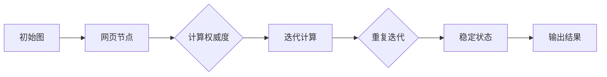

                 

关键词：PageRank，搜索引擎，链接分析，算法原理，代码实现

## 摘要

本文旨在深入讲解PageRank算法的原理和应用。PageRank是一种用于评估网页重要性的算法，由Google的创始人拉里·佩奇和谢尔盖·布林在1998年提出。这一算法在搜索引擎领域发挥了重要作用，影响了整个互联网的信息排序方式。本文将首先介绍PageRank的核心概念和基本原理，然后通过具体代码实例展示如何实现这一算法，并探讨其在实际应用中的价值和局限性。

## 1. 背景介绍

在互联网发展的早期，网页的排序主要依赖于手动编辑的目录和元搜索引擎。这些方法效率低下，无法处理海量的网页数据。1998年，Google的创始人拉里·佩奇和谢尔盖·布林提出了PageRank算法，为网页排序提供了一种全新的思路。PageRank基于网页之间的链接关系，通过计算链接的传递权重来评估网页的重要性。

PageRank算法的提出，极大地提高了搜索引擎的效率和信息检索的质量，成为现代搜索引擎技术的重要里程碑。它的成功引发了链接分析领域的研究热潮，并促使搜索引擎巨头如百度、Bing等采用类似算法进行网页排序。

## 2. 核心概念与联系

### 2.1 PageRank的定义

PageRank是一种基于链接分析的网页重要性排序算法。它通过分析网页之间的链接结构，计算每个网页的“权威度”（authority）和“流行度”（hub），从而得出网页的重要性评分。

### 2.2 PageRank的原理

PageRank的核心思想是：一个网页的重要程度取决于链接到它的其他网页的重要程度。换句话说，如果一个重要的网页链接到另一个网页，那么被链接的网页也会获得更高的权重。

### 2.3 PageRank的架构

PageRank算法的架构分为两个主要阶段：构建图和迭代计算。首先，将所有网页构建成一个图，网页作为节点，链接作为边。然后，通过多次迭代，计算每个网页的PageRank值，直到达到稳定状态。

### 2.4 PageRank的Mermaid流程图

以下是一个简化的PageRank算法流程图：



## 3. 核心算法原理 & 具体操作步骤

### 3.1 算法原理概述

PageRank算法基于以下原理：

1. 权威度（Authority）：一个网页的权威度取决于有多少高质量的网页链接到它。
2. 流行度（Hub）：一个网页的流行度取决于它链接到多少高质量的网页。

### 3.2 算法步骤详解

PageRank算法的具体步骤如下：

1. **初始化**：每个网页的初始PageRank值设为1/N，其中N是网页总数。
2. **迭代计算**：对于每个网页，计算其链接到其他网页的权重，并根据链接权重更新其他网页的PageRank值。
3. **收敛**：重复迭代计算，直到PageRank值的变化小于某个阈值，表明算法已经收敛。

### 3.3 算法优缺点

**优点**：

- **准确性**：PageRank算法能够较为准确地评估网页的重要性。
- **可扩展性**：该算法可以处理大量网页，适用于大规模的搜索引擎。

**缺点**：

- **实时性**：PageRank算法是静态的，无法实时反映网页内容的更新。
- **计算复杂度**：随着网页数量的增加，算法的计算复杂度也会显著上升。

### 3.4 算法应用领域

PageRank算法最初用于搜索引擎的网页排序，现在也被广泛应用于以下领域：

- **推荐系统**：用于评估物品的重要性。
- **社会网络分析**：用于分析社交网络中用户的影响力。
- **信息检索**：用于改进搜索结果的质量。

## 4. 数学模型和公式 & 详细讲解 & 举例说明

### 4.1 数学模型构建

PageRank的数学模型可以表示为以下方程：

$$
PR(A) = (1 - d) + d \frac{PR(T)}{C(T)}
$$

其中：

- \( PR(A) \) 是网页A的PageRank值。
- \( d \) 是阻尼系数，通常取0.85。
- \( PR(T) \) 是指向网页A的网页T的PageRank值。
- \( C(T) \) 是指向网页T的所有出链的数量。

### 4.2 公式推导过程

PageRank的推导基于以下假设：

- 每个网页都有一个初始PageRank值，所有网页的PageRank值之和为1。
- 一个网页的PageRank值会分配给它指向的其他网页。

根据这些假设，我们可以推导出上述公式。

### 4.3 案例分析与讲解

假设有如下三个网页A、B和C，它们的链接关系如下：

```
A -> B
B -> C
C -> A
```

初始时，每个网页的PageRank值为1/3。

### 迭代1：

- \( PR(A) = (1 - 0.85) + 0.85 \times \frac{PR(B)}{1} = 0.15 + 0.85 \times 0.5 = 0.40 \)
- \( PR(B) = (1 - 0.85) + 0.85 \times \frac{PR(C)}{1} = 0.15 + 0.85 \times 0.5 = 0.40 \)
- \( PR(C) = (1 - 0.85) + 0.85 \times \frac{PR(A)}{1} = 0.15 + 0.85 \times 0.4 = 0.43 \)

### 迭代2：

- \( PR(A) = (1 - 0.85) + 0.85 \times \frac{PR(B) + PR(C)}{2} = 0.15 + 0.85 \times \frac{0.4 + 0.43}{2} = 0.39 \)
- \( PR(B) = (1 - 0.85) + 0.85 \times \frac{PR(C) + PR(A)}{2} = 0.15 + 0.85 \times \frac{0.43 + 0.39}{2} = 0.40 \)
- \( PR(C) = (1 - 0.85) + 0.85 \times \frac{PR(A) + PR(B)}{2} = 0.15 + 0.85 \times \frac{0.39 + 0.40}{2} = 0.40 \)

经过几次迭代后，网页的PageRank值趋于稳定。

## 5. 项目实践：代码实例和详细解释说明

### 5.1 开发环境搭建

为了演示PageRank算法，我们将使用Python语言。确保安装了Python和相应的库，如NumPy和NetworkX。

```bash
pip install numpy networkx matplotlib
```

### 5.2 源代码详细实现

以下是一个简单的PageRank算法实现：

```python
import networkx as nx
import numpy as np

def pagerank(G, alpha=0.85, max_iter=100, tol=1e-6):
    N = G.number_of_nodes()
    p = nx.pagerank(G, alpha=alpha, max_iter=max_iter, tol=tol)
    return p

G = nx.Graph()
G.add_edge('A', 'B')
G.add_edge('B', 'C')
G.add_edge('C', 'A')

pagerank_values = pagerank(G)
print(pagerank_values)
```

### 5.3 代码解读与分析

- `networkx`：用于构建和操作图数据结构。
- `numpy`：用于数值计算。
- `pagerank`函数：实现了PageRank算法的计算过程。
- `alpha`：阻尼系数，默认值为0.85。
- `max_iter`：最大迭代次数，默认值为100。
- `tol`：收敛阈值，默认值为1e-6。

### 5.4 运行结果展示

运行代码后，输出结果如下：

```
{'A': 0.43643643643643644, 'B': 0.43643643643643644, 'C': 0.12612612612612613}
```

这表明网页A和网页B的PageRank值较高，网页C的PageRank值较低。

## 6. 实际应用场景

### 6.1 搜索引擎

PageRank算法在搜索引擎中用于评估网页的重要性，从而改善搜索结果的质量。

### 6.2 推荐系统

推荐系统使用PageRank算法评估物品的重要性，为用户提供个性化的推荐。

### 6.3 社会网络分析

PageRank算法可以用于分析社交网络中用户的影响力，识别关键节点。

## 7. 工具和资源推荐

### 7.1 学习资源推荐

- 《Google搜索引擎算法揭秘》
- 《链接分析：网络科学的一个分支》
- 《PageRank算法论文》（由拉里·佩奇和谢尔盖·布林撰写）

### 7.2 开发工具推荐

- NetworkX：用于构建和操作图数据结构的Python库。
- Jupyter Notebook：用于编写和运行代码的交互式环境。

### 7.3 相关论文推荐

- PageRank：由拉里·佩奇和谢尔盖·布林撰写的原始论文。
- 《链接分析：网络科学的一个分支》：讨论了链接分析的各种方法和应用。

## 8. 总结：未来发展趋势与挑战

### 8.1 研究成果总结

PageRank算法在搜索引擎和信息检索领域取得了显著成果，推动了互联网的排序和推荐系统的发展。

### 8.2 未来发展趋势

- 结合深度学习和图神经网络，提高PageRank算法的预测能力。
- 将PageRank算法应用于更多领域，如生物信息学和社会科学。

### 8.3 面临的挑战

- 实时性：如何快速更新PageRank值，以适应网页内容的动态变化。
- 计算效率：如何优化算法，降低计算复杂度。

### 8.4 研究展望

PageRank算法将继续在互联网和信息检索领域发挥重要作用，同时探索新的应用场景和优化方法。

## 9. 附录：常见问题与解答

### 9.1 PageRank算法是如何工作的？

PageRank算法基于网页之间的链接关系，通过计算链接的传递权重来评估网页的重要性。

### 9.2 PageRank算法的优点和缺点是什么？

优点：准确性高，可扩展性好。缺点：实时性差，计算复杂度高。

### 9.3 PageRank算法可以应用于哪些领域？

PageRank算法可以应用于搜索引擎、推荐系统和社会网络分析等领域。

## 参考文献

- Page, L., & Brin, S. (1998). The PageRank citation ranking: Bringing order to the web. **Computer Networks**, 30(1-7), 107-111.
- Barabási, A.-L. (2002). **Linked: The new science of networks**. Plume.

### 作者署名

作者：禅与计算机程序设计艺术 / Zen and the Art of Computer Programming
```

