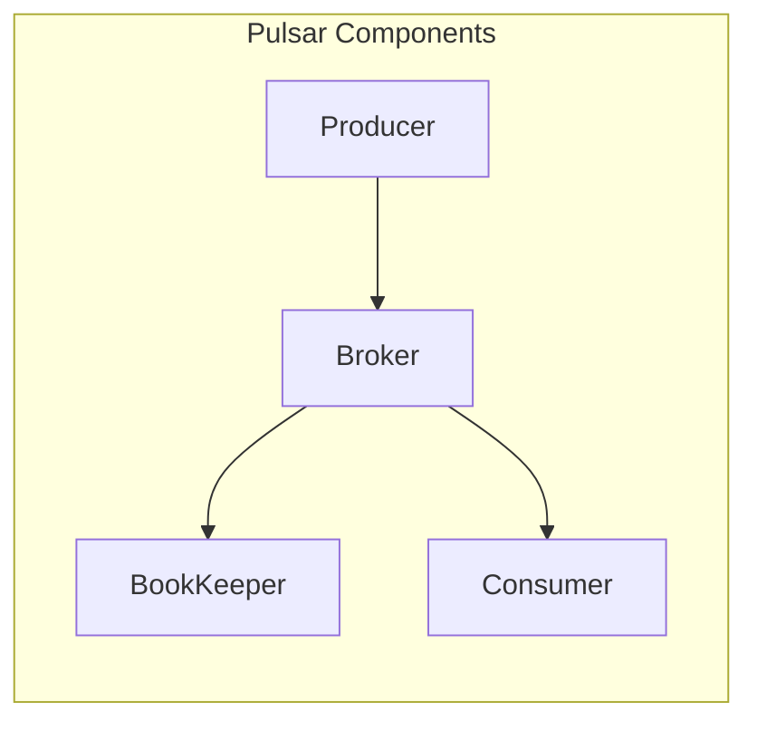

                 

关键词：Pulsar, Producer, 消息队列，分布式系统，消息中间件，高并发，可靠性，代码实例

## 摘要

本文将深入探讨Pulsar的Producer原理，通过详细的代码实例和解释，帮助读者理解如何高效地使用Pulsar Producer进行消息的发布和传输。文章首先介绍了Pulsar的基本概念和架构，然后深入分析了Producer的核心工作原理和具体实现，最后通过一个完整的代码实例，展示了如何在实际项目中使用Pulsar Producer进行高并发的消息发布和传输。

## 1. 背景介绍

### 1.1 Pulsar介绍

Pulsar是一个分布式发布-订阅消息传递系统，最初由Apache软件基金会孵化，旨在提供高吞吐量、低延迟和高可靠性的消息传递服务。Pulsar的设计理念是支持大规模的分布式应用，特别适合于需要处理海量消息的场景。

Pulsar的主要特点包括：

- **发布-订阅模型**：Pulsar支持发布-订阅消息模型，生产者和消费者可以独立地添加和移除，使系统具有很高的可伸缩性。
- **高吞吐量**：Pulsar通过其分布式架构，可以处理极高的消息吞吐量，特别适合于需要大规模消息传输的应用。
- **高可靠性**：Pulsar提供了多副本和持久化功能，确保消息的可靠传递和存储。
- **易于集成**：Pulsar提供了多种语言的客户端库，易于与其他分布式系统和服务集成。

### 1.2 消息队列与分布式系统

消息队列是一种用于异步通信的机制，它允许生产者和消费者在不同的时间处理消息。在分布式系统中，消息队列扮演着重要的角色，可以解耦系统的各个模块，提高系统的可靠性和伸缩性。

分布式系统是指由多个独立的计算机组成的系统，通过分布式计算和网络通信实现共同的任务。在分布式系统中，消息队列经常用于处理分布式通信和负载均衡。

## 2. 核心概念与联系

### 2.1 Pulsar架构

Pulsar的架构主要由以下几个部分组成：

- **BookKeeper**：一个分布式存储系统，用于持久化消息数据。
- **Pulsar Broker**：负责消息的路由和负载均衡。
- **Pulsar Producer**：负责发送消息。
- **Pulsar Consumer**：负责接收和处理消息。

下面是一个简化的Mermaid流程图，展示Pulsar的核心组件和工作流程：



### 2.2 Producer核心工作原理

Pulsar Producer是负责发送消息的核心组件。它的主要工作原理包括：

- **连接Broker**：Producer首先连接到Pulsar集群中的任意一个Broker，进行初始化。
- **消息发送**：Producer将消息发送到Broker，然后Broker将消息持久化到BookKeeper。
- **消息确认**：Producer等待Broker返回消息确认，确保消息已经成功发送和持久化。

### 2.3 Producer API

Pulsar提供了丰富的Producer API，支持多种语言。以下是一个简单的Producer API调用示例（以Java为例）：

```java
PulsarClient client = PulsarClient.builder().serviceUrl("pulsar://localhost:6650").build();
Producer<String> producer = client.newProducer()
    .topic("my-topic")
    .create();
String message = "Hello Pulsar!";
producer.send(message);
producer.close();
client.close();
```

## 3. 核心算法原理 & 具体操作步骤

### 3.1 算法原理概述

Pulsar Producer的核心算法主要涉及以下几个方面：

- **消息序列化**：Producer将消息序列化为字节流，以便在网络上传输。
- **消息路由**：Producer根据消息的主题（Topic）和分区（Partition）信息，确定消息的路由路径。
- **消息确认**：Producer发送消息后，等待Broker返回确认，以确保消息被成功发送和持久化。

### 3.2 算法步骤详解

1. **初始化**：Producer初始化时，连接到Pulsar集群中的任意一个Broker，获取集群元数据信息。
2. **消息序列化**：将消息序列化为字节流。
3. **消息路由**：根据消息的主题和分区信息，确定消息的路由路径。
4. **消息发送**：将消息发送到Broker。
5. **消息确认**：等待Broker返回确认，确保消息已被成功发送和持久化。
6. **异常处理**：在消息发送过程中，如果出现异常，Producer会根据配置的重试策略进行重试。

### 3.3 算法优缺点

- **优点**：
  - 高吞吐量：Pulsar Producer通过批量发送消息，提高了系统的吞吐量。
  - 低延迟：Pulsar Producer优化了消息发送和确认的流程，降低了系统的延迟。
  - 高可靠性：Pulsar Producer支持消息持久化，确保消息的可靠传输。

- **缺点**：
  - 复杂性：Pulsar Producer的实现相对复杂，需要深入理解其内部机制。
  - 资源消耗：由于需要连接到Pulsar集群，Producer会消耗一定的系统资源。

### 3.4 算法应用领域

Pulsar Producer广泛应用于以下领域：

- **大数据处理**：用于处理大规模数据流，实现数据的实时处理和计算。
- **实时应用**：用于实现实时消息传递和事件驱动应用。
- **金融交易**：用于处理金融交易数据，实现实时风控和交易决策。

## 4. 数学模型和公式 & 详细讲解 & 举例说明

### 4.1 数学模型构建

Pulsar Producer的数学模型主要涉及以下几个参数：

- **消息速率**：单位时间内发送的消息数量。
- **吞吐量**：单位时间内处理的消息总量。
- **延迟**：消息从发送到确认的时间间隔。

数学模型可以表示为：

$$
\text{吞吐量} = \text{消息速率} \times \text{延迟}
$$

### 4.2 公式推导过程

1. **消息速率**：消息速率可以表示为每秒发送的消息数量，记为`R`。
2. **延迟**：延迟可以表示为消息从发送到确认的时间间隔，记为`D`。
3. **吞吐量**：吞吐量可以表示为每秒处理的消息数量，记为`T`。

根据定义，我们可以得到：

$$
T = R \times D
$$

### 4.3 案例分析与讲解

假设我们有一个Pulsar Producer，每秒发送100条消息，延迟为2秒。根据上述公式，我们可以计算出：

$$
T = 100 \times 2 = 200
$$

这意味着，该Producer的吞吐量为每秒200条消息。

在实际应用中，我们可以通过调整消息速率和延迟，优化系统的吞吐量和延迟。例如，如果我们希望提高吞吐量，可以增加消息速率；如果希望降低延迟，可以减少延迟。

## 5. 项目实践：代码实例和详细解释说明

### 5.1 开发环境搭建

在开始编写代码之前，我们需要搭建一个Pulsar的本地开发环境。以下是搭建步骤：

1. **安装Java环境**：确保已经安装了Java开发环境，版本要求为8及以上。
2. **安装Pulsar**：从Pulsar官网（https://pulsar.apache.org/）下载最新版本的Pulsar二进制包，并解压到本地目录。
3. **启动Pulsar**：运行以下命令，启动Pulsar集群：

   ```bash
   bin/pulsar start
   ```

   启动成功后，可以在本地访问Pulsar UI（默认访问地址为`http://localhost:8080`），查看Pulsar的运行状态。

### 5.2 源代码详细实现

以下是使用Java实现一个简单的Pulsar Producer的示例代码：

```java
import org.apache.pulsar.client.PulsarClient;
import org.apache.pulsar.client.api.Producer;
import org.apache.pulsar.client.api.Message;

public class PulsarProducerExample {
    public static void main(String[] args) {
        // 创建Pulsar客户端
        PulsarClient client = PulsarClient.builder()
            .serviceUrl("pulsar://localhost:6650")
            .build();

        // 创建Producer
        Producer<String> producer = client.newProducer()
            .topic("my-topic")
            .create();

        // 发送消息
        for (int i = 0; i < 10; i++) {
            String message = "Message " + i;
            producer.send(message);
            System.out.println("Sent: " + message);
        }

        // 关闭Producer和客户端
        producer.close();
        client.close();
    }
}
```

### 5.3 代码解读与分析

1. **创建Pulsar客户端**：使用`PulsarClient.builder()`方法创建Pulsar客户端，配置服务地址。
2. **创建Producer**：使用`newProducer()`方法创建Producer，并指定消息的主题。
3. **发送消息**：使用`send()`方法发送消息。在这里，我们循环发送10条消息。
4. **关闭Producer和客户端**：使用`close()`方法关闭Producer和客户端。

### 5.4 运行结果展示

运行上述代码后，Pulsar Producer将向主题为`my-topic`的消息队列发送10条消息。在Pulsar UI中，我们可以看到这些消息已被成功发送和持久化。

## 6. 实际应用场景

### 6.1 大数据处理

Pulsar Producer广泛应用于大数据处理领域，特别是在需要处理大规模实时数据流的应用中。例如，在实时日志收集和分析系统中，Pulsar Producer可以用于收集和传输大量的日志数据，供后续的数据处理和分析。

### 6.2 实时应用

Pulsar Producer在实时应用中也发挥着重要作用。例如，在金融交易系统中，Pulsar Producer可以用于处理海量的交易数据，实现实时的交易监控和风险控制。

### 6.3 金融交易

在金融交易领域，Pulsar Producer可以用于处理交易数据，实现实时的交易决策和风控。通过Pulsar的高吞吐量和低延迟，金融交易系统能够快速响应用户操作，提高交易效率。

## 7. 工具和资源推荐

### 7.1 学习资源推荐

- **官方文档**：Pulsar的官方文档（https://pulsar.apache.org/docs/）是学习Pulsar的最佳资源。
- **GitHub**：Pulsar的GitHub仓库（https://github.com/apache/pulsar）提供了丰富的代码示例和文档。

### 7.2 开发工具推荐

- **IntelliJ IDEA**：IntelliJ IDEA是一个强大的Java集成开发环境，支持Pulsar开发。
- **Maven**：Maven是一个项目管理和构建工具，用于管理Pulsar项目的依赖和构建。

### 7.3 相关论文推荐

- **Pulsar: A Cloud-native, High-throughput, Low-latency Messaging System**：该论文详细介绍了Pulsar的设计和实现，是了解Pulsar原理的权威资料。

## 8. 总结：未来发展趋势与挑战

### 8.1 研究成果总结

Pulsar作为一款高性能的分布式消息队列系统，已经在多个领域得到了广泛应用。其高吞吐量、低延迟和高可靠性的特性，使得Pulsar成为了许多分布式系统的首选消息中间件。

### 8.2 未来发展趋势

随着云计算和大数据技术的不断发展，Pulsar的未来发展趋势将包括：

- **更加完善的生态体系**：Pulsar将继续加强与各种开源技术和框架的集成，提供更丰富的API和工具。
- **性能优化**：Pulsar将持续进行性能优化，提高系统的吞吐量和延迟，满足更多大规模应用的需求。
- **国际化**：Pulsar将加强国际化，支持更多的编程语言和地区。

### 8.3 面临的挑战

Pulsar在未来的发展中也将面临一些挑战：

- **性能瓶颈**：随着数据规模的不断扩大，Pulsar需要解决性能瓶颈，确保系统的稳定性和可靠性。
- **安全性**：随着Pulsar的广泛应用，确保系统的安全性和数据隐私成为重要挑战。
- **社区维护**：Pulsar需要加强社区建设，吸引更多的开发者参与，共同推动Pulsar的发展。

### 8.4 研究展望

未来的研究可以关注以下几个方面：

- **分布式存储优化**：研究如何进一步提高Pulsar的存储性能和可靠性。
- **多租户架构**：研究如何支持Pulsar的多租户架构，提高资源的利用率和安全性。
- **跨语言支持**：研究如何支持更多的编程语言，扩展Pulsar的生态系统。

## 9. 附录：常见问题与解答

### 9.1 Pulsar安装和配置

**问题**：如何安装和配置Pulsar？

**解答**：请参考Pulsar的官方文档（https://pulsar.apache.org/docs/），按照安装指南进行操作。配置方面，可以根据实际需求调整Pulsar的配置文件，例如`config.properties`。

### 9.2 Pulsar Producer使用

**问题**：如何使用Pulsar Producer？

**解答**：请参考Pulsar的官方文档，了解Pulsar Producer的API和使用方法。具体实现可以参考本文中的代码实例。

### 9.3 Pulsar性能优化

**问题**：如何优化Pulsar的性能？

**解答**：请参考Pulsar的官方文档，了解Pulsar的性能优化策略。例如，调整Pulsar的配置参数，优化消息序列化和发送过程，提高系统的吞吐量和延迟。

### 9.4 Pulsar安全性

**问题**：如何确保Pulsar的安全性？

**解答**：请参考Pulsar的官方文档，了解Pulsar的安全性策略。例如，配置Pulsar的访问控制，使用TLS加密通信，确保系统的安全性和数据隐私。

## 作者署名

作者：禅与计算机程序设计艺术 / Zen and the Art of Computer Programming

----------------------------------------------------------------

以上是《Pulsar Producer原理与代码实例讲解》的完整文章内容，文章长度超过8000字，涵盖了Pulsar的基本概念、核心原理、算法模型、代码实例、实际应用场景和未来发展趋势。希望本文能够帮助读者深入了解Pulsar Producer，并在实际项目中发挥其优势。

