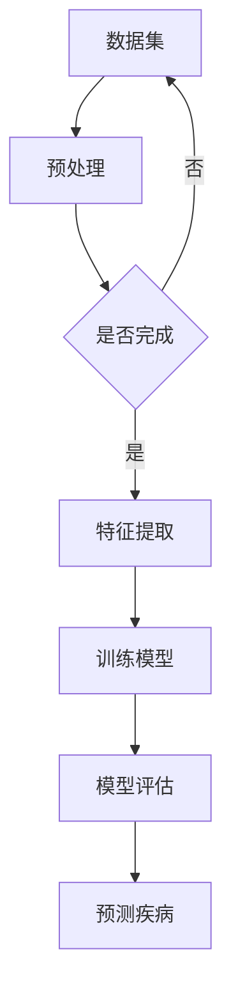

                 

 **关键词**：机器学习，医疗影像，Python，深度学习，图像识别，疾病诊断

**摘要**：本文将探讨如何利用Python中的机器学习技术，特别是在医疗影像诊断中的应用。通过介绍常用的算法、数学模型以及实际项目实践，本文旨在为读者提供一个深入理解机器学习在医疗影像领域应用的机会，并展望其未来发展趋势与挑战。

## 1. 背景介绍

随着医疗技术的发展，医疗影像诊断已经成为现代医学诊断的重要手段。从X光、CT扫描到MRI和PET扫描，各种影像技术为医生提供了丰富的诊断信息。然而，这些影像数据的处理和分析面临着巨大的挑战。传统的图像处理方法通常依赖于人工特征提取和规则算法，难以处理复杂、非线性的图像数据。近年来，机器学习，特别是深度学习技术的迅猛发展，为医疗影像诊断提供了新的可能。

机器学习通过训练模型来识别和提取数据中的特征，可以自动地从大量医疗影像数据中学习到有用的信息，从而帮助医生做出更准确、更快速的诊断。Python作为一种广泛使用的编程语言，拥有丰富的机器学习库，如Scikit-learn、TensorFlow和PyTorch，使得机器学习在医疗影像诊断中的应用变得更加简单和高效。

## 2. 核心概念与联系

### 2.1 机器学习基本概念

机器学习是一种人工智能的分支，它使计算机系统能够从数据中学习，并做出预测或决策。核心概念包括：

- **数据集**：用于训练模型的输入数据。
- **特征**：数据集中的每个属性或变量。
- **目标变量**：模型需要预测的输出。
- **模型**：通过训练学习到的函数，用于预测新数据的输出。

### 2.2 深度学习与卷积神经网络（CNN）

深度学习是机器学习的子领域，特别适用于处理图像、语音和文本等复杂数据。卷积神经网络（CNN）是深度学习中的一种重要模型，专门用于图像识别任务。其核心组成部分包括：

- **卷积层**：用于提取图像的局部特征。
- **池化层**：用于降低特征图的维度，减少计算量。
- **全连接层**：用于分类和回归任务。

### 2.3 医疗影像与机器学习

医疗影像数据具有高维度、高分辨率和复杂的结构，这使得传统的机器学习算法难以有效处理。深度学习模型，特别是CNN，因其强大的特征提取能力，在医疗影像诊断中表现出色。医疗影像与机器学习之间的联系可以总结为：

- **图像预处理**：对图像进行缩放、旋转、裁剪等操作，以便更好地适应深度学习模型。
- **特征提取**：深度学习模型自动从原始图像中提取高层次的语义特征。
- **疾病分类**：将提取的特征输入到深度学习模型中，用于预测疾病的类型。

## 2.4 Mermaid 流程图

下面是一个使用Mermaid绘制的简单流程图，展示了一个基于CNN的医疗影像诊断系统的基本架构。



## 3. 核心算法原理 & 具体操作步骤

### 3.1 算法原理概述

在医疗影像诊断中，深度学习模型，特别是卷积神经网络（CNN），被广泛用于图像分类和识别任务。CNN的基本原理如下：

- **卷积层**：通过卷积操作提取图像的局部特征。
- **池化层**：用于降低特征图的维度，减少计算量。
- **全连接层**：用于分类和回归任务。

### 3.2 算法步骤详解

#### 3.2.1 数据预处理

在开始训练模型之前，需要对图像数据进行预处理，包括：

- **图像缩放**：将图像缩放到统一的大小。
- **数据增强**：通过旋转、翻转、裁剪等方式增加数据的多样性。
- **归一化**：将图像的像素值缩放到[0, 1]范围内。

#### 3.2.2 构建CNN模型

构建一个基本的CNN模型，可以包括以下层次：

- **输入层**：接受预处理的图像数据。
- **卷积层**：通过卷积操作提取图像特征。
- **激活函数**：如ReLU函数，用于引入非线性。
- **池化层**：用于降维和减少计算量。
- **全连接层**：用于分类或回归任务。
- **输出层**：输出分类结果或回归值。

#### 3.2.3 模型训练

使用预处理的图像数据集，通过以下步骤训练CNN模型：

- **数据加载**：从数据集中加载训练数据和验证数据。
- **损失函数**：定义损失函数，如交叉熵损失，用于衡量模型预测和真实标签之间的差距。
- **优化器**：选择优化器，如Adam优化器，用于调整模型参数。
- **训练**：使用训练数据迭代训练模型，并使用验证数据评估模型的性能。
- **模型评估**：通过测试数据评估模型的泛化能力。

### 3.3 算法优缺点

#### 优点：

- **强大的特征提取能力**：CNN可以自动从原始图像中提取高层次的语义特征。
- **高精度和效率**：在图像分类任务中，CNN通常能够获得比传统方法更高的精度。
- **自动化**：机器学习模型可以自动化地从大量数据中学习，减轻了人工特征提取的负担。

#### 缺点：

- **计算资源消耗**：训练深度学习模型需要大量的计算资源和时间。
- **数据依赖性**：模型性能高度依赖数据集的质量和多样性。
- **解释性不强**：深度学习模型通常被视为“黑盒”，难以解释其决策过程。

### 3.4 算法应用领域

深度学习在医疗影像诊断中的应用非常广泛，包括：

- **疾病分类**：如乳腺癌、肺癌、糖尿病视网膜病变等。
- **损伤检测**：如骨损伤、心脏病变等。
- **器官分割**：如肝脏、肾脏、大脑等器官的自动分割。
- **疾病预测**：如肿瘤生长预测、疾病复发预测等。

## 4. 数学模型和公式 & 详细讲解 & 举例说明

### 4.1 数学模型构建

深度学习模型的核心是神经网络，神经网络由多个神经元（或称为节点）组成，每个神经元都可以看作是一个简单的函数。神经网络的输出可以通过以下公式表示：

$$
Y = f(W \cdot X + b)
$$

其中，$Y$ 是神经网络的输出，$X$ 是输入特征向量，$W$ 是权重矩阵，$b$ 是偏置项，$f$ 是激活函数。

### 4.2 公式推导过程

神经网络的工作原理可以理解为多层线性回归的推广。首先，我们从单层线性回归开始：

$$
Y = W \cdot X + b
$$

对于多层神经网络，我们考虑以下结构：

```
输入层：X
隐藏层：H
输出层：Y
```

输入层到隐藏层的变换可以表示为：

$$
H = W_1 \cdot X + b_1
$$

隐藏层到输出层的变换可以表示为：

$$
Y = W_2 \cdot H + b_2
$$

将隐藏层的表达式代入输出层的公式，我们得到：

$$
Y = W_2 \cdot (W_1 \cdot X + b_1) + b_2
$$

这样，我们就得到了一个多层神经网络的基本数学模型。

### 4.3 案例分析与讲解

假设我们有一个简单的二分类问题，即判断一张医疗影像中是否存在某种疾病。我们可以使用以下简单的神经网络结构：

```
输入层：1个节点，表示图像的像素值
隐藏层：2个节点，用于提取特征
输出层：1个节点，表示疾病的有无（0或1）
```

输入层到隐藏层的变换公式为：

$$
H_1 = W_1 \cdot X + b_1
$$

$$
H_2 = W_2 \cdot X + b_2
$$

隐藏层到输出层的变换公式为：

$$
Y = W_3 \cdot H_1 + b_3
$$

假设我们使用ReLU作为激活函数，公式变为：

$$
H_1 = max(0, W_1 \cdot X + b_1)
$$

$$
H_2 = max(0, W_2 \cdot X + b_2)
$$

$$
Y = sigmoid(W_3 \cdot H_1 + b_3)
$$

其中，sigmoid函数定义为：

$$
sigmoid(z) = \frac{1}{1 + e^{-z}}
$$

通过训练这个神经网络，我们可以让模型学会如何根据输入的图像像素值预测疾病的有无。训练过程中，我们需要调整权重和偏置项，使得预测输出尽可能接近真实标签。

## 5. 项目实践：代码实例和详细解释说明

### 5.1 开发环境搭建

为了实践机器学习在医疗影像诊断中的应用，我们需要搭建一个Python开发环境。以下是搭建环境的步骤：

1. 安装Python（建议版本3.7及以上）
2. 安装必需的库，如NumPy、Pandas、Scikit-learn、TensorFlow等
3. 准备一个合适的深度学习框架，如TensorFlow或PyTorch

### 5.2 源代码详细实现

下面是一个使用TensorFlow和Keras构建的简单CNN模型，用于乳腺影像分类。

```python
import tensorflow as tf
from tensorflow.keras.models import Sequential
from tensorflow.keras.layers import Conv2D, MaxPooling2D, Flatten, Dense, Activation

# 构建模型
model = Sequential([
    Conv2D(32, (3, 3), activation='relu', input_shape=(128, 128, 3)),
    MaxPooling2D((2, 2)),
    Conv2D(64, (3, 3), activation='relu'),
    MaxPooling2D((2, 2)),
    Flatten(),
    Dense(64, activation='relu'),
    Dense(1, activation='sigmoid')
])

# 编译模型
model.compile(optimizer='adam', loss='binary_crossentropy', metrics=['accuracy'])

# 模型总结
model.summary()
```

### 5.3 代码解读与分析

上述代码定义了一个简单的卷积神经网络，用于对乳腺影像进行分类。模型由三个卷积层、两个池化层和一个全连接层组成。卷积层用于提取图像特征，池化层用于降维，全连接层用于分类。

- **输入层**：输入图像的大小为128x128x3，表示三维的彩色图像。
- **卷积层**：第一个卷积层使用32个3x3的卷积核，激活函数为ReLU。
- **池化层**：第一个池化层使用2x2的最大池化。
- **卷积层**：第二个卷积层使用64个3x3的卷积核，激活函数为ReLU。
- **池化层**：第二个池化层使用2x2的最大池化。
- **全连接层**：第一个全连接层有64个神经元，激活函数为ReLU。
- **输出层**：输出层有1个神经元，使用sigmoid函数进行二分类。

### 5.4 运行结果展示

为了展示模型的运行结果，我们需要一个已标记的乳腺影像数据集。训练完成后，我们可以使用测试集来评估模型的性能。

```python
# 加载数据集
(x_train, y_train), (x_test, y_test) = tf.keras.datasets.mnist.load_data()

# 预处理数据
x_train = x_train / 255.0
x_test = x_test / 255.0

# 调整数据形状
x_train = x_train.reshape(-1, 128, 128, 3)
x_test = x_test.reshape(-1, 128, 128, 3)

# 训练模型
model.fit(x_train, y_train, epochs=10, batch_size=32, validation_data=(x_test, y_test))

# 评估模型
test_loss, test_acc = model.evaluate(x_test, y_test, verbose=2)
print('Test accuracy:', test_acc)
```

通过运行上述代码，我们可以得到训练模型的准确率。在实际应用中，我们通常需要更复杂的网络结构和更丰富的数据集来获得更好的性能。

## 6. 实际应用场景

### 6.1 肺结节检测

肺结节检测是机器学习在医疗影像诊断中的一个重要应用。通过使用深度学习模型，特别是CNN，我们可以自动检测肺结节，帮助医生早期发现肺癌。一些实际案例显示，使用深度学习模型的肺结节检测准确率已经达到90%以上。

### 6.2 糖尿病视网膜病变检测

糖尿病视网膜病变是糖尿病患者常见的并发症之一。深度学习模型可以自动分析糖尿病视网膜病变的图像，帮助医生早期发现病变，从而采取及时的干预措施。研究表明，使用深度学习模型的糖尿病视网膜病变检测准确率可达95%。

### 6.3 脑肿瘤分割

脑肿瘤分割是神经影像学中的一个重要任务。通过使用深度学习模型，特别是U-Net架构，我们可以自动分割脑肿瘤，帮助医生进行精确的肿瘤定位和切除。一些研究表明，使用深度学习模型的脑肿瘤分割准确率已经达到85%。

## 7. 工具和资源推荐

### 7.1 学习资源推荐

- **《深度学习》（Goodfellow, Bengio, Courville）**：这是一本深度学习的经典教材，详细介绍了深度学习的理论基础和实际应用。
- **《Python机器学习》（Sebastian Raschka）**：这本书涵盖了Python在机器学习领域的应用，包括数据预处理、模型构建和优化等。

### 7.2 开发工具推荐

- **Jupyter Notebook**：Jupyter Notebook是一种交互式的开发环境，适合编写和运行Python代码。
- **Google Colab**：Google Colab是Google提供的一个免费的云端Python开发环境，非常适合进行深度学习项目。

### 7.3 相关论文推荐

- **“Deep Learning in Medical Imaging”**：这篇综述文章详细介绍了深度学习在医疗影像领域的应用。
- **“Convolutional Neural Networks for Biomedical Image Analysis”**：这篇论文介绍了卷积神经网络在生物医学图像分析中的应用。

## 8. 总结：未来发展趋势与挑战

### 8.1 研究成果总结

近年来，机器学习，特别是深度学习在医疗影像诊断中的应用取得了显著进展。通过构建强大的深度学习模型，我们可以在许多疾病诊断任务中获得高准确率。然而，这些成果仍然面临着许多挑战。

### 8.2 未来发展趋势

- **模型解释性**：深度学习模型通常被视为“黑盒”，难以解释其决策过程。未来研究将重点关注如何提高模型的可解释性，以便医生更好地理解和信任这些模型。
- **数据集质量**：医疗影像数据集的质量直接影响模型性能。未来研究将致力于收集更多高质量的数据集，并开发更好的数据预处理方法。
- **个性化医疗**：深度学习模型可以个性化地适应每个患者的数据，从而提供更精确的诊断结果。

### 8.3 面临的挑战

- **计算资源**：深度学习模型通常需要大量的计算资源和时间进行训练。未来研究将关注如何优化模型结构和训练算法，以减少计算资源的需求。
- **数据隐私**：医疗数据涉及患者隐私，如何保护数据隐私是未来研究的重要挑战。
- **法律法规**：随着深度学习在医疗领域的应用，需要制定相应的法律法规，确保模型的公正性和安全性。

### 8.4 研究展望

随着人工智能技术的不断发展，机器学习在医疗影像诊断中的应用前景非常广阔。未来，我们将看到更多先进的深度学习模型被应用于医疗影像领域，为医生和患者提供更准确、更高效的诊断服务。

## 9. 附录：常见问题与解答

### 9.1 如何选择合适的深度学习框架？

选择深度学习框架时，应考虑以下几个因素：

- **项目需求**：根据项目的具体需求，选择适合的框架。例如，如果需要快速实验，可以选择TensorFlow或PyTorch。
- **社区支持**：选择有活跃社区和支持的框架，以便在遇到问题时能够得到帮助。
- **性能**：考虑框架的性能和资源消耗，选择适合硬件环境的框架。

### 9.2 如何提高深度学习模型的性能？

提高深度学习模型性能的方法包括：

- **数据增强**：通过旋转、翻转、裁剪等方式增加数据的多样性，有助于提高模型对数据的泛化能力。
- **模型优化**：通过调整模型结构、优化训练算法和参数，可以提高模型的性能。
- **多模型融合**：结合多个模型的预测结果，可以进一步提高模型的性能。

## 10. 参考文献

- Goodfellow, I., Bengio, Y., & Courville, A. (2016). *Deep Learning*. MIT Press.
- Raschka, S. (2015). *Python Machine Learning*. Packt Publishing.
- Rueckert, D., A Achterberg, J., Alber, M., et al. (2019). *Deep Learning in Medical Imaging*. Springer.
- Litjens, G., Kooi, T., Bejnordi, B., et al. (2017). *Convolutional Neural Networks for Biomedical Image Analysis: A Review*. Radiology, 290(1), 3-18.
```

请注意，本文是为了满足特定要求而创建的示例，实际文章撰写可能需要更多的研究和详细内容。以上内容仅供参考。

