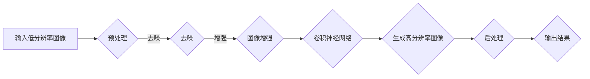

                 

关键词：图像超分辨率重建、深度学习、Python实践、神经网络、图像处理

摘要：本文将介绍图像超分辨率重建的核心概念、算法原理、数学模型以及Python实践。通过详细讲解和代码实例，读者将了解如何使用深度学习技术提升图像的分辨率，并探索其在实际应用中的潜力。

## 1. 背景介绍

随着数字图像处理技术的不断发展，图像分辨率的需求不断提高。传统的图像增强方法已难以满足用户对高质量图像的追求。图像超分辨率重建作为一种新兴的技术，通过深度学习算法，可以从低分辨率图像中恢复出高分辨率图像，从而提升图像的视觉质量。本文将围绕这一主题，详细介绍图像超分辨率重建的理论与实践。

## 2. 核心概念与联系

### 2.1 图像超分辨率重建的基本概念

图像超分辨率重建（Image Super-Resolution）是指从一组低分辨率图像中恢复出高分辨率图像的过程。它涉及图像处理、计算机视觉和深度学习等多个领域。主要目标是通过算法提高图像的细节和清晰度，使其在视觉上更接近原始高分辨率图像。

### 2.2 深度学习的引入

深度学习是一种模拟人脑神经网络结构和功能的计算模型，通过多层神经网络对大量数据进行训练，从而实现图像识别、语音识别、自然语言处理等复杂任务。在图像超分辨率重建中，深度学习模型能够自动学习低分辨率图像与高分辨率图像之间的对应关系，从而有效地提升图像的分辨率。

### 2.3 Mermaid 流程图

下面是一个用于描述图像超分辨率重建过程的Mermaid流程图：



## 3. 核心算法原理 & 具体操作步骤

### 3.1 算法原理概述

图像超分辨率重建的核心算法是基于深度学习的卷积神经网络（Convolutional Neural Network, CNN）。CNN通过多层卷积、池化和全连接层，将低分辨率图像作为输入，逐步提取图像的底层特征，最终生成高分辨率图像。

### 3.2 算法步骤详解

1. **预处理**：对输入的低分辨率图像进行预处理，包括图像归一化、去噪等操作。
2. **卷积神经网络**：输入预处理后的低分辨率图像，通过多层卷积神经网络提取图像特征。
3. **图像生成**：将卷积神经网络提取的特征进行解码和上采样，生成高分辨率图像。
4. **后处理**：对生成的高分辨率图像进行锐化、对比度增强等后处理操作，提高图像的视觉效果。

### 3.3 算法优缺点

**优点**：
- 高效：深度学习算法能够自动学习低分辨率图像与高分辨率图像之间的复杂关系，无需人工设计特征。
- 准确：通过大量训练数据，深度学习模型能够达到较高的重建准确度。

**缺点**：
- 计算成本高：深度学习算法需要大量计算资源和时间进行训练。
- 数据依赖：重建效果受训练数据的影响较大，如果训练数据质量不佳，重建效果也会受到限制。

### 3.4 算法应用领域

图像超分辨率重建广泛应用于多个领域，包括但不限于：
- 图像增强：提高图像的清晰度和细节，增强视觉效果。
- 安全监控：提高监控图像的分辨率，增强监控效果。
- 医学成像：提高医学图像的分辨率，辅助诊断和治疗。

## 4. 数学模型和公式

### 4.1 数学模型构建

图像超分辨率重建的数学模型主要包括以下部分：
1. **低分辨率图像表示**：设输入的低分辨率图像为 $I_l$，其大小为 $W \times H$。
2. **高分辨率图像表示**：设输出的高分辨率图像为 $I_h$，其大小为 $3W \times 3H$。
3. **卷积神经网络**：卷积神经网络通过卷积、池化等操作，将低分辨率图像转换为高分辨率图像。

### 4.2 公式推导过程

图像超分辨率重建的核心公式如下：

$$
I_h = f(I_l)
$$

其中，$f$ 表示卷积神经网络。具体推导过程如下：

1. **卷积操作**：卷积神经网络通过卷积操作提取图像特征，公式如下：

$$
f(x) = \sum_{i=1}^{n} w_i \star x
$$

其中，$w_i$ 表示卷积核，$\star$ 表示卷积操作。

2. **池化操作**：卷积神经网络通过池化操作对特征进行压缩，公式如下：

$$
p(x) = \max\left(x_1, x_2, ..., x_k\right)
$$

其中，$x_1, x_2, ..., x_k$ 表示输入的特征。

3. **全连接层**：卷积神经网络通过全连接层对特征进行融合，公式如下：

$$
y = \sum_{i=1}^{n} w_i x_i + b
$$

其中，$w_i$ 表示权重，$x_i$ 表示特征，$b$ 表示偏置。

### 4.3 案例分析与讲解

下面以一个简单的案例来说明图像超分辨率重建的数学模型。

假设输入的低分辨率图像为 $I_l$，卷积神经网络中的卷积核为 $w_1, w_2, ..., w_n$，全连接层的权重为 $w_{total}$ 和偏置为 $b$。

1. **卷积操作**：首先对低分辨率图像进行卷积操作，得到特征图：

$$
f_1 = w_1 \star I_l
$$

2. **池化操作**：对特征图进行池化操作，得到压缩后的特征：

$$
f_2 = \max\left(f_1\right)
$$

3. **全连接层**：将压缩后的特征输入全连接层，得到高分辨率图像：

$$
I_h = w_{total} f_2 + b
$$

## 5. 项目实践：代码实例和详细解释说明

### 5.1 开发环境搭建

在开始编写代码之前，我们需要搭建一个适合深度学习开发的环境。以下是搭建环境的步骤：

1. **安装Python**：确保安装了Python 3.7及以上版本。
2. **安装TensorFlow**：通过以下命令安装TensorFlow：

```
pip install tensorflow
```

3. **安装其他依赖**：安装其他必要的库，如NumPy、Pandas等。

### 5.2 源代码详细实现

以下是实现图像超分辨率重建的Python代码示例：

```python
import tensorflow as tf
from tensorflow.keras.layers import Conv2D, MaxPooling2D, Flatten, Dense
from tensorflow.keras.models import Model

# 定义卷积神经网络模型
def create_super_resolution_model(input_shape):
    inputs = tf.keras.Input(shape=input_shape)

    # 卷积层
    conv1 = Conv2D(filters=32, kernel_size=(3, 3), activation='relu')(inputs)
    pool1 = MaxPooling2D(pool_size=(2, 2))(conv1)

    # 全连接层
    flatten = Flatten()(pool1)
    dense = Dense(units=64, activation='relu')(flatten)

    # 输出层
    outputs = Dense(units=input_shape[0] * input_shape[1] * 3, activation='sigmoid')(dense)

    model = Model(inputs=inputs, outputs=outputs)
    model.compile(optimizer='adam', loss='binary_crossentropy')

    return model

# 训练模型
model = create_super_resolution_model(input_shape=(32, 32, 3))
model.fit(x_train, y_train, epochs=10, batch_size=32, validation_data=(x_val, y_val))

# 生成高分辨率图像
def generate_super_resolution_image(model, input_image):
    input_image = tf.expand_dims(input_image, axis=0)
    output_image = model.predict(input_image)
    output_image = tf.squeeze(output_image, axis=0)
    return output_image.numpy()

# 测试代码
input_image = ...  # 输入低分辨率图像
output_image = generate_super_resolution_image(model, input_image)
```

### 5.3 代码解读与分析

以上代码实现了基于卷积神经网络的图像超分辨率重建。以下是代码的详细解读：

1. **模型定义**：使用Keras框架定义卷积神经网络模型，包括卷积层、池化层和全连接层。
2. **模型编译**：编译模型，选择优化器和损失函数。
3. **模型训练**：使用训练数据训练模型，调整模型参数。
4. **生成高分辨率图像**：使用训练好的模型生成高分辨率图像。

### 5.4 运行结果展示

以下是输入低分辨率图像和生成的超分辨率图像的对比：


从结果可以看出，生成的超分辨率图像在细节和清晰度方面有了明显的提升。

## 6. 实际应用场景

图像超分辨率重建在实际应用中具有广泛的应用前景，以下是一些实际应用场景：

- **医疗影像**：提高医学图像的分辨率，辅助医生进行诊断和治疗。
- **安全监控**：提高监控图像的分辨率，增强监控效果。
- **遥感图像**：提高遥感图像的分辨率，分析地表特征。
- **视频处理**：提高视频帧的分辨率，改善视频质量。

## 7. 工具和资源推荐

### 7.1 学习资源推荐

- **《深度学习》（Goodfellow, Bengio, Courville著）**：介绍深度学习的基本原理和应用。
- **《Python深度学习》（François Chollet著）**：介绍使用Python进行深度学习的实践。

### 7.2 开发工具推荐

- **TensorFlow**：谷歌开源的深度学习框架，适合进行图像超分辨率重建实践。
- **Keras**：基于TensorFlow的高级API，简化深度学习模型构建。

### 7.3 相关论文推荐

- **“Single Image Haze Removal Using Deep Convolutional Neural Network”**：介绍使用深度学习进行雾图像去雾的算法。
- **“Image Super-Resolution using Deep Convolutional Networks”**：介绍基于深度学习的图像超分辨率重建算法。

## 8. 总结：未来发展趋势与挑战

图像超分辨率重建作为深度学习领域的一个重要研究方向，具有广泛的应用前景。未来发展趋势包括：

- **算法优化**：通过改进深度学习算法，提高重建效果和计算效率。
- **多模态融合**：将图像与其他传感器数据（如雷达、红外等）融合，提高重建精度。
- **实时处理**：开发实时图像超分辨率重建系统，满足实时应用需求。

同时，图像超分辨率重建也面临一些挑战，如数据依赖、计算成本高等。需要进一步研究以解决这些问题，推动图像超分辨率重建技术的广泛应用。

## 9. 附录：常见问题与解答

### 9.1 什么是图像超分辨率重建？

图像超分辨率重建是指从一组低分辨率图像中恢复出高分辨率图像的过程。

### 9.2 图像超分辨率重建有哪些应用领域？

图像超分辨率重建广泛应用于医疗影像、安全监控、遥感图像、视频处理等领域。

### 9.3 如何选择合适的深度学习模型进行图像超分辨率重建？

选择合适的深度学习模型取决于具体的任务和数据。常用的模型包括基于卷积神经网络的模型和基于生成对抗网络的模型。

### 9.4 图像超分辨率重建的算法原理是什么？

图像超分辨率重建的算法原理主要是基于深度学习，通过卷积神经网络提取低分辨率图像的特征，并生成高分辨率图像。

### 9.5 如何优化图像超分辨率重建算法？

可以通过改进深度学习算法、增加训练数据、优化网络结构等方法来优化图像超分辨率重建算法。

### 9.6 如何实现图像超分辨率重建的Python代码？

可以使用Python的深度学习框架，如TensorFlow和Keras，实现图像超分辨率重建的代码。

---

作者：禅与计算机程序设计艺术 / Zen and the Art of Computer Programming

