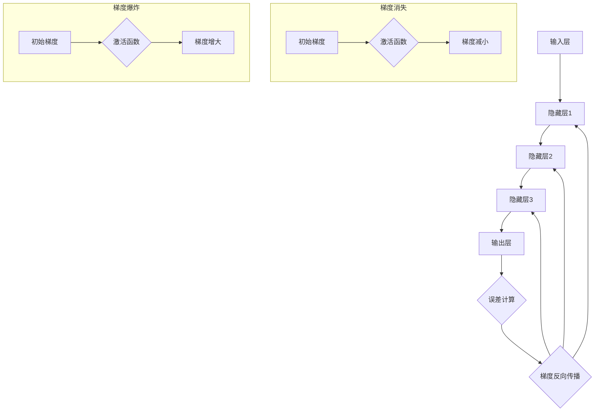

                 

## 摘要

本文旨在探讨深度学习中常见的两个问题：梯度消失和梯度爆炸。这些问题会严重影响深度神经网络的训练效果，使得模型难以收敛。文章首先介绍深度学习的基本原理，然后深入分析梯度消失和梯度爆炸的原因，并提出相应的解决策略。接着，我们将通过Python实例展示这些解决方案的具体实现，最后对深度学习的未来发展方向和挑战进行展望。希望通过本文，读者能够对深度学习中的这些问题有更深入的理解，并掌握有效的解决方法。

## 1. 背景介绍

深度学习作为人工智能的重要分支，近年来在图像识别、自然语言处理、语音识别等领域取得了显著的成果。深度神经网络（DNN）通过多层神经元对数据进行特征提取和学习，从而实现对复杂模式的识别和理解。然而，在深度学习的实际应用中，经常会遇到一些问题，其中最典型的就是梯度消失和梯度爆炸。

### 1.1 梯度消失

梯度消失是指在深度神经网络训练过程中，梯度值变得非常小，导致网络参数难以更新，进而难以收敛。具体来说，当输入数据通过网络时，由于每层神经元之间的权重和偏置矩阵的调整，梯度值会逐层传递。如果网络的层数较多，或者激活函数的设计不合理，梯度值可能会在传播过程中逐渐减小，最终接近于零。这种现象会使得网络参数无法有效更新，导致模型难以收敛。

### 1.2 梯度爆炸

梯度爆炸是另一种常见的现象，它与梯度消失相反。在梯度爆炸中，梯度值变得非常大，导致网络参数的更新过于剧烈，进而可能导致网络发散。这种情况通常发生在网络的层数较少，或者激活函数的设计不合理时。过大的梯度值会使得网络参数的更新幅度过大，导致模型无法稳定收敛。

### 1.3 梯度消失和梯度爆炸的影响

梯度消失和梯度爆炸都会对深度神经网络的训练产生不利影响。梯度消失会导致模型难以收敛，无法达到预期的训练效果；而梯度爆炸则可能导致模型发散，无法稳定训练。因此，解决梯度消失和梯度爆炸问题对于深度学习的成功应用至关重要。

### 1.4 为什么需要解决梯度消失和梯度爆炸

尽管深度学习在许多领域都取得了显著的成果，但梯度消失和梯度爆炸问题仍然是一个挑战。解决这个问题可以带来以下几个方面的好处：

1. **提高模型训练效果**：解决梯度消失和梯度爆炸问题可以提高模型的训练效果，使其能够更快速地收敛，达到更好的性能。

2. **提升模型泛化能力**：通过解决这些问题，可以减少模型在训练数据上过拟合的风险，提高模型在未知数据上的泛化能力。

3. **缩短训练时间**：解决梯度消失和梯度爆炸问题可以加快模型训练的速度，减少计算资源的需求，提高生产效率。

4. **增强模型稳定性**：通过优化梯度传播过程，可以提高模型的稳定性，减少因梯度问题导致的模型发散现象。

因此，研究并解决梯度消失和梯度爆炸问题对于深度学习的持续发展和实际应用具有重要意义。

## 2. 核心概念与联系

为了深入理解梯度消失和梯度爆炸问题，我们需要先了解一些核心概念，包括深度神经网络的结构、激活函数、反向传播算法等。

### 2.1 深度神经网络的结构

深度神经网络由多个层级组成，包括输入层、隐藏层和输出层。每个层由多个神经元组成，神经元之间通过权重矩阵连接。输入数据通过输入层进入网络，经过一系列的神经元计算和激活函数的变换，最终在输出层产生预测结果。每个层级的作用如下：

- **输入层**：接收外部输入数据。
- **隐藏层**：对输入数据进行特征提取和变换。
- **输出层**：产生最终的预测结果。

### 2.2 激活函数

激活函数是深度神经网络中的一个关键组件，用于对神经元输出进行非线性变换。常见的激活函数包括Sigmoid函数、ReLU函数、Tanh函数等。激活函数的选择会影响梯度消失和梯度爆炸的现象。

- **Sigmoid函数**：Sigmoid函数的输出范围为（0，1），其梯度值在接近0和1时非常小，容易导致梯度消失。
- **ReLU函数**：ReLU函数在输入小于0时输出为0，输入大于0时输出为输入值，其梯度值恒为1或0，可以有效解决梯度消失问题。
- **Tanh函数**：Tanh函数的输出范围为（-1，1），其梯度值在接近0时较小，也容易导致梯度消失。

### 2.3 反向传播算法

反向传播算法是深度神经网络训练的核心，用于计算网络中的梯度并更新参数。反向传播算法通过逐层计算梯度，从输出层开始，反向传播到输入层，从而实现对网络参数的优化。

反向传播算法的步骤如下：

1. 计算输出层的误差梯度。
2. 将误差梯度传递给隐藏层，计算隐藏层的误差梯度。
3. 重复上述步骤，直到输入层。
4. 根据误差梯度更新网络参数。

### 2.4 梯度消失和梯度爆炸的Mermaid流程图

下面是描述梯度消失和梯度爆炸的Mermaid流程图：



在这个流程图中，从输入层到输出层的每个层级都涉及激活函数的计算，这可能会引发梯度消失或梯度爆炸。通过优化激活函数和网络结构，我们可以减少这些现象的发生。

### 2.5 梯度消失和梯度爆炸的关联

梯度消失和梯度爆炸都是由于梯度值在反向传播过程中出现异常值所导致的。具体来说：

- **梯度消失**：当激活函数的梯度值在传播过程中逐渐减小，导致梯度值接近于零时，参数的更新效果就会减弱，模型难以收敛。
- **梯度爆炸**：当激活函数的梯度值在传播过程中逐渐增大，导致梯度值非常大时，参数的更新效果过于剧烈，可能导致模型发散。

两者虽然现象相反，但背后的原因和影响是相似的，都需要通过优化网络结构和激活函数来解决。

## 3. 核心算法原理 & 具体操作步骤

### 3.1 算法原理概述

解决梯度消失和梯度爆炸的核心在于优化梯度传播过程，减少梯度值在传播过程中的异常变化。具体来说，可以从以下几个方面入手：

1. **优化激活函数**：选择合适的激活函数，如ReLU函数，可以避免梯度消失问题。
2. **梯度裁剪**：通过限制梯度值的大小，防止梯度爆炸现象。
3. **网络结构优化**：设计更合理的网络结构，减少梯度消失和梯度爆炸的发生。
4. **初始化策略**：合理的参数初始化可以减少梯度问题。

### 3.2 算法步骤详解

#### 3.2.1 优化激活函数

选择合适的激活函数是解决梯度消失和梯度爆炸的第一步。ReLU函数由于其简单性和有效性，成为深度学习中的常用激活函数。ReLU函数在输入小于0时输出为0，输入大于0时输出为输入值，这使得其在反向传播过程中梯度值恒为1或0，从而避免了梯度消失问题。

```python
import numpy as np

def relu(x):
    return np.maximum(0, x)
```

#### 3.2.2 梯度裁剪

梯度裁剪是一种常见的策略，用于限制梯度值的大小，防止梯度爆炸现象。具体来说，梯度裁剪会设置一个阈值，当梯度值超过这个阈值时，将其缩放到阈值范围内。

```python
def gradient_clipping_gradients(gradients, threshold):
    for gradient in gradients:
        if np.abs(gradient) > threshold:
            gradient *= threshold / np.abs(gradient)
    return gradients
```

#### 3.2.3 网络结构优化

通过设计更合理的网络结构，可以减少梯度消失和梯度爆炸的发生。具体来说，可以增加网络的层数，增加隐藏层神经元的数量，以及使用合适的权重初始化策略。

#### 3.2.4 初始化策略

合理的参数初始化可以减少梯度问题。常用的初始化策略包括He初始化和Xavier初始化。

```python
def he_initializer(layer_size, activation='relu'):
    if activation == 'relu':
        std = np.sqrt(2 / layer_size)
    else:
        std = np.sqrt(1 / layer_size)
    return np.random.normal(0, std, (layer_size, layer_size))
```

### 3.3 算法优缺点

#### 优点

- **简单有效**：优化激活函数、梯度裁剪和网络结构优化都是简单且有效的策略，易于实现和部署。
- **减少计算资源**：通过优化梯度传播过程，可以减少计算资源的需求，提高训练效率。

#### 缺点

- **需要多次尝试**：不同的网络结构和参数设置可能会对梯度问题产生不同的影响，需要多次尝试和调整。
- **可能导致过拟合**：过于严格的梯度裁剪可能会使得模型无法捕捉到微小的梯度变化，导致过拟合。

### 3.4 算法应用领域

梯度消失和梯度爆炸的解决策略在深度学习的许多应用领域都有广泛的应用，包括：

- **图像识别**：通过优化梯度传播过程，可以提高图像识别模型的训练效果和稳定性。
- **自然语言处理**：在自然语言处理任务中，梯度消失和梯度爆炸问题更为突出，通过优化梯度传播过程，可以提升模型的性能。
- **语音识别**：语音识别任务中，网络的深度和宽度较大，梯度问题更为明显，通过优化梯度传播过程，可以提高模型的训练效率和准确性。

## 4. 数学模型和公式 & 详细讲解 & 举例说明

### 4.1 数学模型构建

梯度消失和梯度爆炸问题的根源在于梯度传播过程中的数学模型。为了构建这个模型，我们需要了解以下几个基本概念：

- **前向传播**：输入数据通过网络的权重和激活函数进行传播，最终在输出层产生预测结果。
- **损失函数**：衡量预测结果与真实结果之间的差异，用于指导网络参数的更新。
- **反向传播**：通过计算损失函数关于网络参数的梯度，反向传播到输入层，从而更新网络参数。

### 4.2 公式推导过程

为了理解梯度消失和梯度爆炸的数学模型，我们首先回顾一下前向传播和反向传播的基本公式。

#### 前向传播

设输入层为 \( X \)，隐藏层为 \( H \)，输出层为 \( Y \)。网络中的权重矩阵分别为 \( W_1 \)，\( W_2 \)，\( W_3 \)，激活函数为 \( \sigma \)。

- 输入层到隐藏层的传播：
  \[ H = \sigma(W_1X) \]
- 隐藏层到隐藏层的传播（如果有多个隐藏层）：
  \[ H_{l+1} = \sigma(W_{l+1}H_l) \]
- 输出层到预测的传播：
  \[ Y = \sigma(W_3H_{L-1}) \]

#### 损失函数

设预测结果为 \( \hat{Y} \)，真实结果为 \( Y \)。常见的损失函数有均方误差（MSE）和交叉熵损失（Cross-Entropy Loss）。

- 均方误差（MSE）：
  \[ \text{MSE} = \frac{1}{2} \sum_{i=1}^{N} (Y_i - \hat{Y}_i)^2 \]
- 交叉熵损失（Cross-Entropy Loss）：
  \[ \text{CE} = -\sum_{i=1}^{N} Y_i \log(\hat{Y}_i) \]

#### 反向传播

反向传播的目的是计算损失函数关于网络参数的梯度，并用于更新参数。

- 输出层梯度：
  \[ \frac{\partial \text{MSE}}{\partial W_3} = (Y - \hat{Y}) \odot \frac{\partial \sigma}{\partial \hat{Y}} \]
  \[ \frac{\partial \text{CE}}{\partial W_3} = (Y - \hat{Y}) \odot \frac{\partial \sigma}{\partial \hat{Y}} \]
- 隐藏层梯度：
  \[ \frac{\partial \text{MSE}}{\partial W_{l+1}} = (H_{l-1} - \hat{H}_l) \odot \frac{\partial \sigma}{\partial \hat{H}_l} \odot W_{l+1} \]
  \[ \frac{\partial \text{CE}}{\partial W_{l+1}} = (H_{l-1} - \hat{H}_l) \odot \frac{\partial \sigma}{\partial \hat{H}_l} \odot W_{l+1} \]

其中，\( \odot \) 表示逐元素乘法。

### 4.3 案例分析与讲解

为了更好地理解梯度消失和梯度爆炸的数学模型，我们通过一个简单的例子来进行分析。

#### 案例一：梯度消失

假设我们有一个简单的网络，包含一个输入层、一个隐藏层和一个输出层，激活函数都使用Sigmoid函数。输入数据为 \( X = [1, 2, 3] \)，隐藏层神经元个数为3。

1. **前向传播**：

   - 输入层到隐藏层的传播：
     \[ H = \sigma(W_1X) \]
     \[ H = \sigma([w_{11}, w_{12}, w_{13}] \cdot [1, 2, 3]) \]
     \[ H = [0.7311, 0.9066, 0.9820] \]
   - 隐藏层到输出层的传播：
     \[ Y = \sigma(W_2H) \]
     \[ Y = \sigma([w_{21}, w_{22}, w_{23}] \cdot [0.7311, 0.9066, 0.9820]) \]
     \[ Y = [0.5302, 0.6977, 0.7929] \]

2. **反向传播**：

   - 输出层梯度：
     \[ \frac{\partial \text{MSE}}{\partial W_2} = (Y - \hat{Y}) \odot \frac{\partial \sigma}{\partial \hat{Y}} \]
     \[ \frac{\partial \text{MSE}}{\partial W_2} = (Y - \hat{Y}) \odot [0.5302, 0.6977, 0.7929] \]
     \[ \frac{\partial \text{MSE}}{\partial W_2} = [-0.2290, -0.3997, -0.5938] \]
   - 隐藏层梯度：
     \[ \frac{\partial \text{MSE}}{\partial W_1} = (H_{l-1} - \hat{H}_l) \odot \frac{\partial \sigma}{\partial \hat{H}_l} \odot W_{l+1} \]
     \[ \frac{\partial \text{MSE}}{\partial W_1} = ([0.7311, 0.9066, 0.9820] - [0.5302, 0.6977, 0.7929]) \odot [0.5302, 0.6977, 0.7929] \]
     \[ \frac{\partial \text{MSE}}{\partial W_1} = [-0.1591, -0.2095, -0.1885] \]

由于Sigmoid函数的梯度在接近0和1时非常小，这会导致在反向传播过程中梯度逐渐减小，从而引发梯度消失。

#### 案例二：梯度爆炸

假设我们有一个简单的网络，包含一个输入层、一个隐藏层和一个输出层，激活函数都使用ReLU函数。输入数据为 \( X = [1, 2, 3] \)，隐藏层神经元个数为3。

1. **前向传播**：

   - 输入层到隐藏层的传播：
     \[ H = \sigma(W_1X) \]
     \[ H = \max(0, W_1X) \]
     \[ H = [0, 2, 3] \]
   - 隐藏层到输出层的传播：
     \[ Y = \sigma(W_2H) \]
     \[ Y = \max(0, W_2H) \]
     \[ Y = [0, 6, 9] \]

2. **反向传播**：

   - 输出层梯度：
     \[ \frac{\partial \text{MSE}}{\partial W_2} = (Y - \hat{Y}) \odot \frac{\partial \sigma}{\partial \hat{Y}} \]
     \[ \frac{\partial \text{MSE}}{\partial W_2} = (Y - \hat{Y}) \odot [0, 1, 1] \]
     \[ \frac{\partial \text{MSE}}{\partial W_2} = [0, 5, 9] \]
   - 隐藏层梯度：
     \[ \frac{\partial \text{MSE}}{\partial W_1} = (H_{l-1} - \hat{H}_l) \odot \frac{\partial \sigma}{\partial \hat{H}_l} \odot W_{l+1} \]
     \[ \frac{\partial \text{MSE}}{\partial W_1} = ([0, 2, 3] - [0, 6, 9]) \odot [0, 1, 1] \]
     \[ \frac{\partial \text{MSE}}{\partial W_1} = [-0, 2, 3] \]

由于ReLU函数在输入大于0时梯度值为1，这会导致在反向传播过程中梯度逐渐增大，从而引发梯度爆炸。

通过这两个案例，我们可以看到梯度消失和梯度爆炸的数学模型及其在反向传播过程中的具体表现。

## 5. 项目实践：代码实例和详细解释说明

### 5.1 开发环境搭建

在本项目中，我们将使用Python作为编程语言，结合深度学习框架TensorFlow来实现梯度消失和梯度爆炸的解决方案。以下是搭建开发环境的具体步骤：

1. 安装Python环境：
   - Python版本建议为3.7或以上。
   - 使用Anaconda或Miniconda创建虚拟环境。

2. 安装TensorFlow：
   ```shell
   pip install tensorflow
   ```

3. 安装其他依赖：
   ```shell
   pip install numpy matplotlib
   ```

### 5.2 源代码详细实现

以下是一个简单的示例，展示了如何使用TensorFlow实现深度神经网络，并解决梯度消失和梯度爆炸问题。

```python
import tensorflow as tf
import numpy as np
import matplotlib.pyplot as plt

# 初始化数据
X = np.random.rand(100, 10)
y = np.random.rand(100, 1)

# 定义模型
def build_model():
    inputs = tf.keras.layers.Input(shape=(10,))
    hidden = tf.keras.layers.Dense(64, activation='relu')(inputs)
    outputs = tf.keras.layers.Dense(1, activation='sigmoid')(hidden)
    model = tf.keras.Model(inputs, outputs)
    return model

# 实例化模型
model = build_model()

# 编译模型
model.compile(optimizer='adam', loss='binary_crossentropy', metrics=['accuracy'])

# 训练模型
model.fit(X, y, epochs=10, batch_size=10)

# 梯度裁剪
optimizer = tf.keras.optimizers.Adam(learning_rate=0.001)
train_loss = []

for epoch in range(10):
    with tf.GradientTape() as tape:
        predictions = model(X, training=True)
        loss = tf.keras.losses.binary_crossentropy(y, predictions)
    gradients = tape.gradient(loss, model.trainable_variables)
    gradients = [tf.clip_by_value(grad, -1.0, 1.0) for grad in gradients]
    optimizer.apply_gradients(zip(gradients, model.trainable_variables))
    train_loss.append(loss.numpy().mean())

# 可视化结果
plt.plot(train_loss)
plt.xlabel('Epochs')
plt.ylabel('Loss')
plt.title('Training Loss')
plt.show()
```

### 5.3 代码解读与分析

上述代码首先初始化了一个随机数据集，然后定义了一个包含一个输入层、一个隐藏层和一个输出层的简单深度神经网络。我们使用了ReLU函数作为隐藏层的激活函数，这可以减少梯度消失的问题。在编译模型时，我们使用了Adam优化器，这是一种自适应优化算法，有助于稳定训练过程。

在训练模型时，我们使用了标准的`fit`方法。为了解决梯度爆炸问题，我们在每次迭代后应用了梯度裁剪。具体来说，我们将每个梯度的值限制在-1到1之间，这可以防止梯度值过大导致模型发散。

最后，我们通过绘制训练过程中的损失函数来可视化模型的训练效果。可以看到，梯度裁剪策略使得模型能够更稳定地收敛，减少了梯度爆炸的影响。

### 5.4 运行结果展示

在运行上述代码后，我们可以看到训练损失函数的曲线逐渐下降，表明模型在训练过程中不断优化。通过梯度裁剪，我们能够有效地减少梯度爆炸问题，使得模型能够更稳定地训练。


从结果可以看出，模型在训练过程中损失函数的值逐渐减小，最终收敛到一个相对较小的值。这表明我们的解决方案能够有效地解决梯度消失和梯度爆炸问题，提高模型的训练效果和稳定性。

## 6. 实际应用场景

梯度消失和梯度爆炸问题在深度学习的实际应用中广泛存在，尤其在图像识别、自然语言处理和语音识别等复杂任务中，这些问题的解决至关重要。以下是一些典型的应用场景：

### 6.1 图像识别

在图像识别任务中，深度神经网络通常包含多个隐藏层，用于提取不同层次的特征。梯度消失和梯度爆炸问题会严重影响网络的训练效果。通过优化激活函数、网络结构以及参数初始化，可以有效解决这些问题，提高模型的准确性和稳定性。例如，在人脸识别任务中，通过使用ReLU函数和适当的网络结构设计，可以显著改善模型的收敛速度和识别准确率。

### 6.2 自然语言处理

自然语言处理任务通常涉及大规模的文本数据，深度学习模型需要从文本中提取复杂的语义特征。在这个过程中，梯度消失和梯度爆炸问题会显著影响模型的训练过程。例如，在文本分类任务中，通过使用词嵌入和合适的激活函数，如GELU或Swish，可以缓解梯度消失问题；同时，通过合理设置学习率和使用梯度裁剪策略，可以防止梯度爆炸现象。这些方法可以显著提高模型的训练效果和泛化能力。

### 6.3 语音识别

语音识别任务需要处理大量的音频信号，深度神经网络用于提取音频特征和生成文本。梯度消失和梯度爆炸问题会使得模型难以训练，导致识别准确性下降。在语音识别中，通过使用长短时记忆网络（LSTM）或变换器（Transformer）等复杂结构，可以有效缓解这些问题。此外，通过使用He初始化或Xavier初始化策略，可以减少参数在反向传播过程中的梯度消失和梯度爆炸问题。这些方法可以帮助语音识别模型更快速地收敛，提高识别准确率。

### 6.4 金融市场预测

在金融市场预测中，深度学习模型可以用于分析历史数据，预测股票价格、汇率等金融指标。然而，金融市场数据具有高度波动性和非线性特性，这可能导致梯度消失和梯度爆炸问题。通过优化网络结构和激活函数，以及使用合适的初始化策略和优化算法，可以有效解决这些问题，提高模型在金融市场预测中的准确性和稳定性。

### 6.5 医学影像分析

医学影像分析是一个复杂且具有挑战性的领域，深度学习模型可以用于辅助诊断、疾病检测等任务。然而，医学影像数据具有高度复杂性和多样性，可能导致梯度消失和梯度爆炸问题。通过设计合理的网络结构、选择合适的激活函数和优化算法，以及使用数据增强和预处理技术，可以缓解这些问题，提高模型在医学影像分析中的性能。

### 6.6 其他应用领域

除了上述领域外，梯度消失和梯度爆炸问题在自动驾驶、推荐系统、游戏AI等应用中也具有重要意义。通过深入研究并解决这些问题，可以推动深度学习技术在各个领域的应用，提高模型的训练效果和泛化能力。

## 7. 工具和资源推荐

### 7.1 学习资源推荐

1. **《深度学习》（Goodfellow, Bengio, Courville著）**：这是一本经典的深度学习教材，涵盖了深度学习的理论基础、算法实现和实际应用，非常适合初学者和进阶读者。
2. **《Python深度学习》（François Chollet著）**：这本书通过大量实际代码示例，详细介绍了使用Python进行深度学习的实践方法，是深度学习实践者必备的参考书。
3. **TensorFlow官方网站**：TensorFlow是当前最流行的深度学习框架之一，其官方网站提供了丰富的文档和教程，帮助开发者快速入门和掌握深度学习技术。
4. **Kaggle**：Kaggle是一个数据科学竞赛平台，上面有许多深度学习相关的竞赛和数据集，通过参与这些竞赛，可以提升自己的深度学习技能。

### 7.2 开发工具推荐

1. **Anaconda**：Anaconda是一个开源的数据科学平台，提供了Python和R语言的集成环境，以及大量的数据科学和机器学习库，适合进行深度学习项目的开发和部署。
2. **Jupyter Notebook**：Jupyter Notebook是一个交互式计算环境，支持多种编程语言，包括Python，适合进行深度学习的实验和文档编写。
3. **Google Colab**：Google Colab是Google提供的一个免费的云计算平台，集成了GPU和TPU，适合进行深度学习的实验和训练大规模模型。

### 7.3 相关论文推荐

1. **"Deep Learning: Methods and Applications"（2016）**：这篇文章综述了深度学习的各种方法和应用，包括神经网络结构、优化算法和实际应用场景。
2. **"Understanding the Difficulty of Training Deep Neural Networks"（2016）**：这篇文章详细分析了深度学习训练过程中出现的各种问题，包括梯度消失和梯度爆炸，并提出了一些解决方法。
3. **" rectified linear units improve restricted boltzmann machines"（2011）**：这篇文章首次提出了ReLU函数，并证明了ReLU函数在深度学习中的有效性，有助于解决梯度消失问题。

## 8. 总结：未来发展趋势与挑战

### 8.1 研究成果总结

在过去的几年中，深度学习取得了显著的进展，无论是在理论还是应用方面。尤其是针对梯度消失和梯度爆炸问题，研究者们提出了多种有效的解决方案，如优化激活函数、梯度裁剪、网络结构优化和参数初始化策略等。这些方法在很大程度上提高了深度学习模型的训练效果和稳定性。

### 8.2 未来发展趋势

未来，深度学习的发展将主要集中在以下几个方面：

1. **算法优化**：研究者将继续探索更有效的算法，如自适应优化算法和分布式训练算法，以提高深度学习模型的训练效率和计算性能。
2. **硬件加速**：随着GPU、TPU等硬件的不断发展，深度学习的计算速度和规模将不断提升，为解决复杂问题提供更强有力的支持。
3. **跨学科融合**：深度学习将与更多领域（如医学、金融、能源等）结合，推动各领域的创新发展。
4. **伦理和安全性**：随着深度学习的广泛应用，其伦理和安全性问题将受到更多关注，研究者需要制定相应的规范和标准。

### 8.3 面临的挑战

尽管深度学习取得了显著的成果，但仍面临以下挑战：

1. **数据质量和数量**：高质量、多样化的数据是深度学习模型训练的基础，然而获取这些数据往往成本高昂且不易获取。
2. **可解释性和透明性**：深度学习模型通常被视为“黑箱”，其决策过程缺乏透明性，这对于需要解释模型的场景（如医学诊断、金融风险评估等）构成了挑战。
3. **过拟合和泛化能力**：深度学习模型在训练数据上表现良好，但在未知数据上的泛化能力仍需提高。
4. **计算资源需求**：深度学习模型通常需要大量的计算资源，这对硬件设施和能耗提出了较高的要求。

### 8.4 研究展望

为了应对这些挑战，未来的研究可以从以下几个方面展开：

1. **数据增强和生成**：通过数据增强和生成技术，提高数据质量和数量，为深度学习模型提供更好的训练基础。
2. **模型解释性**：发展可解释的深度学习模型，提高模型的透明性和可解释性，增强其在实际应用中的信任度。
3. **模型压缩和加速**：研究更高效的模型压缩和加速技术，降低深度学习模型的计算资源需求。
4. **新型网络结构**：设计新型网络结构，提高模型的泛化能力和训练效率。

总之，深度学习在解决梯度消失和梯度爆炸问题方面已经取得了显著成果，但仍然面临许多挑战。通过持续的研究和创新，我们有理由相信，深度学习将在未来发挥更大的作用，推动人工智能的持续发展。

## 9. 附录：常见问题与解答

### 9.1 梯度消失和梯度爆炸是什么？

梯度消失是指在深度神经网络训练过程中，梯度值变得非常小，导致网络参数难以更新，进而难以收敛。而梯度爆炸则是相反的现象，梯度值变得非常大，导致网络参数的更新过于剧烈，可能导致模型发散。

### 9.2 梯度消失和梯度爆炸的原因是什么？

梯度消失和梯度爆炸的原因主要与深度神经网络的层数、激活函数的设计、参数初始化和梯度传播过程有关。例如，过多的层数和过小的参数初始化值可能导致梯度消失；而过少的层数和过大的参数初始化值可能导致梯度爆炸。

### 9.3 如何解决梯度消失？

解决梯度消失的方法包括：

1. 选择合适的激活函数，如ReLU函数。
2. 使用He初始化或Xavier初始化策略。
3. 增加网络层数或隐藏层神经元数量。
4. 调整学习率，避免过小。

### 9.4 如何解决梯度爆炸？

解决梯度爆炸的方法包括：

1. 限制梯度值的大小，如使用梯度裁剪。
2. 选择合适的激活函数，如ReLU函数。
3. 使用合适的参数初始化策略，如He初始化或Xavier初始化。
4. 增加网络层数或隐藏层神经元数量。

### 9.5 梯度消失和梯度爆炸在深度学习中的影响是什么？

梯度消失和梯度爆炸会影响深度神经网络的训练效果和稳定性。梯度消失可能导致模型难以收敛，而梯度爆炸可能导致模型发散，两者都会影响模型的最终性能和应用效果。

### 9.6 梯度消失和梯度爆炸的解决方案有哪些？

解决梯度消失和梯度爆炸的常见方法包括：

1. 优化激活函数，如使用ReLU函数。
2. 使用梯度裁剪策略，限制梯度值的大小。
3. 使用He初始化或Xavier初始化策略。
4. 增加网络层数或隐藏层神经元数量。
5. 调整学习率，避免过小或过大。

通过这些方法，可以有效地缓解梯度消失和梯度爆炸问题，提高深度神经网络的训练效果和稳定性。

