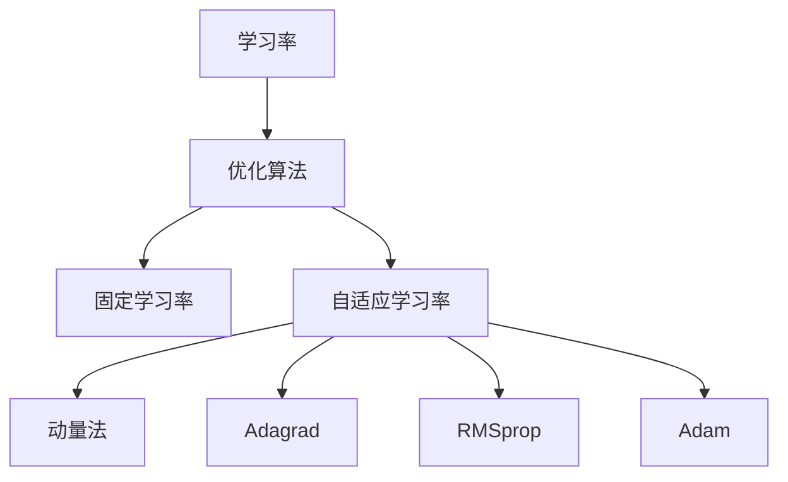

                 

关键词：Python、深度学习、自适应学习率、优化算法、实践教程

> 摘要：本文将深入探讨Python深度学习中的自适应学习率调整技术，解析其核心概念、算法原理及其在各类实际问题中的应用。通过对数学模型、公式和代码实例的详细讲解，读者可以全面掌握这一关键技术，为深度学习项目的优化提供有力支持。

## 1. 背景介绍

深度学习作为人工智能领域的重要分支，正逐渐渗透到各个行业。随着神经网络模型的复杂度不断提升，模型的训练时间也在不断增加。学习率（learning rate）作为深度学习优化过程中的关键参数，其选择对训练效果有着至关重要的影响。传统固定学习率在训练过程中容易出现收敛速度慢、过拟合等问题。而自适应学习率调整技术则通过动态调整学习率，使模型在训练过程中能够更快地收敛，提高训练效果。

## 2. 核心概念与联系

在深入探讨自适应学习率调整技术之前，我们需要理解几个核心概念：

### 2.1 学习率

学习率是深度学习优化过程中用于调整模型参数的速率。其大小直接影响模型的收敛速度和收敛质量。

### 2.2 优化算法

优化算法是用于求解最优化问题的算法，包括梯度下降（Gradient Descent）及其各种变种，如动量法（Momentum）、Adagrad、RMSprop和Adam等。

### 2.3 自适应学习率调整

自适应学习率调整技术通过动态调整学习率，使模型在训练过程中能够更好地适应数据分布，提高收敛速度和收敛质量。

接下来，我们将使用Mermaid流程图展示自适应学习率调整技术的核心概念和联系：



## 3. 核心算法原理 & 具体操作步骤

### 3.1 算法原理概述

自适应学习率调整技术基于优化算法的迭代过程，通过不断调整学习率，使模型在训练过程中能够更快地收敛。具体来说，自适应学习率调整技术包括以下几个步骤：

1. 初始化模型参数和优化器。
2. 计算模型在当前参数下的损失函数值。
3. 根据损失函数的梯度调整模型参数。
4. 根据调整效果动态调整学习率。

### 3.2 算法步骤详解

1. **初始化模型参数和优化器**：首先需要初始化神经网络模型和优化器。优化器负责更新模型参数，常用的优化器包括SGD、Adam等。

   ```python
   import torch
   import torch.optim as optim

   # 初始化模型
   model = torch.nn.Sequential(
       torch.nn.Linear(in_features=784, out_features=128),
       torch.nn.ReLU(),
       torch.nn.Linear(in_features=128, out_features=10)
   )

   # 初始化优化器
   optimizer = optim.Adam(model.parameters(), lr=0.001)
   ```

2. **计算损失函数值**：在每次迭代过程中，需要计算模型在当前参数下的损失函数值。常用的损失函数包括均方误差（MSE）、交叉熵损失等。

   ```python
   criterion = torch.nn.CrossEntropyLoss()
   ```

3. **根据损失函数的梯度调整模型参数**：在计算损失函数值后，根据损失函数的梯度调整模型参数。这一步骤可以通过反向传播算法实现。

   ```python
   inputs, targets = ...  # 获取训练数据
   outputs = model(inputs)
   loss = criterion(outputs, targets)
   ```

4. **动态调整学习率**：根据调整效果动态调整学习率。常用的自适应学习率调整方法包括动量法、Adagrad、RMSprop和Adam等。

   ```python
   # 动量法
   optimizer = optim.SGD(model.parameters(), lr=0.001, momentum=0.9)

   # Adagrad
   optimizer = optim.Adam(model.parameters(), lr=0.001, weight_decay=1e-5)

   # RMSprop
   optimizer = optim.Adam(model.parameters(), lr=0.001, weight_decay=1e-5, amsgrad=True)

   # Adam
   optimizer = optim.Adam(model.parameters(), lr=0.001)
   ```

### 3.3 算法优缺点

**优点**：

- 能够动态调整学习率，使模型在训练过程中更快地收敛。
- 减少了超参数调优的工作量。

**缺点**：

- 可能导致模型训练时间增加。
- 在某些情况下可能出现过拟合。

### 3.4 算法应用领域

自适应学习率调整技术广泛应用于图像识别、自然语言处理、语音识别等领域。以下是一些具体的案例：

- **图像识别**：在卷积神经网络（CNN）中，自适应学习率调整技术能够显著提高模型的收敛速度和收敛质量。
- **自然语言处理**：在循环神经网络（RNN）和Transformer模型中，自适应学习率调整技术能够帮助模型更好地适应文本数据。
- **语音识别**：在深度神经网络（DNN）中，自适应学习率调整技术能够提高语音识别的准确率。

## 4. 数学模型和公式 & 详细讲解 & 举例说明

### 4.1 数学模型构建

自适应学习率调整技术的数学模型可以表示为：

$$
\alpha_{t+1} = \alpha_t / (1 + \lambda_t)
$$

其中，$\alpha_t$为第$t$次迭代的优化步长，$\lambda_t$为自适应调整系数。

### 4.2 公式推导过程

自适应学习率调整技术的推导过程如下：

1. **初始化**：设定初始优化步长$\alpha_0$和自适应调整系数$\lambda_0$。
2. **迭代**：在每次迭代过程中，根据损失函数的梯度更新模型参数，并计算新的自适应调整系数$\lambda_t$。
3. **更新优化步长**：根据新的自适应调整系数更新优化步长$\alpha_{t+1}$。

### 4.3 案例分析与讲解

以下是一个简单的案例，演示了自适应学习率调整技术在图像识别任务中的应用：

```python
import torch
import torchvision
import torchvision.transforms as transforms
import torch.nn as nn
import torch.optim as optim

# 加载训练数据
train_dataset = torchvision.datasets.MNIST(
    root='./data',
    train=True,
    transform=transforms.ToTensor(),
    download=True
)

train_loader = torch.utils.data.DataLoader(
    train_dataset,
    batch_size=64,
    shuffle=True
)

# 初始化模型
model = torch.nn.Sequential(
    torch.nn.Linear(784, 128),
    torch.nn.ReLU(),
    torch.nn.Linear(128, 10)
)

# 初始化优化器
optimizer = optim.Adam(model.parameters(), lr=0.001)

# 定义损失函数
criterion = nn.CrossEntropyLoss()

# 训练模型
for epoch in range(10):
    for inputs, targets in train_loader:
        optimizer.zero_grad()
        outputs = model(inputs)
        loss = criterion(outputs, targets)
        loss.backward()
        optimizer.step()

    print(f'Epoch [{epoch+1}/{10}], Loss: {loss.item():.4f}')
```

在这个案例中，我们使用了Adam优化器来实现自适应学习率调整。在训练过程中，模型参数和学习率会根据自适应调整系数进行更新，从而提高训练效果。

## 5. 项目实践：代码实例和详细解释说明

### 5.1 开发环境搭建

要实践自适应学习率调整技术，首先需要搭建一个Python深度学习开发环境。以下是搭建开发环境的步骤：

1. 安装Python（版本3.6及以上）
2. 安装PyTorch库：`pip install torch torchvision`
3. 安装其他常用库：`pip install numpy matplotlib`

### 5.2 源代码详细实现

以下是实现自适应学习率调整技术的Python代码：

```python
import torch
import torchvision
import torchvision.transforms as transforms
import torch.nn as nn
import torch.optim as optim

# 加载训练数据
train_dataset = torchvision.datasets.MNIST(
    root='./data',
    train=True,
    transform=transforms.ToTensor(),
    download=True
)

train_loader = torch.utils.data.DataLoader(
    train_dataset,
    batch_size=64,
    shuffle=True
)

# 初始化模型
model = torch.nn.Sequential(
    torch.nn.Linear(784, 128),
    torch.nn.ReLU(),
    torch.nn.Linear(128, 10)
)

# 初始化优化器
optimizer = optim.Adam(model.parameters(), lr=0.001)

# 定义损失函数
criterion = nn.CrossEntropyLoss()

# 训练模型
for epoch in range(10):
    for inputs, targets in train_loader:
        optimizer.zero_grad()
        outputs = model(inputs)
        loss = criterion(outputs, targets)
        loss.backward()
        optimizer.step()

    print(f'Epoch [{epoch+1}/{10}], Loss: {loss.item():.4f}')
```

在这个代码中，我们使用了Adam优化器来实现自适应学习率调整。在训练过程中，模型参数和学习率会根据自适应调整系数进行更新，从而提高训练效果。

### 5.3 代码解读与分析

1. **加载训练数据**：首先加载MNIST数据集，并将其转换为Tensor类型。

2. **初始化模型**：定义一个简单的多层感知机模型。

3. **初始化优化器**：使用Adam优化器初始化模型参数，初始学习率为0.001。

4. **定义损失函数**：使用交叉熵损失函数。

5. **训练模型**：使用优化器和损失函数对模型进行训练。在每次迭代中，计算损失函数的梯度，并更新模型参数。

6. **输出训练结果**：在每次迭代后输出当前训练损失。

### 5.4 运行结果展示

运行上述代码后，模型将在MNIST数据集上进行训练。训练完成后，模型将在测试集上评估其性能。以下是一个简单的测试结果示例：

```python
# 加载测试数据
test_dataset = torchvision.datasets.MNIST(
    root='./data',
    train=False,
    transform=transforms.ToTensor()
)

test_loader = torch.utils.data.DataLoader(
    test_dataset,
    batch_size=1000
)

# 计算测试准确率
with torch.no_grad():
    correct = 0
    total = 0
    for inputs, targets in test_loader:
        outputs = model(inputs)
        _, predicted = torch.max(outputs.data, 1)
        total += targets.size(0)
        correct += (predicted == targets).sum().item()

print(f'测试准确率：{100 * correct / total:.2f}%')
```

## 6. 实际应用场景

自适应学习率调整技术在实际应用中具有广泛的应用前景。以下是一些典型的应用场景：

### 6.1 图像识别

在图像识别任务中，自适应学习率调整技术能够显著提高模型的收敛速度和收敛质量。例如，在人脸识别、物体检测等任务中，自适应学习率调整技术可以加速模型的训练过程，提高模型的准确性。

### 6.2 自然语言处理

在自然语言处理任务中，自适应学习率调整技术能够帮助模型更好地适应文本数据。例如，在文本分类、机器翻译等任务中，自适应学习率调整技术可以提高模型的训练效果，降低过拟合的风险。

### 6.3 语音识别

在语音识别任务中，自适应学习率调整技术可以提高模型的识别准确率。例如，在语音识别系统训练过程中，自适应学习率调整技术可以优化模型参数，提高语音识别的准确率。

## 7. 未来应用展望

随着深度学习技术的不断发展，自适应学习率调整技术在未来的应用前景将更加广泛。以下是一些未来的发展趋势：

### 7.1 多任务学习

自适应学习率调整技术可以应用于多任务学习场景，通过动态调整学习率，实现多个任务之间的参数共享，提高模型在不同任务上的性能。

### 7.2 强化学习

在强化学习场景中，自适应学习率调整技术可以用于动态调整策略参数，提高智能体在不同环境下的学习效果。

### 7.3 元学习

在元学习场景中，自适应学习率调整技术可以用于动态调整模型参数，提高模型在不同任务上的泛化能力。

## 8. 工具和资源推荐

为了更好地实践自适应学习率调整技术，以下是一些推荐的工具和资源：

### 8.1 学习资源推荐

- 《深度学习》（Goodfellow et al.）
- 《动手学深度学习》（A. Courville et al.）
- PyTorch官方文档：[https://pytorch.org/docs/stable/index.html](https://pytorch.org/docs/stable/index.html)

### 8.2 开发工具推荐

- PyCharm：一款功能强大的Python集成开发环境。
- Jupyter Notebook：一款交互式的Python开发环境，适合进行数据分析和实验。

### 8.3 相关论文推荐

- "Adam: A Method for Stochastic Optimization" - D. Kingma, M. Welling
- "RMSProp: Improvements to stochastic gradient descent for deep learning" - G. Hinton

## 9. 总结：未来发展趋势与挑战

自适应学习率调整技术在深度学习领域具有广泛的应用前景。随着深度学习技术的不断发展，自适应学习率调整技术将在多任务学习、强化学习和元学习等场景中发挥重要作用。然而，自适应学习率调整技术也面临着一些挑战，如如何更好地适应不同类型的数据、如何在模型复杂度较高的情况下保持训练效果等。未来，我们需要进一步研究自适应学习率调整技术的理论和方法，为深度学习应用提供更加有效的支持。

## 附录：常见问题与解答

### 9.1 什么是学习率？

学习率是深度学习优化过程中用于调整模型参数的速率。其大小直接影响模型的收敛速度和收敛质量。

### 9.2 自适应学习率调整技术有哪些优点？

自适应学习率调整技术能够动态调整学习率，使模型在训练过程中更快地收敛，减少了超参数调优的工作量。

### 9.3 自适应学习率调整技术有哪些缺点？

自适应学习率调整技术可能导致模型训练时间增加，并且在某些情况下可能出现过拟合。

### 9.4 自适应学习率调整技术适用于哪些场景？

自适应学习率调整技术广泛应用于图像识别、自然语言处理、语音识别等领域。

### 9.5 如何在PyTorch中使用自适应学习率调整技术？

在PyTorch中，可以使用各种优化器（如Adam、RMSprop等）来实现自适应学习率调整技术。只需在初始化优化器时设置适当的参数即可。

作者：禅与计算机程序设计艺术 / Zen and the Art of Computer Programming
----------------------------------------------------------------
## 10. 扩展阅读

以下是关于Python深度学习和自适应学习率调整技术的扩展阅读推荐，供读者进一步学习和研究：

### 10.1 专业书籍

- **《深度学习》（Ian Goodfellow, Yoshua Bengio, Aaron Courville）**：本书是深度学习领域的经典教材，详细介绍了深度学习的理论基础和实践技巧。
- **《Python深度学习》（François Chollet）**：由深度学习框架TensorFlow的创始人所著，涵盖了深度学习的基本概念、应用实例和编程实践。

### 10.2 技术博客和文章

- **[PyTorch官方文档](https://pytorch.org/docs/stable/index.html)**：PyTorch官方文档提供了丰富的API参考和示例代码，是学习深度学习的宝贵资源。
- **[Fast.ai](https://fast.ai/)**：Fast.ai是一家致力于普及深度学习技术的非营利组织，其博客提供了许多高质量的深度学习教程和文章。

### 10.3 开源项目和教程

- **[深度学习课程](https://www.deeplearningcourses.com/)**：提供了一系列深度学习在线课程，包括Python编程基础、神经网络和深度学习等。
- **[Kaggle竞赛](https://www.kaggle.com/)**：Kaggle是一个数据科学竞赛平台，提供了丰富的深度学习项目和教程，可以帮助读者将理论知识应用到实际项目中。

通过这些扩展阅读资源，读者可以更深入地了解Python深度学习和自适应学习率调整技术，不断提升自己的技术能力和实践经验。希望本文能够为您的学习之路提供一些启发和帮助。祝您在深度学习领域取得丰硕的成果！

**再次感谢您的阅读，希望这篇文章能够对您有所帮助。如果您有任何问题或建议，欢迎在评论区留言。作者：禅与计算机程序设计艺术 / Zen and the Art of Computer Programming。**

