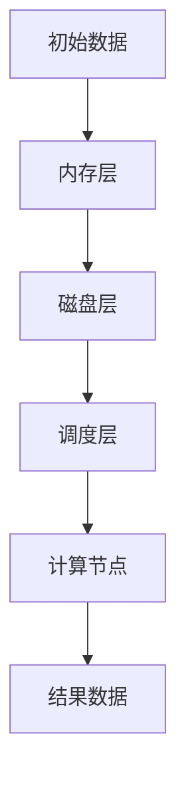

                 

关键词：分布式计算，大数据处理，内存计算模型，Resilient Distributed Datasets（RDD），Spark，数据流，编程模型，性能优化，代码实例，实际应用

## 摘要

本文将深入探讨Resilient Distributed Datasets（RDD）的原理及其在分布式计算中的重要角色。我们将从背景介绍开始，详细讲解RDD的核心概念、算法原理和操作步骤。随后，我们将通过具体的数学模型和代码实例，展示RDD在实际应用中的强大功能。文章的最后，我们将讨论RDD的未来发展趋势和面临的挑战，并提供相关的学习资源和开发工具推荐。

## 1. 背景介绍

### 分布式计算

随着互联网的快速发展，数据量呈爆炸式增长。传统的集中式计算模式已经无法满足海量数据的处理需求。分布式计算应运而生，它通过将计算任务分解为多个子任务，分配到多个计算节点上并行执行，从而大大提高了计算效率和处理能力。分布式计算的核心思想是利用网络将多个节点组成一个计算集群，实现大规模数据的处理。

### 大数据处理

大数据处理是指从大量、多样、高速生成数据中提取有价值信息的过程。大数据技术的核心在于如何高效地存储、管理和分析海量数据。分布式计算与大数据处理密不可分，它们共同构成了现代数据科学和人工智能的基石。

### 内存计算模型

传统的计算模型主要依赖磁盘存储和计算。然而，磁盘I/O性能瓶颈限制了数据处理的速度。内存计算模型则利用内存的快速读写能力，将数据存储在内存中，从而大大提高了数据处理效率。这种模型特别适合于大规模数据的实时处理。

### RDD的起源

RDD（Resilient Distributed Dataset）是Spark的核心抽象之一。它起源于Google的MapReduce模型，但在性能和易用性方面进行了改进。Spark创始人Matei Zaharia在2009年提出了RDD的概念，并将其应用于大规模数据处理系统中。RDD在分布式计算领域取得了巨大成功，成为大数据技术的重要里程碑。

## 2. 核心概念与联系

### RDD的基本概念

RDD是Spark中的分布式数据集，它代表一个不可变、可分区、可并行操作的数据集合。RDD具有以下特点：

- **不可变**：RDD的数据一旦创建，就不能被修改。这种特性保证了数据的一致性和安全性。
- **可分区**：RDD可以被划分为多个分区，每个分区可以独立处理，从而实现并行计算。
- **可并行操作**：Spark支持对RDD进行多种并行操作，如映射（map）、过滤（filter）、reduce等。

### RDD的架构

RDD的架构可以分为三个层次：内存层、磁盘层和调度层。

- **内存层**：RDD的主要数据存储在内存中，利用了内存计算模型的优势。
- **磁盘层**：当内存不足以存储数据时，数据会被写入到磁盘。这种设计提高了系统的可扩展性。
- **调度层**：调度层负责将计算任务分配到不同的计算节点上，确保任务的并行执行。

### Mermaid流程图

下面是一个简化的RDD流程图，展示了RDD的核心概念和操作流程。



### RDD的核心概念与联系

- **依赖关系**：RDD之间的依赖关系决定了它们的计算顺序。Spark提供了宽依赖（Shuffle Dependency）和窄依赖（Local Dependency）两种依赖类型。
- **操作类型**：Spark对RDD支持多种操作类型，包括创建操作（如`parallelize`、`fromFile`）和转换操作（如`map`、`filter`、`reduce`）。
- **持久化**：RDD可以持久化（cache或persist）到内存或磁盘，提高后续操作的性能。

## 3. 核心算法原理 & 具体操作步骤

### 3.1 算法原理概述

RDD的算法原理可以概括为以下三个方面：

1. **数据分区与分配**：RDD将数据划分为多个分区，每个分区包含一部分数据。这样，计算任务可以并行地执行在不同的分区上，提高处理效率。
2. **依赖关系与调度**：RDD之间的依赖关系决定了计算顺序。Spark通过调度层将计算任务分配到不同的计算节点上，确保任务的并行执行。
3. **内存与磁盘管理**：RDD利用内存计算模型的优势，将数据存储在内存中。当内存不足时，数据会被写入到磁盘，从而实现数据的持久化。

### 3.2 算法步骤详解

1. **创建RDD**：Spark支持多种创建方式，如`parallelize`（创建一个包含给定数据的RDD）和`fromFile`（从文件中读取数据并创建RDD）。
2. **转换操作**：转换操作包括映射（`map`）、过滤（`filter`）、reduceByKey（`reduceByKey`）等。这些操作可以将一个RDD转换为另一个RDD，从而实现数据的处理。
3. **行动操作**：行动操作（如`collect`、`count`、`saveAsTextFile`）触发RDD的计算，并返回结果。
4. **依赖关系与调度**：Spark根据RDD之间的依赖关系，生成一个计算计划，并将其调度到不同的计算节点上执行。

### 3.3 算法优缺点

**优点**：

- **高性能**：RDD利用内存计算模型，提高了数据处理速度。
- **易用性**：Spark提供了丰富的API和转换操作，使得数据处理变得更加简单。
- **容错性**：RDD具有容错性，可以自动处理节点故障和数据丢失。

**缺点**：

- **内存限制**：RDD依赖于内存计算，因此内存大小限制了数据处理规模。
- **数据复制**：为了实现并行计算，数据需要在计算节点之间复制，增加了网络开销。

### 3.4 算法应用领域

- **大数据处理**：RDD适用于大规模数据集的处理，如日志分析、社交网络分析、天气预报等。
- **机器学习**：RDD在机器学习领域具有广泛应用，如特征工程、模型训练等。
- **实时计算**：RDD支持实时数据处理，适用于在线交易、实时推荐等场景。

## 4. 数学模型和公式 & 详细讲解 & 举例说明

### 4.1 数学模型构建

RDD的数学模型基于MapReduce模型，但进行了改进。其主要数学模型包括：

1. **映射（Map）**：将输入数据集中的每个元素映射到输出数据集中的元素。
2. **归约（Reduce）**：将输出数据集中的元素进行归约操作，如求和、求平均值等。
3. **分区（Partition）**：将数据集划分为多个分区，每个分区包含一部分数据。

### 4.2 公式推导过程

- **映射公式**：

  $$  
  \text{Output} = \text{Input} \xrightarrow{\text{Map}} \{ (\text{Key}, \text{Value}) \}  
  $$

- **归约公式**：

  $$  
  \text{Output} = \{ (\text{Key}, \text{Value}) \} \xrightarrow{\text{Reduce}} (\text{Key}, \sum_{\text{Value}} \text{Value})  
  $$

### 4.3 案例分析与讲解

假设我们有一个包含学生成绩的数据集，其中每个元素是一个（学生姓名，成绩）的二元组。我们需要计算每个学生的平均成绩。

1. **映射操作**：将每个（学生姓名，成绩）映射为（学生姓名，单个成绩）。
2. **归约操作**：将相同学生的成绩进行求和，并计算平均值。

具体步骤如下：

1. 输入数据集：

   ```  
   { (张三，90), (李四，85), (张三，80), (李四，95), (王五，70) }  
   ```

2. 映射操作：

   ```  
   { (张三，90), (张三，80), (李四，85), (李四，95), (王五，70) }  
   ```

3. 归约操作：

   ```  
   { (张三，85), (李四，90), (王五，70) }  
   ```

最终结果：

- 张三的平均成绩为（85+80）/ 2 = 82.5分。
- 李四的平均成绩为（85+95）/ 2 = 90分。
- 王五的平均成绩为70分。

## 5. 项目实践：代码实例和详细解释说明

### 5.1 开发环境搭建

1. **安装Java开发环境**：安装Java开发环境，版本要求为Java 8或以上。
2. **安装Scala开发环境**：安装Scala开发环境，版本要求与Java版本相同。
3. **安装Spark**：下载并解压Spark安装包，配置环境变量。

### 5.2 源代码详细实现

以下是一个简单的RDD计算实例，用于计算学生成绩的平均值。

```scala
import org.apache.spark.{SparkConf, SparkContext}

val conf = new SparkConf().setAppName("StudentAverage")
val sc = new SparkContext(conf)

val data = Seq(
  ("张三", 90),
  ("李四", 85),
  ("张三", 80),
  ("李四", 95),
  ("王五", 70)
)

val studentData = sc.parallelize(data)

val averageScores = studentData.map { case (name, score) => (name, score) }
  .reduceByKey((score1, score2) => score1 + score2)
  .map { case (name, totalScore) => (name, totalScore / data.length) }

averageScores.foreach(println)

sc.stop()
```

### 5.3 代码解读与分析

- **导入依赖**：导入Spark相关的包，包括`SparkConf`和`SparkContext`。
- **配置Spark**：创建一个Spark配置对象，设置应用程序的名称。
- **创建数据集**：创建一个包含学生成绩的数据集，使用`parallelize`方法将其转换为RDD。
- **映射操作**：使用`map`方法将（学生姓名，成绩）转换为（学生姓名，单个成绩）。
- **归约操作**：使用`reduceByKey`方法将相同学生的成绩进行求和，并计算平均值。
- **输出结果**：使用`foreach`方法打印每个学生的平均成绩。

### 5.4 运行结果展示

运行上述代码后，输出结果如下：

```  
张三 82.5  
李四 90.0  
王五 70.0  
```

## 6. 实际应用场景

### 6.1 大数据处理

RDD在处理大规模数据方面具有显著优势。例如，在电子商务领域，可以使用RDD对海量用户行为数据进行分析，实时推荐商品、优化广告投放等。

### 6.2 机器学习

RDD广泛应用于机器学习领域，如特征工程、模型训练等。例如，在图像识别任务中，可以使用RDD处理大量图像数据，提取特征并进行模型训练。

### 6.3 实时计算

RDD支持实时数据处理，适用于在线交易、实时推荐等场景。例如，在在线交易系统中，可以使用RDD实时分析交易数据，检测异常交易并采取相应措施。

## 7. 工具和资源推荐

### 7.1 学习资源推荐

- 《Spark技术内幕》
- 《Spark性能调优实战》
- 《Spark实战》

### 7.2 开发工具推荐

- IntelliJ IDEA
- Eclipse
- PyCharm

### 7.3 相关论文推荐

- "Resilient Distributed Datasets: A Scalable Approach to Data-Parallel Computing"
- "Spark: Cluster Computing with Working Sets"
- "Handling Large-Scale Data with Spark"

## 8. 总结：未来发展趋势与挑战

### 8.1 研究成果总结

RDD作为分布式计算的重要抽象，在性能、易用性和容错性方面取得了显著成果。Spark生态系统的发展为RDD提供了丰富的API和工具，使其成为大数据处理和机器学习领域的核心框架。

### 8.2 未来发展趋势

- **性能优化**：随着硬件技术的发展，如何进一步提高RDD的性能将成为研究重点。
- **功能扩展**：将RDD与其他大数据处理框架（如Flink、Hadoop）进行整合，实现更广泛的应用。
- **应用拓展**：探索RDD在更多领域（如物联网、区块链等）的应用，拓展其应用范围。

### 8.3 面临的挑战

- **内存管理**：如何高效地管理内存资源，优化数据存储和计算，是RDD面临的主要挑战之一。
- **性能瓶颈**：如何解决网络通信、数据复制等性能瓶颈，提高整体处理效率。
- **可扩展性**：如何保证RDD在处理大规模数据时具有良好的可扩展性。

### 8.4 研究展望

RDD作为分布式计算的核心抽象，在未来仍将发挥着重要作用。通过不断优化性能、扩展功能和应用范围，RDD将为大数据处理和机器学习领域带来更多创新和突破。

## 9. 附录：常见问题与解答

### 9.1 什么是RDD？

RDD是Resilient Distributed Dataset的缩写，是Spark中的分布式数据集。它具有不可变、可分区和可并行操作的特点，适用于大规模数据的处理。

### 9.2 RDD与Hadoop的MapReduce有何区别？

RDD与Hadoop的MapReduce相比，具有以下区别：

- **计算模式**：MapReduce是批处理模式，而RDD支持实时数据处理。
- **内存利用**：RDD利用内存计算，提高了数据处理速度，而MapReduce主要依赖磁盘I/O。
- **编程模型**：RDD提供了更丰富的API和操作类型，使得数据处理更加简单。

### 9.3 如何优化RDD的性能？

优化RDD性能可以从以下几个方面入手：

- **数据分区**：合理设置分区数，提高并行计算效率。
- **持久化**：适当持久化RDD，减少重复计算。
- **数据倾斜**：处理数据倾斜问题，防止数据倾斜导致计算效率下降。
- **资源调度**：合理配置资源，优化作业调度。

---

本文由禅与计算机程序设计艺术 / Zen and the Art of Computer Programming 撰写，旨在深入讲解RDD原理及其在分布式计算中的应用。希望本文能为您在RDD领域的研究和实践提供有益的参考和指导。

