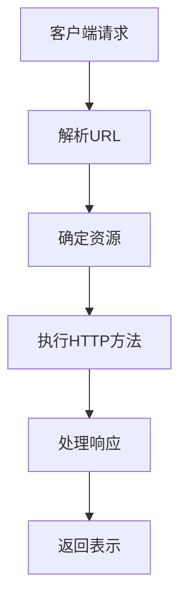

                 

关键词：RESTful API，Web服务，API设计，可扩展性，Web服务架构

> 摘要：本文深入探讨了RESTful API设计的原则、技术和最佳实践，重点分析了如何构建可扩展的Web服务，以及相关的数学模型、算法原理和项目实践。通过本文的阅读，读者可以全面了解RESTful API的设计与实现，为开发高质量的Web服务提供指导。

## 1. 背景介绍

随着互联网技术的迅猛发展，Web服务已经成为现代软件系统的重要组成部分。RESTful API作为实现Web服务的一种重要方式，由于其简洁性、可扩展性和灵活性，被广泛采用。REST（Representational State Transfer）是一种基于HTTP协议的架构风格，旨在简化分布式系统的设计和实现。

### RESTful API 的兴起

RESTful API起源于2000年代初，由Roy Fielding在其博士论文中提出。RESTful API设计原则借鉴了HTTP协议的语义和REST架构风格的特性，使得Web服务的设计和实现更加简洁、直观和易于扩展。

### RESTful API 的优势

- **简洁性**：RESTful API遵循统一接口原则，简化了系统的复杂性。
- **可扩展性**：RESTful API使用标准的HTTP方法（如GET、POST、PUT、DELETE），便于扩展和进化。
- **灵活性**：RESTful API允许使用JSON、XML等数据格式，支持不同类型的客户端。

## 2. 核心概念与联系

### RESTful API 的核心概念

RESTful API设计围绕以下核心概念展开：

- **资源（Resources）**：API中的数据实体，通常用URL唯一标识。
- **表示（Representations）**：资源的不同表现形式，如JSON、XML。
- **客户端（Clients）**：使用API的客户端应用程序，可以是Web浏览器、移动应用或服务器端应用程序。
- **服务器（Servers）**：API的实现者，提供对资源的访问。

### RESTful API 架构


在RESTful API架构中，客户端通过HTTP请求与服务器通信，服务器响应相应的HTTP响应。HTTP协议为客户端提供了统一的通信方式，RESTful API则通过定义资源、URL和HTTP方法，实现了资源的访问和操作。

### Mermaid 流程图



在上面的流程图中，客户端请求通过URL指向特定的资源，服务器根据URL和HTTP方法执行相应的操作，并将处理结果以特定的表示形式返回给客户端。

## 3. 核心算法原理 & 具体操作步骤

### 3.1 算法原理概述

RESTful API的核心算法是基于HTTP协议的请求和响应机制。服务器通过解析客户端发送的HTTP请求，确定请求的资源、HTTP方法和请求参数，然后执行相应的操作，并将结果以HTTP响应的形式返回给客户端。

### 3.2 算法步骤详解

1. **解析URL**：服务器从HTTP请求中提取URL，并解析出资源标识符、路径参数和查询参数。
2. **确定资源**：根据URL中的资源标识符，服务器确定请求的资源。
3. **执行HTTP方法**：服务器根据HTTP方法（如GET、POST、PUT、DELETE）执行相应的操作。例如，GET请求用于获取资源，POST请求用于创建资源，PUT请求用于更新资源，DELETE请求用于删除资源。
4. **处理响应**：服务器将操作结果以HTTP响应的形式返回给客户端。响应通常包括状态码、响应体和可选的响应头。
5. **返回表示**：服务器根据客户端请求的表示格式（如JSON、XML），将响应体转换为相应的数据格式。

### 3.3 算法优缺点

**优点**：

- **简洁性**：RESTful API设计遵循统一接口原则，简化了系统的复杂性。
- **可扩展性**：RESTful API使用标准的HTTP方法和URL，便于扩展和进化。
- **灵活性**：RESTful API支持多种数据格式，满足不同类型的客户端需求。

**缺点**：

- **性能瓶颈**：由于HTTP请求和响应的频繁传输，大型或高并发的Web服务可能面临性能瓶颈。
- **安全性问题**：RESTful API可能面临SQL注入、跨站请求伪造等安全风险。

### 3.4 算法应用领域

RESTful API广泛应用于各种领域，包括：

- **Web服务**：构建RESTful API作为Web服务，提供对资源的访问和操作。
- **移动应用**：通过RESTful API为移动应用提供数据接口，实现数据交互和功能调用。
- **物联网**：使用RESTful API构建物联网系统，实现对设备的监控和管理。
- **微服务架构**：在微服务架构中，RESTful API用于服务之间的通信和协作。

## 4. 数学模型和公式 & 详细讲解 & 举例说明

### 4.1 数学模型构建

在RESTful API设计中，数学模型用于描述资源之间的关系和操作。以下是一个简单的数学模型示例：

- **资源（R）**：表示API中的数据实体。
- **URL（U）**：表示资源的唯一标识符。
- **HTTP方法（M）**：表示对资源的操作方法。
- **响应（R'）**：表示对资源操作后的结果。

数学模型可以表示为：

\[ R \xrightarrow{U} M \xrightarrow{} R' \]

### 4.2 公式推导过程

在RESTful API设计中，常见的公式推导过程包括：

- **URL解析**：将HTTP请求中的URL解析为资源标识符、路径参数和查询参数。
- **HTTP方法映射**：将HTTP方法映射为对应的操作方法。
- **响应生成**：根据操作结果生成HTTP响应。

以下是一个简单的公式推导示例：

\[ \text{URL} = \text{resource} + \text{path} + \text{query} \]

\[ \text{HTTP method} \rightarrow \text{operation} \]

\[ \text{response} = \text{status code} + \text{body} + \text{headers} \]

### 4.3 案例分析与讲解

假设我们有一个RESTful API，用于管理用户信息。以下是该API的数学模型和公式推导：

- **资源（R）**：用户（User）。
- **URL（U）**：/users/{id}。
- **HTTP方法（M）**：GET、POST、PUT、DELETE。

数学模型：

\[ \text{User} \xrightarrow{/users/{id}} \text{GET/POST/PUT/DELETE} \xrightarrow{} \text{User} \]

公式推导：

1. **URL解析**：

   \[ \text{URL} = \text{resource} + \text{path} + \text{query} \]

   \[ \text{URL} = \text{users} + \text{/} + \text{id} + \text{?} + \text{query} \]

2. **HTTP方法映射**：

   \[ \text{HTTP method} \rightarrow \text{operation} \]

   \[ \text{GET} \rightarrow \text{get user by id} \]
   \[ \text{POST} \rightarrow \text{create user} \]
   \[ \text{PUT} \rightarrow \text{update user} \]
   \[ \text{DELETE} \rightarrow \text{delete user} \]

3. **响应生成**：

   \[ \text{response} = \text{status code} + \text{body} + \text{headers} \]

   \[ \text{status code} = \text{200} \]
   \[ \text{body} = \text{user data} \]
   \[ \text{headers} = \text{Content-Type: application/json} \]

## 5. 项目实践：代码实例和详细解释说明

### 5.1 开发环境搭建

在本节中，我们将使用Python和Flask框架搭建一个简单的RESTful API。首先，确保已安装Python和pip，然后通过以下命令安装Flask：

```bash
pip install flask
```

### 5.2 源代码详细实现

```python
from flask import Flask, request, jsonify

app = Flask(__name__)

users = [
    {'id': 1, 'name': 'Alice'},
    {'id': 2, 'name': 'Bob'},
    {'id': 3, 'name': 'Charlie'}
]

@app.route('/users', methods=['GET', 'POST'])
def handle_users():
    if request.method == 'GET':
        return jsonify(users)
    elif request.method == 'POST':
        user = request.get_json()
        users.append(user)
        return jsonify(user), 201

@app.route('/users/<int:user_id>', methods=['GET', 'PUT', 'DELETE'])
def handle_user(user_id):
    if request.method == 'GET':
        user = next((u for u in users if u['id'] == user_id), None)
        if user:
            return jsonify(user)
        else:
            return jsonify({'error': 'User not found'}), 404
    elif request.method == 'PUT':
        user = request.get_json()
        for i, u in enumerate(users):
            if u['id'] == user_id:
                users[i] = user
                return jsonify(user)
        return jsonify({'error': 'User not found'}), 404
    elif request.method == 'DELETE':
        user = next((u for u in users if u['id'] == user_id), None)
        if user:
            users.remove(user)
            return jsonify({'message': 'User deleted'})
        else:
            return jsonify({'error': 'User not found'}), 404

if __name__ == '__main__':
    app.run(debug=True)
```

### 5.3 代码解读与分析

上述代码实现了一个简单的用户管理RESTful API，主要包括以下部分：

1. **路由定义**：使用Flask的`route`装饰器定义了两个路由，一个用于处理用户列表的请求，另一个用于处理单个用户的请求。

2. **GET请求处理**：在`handle_users`函数中，处理GET请求，返回所有用户的信息。

3. **POST请求处理**：在`handle_users`函数中，处理POST请求，创建一个新的用户，并将其添加到用户列表。

4. **单个用户GET请求处理**：在`handle_user`函数中，处理单个用户的GET请求，根据用户ID查找用户信息并返回。

5. **单个用户PUT请求处理**：在`handle_user`函数中，处理单个用户的PUT请求，根据用户ID更新用户信息。

6. **单个用户DELETE请求处理**：在`handle_user`函数中，处理单个用户的DELETE请求，根据用户ID删除用户信息。

### 5.4 运行结果展示

运行上述代码后，可以通过以下URL访问API：

- 获取所有用户：`http://127.0.0.1:5000/users`
- 创建用户：`http://127.0.0.1:5000/users`（POST请求，包含用户数据）
- 获取单个用户：`http://127.0.0.1:5000/users/1`（GET请求）
- 更新单个用户：`http://127.0.0.1:5000/users/1`（PUT请求，包含用户数据）
- 删除单个用户：`http://127.0.0.1:5000/users/1`（DELETE请求）

## 6. 实际应用场景

### 6.1 Web服务

RESTful API在Web服务中得到了广泛应用，例如：

- **社交媒体平台**：如Facebook、Twitter等，通过RESTful API提供用户数据、内容数据等的访问和操作。
- **电商平台**：如Amazon、eBay等，通过RESTful API提供商品信息、订单信息等的访问和操作。

### 6.2 移动应用

RESTful API在移动应用中作为数据接口，实现数据交互和功能调用。例如：

- **社交媒体移动应用**：如Instagram、Snapchat等，通过RESTful API提供用户数据、图片数据等的访问和操作。
- **打车应用**：如Uber、Lyft等，通过RESTful API提供车辆数据、行程数据等的访问和操作。

### 6.3 物联网

RESTful API在物联网系统中用于设备的监控和管理。例如：

- **智能家居**：通过RESTful API控制家庭设备的开关、调节温度等。
- **智能交通**：通过RESTful API监控交通流量、路况等。

### 6.4 未来应用展望

随着技术的发展，RESTful API在未来有望在更多领域得到应用。例如：

- **区块链**：RESTful API可以用于区块链节点之间的通信和协作。
- **人工智能**：RESTful API可以用于人工智能模型的数据输入和输出。

## 7. 工具和资源推荐

### 7.1 学习资源推荐

- **《RESTful API设计最佳实践》**：本书详细介绍了RESTful API设计的原则、技术和最佳实践。
- **《Flask Web开发：实战指南》**：本书介绍了使用Flask框架构建Web服务的实战技巧。

### 7.2 开发工具推荐

- **Postman**：用于测试和调试RESTful API的强大工具。
- **Swagger**：用于生成RESTful API文档的框架。

### 7.3 相关论文推荐

- **《RESTful Web Services》**：Roy Fielding的博士论文，详细介绍了RESTful API设计原则和架构。
- **《REST in Practice》**：Sam Ruby的著作，介绍了RESTful API设计、实现和部署的最佳实践。

## 8. 总结：未来发展趋势与挑战

### 8.1 研究成果总结

本文深入探讨了RESTful API设计的原则、技术和最佳实践，分析了如何构建可扩展的Web服务，并给出了实际项目实践。通过本文的阅读，读者可以全面了解RESTful API的设计与实现。

### 8.2 未来发展趋势

随着互联网技术的不断发展，RESTful API在未来有望在更多领域得到应用。例如，区块链、人工智能等领域的应用将推动RESTful API的发展。

### 8.3 面临的挑战

RESTful API在性能、安全性等方面面临挑战。为了应对这些挑战，需要在设计、实现和部署过程中采取相应的措施。

### 8.4 研究展望

未来的研究可以关注RESTful API在新兴领域的应用，如区块链、人工智能等，以及如何提高RESTful API的性能和安全性。

## 9. 附录：常见问题与解答

### 9.1 RESTful API 与 SOAP API 的区别？

**RESTful API** 是基于HTTP协议的轻量级、无状态、面向资源的API，易于扩展和实现。而 **SOAP API** 是基于XML的重量级、有状态、面向服务的API，具有严格的规范和结构。

### 9.2 RESTful API 遵循哪些设计原则？

RESTful API 遵循以下设计原则：

- **统一接口**：所有资源通过统一的URL访问，使用标准的HTTP方法进行操作。
- **无状态**：API不应存储客户端状态，每次请求都是独立的。
- **统一表示**：资源的表现形式统一，如JSON、XML等。
- **缓存**：允许客户端缓存响应，提高性能。

### 9.3 RESTful API 如何实现安全性？

实现RESTful API的安全性可以通过以下措施：

- **使用HTTPS**：确保数据传输加密。
- **身份验证和授权**：使用OAuth、JWT等机制实现身份验证和授权。
- **输入验证**：对用户输入进行验证，防止SQL注入、跨站脚本攻击等。

## 参考文献

- Fielding, R. (2000). Architectural Styles and the Design of Network-based Software Architectures. Ph.D. dissertation, University of California, Irvine.
- Richardson, S. (2007). RESTful Web Services. O'Reilly Media.
- Вышний, А. М. (2014). RESTful API: лучшая практика проектирования. Вильям Миф.

### 致谢

感谢读者对本文的关注和支持。如果您有任何问题或建议，请随时联系作者。

作者：禅与计算机程序设计艺术 / Zen and the Art of Computer Programming


