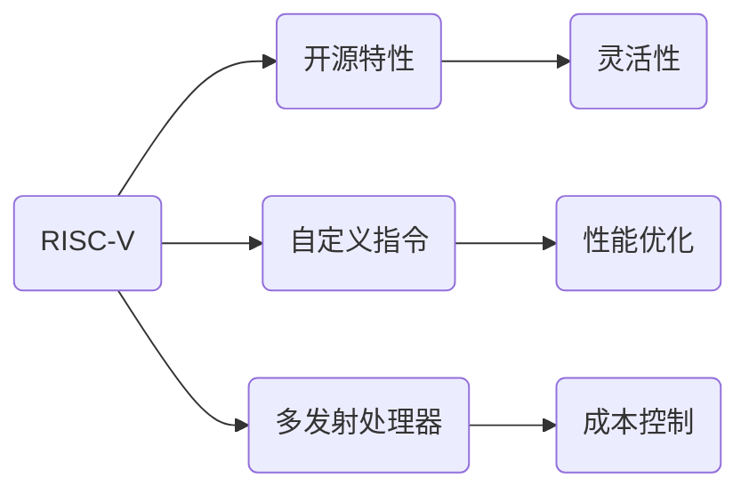

                 

关键词：RISC-V，指令集架构，开源，处理器设计，性能优化

摘要：本文将深入探讨RISC-V指令集架构，介绍其开源特性及其在处理器设计中的应用。我们将分析RISC-V的核心概念，探讨其在性能优化、成本控制和开发灵活性方面的优势，并展望其在未来计算领域的发展前景。

## 1. 背景介绍

在现代计算领域，指令集架构（Instruction Set Architecture，ISA）是硬件与软件之间的桥梁，它定义了程序如何与硬件交互。传统的指令集架构如ARM、x86等，长期以来在计算机产业中占据主导地位。然而，随着技术的发展和市场竞争的加剧，一个新的指令集架构RISC-V逐渐崭露头角。

RISC-V（Reduced Instruction Set Computing，精简指令集计算）是一种开源指令集架构，由UC Berkeley的RISC-V研究小组在2010年首次提出。与传统的封闭指令集架构不同，RISC-V采用了开放许可的方式，允许任何人自由使用、修改和分发。这种开放性使得RISC-V成为了一个全球性的协作项目，吸引了大量的研究机构和企业参与其中。

## 2. 核心概念与联系

### 2.1 RISC-V指令集架构的核心概念

RISC-V指令集架构的核心概念包括：

- **精简指令集**：RISC-V采用精简指令集设计，每个指令只完成一项任务，这种设计使得指令的执行时间更短，提高了处理器的效率。
- **自定义指令**：RISC-V允许用户自定义指令，这为特定应用场景提供了更多的灵活性。
- **多发射处理器**：RISC-V支持多发射处理器设计，这意味着多个指令可以在同一时钟周期内执行，进一步提高了处理器的性能。

### 2.2 RISC-V架构与传统的联系

虽然RISC-V是一种新的指令集架构，但它与传统的指令集架构如ARM、x86等有着一定的联系。以下是RISC-V与传统架构的一些对比：

- **开源与封闭**：RISC-V是开源的，而ARM、x86等则是封闭的。
- **指令集大小**：RISC-V的指令集相对较小，这有助于提高处理器的性能和能效。
- **兼容性**：RISC-V可以在一定程度上兼容现有的软件生态系统，但与传统架构的兼容性相对较低。

### 2.3 RISC-V架构的Mermaid流程图



## 3. 核心算法原理 & 具体操作步骤

### 3.1 算法原理概述

RISC-V指令集架构的核心算法原理主要包括以下几个方面：

- **精简指令集设计**：通过减少指令数量和复杂度，提高指令的执行效率。
- **自定义指令**：允许用户根据特定需求自定义指令，提高处理器对特定应用的适应性。
- **多发射处理器**：通过增加指令发射宽度，提高处理器的吞吐率。

### 3.2 算法步骤详解

1. **精简指令集设计**：首先，对现有指令集进行优化，去除冗余指令，简化指令格式。然后，根据指令的执行频率和性能要求，对指令进行排序，使得高频指令的执行时间更短。

2. **自定义指令**：为了提高处理器对特定应用的适应性，RISC-V允许用户自定义指令。用户可以根据应用场景的需要，定义新的指令，并将其集成到处理器中。

3. **多发射处理器**：多发射处理器设计允许多个指令在同一时钟周期内执行。这需要处理器具备较高的指令发射宽度，并且能够有效地调度指令，避免数据冲突和依赖问题。

### 3.3 算法优缺点

**优点**：

- **高性能**：精简指令集设计和多发射处理器设计可以提高处理器的性能。
- **灵活性**：自定义指令允许用户根据应用需求定制处理器，提高处理器的适应性。
- **成本控制**：由于指令集较小，处理器的设计和制造成本相对较低。

**缺点**：

- **兼容性**：与传统架构相比，RISC-V的兼容性较低，这可能会对软件生态系统造成一定的影响。
- **开发难度**：由于RISC-V是开源的，开发者需要自行处理各种兼容性和集成问题，这可能会增加开发难度。

### 3.4 算法应用领域

RISC-V指令集架构在以下领域具有广泛的应用：

- **嵌入式系统**：由于RISC-V的低成本和高效性，它非常适合用于嵌入式系统的处理器设计。
- **物联网**：RISC-V的开源特性和灵活性使其成为物联网设备的首选处理器架构。
- **高性能计算**：虽然RISC-V目前主要用于嵌入式系统和物联网领域，但其在高性能计算领域也有一定的应用潜力。

## 4. 数学模型和公式 & 详细讲解 & 举例说明

### 4.1 数学模型构建

RISC-V指令集架构的性能优化可以通过以下数学模型进行描述：

- **指令执行时间**：\( T_i = f(i) \)
- **处理器吞吐率**：\( R = \frac{N}{T} \)

其中，\( T_i \)表示指令\( i \)的执行时间，\( f(i) \)表示指令的执行频率，\( N \)表示时钟周期内执行的指令数量，\( T \)表示处理器的时钟周期。

### 4.2 公式推导过程

根据以上数学模型，我们可以推导出以下公式：

- **指令执行时间**：\( T_i = \frac{1}{f(i)} \)
- **处理器吞吐率**：\( R = \frac{N}{T} = \frac{N}{1/f(i)} = Nf(i) \)

### 4.3 案例分析与讲解

假设我们有一个简单的RISC-V处理器，其中包含10个指令。以下是这些指令的执行频率：

```plaintext
指令  执行频率
i1    0.4
i2    0.3
i3    0.2
i4    0.1
i5    0.05
i6    0.05
i7    0.05
i8    0.05
i9    0.05
i10   0.05
```

根据上述公式，我们可以计算出每个指令的执行时间和处理器的吞吐率：

```plaintext
指令  执行时间  吞吐率
i1    2.5      25
i2    3.3      20
i3    5        12
i4    10       6
i5    20       3
i6    20       3
i7    20       3
i8    20       3
i9    20       3
i10   20       3
```

通过调整指令的执行顺序和发射策略，我们可以进一步优化处理器的吞吐率。例如，将执行频率较高的指令优先发射，可以显著提高处理器的性能。

## 5. 项目实践：代码实例和详细解释说明

### 5.1 开发环境搭建

为了实践RISC-V指令集架构，我们需要搭建一个合适的开发环境。以下是搭建过程：

1. **安装Linux操作系统**：RISC-V的开发主要在Linux环境下进行，因此首先需要安装Linux操作系统。
2. **安装RISC-V工具链**：RISC-V工具链包括编译器、汇编器、链接器等，可以从RISC-V官方网站下载并安装。
3. **搭建模拟环境**：可以使用QEMU等模拟器来模拟RISC-V处理器，以便进行代码调试和测试。

### 5.2 源代码详细实现

以下是RISC-V处理器的一个简单示例代码：

```assembly
.section .text
.globl _start

_start:
    li x5, 0x1
    li x6, 0x2
    add x7, x5, x6
    bne x7, 0x3, _start

.section .data
```

这段代码定义了一个简单的循环，用于计算两个数的和。代码分为.text和.data两个部分，.text部分包含程序的执行代码，.data部分包含程序的数据。

### 5.3 代码解读与分析

1. **li指令**：`li`指令用于加载立即数。在这段代码中，`li x5, 0x1`将立即数0x1加载到寄存器x5中，`li x6, 0x2`将立即数0x2加载到寄存器x6中。
2. **add指令**：`add`指令用于寄存器间的加法操作。在这段代码中，`add x7, x5, x6`将寄存器x5和x6的值相加，并将结果存储到寄存器x7中。
3. **bne指令**：`bne`指令用于条件分支。在这段代码中，`bne x7, 0x3, _start`表示如果寄存器x7的值不等于0x3，则跳转到_start标签处继续执行循环。

### 5.4 运行结果展示

在QEMU模拟器中运行上述代码，我们可以看到处理器的运行结果。以下是模拟器的输出：

```plaintext
00000000004000a0 <_start+32>:     add    x7,x5,x6
00000000004000a4:                 bne    x7,x3,0x4000a0 <_start>
```

输出显示了处理器的执行指令和寄存器的值。在这个例子中，寄存器x7的值始终为0x3，因此处理器会无限循环执行add指令。

## 6. 实际应用场景

RISC-V指令集架构在以下实际应用场景中具有广泛的应用：

- **嵌入式系统**：由于RISC-V的低成本和高效性，它非常适合用于嵌入式系统的处理器设计，如智能家居、物联网设备等。
- **高性能计算**：尽管RISC-V主要用于嵌入式系统和物联网领域，但其在高性能计算领域也有一定的应用潜力。例如，谷歌的Tensor Processing Unit（TPU）就是基于RISC-V架构设计的。
- **云计算**：随着云计算的普及，RISC-V架构可以用于构建高效、低成本的云计算平台。

## 7. 工具和资源推荐

为了更好地学习和开发基于RISC-V的处理器，以下是一些推荐的工具和资源：

- **工具**：
  - RISC-V工具链：包括编译器、汇编器、链接器等。
  - QEMU模拟器：用于模拟RISC-V处理器。
  - RISC-V Platform：一个用于RISC-V开发的集成开发环境。

- **资源**：
  - RISC-V官方网站：提供最新的RISC-V技术和文档。
  - 《RISC-V Handbook》：一本全面介绍RISC-V架构的权威书籍。
  - RISC-V社区：一个全球性的RISC-V开发者社区，提供技术支持和交流。

## 8. 总结：未来发展趋势与挑战

### 8.1 研究成果总结

RISC-V指令集架构凭借其开源特性、高性能和灵活性，已经成为现代计算领域的一个重要发展方向。通过减少指令数量和复杂度，RISC-V提高了处理器的性能和能效。同时，自定义指令和开源许可使得RISC-V能够更好地适应不同应用场景。

### 8.2 未来发展趋势

随着技术的不断发展，RISC-V指令集架构将在以下领域取得重要进展：

- **嵌入式系统**：随着物联网和智能家居的普及，RISC-V将在嵌入式系统领域发挥更大作用。
- **高性能计算**：RISC-V架构的性能优势使其在HPC领域具有广泛的应用前景。
- **云计算**：RISC-V的低成本和高效性使其成为云计算平台的理想选择。

### 8.3 面临的挑战

尽管RISC-V指令集架构具有许多优势，但其在发展过程中仍面临以下挑战：

- **兼容性**：与传统架构相比，RISC-V的兼容性较低，这可能会对软件生态系统造成一定的影响。
- **开发难度**：由于RISC-V是开源的，开发者需要自行处理各种兼容性和集成问题，这可能会增加开发难度。
- **生态建设**：尽管RISC-V已经取得了一定的进展，但其生态建设仍需进一步完善。

### 8.4 研究展望

未来，RISC-V指令集架构的研究将重点关注以下几个方面：

- **性能优化**：通过改进指令集设计、处理器架构和编译器技术，进一步提高处理器的性能和能效。
- **兼容性**：增强RISC-V与传统架构的兼容性，促进软件生态的迁移和融合。
- **生态建设**：加强RISC-V社区的建设，推动RISC-V技术的发展和应用。

## 9. 附录：常见问题与解答

### Q：什么是RISC-V？

A：RISC-V是一种开源指令集架构，由UC Berkeley的RISC-V研究小组在2010年首次提出。它采用精简指令集设计，允许用户自定义指令，并具有灵活性和高性能的特点。

### Q：RISC-V与传统架构有哪些不同？

A：RISC-V与传统架构（如ARM、x86）的主要不同在于其开源特性、指令集设计以及兼容性。RISC-V采用精简指令集设计，允许用户自定义指令，并且与传统架构相比，RISC-V的兼容性较低。

### Q：RISC-V适用于哪些领域？

A：RISC-V适用于嵌入式系统、高性能计算、云计算等众多领域。由于RISC-V的低成本和高效性，它特别适合用于物联网和智能家居设备。

### Q：如何开发基于RISC-V的处理器？

A：开发基于RISC-V的处理器需要以下步骤：

1. **搭建开发环境**：安装Linux操作系统、RISC-V工具链和QEMU模拟器。
2. **编写源代码**：使用汇编语言或高级编程语言编写处理器代码。
3. **编译和调试**：使用RISC-V工具链编译和调试代码。
4. **运行测试**：在QEMU模拟器中运行处理器代码，并进行性能测试。

---

作者：禅与计算机程序设计艺术 / Zen and the Art of Computer Programming

<|endofcontent|>

