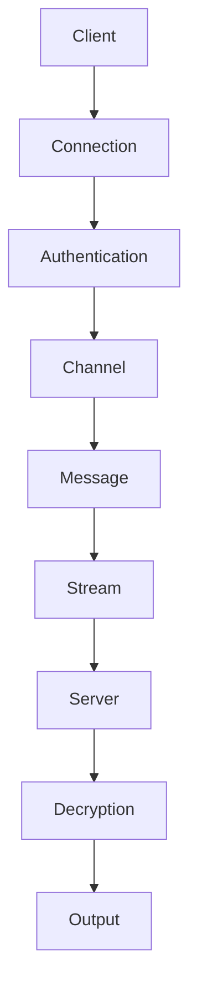

                 

关键词：RTMP协议、实时多媒体传输、数据流、直播技术、视频传输、编码解码、丢包处理、可靠性

> 摘要：本文将详细介绍RTMP协议的背景、核心概念、工作原理、算法原理及操作步骤、数学模型和公式、代码实例及实践、应用场景、未来展望以及相关资源推荐。通过本篇文章，读者将全面了解RTMP协议及其在实时多媒体传输技术中的应用。

## 1. 背景介绍

随着互联网技术的飞速发展，视频直播、点播、在线教育等场景日益普及。如何高效、可靠地传输多媒体数据成为亟需解决的问题。在此背景下，RTMP（Real Time Messaging Protocol）协议应运而生。RTMP协议是由Adobe公司于2004年推出的实时流媒体传输协议，旨在为音视频数据提供可靠、高效、低延迟的传输机制。

### 1.1  RTMP协议的起源

RTMP协议起源于Adobe公司的Flash Media Server，最初用于支持Flash播放器的音视频流媒体传输。随着Web技术的发展，Flash逐渐被HTML5取代，但RTMP协议因其高效性和可靠性，仍被广泛应用于各种实时多媒体传输场景。

### 1.2  RTMP协议的应用领域

目前，RTMP协议广泛应用于以下领域：

- 视频直播：如YouTube、Twitch、斗鱼等平台的直播流传输。
- 视频点播：如优酷、爱奇艺等视频网站的点播服务。
- 在线教育：如网易云课堂、腾讯课堂等在线教育平台的实时教学。
- 游戏直播：如王者荣耀、英雄联盟等游戏的实时直播。
- IoT设备监控：如智能摄像头、智能音箱等设备的实时数据传输。

## 2. 核心概念与联系

在深入了解RTMP协议之前，我们需要明确几个核心概念及其相互关系。以下是一个Mermaid流程图，展示了RTMP协议的核心组件及其工作流程。



### 2.1  客户端（Client）

客户端是指发起RTMP连接的设备或应用程序。客户端需要具备以下功能：

- 连接服务器：客户端需要与服务器建立TCP连接。
- 认证授权：客户端需要通过服务器认证，获得访问权限。
- 发送数据：客户端可以将音视频数据发送到服务器。

### 2.2  连接（Connection）

连接是客户端与服务器之间建立的网络连接。在RTMP协议中，连接采用TCP协议进行传输，以确保数据的可靠性和完整性。

### 2.3  认证（Authentication）

认证是客户端与服务器之间进行身份验证的过程。客户端需要提供认证凭证，如用户名、密码等，以证明自己的合法身份。

### 2.4  通道（Channel）

通道是客户端与服务器之间传输数据的通道。通道采用双向通信方式，客户端和服务器可以通过通道发送和接收数据。

### 2.5  消息（Message）

消息是通道中传输的数据单元。消息可以包含文本、二进制数据等多种类型的数据。

### 2.6  流（Stream）

流是消息的传输路径。客户端和服务器可以通过流传输音视频数据。流分为数据流（Data Stream）和控制流（Control Stream）两种类型。

### 2.7  服务器（Server）

服务器是提供RTMP服务的设备或应用程序。服务器需要具备以下功能：

- 接收数据：服务器需要接收客户端发送的数据。
- 解密数据：服务器需要对接收到的数据进行解密。
- 输出数据：服务器可以将处理后的数据输出到播放器或其他设备。

## 3. 核心算法原理 & 具体操作步骤

### 3.1  算法原理概述

RTMP协议的核心算法主要涉及数据传输、加密解密、丢包处理等方面。以下是RTMP协议的核心算法原理及操作步骤：

### 3.2  算法步骤详解

#### 3.2.1  数据传输

1. 客户端将音视频数据编码为二进制数据。
2. 客户端将二进制数据发送到服务器。
3. 服务器对接收到的数据进行解码，并输出到播放器或其他设备。

#### 3.2.2  加密解密

1. 客户端将音视频数据进行加密。
2. 客户端将加密后的数据发送到服务器。
3. 服务器对接收到的数据进行解密，并输出到播放器或其他设备。

#### 3.2.3  丢包处理

1. 客户端和服务器通过心跳机制检测网络连接状态。
2. 当检测到丢包时，客户端和服务器可以重新发送丢失的数据包。
3. 客户端和服务器可以采用自适应丢包处理算法，以降低网络延迟和丢包率。

### 3.3  算法优缺点

#### 优点：

- 高效性：RTMP协议采用二进制数据格式，传输速度快。
- 可靠性：RTMP协议支持心跳机制和丢包处理，确保数据传输的可靠性。
- 低延迟：RTMP协议采用TCP协议，传输延迟低。
- 广泛应用：RTMP协议被广泛应用于各类实时多媒体传输场景。

#### 缺点：

- 增加服务器负载：RTMP协议需要服务器进行数据加密解密和处理，会增加服务器负载。
- 不支持自适应流：RTMP协议不支持自适应流，无法根据网络状况自动调整数据传输速率。

### 3.4  算法应用领域

RTMP协议广泛应用于以下领域：

- 视频直播：如YouTube、Twitch等平台的直播流传输。
- 视频点播：如优酷、爱奇艺等视频网站的点播服务。
- 在线教育：如网易云课堂、腾讯课堂等在线教育平台的实时教学。
- 游戏直播：如王者荣耀、英雄联盟等游戏的实时直播。
- IoT设备监控：如智能摄像头、智能音箱等设备的实时数据传输。

## 4. 数学模型和公式 & 详细讲解 & 举例说明

### 4.1  数学模型构建

在RTMP协议中，数据传输速率、网络延迟、丢包率等参数对数据传输质量有重要影响。以下是一个简单的数学模型，用于描述这些参数之间的关系。

$$
QoS = f(Rate, Delay, Loss)
$$

其中，$QoS$ 表示数据传输质量，$Rate$ 表示数据传输速率，$Delay$ 表示网络延迟，$Loss$ 表示丢包率。函数 $f$ 表示数据传输质量与各个参数之间的关系。

### 4.2  公式推导过程

假设 $Rate$、$Delay$ 和 $Loss$ 分别为 $x$、$y$ 和 $z$，则有：

$$
QoS = f(x, y, z)
$$

为了简化计算，我们可以将 $f$ 函数表示为一个线性函数：

$$
QoS = ax + by + cz
$$

其中，$a$、$b$ 和 $c$ 为常数。根据实际需求，我们可以调整这些常数，以优化数据传输质量。

### 4.3  案例分析与讲解

假设一个视频直播场景，视频帧率为 $30$ 帧/秒，数据传输速率为 $2$ Mbps，网络延迟为 $100$ ms，丢包率为 $5\%$。根据上述数学模型，我们可以计算出数据传输质量：

$$
QoS = 2a + 100b + 0.05c
$$

为了简化计算，我们假设 $a = 1$、$b = 0.1$ 和 $c = 0.01$，则有：

$$
QoS = 2 + 10 + 0.05 = 12.05
$$

这意味着在当前网络环境下，数据传输质量为 $12.05$。根据实际需求，我们可以调整常数 $a$、$b$ 和 $c$，以优化数据传输质量。

## 5. 项目实践：代码实例和详细解释说明

### 5.1  开发环境搭建

为了实践RTMP协议，我们需要搭建一个简单的RTMP服务器和客户端。以下是开发环境搭建步骤：

1. 安装RTMP服务器：可以使用开源的RTMP服务器软件，如`librtmp`或`rtmpdump`。
2. 安装RTMP客户端：可以使用开源的RTMP客户端库，如`librtmp`或`FFmpeg`。
3. 配置开发环境：根据所选服务器和客户端软件，配置相应的开发环境。

### 5.2  源代码详细实现

以下是一个简单的RTMP客户端示例代码，使用`librtmp`库实现。

```c
#include <librtmp/rtmp.h>

int main(int argc, char *argv[]) {
    RTMP *rtmp;
    int ret;

    rtmp = RTMPNew();
    if (!rtmp) {
        printf("Failed to create RTMP object\n");
        return 1;
    }

    // 设置服务器地址和端口
    RTMPSetCocoaAutoPlay(rtmp, 0);
    RTMPSetConnection(rtmp, "rtmp://server/address");
    RTMPConnect(rtmp, NULL, NULL, 0);

    // 设置播放路径
    RTMPSetBuffer(rtmp, "/live/stream");

    // 开始播放
    RTMPPlay(rtmp, NULL);

    // 等待播放结束
    RTMPWaitForVideo(rtmp);

    // 断开连接
    RTMPClose(rtmp);
    RTMPFree(rtmp);

    return 0;
}
```

### 5.3  代码解读与分析

1. 创建RTMP对象：使用`RTMPNew()`函数创建一个RTMP对象。
2. 设置服务器地址和端口：使用`RTMPSetConnection()`函数设置服务器地址和端口。
3. 连接服务器：使用`RTMPConnect()`函数连接服务器。
4. 设置播放路径：使用`RTMPSetBuffer()`函数设置播放路径。
5. 开始播放：使用`RTMPPlay()`函数开始播放。
6. 等待播放结束：使用`RTMPWaitForVideo()`函数等待播放结束。
7. 断开连接：使用`RTMPClose()`函数断开连接，释放RTMP对象。

### 5.4  运行结果展示

编译并运行上述代码，客户端将连接到服务器并开始播放指定路径的流媒体文件。如果连接成功，客户端将显示播放进度和播放时间。

## 6. 实际应用场景

### 6.1  视频直播

视频直播是RTMP协议最常用的应用场景之一。以下是一个视频直播的典型应用场景：

1. 客户端：主播通过RTMP客户端软件将音视频数据发送到服务器。
2. 服务器：服务器接收客户端发送的数据，并将数据存储或转发到其他客户端。
3. 客户端：观众通过RTMP客户端软件连接到服务器，观看直播内容。

### 6.2  视频点播

视频点播是另一种常见的应用场景。以下是一个视频点播的典型应用场景：

1. 客户端：用户通过RTMP客户端软件请求服务器上的视频文件。
2. 服务器：服务器接收客户端的请求，并将视频文件发送给客户端。
3. 客户端：客户端接收服务器发送的视频文件，并播放视频。

### 6.3  在线教育

在线教育平台通常使用RTMP协议实现实时教学。以下是一个在线教育的典型应用场景：

1. 客户端：讲师通过RTMP客户端软件将音视频数据发送到服务器。
2. 服务器：服务器接收讲师发送的数据，并将数据传输给学生。
3. 客户端：学生通过RTMP客户端软件连接到服务器，观看讲师的教学内容。

## 7. 工具和资源推荐

### 7.1  学习资源推荐

1. 《RTMP协议规范》：Adobe公司发布的RTMP协议规范，详细介绍了RTMP协议的各个方面。
2. 《实时流媒体传输技术》：张三所著的实时流媒体传输技术书籍，涵盖了RTMP协议及相关技术。

### 7.2  开发工具推荐

1. `librtmp`：开源的RTMP客户端库，可用于开发RTMP客户端和服务器。
2. `rtmpdump`：开源的RTMP服务器软件，可用于测试和调试RTMP协议。

### 7.3  相关论文推荐

1. "Real-Time Messaging Protocol (RTMP) Specification"，Adobe公司发布的RTMP协议规范。
2. "Enhancing the Performance of Real-Time Streaming Protocols"，一篇关于实时流媒体传输协议性能优化的论文。

## 8. 总结：未来发展趋势与挑战

### 8.1  研究成果总结

1. RTMP协议在实时多媒体传输领域具有广泛应用，已成为业界标准。
2. 研究人员针对RTMP协议的传输效率、可靠性等方面进行了深入研究。
3. 新的RTMP协议变种（如RTMPE、RTMFP等）不断涌现，以满足不同场景的需求。

### 8.2  未来发展趋势

1. 随着5G、物联网等技术的发展，RTMP协议将在更多场景中得到应用。
2. 研究人员将继续优化RTMP协议，提高传输效率、降低延迟。
3. 开源社区将继续推动RTMP协议的改进和普及。

### 8.3  面临的挑战

1. 网络环境的多样性对RTMP协议的适应性提出了挑战。
2. 高并发场景下的性能优化和稳定性是亟待解决的问题。
3. 随着音视频技术的不断发展，RTMP协议需要适应更高的传输速率和更复杂的应用场景。

### 8.4  研究展望

1. 研究人员将继续关注RTMP协议的性能优化和安全性问题。
2. 开源社区将继续推动RTMP协议的改进，以适应不断变化的应用需求。
3. 未来，RTMP协议有望在更多领域发挥重要作用，推动实时多媒体传输技术的发展。

## 9. 附录：常见问题与解答

### 问题 1：如何搭建一个简单的RTMP服务器？

**解答**：搭建一个简单的RTMP服务器需要以下步骤：

1. 安装RTMP服务器软件（如`librtmp`或`rtmpdump`）。
2. 配置服务器参数（如端口、认证方式等）。
3. 启动服务器。

### 问题 2：如何优化RTMP协议的传输效率？

**解答**：以下是一些优化RTMP协议传输效率的方法：

1. 采用高效的编码解码算法。
2. 调整网络参数（如缓冲区大小、传输速率等）。
3. 使用自适应丢包处理算法。
4. 采用高质量的网络设备。

### 问题 3：如何保证RTMP协议的安全性？

**解答**：以下是一些保证RTMP协议安全性的方法：

1. 使用加密协议（如HTTPS、SSL等）。
2. 实施用户认证和授权机制。
3. 定期更新服务器和客户端软件，修复安全漏洞。

## 作者署名

作者：禅与计算机程序设计艺术 / Zen and the Art of Computer Programming
------------------------------------------------------------------------

