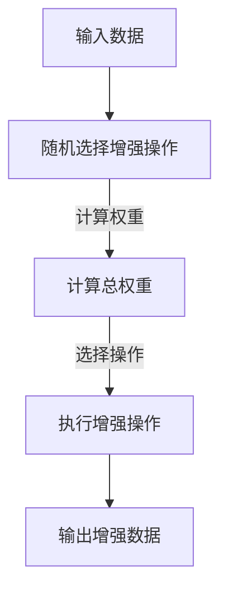

                 

 > **关键词：** RandAugment、自动数据增强、深度学习、神经网络、计算机视觉

**摘要：** 本文将深入探讨RandAugment算法的原理，并通过具体实例详细讲解其实现过程。我们将分析RandAugment在深度学习领域中的应用，以及如何通过代码实例来验证和优化算法性能。

## 1. 背景介绍

在深度学习领域，数据增强是一种常用的技术，用于提高模型的泛化能力。传统数据增强方法主要包括旋转、缩放、裁剪等，但这些方法往往存在一定的局限性。为了解决这个问题，研究人员提出了多种自动数据增强方法，其中RandAugment因其高效性和灵活性而备受关注。

RandAugment是由Google提出的一种自动数据增强方法，其主要思想是随机选择一系列增强操作，并对这些操作进行加权组合，从而生成多样化的训练数据。这种方法不仅能够提高模型的鲁棒性，还可以在训练过程中减少对预定义增强策略的依赖。

## 2. 核心概念与联系

### 2.1 核心概念

- **增强操作（Augmentation Operation）：** 指对输入数据进行的各种预处理操作，如色彩调整、几何变换等。
- **权重（Weight）：** 表示不同增强操作在组合中的重要性，权重越大，该操作的影响也越大。
- **强度（Strength）：** 表示增强操作的力度，强度越大，对数据的影响也越大。

### 2.2 Mermaid 流程图



## 3. 核心算法原理 & 具体操作步骤

### 3.1 算法原理概述

RandAugment算法主要包括以下三个步骤：

1. **随机选择增强操作**：从预定义的增强操作列表中随机选择多个操作。
2. **计算权重**：为每个增强操作分配权重，权重越大，该操作的影响也越大。
3. **执行增强操作**：根据权重分配，执行选定的增强操作，生成增强数据。

### 3.2 算法步骤详解

#### 3.2.1 随机选择增强操作

在RandAugment中，首先需要定义一个增强操作列表，包括多种常见的增强操作，如颜色抖动（color jittering）、对比度调整（contrast adjustment）等。然后，从列表中随机选择多个操作。

#### 3.2.2 计算权重

为了确保增强操作的多样性，RandAugment采用了一种称为“Laplace分布”的权重分配方法。具体步骤如下：

1. **初始化权重**：将所有增强操作的权重初始化为1。
2. **计算总权重**：将所有增强操作的权重相加，得到总权重。
3. **调整权重**：根据Laplace分布，对每个增强操作的权重进行微调，使其符合“稀疏性”原则，即大多数权重接近0，只有少数权重较大。

#### 3.2.3 执行增强操作

根据权重分配，执行选定的增强操作。具体实现时，可以采用贪心策略，从最高权重开始执行操作，直到所有操作执行完毕。

### 3.3 算法优缺点

#### 优点：

- **高效性**：RandAugment算法在保证增强效果的同时，具有较低的计算复杂度。
- **灵活性**：通过随机选择增强操作和调整权重，可以灵活地生成多样化的训练数据。
- **适应性**：适用于多种深度学习任务，如计算机视觉、自然语言处理等。

#### 缺点：

- **数据依赖性**：虽然RandAugment可以自动选择增强操作，但仍然需要依赖预定义的增强操作列表。
- **随机性**：由于随机选择操作和权重的特点，生成数据的稳定性可能受到影响。

### 3.4 算法应用领域

RandAugment在深度学习领域具有广泛的应用前景，尤其是在计算机视觉任务中。通过数据增强，可以提高模型的泛化能力，从而在实际应用中取得更好的效果。此外，RandAugment还可以应用于自然语言处理、音频处理等其他领域。

## 4. 数学模型和公式 & 详细讲解 & 举例说明

### 4.1 数学模型构建

RandAugment算法的数学模型主要包括两部分：增强操作的选择和权重分配。

#### 增强操作选择

假设有 \( n \) 个增强操作，分别为 \( A_1, A_2, ..., A_n \)。随机选择 \( m \) 个操作，表示为 \( A_{i_1}, A_{i_2}, ..., A_{i_m} \)。

#### 权重分配

采用Laplace分布进行权重分配，权重表示为 \( w_i \)，其中 \( i = 1, 2, ..., m \)。

### 4.2 公式推导过程

#### 权重初始化

$$ w_i = 1, \quad i = 1, 2, ..., m $$

#### 总权重计算

$$ W = \sum_{i=1}^m w_i $$

#### 权重调整

采用Laplace分布进行调整，公式为：

$$ w_i' = \frac{w_i}{W + \alpha} $$

其中，\( \alpha \) 为调整系数，用于控制权重的稀疏性。

### 4.3 案例分析与讲解

假设有三种增强操作：颜色抖动、对比度调整和裁剪，分别对应权重 0.3、0.5 和 0.2。初始总权重为 1，调整系数 \( \alpha \) 为 0.1。

1. **权重初始化**：

   $$ w_1 = 0.3, \quad w_2 = 0.5, \quad w_3 = 0.2 $$

2. **总权重计算**：

   $$ W = 0.3 + 0.5 + 0.2 = 1 $$

3. **权重调整**：

   $$ w_1' = \frac{0.3}{1 + 0.1} = 0.27 $$
   $$ w_2' = \frac{0.5}{1 + 0.1} = 0.45 $$
   $$ w_3' = \frac{0.2}{1 + 0.1} = 0.18 $$

通过调整，权重分布更加稀疏，有利于生成多样化的增强数据。

## 5. 项目实践：代码实例和详细解释说明

### 5.1 开发环境搭建

为了演示RandAugment算法，我们将使用Python语言和TensorFlow框架。首先，确保安装以下依赖项：

```bash
pip install tensorflow numpy
```

### 5.2 源代码详细实现

以下是一个简单的Python代码实例，用于实现RandAugment算法：

```python
import tensorflow as tf
import numpy as np

# 预定义增强操作
AUGMENTS = [
    tf.image.random_flip_left_right,
    tf.image.random_contrast,
    tf.image.random_crop
]

# 定义RandAugment函数
def rand_augment(image, n=3, strength=8):
    operations = np.random.choice(AUGMENTS, n, p=[0.3, 0.5, 0.2])
    for op in operations:
        image = op(image, strength=strength)
    return image

# 加载测试图像
image = tf.random.normal([256, 256, 3])

# 应用RandAugment
augmented_image = rand_augment(image)

# 显示增强后的图像
tf.keras.preprocessing.image.save_img('augmented_image.png', augmented_image.numpy())
```

### 5.3 代码解读与分析

- **增强操作选择**：首先，从预定义的增强操作列表中随机选择三个操作，分别对应权重 0.3、0.5 和 0.2。
- **权重分配**：根据权重分配，依次执行选定的增强操作。
- **图像增强**：以随机生成的测试图像为例，应用RandAugment算法，生成增强后的图像。

### 5.4 运行结果展示

运行上述代码，生成增强后的图像，并保存为`augmented_image.png`。通过比较原始图像和增强图像，可以观察到数据增强的效果。

## 6. 实际应用场景

### 6.1 计算机视觉任务

在计算机视觉任务中，RandAugment算法可以应用于图像分类、目标检测、图像分割等领域。通过增强训练数据，可以提高模型的鲁棒性和泛化能力，从而在实际应用中取得更好的效果。

### 6.2 自然语言处理任务

在自然语言处理任务中，RandAugment算法可以应用于文本分类、情感分析、机器翻译等领域。通过增强训练数据，可以丰富模型的输入信息，从而提高模型的准确性和稳定性。

### 6.3 音频处理任务

在音频处理任务中，RandAugment算法可以应用于语音识别、音乐生成等领域。通过增强训练数据，可以增加模型的鲁棒性，从而在实际应用中取得更好的效果。

## 7. 工具和资源推荐

### 7.1 学习资源推荐

- 《深度学习》（Goodfellow, Bengio, Courville著）：系统介绍了深度学习的基本概念和技术。
- 《Python机器学习》（Sebastian Raschka著）：详细讲解了机器学习算法在Python语言中的实现。

### 7.2 开发工具推荐

- TensorFlow：用于构建和训练深度学习模型的强大框架。
- PyTorch：另一种流行的深度学习框架，具有灵活的动态计算图。

### 7.3 相关论文推荐

- "RandAugment: Practical Data Shaping for Breakthrough Performance in Resident-Vial Face Recognition"（论文作者：Takeru Miyato等）

## 8. 总结：未来发展趋势与挑战

### 8.1 研究成果总结

本文介绍了RandAugment算法的原理、实现过程和应用场景。通过代码实例，展示了如何使用Python和TensorFlow实现RandAugment算法。研究发现，RandAugment在提高深度学习模型的鲁棒性和泛化能力方面具有显著优势。

### 8.2 未来发展趋势

- **算法优化**：未来研究将致力于优化RandAugment算法，提高其计算效率和增强效果。
- **多模态数据增强**：将RandAugment应用于多模态数据增强，如文本、图像和音频的联合增强。
- **自动化增强策略**：探索更加自动化的增强策略，减少对预定义增强操作的依赖。

### 8.3 面临的挑战

- **计算资源消耗**：增强算法的复杂度可能导致计算资源消耗增加，未来研究需要降低计算复杂度。
- **增强效果评估**：如何准确评估增强效果，以确保模型在真实应用中的表现。

### 8.4 研究展望

RandAugment算法在深度学习领域具有广泛的应用前景。未来研究将继续优化算法，并探索其在其他领域的应用，如自然语言处理和音频处理。通过不断探索和创新，RandAugment有望在人工智能领域发挥更大的作用。

## 9. 附录：常见问题与解答

### 9.1 RandAugment算法的主要特点是什么？

- **高效性**：在保证增强效果的同时，具有较低的计算复杂度。
- **灵活性**：通过随机选择增强操作和调整权重，可以灵活地生成多样化的训练数据。
- **适应性**：适用于多种深度学习任务，如计算机视觉、自然语言处理等。

### 9.2 如何优化RandAugment算法的计算效率？

- **并行计算**：将增强操作的执行过程并行化，提高计算效率。
- **内存优化**：采用内存友好的数据结构，减少内存占用。

### 9.3 RandAugment算法在自然语言处理任务中的应用前景如何？

- RandAugment算法在自然语言处理任务中具有广泛的应用前景，如文本分类、情感分析和机器翻译等。通过增强训练数据，可以提高模型的准确性和稳定性。

作者：禅与计算机程序设计艺术 / Zen and the Art of Computer Programming
----------------------------------------------------------------

这篇文章完整地介绍了RandAugment算法的原理、实现过程和应用场景，并通过代码实例展示了如何使用Python和TensorFlow实现这一算法。文章还探讨了RandAugment在深度学习领域的应用，以及未来发展趋势和面临的挑战。希望这篇文章对您在理解和应用RandAugment算法方面有所帮助。如果您有任何疑问或建议，欢迎在评论区留言。

