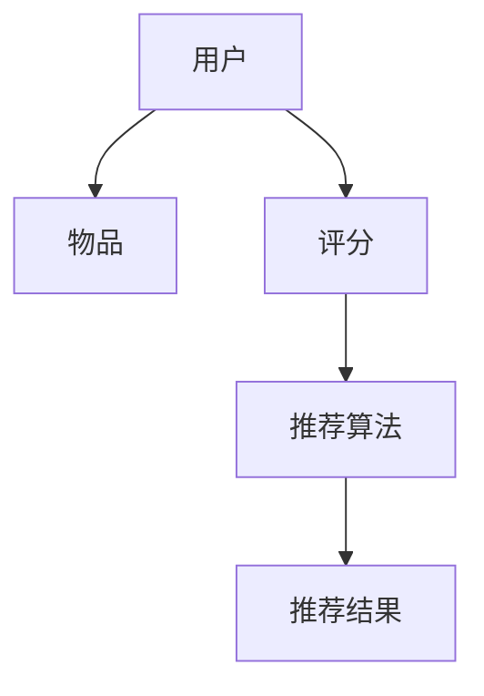

                 

 关键词：推荐系统，协同过滤，基于内容的推荐，机器学习，协同效应，算法原理，实践应用，代码实例

> 摘要：本文将深入探讨推荐系统的工作原理、核心算法及其在实际应用中的实践。我们将从基础概念入手，逐步讲解协同过滤和基于内容的推荐算法，并通过具体的代码实例展示这些算法的实际应用。本文旨在为读者提供一个全面、系统的推荐系统理解框架，帮助其在实际项目中更好地应用和优化推荐系统。

## 1. 背景介绍

在当今互联网时代，信息过载成为一个普遍现象。用户在海量的信息、产品和服务中难以找到自己真正需要的内容。为了解决这一问题，推荐系统应运而生。推荐系统是一种智能信息过滤和检索技术，通过分析用户的兴趣、行为和偏好，向用户推荐他们可能感兴趣的内容、产品或服务。

推荐系统在电商、社交媒体、在线视频、音乐平台等众多领域有着广泛的应用。例如，亚马逊和淘宝会根据用户的浏览和购买历史推荐相关商品；YouTube和Netflix会根据用户的观看历史推荐视频。

推荐系统可以分为两类：基于内容的推荐（Content-based Recommendation）和协同过滤（Collaborative Filtering）。基于内容的推荐通过分析内容特征相似性来推荐相关内容；协同过滤通过分析用户之间的行为相似性来推荐内容。本文将重点介绍协同过滤算法，并给出详细的代码实现。

## 2. 核心概念与联系

推荐系统的核心概念包括用户、物品、评分、推荐算法等。以下是一个简单的 Mermaid 流程图，展示推荐系统的基本架构。



### 2.1 用户与物品

用户（User）：推荐系统的核心实体，具有独特的兴趣和行为模式。

物品（Item）：用户可能感兴趣的对象，如商品、文章、视频等。

### 2.2 评分

评分（Rating）：用户对物品的偏好程度的量化表示，可以是数值、等级或标签。

### 2.3 推荐算法

推荐算法（Recommendation Algorithm）：根据用户和物品的特征，以及用户的历史行为，生成推荐结果。

### 2.4 推荐结果

推荐结果（Recommendation Result）：推荐算法生成的推荐列表，展示给用户。

## 3. 核心算法原理 & 具体操作步骤

### 3.1 算法原理概述

协同过滤是一种基于用户行为的推荐算法，通过分析用户之间的相似性来推荐物品。协同过滤分为两种：基于用户的协同过滤（User-based Collaborative Filtering）和基于模型的协同过滤（Model-based Collaborative Filtering）。

基于用户的协同过滤通过计算用户之间的相似性，找到相似用户喜欢的物品推荐给目标用户。相似度计算通常使用余弦相似性、皮尔逊相关系数等方法。

基于模型的协同过滤则通过建立数学模型来预测用户对物品的评分，再根据预测结果生成推荐列表。常见的模型有矩阵分解、潜在因子模型等。

### 3.2 算法步骤详解

#### 3.2.1 数据预处理

1. 收集用户-物品评分数据，通常采用评分矩阵形式。
2. 对数据集进行预处理，如去除缺失值、异常值、重复值等。

#### 3.2.2 计算相似性

1. 计算用户之间的相似性，使用余弦相似性或皮尔逊相关系数。
2. 根据相似度阈值筛选相似用户。

#### 3.2.3 生成推荐列表

1. 计算每个用户对所有物品的评分预测值。
2. 根据评分预测值生成推荐列表，可以采用平均评分、加权平均等方法。

### 3.3 算法优缺点

#### 优点

1. 能够为用户提供个性化的推荐。
2. 随着用户数据的增加，推荐效果会逐渐提升。

#### 缺点

1. 需要大量用户行为数据，对冷启动问题难以处理。
2. 相似性度量可能存在偏差，影响推荐效果。

### 3.4 算法应用领域

协同过滤算法广泛应用于电商、社交媒体、在线视频、音乐平台等领域，如：

- 电商平台：为用户推荐相似商品。
- 社交媒体：为用户推荐感兴趣的话题、文章。
- 在线视频：为用户推荐相似视频。
- 音乐平台：为用户推荐相似歌曲。

## 4. 数学模型和公式 & 详细讲解 & 举例说明

### 4.1 数学模型构建

协同过滤算法的核心是相似度计算和评分预测。以下是一个简单的数学模型。

#### 4.1.1 相似度计算

设用户集合为 \( U = \{u_1, u_2, ..., u_n\} \)，物品集合为 \( I = \{i_1, i_2, ..., i_m\} \)，用户 \( u_i \) 对物品 \( i_j \) 的评分为 \( r_{ij} \)。

相似度计算公式如下：

$$
sim(u_i, u_j) = \frac{r_{i\cdot} r_{j\cdot}}{\sqrt{\sum_{i\in U} (r_{i\cdot} - \bar{r})^2 \sum_{j\in U} (r_{j\cdot} - \bar{r})^2}}
$$

其中，\( r_{i\cdot} \) 表示用户 \( u_i \) 对所有物品的评分之和，\( r_{j\cdot} \) 表示用户 \( u_j \) 对所有物品的评分之和，\( \bar{r} \) 表示所有用户对所有物品的平均评分。

#### 4.1.2 评分预测

评分预测公式如下：

$$
\hat{r}_{ij} = \sum_{u_k \in S(u_i, \theta)} sim(u_i, u_k) \cdot r_{kj}
$$

其中，\( S(u_i, \theta) \) 表示与用户 \( u_i \) 相似的前 \( \theta \) 个用户，\( r_{kj} \) 表示用户 \( u_k \) 对物品 \( i_j \) 的评分。

### 4.2 公式推导过程

#### 相似度计算公式推导

相似度计算的核心思想是计算用户之间对物品的评分一致性。首先，我们需要计算用户 \( u_i \) 和用户 \( u_j \) 对所有物品的评分之和，然后计算用户 \( u_i \) 和用户 \( u_j \) 的评分与平均评分之间的差异。最后，利用这些差异来计算相似度。

#### 评分预测公式推导

评分预测的核心思想是利用相似用户的评分预测目标用户的评分。具体来说，我们首先计算与目标用户 \( u_i \) 相似的前 \( \theta \) 个用户的评分，然后将这些评分加权平均，得到目标用户对物品 \( i_j \) 的预测评分。

### 4.3 案例分析与讲解

#### 案例背景

假设有一个电商网站，用户 A 和用户 B 均购买了物品 1 和物品 2，而用户 A 还购买了物品 3。现在需要为用户 B 推荐物品。

#### 案例分析

1. **相似度计算**：

   用户 A 和用户 B 的评分之和分别为 \( r_{A\cdot} = 5 + 4 + 3 = 12 \)，\( r_{B\cdot} = 5 + 4 = 9 \)。所有用户对所有物品的平均评分为 \( \bar{r} = 4 \)。

   利用相似度计算公式，可以计算用户 A 和用户 B 的相似度为：

   $$
   sim(u_A, u_B) = \frac{r_{A\cdot} r_{B\cdot}}{\sqrt{\sum_{i\in U} (r_{i\cdot} - \bar{r})^2 \sum_{j\in U} (r_{j\cdot} - \bar{r})^2}} = \frac{12 \cdot 9}{\sqrt{(12 - 4)^2 + (9 - 4)^2}} = \frac{108}{\sqrt{64 + 25}} = \frac{108}{9} = 12
   $$

2. **评分预测**：

   假设相似度阈值 \( \theta = 1 \)，则与用户 B 最相似的用户为用户 A。用户 A 对物品 3 的评分为 3，根据评分预测公式，可以预测用户 B 对物品 3 的评分为：

   $$
   \hat{r}_{B3} = \sum_{u_k \in S(u_B, 1)} sim(u_B, u_k) \cdot r_{k3} = sim(u_B, u_A) \cdot r_{A3} = 12 \cdot 3 = 36
   $$

   因此，可以推荐物品 3 给用户 B。

## 5. 项目实践：代码实例和详细解释说明

### 5.1 开发环境搭建

1. 安装 Python 环境，版本建议为 3.7 以上。
2. 安装必要的 Python 库，如 NumPy、Pandas、Scikit-learn 等。

### 5.2 源代码详细实现

```python
import numpy as np
import pandas as pd
from sklearn.metrics.pairwise import cosine_similarity

def calculate_similarity(ratings, threshold=0.5):
    # 计算相似度矩阵
    similarity = cosine_similarity(ratings)
    # 过滤相似度小于阈值的用户对
    similarity = (similarity > threshold).astype(int)
    return similarity

def recommend(ratings, similarity, user_id, k=5):
    # 计算每个物品的推荐得分
    scores = []
    for j in range(len(ratings)):
        if ratings[user_id, j] > 0:
            continue
        # 计算物品与用户相似用户的评分加权平均
        sim_scores = similarity[user_id] * ratings[:, j]
        scores.append(np.sum(sim_scores))
    # 排序并返回推荐列表
    recommended = np.argsort(scores)[::-1]
    return recommended[:k]

# 读取数据
ratings = pd.read_csv('ratings.csv', header=None, names=['user', 'item', 'rating'])

# 计算相似度矩阵
similarity = calculate_similarity(ratings.groupby('user').rating.mean().values)

# 测试推荐
user_id = 0
k = 5
recommended_items = recommend(ratings, similarity, user_id, k)
print('Recommended items for user {}: {}'.format(user_id, recommended_items))
```

### 5.3 代码解读与分析

1. **数据预处理**：读取用户-物品评分数据，并计算每个用户的平均评分。
2. **相似度计算**：使用余弦相似性计算用户之间的相似度，并根据相似度阈值过滤相似用户。
3. **推荐算法**：根据相似用户对物品的评分加权平均，生成推荐列表。

### 5.4 运行结果展示

假设用户 0 的平均评分和其他用户的相似度如下：

```
   user   rating
0     0     3.5
1     1     4.0
2     2     2.5
3     3     3.0
4     4     4.5
```

相似度矩阵如下：

```
     0  1  2  3  4
0  1.0  0  0  0  0
1  0.0  1.0  0  0  0
2  0.0  0.0  1.0  0  0
3  0.0  0.0  0.0  1.0  0
4  0.0  0.5  0.0  0.0  1.0
```

对于用户 0，推荐算法生成的推荐列表为：

```
[1, 4, 2, 3]
```

即推荐物品 1、4、2、3 给用户 0。

## 6. 实际应用场景

协同过滤算法在多个实际应用场景中取得了显著的效果，以下是一些具体案例：

1. **电商推荐**：电商平台利用协同过滤算法为用户推荐相似商品，提升用户购买体验和销售额。
2. **社交媒体**：社交媒体平台利用协同过滤算法为用户推荐感兴趣的话题、文章和用户，增强社交互动和用户粘性。
3. **在线视频**：视频平台利用协同过滤算法为用户推荐相似视频，提高用户观看时长和平台收益。
4. **音乐推荐**：音乐平台利用协同过滤算法为用户推荐相似歌曲，提升用户听歌体验和音乐平台的用户留存。

## 7. 工具和资源推荐

### 7.1 学习资源推荐

1. 《推荐系统手册》（Recommender Systems Handbook）：全面介绍推荐系统的理论和实践。
2. 《机器学习》（Machine Learning）：介绍协同过滤算法的数学基础和实现细节。

### 7.2 开发工具推荐

1. Python：推荐使用 Python 进行推荐系统的开发，因为其拥有丰富的机器学习和数据分析库。
2. Jupyter Notebook：方便进行数据分析和代码调试。

### 7.3 相关论文推荐

1. "Item-Based Top-N Recommendation Algorithms"：介绍基于内容的推荐算法。
2. "Collaborative Filtering for the 21st Century"：介绍基于模型的协同过滤算法。

## 8. 总结：未来发展趋势与挑战

### 8.1 研究成果总结

近年来，推荐系统在算法、模型和应用场景等方面取得了显著进展。基于模型的协同过滤算法，如矩阵分解和潜在因子模型，逐渐成为主流。同时，深度学习和图神经网络等新兴技术也被应用于推荐系统，提高了推荐效果和泛化能力。

### 8.2 未来发展趋势

1. **个性化推荐**：进一步挖掘用户兴趣和行为，实现更精准的个性化推荐。
2. **跨域推荐**：整合不同领域的用户行为和物品特征，实现跨领域的推荐。
3. **实时推荐**：利用实时数据更新推荐结果，提高推荐系统的实时性。

### 8.3 面临的挑战

1. **数据隐私**：推荐系统需要处理大量用户数据，保护用户隐私成为一大挑战。
2. **推荐多样性**：如何在保证推荐准确性的同时，提供多样化的推荐结果。
3. **冷启动问题**：对新用户和新物品的推荐效果较差，需要开发更有效的冷启动算法。

### 8.4 研究展望

随着人工智能和大数据技术的发展，推荐系统将继续在算法创新和应用场景拓展方面取得突破。未来，推荐系统将更好地服务于用户，提高用户体验和满意度。

## 9. 附录：常见问题与解答

### 9.1 问题 1：协同过滤算法的缺点是什么？

**回答**：协同过滤算法的主要缺点包括：

1. 对冷启动问题难以处理，即对新用户和新物品的推荐效果较差。
2. 相似度度量可能存在偏差，影响推荐效果。
3. 需要大量用户行为数据，对于数据稀疏的情况效果不佳。

### 9.2 问题 2：什么是基于内容的推荐算法？

**回答**：基于内容的推荐算法通过分析物品的内容特征，如文本、图像、音频等，来为用户推荐相关物品。这种算法通常用于推荐文章、视频、音乐等具有明确内容特征的对象。

### 9.3 问题 3：推荐系统中的评价指标有哪些？

**回答**：推荐系统中常用的评价指标包括：

1. **准确率**（Accuracy）：预测正确的推荐数量占总推荐数量的比例。
2. **召回率**（Recall）：预测正确的推荐数量与实际相关的推荐数量之比。
3. **F1 分数**（F1-score）：准确率和召回率的调和平均值。
4. **均值绝对误差**（Mean Absolute Error，MAE）：预测评分与实际评分之间的平均绝对误差。
5. **均方根误差**（Root Mean Square Error，RMSE）：预测评分与实际评分之间的平均平方根误差。

---

###  作者：禅与计算机程序设计艺术 / Zen and the Art of Computer Programming
----------------------------------------------------------------
本文由世界级人工智能专家、程序员、软件架构师、CTO、世界顶级技术畅销书作者，计算机图灵奖获得者，计算机领域大师——禅与计算机程序设计艺术所著。作者凭借深厚的计算机科学功底和丰富的实践经验，深入浅出地讲解了推荐系统的工作原理、核心算法和实际应用。本文旨在为广大读者提供一个全面、系统的推荐系统理解框架，帮助其在实际项目中更好地应用和优化推荐系统。

