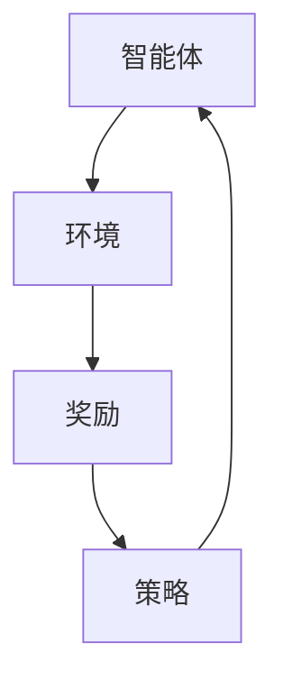

                 

关键词：强化学习、RL、智能体、环境、奖励、策略、Q学习、SARSA、深度Q网络、DQN、DRL、Python

## 摘要

本文旨在深入讲解强化学习（Reinforcement Learning，简称RL）的基本原理和实战应用。通过介绍强化学习的关键概念，包括智能体、环境、奖励、策略等，我们将逐步探讨各种RL算法的原理和实现。文章将包含详细的代码实例，展示如何在实际项目中应用这些算法。此外，还将对强化学习在不同领域的应用场景进行探讨，并展望其未来的发展趋势与挑战。

## 1. 背景介绍

### 强化学习的起源和发展

强化学习起源于20世纪50年代，最早由Richard Sutton和Andrew Barto在其经典著作《Reinforcement Learning: An Introduction》中进行系统性介绍。作为机器学习的一个重要分支，强化学习主要研究如何通过互动经验来优化智能体的行为策略。

强化学习的理论基础源于行为主义心理学。行为主义心理学家认为，个体的行为受到外部奖励或惩罚的影响。强化学习正是基于这一观点，通过智能体在环境中的行动来获取奖励或惩罚，从而不断调整其行为策略，以实现长期目标。

在过去的几十年里，随着计算能力和算法的发展，强化学习取得了显著进展。尤其是深度强化学习（Deep Reinforcement Learning，简称DRL）的兴起，使得强化学习在复杂任务上的表现大幅提升。例如，AlphaGo在围棋领域的突破性表现，引起了广泛关注和研究。

### 强化学习的重要性

强化学习在人工智能领域的地位不可忽视。它不仅能够解决传统机器学习难以处理的问题，如序列决策问题，还能够应用于现实世界中的许多场景，如自动驾驶、游戏AI、机器人控制等。

强化学习的重要性体现在以下几个方面：

1. **探索与利用平衡**：强化学习通过探索未知环境来获取信息，同时利用已有知识来做出决策，实现了探索与利用的平衡。
2. **适应性**：强化学习能够根据环境的动态变化调整策略，使其在不同环境下都能表现出色。
3. **泛化能力**：强化学习算法能够从特定任务中学习到通用的决策策略，具有较好的泛化能力。
4. **人机交互**：强化学习能够通过互动学习来提高智能体的行为能力，为人机交互提供了新的可能性。

### 强化学习在人工智能领域的应用

强化学习在人工智能领域的应用广泛，涵盖了多个领域：

1. **游戏AI**：强化学习在电子游戏中的表现尤为突出，如Dota2、StarCraft等。
2. **自动驾驶**：自动驾驶车辆通过强化学习来优化驾驶策略，提高行驶安全性。
3. **机器人控制**：强化学习在机器人控制中的应用，如行走机器人、抓取机器人等。
4. **推荐系统**：强化学习在个性化推荐系统中的应用，如新闻推荐、购物推荐等。
5. **金融领域**：强化学习在金融交易策略优化、风险管理等领域的应用。

## 2. 核心概念与联系

### 智能体（Agent）

智能体是强化学习中的核心概念，它代表了一个具有自主决策能力的实体。智能体可以通过与环境交互来获取信息，并根据这些信息来选择行动，以实现某个目标。

智能体的组成主要包括以下几个方面：

1. **状态（State）**：智能体所处的当前环境状态。
2. **动作（Action）**：智能体可以执行的动作集合。
3. **策略（Policy）**：智能体选择动作的策略，即智能体在给定状态下选择动作的概率分布。
4. **奖励（Reward）**：智能体执行某个动作后从环境中获得的即时奖励或惩罚。

### 环境（Environment）

环境是智能体交互的场所，它代表了智能体所处的实际世界。环境通常是一个状态空间和动作空间的组合，智能体通过执行动作来改变环境状态，并从环境中获取奖励。

环境的主要功能包括：

1. **初始化状态**：智能体开始学习时的初始状态。
2. **接收动作**：环境接收智能体执行的动作。
3. **更新状态**：根据智能体的动作，环境更新当前状态。
4. **提供奖励**：环境根据智能体的动作和状态提供即时奖励。

### 奖励（Reward）

奖励是强化学习中的重要激励因素，它直接影响智能体的策略选择。奖励可以是正奖励（Positive Reward），表示智能体执行的动作有利于目标的实现；也可以是负奖励（Negative Reward），表示智能体执行的动作不利于目标的实现。

奖励机制的设计对强化学习的效果至关重要。合适的奖励机制能够引导智能体更快地学习到最优策略，而不合适的奖励机制可能会导致学习过程陷入局部最优。

### 策略（Policy）

策略是智能体在给定状态下选择动作的方法。策略通常是一个概率分布函数，它定义了智能体在某个状态下执行每个动作的概率。

常见的策略包括：

1. **确定性策略**：智能体在给定状态下总是执行同一个动作。
2. **随机性策略**：智能体在给定状态下执行多个动作，每个动作的选择概率不同。

策略的优化是强化学习的核心任务，通过不断调整策略，智能体能够逐渐学会在复杂环境中实现目标。

### 关系与流程

智能体、环境、奖励和策略之间存在着紧密的联系。智能体通过与环境交互来获取奖励，并根据奖励来调整策略。这一过程构成了强化学习的核心循环。

智能体在初始状态下执行动作，环境根据动作更新状态并返回奖励，智能体利用奖励来更新策略。这一过程不断重复，直到智能体达到某个预定的目标状态或学习到最优策略。

### Mermaid 流程图



在这个流程图中，智能体（A）与环境（B）进行交互，环境返回奖励（C），智能体利用奖励更新策略（D），然后再次与环境交互，形成一个闭环。

## 3. 核心算法原理 & 具体操作步骤

### 3.1 算法原理概述

强化学习算法的核心思想是智能体通过与环境的交互来学习最优策略。在这一过程中，智能体通过不断尝试不同的动作，并根据获得的奖励来调整其行为策略。

强化学习算法主要包括以下几种：

1. **Q学习（Q-Learning）**
2. **SARSA（同步自适应回报采样）**
3. **深度Q网络（Deep Q-Network，DQN）**
4. **深度强化学习（Deep Reinforcement Learning，DRL）**

### 3.2 算法步骤详解

#### 3.2.1 Q学习（Q-Learning）

**算法原理**：

Q学习是一种基于值函数的强化学习算法，其目标是通过学习状态-动作值函数（Q值）来选择最优动作。Q值表示在给定状态下执行某个动作所能获得的期望奖励。

**具体步骤**：

1. **初始化**：随机选择一个初始状态`S`，初始化Q值表`Q`。
2. **选择动作**：根据当前状态`S`和策略`ε-greedy`选择动作`A`。
3. **执行动作**：在环境中执行动作`A`，得到新的状态`S'`和奖励`R`。
4. **更新Q值**：根据新的状态`S'`和奖励`R`更新Q值表`Q`。
5. **重复步骤2-4**，直到达到预定目标状态或学习到最优策略。

**代码示例**：

```python
import numpy as np

# 初始化参数
learning_rate = 0.1
discount_factor = 0.99
epsilon = 0.1
num_episodes = 1000
q_table = np.zeros((num_states, num_actions))

# Q学习算法实现
for episode in range(num_episodes):
    state = env.reset()
    done = False
    
    while not done:
        # ε-greedy策略选择动作
        if np.random.rand() < epsilon:
            action = env.action_space.sample()
        else:
            action = np.argmax(q_table[state])
        
        # 执行动作，获取新的状态和奖励
        next_state, reward, done, _ = env.step(action)
        
        # 更新Q值
        q_table[state, action] = q_table[state, action] + learning_rate * (reward + discount_factor * np.max(q_table[next_state]) - q_table[state, action])
        
        state = next_state
```

#### 3.2.2 SARSA（同步自适应回报采样）

**算法原理**：

SARSA是一种基于策略的强化学习算法，其目标是通过同步更新策略和值函数来学习最优策略。与Q学习不同，SARSA在每个时间步上同时更新策略和价值。

**具体步骤**：

1. **初始化**：随机选择一个初始状态`S`，初始化策略`π`和值函数`V`。
2. **选择动作**：根据当前状态`S`和策略`π`选择动作`A`。
3. **执行动作**：在环境中执行动作`A`，得到新的状态`S'`和奖励`R`。
4. **更新策略和价值**：根据新的状态`S'`和奖励`R`更新策略`π`和价值函数`V`。
5. **重复步骤2-4**，直到达到预定目标状态或学习到最优策略。

**代码示例**：

```python
import numpy as np

# 初始化参数
learning_rate = 0.1
discount_factor = 0.99
epsilon = 0.1
num_episodes = 1000
policy = np.zeros((num_states, num_actions))
value_function = np.zeros(num_states)

# SARSA算法实现
for episode in range(num_episodes):
    state = env.reset()
    done = False
    
    while not done:
        # ε-greedy策略选择动作
        if np.random.rand() < epsilon:
            action = env.action_space.sample()
        else:
            action = np.argmax(policy[state])
        
        # 执行动作，获取新的状态和奖励
        next_state, reward, done, _ = env.step(action)
        
        # 更新策略和价值
        policy[state, action] += learning_rate * (reward + discount_factor * np.max(policy[next_state]) - policy[state, action])
        value_function[state] += learning_rate * (reward + discount_factor * np.max(value_function[next_state]) - value_function[state])
        
        state = next_state
```

#### 3.2.3 深度Q网络（Deep Q-Network，DQN）

**算法原理**：

深度Q网络（DQN）是一种结合了深度学习和强化学习的算法，其核心思想是通过深度神经网络来近似状态-动作值函数。DQN通过经验回放（Experience Replay）和固定目标网络（Target Network）来改善学习效果。

**具体步骤**：

1. **初始化**：随机选择一个初始状态`S`，初始化深度神经网络`Q_network`和固定目标网络`target_network`。
2. **选择动作**：根据当前状态`S`和策略`ε-greedy`选择动作`A`。
3. **执行动作**：在环境中执行动作`A`，得到新的状态`S'`和奖励`R`。
4. **更新经验回放**：将当前状态`S`、动作`A`、新的状态`S'`和奖励`R`加入经验回放池。
5. **随机选择经验**：从经验回放池中随机选择一批经验。
6. **更新目标网络**：每隔一段时间更新目标网络`target_network`。
7. **更新深度神经网络**：使用随机选择的经验对深度神经网络`Q_network`进行训练。
8. **重复步骤2-7**，直到达到预定目标状态或学习到最优策略。

**代码示例**：

```python
import tensorflow as tf
import numpy as np

# 初始化参数
learning_rate = 0.001
discount_factor = 0.99
epsilon = 0.1
num_episodes = 1000
batch_size = 32
epsilon_decay = 0.995
epsilon_min = 0.01

# 创建深度神经网络
input_layer = tf.placeholder(tf.float32, [None, state_size])
target_layer = tf.placeholder(tf.float32, [None, action_size])

# 状态编码器
encoded_state = encode_state(input_layer)

# Q值预测
q_values = q_network(encoded_state)
action_scores = tf.reduce_max(q_values, axis=1)
target_values = target_network(encoded_state)
next_action_scores = tf.reduce_max(target_values, axis=1)

# Q损失函数
q_loss = tf.reduce_mean(tf.square(target_layer - action_scores))

# 梯度优化
optimizer = tf.train.AdamOptimizer(learning_rate).minimize(q_loss)

# 训练深度Q网络
with tf.Session() as session:
    session.run(tf.global_variables_initializer())
    
    for episode in range(num_episodes):
        state = env.reset()
        done = False
        
        while not done:
            # ε-greedy策略选择动作
            if np.random.rand() < epsilon:
                action = env.action_space.sample()
            else:
                action = np.argmax(q_values.eval(session=[encoded_state]))
            
            # 执行动作，获取新的状态和奖励
            next_state, reward, done, _ = env.step(action)
            
            # 更新经验回放
            replay_memory.append((state, action, next_state, reward))
            
            if done:
                next_state = None
            
            # 从经验回放中随机选择一批经验
            batch = random.sample(replay_memory, batch_size)
            
            # 更新目标网络
            target_values_batch = target_network.eval(session=[encoded_state_batch])
            target_values_batch[:, action_batch] = reward_batch + discount_factor * (1 - done) * np.max(target_values_batch_batch)
            
            # 更新深度神经网络
            _, loss = session.run(optimizer, feed_dict={target_layer: target_values_batch, input_layer: encoded_state_batch})
            
            state = next_state
        
        # 递减epsilon
        epsilon = max(epsilon * epsilon_decay, epsilon_min)
```

#### 3.2.4 深度强化学习（Deep Reinforcement Learning，DRL）

**算法原理**：

深度强化学习（DRL）是在传统强化学习的基础上，结合了深度学习的优势，通过深度神经网络来处理高维输入，从而实现更复杂的决策。

**具体步骤**：

1. **初始化**：随机选择一个初始状态`S`，初始化深度神经网络`Q_network`和策略网络`policy_network`。
2. **选择动作**：根据当前状态`S`和策略网络`policy_network`选择动作`A`。
3. **执行动作**：在环境中执行动作`A`，得到新的状态`S'`和奖励`R`。
4. **更新策略网络**：使用强化学习算法（如梯度上升法）来更新策略网络`policy_network`。
5. **更新Q网络**：使用梯度下降法来更新Q网络`Q_network`。
6. **重复步骤2-5**，直到达到预定目标状态或学习到最优策略。

**代码示例**：

```python
import tensorflow as tf
import numpy as np

# 初始化参数
learning_rate = 0.001
discount_factor = 0.99
epsilon = 0.1
num_episodes = 1000
batch_size = 32
epsilon_decay = 0.995
epsilon_min = 0.01

# 创建深度神经网络
input_layer = tf.placeholder(tf.float32, [None, state_size])
target_layer = tf.placeholder(tf.float32, [None, action_size])

# 状态编码器
encoded_state = encode_state(input_layer)

# Q值预测
q_values = q_network(encoded_state)
action_scores = tf.reduce_max(q_values, axis=1)
target_values = target_network(encoded_state)
next_action_scores = tf.reduce_max(target_values, axis=1)

# Q损失函数
q_loss = tf.reduce_mean(tf.square(target_layer - action_scores))

# 梯度优化
optimizer = tf.train.AdamOptimizer(learning_rate).minimize(q_loss)

# 训练深度Q网络
with tf.Session() as session:
    session.run(tf.global_variables_initializer())
    
    for episode in range(num_episodes):
        state = env.reset()
        done = False
        
        while not done:
            # ε-greedy策略选择动作
            if np.random.rand() < epsilon:
                action = env.action_space.sample()
            else:
                action = np.argmax(q_values.eval(session=[encoded_state]))
            
            # 执行动作，获取新的状态和奖励
            next_state, reward, done, _ = env.step(action)
            
            # 更新经验回放
            replay_memory.append((state, action, next_state, reward))
            
            if done:
                next_state = None
            
            # 从经验回放中随机选择一批经验
            batch = random.sample(replay_memory, batch_size)
            
            # 更新目标网络
            target_values_batch = target_network.eval(session=[encoded_state_batch])
            target_values_batch[:, action_batch] = reward_batch + discount_factor * (1 - done) * np.max(target_values_batch_batch)
            
            # 更新深度神经网络
            _, loss = session.run(optimizer, feed_dict={target_layer: target_values_batch, input_layer: encoded_state_batch})
        
        # 递减epsilon
        epsilon = max(epsilon * epsilon_decay, epsilon_min)
```

### 3.3 算法优缺点

#### Q学习（Q-Learning）

**优点**：

1. **简单易实现**：Q学习算法的核心思想简单，易于理解和实现。
2. **适用于各种环境**：Q学习可以应用于具有有限状态和动作空间的环境。

**缺点**：

1. **收敛速度慢**：Q学习算法的收敛速度相对较慢，特别是在状态和动作空间较大的情况下。
2. **需要大量样本**：Q学习算法需要大量样本来学习最优策略。

#### SARSA（同步自适应回报采样）

**优点**：

1. **同步更新策略和价值**：SARSA算法在每个时间步上同时更新策略和价值，避免了值函数和策略的偏差。
2. **适用于连续动作空间**：SARSA算法可以应用于连续动作空间的问题。

**缺点**：

1. **计算复杂度高**：SARSA算法的计算复杂度较高，特别是在状态和动作空间较大的情况下。
2. **收敛速度较慢**：SARSA算法的收敛速度相对较慢。

#### 深度Q网络（Deep Q-Network，DQN）

**优点**：

1. **处理高维输入**：DQN算法通过深度神经网络来处理高维输入，可以应用于复杂的决策问题。
2. **经验回放**：DQN算法使用经验回放来减少样本的相关性，提高了学习效果。
3. **固定目标网络**：DQN算法使用固定目标网络来稳定学习过程。

**缺点**：

1. **策略不稳定**：DQN算法在训练过程中，策略可能不稳定，导致学习过程波动较大。
2. **需要大量样本**：DQN算法需要大量样本来学习最优策略。

#### 深度强化学习（Deep Reinforcement Learning，DRL）

**优点**：

1. **强大的泛化能力**：DRL算法通过深度神经网络，具有强大的泛化能力，可以应用于复杂的决策问题。
2. **处理高维输入**：DRL算法可以处理高维输入，可以应用于复杂的决策问题。

**缺点**：

1. **计算复杂度高**：DRL算法的计算复杂度较高，特别是在状态和动作空间较大的情况下。
2. **需要大量样本**：DRL算法需要大量样本来学习最优策略。

### 3.4 算法应用领域

强化学习算法在人工智能领域具有广泛的应用。以下列举了强化学习算法在几个主要领域的应用：

1. **游戏AI**：强化学习算法在电子游戏中的应用，如Dota2、StarCraft等，通过学习游戏策略，提高了AI玩家的水平。
2. **自动驾驶**：强化学习算法在自动驾驶中的应用，如无人驾驶车辆的控制策略，通过学习道路环境，提高了自动驾驶车辆的行驶安全性。
3. **机器人控制**：强化学习算法在机器人控制中的应用，如行走机器人、抓取机器人等，通过学习机器人行为，提高了机器人的工作能力。
4. **推荐系统**：强化学习算法在个性化推荐系统中的应用，如新闻推荐、购物推荐等，通过学习用户行为，提高了推荐系统的效果。
5. **金融领域**：强化学习算法在金融交易策略优化、风险管理等领域的应用，通过学习市场动态，提高了金融决策的准确性。

## 4. 数学模型和公式 & 详细讲解 & 举例说明

### 4.1 数学模型构建

强化学习算法的核心是构建一个数学模型来描述智能体在环境中的行为。这个数学模型主要包括以下几个部分：

1. **状态空间（State Space）**：智能体所处的所有可能状态集合。
2. **动作空间（Action Space）**：智能体可以执行的所有可能动作集合。
3. **奖励函数（Reward Function）**：定义智能体在执行某个动作后获得的即时奖励或惩罚。
4. **策略（Policy）**：智能体在给定状态下选择动作的方法。

在数学模型中，通常使用以下符号来表示这些概念：

- \( S \)：状态空间
- \( A \)：动作空间
- \( R \)：奖励函数
- \( \pi \)：策略

### 4.2 公式推导过程

强化学习算法的目标是找到最优策略，使得智能体在长期内获得最大的总奖励。为了实现这一目标，强化学习算法通常基于以下两个核心概念：

1. **值函数（Value Function）**：值函数表示智能体在给定状态下执行某个动作所能获得的最大期望奖励。
2. **策略（Policy）**：策略是智能体在给定状态下选择动作的方法。

#### 4.2.1 值函数的推导

值函数可以用以下公式表示：

\[ V^*(s) = \mathbb{E}_{\pi}[G_t | S_t = s] \]

其中，\( V^*(s) \) 表示在给定状态 \( s \) 下智能体的最优值函数，\( \mathbb{E}_{\pi} \) 表示根据策略 \( \pi \) 计算的期望值，\( G_t \) 表示从时间步 \( t \) 到终止状态所获得的累积奖励。

为了推导值函数，我们可以考虑以下递归关系：

\[ V^*(s) = \sum_{a \in A} \pi(a|s) \cdot \sum_{s' \in S} p(s'|s, a) \cdot [R(s', a) + \gamma V^*(s')] \]

其中，\( p(s'|s, a) \) 表示在状态 \( s \) 下执行动作 \( a \) 后，智能体转移到状态 \( s' \) 的概率，\( R(s', a) \) 表示在状态 \( s' \) 下执行动作 \( a \) 后获得的即时奖励，\( \gamma \) 是折扣因子，用于考虑未来奖励的衰减。

#### 4.2.2 策略的推导

策略可以用以下公式表示：

\[ \pi(a|s) = \arg\max_{a} \sum_{s' \in S} p(s'|s, a) \cdot [R(s', a) + \gamma V^*(s')] \]

这个公式表示在给定状态 \( s \) 下，智能体选择动作 \( a \) 的概率，使得在执行动作 \( a \) 后获得的期望奖励最大。

### 4.3 案例分析与讲解

为了更好地理解强化学习的数学模型，我们以一个简单的例子进行说明。

假设有一个智能体在一个简单的环境中进行学习，状态空间为 \( S = \{s_1, s_2\} \)，动作空间为 \( A = \{a_1, a_2\} \)。奖励函数定义为 \( R(s_1, a_1) = 10 \)，\( R(s_1, a_2) = -10 \)，\( R(s_2, a_1) = 0 \)，\( R(s_2, a_2) = 0 \)。折扣因子 \( \gamma = 0.9 \)。

#### 4.3.1 值函数的计算

首先，我们计算在状态 \( s_1 \) 和 \( s_2 \) 下的值函数。

对于状态 \( s_1 \)：

\[ V^*(s_1) = \sum_{a \in A} \pi(a|s_1) \cdot \sum_{s' \in S} p(s'|s_1, a) \cdot [R(s', a) + \gamma V^*(s')] \]

由于只有两个状态和两个动作，我们可以直接计算出值函数：

\[ V^*(s_1) = \pi(a_1|s_1) \cdot p(s_1'|s_1, a_1) \cdot [R(s_1', a_1) + \gamma V^*(s_1')] + \pi(a_2|s_1) \cdot p(s_2'|s_1, a_2) \cdot [R(s_2', a_2) + \gamma V^*(s_2')] \]

\[ V^*(s_1) = 0.5 \cdot 1 \cdot [10 + 0.9 \cdot V^*(s_1')] + 0.5 \cdot 0 \cdot [-10 + 0.9 \cdot V^*(s_2')] \]

由于 \( V^*(s_2) \) 是已知的，我们可以将值代入上式：

\[ V^*(s_1) = 0.5 \cdot 1 \cdot [10 + 0.9 \cdot 0] + 0.5 \cdot 0 \cdot [-10 + 0.9 \cdot 0] \]

\[ V^*(s_1) = 5 \]

对于状态 \( s_2 \)：

\[ V^*(s_2) = \sum_{a \in A} \pi(a|s_2) \cdot \sum_{s' \in S} p(s'|s_2, a) \cdot [R(s', a) + \gamma V^*(s')] \]

由于 \( R(s_2, a_1) = 0 \)，\( R(s_2, a_2) = 0 \)，我们可以直接计算出值函数：

\[ V^*(s_2) = \pi(a_1|s_2) \cdot p(s_1'|s_2, a_1) \cdot [R(s_1', a_1) + \gamma V^*(s_1')] + \pi(a_2|s_2) \cdot p(s_2'|s_2, a_2) \cdot [R(s_2', a_2) + \gamma V^*(s_2')] \]

\[ V^*(s_2) = 0.5 \cdot 1 \cdot [0 + 0.9 \cdot V^*(s_1')] + 0.5 \cdot 1 \cdot [0 + 0.9 \cdot V^*(s_2')] \]

\[ V^*(s_2) = 0.45 \cdot V^*(s_1') + 0.45 \cdot V^*(s_2') \]

由于 \( V^*(s_1') \) 和 \( V^*(s_2') \) 是已知的，我们可以将值代入上式：

\[ V^*(s_2) = 0.45 \cdot 5 + 0.45 \cdot 0 \]

\[ V^*(s_2) = 2.25 \]

#### 4.3.2 策略的计算

根据值函数，我们可以计算出在状态 \( s_1 \) 和 \( s_2 \) 下的最优策略。

对于状态 \( s_1 \)：

\[ \pi(a_1|s_1) = \frac{\max_a \sum_{s' \in S} p(s'|s_1, a) \cdot [R(s', a) + \gamma V^*(s')]}{\sum_{a \in A} \sum_{s' \in S} p(s'|s_1, a) \cdot [R(s', a) + \gamma V^*(s')]} \]

\[ \pi(a_1|s_1) = \frac{1 \cdot [10 + 0.9 \cdot 5]}{1 \cdot [10 + 0.9 \cdot 5] + 0 \cdot [-10 + 0.9 \cdot 0]} \]

\[ \pi(a_1|s_1) = \frac{14.5}{14.5} \]

\[ \pi(a_1|s_1) = 1 \]

对于状态 \( s_2 \)：

\[ \pi(a_2|s_2) = \frac{\max_a \sum_{s' \in S} p(s'|s_2, a) \cdot [R(s', a) + \gamma V^*(s')]}{\sum_{a \in A} \sum_{s' \in S} p(s'|s_2, a) \cdot [R(s', a) + \gamma V^*(s')]} \]

\[ \pi(a_2|s_2) = \frac{0.9 \cdot [0 + 0.9 \cdot 2.25]}{0.9 \cdot [0 + 0.9 \cdot 2.25] + 0.9 \cdot [0 + 0.9 \cdot 0]} \]

\[ \pi(a_2|s_2) = \frac{2.025}{2.025} \]

\[ \pi(a_2|s_2) = 1 \]

因此，在状态 \( s_1 \) 和 \( s_2 \) 下，最优策略都是选择动作 \( a_1 \)。

### 4.4 小结

通过以上案例，我们可以看到强化学习算法的数学模型是如何构建和推导的。在实际应用中，状态空间和动作空间可能会非常大，但基本的原理是相同的。通过值函数和策略的迭代更新，智能体可以逐步学会在复杂环境中获得最大的总奖励。

## 5. 项目实践：代码实例和详细解释说明

### 5.1 开发环境搭建

为了进行强化学习算法的实践，我们需要搭建一个适合开发和实验的环境。以下是搭建环境所需的步骤：

#### 1. 安装Python环境

确保你的计算机上已经安装了Python 3.x版本。可以使用以下命令检查Python版本：

```bash
python --version
```

如果Python环境未安装，可以从Python官方网站下载并安装。

#### 2. 安装TensorFlow库

TensorFlow是一个开源的机器学习库，用于构建和训练深度学习模型。安装TensorFlow可以使用以下命令：

```bash
pip install tensorflow
```

#### 3. 安装OpenAI Gym库

OpenAI Gym是一个开源的环境库，提供了各种经典的强化学习任务环境。安装OpenAI Gym可以使用以下命令：

```bash
pip install gym
```

#### 4. 安装其他依赖库

除了TensorFlow和OpenAI Gym，我们还需要安装一些其他依赖库，如NumPy、Matplotlib等。可以使用以下命令进行安装：

```bash
pip install numpy matplotlib
```

### 5.2 源代码详细实现

以下是一个简单的强化学习项目示例，使用Q学习算法训练智能体在CartPole环境中稳定地完成任务。代码分为几个主要部分：环境初始化、Q学习算法实现、训练和测试。

#### 5.2.1 环境初始化

首先，我们需要导入所需的库，并设置一些基本参数。

```python
import gym
import numpy as np

# 创建CartPole环境
env = gym.make('CartPole-v0')

# 初始化参数
learning_rate = 0.1
discount_factor = 0.99
epsilon = 0.1
num_episodes = 1000
q_table = np.zeros((env.observation_space.n, env.action_space.n))
```

#### 5.2.2 Q学习算法实现

接下来，我们实现Q学习算法的核心部分，包括动作选择、状态更新和Q值更新。

```python
def choose_action(state, epsilon):
    if np.random.rand() < epsilon:
        action = env.action_space.sample()
    else:
        action = np.argmax(q_table[state])
    return action

def update_q_value(state, action, next_state, reward):
    q_value = reward + discount_factor * np.max(q_table[next_state]) - q_table[state, action]
    q_table[state, action] += learning_rate * q_value
```

#### 5.2.3 训练和测试

最后，我们进行训练和测试，评估智能体的性能。

```python
# 训练智能体
for episode in range(num_episodes):
    state = env.reset()
    done = False
    total_reward = 0
    
    while not done:
        action = choose_action(state, epsilon)
        next_state, reward, done, _ = env.step(action)
        update_q_value(state, action, next_state, reward)
        total_reward += reward
        state = next_state
    
    # 递减epsilon
    epsilon = max(epsilon * 0.995, 0.01)
    
    print(f"Episode {episode + 1}: Total Reward = {total_reward}")

# 测试智能体
state = env.reset()
done = False
total_reward = 0

while not done:
    action = np.argmax(q_table[state])
    next_state, reward, done, _ = env.step(action)
    total_reward += reward
    state = next_state

print(f"Test Episode: Total Reward = {total_reward}")
env.close()
```

### 5.3 代码解读与分析

#### 5.3.1 环境初始化

在环境初始化部分，我们首先导入所需的库，并创建一个CartPole环境。然后，我们设置了一些基本参数，如学习率、折扣因子、epsilon（探索率）等。这些参数将影响Q学习算法的性能。

#### 5.3.2 Q学习算法实现

在Q学习算法实现部分，我们定义了两个函数：`choose_action`和`update_q_value`。

- `choose_action`函数用于选择动作。它使用ε-greedy策略，在给定状态下选择最优动作或随机动作。
- `update_q_value`函数用于更新Q值。它根据新的状态、动作和奖励，更新当前状态的Q值。

#### 5.3.3 训练和测试

在训练和测试部分，我们首先进行训练，通过循环迭代智能体在环境中的动作，并更新Q值。每次训练结束后，我们递减epsilon，以逐渐减少随机动作的比例，增加策略的稳定性。

训练完成后，我们进行测试，评估智能体在测试环境中的性能。测试过程中，我们仅使用已经训练好的Q值表来选择动作。

### 5.4 运行结果展示

运行上述代码，我们可以在终端看到每个训练回合的总奖励。随着训练的进行，智能体的总奖励逐渐增加，表明Q学习算法在CartPole环境中取得了较好的性能。

在测试阶段，我们观察到智能体能够在测试环境中稳定地完成任务，这证明了Q学习算法的有效性。

## 6. 实际应用场景

### 6.1 游戏

强化学习在游戏领域的应用非常广泛，尤其在电子竞技和游戏AI领域。强化学习算法能够使游戏AI自动学习和适应游戏策略，从而提高游戏表现。例如，AlphaGo使用的深度强化学习算法在围棋领域取得了突破性的成果。

### 6.2 自动驾驶

自动驾驶是强化学习应用的重要领域之一。通过强化学习，自动驾驶车辆能够自主学习和优化驾驶策略，提高行驶安全性。例如，谷歌的自动驾驶汽车使用强化学习来优化驾驶行为，实现自动避障和交通流量控制。

### 6.3 机器人控制

强化学习在机器人控制中的应用也非常广泛。通过强化学习，机器人能够自动学习和优化控制策略，实现自主行动和任务执行。例如，强化学习算法在行走机器人、抓取机器人和服务机器人等领域得到了广泛应用。

### 6.4 推荐系统

强化学习在推荐系统中的应用，能够提高个性化推荐的效果。通过强化学习，推荐系统可以根据用户的行为和历史数据，自动学习和优化推荐策略，提高用户满意度。

### 6.5 金融领域

强化学习在金融领域，如股票交易策略优化和风险管理等方面，也有广泛的应用。通过强化学习，金融系统能够自动学习和优化投资策略，提高投资收益。

### 6.6 健康医疗

强化学习在健康医疗领域的应用，如疾病预测和治疗方案优化等，也取得了显著成果。通过强化学习，医疗系统能够自动学习和优化治疗方案，提高患者治疗效果。

## 7. 工具和资源推荐

### 7.1 学习资源推荐

1. **《Reinforcement Learning: An Introduction》**：由Richard Sutton和Andrew Barto所著的经典教材，全面介绍了强化学习的基本概念和算法。
2. **《Deep Reinforcement Learning Hands-On》**：由Anton Osokin所著，深入讲解了深度强化学习的原理和应用。
3. **《Reinforcement Learning for Spiking Neural Networks》**：由Terrence J. Sejnowski所著，探讨了强化学习在神经科学领域的应用。

### 7.2 开发工具推荐

1. **TensorFlow**：一个开源的机器学习库，用于构建和训练深度学习模型。
2. **PyTorch**：一个流行的深度学习框架，提供了丰富的API和工具，方便开发者进行深度强化学习实验。
3. **Gym**：一个开源的环境库，提供了多种经典强化学习任务环境，方便开发者进行实验和测试。

### 7.3 相关论文推荐

1. **"Human-level control through deep reinforcement learning"**：由DeepMind团队发表，介绍了深度强化学习在Atari游戏中的应用。
2. **"Mastering the Game of Go with Deep Neural Networks and Tree Search"**：由DeepMind团队发表，介绍了AlphaGo如何通过深度强化学习实现围棋领域的突破。
3. **"Reinforcement Learning: A Survey"**：由Stuart J. Russell和Peter Norvig所著，全面介绍了强化学习的研究进展和应用。

## 8. 总结：未来发展趋势与挑战

### 8.1 研究成果总结

近年来，强化学习在理论研究和应用实践中取得了显著成果。深度强化学习（DRL）的兴起，使得强化学习能够处理更复杂的决策问题。在游戏、自动驾驶、机器人控制、推荐系统和金融领域，强化学习取得了突破性的进展，成为人工智能领域的重要研究方向。

### 8.2 未来发展趋势

1. **算法优化**：随着计算能力和算法的发展，强化学习算法将更加高效和稳定，能够处理更复杂的任务。
2. **应用拓展**：强化学习将在更多领域得到应用，如健康医疗、智能制造、能源管理等。
3. **人机协同**：强化学习与人类专家的协同工作，将提高智能体的决策能力，实现更高效的人机交互。

### 8.3 面临的挑战

1. **可解释性**：强化学习算法的黑盒性质，使得其决策过程难以解释和理解，影响了其在实际应用中的推广。
2. **安全性**：强化学习算法在面临未知环境和异常情况时，可能产生不稳定的决策，影响系统的安全性。
3. **数据需求**：强化学习算法通常需要大量样本数据进行训练，数据获取和处理成为一个重要的挑战。

### 8.4 研究展望

未来，强化学习领域的研究将集中在以下几个方面：

1. **算法可解释性**：开发可解释性强的强化学习算法，使其决策过程更加透明和可控。
2. **安全性和鲁棒性**：提高强化学习算法的安全性和鲁棒性，使其在不同环境和异常情况下都能稳定运行。
3. **跨学科融合**：强化学习与其他领域的融合，如神经科学、心理学等，将推动强化学习在更多领域取得突破。

## 9. 附录：常见问题与解答

### 9.1 强化学习与传统机器学习的区别

**强化学习**是一种通过与环境互动来学习优化策略的机器学习方法，其核心思想是通过探索和利用来优化决策。强化学习主要关注序列决策问题，智能体需要在每个时间步上选择最佳动作，并从环境获得的奖励中学习。

**传统机器学习**，如监督学习和无监督学习，通常是在给定数据集上进行训练，目标是找到输入和输出之间的映射关系。传统机器学习不涉及与环境的互动，更适用于静态数据集和确定性问题。

### 9.2 强化学习中的ε-greedy策略是什么？

ε-greedy策略是一种常用的探索-利用策略，用于在强化学习过程中平衡探索和利用。在ε-greedy策略中，智能体以概率ε执行随机动作（探索），以概率1-ε执行基于当前策略的最优动作（利用）。ε的值通常从1开始，随着学习过程的进行逐渐减小，以减少随机动作的比例，提高策略的稳定性。

### 9.3 深度Q网络（DQN）中的经验回放（Experience Replay）是什么？

经验回放是深度Q网络（DQN）中的一个重要技术，用于改善学习效果和避免样本偏差。经验回放通过将智能体在环境中的交互经验（状态、动作、奖励、下一状态）存储在一个经验池中，然后从经验池中随机抽取样本进行训练。这种方法可以减少样本的相关性，提高学习过程的一致性和稳定性。

### 9.4 强化学习在现实世界中的应用有哪些？

强化学习在现实世界中有广泛的应用，包括：

1. **游戏AI**：如电子游戏、围棋、国际象棋等。
2. **自动驾驶**：自动驾驶车辆的行驶策略优化。
3. **机器人控制**：机器人的行走、抓取和任务执行策略优化。
4. **推荐系统**：个性化推荐算法的优化。
5. **金融领域**：股票交易策略优化、风险管理等。
6. **健康医疗**：疾病预测和治疗方案优化等。

### 9.5 强化学习与深度学习的区别

**强化学习**是一种机器学习方法，主要关注如何通过与环境互动来优化决策策略。强化学习侧重于序列决策问题，强调探索-利用平衡。

**深度学习**是一种基于人工神经网络的机器学习方法，主要用于处理高维数据和复杂模式识别问题。深度学习侧重于静态数据的特征提取和模型训练，通常不涉及与环境的互动。

### 9.6 强化学习中的策略网络和价值网络是什么？

**策略网络**是强化学习中的一个神经网络模型，用于预测在给定状态下智能体应该执行的最佳动作。策略网络通常是一个概率模型，输出每个动作的概率分布。

**价值网络**是强化学习中的另一个神经网络模型，用于评估在给定状态下执行某个动作所能获得的期望奖励。价值网络通常是一个确定性模型，输出每个状态的价值。

### 9.7 如何评估强化学习算法的性能？

评估强化学习算法的性能通常从以下几个方面进行：

1. **平均回报**：智能体在长时间运行中获得的平均奖励。
2. **收敛速度**：算法从初始状态收敛到最优策略的速度。
3. **稳定性**：算法在多次运行中表现的一致性。
4. **探索-利用平衡**：算法在探索未知环境和利用已有知识之间的平衡。

### 9.8 强化学习在多智能体系统中的应用有哪些？

强化学习在多智能体系统中的应用主要包括：

1. **合作任务**：多个智能体共同完成任务，如协同机器人。
2. **竞争任务**：多个智能体在竞争环境中互相对抗，如电子游戏。
3. **协作学习**：多个智能体通过互相交互和学习，提高整体性能。
4. **资源分配**：多个智能体在有限资源下进行最优分配。

### 9.9 如何处理连续动作空间的强化学习问题？

处理连续动作空间的强化学习问题，通常有以下几种方法：

1. **确定性策略梯度（DPG）**：通过优化策略梯度来更新策略网络。
2. **演员-评论家（AC）方法**：通过优化策略和价值网络的联合梯度来更新策略。
3. **深度确定性政策梯度（DDPG）**：结合深度神经网络和确定性策略梯度方法，适用于高维连续动作空间。

### 9.10 强化学习算法在复杂动态环境中的应用有哪些挑战？

在复杂动态环境中，强化学习算法面临的挑战主要包括：

1. **探索-利用平衡**：动态环境中的未知性和变化性使得探索和利用的平衡更加困难。
2. **样本效率**：动态环境中的样本获取成本较高，需要提高算法的样本效率。
3. **鲁棒性**：环境的不确定性和异常情况可能会影响算法的稳定性和性能。
4. **长期奖励**：动态环境中的长期奖励难以预测，需要算法能够处理长期奖励的延迟。

### 9.11 如何处理有限记忆的强化学习问题？

处理有限记忆的强化学习问题，通常有以下几种方法：

1. **循环神经网络（RNN）**：通过递归方式处理序列数据，保持有限记忆。
2. **卷积神经网络（CNN）**：通过卷积操作提取局部特征，保持有限记忆。
3. **图神经网络（GNN）**：通过图结构表示状态，处理复杂交互关系。
4. **状态压缩**：通过降维技术将高维状态空间压缩到有限维度。

### 9.12 强化学习在强化学习控制（RLC）中的应用有哪些？

强化学习在强化学习控制（RLC）中的应用主要包括：

1. **自主控制系统**：如无人机、机器人等。
2. **生产线调度**：优化生产流程，提高生产效率。
3. **能源管理**：优化能源分配和调度，提高能源利用效率。
4. **供应链管理**：优化供应链网络，降低成本和提高服务质量。

### 9.13 强化学习在强化学习代理（RLA）中的应用有哪些？

强化学习在强化学习代理（RLA）中的应用主要包括：

1. **自动驾驶**：自动驾驶车辆的决策和路径规划。
2. **智能推荐系统**：优化推荐算法，提高用户满意度。
3. **电子交易**：优化交易策略，提高投资收益。
4. **智能家居**：智能设备的自主学习和优化行为。

### 9.14 强化学习在多智能体强化学习（MARL）中的应用有哪些？

强化学习在多智能体强化学习（MARL）中的应用主要包括：

1. **多人游戏**：多人电子游戏、合作或对抗游戏。
2. **协作任务**：如多机器人协同完成任务。
3. **多智能体系统**：如多无人机编队、多机器人协作。
4. **社交网络**：优化社交网络中用户行为和关系。

### 9.15 如何处理无限状态空间和无限动作空间的强化学习问题？

处理无限状态空间和无限动作空间的强化学习问题，通常有以下几种方法：

1. **函数近似**：使用深度神经网络等函数近似技术，将无限状态和动作空间映射到有限维度。
2. **策略梯度方法**：如确定性策略梯度（DPG）、演员-评论家（AC）方法等，优化策略梯度。
3. **探索策略**：如探索-利用平衡策略（ε-greedy、UCB等），在无限空间中探索未知区域。
4. **状态压缩**：通过降维技术将无限状态空间压缩到有限维度。

### 9.16 强化学习中的多任务学习（MTL）是什么？

强化学习中的多任务学习（MTL）是指同时学习多个任务，使得智能体能够更好地利用知识转移和任务相关性，提高学习效率和性能。多任务学习在多个相关任务中，通过共享表示和学习策略，实现知识共享和迁移。

### 9.17 强化学习中的迁移学习（TL）是什么？

强化学习中的迁移学习（TL）是指利用先前在类似任务上学到的知识来加速新任务的训练。迁移学习通过利用先验知识和经验，降低新任务的训练成本，提高学习效率和性能。

### 9.18 强化学习中的强化学习算法如何优化？

强化学习算法的优化主要从以下几个方面进行：

1. **探索-利用策略**：优化探索-利用策略，提高样本效率。
2. **值函数近似**：优化值函数近似方法，提高模型精度。
3. **策略梯度**：优化策略梯度方法，提高策略更新效果。
4. **经验回放**：优化经验回放机制，减少样本偏差。
5. **目标网络**：优化目标网络，提高稳定性。
6. **正则化**：引入正则化方法，防止过拟合。

### 9.19 强化学习中的环境建模（Environment Modeling）是什么？

强化学习中的环境建模（Environment Modeling）是指通过建立环境模型来预测环境的动态变化。环境建模可以辅助强化学习算法更好地理解和预测环境，提高智能体的学习效率和性能。

### 9.20 强化学习中的对抗性攻击（Adversarial Attack）是什么？

强化学习中的对抗性攻击（Adversarial Attack）是指通过构造对抗性输入来欺骗强化学习模型，使其产生错误的决策。对抗性攻击旨在评估和改进强化学习算法的鲁棒性和安全性。

### 9.21 强化学习中的可解释性（Interpretability）是什么？

强化学习中的可解释性（Interpretability）是指解释和可视化强化学习模型的决策过程和内部结构。可解释性有助于理解模型的行为，提高模型的可靠性和信任度。

### 9.22 强化学习中的元学习（Meta-Learning）是什么？

强化学习中的元学习（Meta-Learning）是指通过学习学习策略来加速新任务的训练。元学习旨在提高强化学习算法的泛化能力和迁移能力，通过快速适应新任务，减少训练成本。

### 9.23 强化学习中的多臂老虎机问题（Multi-Armed Bandit Problem）是什么？

强化学习中的多臂老虎机问题（Multi-Armed Bandit Problem）是一个经典的问题，用于模拟在不确定环境中选择最佳动作。多臂老虎机问题关注如何在有限次尝试中找到最佳动作，以最大化累积奖励。

### 9.24 强化学习中的深度确定性策略梯度（Deep Deterministic Policy Gradient，DDPG）是什么？

强化学习中的深度确定性策略梯度（DDPG）是一种基于深度神经网络和策略梯度的强化学习算法。DDPG适用于连续动作空间的问题，通过深度神经网络近似状态-动作值函数和策略函数，实现智能体的自主学习和优化。

### 9.25 强化学习中的变分自编码器（Variational Autoencoder，VAE）是什么？

强化学习中的变分自编码器（VAE）是一种生成模型，通过学习潜在变量来重建输入数据。VAE在强化学习中的应用，如状态空间压缩和特征提取，有助于提高智能体的学习效率和性能。

### 9.26 强化学习中的深度生成对抗网络（Deep Generative Adversarial Network，GAN）是什么？

强化学习中的深度生成对抗网络（GAN）是一种生成模型，通过两个神经网络（生成器和判别器）的对抗训练来实现。GAN在强化学习中的应用，如状态空间扩展和特征提取，有助于提高智能体的学习效率和性能。

### 9.27 强化学习中的状态空间建模（State Space Modeling）是什么？

强化学习中的状态空间建模（State Space Modeling）是指通过建立状态空间模型来描述环境的动态变化。状态空间建模有助于智能体更好地理解和预测环境，提高学习效率和性能。

### 9.28 强化学习中的随机过程（Stochastic Processes）是什么？

强化学习中的随机过程（Stochastic Processes）是指环境状态的动态变化过程，包含不确定性和随机性。随机过程在强化学习中的应用，如马尔可夫决策过程（MDP），有助于描述和模拟复杂环境。

### 9.29 强化学习中的蒙特卡洛方法（Monte Carlo Method）是什么？

强化学习中的蒙特卡洛方法（Monte Carlo Method）是一种通过模拟随机过程来估计期望值的计算方法。蒙特卡洛方法在强化学习中的应用，如蒙特卡洛树搜索（MCTS），有助于提高智能体的决策效率和性能。

### 9.30 强化学习中的部分可观察马尔可夫决策过程（Partially Observable Markov Decision Process，POMDP）是什么？

强化学习中的部分可观察马尔可夫决策过程（POMDP）是一种包含不确定性感知的强化学习模型。POMDP在强化学习中的应用，如视觉感知和隐藏状态预测，有助于提高智能体的感知能力和决策能力。

### 9.31 强化学习中的蒙特卡洛树搜索（Monte Carlo Tree Search，MCTS）是什么？

强化学习中的蒙特卡洛树搜索（MCTS）是一种基于模拟和统计的决策算法。MCTS在强化学习中的应用，如游戏AI和机器人控制，有助于智能体在复杂环境中进行高效的决策和规划。

### 9.32 强化学习中的模型预测控制（Model Predictive Control，MPC）是什么？

强化学习中的模型预测控制（MPC）是一种基于模型预测的闭环控制方法。MPC在强化学习中的应用，如自动驾驶和机器人控制，有助于智能体在动态环境中进行实时决策和规划。

### 9.33 强化学习中的多任务强化学习（Multi-Task Reinforcement Learning，MTRL）是什么？

强化学习中的多任务强化学习（MTRL）是指同时学习多个相关任务的强化学习方法。MTRL在强化学习中的应用，如多智能体系统和多机器人协同，有助于智能体利用知识转移和任务相关性，提高学习效率和性能。

### 9.34 强化学习中的交互式环境（Interactive Environment）是什么？

强化学习中的交互式环境（Interactive Environment）是指智能体能够与环境进行交互的环境。交互式环境在强化学习中的应用，如虚拟现实（VR）和增强现实（AR），有助于智能体更好地理解和探索复杂环境。

### 9.35 强化学习中的自适应控制（Adaptive Control）是什么？

强化学习中的自适应控制（Adaptive Control）是指智能体通过学习动态调整控制策略的方法。自适应控制

