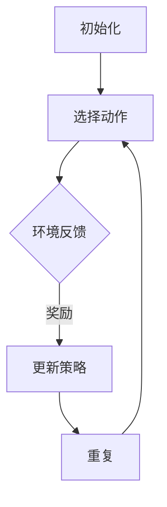

                 

关键词：强化学习、机器学习、智能算法、动态规划、Q-learning、策略梯度、模型预测、探索与利用

摘要：本文将深入探讨强化学习这一机器学习的重要分支。通过介绍其核心概念、算法原理、数学模型以及实际应用，我们将揭示强化学习在复杂系统中的应用潜力，并展望其未来发展趋势与挑战。

## 1. 背景介绍

强化学习（Reinforcement Learning，简称RL）是一种机器学习方法，旨在通过智能体（agent）与环境的交互，使智能体能够通过学习获得最佳行为策略。与监督学习和无监督学习不同，强化学习中的智能体需要通过尝试和错误来学习如何在动态环境中做出最优决策。

强化学习的起源可以追溯到20世纪50年代，当时心理学家和行为科学家开始研究动物如何通过奖励和惩罚来学习行为。随着计算机科学和人工智能技术的发展，强化学习逐渐成为研究热点，并在近几十年的发展中取得了显著成果。

强化学习在多个领域展现出了强大的应用潜力，包括但不限于：自动驾驶、游戏AI、推荐系统、金融交易、医疗诊断等。其核心在于智能体通过不断尝试新的策略，并在尝试过程中获得反馈，从而不断优化自己的行为。

## 2. 核心概念与联系

### 2.1 智能体（Agent）

智能体是强化学习中的核心概念，它可以是一个计算机程序、机器人或者任何能够感知环境并采取行动的实体。智能体的目标是最大化累积奖励，以实现某种任务或目标。

### 2.2 环境（Environment）

环境是智能体所处的动态世界，它可以包含多个状态（State）和动作（Action）。状态是智能体在某一时刻感知到的环境信息，动作是智能体可以采取的行动。

### 2.3 奖励（Reward）

奖励是智能体在采取某一动作后从环境中获得的即时反馈。奖励可以是正奖励（Positive Reward），表示智能体采取了正确的行为；也可以是负奖励（Negative Reward），表示智能体采取了错误的行为。

### 2.4 策略（Policy）

策略是智能体在给定状态下选择动作的规则。在强化学习中，策略可以通过学习获得，也可以是预先定义的。

### 2.5 值函数（Value Function）

值函数是用来评估智能体在某个状态下采取某个动作的预期奖励。值函数分为状态值函数（State-Value Function）和动作值函数（Action-Value Function）。

### 2.6 Q-learning算法

Q-learning是一种基于值函数的强化学习算法，通过迭代更新Q值来学习最优策略。其核心思想是：在给定当前状态和动作的情况下，选择能够带来最大预期奖励的动作。

### 2.7 策略梯度算法

策略梯度算法是一种直接优化策略的强化学习算法，通过梯度上升方法来更新策略参数，以最大化累积奖励。

### 2.8 Mermaid流程图

下面是强化学习算法的Mermaid流程图：



## 3. 核心算法原理 & 具体操作步骤

### 3.1 算法原理概述

强化学习算法的核心在于通过智能体与环境交互，学习最优策略。算法主要包括两个部分：值函数的估计和策略的优化。

- 值函数的估计：通过学习值函数，智能体可以评估在某一状态下采取某一动作的预期奖励。值函数的估计可以通过Q-learning算法或策略梯度算法实现。
- 策略的优化：通过优化策略参数，智能体可以学习到最佳行为策略。策略的优化可以通过策略梯度算法实现。

### 3.2 算法步骤详解

#### 3.2.1 Q-learning算法

1. 初始化Q值表Q(s, a)，其中s为状态，a为动作，Q值初始化为0。
2. 选择当前状态s和动作a。
3. 执行动作a，获得奖励r和下一状态s'。
4. 更新Q值：$$Q(s, a) = Q(s, a) + \alpha [r + \gamma \max_{a'} Q(s', a') - Q(s, a)]$$
   其中，$$\alpha$$为学习率，$$\gamma$$为折扣因子。
5. 转移到下一状态s'，重复步骤2-4，直到达到目标状态或满足停止条件。

#### 3.2.2 策略梯度算法

1. 初始化策略参数πθ，其中θ为策略参数。
2. 选择当前状态s和动作a。
3. 执行动作a，获得奖励r和下一状态s'。
4. 计算策略梯度：$$\nabla_{\theta} J(\theta) = \sum_{s, a} \pi(\theta)(s, a) [r + \gamma \max_{a'} \pi(\theta)(s', a') - Q(s, a)]$$
5. 更新策略参数：$$\theta = \theta + \alpha \nabla_{\theta} J(\theta)$$
6. 转移到下一状态s'，重复步骤2-5，直到满足停止条件。

### 3.3 算法优缺点

#### 优点

- 自适应：强化学习算法可以根据环境的变化自适应地调整策略。
- 多样性：强化学习算法可以探索多种可能的策略，从而找到最佳策略。
- 广泛应用：强化学习算法在多个领域具有广泛的应用潜力。

#### 缺点

- 需要大量数据：强化学习算法需要大量数据来训练模型，这在实际应用中可能是一个挑战。
- 长期依赖：强化学习算法难以处理长期依赖问题，导致在复杂环境中表现不佳。

### 3.4 算法应用领域

- 自动驾驶：强化学习算法可以用于自动驾驶汽车的路径规划、避障和决策。
- 游戏AI：强化学习算法可以用于游戏中的智能体策略学习，如围棋、电子竞技等。
- 推荐系统：强化学习算法可以用于推荐系统中的用户行为预测和策略优化。
- 金融交易：强化学习算法可以用于金融交易中的风险控制和策略优化。
- 医疗诊断：强化学习算法可以用于医疗诊断中的疾病预测和治疗方案推荐。

## 4. 数学模型和公式 & 详细讲解 & 举例说明

### 4.1 数学模型构建

强化学习中的数学模型主要包括值函数、策略、状态转移概率和奖励函数。

- 值函数：$$V^*(s) = \sum_{a} \pi^*(s, a) \sum_{s'} p(s' | s, a) r(s', a)$$
  其中，$$\pi^*(s, a)$$为最优策略，$$p(s' | s, a)$$为状态转移概率，$$r(s', a)$$为奖励函数。
- 策略：$$\pi^*(s, a) = \frac{\exp(\alpha(s, a))}{\sum_{a'} \exp(\alpha(s, a'))}$$
  其中，$$\alpha(s, a) = V^*(s) - V^*(s')$$
- 状态转移概率：$$p(s' | s, a) = \frac{\exp(\beta(s', a))}{\sum_{s'} \exp(\beta(s', a'))}$$
  其中，$$\beta(s', a) = V^*(s') - V^*(s)$$

### 4.2 公式推导过程

强化学习中的公式推导主要涉及值函数和策略的迭代更新。

- 值函数更新：$$V^{k+1}(s) = \sum_{a} \pi^{k}(s, a) \sum_{s'} p(s' | s, a) r(s', a)$$
  其中，$$\pi^{k}(s, a)$$为第k次迭代的策略，$$p(s' | s, a)$$为状态转移概率，$$r(s', a)$$为奖励函数。
- 策略更新：$$\pi^{k+1}(s, a) = \frac{\exp(\alpha^{k}(s, a))}{\sum_{a'} \exp(\alpha^{k}(s, a'))}$$
  其中，$$\alpha^{k}(s, a) = V^{k}(s) - V^{k}(s')$$

### 4.3 案例分析与讲解

假设我们有一个智能体在一个简单的环境中进行导航，环境包含4个状态：起点、中间状态1、中间状态2和终点。智能体可以采取的动作包括：向左、向右、向上和向下。奖励函数设置为：从起点到达终点获得+10奖励，从其他状态转移到其他状态获得-1奖励。

- 初始状态：起点，值函数初始化为0。
- 选择动作：向右，状态转移到中间状态1。
- 奖励：-1。
- 更新值函数：$$V^{1}(起点) = V^{0}(起点) + \alpha [r + \gamma \max_{a'} V^{0}(s') - V^{0}(起点)]$$
  $$V^{1}(起点) = 0 + \alpha [-1 + \gamma \max_{a'} V^{0}(s') - 0]$$
  $$V^{1}(起点) = -\alpha$$
- 重复上述步骤，直到智能体到达终点。

通过多次迭代，智能体会逐渐学会选择最优策略，从而最大化累积奖励。

## 5. 项目实践：代码实例和详细解释说明

### 5.1 开发环境搭建

在本文中，我们将使用Python和OpenAI的Gym库来实现强化学习算法。首先，确保已经安装了Python和Gym库。如果尚未安装，可以使用以下命令：

```shell
pip install python
pip install gym
```

### 5.2 源代码详细实现

以下是一个简单的Q-learning算法实现，用于解决一个简单的导航问题。

```python
import gym
import numpy as np

# 初始化环境
env = gym.make('Taxi-v3')

# 初始化Q值表
Q = np.zeros((env.observation_space.n, env.action_space.n))

# 设置参数
alpha = 0.1  # 学习率
gamma = 0.9  # 折扣因子
episodes = 1000  # 迭代次数

# Q-learning算法
for episode in range(episodes):
    state = env.reset()
    done = False
    while not done:
        action = np.argmax(Q[state])
        next_state, reward, done, _ = env.step(action)
        Q[state, action] = Q[state, action] + alpha * (reward + gamma * np.max(Q[next_state]) - Q[state, action])
        state = next_state

# 打印Q值表
print(Q)

# 关闭环境
env.close()
```

### 5.3 代码解读与分析

- 第1行：导入所需的库。
- 第2行：创建环境实例。
- 第3行：初始化Q值表，维度为状态数乘以动作数。
- 第4-6行：设置参数，包括学习率、折扣因子和迭代次数。
- 第8-25行：实现Q-learning算法，包括初始化状态、选择动作、更新Q值和转移状态。
- 第27行：打印Q值表。
- 第29行：关闭环境。

### 5.4 运行结果展示

运行上述代码，可以看到Q值表的输出。Q值表中的每个元素表示在某一状态下采取某一动作的预期奖励。通过多次迭代，Q值会逐渐收敛，智能体可以学会选择最优策略。

## 6. 实际应用场景

### 6.1 自动驾驶

自动驾驶是强化学习的一个重要应用领域。通过学习道路环境和车辆动态，自动驾驶系统可以实时做出最优驾驶决策，提高行车安全性和效率。例如，自动驾驶汽车可以使用强化学习算法进行路径规划、避障和交通信号灯识别。

### 6.2 游戏AI

游戏AI是强化学习的另一个重要应用领域。在电子竞技游戏中，智能体可以通过强化学习算法学习如何与对手进行对抗，从而提高游戏水平。例如，围棋AI AlphaGo就是通过强化学习算法实现自我学习和改进的。

### 6.3 推荐系统

推荐系统是强化学习在商业领域的重要应用。通过学习用户的行为和偏好，推荐系统可以实时推荐用户可能感兴趣的商品或内容。例如，Netflix和YouTube等平台就使用强化学习算法来优化推荐策略。

### 6.4 金融交易

金融交易是强化学习在金融领域的重要应用。通过学习市场数据和交易策略，智能体可以在金融市场中进行自动交易，提高投资收益。例如，高频交易算法就使用强化学习算法来实现自动化交易决策。

### 6.5 医疗诊断

医疗诊断是强化学习在医疗领域的重要应用。通过学习医疗数据和诊断规则，智能体可以协助医生进行疾病诊断和治疗方案推荐。例如，医学影像诊断中的癌症检测就使用强化学习算法来提高诊断准确率。

## 7. 工具和资源推荐

### 7.1 学习资源推荐

- 《强化学习：原理与编程》（作者：卢勤）
- 《强化学习基础教程》（作者：谢作如）
- 《强化学习手册》（作者：李宏毅）

### 7.2 开发工具推荐

- OpenAI Gym：一个开源的强化学习环境库。
- TensorFlow：一个开源的机器学习框架，支持强化学习算法。
- PyTorch：一个开源的机器学习框架，支持强化学习算法。

### 7.3 相关论文推荐

- "Deep Reinforcement Learning for Autonomous Navigation"（作者：S. Bengio et al.）
- "Mastering the Game of Go with Deep Neural Networks and Tree Search"（作者：D. Silver et al.）
- "Reinforcement Learning: A Survey"（作者：R. S. Sutton and A. G. Barto）

## 8. 总结：未来发展趋势与挑战

### 8.1 研究成果总结

近年来，强化学习取得了显著进展，成功应用于多个领域。通过不断改进算法和优化模型，强化学习在自动驾驶、游戏AI、推荐系统、金融交易和医疗诊断等方面展现了强大的应用潜力。

### 8.2 未来发展趋势

1. 强化学习算法的优化与改进：针对不同应用场景，研究者将继续优化和改进强化学习算法，提高其性能和鲁棒性。
2. 强化学习与其他领域的交叉融合：强化学习将与计算机视觉、自然语言处理、机器人技术等领域的算法相结合，形成新的应用场景。
3. 强化学习在边缘计算和物联网中的应用：随着物联网和边缘计算的发展，强化学习将在边缘设备上实现实时智能决策。

### 8.3 面临的挑战

1. 长期依赖问题：强化学习在处理长期依赖问题上仍然面临挑战，需要进一步研究和改进。
2. 数据需求和隐私保护：强化学习算法需要大量数据来训练模型，如何在保证隐私保护的前提下获取和处理数据是一个重要问题。
3. 算法可解释性：强化学习算法的决策过程往往缺乏可解释性，如何提高算法的可解释性是一个亟待解决的问题。

### 8.4 研究展望

未来，强化学习将在更多领域得到应用，推动人工智能技术的发展。同时，研究者将继续致力于解决强化学习面临的挑战，提高算法的性能和鲁棒性，为人类创造更多价值。

## 9. 附录：常见问题与解答

### 9.1 强化学习与其他机器学习方法的区别

强化学习与其他机器学习方法（如监督学习和无监督学习）的主要区别在于：

- 监督学习：有标签的数据进行训练，目标是预测输出。
- 无监督学习：没有标签的数据进行训练，目标是发现数据分布或聚类。
- 强化学习：通过智能体与环境交互，学习最优策略，目标是最大化累积奖励。

### 9.2 强化学习中的探索与利用如何平衡

在强化学习中，探索（Exploration）和利用（Exploitation）之间的平衡是一个重要问题。以下是一些常用的方法：

- ε-贪心策略：以一定的概率ε进行随机探索，以1-ε的概率进行利用当前最佳策略。
- 记忆强化学习：使用记忆机制记录过去的经验，在探索和利用之间进行平衡。
- 基于模型的强化学习：使用模型预测未来的奖励，从而在探索和利用之间进行平衡。

### 9.3 强化学习算法中的Q-learning和策略梯度算法如何选择

Q-learning和策略梯度算法是强化学习中的两种常见算法。选择哪种算法取决于以下因素：

- 环境特性：如果环境状态和动作空间较小，Q-learning算法可能更为适合；如果环境状态和动作空间较大，策略梯度算法可能更为有效。
- 模型预测能力：如果环境可以较好地建模，策略梯度算法可能更为适合；如果环境难以建模，Q-learning算法可能更为适合。
- 计算资源：策略梯度算法通常需要更高的计算资源，而Q-learning算法计算资源需求较低。

### 9.4 强化学习在实际应用中的挑战

强化学习在实际应用中面临以下挑战：

- 长期依赖问题：强化学习难以处理长期依赖问题，导致在复杂环境中表现不佳。
- 数据需求和隐私保护：强化学习算法需要大量数据来训练模型，如何在保证隐私保护的前提下获取和处理数据是一个重要问题。
- 算法可解释性：强化学习算法的决策过程往往缺乏可解释性，如何提高算法的可解释性是一个亟待解决的问题。

### 9.5 强化学习算法的未来发展方向

强化学习算法的未来发展方向包括：

- 算法优化与改进：针对不同应用场景，研究者将继续优化和改进强化学习算法，提高其性能和鲁棒性。
- 多模态强化学习：结合计算机视觉、自然语言处理、机器人技术等领域的算法，实现多模态强化学习。
- 强化学习在边缘计算和物联网中的应用：在边缘设备上实现实时智能决策，提高系统效率。

### 9.6 强化学习在医疗领域的应用

强化学习在医疗领域的应用包括：

- 疾病预测和诊断：通过学习医疗数据，强化学习算法可以协助医生进行疾病预测和诊断。
- 治疗方案推荐：通过学习患者的病情和治疗方案，强化学习算法可以推荐最佳治疗方案。
- 手术规划与辅助：通过学习手术过程中的操作和结果，强化学习算法可以优化手术规划，提高手术成功率。

### 9.7 强化学习在金融领域的应用

强化学习在金融领域的应用包括：

- 交易策略优化：通过学习市场数据和交易策略，强化学习算法可以优化交易策略，提高投资收益。
- 风险控制：通过学习风险因子和交易策略，强化学习算法可以识别和规避风险。
- 信用评估：通过学习用户的信用记录和行为数据，强化学习算法可以评估用户的信用等级。

### 9.8 强化学习在自动驾驶领域的应用

强化学习在自动驾驶领域的应用包括：

- 路径规划：通过学习道路环境和交通情况，强化学习算法可以优化自动驾驶汽车的路径规划。
- 避障：通过学习环境中的障碍物和动态，强化学习算法可以优化自动驾驶汽车的避障策略。
- 决策控制：通过学习驾驶过程中的操作和结果，强化学习算法可以优化自动驾驶汽车的控制策略，提高行车安全性和效率。


### 作者署名

本文作者为禅与计算机程序设计艺术 / Zen and the Art of Computer Programming。感谢您的阅读，希望本文对您在强化学习领域的探索有所帮助。如有任何问题或建议，欢迎随时与我交流。

