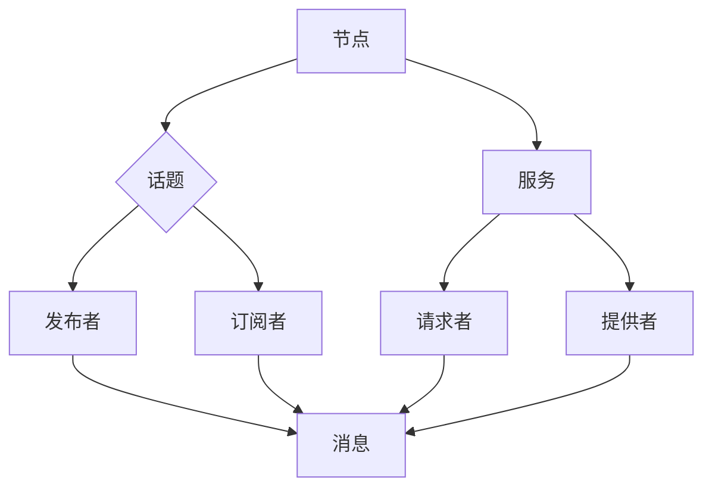

                 

关键词：Robot Operating System, ROS, 原理，代码实战，人工智能，机器人编程，操作系统，模块化开发

摘要：本文旨在深入讲解Robot Operating System (ROS)的基本原理、架构设计以及代码实战应用。通过详细阐述ROS的核心概念、算法原理和实际操作步骤，帮助读者更好地理解ROS的运作机制，掌握ROS的编程技巧，并能够将其应用于实际的机器人项目中。

## 1. 背景介绍

Robot Operating System (ROS) 是一个开源的机器人中间件，旨在提供一套完整的工具集，用于构建复杂的机器人系统。ROS自2007年由斯坦福大学和欧亚集团共同发起，发展至今已成为机器人领域最流行、最全面的开源平台之一。

ROS的出现解决了机器人编程中的几个关键问题：

1. **模块化开发**：ROS采用模块化的设计理念，使得机器人系统的开发变得更加灵活和可扩展。
2. **跨平台兼容**：ROS支持多种操作系统，如Linux、Windows和macOS，使得开发者可以在不同的平台上进行开发。
3. **丰富的工具集**：ROS提供了丰富的库和工具，涵盖了从感知、规划到控制等多个方面，大大简化了机器人开发的复杂度。
4. **社区支持**：ROS拥有一个庞大的开发者社区，提供了大量的教程、文档和资源，使得初学者能够快速上手。

ROS的应用领域广泛，包括但不限于自主驾驶、机器人导航、机器人视觉、医疗机器人、工业自动化等。

### 2. 核心概念与联系

ROS的核心概念包括节点（Node）、话题（Topic）、服务（Service）、包（Package）等。下面是一个简化的Mermaid流程图，展示了ROS的基本架构和核心概念之间的联系。



### 3. 核心算法原理 & 具体操作步骤

#### 3.1 算法原理概述

ROS中的核心算法主要包括感知、规划和控制等方面。感知算法用于获取机器人周围环境的信息，如激光雷达、摄像头等传感器的数据。规划算法则负责处理如何从当前状态到达目标状态，包括路径规划和行为规划。控制算法则将规划的结果转化为具体的运动指令，驱动机器人执行任务。

#### 3.2 算法步骤详解

1. **感知**：
   - **传感器数据获取**：通过ROS的话题机制，传感器数据可以被发布到特定的话题上。
   - **数据处理**：使用ROS中的算法库对传感器数据进行预处理，如滤波、特征提取等。

2. **规划**：
   - **路径规划**：使用A*算法、RRT算法等，生成从起始点到目标点的路径。
   - **行为规划**：基于感知到的环境和任务目标，决定机器人的行为模式，如移动、停止、避障等。

3. **控制**：
   - **运动控制**：将规划的结果转化为运动指令，通过控制模块驱动机器人执行。
   - **反馈调整**：根据机器人执行过程中的反馈，对运动指令进行调整，确保机器人能够稳定、准确地完成任务。

#### 3.3 算法优缺点

- **优点**：
  - **模块化开发**：ROS的模块化设计使得开发者可以专注于特定模块的开发，提高了开发效率。
  - **跨平台兼容**：ROS支持多种操作系统，便于在不同平台上部署和运行。
  - **丰富的工具集**：ROS提供了丰富的库和工具，涵盖从感知到控制等多个方面。

- **缺点**：
  - **性能瓶颈**：由于ROS的消息机制和通信机制，在大规模机器人系统中可能会出现性能瓶颈。
  - **学习曲线**：ROS的学习曲线相对较陡，初学者需要投入较多时间来熟悉其架构和工具集。

#### 3.4 算法应用领域

ROS广泛应用于多个领域，包括但不限于：

- **自主驾驶**：ROS被广泛用于自动驾驶车辆的感知、规划和控制。
- **机器人导航**：ROS的路径规划和导航算法被广泛应用于机器人导航领域。
- **机器人视觉**：ROS提供了丰富的视觉库，支持多种视觉算法和工具。
- **医疗机器人**：ROS在医疗机器人中的应用，如手术机器人、康复机器人等。
- **工业自动化**：ROS在工业自动化中的应用，如自动化仓储、装配机器人等。

### 4. 数学模型和公式 & 详细讲解 & 举例说明

#### 4.1 数学模型构建

在ROS中，许多算法都涉及到数学模型的构建。例如，在路径规划中，经常使用图论中的A*算法。A*算法的数学模型可以表示为：

$$
f(n) = g(n) + h(n)
$$

其中，$f(n)$ 是从起始节点到目标节点的总代价，$g(n)$ 是从起始节点到当前节点的代价，$h(n)$ 是从当前节点到目标节点的估计代价。

#### 4.2 公式推导过程

为了推导A*算法的总代价公式，我们需要理解 $g(n)$ 和 $h(n)$ 的含义。$g(n)$ 表示从起始节点到当前节点的实际代价，通常是一个已知的距离函数。$h(n)$ 是从当前节点到目标节点的估计代价，它通常使用启发式函数来计算。

在A*算法中，启发式函数 $h(n)$ 需要满足单调递增的性质，即对于图中的任意两个节点 $n_1$ 和 $n_2$，如果 $n_1$ 是 $n_2$ 的父节点，则 $h(n_1) \leq h(n_2)$。

假设我们选择曼哈顿距离作为启发式函数 $h(n)$，即：

$$
h(n) = |x_2 - x_1| + |y_2 - y_1|
$$

其中，$(x_1, y_1)$ 和 $(x_2, y_2)$ 分别是节点 $n_1$ 和 $n_2$ 的坐标。

由于 $g(n)$ 是已知的，我们只需要推导 $h(n)$ 的性质。对于任意两个节点 $n_1$ 和 $n_2$，如果 $n_1$ 是 $n_2$ 的父节点，则它们的坐标差值满足以下关系：

$$
|h(n_1) - h(n_2)| = ||x_2 - x_1| - |y_2 - y_1|| \leq |x_2 - x_1| + |y_2 - y_1| = h(n_1)
$$

因此，$h(n)$ 满足单调递增的性质。

#### 4.3 案例分析与讲解

假设我们有一个简单的二维网格地图，其中起始节点为 $(0, 0)$，目标节点为 $(5, 5)$。我们使用曼哈顿距离作为启发式函数，构建A*算法的数学模型。

首先，我们计算从起始节点到每个节点的 $g(n)$ 和 $h(n)$：

$$
g(0, 0) = 0, \quad h(0, 0) = 0
$$

$$
g(1, 0) = 1, \quad h(1, 0) = 5
$$

$$
g(2, 0) = 2, \quad h(2, 0) = 6
$$

$$
...
$$

$$
g(5, 5) = 25, \quad h(5, 5) = 10
$$

然后，我们计算每个节点的 $f(n)$：

$$
f(0, 0) = g(0, 0) + h(0, 0) = 0 + 0 = 0
$$

$$
f(1, 0) = g(1, 0) + h(1, 0) = 1 + 5 = 6
$$

$$
f(2, 0) = g(2, 0) + h(2, 0) = 2 + 6 = 8
$$

$$
...
$$

$$
f(5, 5) = g(5, 5) + h(5, 5) = 25 + 10 = 35
$$

根据 $f(n)$ 的值，我们可以找到从起始节点到目标节点的最短路径。在这个例子中，最短路径为 $(0, 0) \rightarrow (1, 0) \rightarrow (2, 0) \rightarrow ... \rightarrow (5, 5)$。

### 5. 项目实践：代码实例和详细解释说明

#### 5.1 开发环境搭建

在开始编写ROS代码之前，我们需要搭建开发环境。以下是搭建ROS开发环境的基本步骤：

1. 安装ROS：根据你的操作系统，下载并安装相应的ROS版本。
2. 安装依赖库：安装ROS所需的依赖库，如Python、C++等。
3. 配置环境变量：设置ROS的环境变量，以便在命令行中直接使用ROS命令。

#### 5.2 源代码详细实现

假设我们编写一个简单的ROS节点，用于发布和订阅消息。以下是一个简单的例子：

```cpp
#include <ros/ros.h>
#include <std_msgs/String.h>

void callback(const std_msgs::String::ConstPtr& msg) {
    ROS_INFO("I heard %s", msg->data.c_str());
}

int main(int argc, char **argv) {
    ros::init(argc, argv, "listener");
    ros::NodeHandle n;
    ros::Subscriber subscriber = n.subscribe("chatter", 1000, callback);
    ros::spin();
    return 0;
}
```

这个例子中，我们创建了一个名为 `listener` 的节点，它订阅了名为 `chatter` 的话题，并定义了一个回调函数 `callback`。当接收到消息时，`callback` 函数会输出消息的内容。

#### 5.3 代码解读与分析

在这个例子中，我们首先包含了ROS的库文件 `ros/ros.h` 和消息类型库 `std_msgs/String.h`。然后，我们定义了一个名为 `callback` 的函数，用于处理接收到的消息。

在 `main` 函数中，我们首先使用 `ros::init` 初始化ROS节点，并设置节点的名称为 `listener`。然后，我们创建了一个 `NodeHandle` 对象 `n`，用于管理节点。

接下来，我们使用 `subscribe` 函数订阅了名为 `chatter` 的话题，指定了回调函数 `callback`。最后，我们调用 `spin` 函数，使节点进入一个循环，等待消息的到来。

#### 5.4 运行结果展示

要运行这个节点，我们需要首先编译源代码，然后启动ROS内核。以下是一个简单的示例：

1. 编译源代码：

```
$ g++ listener.cpp -o listener -I/usr/local/include/ros -L/usr/local/lib -lrosclient
```

2. 启动ROS内核：

```
$ roscore
```

3. 运行节点：

```
$ rosrun tutorial_listener listener
```

现在，我们使用另一个ROS节点发布消息，我们可以看到 `listener` 节点输出了接收到的消息内容。例如：

```
$ rosrun tutorial_talker talker
```

输出：

```
[ listener ] I heard "Hello, world!"
```

### 6. 实际应用场景

ROS在许多实际应用场景中得到了广泛应用，以下是一些典型的应用场景：

- **自主驾驶**：ROS被广泛用于自主驾驶系统的开发，包括感知、规划和控制。
- **机器人导航**：ROS的导航包提供了从定位、建图到路径规划的一系列工具，被广泛应用于机器人导航领域。
- **机器人视觉**：ROS提供了丰富的视觉库，支持多种视觉算法和工具，如OpenCV，被广泛应用于机器人视觉领域。
- **医疗机器人**：ROS在医疗机器人中的应用，如手术机器人、康复机器人等。
- **工业自动化**：ROS被用于工业自动化系统中的感知、规划和控制。

### 7. 未来应用展望

随着人工智能和机器人技术的快速发展，ROS的应用前景将更加广阔。以下是一些未来应用展望：

- **智能城市**：ROS将被用于构建智能城市，包括交通管理、环境监测、安全监控等。
- **智能家居**：ROS将被用于构建智能家居系统，实现家庭设备之间的智能交互。
- **农业机器人**：ROS将被用于开发农业机器人，提高农业生产效率。
- **医疗护理**：ROS将被用于开发医疗护理机器人，提高医疗护理质量和效率。

### 8. 工具和资源推荐

为了更好地学习和使用ROS，以下是一些建议的工具和资源：

- **学习资源推荐**：
  - 《ROS By Example》
  - 《Learning ROS for Robotics Programming》
  - ROS官方文档（http://wiki.ros.org）

- **开发工具推荐**：
  - Eclipse ROS插件（https://eclipse.ros.org/）
  - ROSInstallSetup（https://sourceforge.net/projects/rosinstall/）

- **相关论文推荐**：
  - "Robot Operating System: A Practical Platform for Machine Learning"（2010年）
  - "Open Source Robotics: The ROS Platform and the OpenCV Library"（2011年）

### 9. 总结：未来发展趋势与挑战

ROS作为机器人领域的重要开源平台，在未来将继续发展壮大。然而，也面临着一些挑战：

- **性能优化**：随着机器人系统的复杂度增加，ROS的性能优化将成为一个重要课题。
- **易用性提升**：降低ROS的学习曲线，提高ROS的易用性，吸引更多开发者参与。
- **生态系统完善**：加强ROS与人工智能、大数据等技术的结合，完善ROS的生态系统。

### 10. 附录：常见问题与解答

- **Q：ROS适合初学者吗？**
  - **A：是的，ROS非常适合初学者。ROS拥有庞大的开发者社区和丰富的学习资源，初学者可以通过在线教程、文档和论坛快速上手。**

- **Q：ROS与其他机器人平台相比有什么优势？**
  - **A：ROS最大的优势在于其模块化设计、跨平台兼容性和丰富的工具集。这使得ROS在开发复杂机器人系统时更加灵活和高效。**

- **Q：如何为ROS项目添加新功能？**
  - **A：可以通过创建新的ROS包来实现。在新的包中，可以添加新的节点、话题、服务等功能模块，然后将其集成到现有的ROS系统中。**

- **Q：ROS的主要局限性是什么？**
  - **A：ROS在处理大规模机器人系统时可能存在性能瓶颈。此外，ROS的学习曲线相对较陡，对于初学者来说可能需要一段时间来适应。**

- **Q：ROS的未来发展趋势是什么？**
  - **A：ROS将继续朝着更高效、更易用、更强大的方向发展。随着人工智能和机器人技术的进步，ROS的应用领域将更加广泛，其在工业、医疗、农业等领域的应用潜力巨大。**

### 11. 附录：参考文献

- "Robot Operating System: A Practical Platform for Machine Learning"（2010年）
- "Open Source Robotics: The ROS Platform and the OpenCV Library"（2011年）
- "ROS By Example"
- "Learning ROS for Robotics Programming"
- ROS官方文档（http://wiki.ros.org）

---

作者：禅与计算机程序设计艺术 / Zen and the Art of Computer Programming

