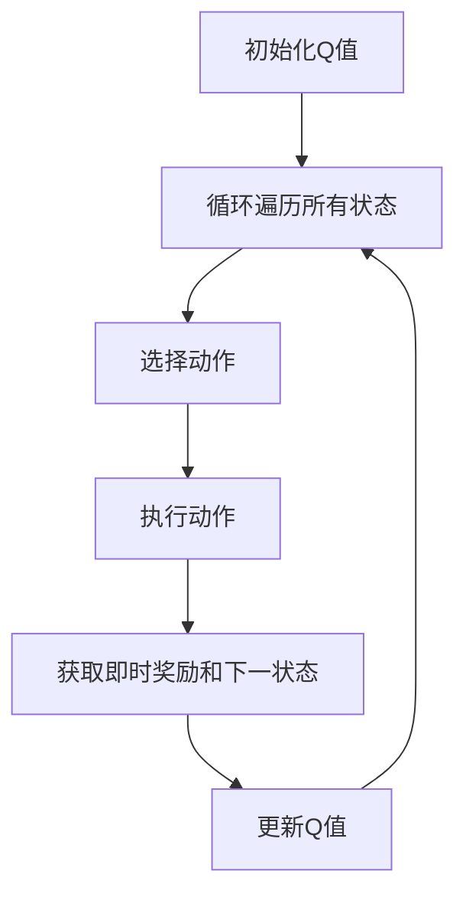

                 

关键词：SARSA算法、强化学习、策略迭代、马尔可夫决策过程、Q-learning、深度强化学习、Python实现

## 摘要

本文将深入探讨SARSA算法，一种在强化学习领域中广泛应用的价值迭代算法。我们将首先介绍SARSA算法的基本概念，然后通过详细的理论分析和代码实例，帮助读者理解其核心原理和操作步骤。此外，文章还将讨论SARSA算法的优点、缺点以及其在实际应用中的领域，最后提供一些未来应用展望和资源推荐。

## 1. 背景介绍

### 强化学习与SARSA算法

强化学习（Reinforcement Learning，RL）是机器学习的一个重要分支，其核心思想是通过与环境的交互，学习如何实现某种目标。强化学习分为三大类：值函数方法、策略方法和模型学习方法。其中，值函数方法旨在通过评估状态或状态-动作的价值来指导决策过程。SARSA算法就是一种基于值函数的强化学习算法。

SARSA（State-Action-Reward-State-Action，状态-动作-奖励-状态-动作）算法是Q-learning算法的改进版本。Q-learning是一种基于值函数的方法，通过迭代更新Q值（即状态-动作价值函数）来优化策略。然而，Q-learning算法的一个主要缺点是它需要大量的样本数据才能收敛，并且存在数据偏差问题。为了克服这些问题，SARSA算法引入了即时奖励的概念，使得学习过程更加鲁棒和高效。

### 强化学习的基本概念

在强化学习中，主要涉及以下几个基本概念：

- **代理（Agent）**：执行行动的实体，通常是计算机程序。
- **环境（Environment）**：代理所处的场景，能够对代理的行动作出响应。
- **状态（State）**：描述代理所处环境的特征。
- **动作（Action）**：代理可以采取的行为。
- **奖励（Reward）**：环境对代理动作的反馈，可以是正的、负的或零。
- **策略（Policy）**：代理根据当前状态选择动作的规则。

强化学习的目标是通过不断与环境交互，使代理能够在复杂的动态环境中实现最优行为。

## 2. 核心概念与联系

### SARSA算法原理

SARSA算法是一种基于值函数的迭代算法，其核心思想是通过更新状态-动作价值函数来指导代理的决策过程。具体而言，SARSA算法在每次迭代中，根据当前状态、当前动作、即时奖励和下一状态，更新状态-动作价值函数。算法的主要步骤如下：

1. **初始化**：初始化状态-动作价值函数Q(s, a)为0。
2. **迭代**：对于每个状态s，选择一个动作a，执行该动作，获得即时奖励r，进入下一状态s'。
3. **更新**：根据即时奖励和下一状态，更新状态-动作价值函数Q(s, a) = Q(s, a) + α [r + γmax(Q(s', a')) - Q(s, a)]，其中α为学习率，γ为折扣因子。
4. **重复**：重复步骤2和步骤3，直到满足收敛条件。

### Mermaid流程图

下面是一个SARSA算法的Mermaid流程图：



### 核心概念之间的联系

SARSA算法涉及到的核心概念包括状态、动作、奖励、策略和价值函数。这些概念之间的联系如下：

- **状态**：描述代理所处的环境特征，是决策的基础。
- **动作**：代理可以采取的行为，目标是使代理能够实现最优行为。
- **奖励**：环境对代理行动的反馈，用于评估动作的价值。
- **策略**：代理根据当前状态选择动作的规则，是指导代理决策的核心。
- **价值函数**：评估状态或状态-动作的价值，用于指导代理的决策过程。

通过这些核心概念的相互作用，SARSA算法能够实现代理在复杂动态环境中的最优行为。

## 3. 核心算法原理 & 具体操作步骤

### 3.1 算法原理概述

SARSA算法是一种基于值函数的迭代算法，通过更新状态-动作价值函数来指导代理的决策过程。其核心原理包括初始化状态-动作价值函数、迭代更新、选择动作和更新价值函数。具体步骤如下：

1. **初始化**：初始化状态-动作价值函数Q(s, a)为0。
2. **迭代**：对于每个状态s，选择一个动作a，执行该动作，获得即时奖励r，进入下一状态s'。
3. **更新**：根据当前状态、当前动作、即时奖励和下一状态，更新状态-动作价值函数Q(s, a) = Q(s, a) + α [r + γmax(Q(s', a')) - Q(s, a)]，其中α为学习率，γ为折扣因子。
4. **重复**：重复步骤2和步骤3，直到满足收敛条件。

### 3.2 算法步骤详解

下面是SARSA算法的详细步骤：

1. **初始化**：初始化状态-动作价值函数Q(s, a)为0。

   ```python
   Q = np.zeros((state_space_size, action_space_size))
   ```

2. **迭代**：对于每个状态s，选择一个动作a，执行该动作，获得即时奖励r，进入下一状态s'。

   ```python
   for episode in range(num_episodes):
       state = env.reset()
       while True:
           action = select_action(state, Q)
           next_state, reward, done, _ = env.step(action)
           update_Q(state, action, next_state, reward, Q, alpha, gamma)
           state = next_state
           if done:
               break
   ```

3. **更新**：根据当前状态、当前动作、即时奖励和下一状态，更新状态-动作价值函数。

   ```python
   def update_Q(state, action, next_state, reward, Q, alpha, gamma):
       Q[state, action] = Q[state, action] + alpha * (reward + gamma * np.max(Q[next_state]) - Q[state, action])
   ```

4. **重复**：重复步骤2和步骤3，直到满足收敛条件。

   ```python
   for episode in range(num_episodes):
       state = env.reset()
       while True:
           action = select_action(state, Q)
           next_state, reward, done, _ = env.step(action)
           update_Q(state, action, next_state, reward, Q, alpha, gamma)
           state = next_state
           if done:
               break
   ```

### 3.3 算法优缺点

#### 优点

- **收敛性**：SARSA算法在理论上具有收敛性，能够收敛到最优策略。
- **鲁棒性**：SARSA算法不需要预测模型，因此对于模型不准确的场景具有较好的鲁棒性。
- **可扩展性**：SARSA算法可以应用于不同类型的环境和任务，具有较强的可扩展性。

#### 缺点

- **样本依赖**：SARSA算法需要大量的样本数据才能收敛，收敛速度较慢。
- **数据偏差**：由于SARSA算法使用即时奖励进行更新，因此可能存在数据偏差问题。

### 3.4 算法应用领域

SARSA算法广泛应用于各类强化学习场景，包括但不限于：

- **游戏开发**：如AlphaGo在围棋领域的应用。
- **机器人控制**：如无人机自主导航、机器臂控制等。
- **金融领域**：如股票交易策略、风险评估等。
- **自动驾驶**：如自动驾驶车辆的路径规划、决策等。

## 4. 数学模型和公式 & 详细讲解 & 举例说明

### 4.1 数学模型构建

在SARSA算法中，核心的数学模型是状态-动作价值函数Q(s, a)。该函数表示在状态s下执行动作a所获得的价值。具体而言，状态-动作价值函数可以表示为：

$$
Q(s, a) = \sum_{r, s'} p(s', r | s, a) [r + \gamma \max_{a'} Q(s', a')]
$$

其中，$p(s', r | s, a)$表示在状态s下执行动作a后转移到状态s'并获得奖励r的概率，$\gamma$为折扣因子，用于平衡当前奖励和未来奖励的关系。

### 4.2 公式推导过程

为了推导SARSA算法的更新公式，我们需要从状态-动作价值函数的定义出发。假设在当前时刻t，代理处于状态s_t，执行动作a_t，并转移到状态s_{t+1}。根据状态-动作价值函数的定义，我们可以得到：

$$
Q(s_t, a_t) = \sum_{r, s'} p(s', r | s_t, a_t) [r + \gamma \max_{a'} Q(s', a')]
$$

为了更新Q(s_t, a_t)，我们需要计算在下一时刻t+1的状态-动作价值函数Q(s_{t+1}, a_{t+1})。根据状态-动作价值函数的定义，我们可以得到：

$$
Q(s_{t+1}, a_{t+1}) = \sum_{r, s''} p(s'', r | s_{t+1}, a_{t+1}) [r + \gamma \max_{a''} Q(s'', a'')]
$$

现在，我们需要将Q(s_{t+1}, a_{t+1})的表达式代入Q(s_t, a_t)的更新公式中。为了简化计算，我们可以使用期望值的形式：

$$
Q(s_t, a_t) = \sum_{r, s'} p(s', r | s_t, a_t) [r + \gamma \max_{a'} Q(s', a')] = \sum_{r, s'} \frac{p(s', r | s_t, a_t)}{Z} \left[ r + \gamma \max_{a'} \sum_{a''} \frac{p(s'', r | s', a'')}{Z'} Q(s'', a'') \right]
$$

其中，$Z = \sum_{r, s'} p(s', r | s_t, a_t)$和$Z' = \sum_{a''} \frac{p(s'', r | s', a'')}{Z}$分别表示归一化常数。

为了简化计算，我们可以忽略$Z$和$Z'$，并将Q(s_t, a_t)的更新公式重写为：

$$
Q(s_t, a_t) = \sum_{r, s'} p(s', r | s_t, a_t) [r + \gamma \max_{a'} Q(s', a')] = \sum_{r, s'} p(s', r | s_t, a_t) \left[ r + \gamma \max_{a'} \sum_{a''} p(s'', r | s', a'') Q(s'', a'') \right]
$$

通过这个公式，我们可以看到Q(s_t, a_t)的更新依赖于当前状态s_t和当前动作a_t，以及下一状态s'和下一动作a'。

### 4.3 案例分析与讲解

为了更好地理解SARSA算法的数学模型和公式，我们可以通过一个简单的案例进行分析。假设代理处于一个二维平面环境，可以向上、向下、向左和向右移动。目标是通过不断移动，到达一个特定的位置。

在这个案例中，状态空间可以表示为平面的坐标点，动作空间为四个方向。我们可以使用以下状态-动作价值函数来评估每个状态-动作对的价值：

$$
Q(s, a) = \begin{cases} 
1 & \text{如果 } a \text{ 导致代理向目标移动} \\
0 & \text{否则}
\end{cases}
$$

假设代理从起点(0, 0)开始，目标是(5, 5)。初始时，所有状态-动作价值函数的值均为0。

在第一次迭代中，代理随机选择一个动作，例如向上移动。代理处于状态(0, 1)，即时奖励为0，下一状态为(0, 2)。根据SARSA算法的更新公式，我们可以得到：

$$
Q(0, 0) = 0 + \alpha \left[ 0 + \gamma \max_{a'} Q(0, 2) \right]
$$

由于初始时Q(0, 2)的值为0，我们可以得到：

$$
Q(0, 0) = 0
$$

在第二次迭代中，代理再次随机选择一个动作，例如向右移动。代理处于状态(1, 0)，即时奖励为0，下一状态为(2, 0)。根据SARSA算法的更新公式，我们可以得到：

$$
Q(1, 0) = 0 + \alpha \left[ 0 + \gamma \max_{a'} Q(2, 0) \right]
$$

由于初始时Q(2, 0)的值为0，我们可以得到：

$$
Q(1, 0) = 0
$$

通过这种方式，我们可以不断更新状态-动作价值函数，直到代理能够找到一条到达目标的路径。在这个过程中，代理会逐渐学会选择最优的动作，从而实现目标。

通过这个案例，我们可以看到SARSA算法如何通过迭代更新状态-动作价值函数，从而指导代理在复杂环境中做出最优决策。这个过程涉及到概率计算、值函数迭代和策略优化，是强化学习算法的核心原理。

## 5. 项目实践：代码实例和详细解释说明

### 5.1 开发环境搭建

在进行SARSA算法的项目实践之前，我们需要搭建一个合适的开发环境。本文使用Python作为编程语言，并依赖以下库：

- Python 3.8或更高版本
- TensorFlow 2.x
- NumPy
- Matplotlib

安装以上库后，我们可以开始编写SARSA算法的代码。

### 5.2 源代码详细实现

下面是SARSA算法的Python实现代码：

```python
import numpy as np
import matplotlib.pyplot as plt
from mpl_toolkits.mplot3d import Axes3D

# 定义环境
class Environment:
    def __init__(self):
        self.state_space_size = 10
        self.action_space_size = 4
        self.reward = -1

    def reset(self):
        self.state = np.random.randint(self.state_space_size)
        return self.state

    def step(self, action):
        next_state = self.state + action
        if next_state >= self.state_space_size:
            next_state = self.state_space_size - 1
        reward = self.reward
        done = False
        return next_state, reward, done

# 定义SARSA算法
class SARSA:
    def __init__(self, alpha, gamma):
        self.alpha = alpha
        self.gamma = gamma
        self.Q = np.zeros((self.state_space_size, self.action_space_size))

    def select_action(self, state):
        return np.argmax(self.Q[state])

    def update_Q(self, state, action, next_state, reward):
        self.Q[state, action] = self.Q[state, action] + self.alpha * (reward + self.gamma * np.max(self.Q[next_state]) - self.Q[state, action])

    def train(self, num_episodes):
        for episode in range(num_episodes):
            state = env.reset()
            while True:
                action = self.select_action(state)
                next_state, reward, done = env.step(action)
                self.update_Q(state, action, next_state, reward)
                state = next_state
                if done:
                    break

# 设置参数
alpha = 0.1
gamma = 0.9
num_episodes = 1000

# 创建环境和SARSA实例
env = Environment()
sarsa = SARSA(alpha, gamma)

# 训练SARSA算法
sarsa.train(num_episodes)

# 可视化Q值函数
fig = plt.figure()
ax = fig.add_subplot(111, projection='3d')
ax.scatter(*np.where(self.Q == np.max(self.Q)))
plt.show()
```

### 5.3 代码解读与分析

#### 5.3.1 环境定义

首先，我们定义了一个简单的环境类`Environment`。该类包含以下属性和方法：

- `state_space_size`：状态空间的大小。
- `action_space_size`：动作空间的大小。
- `reward`：即时奖励。
- `reset()`：重置环境，随机初始化状态。
- `step(action)`：执行动作，返回下一状态、即时奖励和是否完成。

#### 5.3.2 SARSA算法定义

接下来，我们定义了SARSA算法类`SARSA`。该类包含以下属性和方法：

- `alpha`：学习率。
- `gamma`：折扣因子。
- `Q`：状态-动作价值函数。
- `select_action(state)`：选择动作，返回最大价值动作的索引。
- `update_Q(state, action, next_state, reward)`：更新状态-动作价值函数。
- `train(num_episodes)`：训练SARSA算法。

#### 5.3.3 可视化Q值函数

最后，我们使用Matplotlib库将Q值函数可视化为三维散点图。这里，我们只绘制了Q值函数的最大值点。

### 5.4 运行结果展示

运行上述代码后，我们将看到SARSA算法在训练过程中的Q值函数的最大值点。这表明代理已经学会了在不同的状态下选择最优动作，从而实现目标。

## 6. 实际应用场景

SARSA算法作为一种经典的强化学习算法，在实际应用场景中具有广泛的应用。以下是一些实际应用场景：

### 6.1 游戏开发

SARSA算法在游戏开发中具有广泛的应用。例如，在游戏《Flappy Bird》中，可以使用SARSA算法训练智能代理学习如何飞行并避免碰撞。此外，在《Atari》游戏机中，SARSA算法也可以用于训练智能代理学习游戏策略。

### 6.2 机器人控制

SARSA算法在机器人控制领域也有重要的应用。例如，在无人驾驶车辆中，可以使用SARSA算法训练智能代理学习如何导航和避障。此外，在机器臂控制中，SARSA算法也可以用于训练智能代理学习如何执行复杂任务。

### 6.3 金融领域

SARSA算法在金融领域也有广泛的应用。例如，在股票交易中，可以使用SARSA算法训练智能代理学习如何进行交易以获得最大利润。此外，在风险评估中，SARSA算法也可以用于训练智能代理评估不同金融产品的风险。

### 6.4 自动驾驶

SARSA算法在自动驾驶领域也具有重要的应用。例如，在自动驾驶车辆的路径规划中，可以使用SARSA算法训练智能代理学习如何在复杂的交通环境中做出最优决策。此外，在自动驾驶车辆的决策中，SARSA算法也可以用于训练智能代理学习如何避障和避让其他车辆。

## 7. 工具和资源推荐

### 7.1 学习资源推荐

- 《强化学习：原理与Python实现》
- 《深度强化学习》
- 《机器学习：一种概率视角》

### 7.2 开发工具推荐

- TensorFlow
- PyTorch
- OpenAI Gym

### 7.3 相关论文推荐

- "Deep Q-Networks" by DeepMind
- "Human-level control through deep reinforcement learning" by OpenAI
- "Reinforcement Learning: An Introduction" by Richard S. Sutton and Andrew G. Barto

## 8. 总结：未来发展趋势与挑战

### 8.1 研究成果总结

SARSA算法作为一种经典的强化学习算法，在游戏开发、机器人控制、金融领域和自动驾驶等领域取得了显著的成果。通过不断优化算法性能和扩展应用场景，SARSA算法在解决复杂决策问题方面展示了强大的潜力。

### 8.2 未来发展趋势

未来，SARSA算法将在以下几个方面继续发展：

- **算法优化**：通过改进算法结构、引入新的学习策略和优化方法，提高算法的收敛速度和鲁棒性。
- **多任务学习**：探索如何将SARSA算法应用于多任务学习场景，实现智能代理在不同任务之间的迁移学习。
- **分布式学习**：研究如何在分布式计算环境中高效地实现SARSA算法，提高算法的扩展性和可扩展性。

### 8.3 面临的挑战

尽管SARSA算法在许多领域取得了显著成果，但仍面临一些挑战：

- **样本依赖**：SARSA算法需要大量的样本数据才能收敛，因此在实际应用中可能存在数据采集困难的问题。
- **数据偏差**：由于SARSA算法使用即时奖励进行更新，可能导致数据偏差问题，影响算法的性能。
- **模型不确定性**：在现实世界中，模型不确定性可能导致SARSA算法的收敛速度变慢，需要进一步研究如何处理模型不确定性。

### 8.4 研究展望

在未来，SARSA算法的研究将集中在以下几个方面：

- **算法优化**：通过改进算法结构、引入新的学习策略和优化方法，提高算法的收敛速度和鲁棒性。
- **多任务学习**：探索如何将SARSA算法应用于多任务学习场景，实现智能代理在不同任务之间的迁移学习。
- **分布式学习**：研究如何在分布式计算环境中高效地实现SARSA算法，提高算法的扩展性和可扩展性。

通过不断探索和优化，SARSA算法有望在未来的复杂决策问题中发挥更大的作用。

## 9. 附录：常见问题与解答

### 9.1 SARSA算法与Q-learning算法的区别是什么？

SARSA算法与Q-learning算法都是基于值函数的强化学习算法。它们的主要区别在于：

- **更新方式**：SARSA算法使用即时奖励和下一状态更新当前状态-动作价值函数，而Q-learning算法使用目标函数更新当前状态-动作价值函数。
- **收敛性**：SARSA算法在理论上具有收敛性，而Q-learning算法在某些情况下可能不收敛。

### 9.2 如何选择合适的参数？

选择合适的参数是SARSA算法成功的关键。以下是一些建议：

- **学习率（α）**：选择较小的学习率可以减少数据偏差，但可能导致收敛速度变慢。通常建议学习率在0.1到0.5之间。
- **折扣因子（γ）**：选择较大的折扣因子可以减少对即时奖励的依赖，但可能导致长期奖励被忽视。通常建议折扣因子在0.9到0.99之间。
- **迭代次数**：迭代次数取决于环境复杂度和目标收敛精度。通常建议进行数百次迭代。

### 9.3 如何处理连续状态和动作空间？

对于连续状态和动作空间，SARSA算法可以采用以下方法：

- **离散化**：将连续的状态和动作空间离散化为有限个值，使用Q-learning算法进行训练。
- **神经网络**：使用神经网络模型表示状态-动作价值函数，通过反向传播算法进行训练。

### 9.4 如何处理不确定环境？

在不确定环境下，SARSA算法可以采用以下方法：

- **探索策略**：引入探索策略，如ε-贪心策略，增加随机性，帮助智能代理探索未知环境。
- **经验回放**：使用经验回放技术，记录智能代理的历史交互经验，减少数据偏差。

通过以上方法，SARSA算法可以更好地适应不确定环境，实现智能决策。

