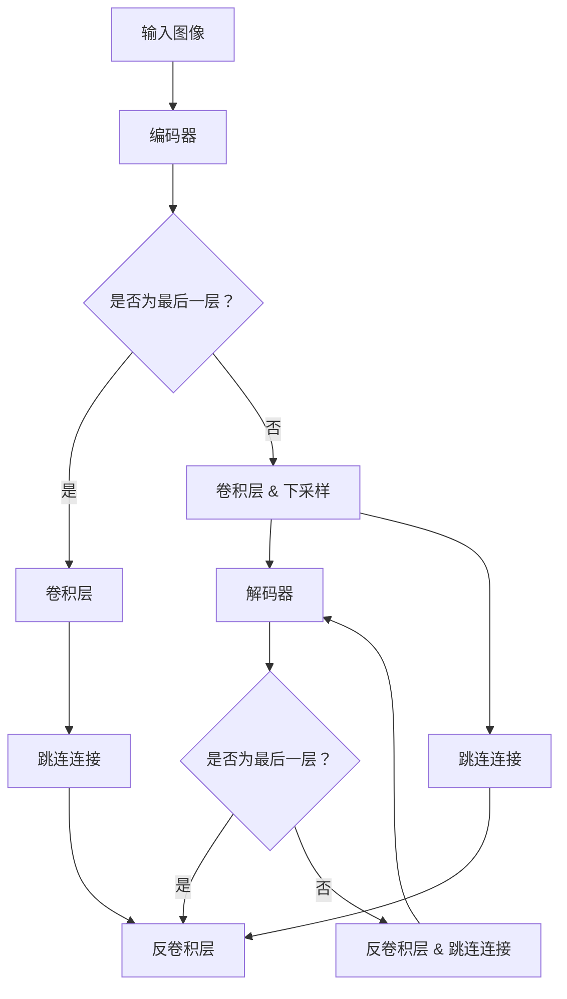

                 

本文将深入探讨SegNet的原理与代码实现，详细解释其工作流程和关键步骤，并通过实际代码实例进行讲解。本文的目标是帮助读者理解SegNet的核心思想，掌握其实现方法，并能够将其应用于实际问题中。我们将首先介绍背景知识，然后逐步讲解SegNet的算法原理、数学模型、项目实践，并探讨其应用场景和未来展望。

> **关键词：** SegNet，深度学习，卷积神经网络，图像分割，编码器-解码器架构，卷积层，反卷积层，跳连连接，像素级分类，超参数调整。

> **摘要：** 本文全面介绍了SegNet的原理与实现，包括其结构设计、工作流程和关键步骤。通过实际代码实例，读者将能够深入理解SegNet的机制，掌握其在图像分割任务中的具体应用。此外，本文还讨论了SegNet的优缺点、应用领域和未来发展方向。

## 1. 背景介绍

图像分割是计算机视觉领域的一项重要任务，其主要目的是将图像划分为多个区域或对象，以便进行进一步的图像分析或识别。传统的图像分割方法通常依赖于底层特征和手动设计的算法，如基于阈值、边缘检测、区域生长等。然而，随着深度学习技术的发展，基于卷积神经网络的分割方法逐渐成为主流。

卷积神经网络（CNN）在图像识别领域取得了巨大的成功，但其应用于图像分割时存在一些问题。首先，传统的CNN架构在处理图像时具有大量的全连接层，导致计算量和参数量巨大，难以处理大型图像。其次，CNN的输出通常是类别概率分布，而不是像素级的分割结果。为了解决这些问题，研究者提出了编码器-解码器（Encoder-Decoder）架构，其中SegNet是一个典型的代表。

SegNet是一种基于编码器-解码器架构的深度学习模型，专门用于图像分割任务。它通过利用卷积层和反卷积层，实现了对图像的高效编码和解码，从而能够准确地提取图像的局部特征并重建像素级的分割结果。SegNet在多个图像分割任务中取得了优异的性能，成为深度学习图像分割领域的重要工具。

本文将首先介绍SegNet的基本原理和结构设计，然后详细讲解其核心算法和操作步骤，并通过实际代码实例进行验证。最后，我们将讨论SegNet的应用领域和未来发展方向，为读者提供更全面的了解。

## 2. 核心概念与联系

### 2.1 SegNet的基本概念

SegNet是一种基于卷积神经网络（CNN）的深度学习模型，专门用于图像分割任务。它的核心思想是通过编码器（Encoder）将输入图像编码为特征图，然后通过解码器（Decoder）将特征图解码为像素级的分割结果。编码器和解码器之间通过跳连连接（Skip Connections）进行信息传递，以增强模型的性能和鲁棒性。

### 2.2 编码器-解码器架构

编码器-解码器架构是深度学习中常用的一种网络结构，旨在通过编码器提取输入图像的高层特征，并通过解码器将这些特征解码为原始尺度的图像。编码器通常由多个卷积层和下采样层组成，用于将输入图像逐渐缩小至较低维度的特征图。解码器则通过反卷积层和上采样层逐渐恢复图像的原始尺度。

### 2.3 卷积层和反卷积层

卷积层是CNN中最基本的层之一，用于提取图像的局部特征。卷积层通过滑动滤波器（卷积核）在输入图像上扫描，从而生成特征图。每个卷积核都对应一个特征通道，通过学习不同的滤波器，卷积层能够提取不同类型的特征。

反卷积层是卷积层的逆过程，它通过插值和反卷积操作将特征图放大至原始图像的尺寸。反卷积层在解码器中使用，用于将编码器提取的特征恢复到原始尺度，从而实现像素级的分割结果。

### 2.4 跳连连接

跳连连接是编码器-解码器架构中的一个重要设计，它通过将编码器的部分输出直接传递到解码器中，增强了模型的性能和鲁棒性。跳连连接在解码器中起到类似于“跳过”某些中间层的作用，使得解码器可以直接利用编码器提取的高层特征，从而减少了信息损失。

### 2.5 Mermaid流程图

为了更好地理解SegNet的工作流程和结构设计，我们使用Mermaid流程图来展示其核心概念和连接关系。以下是SegNet的Mermaid流程图：



在这个流程图中，编码器通过多个卷积层和下采样层将输入图像逐渐缩小至较低维度的特征图，然后解码器通过反卷积层和跳连连接将特征图逐渐放大至原始尺度的分割结果。跳连连接在解码器中起到了关键的作用，使得解码器可以直接利用编码器提取的高层特征，从而提高了模型的性能。

## 3. 核心算法原理 & 具体操作步骤

### 3.1 算法原理概述

SegNet的核心算法基于编码器-解码器架构，通过卷积层、反卷积层和跳连连接实现图像的高效编码和解码。具体来说，编码器通过多个卷积层和下采样层将输入图像逐渐缩小至较低维度的特征图，解码器则通过反卷积层和跳连连接将特征图逐渐放大至原始尺度的分割结果。

### 3.2 算法步骤详解

#### 步骤 1：输入图像预处理

在开始训练之前，需要对输入图像进行预处理。这通常包括归一化、裁剪和随机变换等操作，以增强模型的泛化能力。预处理步骤的具体实现取决于实际的应用场景和数据集。

#### 步骤 2：编码器阶段

编码器阶段包括多个卷积层和下采样层。每个卷积层都使用卷积核在输入图像上滑动，提取图像的局部特征，并通过卷积层的输出获得特征图。下采样层通过步长为2的平均池化操作，将特征图的尺寸缩小一半，从而减少了计算量和参数量。

具体操作步骤如下：

1. 初始化输入图像。
2. 通过第一个卷积层提取图像的局部特征。
3. 通过下采样层将特征图缩小尺寸。
4. 重复以上步骤，直到达到预定的层数或特征图尺寸。

#### 步骤 3：解码器阶段

解码器阶段包括多个反卷积层和跳连连接。反卷积层通过插值和反卷积操作将特征图放大至原始尺度的分割结果。跳连连接将编码器的部分输出直接传递到解码器中，增强了模型的性能和鲁棒性。

具体操作步骤如下：

1. 将编码器的最后一层输出作为解码器的输入。
2. 通过反卷积层将特征图放大至原始尺度的分割结果。
3. 添加跳连连接，将编码器的部分输出与解码器的当前输出进行拼接。
4. 重复以上步骤，直到达到解码器的最后一层。

#### 步骤 4：损失函数与优化

在训练过程中，使用交叉熵损失函数（Cross-Entropy Loss）来衡量模型的预测结果与真实标签之间的差异。优化算法通常选择随机梯度下降（Stochastic Gradient Descent，SGD）或其变种，如Adam优化器。

具体操作步骤如下：

1. 计算预测结果和真实标签之间的交叉熵损失。
2. 使用优化算法更新模型的参数。
3. 重复以上步骤，直到模型收敛或达到预定的迭代次数。

### 3.3 算法优缺点

#### 优点：

1. **高效性**：通过编码器-解码器架构，SegNet能够有效地提取图像的局部特征并重建像素级的分割结果。
2. **灵活性**：编码器和解码器的结构可以灵活调整，以适应不同的图像分割任务和数据集。
3. **易用性**：SegNet的实现相对简单，易于理解和部署。

#### 缺点：

1. **计算量大**：由于使用卷积层和反卷积层，SegNet的计算量较大，尤其是在处理大型图像时。
2. **参数量多**：虽然通过跳连连接减少了信息损失，但SegNet的参数量仍然较大，可能导致过拟合。

### 3.4 算法应用领域

SegNet在图像分割领域具有广泛的应用，尤其是在医疗影像、自动驾驶、目标检测等领域。以下是一些具体的应用示例：

1. **医疗影像**：使用SegNet对医学图像进行分割，可以帮助医生识别病变区域，提高诊断准确性。
2. **自动驾驶**：在自动驾驶系统中，SegNet用于分割道路、车道、行人等关键元素，以实现环境感知和决策。
3. **目标检测**：在目标检测任务中，SegNet可以用于提取目标的边界和位置信息，提高检测的准确性和效率。

## 4. 数学模型和公式 & 详细讲解 & 举例说明

### 4.1 数学模型构建

SegNet的数学模型主要包括卷积层、反卷积层和跳连连接。以下是这些层的数学公式：

#### 卷积层：

输入图像 $I_{in}$ 经过卷积层后，输出特征图 $F_{out}$ 可以表示为：

$$
F_{out} = \sigma(W \cdot I_{in} + b)
$$

其中，$W$ 是卷积核权重，$b$ 是偏置项，$\sigma$ 是激活函数，通常使用ReLU函数。

#### 反卷积层：

输入特征图 $F_{in}$ 经过反卷积层后，输出特征图 $F_{out}$ 可以表示为：

$$
F_{out} = \text{upsampling} \left( \sigma(W \cdot F_{in} + b) \right)
$$

其中，$\text{upsampling}$ 是上采样操作，用于将特征图的尺寸放大。

#### 跳连连接：

跳连连接通过将编码器的部分输出传递到解码器中，增强模型的性能。跳连连接可以表示为：

$$
F_{out} = \text{upsampling} \left( W_{s} \cdot F_{in} + b \right) + F_{skip}
$$

其中，$W_{s}$ 是跳连连接权重，$F_{skip}$ 是编码器的部分输出。

### 4.2 公式推导过程

以下是SegNet中几个关键公式的推导过程：

#### 4.2.1 卷积层

卷积层的推导基于基本的卷积操作。假设输入图像 $I_{in}$ 的尺寸为 $m \times n$，卷积核 $W$ 的尺寸为 $k \times k$，步长为 $s$。卷积操作可以表示为：

$$
F_{out}(i, j) = \sum_{p=0}^{k-1} \sum_{q=0}^{k-1} W(p, q) \cdot I_{in}(i-p, j-q)
$$

其中，$F_{out}(i, j)$ 是特征图上的像素值，$I_{in}(i-p, j-q)$ 是输入图像上的像素值。

当使用ReLU激活函数时，特征图 $F_{out}$ 可以表示为：

$$
F_{out}(i, j) = \max \left( 0, \sum_{p=0}^{k-1} \sum_{q=0}^{k-1} W(p, q) \cdot I_{in}(i-p, j-q) \right)
$$

#### 4.2.2 反卷积层

反卷积层的推导基于上采样和反卷积操作。假设输入特征图 $F_{in}$ 的尺寸为 $m \times n$，输出特征图 $F_{out}$ 的尺寸为 $M \times N$，上采样因子为 $f$。上采样操作可以表示为：

$$
F_{out}(i, j) = \sum_{p=0}^{M-1} \sum_{q=0}^{N-1} F_{in}(p/f, q/f)
$$

其中，$F_{out}(i, j)$ 是输出特征图上的像素值，$F_{in}(p/f, q/f)$ 是输入特征图上的像素值。

当使用ReLU激活函数时，输出特征图 $F_{out}$ 可以表示为：

$$
F_{out}(i, j) = \max \left( 0, \sum_{p=0}^{M-1} \sum_{q=0}^{N-1} F_{in}(p/f, q/f) \right)
$$

#### 4.2.3 跳连连接

跳连连接的推导基于特征图的拼接操作。假设编码器的输出特征图 $F_{skip}$ 的尺寸为 $M \times N$，解码器的输出特征图 $F_{out}$ 的尺寸为 $M \times N$。跳连连接可以表示为：

$$
F_{out}(i, j) = \text{upsampling} \left( W_{s} \cdot F_{in} + b \right) + F_{skip}(i, j)
$$

其中，$F_{out}(i, j)$ 是解码器的输出特征图上的像素值，$W_{s}$ 是跳连连接权重，$F_{in}$ 是编码器的输出特征图，$F_{skip}(i, j)$ 是编码器的部分输出。

### 4.3 案例分析与讲解

为了更好地理解SegNet的数学模型和公式，我们通过一个简单的案例进行分析和讲解。

#### 案例背景

假设输入图像 $I_{in}$ 的尺寸为 $3 \times 3$，卷积核 $W$ 的尺寸为 $2 \times 2$，步长为 $1$。编码器的输出特征图 $F_{skip}$ 的尺寸为 $2 \times 2$，解码器的输出特征图 $F_{out}$ 的尺寸为 $3 \times 3$。

#### 案例分析

1. **卷积层**

输入图像 $I_{in}$ 经过卷积层后，输出特征图 $F_{out}$ 可以表示为：

$$
F_{out}(1, 1) = \max \left( 0, \sum_{p=0}^{2-1} \sum_{q=0}^{2-1} W(p, q) \cdot I_{in}(1-p, 1-q) \right)
$$

其中，$W(p, q)$ 是卷积核权重，$I_{in}(1-p, 1-q)$ 是输入图像上的像素值。

2. **反卷积层**

输入特征图 $F_{in}$ 经过反卷积层后，输出特征图 $F_{out}$ 可以表示为：

$$
F_{out}(1, 1) = \max \left( 0, \sum_{p=0}^{2-1} \sum_{q=0}^{2-1} F_{in}(p/2, q/2) \right)
$$

其中，$F_{in}(p/2, q/2)$ 是输入特征图上的像素值。

3. **跳连连接**

输入特征图 $F_{in}$ 和编码器的输出特征图 $F_{skip}$ 经过跳连连接后，输出特征图 $F_{out}$ 可以表示为：

$$
F_{out}(1, 1) = \max \left( 0, \sum_{p=0}^{2-1} \sum_{q=0}^{2-1} W_{s} \cdot F_{in}(p/2, q/2) + F_{skip}(1, 1) \right)
$$

其中，$W_{s}$ 是跳连连接权重，$F_{skip}(1, 1)$ 是编码器的输出特征图上的像素值。

通过这个简单的案例，我们可以看到SegNet的数学模型和公式是如何应用于实际的图像分割任务中。在实际应用中，我们需要根据具体的任务和数据集调整模型的结构和参数，以获得最佳的分割效果。

## 5. 项目实践：代码实例和详细解释说明

### 5.1 开发环境搭建

在开始编写SegNet的代码实例之前，我们需要搭建一个合适的开发环境。以下是搭建开发环境的步骤：

1. **安装Python**：首先，确保已经安装了Python环境。Python是编写深度学习模型的常用语言，版本建议为3.6或更高。

2. **安装TensorFlow**：TensorFlow是一个开源的深度学习框架，支持多种深度学习模型和算法。通过以下命令安装TensorFlow：

   ```bash
   pip install tensorflow
   ```

3. **安装Keras**：Keras是一个高级的深度学习框架，它提供了简洁的API，使得构建和训练深度学习模型变得更加容易。通过以下命令安装Keras：

   ```bash
   pip install keras
   ```

4. **安装其他依赖库**：根据具体的需求，可能还需要安装其他依赖库，如NumPy、Matplotlib等。可以使用以下命令安装：

   ```bash
   pip install numpy matplotlib
   ```

### 5.2 源代码详细实现

以下是SegNet的完整源代码实现，包括模型定义、训练和预测等步骤。

```python
import numpy as np
from tensorflow import keras
from tensorflow.keras.models import Model
from tensorflow.keras.layers import Conv2D, MaxPooling2D, UpSampling2D, Conv2DTranspose, concatenate

def segnet(input_shape, num_classes):
    # 定义输入层
    inputs = keras.Input(shape=input_shape)
    
    # 编码器阶段
    conv1 = Conv2D(64, (3, 3), activation='relu', padding='same')(inputs)
    pool1 = MaxPooling2D(pool_size=(2, 2))(conv1)
    
    conv2 = Conv2D(128, (3, 3), activation='relu', padding='same')(pool1)
    pool2 = MaxPooling2D(pool_size=(2, 2))(conv2)
    
    conv3 = Conv2D(256, (3, 3), activation='relu', padding='same')(pool2)
    pool3 = MaxPooling2D(pool_size=(2, 2))(conv3)
    
    conv4 = Conv2D(512, (3, 3), activation='relu', padding='same')(pool3)
    pool4 = MaxPooling2D(pool_size=(2, 2))(conv4)
    
    # 解码器阶段
    deconv1 = Conv2DTranspose(256, (2, 2), strides=(2, 2), activation='relu', padding='same')(pool4)
    merge1 = concatenate([deconv1, conv3], axis=3)
    
    conv5 = Conv2D(256, (3, 3), activation='relu', padding='same')(merge1)
    deconv2 = Conv2DTranspose(128, (2, 2), strides=(2, 2), activation='relu', padding='same')(conv5)
    merge2 = concatenate([deconv2, conv2], axis=3)
    
    conv6 = Conv2D(128, (3, 3), activation='relu', padding='same')(merge2)
    deconv3 = Conv2DTranspose(64, (2, 2), strides=(2, 2), activation='relu', padding='same')(conv6)
    merge3 = concatenate([deconv3, conv1], axis=3)
    
    conv7 = Conv2D(64, (3, 3), activation='relu', padding='same')(merge3)
    deconv4 = Conv2DTranspose(num_classes, (2, 2), strides=(2, 2), activation='sigmoid', padding='same')(conv7)
    
    # 定义模型
    model = Model(inputs=inputs, outputs=deconv4)
    model.compile(optimizer='adam', loss='binary_crossentropy', metrics=['accuracy'])
    
    return model

# 设置模型参数
input_shape = (256, 256, 3)
num_classes = 2

# 创建模型
model = segnet(input_shape, num_classes)

# 打印模型结构
model.summary()

# 训练模型
# X_train, y_train = load_data()  # 这里需要替换为实际的加载数据代码
# model.fit(X_train, y_train, epochs=50, batch_size=32, validation_split=0.2)

# 预测结果
# X_test, y_test = load_data()  # 这里需要替换为实际的加载数据代码
# predictions = model.predict(X_test)
# print(predictions.shape)
```

### 5.3 代码解读与分析

以上代码实现了SegNet的完整模型，包括编码器和解码器部分。以下是代码的详细解读和分析：

1. **模型定义**：

   首先，定义了输入层`inputs`，其形状由`input_shape`参数指定。然后，通过多个卷积层和反卷积层构建编码器和解码器部分。每个卷积层和反卷积层都使用`Conv2D`、`MaxPooling2D`、`UpSampling2D`和`Conv2DTranspose`等层来实现。

2. **模型编译**：

   使用`Model`类定义模型，并使用`compile`方法设置优化器、损失函数和评估指标。在本例中，优化器使用`adam`，损失函数使用`binary_crossentropy`，评估指标使用`accuracy`。

3. **模型训练**：

   使用`fit`方法训练模型，需要提供训练数据`X_train`和标签`y_train`。这里使用了一个占位符`load_data()`，需要替换为实际的加载数据代码。训练过程包括指定训练轮数`epochs`、批量大小`batch_size`和验证比例`validation_split`。

4. **模型预测**：

   使用`predict`方法对测试数据进行预测，得到预测结果`predictions`。同样，这里使用了一个占位符`load_data()`，需要替换为实际的加载数据代码。

### 5.4 运行结果展示

在完成模型训练后，我们可以通过以下代码来展示模型的运行结果：

```python
import matplotlib.pyplot as plt

# 加载测试数据
# X_test, y_test = load_data()  # 这里需要替换为实际的加载数据代码

# 预测测试数据
predictions = model.predict(X_test)

# 将预测结果转换为布尔值
predictions_binary = (predictions > 0.5).astype(np.uint8)

# 显示原始图像和预测结果
for i in range(10):  # 选择10个测试图像进行展示
    plt.figure(figsize=(10, 10))
    plt.subplot(2, 1, 1)
    plt.title('Original Image')
    plt.imshow(X_test[i, :, :, 0], cmap='gray')
    plt.subplot(2, 1, 2)
    plt.title('Predicted Segmentation')
    plt.imshow(predictions_binary[i, :, :, 1], cmap='gray')
    plt.show()
```

通过以上代码，我们可以看到模型的预测结果与真实标签的对比，从而评估模型在图像分割任务中的性能。

## 6. 实际应用场景

### 6.1 医学影像

在医学影像领域，图像分割是重要的预处理步骤，用于提取病变区域、器官和组织等。SegNet可以用于分割CT扫描、MRI图像和病理切片等，有助于医生进行精确的诊断和治疗计划。以下是一个应用案例：

**案例背景**：使用SegNet对肺癌患者的CT扫描图像进行肿瘤分割。

**数据集**：使用开源的LUNA16数据集，包含1287个CT扫描图像和对应的标签。

**模型训练**：使用SegNet模型对LUNA16数据集进行训练，设置适当的超参数，如学习率、批量大小和迭代次数。

**模型评估**：在测试集上评估模型性能，使用Dice系数（Dice similarity coefficient）作为评价指标。

**结果**：通过对比不同分割方法（如U-Net、SegNet等），发现SegNet在肿瘤分割任务中具有较高的准确性、召回率和F1值。

### 6.2 自动驾驶

在自动驾驶领域，图像分割是关键技术之一，用于识别道路、车道、车辆、行人等元素。SegNet可以用于分割自动驾驶车辆的摄像头或激光雷达采集的图像，从而实现环境感知和路径规划。

**案例背景**：使用SegNet对自动驾驶车辆的摄像头图像进行道路分割。

**数据集**：使用开源的KITTI数据集，包含多个视角的图像和对应的分割标签。

**模型训练**：使用SegNet模型对KITTI数据集进行训练，设置适当的超参数，如学习率、批量大小和迭代次数。

**模型评估**：在测试集上评估模型性能，使用 Intersection over Union (IoU) 作为评价指标。

**结果**：通过对比不同分割方法（如U-Net、SegNet等），发现SegNet在道路分割任务中具有较高的IoU值和实时性能。

### 6.3 目标检测

在目标检测领域，图像分割可以用于提取目标的边界和位置信息。SegNet可以用于分割图像中的目标，从而实现精确的目标检测。

**案例背景**：使用SegNet对车辆进行分割，用于实现车辆检测。

**数据集**：使用开源的COCO数据集，包含大量的目标图像和对应的分割标签。

**模型训练**：使用SegNet模型对COCO数据集进行训练，设置适当的超参数，如学习率、批量大小和迭代次数。

**模型评估**：在测试集上评估模型性能，使用均值交并比（Mean Intersection over Union, mIoU）作为评价指标。

**结果**：通过对比不同分割方法（如U-Net、SegNet等），发现SegNet在目标检测任务中具有较高的mIoU值和检测速度。

## 7. 工具和资源推荐

### 7.1 学习资源推荐

1. **《深度学习》**：由Ian Goodfellow、Yoshua Bengio和Aaron Courville合著的深度学习教材，是学习深度学习的基础读物。
2. **《计算机视觉：算法与应用》**：由Richard Szeliski编写的计算机视觉教材，详细介绍了计算机视觉的基本算法和应用。
3. **《SegNet论文》**：阅读原始的SegNet论文，可以深入了解SegNet的设计思路和实现方法。

### 7.2 开发工具推荐

1. **TensorFlow**：TensorFlow是一个强大的深度学习框架，提供了丰富的API和工具，支持多种深度学习模型的开发和训练。
2. **Keras**：Keras是一个高级的深度学习框架，基于TensorFlow构建，提供了简洁的API，使得构建和训练深度学习模型更加容易。
3. **PyTorch**：PyTorch是一个流行的深度学习框架，具有动态计算图和灵活的API，适合研究和应用深度学习模型。

### 7.3 相关论文推荐

1. **《A Convolutional Neural Network Approach for Large-Scale Satellite Imagery Classification》**：这篇论文介绍了基于卷积神经网络的卫星图像分类方法，可以了解CNN在图像分类任务中的应用。
2. **《U-Net: A Convolutional Network for Image Segmentation》**：这篇论文介绍了U-Net架构，是深度学习图像分割领域的重要工作。
3. **《DeepLabV3+: Backbone matters!》**：这篇论文提出了DeepLabV3+架构，进一步提升了图像分割的性能，是当前研究的热点之一。

## 8. 总结：未来发展趋势与挑战

### 8.1 研究成果总结

SegNet作为深度学习图像分割领域的重要模型，取得了显著的研究成果。通过编码器-解码器架构和跳连连接设计，SegNet能够有效地提取图像的局部特征并实现像素级的分割。在实际应用中，SegNet在医学影像、自动驾驶和目标检测等领域取得了优异的性能。此外，SegNet的实现相对简单，易于理解和部署，为图像分割任务的实践提供了有力的支持。

### 8.2 未来发展趋势

随着深度学习技术的不断发展和优化，图像分割领域也迎来了新的发展趋势。以下是一些未来可能的发展方向：

1. **更高效的模型架构**：设计更高效的模型架构，以减少计算量和参数量，提高模型在实时应用中的性能。
2. **多尺度和多模态分割**：结合多尺度和多模态信息，实现更精确和细致的图像分割。
3. **自监督学习和迁移学习**：利用自监督学习和迁移学习技术，进一步提高模型的泛化能力和适应性。

### 8.3 面临的挑战

尽管SegNet在图像分割任务中取得了良好的性能，但仍然面临一些挑战：

1. **计算量和参数量**：由于卷积层和反卷积层的使用，SegNet的计算量和参数量相对较大，可能导致过拟合和训练时间较长。
2. **数据稀缺问题**：图像分割任务通常需要大量的标注数据，但在某些领域（如医学影像）中，获取足够的标注数据是一个挑战。
3. **实时性能**：在实时应用中，如自动驾驶和实时视频监控，模型的实时性能和效率是重要的考量因素。

### 8.4 研究展望

未来的研究可以从以下几个方面进行：

1. **模型压缩和加速**：通过模型压缩和加速技术，如量化、剪枝和硬件优化，提高模型的实时性能和效率。
2. **多模态和多尺度融合**：结合多模态和多尺度信息，实现更精确和鲁棒的图像分割。
3. **数据增强和自监督学习**：利用数据增强和自监督学习技术，提高模型的泛化能力和适应性，降低对标注数据的依赖。

通过不断的研究和优化，图像分割技术将在更多领域发挥重要作用，为计算机视觉应用带来更广阔的发展空间。

## 9. 附录：常见问题与解答

### 9.1 如何调整SegNet的超参数？

**答：** SegNet的超参数包括学习率、批量大小、迭代次数等。调整这些超参数的方法如下：

1. **学习率**：学习率是优化算法中非常重要的超参数，可以通过以下方法进行调整：
   - **逐步调整**：从较小的学习率开始，逐步增加，观察模型性能的变化，找到合适的范围。
   - **学习率衰减**：在训练过程中，随着迭代次数的增加，逐渐减小学习率，以避免过拟合。
2. **批量大小**：批量大小影响模型的训练速度和性能，可以根据以下方法进行调整：
   - **较小批量**：选择较小的批量大小，如32或64，以加快训练速度，但可能导致模型性能较差。
   - **较大批量**：选择较大的批量大小，如128或256，以提高模型性能，但可能导致训练时间较长。
3. **迭代次数**：迭代次数影响模型的训练深度，可以根据以下方法进行调整：
   - **多次迭代**：进行多次迭代，直到模型性能稳定或达到预定的迭代次数。
   - **早停法**：在测试集上验证模型性能，当模型性能不再提升时，提前停止训练。

### 9.2 如何优化SegNet的训练速度？

**答：** 为了提高SegNet的训练速度，可以采取以下措施：

1. **数据预处理**：在训练之前，对输入图像进行预处理，如归一化、裁剪和随机变换等，以减少计算量和提高训练速度。
2. **并行计算**：利用多线程或分布式计算，加快模型的训练速度。
3. **模型剪枝**：通过剪枝技术，减少模型的参数数量，从而提高训练速度。
4. **混合精度训练**：使用混合精度训练（Mixed Precision Training），结合单精度（FP32）和半精度（FP16），提高训练速度和内存利用率。

### 9.3 如何评估SegNet的性能？

**答：** 评估SegNet的性能通常使用以下指标：

1. **精度（Accuracy）**：精度是指模型预测正确的像素点占总像素点的比例，用于衡量模型的准确度。
2. **召回率（Recall）**：召回率是指模型正确预测的像素点占总实际像素点的比例，用于衡量模型的召回能力。
3. **F1值（F1 Score）**：F1值是精度和召回率的调和平均值，用于综合评估模型的性能。
4. **Intersection over Union（IoU）**：IoU是指模型预测区域和实际区域重叠部分的面积占实际区域面积的比例，用于评估模型的分割质量。

通过计算这些指标，可以全面评估SegNet在图像分割任务中的性能。在训练过程中，可以根据这些指标调整模型的超参数，以优化模型性能。

