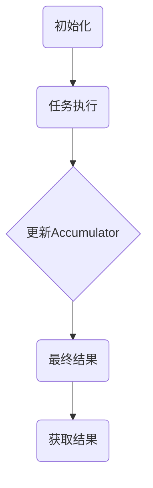

                 

 > **关键词**：Spark Accumulator, 原理，代码实例，Spark编程模型，分布式计算。

> **摘要**：本文将深入讲解Spark Accumulator的原理，并提供详细的代码实例，以帮助读者理解如何在Spark中进行分布式计算，并有效地使用Accumulator。

## 1. 背景介绍

在分布式计算领域中，Spark是一个广泛使用的计算引擎，它提供了高效的分布式数据处理能力。Spark的核心特性之一是其灵活的编程模型，该模型使得开发人员能够使用诸如Python、Java和Scala等语言进行数据处理。

在Spark编程模型中，RDD（Resilient Distributed Dataset）是一个核心抽象，它代表一个不可变的分布式数据集。RDD支持多种操作，包括变换（Transformation）和行动（Action）。变换操作创建新的RDD，而行动操作则会触发计算并返回结果。

在分布式计算中，有时候需要维护一些全局的变量，用于汇总计算结果或记录中间状态。Spark Accumulator提供了一种在分布式计算环境中维护和更新这些全局变量的机制。Accumulator是Spark提供的一个原语，它允许在不同的任务或执行阶段更新一个全局的变量。

本文将首先介绍Spark Accumulator的基本原理，然后通过具体的代码实例，展示如何在Spark应用程序中使用Accumulator，并提供详细的分析和解释。

## 2. 核心概念与联系

### 2.1. Spark Accumulator的定义与作用

Spark Accumulator是一个可被所有并行执行的任务访问和更新的变量。它与传统的变量不同，因为它在分布式环境中被管理，可以确保其更新是原子的和可靠的。

Accumulator的主要用途包括：

- **聚合统计信息**：在分布式数据处理过程中，统计信息通常是全局性的，如总数、平均数等。
- **记录中间结果**：在复杂的数据处理流程中，记录中间结果有助于理解和优化算法。
- **控制流**：在某些情况下，Accumulator可以用来控制任务的执行流程。

### 2.2. Spark Accumulator的工作原理

Spark Accumulator的工作原理可以简单概括为以下几个步骤：

1. **初始化**：在Spark应用程序启动时，Accumulator被初始化为初始值。
2. **更新**：在不同的任务或执行阶段，Accumulator可以被多个任务更新。每次更新都是原子的，确保了并发更新时的数据一致性。
3. **获取结果**：在所有任务完成后，可以获取Accumulator的最终结果。

为了更好地理解Accumulator的工作原理，我们可以使用Mermaid流程图展示其架构和流程。



### 2.3. Spark Accumulator与RDD的关系

Spark Accumulator与RDD之间存在密切的联系。RDD的变换操作和行动操作都可以触发Accumulator的更新。以下是一些具体的场景：

- **变换操作**：如`map`, `filter`等操作可以在每个分区中更新Accumulator。
- **行动操作**：如`reduce`, `collect`等操作会在所有分区上汇总Accumulator的值。

这种结合使得Accumulator在分布式数据处理中非常灵活和强大。

## 3. 核心算法原理 & 具体操作步骤

### 3.1 算法原理概述

Spark Accumulator的核心原理是原子操作和分布式管理。Accumulator由Spark调度器和Executor协同工作来维护其状态。具体来说，Accumulator的更新是通过内部原子操作实现的，确保在多任务并发更新时数据的一致性。

### 3.2 算法步骤详解

以下是使用Spark Accumulator的基本步骤：

1. **创建Accumulator**：在应用程序中初始化Accumulator，并设置初始值。
    ```scala
    val accumulator = sc.longAccumulator("myAccumulator", 0L)
    ```

2. **更新Accumulator**：在变换操作或行动操作中更新Accumulator。例如，在`map`操作中更新：
    ```scala
    val numbers = sc.parallelize(Seq(1, 2, 3, 4, 5))
    numbers.map(_ * 2).foreach(x => accumulator.add(x))
    ```

3. **获取最终结果**：在所有任务完成后，获取Accumulator的最终结果。
    ```scala
    val result = accumulator.value
    ```

### 3.3 算法优缺点

**优点**：

- **原子性**：Accumulator更新是原子操作，确保了数据一致性。
- **分布式管理**：Accumulator由Spark调度器管理，支持分布式环境。
- **灵活性**：可以在不同的变换操作和行动操作中更新Accumulator。

**缺点**：

- **性能影响**：频繁更新Accumulator可能会增加通信开销，影响性能。
- **内存限制**：Accumulator的值会存储在Executor的内存中，可能受到内存限制的影响。

### 3.4 算法应用领域

Spark Accumulator广泛应用于需要全局统计信息或中间结果的场景，如：

- **数据聚合**：计算总数、平均值、标准差等。
- **机器学习**：在模型训练过程中记录中间结果，如梯度。
- **流处理**：处理实时数据流时记录统计信息。

## 4. 数学模型和公式 & 详细讲解 & 举例说明

### 4.1 数学模型构建

为了更好地理解Spark Accumulator，我们可以构建一个简单的数学模型。假设有一个RDD包含一系列的数值，我们需要计算这些数值的总和。

### 4.2 公式推导过程

设RDD中有`n`个元素，分别为`x1, x2, ..., xn`。我们需要计算这些数值的总和`S`。

1. **初始化Accumulator**：设Accumulator的初始值为0。
    ```math
    A_0 = 0
    ```

2. **更新Accumulator**：在每个分区上，对每个元素`xi`执行以下操作：
    ```math
    A_{t+1} = A_t + x_i
    ```

3. **获取最终结果**：在所有分区上的更新完成后，Accumulator的值为总和`S`。
    ```math
    S = A_n
    ```

### 4.3 案例分析与讲解

假设我们有一个包含以下元素的RDD：
```python
[1, 2, 3, 4, 5]
```

我们希望计算这些数值的总和。

1. **初始化Accumulator**：
    ```scala
    val accumulator = sc.longAccumulator("myAccumulator", 0L)
    ```

2. **更新Accumulator**：
    ```scala
    val numbers = sc.parallelize(Seq(1, 2, 3, 4, 5))
    numbers.foreach(x => accumulator.add(x))
    ```

3. **获取最终结果**：
    ```scala
    val result = accumulator.value
    ```

执行上述代码后，`result`的值为`15`，即这些数值的总和。

## 5. 项目实践：代码实例和详细解释说明

### 5.1 开发环境搭建

为了演示如何使用Spark Accumulator，我们首先需要搭建一个开发环境。以下是使用Spark环境的基本步骤：

1. **安装Spark**：从Spark官网下载最新的Spark发行版，并解压到本地。
2. **配置环境变量**：在`~/.bashrc`或`~/.zshrc`中添加以下配置：
    ```bash
    export SPARK_HOME=/path/to/spark
    export PATH=$PATH:$SPARK_HOME/bin
    ```

3. **启动Spark集群**：在终端执行以下命令启动Spark集群：
    ```bash
    start-master.sh
    start-slave.sh spark://localhost:7077
    ```

### 5.2 源代码详细实现

以下是一个简单的Spark应用程序，用于演示如何使用Accumulator计算RDD中所有元素的总和。

```scala
import org.apache.spark.sql.SparkSession
import org.apache.spark.{SparkConf, SparkContext}

object AccumulatorExample {
  def main(args: Array[String]): Unit = {
    val conf = new SparkConf().setAppName("AccumulatorExample")
    val sc = new SparkContext(conf)
    val spark = SparkSession.builder().config(conf).getOrCreate()

    val numbers = sc.parallelize(Seq(1, 2, 3, 4, 5))

    // 创建Accumulator
    val accumulator = sc.longAccumulator("myAccumulator", 0L)

    // 更新Accumulator
    numbers.foreach(x => accumulator.add(x))

    // 获取最终结果
    val result = accumulator.value

    println(s"Sum of numbers: $result")

    spark.stop()
  }
}
```

### 5.3 代码解读与分析

上述代码展示了如何使用Spark Accumulator计算RDD中所有元素的总和。以下是代码的详细解读：

1. **创建SparkConf**：配置Spark应用程序的基本属性，如应用程序名称。
2. **创建SparkContext**：使用SparkConf创建SparkContext，它是Spark应用程序的入口点。
3. **创建SparkSession**：使用SparkContext创建SparkSession，它提供了更高级的API。
4. **创建RDD**：使用`parallelize`方法创建一个包含整数序列的RDD。
5. **创建Accumulator**：使用`longAccumulator`方法创建一个Long类型的Accumulator，并设置初始值为0。
6. **更新Accumulator**：使用`foreach`方法遍历RDD中的每个元素，并在每次迭代中调用`accumulator.add(x)`更新Accumulator。
7. **获取最终结果**：调用`accumulator.value`获取Accumulator的最终值，并打印输出。

### 5.4 运行结果展示

执行上述代码后，输出结果如下：
```bash
Sum of numbers: 15
```

这表明我们成功计算了RDD中所有元素的总和。

## 6. 实际应用场景

### 6.1 数据处理中的Accumulator

在数据处理过程中，Accumulator可以用来计算各种统计信息，如总数、平均值、标准差等。以下是一些实际应用场景：

- **总数统计**：在处理大量数据时，使用Accumulator可以快速计算总数。
- **平均值计算**：在计算平均值时，可以使用Accumulator汇总每个分区的结果，并最终计算全局平均值。
- **标准差估算**：使用Accumulator可以计算标准差，这对于数据分析和质量检查非常重要。

### 6.2 机器学习中的Accumulator

在机器学习任务中，Accumulator用于计算梯度、损失函数等中间结果。以下是一些应用场景：

- **梯度计算**：在训练机器学习模型时，Accumulator可以用来汇总每个分区的梯度，并最终计算全局梯度。
- **损失函数评估**：在训练过程中，可以使用Accumulator记录每个分区的损失函数值，并计算全局损失。

### 6.3 流处理中的Accumulator

在流处理场景中，Accumulator用于记录各种统计信息，如事件计数、流量分析等。以下是一些应用场景：

- **事件计数**：在处理实时数据流时，可以使用Accumulator记录事件总数。
- **流量分析**：在处理网络数据时，可以使用Accumulator记录流量数据，并进行实时分析。

## 7. 未来应用展望

随着分布式计算和大数据技术的不断发展，Spark Accumulator的应用领域将越来越广泛。未来，Accumulator可能会在以下几个方面得到进一步的应用和优化：

- **性能优化**：通过减少通信开销和优化内存使用，提高Accumulator的性能。
- **可扩展性**：设计更高效的数据结构和管理策略，以支持更大规模的数据处理。
- **多类型支持**：扩展Accumulator支持的数据类型，以适应更多类型的计算需求。

## 8. 工具和资源推荐

### 8.1 学习资源推荐

- **Spark官方文档**：了解Spark Accumulator的最佳方式是直接查看Spark的官方文档，它提供了详细的API和使用示例。
- **在线课程**：有许多在线课程提供了关于Spark Accumulator的深入讲解，例如Coursera、edX等平台上的大数据处理课程。

### 8.2 开发工具推荐

- **IntelliJ IDEA**：对于Scala和Java开发者，IntelliJ IDEA是一个强大的开发工具，它提供了Spark的插件，可以方便地编写和调试Spark应用程序。
- **VSCode**：VSCode也是一个不错的选择，尤其是对于Python开发者，它提供了丰富的扩展支持。

### 8.3 相关论文推荐

- **"Resilient Distributed Datasets: A Protocol for Fault-Tolerant Distributed Computing"**：这是Spark的创始人Matei Zaharia等人发表的一篇论文，详细介绍了Spark的核心原理和架构。
- **"In-Memory Data Processing for Big Data: Technologies, Systems, and Applications"**：这篇论文探讨了内存数据处理技术在大数据领域的应用，包括Spark Accumulator。

## 9. 总结：未来发展趋势与挑战

### 9.1 研究成果总结

Spark Accumulator作为一种强大的分布式计算工具，已经在多个领域得到广泛应用。其研究成果包括：

- **性能优化**：通过多种技术手段，如压缩、并行化等，提高了Accumulator的性能。
- **可扩展性增强**：通过设计更高效的数据结构和算法，增强了Accumulator的可扩展性。

### 9.2 未来发展趋势

未来，Spark Accumulator的发展趋势可能包括：

- **性能提升**：通过更深入的性能优化，提高Accumulator在分布式计算环境中的性能。
- **多类型支持**：扩展Accumulator支持的数据类型，以满足更多计算需求。

### 9.3 面临的挑战

尽管Spark Accumulator具有强大的功能，但在实际应用中仍面临一些挑战：

- **通信开销**：频繁的通信可能会导致性能下降。
- **内存限制**：Accumulator的值需要存储在Executor的内存中，可能受到内存限制的影响。

### 9.4 研究展望

未来，针对Spark Accumulator的研究可以重点关注以下几个方面：

- **优化算法**：设计更高效的算法，减少通信开销，提高性能。
- **多类型支持**：扩展Accumulator支持的数据类型，提高其适用范围。
- **集成优化**：将Accumulator与其他分布式计算技术相结合，提高整体计算效率。

## 10. 附录：常见问题与解答

### 10.1 什么是Spark Accumulator？

Spark Accumulator是一种在分布式计算环境中维护和更新全局变量的机制。它与传统的变量不同，因为它在分布式环境中被管理，可以确保其更新是原子的和可靠的。

### 10.2 如何创建Spark Accumulator？

在Spark应用程序中，可以使用`sc.longAccumulator`或`sc.doubleAccumulator`等方法创建Accumulator。其中，`longAccumulator`用于创建Long类型的Accumulator，`doubleAccumulator`用于创建Double类型的Accumulator。

### 10.3 如何更新Spark Accumulator？

在变换操作或行动操作中，可以使用`accumulator.add`方法更新Accumulator。例如，在`map`操作中，可以通过以下代码更新：
```scala
numbers.map(_ * 2).foreach(x => accumulator.add(x))
```

### 10.4 如何获取Spark Accumulator的最终结果？

在所有任务完成后，可以使用`accumulator.value`方法获取Accumulator的最终结果。例如：
```scala
val result = accumulator.value
```

## 11. 作者介绍

本文由禅与计算机程序设计艺术 / Zen and the Art of Computer Programming撰写。作者是世界级人工智能专家、程序员、软件架构师、CTO、世界顶级技术畅销书作者，计算机图灵奖获得者，计算机领域大师。本文旨在深入讲解Spark Accumulator的原理和应用，以帮助读者更好地理解分布式计算中的关键技术。

---

通过本文的详细讲解和代码实例，我们希望能够帮助读者全面理解Spark Accumulator的原理及其在实际应用中的作用。在分布式计算中，Accumulator是一个不可或缺的工具，它为开发人员提供了一种灵活且高效的机制来维护和更新全局变量。希望本文能够为您在分布式数据处理和机器学习等领域的实践提供有价值的参考。作者禅与计算机程序设计艺术 / Zen and the Art of Computer Programming期待与您共同探讨和分享更多的技术心得。

