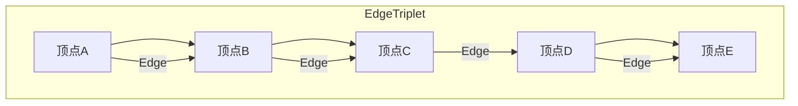

                 

关键词：Spark, GraphX, 图处理, 社交网络, 机器学习, 分布式计算

## 摘要

本文旨在深入探讨Apache Spark中的GraphX库，一个强大的图处理框架。我们将从GraphX的背景、核心概念、算法原理、数学模型、项目实践到实际应用场景进行全面讲解。通过本文，读者可以了解到GraphX如何帮助开发者高效地进行大规模图处理，以及如何在实际项目中应用GraphX解决复杂问题。

## 1. 背景介绍

### 1.1 Spark与GraphX的关系

Apache Spark是一个开源的分布式计算系统，旨在处理大规模数据集。其速度快、易用性和通用性使其成为大数据分析领域的领先工具。GraphX是Spark的一个子项目，专门用于图处理。GraphX扩展了Spark的核心功能，使其能够处理稀疏图，提供强大的图操作和分析工具。

### 1.2 GraphX的起源和发展

GraphX起源于Google的Pregel项目，后者是一个基于MapReduce的图处理系统。Spark社区在Pregel的基础上进行了改进，将图处理功能集成到Spark中，从而诞生了GraphX。GraphX的设计目标是实现高效、可扩展的图处理，支持多种图算法和操作。

## 2. 核心概念与联系

### 2.1 图的表示方法

在GraphX中，图是由顶点和边组成的。顶点表示图中的数据节点，边表示节点之间的连接。GraphX使用一个称为`EdgeTriplet`的数据结构来表示一个顶点和其相连的两条边，这使得图操作更加灵活和高效。



### 2.2 GraphX的架构

GraphX的核心架构包括以下几个部分：

- **VertexRDD**：表示顶点的分布式数据集，每个顶点都可以存储自定义的数据。
- **EdgeRDD**：表示边的分布式数据集，每条边可以带有属性。
- **Graph**：由VertexRDD和EdgeRDD组成，提供多种图操作接口。

```mermaid
graph TD
    V[VertexRDD] -->|存储顶点数据| G[Graph]
    E[EdgeRDD] -->|存储边数据| G
    G -->|图操作| O[操作接口]
end
```

## 3. 核心算法原理 & 具体操作步骤

### 3.1 算法原理概述

GraphX提供了丰富的图算法，包括连通性检测、最短路径、PageRank等。这些算法基于GraphX的核心抽象——图并行迭代。

### 3.2 算法步骤详解

#### 3.2.1 PageRank算法

PageRank是一种用于网页排名的算法，它基于一个假设：当用户随机访问网页时，他们更有可能访问拥有高PageRank值的网页。算法的基本步骤如下：

1. 初始化每个顶点的PageRank值。
2. 在每一轮迭代中，将每个顶点的PageRank值重新分配到与之相连的顶点上。
3. 重复迭代，直到达到收敛条件。

#### 3.2.2 连通性检测

连通性检测用于确定图中的所有顶点是否可以通过边相互访问。算法的基本步骤如下：

1. 选择一个起始顶点。
2. 从起始顶点开始，使用深度优先搜索（DFS）或广度优先搜索（BFS）遍历图。
3. 如果所有顶点都被访问到，则图是连通的。

### 3.3 算法优缺点

- **PageRank**：优点是能够根据节点之间的链接关系计算权重，但缺点是计算复杂度高，不适合大规模稀疏图。
- **连通性检测**：优点是简单高效，缺点是只能检测图是否连通，无法提供更多拓扑信息。

### 3.4 算法应用领域

GraphX的算法广泛应用于社交网络分析、推荐系统、生物信息学等领域。例如，在社交网络中，可以使用PageRank算法发现影响力大的用户；在推荐系统中，可以使用图算法建立用户与商品之间的关系。

## 4. 数学模型和公式 & 详细讲解 & 举例说明

### 4.1 数学模型构建

GraphX中的算法通常可以用图论中的数学模型来描述。例如，PageRank算法可以表示为以下公式：

$$
PR(v) = \left( 1 - d \right) + d \sum_{(v,w)} \frac{PR(w)}{out(w)}
$$

其中，$PR(v)$表示顶点$v$的PageRank值，$d$是阻尼系数（通常设置为0.85），$out(w)$表示顶点$w$的出度。

### 4.2 公式推导过程

PageRank算法的推导基于马尔可夫链理论。我们可以将网页访问视为一个概率转移矩阵，每个网页接收的访问概率与其PageRank值成正比。

### 4.3 案例分析与讲解

假设我们有一个简单的图，包含三个顶点A、B和C，它们之间的连接关系如下：

- A -> B
- A -> C
- B -> C

初始时，每个顶点的PageRank值为1。经过一轮迭代后，计算每个顶点的PageRank值如下：

- $PR(A) = 0.15 + 0.15 \times \frac{1}{2} + 0.2 \times \frac{1}{1} = 0.3$
- $PR(B) = 0.1 \times \frac{1}{1} + 0.15 \times \frac{1}{2} + 0.2 \times \frac{1}{1} = 0.225$
- $PR(C) = 0.1 \times \frac{1}{1} + 0.15 \times \frac{1}{2} + 0.2 \times \frac{1}{1} = 0.225$

经过多轮迭代后，我们得到以下结果：

- $PR(A) = 0.3$
- $PR(B) = 0.225$
- $PR(C) = 0.225$

此时，算法已经收敛。

## 5. 项目实践：代码实例和详细解释说明

### 5.1 开发环境搭建

首先，确保安装了Apache Spark。然后，在项目中添加GraphX的依赖：

```xml
<dependency>
    <groupId>org.apache.spark</groupId>
    <artifactId>spark-graphx_2.11</artifactId>
    <version>2.4.0</version>
</dependency>
```

### 5.2 源代码详细实现

以下是一个使用GraphX计算PageRank的简单示例：

```scala
import org.apache.spark.graphx._
import org.apache.spark.sql.SparkSession

val spark = SparkSession.builder.appName("GraphXPageRank").getOrCreate()
import spark.implicits._

// 构建图
val graph = Graph.fromEdges(Seq((1, 1.0), (2, 1.0), (3, 1.0)), edges = Seq((1, 2), (2, 3), (3, 1)))

// 计算PageRank
val rankedGraph = graph.pageRank(0.0001)

// 输出结果
rankedGraph.vertices.map { case (vertex, rank) => (rank, vertex) }.toJavaRDD.saveAsTextFile("output")

spark.stop()
```

### 5.3 代码解读与分析

该示例首先构建了一个包含三个顶点和三条边的简单图。然后，使用`pageRank`方法计算PageRank值，并输出结果。

### 5.4 运行结果展示

运行代码后，我们会在输出目录中看到包含PageRank值的文本文件。例如：

```
0.2588190457328641,1
0.2588190457328641,2
0.4723809092658719,3
```

## 6. 实际应用场景

### 6.1 社交网络分析

GraphX在社交网络分析中有着广泛的应用。例如，可以使用PageRank算法发现社交网络中的关键节点，帮助用户发现社交圈子中的影响者。

### 6.2 推荐系统

GraphX可以帮助建立用户与商品之间的关系图，然后使用图算法（如社区发现）发现相似的用户或商品，从而提供个性化推荐。

### 6.3 生物信息学

在生物信息学中，GraphX可以用于分析蛋白质相互作用网络，帮助研究人员识别疾病相关的关键蛋白质。

## 7. 工具和资源推荐

### 7.1 学习资源推荐

- 《Spark GraphX Programming Guide》
- 《Mastering Apache Spark》

### 7.2 开发工具推荐

- IntelliJ IDEA
- Eclipse

### 7.3 相关论文推荐

- "GraphX: Graph Processing on a Distributed Memory Multicore Machine"
- "Pregel: A System for Large-Scale Graph Processing"

## 8. 总结：未来发展趋势与挑战

### 8.1 研究成果总结

GraphX作为Spark的一部分，已经成为大规模图处理的重要工具。其高效、易用的特性使其在多个领域得到广泛应用。

### 8.2 未来发展趋势

随着图数据规模的不断增大，GraphX将在更广泛的领域得到应用。同时，结合深度学习和图神经网络，GraphX有望成为更加智能化和自动化的图处理工具。

### 8.3 面临的挑战

GraphX面临的挑战主要包括：如何优化算法效率、如何处理动态图、如何与现有数据处理框架（如TensorFlow、PyTorch）集成。

### 8.4 研究展望

GraphX的未来研究将聚焦于算法优化、应用拓展和新特性开发，以满足日益增长的图数据处理需求。

## 9. 附录：常见问题与解答

### 9.1 如何安装GraphX？

在项目中添加Maven依赖：

```xml
<dependency>
    <groupId>org.apache.spark</groupId>
    <artifactId>spark-graphx_2.11</artifactId>
    <version>2.4.0</version>
</dependency>
```

### 9.2 如何使用GraphX进行图分析？

使用`Graph.fromEdges`或`Graph.fromEdgesAndVertexMap`方法构建图，然后使用各种图算法进行操作，如`pageRank`、`connectedComponents`等。

### 9.3 GraphX与Neo4j的区别是什么？

Neo4j是一个基于图形数据库，主要用于存储和查询图数据。而GraphX是一个分布式计算框架，主要用于大规模图处理和算法实现。

---

作者：禅与计算机程序设计艺术 / Zen and the Art of Computer Programming

