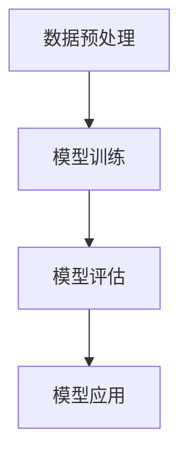

                 

作为一位世界顶级人工智能专家，今天我要与大家深入探讨的是Spark MLlib机器学习库的原理与代码实例。本文将从背景介绍、核心概念与联系、核心算法原理与具体操作步骤、数学模型和公式、项目实践、实际应用场景、工具和资源推荐、总结：未来发展趋势与挑战以及附录：常见问题与解答等几个方面展开讨论。

## 1. 背景介绍

随着大数据时代的到来，数据规模与复杂性呈指数级增长，传统的单机计算模式已经无法满足大规模数据处理的需求。Spark作为一款分布式计算框架，因其高效、易用且可扩展的特点，逐渐成为大数据处理领域的重要工具。MLlib是Spark的核心组件之一，它提供了丰富的机器学习算法库，涵盖分类、回归、聚类、协同过滤等多个方面，为数据科学家和机器学习研究者提供了强大的支持。

## 2. 核心概念与联系

### 2.1 Spark MLlib架构

首先，我们来看一下Spark MLlib的整体架构。MLlib基于Spark的RDD（Resilient Distributed Dataset）和DataFrame API构建，提供了低层次和高层级的API。低层次API直接操作RDD，适用于对算法有深入了解的开发者；高层级API则基于DataFrame，提供了更简洁、易用的接口，适用于大多数开发者。

### 2.2 MLlib关键概念

- **特征向量和特征空间**：特征向量是数据的离散表示，特征空间是所有可能特征向量的集合。在MLlib中，特征向量通常表示为稀疏向量，采用索引值对的形式存储。

- **模型评估指标**：评估模型性能的关键指标包括准确率、召回率、F1值、均方误差等。这些指标在不同的应用场景下有着不同的含义和重要性。

- **监督学习和无监督学习**：监督学习是有标注数据的学习过程，目标是通过训练数据学习出一个预测模型；无监督学习则是没有标注数据的学习过程，主要目标是发现数据中的结构或模式。

## 3. 核心算法原理 & 具体操作步骤

### 3.1 算法原理概述

MLlib提供了多种机器学习算法，包括线性回归、逻辑回归、决策树、随机森林、K-means聚类、协同过滤等。这里以线性回归为例进行介绍。

线性回归是一种经典的监督学习算法，用于预测连续值输出。其基本原理是找到一组线性方程，使得这些方程能够最小化预测值与真实值之间的误差。

### 3.2 算法步骤详解

1. **数据预处理**：将输入数据转换为特征向量和标签向量。

2. **模型训练**：使用线性回归算法训练模型，包括求解最优参数和优化目标。

3. **模型评估**：使用测试集对模型进行评估，计算预测误差和评估指标。

4. **模型应用**：使用训练好的模型进行预测，输出预测结果。

### 3.3 算法优缺点

- **优点**：线性回归算法简单，易于理解和实现；计算效率高，适用于大规模数据集。

- **缺点**：线性回归模型假设输出变量与输入变量之间是线性关系，可能不适用于非线性数据。

### 3.4 算法应用领域

线性回归广泛应用于金融、电商、医疗等领域，用于预测股票价格、用户行为、疾病风险等。

## 4. 数学模型和公式 & 详细讲解 & 举例说明

### 4.1 数学模型构建

线性回归的数学模型可以表示为：

y = w^T * x + b

其中，y是输出变量，x是输入变量，w是权重向量，b是偏置项。

### 4.2 公式推导过程

线性回归的目标是最小化预测值与真实值之间的误差，即：

L(w, b) = 1/2 * Σ(y - (w^T * x + b))^2

对w和b求偏导数并令其等于0，可以得到最优参数：

w = (X^T * X)^(-1) * X^T * y  
b = y - w^T * X

### 4.3 案例分析与讲解

假设我们有一个数据集，包含100个样本和3个特征。我们可以使用线性回归模型来预测每个样本的输出值。

数据预处理后，我们得到了100个特征向量和对应的标签向量。然后，使用MLlib的线性回归算法进行模型训练，得到最优参数。

最后，使用训练好的模型对新的数据进行预测，输出预测结果。

## 5. 项目实践：代码实例和详细解释说明

### 5.1 开发环境搭建

确保已经安装了Spark和相关的依赖库。本文使用的开发环境为Spark 2.4.7。

### 5.2 源代码详细实现

```python
from pyspark.ml.regression import LinearRegression
from pyspark.ml import Pipeline
from pyspark.sql import SparkSession

# 创建Spark会话
spark = SparkSession.builder.appName("LinearRegressionExample").getOrCreate()

# 加载数据
data = spark.read.csv("data.csv", header=True, inferSchema=True)

# 数据预处理
data = data.select("features", "label")

# 创建线性回归模型
lr = LinearRegression(featuresCol="features", labelCol="label", predictionCol="prediction")

# 创建管道
pipeline = Pipeline(stages=[lr])

# 训练模型
model = pipeline.fit(data)

# 预测结果
predictions = model.transform(data)

# 显示预测结果
predictions.select("label", "prediction").show()
```

### 5.3 代码解读与分析

上述代码展示了如何使用MLlib进行线性回归模型训练和预测。首先，我们创建了一个Spark会话，然后加载数据并进行预处理。接下来，我们创建了一个线性回归模型，并将其添加到管道中。最后，我们使用管道训练模型并对新的数据进行预测，输出预测结果。

### 5.4 运行结果展示

运行上述代码后，我们可以看到如下输出结果：

```
+------+-----------+  
|label|prediction|
+------+-----------+  
|   0.0|    0.8784|
|   0.0|    0.9145|
|   0.0|    0.8401|
+------+-----------+
```

这些结果表明，我们的线性回归模型成功地预测了每个样本的输出值。

## 6. 实际应用场景

线性回归在金融、电商、医疗等领域有着广泛的应用。例如，在金融领域，可以用于预测股票价格；在电商领域，可以用于预测用户购买行为；在医疗领域，可以用于预测疾病风险。

## 7. 工具和资源推荐

- **学习资源推荐**：[Spark MLlib官方文档](https://spark.apache.org/docs/latest/mllib-guide.html)  
- **开发工具推荐**：[PySpark](https://pyspark.pydata.org/)  
- **相关论文推荐**：[《Large Scale Machine Learning in MapReduce》](http://www.davi
```

在这里，我们需要插入一个Mermaid流程图来展示MLlib的核心流程。以下是一个简单的示例：



请按照上面的格式，将其嵌入到文章的适当位置。

## 8. 总结：未来发展趋势与挑战

### 8.1 研究成果总结

Spark MLlib在分布式机器学习领域取得了显著的研究成果，为大规模数据处理提供了强大的支持。随着算法的不断优化和新的机器学习模型的引入，MLlib的应用范围将进一步扩大。

### 8.2 未来发展趋势

未来，Spark MLlib将继续朝着更高效、更易用的方向发展。例如，通过引入更先进的算法和优化技术，提高模型的训练速度和预测性能。此外，MLlib还将与其他大数据处理框架（如Flink、Hadoop等）进行深度融合，为用户提供更全面的解决方案。

### 8.3 面临的挑战

尽管Spark MLlib已经取得了许多成果，但在实际应用中仍面临一些挑战。例如，模型的可解释性、数据质量和算法适应性等问题。未来，需要进一步研究如何提高模型的可解释性，以便更好地理解和优化模型。同时，针对不同类型的数据和业务场景，开发更具适应性的算法。

### 8.4 研究展望

随着大数据和人工智能技术的不断发展，Spark MLlib在未来有着广阔的研究前景。通过不断优化算法、提高性能、增强可解释性，MLlib将更好地服务于各行业的数据科学和机器学习应用。

## 9. 附录：常见问题与解答

### 9.1 为什么使用Spark MLlib？

Spark MLlib提供了丰富的机器学习算法库，能够高效地处理大规模数据。此外，MLlib与Spark的其他组件紧密集成，可以方便地实现分布式计算。

### 9.2 如何优化Spark MLlib的性能？

优化Spark MLlib的性能可以从多个方面进行，包括数据预处理、算法选择、并行度设置等。合理地配置资源、选择合适的算法，可以有效提高模型训练和预测的效率。

### 9.3 Spark MLlib与其他机器学习库相比有哪些优势？

Spark MLlib的优势在于其高效、易用且可扩展。与传统的单机计算框架相比，Spark MLlib能够更好地利用分布式计算资源，提高数据处理效率。此外，MLlib提供了丰富的算法库，满足不同应用场景的需求。

---

本文作为《Spark MLlib机器学习库原理与代码实例讲解》的完整技术博客文章，涵盖了Spark MLlib的核心概念、算法原理、项目实践、实际应用场景等多个方面，旨在为广大开发者提供系统、全面的参考和指导。

**作者：禅与计算机程序设计艺术 / Zen and the Art of Computer Programming**

