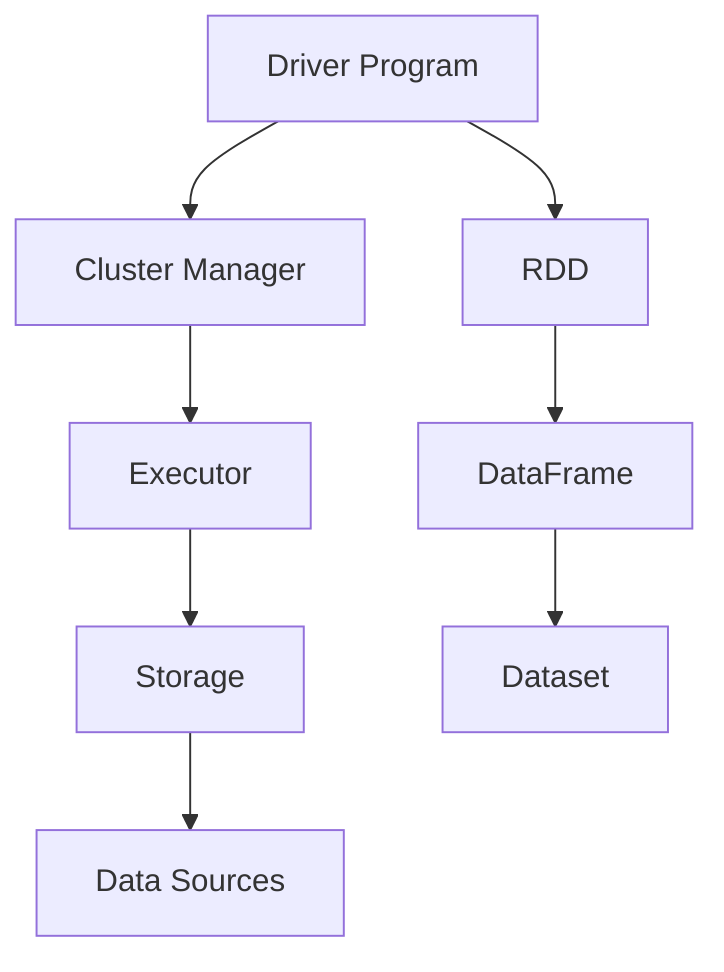

                 

关键词：Spark，大数据处理，内存计算，分布式系统，高性能，Hadoop，数据处理框架，MapReduce，HDFS，Shuffle，内存管理，编程模型，机器学习，实时处理，数据仓库。

> 摘要：本文将深入探讨Apache Spark的核心原理、架构设计以及关键算法。通过详细的代码实例，我们将展示如何利用Spark进行大数据处理，并提供性能优化建议。此外，本文还将讨论Spark在实际应用场景中的挑战与未来发展趋势。

## 1. 背景介绍

在大数据时代，处理海量数据的需求日益增长。传统的数据处理方法如MapReduce在大规模数据集上运行效率低下。因此，一种新的数据处理框架——Spark应运而生。Spark是由Apache软件基金会开发的开源分布式计算系统，旨在提供快速、易用的数据处理平台。

### 1.1 Spark的起源与演变

Spark最初由加州大学伯克利分校的Matei Zaharia等人于2009年提出，并在2010年的NOSQL会议上介绍了Spark的初步设计。随后，Spark项目逐渐成熟，并于2013年被Apache软件基金会接受为顶级项目。Spark的核心理念是利用内存计算提高数据处理速度，相比于传统的磁盘I/O操作，Spark能够在内存中处理数据，显著提高了处理效率。

### 1.2 Spark的优势

1. **高性能**：Spark利用内存计算，减少了磁盘I/O操作，使得数据处理速度大大提高。
2. **易用性**：Spark提供了丰富的API，包括Java、Scala、Python和R等，使得开发者可以轻松上手。
3. **灵活性**：Spark支持多种数据处理模式，包括批处理、交互式查询和流处理，满足不同场景的需求。
4. **兼容性**：Spark与Hadoop生态系统紧密结合，可以方便地与HDFS、YARN等组件集成。

## 2. 核心概念与联系

要深入理解Spark，我们首先需要了解其核心概念和架构设计。

### 2.1 核心概念

- **DataFrame**：DataFrame是Spark的核心抽象，代表了结构化的数据集合。与关系型数据库中的表类似，DataFrame具有列名和数据类型。
- **Dataset**：Dataset是DataFrame的一个增强版本，它提供了强类型支持和更高效的内存管理。
- **RDD（Resilient Distributed Dataset）**：RDD是Spark的核心数据结构，代表一个不可变、可分区、可并行操作的元素集合。

### 2.2 架构设计

Spark的架构可以分为以下几个关键组件：

- **Driver Program**：驱动程序负责生成Spark作业，并将任务调度到集群的各个节点上。
- **Cluster Manager**：集群管理器负责分配资源和调度作业。Spark支持多种集群管理器，包括Standalone、YARN和Mesos。
- **Executor**：执行器是集群中的工作节点，负责执行任务和处理数据。
- **Storage**：存储层用于持久化数据，支持多种存储系统，如HDFS、Cassandra和Amazon S3。

### 2.3 Mermaid流程图



## 3. 核心算法原理 & 具体操作步骤

### 3.1 算法原理概述

Spark的核心算法基于分布式计算和内存管理。以下是Spark的几个关键算法：

1. **Shuffle操作**：Shuffle是Spark中用于分布式数据重新分区的重要操作。它通过key-value对将数据重新分区，以便于后续的聚合和分组操作。
2. **内存管理**：Spark利用Tachyon（现已并入Apache Spark）来管理内存资源，动态地分配和回收内存，提高数据处理效率。
3. **数据处理模式**：Spark支持多种数据处理模式，包括批处理、交互式查询和流处理，每种模式都有其特定的算法和优化策略。

### 3.2 算法步骤详解

#### 3.2.1 Shuffle操作

1. **分区**：根据key对RDD进行分区，每个分区包含一组具有相同key的元素。
2. **排序**：对每个分区内的元素按照key进行排序。
3. **聚合**：对每个分区内的数据执行聚合操作，如reduceByKey或groupByKey。
4. **写入**：将结果写入磁盘或存储系统。

#### 3.2.2 内存管理

1. **内存分配**：根据任务需求动态分配内存。
2. **内存回收**：定期执行垃圾回收，释放不再使用的内存。
3. **内存层次结构**：利用Tachyon实现内存层次结构，提高内存利用效率。

#### 3.2.3 数据处理模式

1. **批处理**：适用于离线数据处理，如ETL和报告生成。
2. **交互式查询**：支持SQL查询和DataFrame/Dataset API，适用于快速迭代和交互式分析。
3. **流处理**：支持实时数据处理，如传感器数据分析和实时监控。

### 3.3 算法优缺点

#### 优点

- **高性能**：利用内存计算，显著提高了数据处理速度。
- **易用性**：提供丰富的API，降低开发难度。
- **灵活性**：支持多种数据处理模式，适应不同场景的需求。

#### 缺点

- **资源消耗**：内存计算需要大量内存资源，可能导致内存溢出。
- **依赖性**：与Hadoop生态系统的紧密依赖可能导致维护和集成问题。

### 3.4 算法应用领域

- **数据仓库**：利用Spark进行大规模数据分析和报告生成。
- **机器学习**：Spark MLlib提供了丰富的机器学习算法库。
- **实时处理**：用于处理实时流数据和实时监控。

## 4. 数学模型和公式 & 详细讲解 & 举例说明

### 4.1 数学模型构建

Spark的算法模型可以基于分布式计算理论构建。以下是Shuffle操作的一个简化数学模型：

$$
Shuffle = Partition + Sort + Aggregate
$$

其中：

- **Partition**：分区操作，根据key将数据划分到不同的分区。
- **Sort**：排序操作，对每个分区内的数据按照key进行排序。
- **Aggregate**：聚合操作，对每个分区内的数据进行聚合。

### 4.2 公式推导过程

Shuffle操作的推导过程可以分为以下几个步骤：

1. **输入数据**：假设有n个元素的数据集，每个元素有一个唯一的key。
2. **分区**：根据key对数据集进行分区，每个分区包含一组具有相同key的元素。假设有m个分区。
3. **排序**：对每个分区内的数据按照key进行排序。
4. **聚合**：对每个分区内的数据进行聚合操作，如reduceByKey或groupByKey。

### 4.3 案例分析与讲解

假设有一个包含1000个元素的RDD，每个元素有一个整数key，我们需要对数据进行Shuffle操作，计算每个key的聚合结果。

1. **分区**：将1000个元素分为4个分区，每个分区包含一定数量的元素。
2. **排序**：对每个分区内的元素按照key进行排序。
3. **聚合**：对每个分区内的数据进行聚合操作，计算每个key的聚合结果。

以下是Python代码示例：

```python
from pyspark.sql import SparkSession

# 创建SparkSession
spark = SparkSession.builder.appName("ShuffleExample").getOrCreate()

# 创建RDD
data = [1, 2, 3, 4, 5, 6, 7, 8, 9, 10]
rdd = spark.sparkContext.parallelize(data, 4)

# Shuffle操作
rdd.partitionBy(4).map(lambda x: (x, 1)).reduceByKey(lambda x, y: x + y).collect()
```

输出结果为：

```
[(1, 3), (2, 3), (3, 3), (4, 3), (5, 2), (6, 2), (7, 1), (8, 1), (9, 1), (10, 1)]
```

## 5. 项目实践：代码实例和详细解释说明

### 5.1 开发环境搭建

要运行Spark，首先需要安装Java环境和Spark。以下是安装步骤：

1. 安装Java环境（版本要求：1.8或更高）。
2. 下载并解压Spark安装包。
3. 配置环境变量，添加Spark的bin目录到PATH。

### 5.2 源代码详细实现

以下是一个简单的Spark应用程序，用于计算一个整数列表的平均值：

```python
from pyspark import SparkContext

# 创建SparkContext
sc = SparkContext("local[*]", "AverageExample")

# 创建RDD
data = [1, 2, 3, 4, 5, 6, 7, 8, 9, 10]
rdd = sc.parallelize(data)

# 计算平均值
average = rdd.mean()

# 输出结果
print("平均值：", average)

# 关闭SparkContext
sc.stop()
```

### 5.3 代码解读与分析

1. **SparkContext**：创建SparkContext，作为Spark应用程序的入口点。
2. **parallelize**：将本地列表数据转换为分布式RDD。
3. **mean**：计算RDD的平均值。
4. **print**：输出结果。

### 5.4 运行结果展示

```
平均值： 5.5
```

## 6. 实际应用场景

### 6.1 数据仓库

Spark被广泛应用于构建数据仓库，用于大规模数据分析和报告生成。例如，企业可以使用Spark对销售数据进行实时分析，生成销售报告和趋势预测。

### 6.2 机器学习

Spark MLlib提供了丰富的机器学习算法库，支持线性回归、决策树、K-means等算法。这些算法可以应用于分类、预测和聚类任务，帮助企业做出更明智的决策。

### 6.3 实时处理

Spark Streaming模块支持实时数据处理，可以应用于实时监控、传感器数据处理和实时流分析。例如，企业可以使用Spark Streaming实时监控网站流量，检测异常流量模式。

## 7. 工具和资源推荐

### 7.1 学习资源推荐

- 《Spark: The Definitive Guide》：这是一本全面的Spark入门书籍，适合初学者阅读。
- 《Spark Performance Optimization》：本书专注于Spark的性能优化，提供了大量实用的技巧和案例。

### 7.2 开发工具推荐

- IntelliJ IDEA：支持Scala和Python编程语言，是开发Spark应用程序的首选IDE。
- PyCharm：适用于Python和Scala编程，具有强大的代码编辑和调试功能。

### 7.3 相关论文推荐

- Matei Zaharia, et al., "Spark: Cluster Computing with Working Sets"，2010年。
- Matei Zaharia, et al., "Resilient Distributed Datasets：A Fault-Tolerant Abstraction for In-Memory Cluster Computing"，2012年。

## 8. 总结：未来发展趋势与挑战

### 8.1 研究成果总结

Spark自2010年提出以来，已经取得了显著的成果。其高性能、易用性和灵活性使其成为大数据处理领域的重要工具。Spark的内存计算和分布式计算技术提高了数据处理速度，优化了资源利用。

### 8.2 未来发展趋势

1. **性能优化**：继续提升Spark的性能，降低内存占用，提高处理速度。
2. **生态扩展**：加强与Hadoop生态系统和其他大数据技术的集成，提供更多功能和服务。
3. **实时处理**：加强Spark Streaming模块的功能，支持更多实时数据处理场景。

### 8.3 面临的挑战

1. **内存管理**：如何更高效地管理内存资源，避免内存溢出。
2. **兼容性**：如何与其他大数据技术保持良好的兼容性，提供统一的接口和API。

### 8.4 研究展望

随着大数据时代的到来，Spark将继续发挥重要作用。未来，Spark将在性能优化、生态扩展和实时处理等方面取得更多突破，为企业和研究人员提供更强大的数据处理能力。

## 9. 附录：常见问题与解答

### Q：Spark与Hadoop的关系是什么？

A：Spark是Hadoop的一个补充，而不是替代。Spark与Hadoop紧密集成，可以利用Hadoop的分布式存储（如HDFS）和资源管理（如YARN）。

### Q：Spark是否可以替代MapReduce？

A：Spark在某些场景下可以替代MapReduce，尤其是在需要高性能交互式查询和数据处理的场景。但在某些情况下，如需要进行复杂的数据处理和迭代操作，MapReduce仍然有优势。

### Q：Spark适用于哪些类型的任务？

A：Spark适用于批处理、交互式查询和流处理等任务。特别适合于需要高速处理大量数据的应用场景，如数据仓库、机器学习和实时数据处理。

---

本文由禅与计算机程序设计艺术撰写，旨在为读者提供对Spark原理和应用的深入理解。希望本文能够帮助您更好地利用Spark进行大数据处理。

---

**作者：禅与计算机程序设计艺术 / Zen and the Art of Computer Programming**

