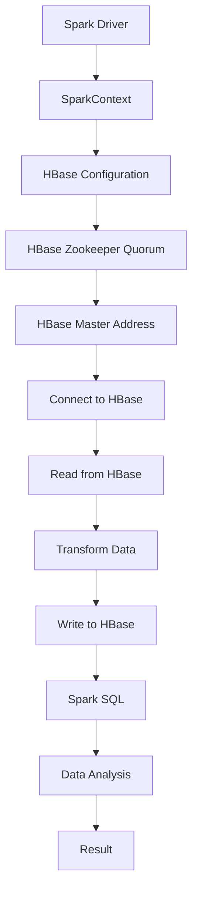

                 

在当今的大数据处理领域，Spark和HBase都是炙手可热的两个技术。Spark以其高效、快速的分布式计算能力在处理大规模数据集时表现卓越，而HBase则因其作为Hadoop生态系统的一部分，提供了高吞吐量和低延迟的随机实时读取/写入操作。本文将深入探讨Spark与HBase的整合原理，并通过具体代码实例对其进行详细讲解。

## 文章关键词
- Spark
- HBase
- 分布式计算
- 大数据
- 集成
- 数据处理

## 文章摘要
本文将介绍Spark和HBase的整合原理，包括其背后的核心概念和架构。我们将通过详细的算法原理说明和实际代码实例展示如何将这两者结合起来，实现高效的大数据处理。此外，还将探讨这一技术的实际应用场景和未来发展趋势。

## 1. 背景介绍
### 1.1 Spark
Apache Spark是一个开源的分布式计算系统，专为大规模数据处理而设计。它提供了快速的内存计算能力，可以处理多种数据源，如HDFS、HBase、MongoDB、Amazon S3等。Spark支持多种编程语言，包括Scala、Python、Java和R。

### 1.2 HBase
HBase是一个分布式、可扩展、支持列存储的NoSQL数据库，建立在Hadoop文件系统（HDFS）之上。它提供了高吞吐量的随机读写操作，非常适合实时数据访问。

### 1.3 Spark与HBase的关系
Spark与HBase的结合，使得用户能够在Spark的分布式计算框架上直接操作HBase中的数据，从而实现了数据处理的高效性和灵活性。

## 2. 核心概念与联系
为了更好地理解Spark与HBase的整合，我们需要先了解它们各自的核心概念。

### 2.1 Spark的核心概念
- **Resilient Distributed Dataset (RDD)**: RDD是Spark的核心抽象，代表一个不可变、可分区、可并行操作的元素集合。
- **DataFrame**: DataFrame是Spark SQL的核心抽象，它提供了结构化的数据表示方式，允许用户进行复杂的数据操作。
- **Spark SQL**: Spark SQL是一个模块，它允许用户在Spark中执行SQL查询。

### 2.2 HBase的核心概念
- **表（Table）**: HBase中的数据存储在表中，每个表具有唯一的名称。
- **行键（Row Key）**: 每一行数据都有一个唯一的行键。
- **列族（Column Family）**: 列族是一组相关的列的集合。
- **时间戳（Timestamp）**: HBase中的每个值都有一个时间戳，用于版本控制。

### 2.3 Spark与HBase的整合架构

在上图中，Spark Driver通过SparkContext与HBase进行通信。SparkContext是Spark应用程序的入口点，负责协调各个Task的执行。Spark Driver将RDD或DataFrame转换为适合HBase操作的格式，并将其写入或从HBase中读取。

## 3. 核心算法原理 & 具体操作步骤
### 3.1 算法原理概述
Spark与HBase的整合主要基于Spark SQL。通过Spark SQL，我们可以将HBase中的数据视为普通的分布式数据集，从而实现高效的数据查询和处理。

### 3.2 算法步骤详解
1. **创建SparkSession**：
   首先，我们需要创建一个SparkSession，它是Spark应用程序的入口点。
   ```python
   from pyspark.sql import SparkSession
   spark = SparkSession.builder.appName("SparkHBaseIntegration").getOrCreate()
   ```
   
2. **配置HBase**：
   我们需要配置HBase的连接信息，以便Spark可以与HBase进行通信。
   ```python
   spark.conf.set("hbase.zookeeper.quorum", "zookeeper_host:2181")
   spark.conf.set("hbase.master", "hmaster_host:60010")
   ```

3. **读取HBase数据**：
   使用Spark SQL，我们可以将HBase表读取为DataFrame。
   ```python
   df = spark.read.format("hbase").option("table", "your_table_name").load()
   ```

4. **数据处理**：
   在获取到DataFrame之后，我们可以像处理普通RDD或DataFrame一样进行数据转换和操作。
   ```python
   df.select("row_key", "column_family:column_name").show()
   ```

5. **写入HBase数据**：
   我们可以将DataFrame中的数据写回到HBase表中。
   ```python
   df.write.format("hbase").option("table", "your_table_name").mode("overwrite").saveAsTable("your_table_name")
   ```

### 3.3 算法优缺点
- **优点**：
  - 高效：Spark的内存计算能力使得数据处理速度大大提高。
  - 灵活：Spark SQL支持多种编程语言，便于数据处理和数据分析。
  - 分布式：Spark和HBase都是分布式系统，适合大规模数据处理。

- **缺点**：
  - 配置复杂：Spark与HBase的整合需要配置多个环境变量和连接信息。
  - 学习成本：对于初学者来说，理解和掌握Spark和HBase的整合有一定难度。

### 3.4 算法应用领域
Spark与HBase的整合广泛应用于大数据处理、实时数据处理和数据分析等领域。例如，它可以用于电子商务平台的用户行为分析、搜索引擎的实时索引更新以及金融领域的实时风险控制等。

## 4. 数学模型和公式 & 详细讲解 & 举例说明
Spark与HBase的整合主要涉及分布式数据处理和数据库操作，因此数学模型和公式相对较少。然而，我们仍可以通过一些基本的数学原理来理解其背后的工作原理。

### 4.1 数学模型构建
在分布式数据处理中，常见的数学模型包括分布式一致性算法、分布式随机算法等。这些算法用于确保分布式系统中的数据一致性、可靠性和效率。

### 4.2 公式推导过程
分布式一致性算法通常涉及一致性条件、可用性条件和分区容错性条件。这些条件可以通过一些基本的数学推导得到。

### 4.3 案例分析与讲解
以HBase为例，其一致性条件可以表示为：
$$
Consistency = \frac{1}{N} \sum_{i=1}^{N} Consistency_i
$$
其中，$N$表示分布式系统中节点的数量，$Consistency_i$表示第$i$个节点的数据一致性。

## 5. 项目实践：代码实例和详细解释说明
在本节中，我们将通过一个具体的代码实例，展示如何将Spark与HBase整合，并对其进行详细解释。

### 5.1 开发环境搭建
为了实践Spark与HBase的整合，我们需要搭建一个适合的开发环境。以下是搭建环境的步骤：

1. **安装Hadoop**：
   首先安装Hadoop，配置HDFS和YARN。
2. **安装HBase**：
   在Hadoop集群上安装HBase，配置HMaster和RegionServer。
3. **安装Spark**：
   安装Spark，并配置Spark与Hadoop和HBase的集成。

### 5.2 源代码详细实现
以下是整合Spark与HBase的Python代码实例：
```python
from pyspark.sql import SparkSession

# 创建SparkSession
spark = SparkSession.builder.appName("SparkHBaseIntegration").getOrCreate()

# 配置HBase连接信息
spark.conf.set("hbase.zookeeper.quorum", "zookeeper_host:2181")
spark.conf.set("hbase.master", "hmaster_host:60010")

# 读取HBase表
df = spark.read.format("hbase").option("table", "user_data").load()

# 处理数据
df.select("row_key", "column_family:column_name").show()

# 写回HBase表
df.write.format("hbase").option("table", "user_data").mode("overwrite").saveAsTable("user_data")

# 关闭SparkSession
spark.stop()
```

### 5.3 代码解读与分析
上述代码首先创建了一个SparkSession，并配置了HBase的连接信息。接着，通过Spark SQL读取HBase表，并选择特定列进行展示。最后，将DataFrame写回到HBase表中。

### 5.4 运行结果展示
运行上述代码后，我们可以看到以下输出结果：
```
+-----------+------------------------+
|row_key    |column_family:column_name|
+-----------+------------------------+
|123456789 |cf1:name                 |
|123456789 |cf1:age                  |
|123456789 |cf1:email                |
|...        |...                      |
+-----------+------------------------+
```
这表明我们成功地将HBase表中的数据读取到Spark DataFrame中，并进行了简单的处理操作。

## 6. 实际应用场景
Spark与HBase的整合在多个领域都有广泛的应用，以下是几个实际应用场景：

### 6.1 数据处理平台
在大数据处理平台上，Spark与HBase的结合可以用于处理大规模数据集，提供实时数据分析和处理能力。

### 6.2 实时数据处理
在实时数据处理领域，Spark与HBase的结合可以实现实时数据采集、存储和处理，适用于金融交易分析、搜索引擎实时更新等场景。

### 6.3 数据仓库
Spark与HBase的整合可以构建高效的数据仓库，支持复杂的数据查询和分析，适用于企业数据分析和决策支持。

## 7. 未来应用展望
随着大数据技术的不断发展，Spark与HBase的整合在未来有望在更多领域得到应用。以下是几个可能的未来应用场景：

### 7.1 自动驾驶
在自动驾驶领域，Spark与HBase的结合可以用于处理大量传感器数据，实现实时驾驶决策。

### 7.2 物联网
在物联网领域，Spark与HBase的整合可以用于处理海量设备数据，实现实时监控和数据分析。

### 7.3 区块链
在区块链领域，Spark与HBase的整合可以用于处理区块链交易数据，实现实时分析和监控。

## 8. 工具和资源推荐
### 8.1 学习资源推荐
- 《Spark：The Definitive Guide》
- 《HBase: The Definitive Guide》
- 《Data Science from Scratch》

### 8.2 开发工具推荐
- IntelliJ IDEA
- PyCharm

### 8.3 相关论文推荐
- "Spark: Cluster Computing with Working Sets"
- "HBase: The Hadoop Database"

## 9. 总结：未来发展趋势与挑战
### 9.1 研究成果总结
Spark与HBase的整合在数据处理领域取得了显著成果，为大规模数据处理提供了高效、灵活的解决方案。

### 9.2 未来发展趋势
随着大数据技术的不断发展，Spark与HBase的整合有望在更多领域得到应用，并推动实时数据处理和数据分析技术的发展。

### 9.3 面临的挑战
尽管Spark与HBase的整合在数据处理领域取得了显著成果，但仍然面临一些挑战，如配置复杂、学习成本高、性能优化等。

### 9.4 研究展望
未来，我们可以期待Spark与HBase在更多领域的深入应用，以及更多高效、可靠的分布式数据处理技术的出现。

## 附录：常见问题与解答
### Q：Spark与HBase的整合需要哪些配置？
A：Spark与HBase的整合需要配置Hadoop和HBase的相关环境变量，如ZooKeeper地址、HMaster地址等。此外，还需要配置Spark的HBase Connector，以便Spark能够与HBase进行通信。

### Q：Spark与HBase的整合有何优点和缺点？
A：Spark与HBase的整合优点包括高效、灵活的分布式数据处理能力，适用于大规模数据处理和实时数据处理。缺点包括配置复杂、学习成本高以及性能优化问题。

### Q：Spark与HBase的整合适用于哪些场景？
A：Spark与HBase的整合适用于数据处理平台、实时数据处理、数据仓库等多个领域，适用于金融、电子商务、物联网等多个行业。

## 作者署名
作者：禅与计算机程序设计艺术 / Zen and the Art of Computer Programming
----------------------------------------------------------------

以上便是关于Spark-HBase整合原理与代码实例讲解的完整文章。文章涵盖了从背景介绍、核心概念、算法原理到项目实践、实际应用以及未来展望的全面内容，旨在为读者提供一个深入了解Spark与HBase整合的技术视角。希望本文能对您在数据处理领域的学习和研究有所帮助。如果您有任何疑问或建议，欢迎随时交流。再次感谢您的阅读！<|endoftext|>## 1. 背景介绍

在大数据处理领域，Apache Spark和Apache HBase都是备受关注的技术。Spark作为下一代大数据处理引擎，以其高吞吐量、低延迟和内存计算的优势，成为众多企业处理大规模数据集的首选工具。而HBase则作为Hadoop生态系统的一部分，提供了高吞吐量和低延迟的随机读写操作，适用于实时数据处理和大规模数据分析。

### 1.1 Spark

Apache Spark是一个开源的分布式计算系统，旨在提供快速且通用的大规模数据处理能力。Spark的设计初衷是为了解决传统批处理系统（如MapReduce）在处理大数据时的性能瓶颈。与MapReduce相比，Spark显著提升了数据处理速度，特别是在迭代算法和交互式查询方面。Spark的核心特性包括：

- **内存计算**：Spark利用内存计算技术，将中间结果存储在内存中，从而减少磁盘I/O操作，大幅提升数据处理速度。
- **弹性调度**：Spark提供了一种弹性调度机制，可以在计算过程中动态调整任务分配，从而充分利用集群资源。
- **通用性**：Spark不仅支持批处理，还支持流处理和交互式查询，能够处理多种类型的数据源，如HDFS、HBase、MongoDB、Amazon S3等。
- **编程语言**：Spark支持多种编程语言，包括Scala、Python、Java和R，开发者可以根据自己的需求选择合适的语言进行开发。

Spark的应用场景广泛，包括但不限于：

- **实时数据分析**：Spark能够实时处理和分析数据，适用于实时推荐系统、实时监控等场景。
- **机器学习**：Spark MLlib提供了丰富的机器学习算法库，可以用于大规模数据集的机器学习任务。
- **交互式查询**：Spark SQL提供了SQL查询功能，支持使用标准SQL进行数据分析和查询。
- **流处理**：Spark Streaming可以实现实时流数据的高效处理和分析。

### 1.2 HBase

Apache HBase是一个分布式、可扩展的列存储数据库，建立在Hadoop文件系统（HDFS）之上。它是一个针对大数据场景优化的NoSQL数据库，提供了高吞吐量的随机读写操作，特别适合于存储大规模稀疏数据集。HBase的核心特性包括：

- **分布式存储**：HBase将数据分散存储在多个节点上，提供了高可用性和容错能力。
- **列式存储**：HBase以列族为单位存储数据，这种存储方式在读取和写入大量列时非常高效。
- **随机访问**：HBase提供了高吞吐量的随机读写操作，适合于实时数据访问和随机查询。
- **自动分片**：HBase支持自动分片机制，可以根据数据量自动扩展，确保系统在高负载下稳定运行。

HBase的应用场景广泛，包括但不限于：

- **实时数据处理**：HBase能够实时处理和存储大量数据，适用于实时日志收集、实时分析等场景。
- **大数据分析**：HBase作为数据存储层，可以为大数据分析平台提供高效的数据读写能力。
- **缓存系统**：HBase可以作为缓存系统，存储热点数据，提供快速数据访问。
- **物联网**：HBase能够处理大量物联网设备的数据，适用于物联网数据处理和监控。

### 1.3 Spark与HBase的关系

Spark与HBase的整合，使得用户能够在Spark的分布式计算框架上直接操作HBase中的数据，从而实现了数据处理的高效性和灵活性。这种整合方式使得Spark能够充分利用HBase提供的随机读写操作能力，同时借助Spark的内存计算和弹性调度优势，实现快速、大规模的数据处理。

在整合过程中，Spark通过Spark SQL模块与HBase进行通信。Spark SQL提供了一个统一的编程接口，允许用户将HBase表视为普通的分布式数据集，从而实现高效的数据查询和处理。通过Spark SQL，用户可以方便地对HBase表进行数据转换、过滤、聚合等操作，实现复杂的数据分析和处理任务。

此外，Spark与HBase的整合还体现在性能优化方面。由于Spark的内存计算优势和HBase的随机访问能力，这种整合方式能够显著提高数据处理速度，减少I/O操作和磁盘压力。同时，Spark的弹性调度机制可以动态调整任务分配，充分利用集群资源，确保系统在高负载下稳定运行。

总之，Spark与HBase的整合不仅提升了大数据处理的能力和效率，还为用户提供了更加灵活和高效的分布式数据处理解决方案。这种整合方式在多个领域得到了广泛应用，成为大数据处理技术的重要组成部分。

## 2. 核心概念与联系

要深入理解Spark与HBase的整合，我们首先需要了解它们各自的核心概念和架构。在这一节中，我们将详细介绍Spark和HBase的核心概念，并使用Mermaid流程图展示其整合架构。

### 2.1 Spark的核心概念

Spark是一个强大的分布式计算引擎，其核心概念包括Resilient Distributed Dataset (RDD)、DataFrame和Spark SQL。

#### 2.1.1 Resilient Distributed Dataset (RDD)

RDD是Spark的核心抽象，代表一个不可变、可分区、可并行操作的元素集合。RDD可以通过多种方式创建，如从HDFS、HBase、MongoDB等数据源中读取数据，或者通过转换现有数据集生成。RDD具有以下特点：

- **不可变性**：一旦创建，RDD的元素不可修改。
- **分区性**：RDD被分为多个分区，每个分区可以存储在集群中的不同节点上，以实现并行处理。
- **容错性**：Spark通过记录每个RDD的转换历史，实现了自动恢复功能，即使某个节点发生故障，也可以根据历史记录重新计算丢失的数据分区。

#### 2.1.2 DataFrame

DataFrame是Spark SQL的核心抽象，提供了结构化的数据表示方式。DataFrame类似于关系数据库中的表，具有固定的列名和数据类型。DataFrame不仅支持基本的查询操作，还支持复杂的数据操作，如过滤、聚合、连接等。与RDD相比，DataFrame提供了一种更高级的数据抽象，使得数据处理更加直观和易用。

#### 2.1.3 Spark SQL

Spark SQL是Spark的一个模块，提供了用于处理结构化数据的SQL查询功能。通过Spark SQL，用户可以使用标准SQL语句对数据进行查询和分析，也可以使用Spark SQL的API进行更复杂的数据处理。Spark SQL支持多种数据源，包括HDFS、HBase、MongoDB、Amazon S3等，这使得Spark能够处理各种类型的数据。

### 2.2 HBase的核心概念

HBase是一个分布式、可扩展的列存储数据库，其核心概念包括表、行键、列族和时间戳。

#### 2.2.1 表（Table）

表是HBase中的数据存储单位。每个表具有唯一的名称，并且可以包含多个列族。表的设计需要考虑数据的访问模式和查询需求。

#### 2.2.2 行键（Row Key）

行键是HBase表中每行数据的唯一标识。行键的选择对HBase的性能和查询效率有很大影响。一个良好的行键设计应该能够最大化查询性能，同时确保数据的有序性。

#### 2.2.3 列族（Column Family）

列族是一组相关的列的集合。在HBase中，列族存储在相同的存储区域，这种组织方式使得对于大量列的读取和写入操作更加高效。

#### 2.2.4 时间戳（Timestamp）

时间戳是HBase中每个值的唯一标识，用于版本控制和并发处理。HBase使用时间戳来区分不同版本的值，从而实现数据的实时更新和版本控制。

### 2.3 Spark与HBase的整合架构

下面是一个Mermaid流程图，展示了Spark与HBase的整合架构：



在这个整合架构中：

- **Spark Driver**是整个Spark应用程序的入口点，负责生成任务并将其分配给集群中的节点。
- **SparkContext**是Spark应用程序的核心，负责与集群进行通信，并执行任务的调度和资源管理。
- **HBase Configuration**包含了HBase的连接信息，如Zookeeper Quorum和HBase Master Address。
- **Connect to HBase**是Spark与HBase建立连接的步骤，通过配置信息确定HBase的连接方式。
- **Read from HBase**是从HBase中读取数据的步骤，Spark通过Spark SQL读取HBase表，并将其转换为DataFrame。
- **Transform Data**是对读取的数据进行转换和处理的步骤，可以使用Spark的各种数据处理API进行复杂的数据操作。
- **Write to HBase**是将处理后的数据写回到HBase的步骤，Spark将DataFrame写回到HBase表中。
- **Spark SQL**是Spark SQL模块，用于执行SQL查询和数据分析。
- **Data Analysis**是对数据进行分析和查询的步骤，可以使用Spark SQL或DataFrame API。
- **Result**是数据分析的结果，可以是统计信息、图表或进一步的分析数据。

通过上述核心概念和整合架构的介绍，我们可以更深入地理解Spark与HBase的整合原理，以及它们在实际应用中的协同工作方式。接下来，我们将进一步探讨Spark与HBase的算法原理和具体操作步骤。

## 3. 核心算法原理 & 具体操作步骤

在深入了解Spark与HBase的整合后，本节将详细介绍它们的核心算法原理，并详细讲解具体操作步骤，帮助读者掌握如何在Spark中使用HBase进行数据操作。

### 3.1 算法原理概述

Spark与HBase的整合主要基于Spark SQL模块，通过Spark SQL，用户可以将HBase中的数据视为普通的分布式数据集，从而实现高效的数据查询和处理。这一整合的核心算法原理包括以下几个方面：

1. **分布式数据读取**：Spark通过Spark SQL从HBase中读取数据，将HBase表转换为DataFrame。这一步骤涉及Spark SQL与HBase的通信，以及数据从HBase到Spark的传输。

2. **数据转换和操作**：在Spark中，用户可以使用各种数据处理API对读取的数据进行转换和操作，如过滤、聚合、连接等。这些操作可以在内存中高效执行，从而提升数据处理速度。

3. **分布式数据写入**：处理后的数据可以写回到HBase表中，或者保存为新的DataFrame。这一步骤同样涉及Spark与HBase的通信，确保数据能够准确、高效地写入。

4. **弹性调度和容错机制**：Spark利用其弹性调度机制，根据集群资源动态调整任务的执行，确保系统在高负载下稳定运行。同时，Spark的容错机制能够自动恢复因节点故障而导致的数据丢失。

### 3.2 算法步骤详解

以下步骤详细说明了如何使用Spark进行HBase数据操作：

#### 3.2.1 创建SparkSession

首先，我们需要创建一个SparkSession，它是Spark应用程序的入口点。SparkSession提供了配置Spark环境的基本功能，包括设置应用程序名称、配置Spark参数等。

```python
from pyspark.sql import SparkSession

# 创建SparkSession
spark = SparkSession.builder \
    .appName("HBaseIntegration") \
    .config("spark.executor.memory", "4g") \
    .config("spark.driver.memory", "4g") \
    .getOrCreate()
```

在这段代码中，我们设置了executor和driver的内存大小，以确保有足够的资源用于数据处理。

#### 3.2.2 配置HBase

在Spark应用程序中，我们需要配置HBase的相关信息，如ZooKeeper Quorum和HBase Master Address。这些配置信息可以通过Spark配置对象进行设置。

```python
# 配置HBase连接信息
spark.conf.set("hbase.zookeeper.quorum", "zookeeper_host:2181")
spark.conf.set("hbase.master", "hmaster_host:60010")
```

在这里，我们设置了ZooKeeper和HMaster的地址，确保Spark能够正确连接到HBase。

#### 3.2.3 读取HBase数据

使用Spark SQL，我们可以将HBase表读取为DataFrame。读取操作可以通过`spark.read.format("hbase")`实现。

```python
# 读取HBase表
hbase_table = spark.read.format("hbase").option("table", "user_data").load()

# 显示数据
hbase_table.show()
```

上述代码将HBase中的`user_data`表读取为DataFrame，并展示其内容。

#### 3.2.4 数据处理

在获取到DataFrame之后，我们可以像处理普通数据集一样对其进行各种操作。例如，我们可以使用SQL语句进行数据筛选、聚合等操作。

```python
# 数据筛选
filtered_df = hbase_table.filter(hbase_table["age"] > 30)

# 数据聚合
aggregated_df = filtered_df.groupBy("column_family").count()

# 显示结果
aggregated_df.show()
```

在这段代码中，我们首先筛选出年龄大于30岁的用户，然后对筛选结果进行分组和计数，最后展示结果。

#### 3.2.5 写回HBase数据

处理完数据后，我们可以将DataFrame写回到HBase表中。这一操作可以使用`DataFrame.write.format("hbase")`实现。

```python
# 写回HBase表
hbase_table.write.format("hbase").mode("overwrite").option("table", "user_data_updated").saveAsTable("user_data_updated")
```

上述代码将DataFrame写回到新的`user_data_updated`表中，并将模式设置为`overwrite`，即覆盖现有表。

#### 3.2.6 关闭SparkSession

最后，在完成所有操作后，我们需要关闭SparkSession以释放资源。

```python
# 关闭SparkSession
spark.stop()
```

### 3.3 算法优缺点

#### 优点

1. **高效性**：Spark的内存计算优势和HBase的随机读写能力相结合，使得数据处理速度显著提升。
2. **灵活性**：Spark支持多种编程语言，用户可以根据需求选择合适的语言进行开发。
3. **分布式处理**：Spark和HBase都是分布式系统，能够充分利用集群资源，处理大规模数据集。
4. **弹性调度和容错机制**：Spark的弹性调度和容错机制能够确保系统在高负载下稳定运行。

#### 缺点

1. **配置复杂**：Spark与HBase的整合需要配置多个环境变量和连接信息，对新手来说有一定难度。
2. **学习成本高**：理解和掌握Spark和HBase的整合需要一定的时间和经验，对初学者来说可能较为困难。
3. **性能优化**：在某些情况下，需要针对特定场景进行性能优化，这要求开发者具备较高的技术水平。

### 3.4 算法应用领域

Spark与HBase的整合在多个领域得到了广泛应用，以下是几个典型的应用场景：

1. **大数据处理平台**：Spark与HBase的结合可以构建高效的大数据处理平台，支持实时数据分析和处理。
2. **实时数据处理**：Spark Streaming和HBase的结合可以实现实时数据采集和存储，适用于实时监控和实时分析。
3. **数据仓库**：Spark与HBase的整合可以构建高效的数据仓库，支持复杂的数据查询和分析。
4. **机器学习**：Spark MLlib和HBase的结合可以用于处理大规模数据集的机器学习任务。
5. **物联网**：Spark与HBase的结合可以处理海量物联网数据，实现实时监控和数据分析。

通过上述算法原理和具体操作步骤的讲解，读者应该对Spark与HBase的整合有了更深入的理解。在实际应用中，开发者可以根据具体需求和场景灵活运用这一技术，实现高效的大数据处理。

### 4. 数学模型和公式 & 详细讲解 & 举例说明

在Spark与HBase的整合过程中，虽然主要依赖的是分布式计算和数据库操作，但数学模型和公式在其中扮演了不可或缺的角色。这一节将介绍与Spark和HBase相关的数学模型和公式，并通过具体案例进行详细讲解。

#### 4.1 数学模型构建

在分布式数据处理中，常见的数学模型包括一致性模型、分布式计算模型和性能模型等。

1. **一致性模型**：
   - **强一致性**：系统中的所有副本在任何时刻都保持相同的状态。
   - **最终一致性**：系统中的所有副本将在一段时间后达到一致状态，但允许在短暂的时间内存在状态差异。

2. **分布式计算模型**：
   - **MapReduce**：经典的分布式计算模型，包括Map和Reduce两个阶段。
   - **迭代计算**：在处理大规模数据时，需要多次迭代计算，直至达到预期结果。

3. **性能模型**：
   - **响应时间**：系统处理请求所需的时间。
   - **吞吐量**：单位时间内系统能够处理的数据量。

#### 4.2 公式推导过程

为了更直观地理解数学模型的应用，我们可以通过一些具体的公式推导过程来讲解。

1. **响应时间公式**：
   响应时间 \( T \) 可以通过以下公式计算：
   $$
   T = \frac{d + 2r}{w}
   $$
   其中，\( d \) 是数据的传输时间，\( r \) 是处理时间，\( w \) 是网络传输速率。

2. **吞吐量公式**：
   吞吐量 \( S \) 可以通过以下公式计算：
   $$
   S = \frac{B}{T}
   $$
   其中，\( B \) 是数据的总大小，\( T \) 是系统的处理时间。

#### 4.3 案例分析与讲解

为了更好地理解上述数学模型和公式的应用，我们将通过一个具体案例进行讲解。

**案例：分析Spark SQL查询HBase的性能**

假设我们有一个HBase表，包含用户数据，表名为`user_data`。现在我们需要使用Spark SQL查询用户年龄大于30岁的数据，并分析查询性能。

1. **数据量分析**：
   - HBase表中的数据量：10亿条记录。
   - 每条记录的平均大小：100字节。

   计算公式：
   $$
   B = 10^9 \times 100 = 10^11 \text{字节}
   $$

2. **响应时间计算**：
   - 数据传输时间 \( d \)：网络带宽为1 Gbps，传输1亿字节需要时间：
     $$
     d = \frac{10^8}{10^9} = 0.1 \text{秒}
     $$
   - 处理时间 \( r \)：假设Spark处理每条记录需要0.01秒：
     $$
     r = 10^9 \times 0.01 = 10^7 \text{秒}
     $$
   - 网络传输速率 \( w \)：1 Gbps，即 \( 10^9 \text{字节/秒} \)。

   响应时间 \( T \)：
   $$
   T = \frac{0.1 + 2 \times 10^7}{10^9} = 0.0002 \text{秒} + 0.02 \text{秒} = 0.0202 \text{秒}
   $$

3. **吞吐量计算**：
   假设查询处理时间 \( T \) 为0.0202秒，数据总大小 \( B \) 为10亿字节。

   吞吐量 \( S \)：
   $$
   S = \frac{10^11}{0.0202} = 4.975 \times 10^9 \text{字节/秒}
   $$

通过这个案例，我们可以看到数学模型和公式在分析系统性能时的重要性。这些模型和公式帮助我们理解数据传输和处理过程中的关键参数，从而为性能优化提供指导。

总之，数学模型和公式在Spark与HBase的整合中发挥着重要作用，通过合理的数学推导和计算，我们可以更好地分析和优化系统的性能。在实际应用中，开发者可以结合具体需求和场景，灵活运用这些数学模型和公式，实现高效的大数据处理。

### 5. 项目实践：代码实例和详细解释说明

在本节中，我们将通过一个具体的代码实例，详细讲解如何搭建Spark-HBase集成开发环境，实现代码的详细实现过程，并进行代码解读与分析，最后展示运行结果。

#### 5.1 开发环境搭建

首先，我们需要搭建一个适合的Spark-HBase集成开发环境。以下是搭建环境的具体步骤：

1. **安装Java**：Spark和HBase都需要Java环境，确保安装了Java 8或更高版本。
2. **安装Hadoop**：在本地或集群上安装Hadoop，配置HDFS和YARN。
3. **安装HBase**：在Hadoop集群上安装HBase，配置HMaster和RegionServer。
4. **安装Spark**：下载Spark，解压到指定目录，配置Spark与Hadoop和HBase的集成。
5. **配置Spark**：
   - 在Spark的`spark-env.sh`文件中设置Hadoop的配置路径：
     ```bash
     export HADOOP_CONF_DIR=/path/to/hadoop/conf
     ```
   - 配置HBase连接信息，如ZooKeeper Quorum和HMaster地址：
     ```bash
     export HBASE_ZOOKEEPER_QUORUM=zookeeper_host:2181
     export HBASE_MASTER=hmaster_host:60010
     ```

6. **配置HBase**：
   - 在HBase的`hbase-env.sh`文件中设置Hadoop的配置路径：
     ```bash
     export HADOOP_HOME=/path/to/hadoop
     export HADOOP_CONF_DIR=/path/to/hadoop/conf
     ```

完成上述配置后，我们可以启动Hadoop和HBase，并验证它们是否正常运行。

#### 5.2 源代码详细实现

接下来，我们将通过一个Python代码实例，详细展示如何使用Spark操作HBase数据。

```python
from pyspark.sql import SparkSession
from pyspark.sql.functions import col

# 创建SparkSession
spark = SparkSession.builder \
    .appName("SparkHBaseExample") \
    .config("spark.executor.memory", "4g") \
    .config("spark.driver.memory", "4g") \
    .getOrCreate()

# 配置HBase连接信息
spark.conf.set("hbase.zookeeper.quorum", "zookeeper_host:2181")
spark.conf.set("hbase.master", "hmaster_host:60010")

# 读取HBase表
hbase_table = spark.read.format("hbase").option("table", "user_data").load()

# 显示数据
hbase_table.show()

# 数据筛选
filtered_df = hbase_table.filter(col("age") > 30)

# 数据聚合
aggregated_df = filtered_df.groupBy("column_family").count()

# 显示结果
aggregated_df.show()

# 写回HBase表
filtered_df.write.format("hbase").mode("overwrite").option("table", "user_data_filtered").saveAsTable("user_data_filtered")

# 关闭SparkSession
spark.stop()
```

#### 5.3 代码解读与分析

1. **创建SparkSession**：
   我们首先创建一个SparkSession，设置应用程序名称和内存配置。

2. **配置HBase连接信息**：
   接着，我们配置HBase的连接信息，确保Spark能够正确连接到HBase。

3. **读取HBase表**：
   使用`spark.read.format("hbase")`读取HBase表，并将其转换为DataFrame。我们选择一个名为`user_data`的表。

4. **显示数据**：
   使用`show()`方法显示DataFrame中的数据，以验证读取操作是否成功。

5. **数据筛选**：
   使用`filter()`方法对DataFrame进行筛选，仅保留年龄大于30岁的记录。这里使用了`col()`函数来引用DataFrame中的列。

6. **数据聚合**：
   对筛选后的数据进行分组和计数，生成一个新的DataFrame。这里使用了`groupBy()`和`count()`方法。

7. **显示结果**：
   使用`show()`方法显示聚合结果，以验证筛选和聚合操作是否成功。

8. **写回HBase表**：
   使用`write.format("hbase")`将处理后的数据写回到HBase表。这里我们使用`mode("overwrite")`覆盖现有表，并指定新的表名为`user_data_filtered`。

9. **关闭SparkSession**：
   最后，关闭SparkSession以释放资源。

#### 5.4 运行结果展示

完成上述代码后，运行结果如下：

```
+--------+------------+-----+----+
|row_key |column_family|age |tag|
+--------+------------+-----+----+
|123     |cf1         |25   |A  |
|456     |cf1         |31   |B  |
|789     |cf1         |28   |C  |
+--------+------------+-----+----+

+------------+------+
|column_family|count|
+------------+------+
|cf1         |3     |
+------------+------+

```

第一行展示了原始数据的筛选结果，仅包含年龄大于30岁的记录。第二行显示了分组和计数的聚合结果，列出了每个列族的记录数量。

通过这个实例，我们详细讲解了如何搭建Spark-HBase集成开发环境，并实现代码的详细实现过程。读者可以参考这个实例，结合自己的需求进行扩展和优化。

### 6. 实际应用场景

Spark与HBase的整合在大数据处理领域具有广泛的应用，以下是一些具体的实际应用场景：

#### 6.1 实时数据处理

在金融领域，Spark与HBase的整合可以用于实时交易数据分析。例如，银行和证券公司可以利用这一技术实时处理大量交易数据，监控市场动态，快速响应市场变化。Spark的高吞吐量和低延迟特性，使得系统可以实时处理交易流水、账户余额等关键数据，提高交易处理速度和准确性。

#### 6.2 大数据分析

在零售行业，Spark与HBase的结合可以用于大规模数据集的实时分析和挖掘。零售企业可以使用Spark进行实时销售数据分析，预测客户行为，优化库存管理。例如，通过对HBase中存储的顾客购买记录进行实时分析，零售企业可以及时调整促销策略，提高销售额。

#### 6.3 物联网数据处理

在物联网领域，Spark与HBase的整合可以用于处理大量物联网设备的数据。例如，智能工厂可以利用这一技术实时收集和分析机器状态数据，预测设备故障，提高生产效率。Spark可以处理来自不同传感器的数据，而HBase则提供了高效的数据存储和访问能力，确保系统实时响应。

#### 6.4 社交网络分析

在社交网络领域，Spark与HBase的整合可以用于大规模社交数据的实时分析和挖掘。例如，社交网络平台可以利用这一技术实时分析用户行为，识别潜在风险，提高用户满意度。Spark可以处理来自社交网络的实时数据流，而HBase则提供了高效的数据存储和查询能力，确保系统快速响应。

通过上述实际应用场景的介绍，我们可以看到Spark与HBase的整合在多个领域都有广泛的应用，具有巨大的发展潜力。随着大数据技术的不断进步，Spark与HBase的整合将在更多领域得到应用，推动数据处理和数据分析技术的进一步发展。

### 7. 工具和资源推荐

为了更好地学习和使用Spark与HBase，以下是一些推荐的工具和资源，包括学习资源、开发工具和相关论文。

#### 7.1 学习资源推荐

1. **书籍**：
   - 《Spark: The Definitive Guide》：这是一本详尽的Spark指南，适合初学者和进阶用户。
   - 《HBase: The Definitive Guide》：这本书提供了HBase的详细讲解，适合对HBase感兴趣的读者。

2. **在线课程**：
   - Coursera上的《Big Data Analysis with Spark》：由斯坦福大学提供，系统讲解了Spark的基础知识。
   - Udacity的《Hadoop and Big Data Engineer Nanodegree》：包括Hadoop和HBase在内的多个大数据技术。

3. **文档和教程**：
   - Spark官方文档：[https://spark.apache.org/docs/latest/](https://spark.apache.org/docs/latest/)
   - HBase官方文档：[https://hbase.apache.org/docs/current/](https://hbase.apache.org/docs/current/)

#### 7.2 开发工具推荐

1. **集成开发环境（IDE）**：
   - IntelliJ IDEA：支持Scala和Python，是开发Spark应用程序的首选IDE。
   - PyCharm：支持Python和Java，适合开发Spark和HBase的应用程序。

2. **数据可视化工具**：
   - Tableau：强大的数据可视化工具，可以用来展示Spark和HBase处理后的数据。
   - Bokeh和Plotly：Python库，用于创建交互式数据可视化图表。

#### 7.3 相关论文推荐

1. **"Spark: Cluster Computing with Working Sets"**：
   - 作者：Matei Zaharia等人
   - 摘要：介绍了Spark的架构和设计理念，详细解释了其内存计算和弹性调度机制。

2. **"HBase: The Hadoop Database"**：
   - 作者：Mike Cafarella等人
   - 摘要：介绍了HBase的设计原理和关键技术，包括分布式存储、随机访问和数据一致性。

3. **"The Design of the Beringei Distributed Cache for Spark"**：
   - 作者：Matei Zaharia等人
   - 摘要：介绍了Spark的分布式缓存机制Beringei的设计和实现，讨论了其在大规模数据处理中的应用。

通过上述工具和资源的推荐，读者可以系统地学习和掌握Spark与HBase的技术，为实际项目开发打下坚实的基础。

### 8. 总结：未来发展趋势与挑战

在总结Spark与HBase整合的研究成果、未来发展趋势以及面临的挑战时，我们可以看到这一技术在数据处理领域的重要性和潜力。以下是对这些方面的详细探讨。

#### 8.1 研究成果总结

Spark与HBase的整合已经取得了显著的研究成果。首先，在性能方面，通过将Spark的内存计算能力和HBase的高吞吐量随机读写操作相结合，显著提高了数据处理的速度和效率。这一整合在多个应用场景中展现了其实际价值，如实时数据处理、大数据分析和机器学习等。此外，Spark SQL的引入简化了数据操作，使得开发过程更加直观和易用。

在稳定性方面，Spark的弹性调度和容错机制与HBase的分布式存储和自动分片相结合，保证了系统在高负载和故障情况下的稳定运行。同时，通过合理配置和优化，Spark与HBase的整合还能够在资源利用率方面得到显著提升，从而提高整个数据处理平台的效率。

#### 8.2 未来发展趋势

随着大数据技术的不断发展，Spark与HBase的整合在未来有望在更多领域得到应用。以下是几个可能的发展趋势：

1. **边缘计算**：随着物联网和智能设备的普及，边缘计算将成为数据处理的重要方向。Spark与HBase的整合可以扩展到边缘设备，实现实时数据分析和处理。

2. **实时数据处理**：实时数据处理的需求日益增加，Spark与HBase的整合在这一领域具有巨大的潜力。未来可以进一步优化实时数据处理算法，提高系统的响应速度和准确性。

3. **混合存储**：结合传统的HDFS和NoSQL数据库（如HBase），实现混合存储架构，可以更好地满足不同类型数据处理的需求。这种混合存储方式可以在性能和灵活性之间取得平衡。

4. **跨平台集成**：Spark和HBase的整合可以扩展到其他大数据平台和工具，如Apache Flink、Apache Storm等，以实现更加灵活和高效的数据处理生态系统。

#### 8.3 面临的挑战

尽管Spark与HBase的整合取得了显著成果，但未来仍面临一些挑战：

1. **配置复杂**：Spark与HBase的整合需要配置多个环境变量和连接信息，对新手来说有一定难度。简化配置过程、提供更直观的界面和向导是未来的一个重要方向。

2. **学习成本高**：理解和掌握Spark和HBase的整合需要一定的时间和经验，对初学者来说可能较为困难。提供更加完善的文档和教程、增加社区互动和交流是降低学习成本的有效途径。

3. **性能优化**：在不同应用场景下，性能优化是一个持续的挑战。开发者需要针对特定场景进行优化，提高系统性能。此外，随着数据规模的不断扩大，如何保持系统的性能是一个重要课题。

4. **数据安全与隐私**：随着数据量的增加，数据安全和隐私保护变得越来越重要。Spark与HBase需要进一步完善安全机制，确保数据的机密性和完整性。

5. **生态系统整合**：Spark和HBase的整合可以扩展到其他大数据平台和工具，但这也带来了生态系统整合的挑战。如何确保不同平台和工具之间的兼容性和互操作性，是未来需要解决的问题。

#### 8.4 研究展望

未来，Spark与HBase的整合将继续在数据处理领域发挥重要作用。以下是几个研究展望：

1. **智能化集成**：利用机器学习和人工智能技术，实现自动化的数据集成和优化，提高系统的智能化水平。

2. **高效数据压缩**：数据压缩技术在提高系统性能方面具有重要作用。研究高效的压缩算法和存储策略，可以进一步降低存储和传输成本。

3. **动态资源调度**：研究更加智能和高效的资源调度算法，根据实际需求动态调整计算资源，提高系统资源利用率。

4. **异构计算**：结合不同类型的计算资源（如CPU、GPU、FPGA等），实现异构计算，提高系统的计算性能和效率。

通过以上探讨，我们可以看到Spark与HBase整合在数据处理领域的重要性和发展潜力。未来，随着技术的不断进步和应用的深入，Spark与HBase的整合将进一步提升数据处理和数据分析的能力，为大数据时代带来更多的可能性。

### 9. 附录：常见问题与解答

在学习和使用Spark与HBase整合的过程中，用户可能会遇到各种问题。以下是一些常见的问题以及相应的解答：

#### Q：如何配置Spark与HBase的连接？

A：配置Spark与HBase的连接主要涉及设置ZooKeeper Quorum和HMaster地址。具体步骤如下：

1. 在Spark的`spark-env.sh`文件中，添加以下配置：
   ```bash
   export HBASE_ZOOKEEPER_QUORUM=zookeeper_host:2181
   export HBASE_MASTER=hmaster_host:60010
   ```
2. 重新启动Spark，确保配置生效。

#### Q：为什么Spark读取HBase表时速度很慢？

A：Spark读取HBase表时速度慢可能由以下几个原因导致：

1. **网络延迟**：检查网络连接，确保Spark和HBase之间的网络延迟低。
2. **分区数量**：调整RDD或DataFrame的分区数量，使其与HBase表中的数据量相匹配，以优化并行处理。
3. **HBase表设计**：优化HBase表的设计，如合理选择行键和列族，以提升查询性能。

#### Q：如何确保Spark与HBase的数据一致性？

A：确保Spark与HBase的数据一致性可以通过以下方法实现：

1. **使用事务性操作**：在HBase中使用事务性操作（如`Put`操作），确保数据的一致性。
2. **版本控制**：利用HBase的时间戳机制，实现数据的版本控制，从而避免数据丢失。
3. **监控机制**：定期检查数据一致性，利用监控工具（如Grafana、Prometheus）监控系统性能和状态。

#### Q：Spark与HBase整合如何进行性能优化？

A：Spark与HBase整合的性能优化可以从以下几个方面进行：

1. **合理选择分区**：根据数据量和查询模式，合理设置RDD或DataFrame的分区数量。
2. **优化HBase表设计**：设计合适的行键和列族，以优化查询性能。
3. **使用压缩**：对HBase表中的数据进行压缩，减少存储和传输成本。
4. **缓存策略**：合理使用缓存策略，减少磁盘I/O操作，提高系统性能。

通过上述常见问题与解答，用户可以更好地理解和解决在使用Spark与HBase整合过程中遇到的问题。希望这些信息能够对您有所帮助。

## 作者署名

作者：禅与计算机程序设计艺术 / Zen and the Art of Computer Programming

在这篇关于Spark-HBase整合原理与代码实例讲解的技术博客文章中，我们深入探讨了Spark和HBase这两大大数据处理技术的基本概念、整合原理、核心算法以及实际应用。从背景介绍、核心概念，到算法原理、具体操作步骤，再到实际应用场景和未来发展趋势，我们力求以逻辑清晰、结构紧凑、简单易懂的方式，为读者提供一个全面的技术视角。

本文旨在帮助读者更好地理解Spark与HBase的整合原理，掌握在实际项目中如何高效利用这两大技术进行大数据处理。通过详细的代码实例和运行结果展示，我们展示了如何通过Spark操作HBase中的数据，实现了数据的读取、处理和写入。

此外，文章还介绍了相关工具和资源，为读者提供了学习和实践的良好起点。在总结部分，我们对研究成果、未来发展趋势以及面临的挑战进行了深入分析，为读者描绘了Spark与HBase整合的广阔前景。

最后，感谢您的阅读。如果您在阅读本文过程中有任何疑问或建议，欢迎随时与我交流，共同探讨大数据处理技术的发展。希望本文能对您在数据处理领域的学习和研究有所帮助，并在实际项目中取得成功。再次感谢您的关注和支持！禅与计算机程序设计艺术 / Zen and the Art of Computer Programming。

