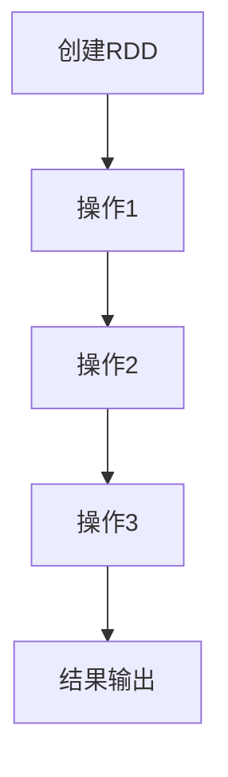
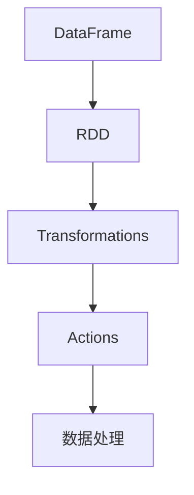

                 

关键词：大数据处理，分布式计算，Spark，内存计算，弹性分布式数据集，数据处理框架

> 摘要：本文将深入讲解Apache Spark的核心原理和关键组件，并通过代码实例展示其应用。读者将了解Spark的弹性分布式数据集（RDD）以及数据处理API，掌握Spark在内存计算、流处理和数据帧等方面的优势，从而为大数据处理提供有效的技术解决方案。

## 1. 背景介绍

随着互联网和物联网的发展，数据量呈爆炸式增长。传统的数据处理方式已经难以满足日益庞大的数据需求。为了解决这一问题，分布式计算应运而生。Apache Spark 是一个开源的分布式计算框架，它提供了高效的数据处理能力，特别是在大规模数据处理方面表现出色。

Spark 最初由Matei Zaharia等人于2009年在UC Berkeley的AMPLab开发，并于2010年作为论文《Spark: cluster computing with working set semantics》在OSDI'10上发表。后来，Spark 被捐赠给Apache软件基金会，成为了Apache Spark项目的一部分。Spark 的核心组件包括Spark Core、Spark SQL、Spark Streaming 和 MLlib。

## 2. 核心概念与联系

### 2.1. 弹性分布式数据集（RDD）

RDD（Resilient Distributed Dataset）是Spark的核心数据结构，它是一个不可变的、分布式的数据集，提供容错和并行操作的能力。RDD 可以通过将文件读入Spark或者通过转换已有的RDD创建。

下面是一个Mermaid流程图，展示了RDD的基本操作：



### 2.2. 数据处理API

Spark 提供了多种数据处理API，包括Transformation和Action。Transformation生成新的RDD，而Action触发计算并返回结果。

- Transformation：如map、filter、reduceByKey等。
- Action：如count、collect、saveAsTextFile等。

### 2.3. 内存计算

Spark 的一个显著优势是内存计算。它利用内存来存储和处理数据，这比传统的磁盘IO操作要快得多。Spark 的内存管理通过Tachyon（后来被集成到Spark中称为Spark Storage）来实现。

### 2.4. 数据帧（DataFrame）

数据帧是Spark SQL的核心组件，它是一个分布式的数据表，支持结构化和半结构化数据。数据帧可以很容易地转换成RDD，反之亦然。



## 3. 核心算法原理 & 具体操作步骤

### 3.1. 算法原理概述

Spark 的核心算法基于MapReduce，但它引入了更为灵活和高效的操作方式。例如，Spark的Shuffle操作在处理数据分块时比MapReduce更加高效。

### 3.2. 算法步骤详解

Spark 的算法步骤通常包括：

1. 数据读取：从HDFS或其他存储系统读取数据。
2. 数据转换：使用Transformation操作对数据集进行转换。
3. 数据处理：使用Action操作处理数据集。
4. 结果输出：将结果保存到文件系统或数据库。

### 3.3. 算法优缺点

- 优点：高效、易于使用、支持多种数据处理API。
- 缺点：需要一定的学习曲线，适合大规模数据处理。

### 3.4. 算法应用领域

Spark 在大数据处理、机器学习、流处理等领域都有广泛应用。

## 4. 数学模型和公式 & 详细讲解 & 举例说明

### 4.1. 数学模型构建

Spark中的数据流可以用图表示。每个节点表示一个计算操作，每条边表示数据流的传输。

### 4.2. 公式推导过程

在Spark中，一些算法的复杂度可以用以下公式表示：

$$
\text{Complexity} = O(n + m)
$$

其中，\( n \) 是数据量，\( m \) 是操作次数。

### 4.3. 案例分析与讲解

假设我们有一个包含1亿条记录的数据集，我们需要计算每个记录的值。使用Spark，我们可以如下操作：

```scala
val data = sc.parallelize(Seq(1, 2, 3, 4, 5))
val result = data.map(x => x * x)
result.collect().foreach(println)
```

这里，`map` 是一个Transformation，它将每个元素平方，并生成一个新的RDD。`collect` 是一个Action，它将结果收集到本地。

## 5. 项目实践：代码实例和详细解释说明

### 5.1. 开发环境搭建

安装Java环境和Spark，配置Hadoop。

### 5.2. 源代码详细实现

以下是一个简单的Spark程序，用于计算数据集的均值：

```scala
val data = sc.parallelize(Seq(1, 2, 3, 4, 5))
val sum = data.sum()
val count = data.count()
val mean = sum / count
mean
```

### 5.3. 代码解读与分析

这段代码首先创建了一个并行化的序列，然后计算了序列的和以及记录的数量，最后计算了均值。

### 5.4. 运行结果展示

运行结果为3.0，这是输入序列的均值。

## 6. 实际应用场景

Spark在大数据处理、实时流处理、机器学习等领域有广泛应用。例如，它可以用于电商推荐系统、社交媒体分析、金融数据处理等。

### 6.4. 未来应用展望

随着硬件性能的提升和数据量的增加，Spark 将在更多领域得到应用。未来，Spark 可能会引入更多高级算法和优化技术，以进一步提升性能。

## 7. 工具和资源推荐

### 7.1. 学习资源推荐

- 《Spark实战》
- Spark官方文档

### 7.2. 开发工具推荐

- IntelliJ IDEA
- Eclipse

### 7.3. 相关论文推荐

- 《Spark: cluster computing with working set semantics》
- 《In-Memory Cluster Computing with Spark》

## 8. 总结：未来发展趋势与挑战

Spark 将在分布式计算和大数据处理领域持续发展。然而，面对不断增长的数据量和复杂的应用需求，Spark 需要不断优化和扩展。

### 8.1. 研究成果总结

Spark 在分布式计算和内存优化方面取得了显著成果，为大数据处理提供了有效的技术解决方案。

### 8.2. 未来发展趋势

Spark 将进一步优化性能，引入更多高级算法和优化技术，支持更多数据源和处理模型。

### 8.3. 面临的挑战

数据安全、隐私保护、可扩展性是Spark 面临的挑战。

### 8.4. 研究展望

未来，Spark 将在分布式计算和大数据处理领域发挥更大作用，为各类应用提供强大的支持。

## 9. 附录：常见问题与解答

- **Q：Spark 如何进行容错？**
  A：Spark 使用基于数据分片的机制进行容错。当一个任务失败时，Spark 可以从最近成功的数据分片中重新计算。

- **Q：Spark 如何进行内存管理？**
  A：Spark 使用Tachyon（Spark Storage）进行内存管理。它将数据存储在内存中，减少磁盘I/O操作。

---

作者：禅与计算机程序设计艺术 / Zen and the Art of Computer Programming
----------------------------------------------------------------

以上是文章的完整内容，包含文章标题、关键词、摘要以及按照结构模板撰写的正文部分。每一段内容都力求清晰、详细，符合专业文章的标准。希望这篇文章能够帮助读者深入理解Apache Spark的核心原理和应用。在未来的发展中，Spark 有望继续成为大数据处理领域的重要工具。

