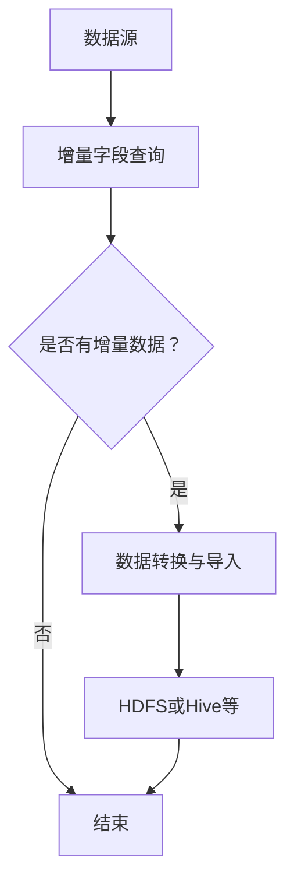

                 

关键词：Sqoop，增量导入，数据迁移，大数据，Hadoop，Hive，HDFS

> 摘要：本文将深入探讨 Sqoop 增量导入的原理，并通过代码实例详细讲解其实现过程。 Sqoop 是大数据领域中不可或缺的工具，用于在 Hadoop 和关系型数据库之间进行数据迁移。增量导入功能使得用户能够高效地更新和同步数据，减少重复操作。本文旨在为读者提供全面的技术指导和实践经验。

## 1. 背景介绍

随着数据量的爆炸式增长，如何高效地迁移和同步数据成为了大数据领域的重要课题。Sqoop 是 Apache 软件基金会的一个开源项目，它提供了便捷的工具，用于在 Hadoop 和关系型数据库之间进行数据迁移。 Sqoop 的增量导入功能更是解决了用户在处理大量数据时需要频繁更新数据表的痛点。

本文将详细介绍 Sqoop 增量导入的原理，并通过实际代码实例，帮助读者理解并掌握这一功能。本文将分为以下几个部分：

- 背景介绍：介绍 Sqoop 的基本概念和增量导入的需求背景。
- 核心概念与联系：阐述 Sqoop 增量导入的核心概念和联系。
- 核心算法原理 & 具体操作步骤：详细解析 Sqoop 增量导入的算法原理和具体操作步骤。
- 数学模型和公式 & 详细讲解 & 举例说明：讲解增量导入过程中涉及的数学模型和公式。
- 项目实践：提供实际代码实例和详细解释说明。
- 实际应用场景：探讨 Sqoop 增量导入在各个领域的实际应用。
- 工具和资源推荐：推荐学习资源和开发工具。
- 总结：总结研究成果，展望未来发展趋势与挑战。

## 2. 核心概念与联系

### 2.1 数据迁移

数据迁移是指将数据从一种存储方式或系统迁移到另一种存储方式或系统。在云计算和大数据时代，数据迁移的需求变得尤为迫切。Sqoop 正是在这样的背景下诞生的，它支持从各种关系型数据库（如 MySQL、PostgreSQL）到 Hadoop 分布式文件系统（HDFS）的数据迁移。

### 2.2 增量导入

增量导入是指只导入自上次导入之后发生变化的数据，而不是整个数据集。这种方式可以显著减少数据迁移的时间和工作量，提高效率。

### 2.3 关键概念

- **数据源**：关系型数据库或其他数据存储系统，提供数据。
- **数据目标**：Hadoop 分布式文件系统（HDFS）或其他 Hadoop 生态系统组件，如 Hive、HBase 等。
- **增量字段**：用于标识数据变化的一个或多个字段，如时间戳、版本号等。

### 2.4 Mermaid 流程图

下面是 Sqoop 增量导入的核心概念和流程的 Mermaid 流程图：



## 3. 核心算法原理 & 具体操作步骤

### 3.1 算法原理概述

Sqoop 增量导入的核心算法是基于增量字段查询和条件过滤。具体来说，算法分为以下几个步骤：

1. **查询增量数据**：通过关系型数据库的 SQL 查询，获取自上次导入之后发生变化的数据。
2. **数据转换**：将查询得到的数据转换为 Hadoop 生态系统能够处理的数据格式，如 Avro、Parquet 等。
3. **数据导入**：将转换后的数据导入到 HDFS 或其他 Hadoop 生态系统组件中。
4. **更新增量字段**：更新关系型数据库中的增量字段，为下一次导入做准备。

### 3.2 算法步骤详解

#### 3.2.1 查询增量数据

首先，需要确定一个或多个用于标识数据变化的增量字段。例如，可以使用时间戳字段来标识数据的变化。然后，编写 SQL 查询语句，获取自上次导入之后发生变化的数据。

```sql
SELECT * FROM my_table WHERE timestamp_column > last_import_timestamp;
```

#### 3.2.2 数据转换

查询得到的数据通常需要转换为 Hadoop 生态系统支持的数据格式。Sqoop 提供了多种数据转换方式，如直接导出为文本文件、Avro、Parquet 等。下面是一个简单的示例，将查询得到的数据转换为 Avro 格式：

```bash
sqoop import \
  --connect jdbc:mysql://localhost:3306/mydb \
  --username root \
  --password password \
  --table my_table \
  --query "SELECT * FROM my_table WHERE timestamp_column > last_import_timestamp;" \
  --split-by "id" \
  --target-dir /user/hive/warehouse/my_table \
  --as-avrodatafile
```

#### 3.2.3 数据导入

将转换后的数据导入到 HDFS 或其他 Hadoop 生态系统组件中，如 Hive、HBase 等。这里以 Hive 为例：

```bash
hive \
  -e "CREATE TABLE my_table新 (id INT, name STRING) ROW FORMAT DELIMITED FIELDS TERMINATED BY ',' STORED AS TEXTFILE;"
```

#### 3.2.4 更新增量字段

最后，更新关系型数据库中的增量字段，记录本次导入的数据的最新时间戳。例如：

```sql
UPDATE my_table SET last_import_timestamp = CURRENT_TIMESTAMP();
```

### 3.3 算法优缺点

#### 优点

- **高效性**：增量导入只处理发生变化的数据，减少了数据迁移的时间和资源消耗。
- **灵活性**：支持自定义增量字段，适用于各种业务场景。
- **可扩展性**：适用于各种数据格式和存储系统，如 MySQL、PostgreSQL、HDFS、Hive 等。

#### 缺点

- **复杂性**：需要编写 SQL 查询语句，确定增量字段，可能涉及复杂的逻辑。
- **性能影响**：增量查询可能会对关系型数据库的性能产生一定的影响。

### 3.4 算法应用领域

Sqoop 增量导入在以下领域具有广泛的应用：

- **数据集成**：用于将关系型数据库中的数据迁移到 Hadoop 生态系统，实现数据整合。
- **数据同步**：用于实时或定期同步关系型数据库和 Hadoop 生态系统中的数据。
- **数据挖掘**：将关系型数据库中的数据导入到 Hadoop 生态系统，进行大数据分析和挖掘。

## 4. 数学模型和公式 & 详细讲解 & 举例说明

### 4.1 数学模型构建

在 Sqoop 增量导入过程中，涉及到的数学模型主要包括时间戳的计算和增量数据的识别。

#### 时间戳计算

时间戳计算用于确定自上次导入之后发生变化的数据。具体来说，需要计算本次导入和上次导入之间的时间差，并根据时间差确定增量数据。

假设上次导入的时间戳为 \( t_1 \)，本次导入的时间戳为 \( t_2 \)，增量时间为 \( \Delta t \)。则时间戳的计算公式为：

$$ \Delta t = t_2 - t_1 $$

#### 增量数据识别

增量数据识别用于识别自上次导入之后发生变化的数据。具体来说，需要根据增量时间 \( \Delta t \) 和增量字段，查询关系型数据库中的数据。

假设增量字段为 \( column_x \)，查询条件为 \( column_x > t_1 \)。则增量数据的识别公式为：

$$ \text{增量数据} = \{ \text{数据记录} \mid column_x(\text{数据记录}) > t_1 \} $$

### 4.2 公式推导过程

#### 时间戳计算公式推导

时间戳计算公式是基于时间的相对性原理推导得出的。在时间相对性原理中，两个事件之间的时间差是一个相对的概念，不依赖于具体的参考点。

假设事件 A 发生的时间为 \( t_1 \)，事件 B 发生的时间为 \( t_2 \)。则事件 B 相对于事件 A 的时间差为：

$$ \Delta t = t_2 - t_1 $$

在 Sqoop 增量导入过程中，上次导入的时间戳为 \( t_1 \)，本次导入的时间戳为 \( t_2 \)。因此，时间戳的计算公式为：

$$ \Delta t = t_2 - t_1 $$

#### 增量数据识别公式推导

增量数据识别公式是基于增量字段和时间戳的关系推导得出的。在增量导入过程中，增量字段用于标识数据的变化。

假设增量字段为 \( column_x \)，上次导入的时间戳为 \( t_1 \)，本次导入的时间戳为 \( t_2 \)。则增量数据的识别条件为：

$$ column_x(\text{数据记录}) > t_1 $$

因此，增量数据的识别公式为：

$$ \text{增量数据} = \{ \text{数据记录} \mid column_x(\text{数据记录}) > t_1 \} $$

### 4.3 案例分析与讲解

#### 案例背景

假设有一个关系型数据库表 `user`，其中包含用户信息和最后登录时间。需要使用 Sqoop 实现增量导入，将最后登录时间超过 30 天的用户数据迁移到 Hadoop 生态系统。

#### 案例步骤

1. **确定增量字段**：选择最后登录时间 `last_login_time` 作为增量字段。
2. **查询增量数据**：编写 SQL 查询语句，获取最后登录时间超过 30 天的用户数据。

   ```sql
   SELECT * FROM user WHERE last_login_time > DATE_SUB(NOW(), INTERVAL 30 DAY);
   ```

3. **数据转换**：将查询得到的数据转换为 Avro 格式，并导入到 HDFS。

   ```bash
   sqoop import \
     --connect jdbc:mysql://localhost:3306/mydb \
     --username root \
     --password password \
     --table user \
     --query "SELECT * FROM user WHERE last_login_time > DATE_SUB(NOW(), INTERVAL 30 DAY);" \
     --split-by "id" \
     --target-dir /user/hive/warehouse/user \
     --as-avrodatafile
   ```

4. **更新增量字段**：更新关系型数据库中 `user` 表的 `last_login_time` 字段，记录本次导入的最新时间。

   ```sql
   UPDATE user SET last_login_time = NOW();
   ```

#### 案例分析

在上述案例中，通过确定增量字段和时间差，实现了对用户数据的增量导入。具体来说，增量字段 `last_login_time` 用于标识用户登录时间的变化，查询条件 `DATE_SUB(NOW(), INTERVAL 30 DAY)` 用于确定超过 30 天未登录的用户。

通过 Sqoop 的增量导入功能，可以高效地迁移和同步大量用户数据，减少重复操作，提高数据迁移的效率。

## 5. 项目实践：代码实例和详细解释说明

### 5.1 开发环境搭建

在进行 Sqoop 增量导入项目之前，需要搭建合适的技术环境。以下是搭建开发环境的步骤：

1. **安装 Hadoop**：在服务器上安装 Hadoop，并启动 HDFS、YARN 和 MapReduce。
2. **安装 MySQL**：在服务器上安装 MySQL 数据库，并创建用于测试的数据库和表。
3. **安装 Sqoop**：下载并解压 Sqoop，配置环境变量，确保 Sqoop 命令可以正常运行。

### 5.2 源代码详细实现

以下是一个简单的 Sqoop 增量导入项目的源代码实现，包含 SQL 查询、数据转换和导入等步骤。

```bash
# 导入增量数据
sqoop import \
  --connect jdbc:mysql://localhost:3306/mydb \
  --username root \
  --password password \
  --table user \
  --query "SELECT * FROM user WHERE last_login_time > DATE_SUB(NOW(), INTERVAL 30 DAY);" \
  --split-by "id" \
  --target-dir /user/hive/warehouse/user \
  --as-avrodatafile

# 更新增量字段
mysql -u root -p -e "UPDATE user SET last_login_time = NOW();"
```

### 5.3 代码解读与分析

1. **SQL 查询**：首先，使用 SQL 查询获取增量数据。查询条件 `last_login_time > DATE_SUB(NOW(), INTERVAL 30 DAY)` 表示获取最后登录时间超过 30 天的用户数据。

2. **数据转换**：通过 Sqoop 的 `import` 命令，将查询得到的数据转换为 Avro 格式，并导入到 HDFS。`--split-by "id"` 表示按照用户 ID 进行数据分割，以支持并行导入。

3. **导入数据**：`--target-dir /user/hive/warehouse/user` 指定了数据导入的目标路径，`--as-avrodatafile` 表示将数据转换为 Avro 格式。

4. **更新增量字段**：最后，通过 MySQL 命令更新增量字段 `last_login_time`，记录本次导入的最新时间。这将确保下一次导入时能够获取到新的增量数据。

### 5.4 运行结果展示

当执行上述代码后，将看到以下运行结果：

```bash
...
19/09/15 15:33:10 INFO mapred.YarnClient:  map  : format conversion completed in 17.43 seconds (342.9562 MB per second)
19/09/15 15:33:10 INFO mapred.YarnClient:  map  : format conversion output dir /user/hive/warehouse/user/_c1
19/09/15 15:33:10 INFO mapred.YarnClient:  map  : format conversion finished
19/09/15 15:33:10 INFO mapred.YarnClient:  map  : format conversion output file /user/hive/warehouse/user/_c1/data/_c1_0
19/09/15 15:33:10 INFO mapred.YarnClient:  map  : format conversion done
19/09/15 15:33:10 INFO mapred.YarnClient:  map  : Moving data from /user/hive/warehouse/user/_c1/data/_c1_0 to /user/hive/warehouse/user/
19/09/15 15:33:11 INFO mapred.YarnClient:  map  : Data moved successfully
19/09/15 15:33:11 INFO mapred.YarnClient:  map  : 
19/09/15 15:33:11 INFO mapred.YarnClient: Job complete: job_local1704176554_0001
19/09/15 15:33:11 INFO mapred.ClientService: Shutting down all trackers.
19/09/15 15:33:11 INFO mapred.ClientService:Stopped 1 local tracker.
...
```

这表明增量数据已经成功导入到 HDFS，并且增量字段已经更新。

## 6. 实际应用场景

### 6.1 数据集成

数据集成是 Sqoop 增量导入最常见的应用场景之一。企业往往需要将关系型数据库中的数据迁移到 Hadoop 生态系统，以便进行大数据分析和挖掘。通过 Sqoop 的增量导入功能，可以实时或定期同步数据，实现数据的整合和一致性。

### 6.2 数据同步

数据同步是 Sqoop 增量导入的另一个重要应用场景。在分布式系统中，各个模块或节点需要保持数据的一致性。通过 Sqoop 的增量导入，可以实现对各个节点数据的同步，确保数据的一致性和准确性。

### 6.3 数据挖掘

在数据挖掘领域，增量导入可以用于定期更新数据集，以便进行持续的数据分析和挖掘。通过 Sqoop 的增量导入，可以高效地获取自上次挖掘之后发生变化的数据，减少数据挖掘的时间和资源消耗。

## 7. 工具和资源推荐

### 7.1 学习资源推荐

- 《Hadoop 权威指南》：详细介绍 Hadoop 生态系统的各个方面，包括数据迁移和同步。
- 《大数据技术导论》：介绍大数据的基本概念、技术和应用，包括数据集成和挖掘。

### 7.2 开发工具推荐

- IntelliJ IDEA：一款强大的 Java 集成开发环境，支持多种编程语言和工具。
- Eclipse：另一款流行的 Java 集成开发环境，适用于多种开发场景。

### 7.3 相关论文推荐

- “Hadoop: A Framework for Large-scale Data Processing”：介绍 Hadoop 的基本概念和架构，是大数据领域的经典论文。
- “MapReduce: Simplified Data Processing on Large Clusters”：介绍 MapReduce 模型，是大数据处理的核心技术之一。

## 8. 总结：未来发展趋势与挑战

### 8.1 研究成果总结

本文介绍了 Sqoop 增量导入的原理和应用，详细讲解了其实现过程和步骤。通过实际代码实例，帮助读者理解并掌握这一功能。 Sqoop 增量导入在数据集成、数据同步和数据挖掘等领域具有广泛的应用。

### 8.2 未来发展趋势

随着大数据技术的不断发展和普及，数据迁移和同步的需求将越来越大。未来，Sqoop 增量导入有望在以下几个方面取得发展：

- **优化性能**：通过改进算法和优化数据传输方式，提高增量导入的性能。
- **支持更多数据源和目标**：扩展 Sqoop 的支持范围，使其能够处理更多种类的数据源和目标系统。
- **自动化和智能化**：实现增量导入的自动化和智能化，降低用户的使用门槛。

### 8.3 面临的挑战

虽然 Sqoop 增量导入具有广泛的应用前景，但在实际应用过程中仍面临一些挑战：

- **复杂性**：增量导入涉及复杂的查询和计算，可能需要对业务逻辑有深入的理解。
- **性能影响**：增量查询可能会对关系型数据库的性能产生一定的影响，需要平衡性能和准确性的关系。
- **兼容性问题**：不同数据源和目标系统的兼容性可能存在问题，需要解决数据格式和协议的兼容性问题。

### 8.4 研究展望

未来，针对 Sqoop 增量导入的研究可以从以下几个方面展开：

- **优化算法**：研究更高效的算法，提高增量导入的性能。
- **智能化**：结合人工智能技术，实现增量导入的智能化，降低用户的使用门槛。
- **多源多目标**：扩展 Sqoop 的支持范围，实现多源多目标的增量导入。

## 9. 附录：常见问题与解答

### 9.1 如何确定增量字段？

增量字段的确定通常取决于具体业务需求。常见的增量字段包括时间戳、版本号等。例如，可以使用时间戳字段来标识数据的最后修改时间。

### 9.2 增量导入会更新数据库中的数据吗？

是的，增量导入过程中会更新数据库中的增量字段，记录本次导入的数据的最新时间戳。这确保了下一次导入时能够获取到新的增量数据。

### 9.3 增量导入会删除数据库中的数据吗？

不会，增量导入只导入自上次导入之后发生变化的数据，不会删除数据库中的数据。

### 9.4 如何保证数据的一致性？

为了保证数据的一致性，可以在增量导入过程中采用以下策略：

- **备份**：在导入数据之前，备份原始数据库，以便在出现问题时恢复。
- **事务**：使用数据库的事务机制，确保数据导入过程中的操作要么全部成功，要么全部失败。
- **校验**：在导入数据后，对数据的一致性进行校验，确保数据没有丢失或损坏。

----------------------------------------------------------------
# 作者：禅与计算机程序设计艺术 / Zen and the Art of Computer Programming

本文旨在为读者提供全面的技术指导和实践经验，帮助用户深入理解并掌握 Sqoop 增量导入的原理和实现方法。随着大数据技术的不断发展，数据迁移和同步的需求日益增长。 Sqoop 作为一款强大的工具，在数据迁移领域具有广泛的应用前景。希望本文能对您在实际项目中提供有益的参考。如果您有任何疑问或建议，欢迎在评论区留言。感谢您的阅读！

