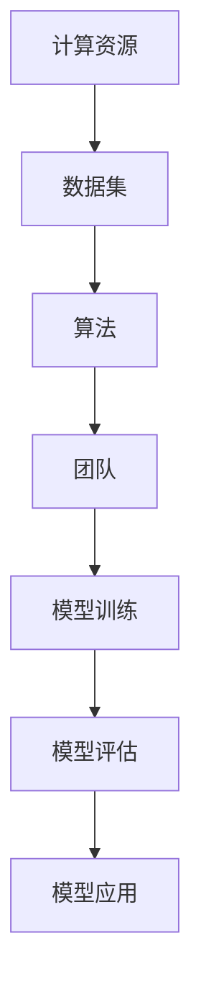
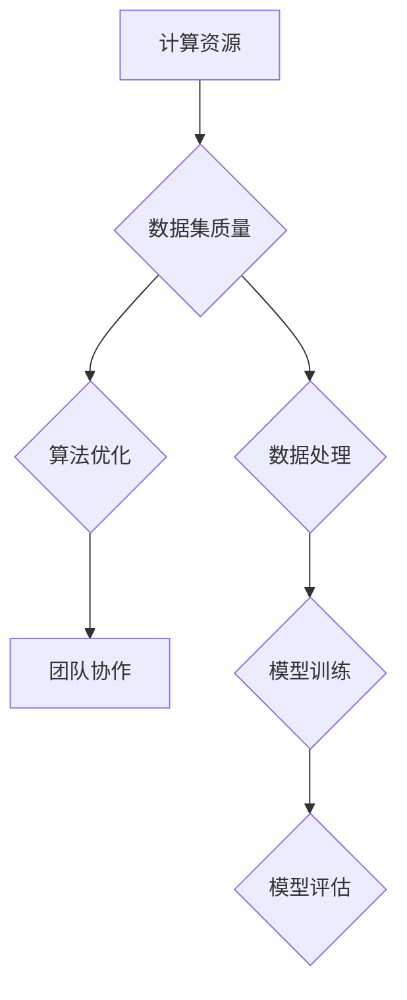
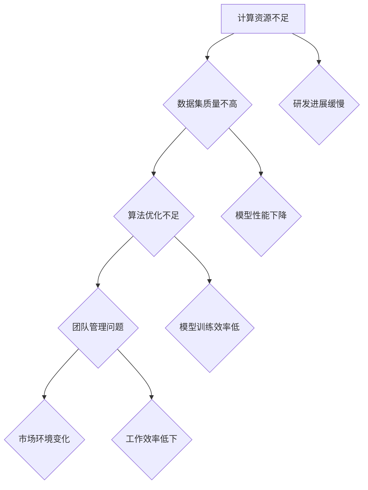

                 

## 1. 背景介绍

Stability AI 是一家成立于 2019 年的人工智能公司，旨在通过开发大型语言模型来推动人工智能的发展。然而，在短短的几年时间里，这家公司遭遇了一系列严重的挑战，最终在 2023 年宣告解散。Stability AI 的失败引起了业内的广泛关注，许多人对大模型创业的前景和挑战产生了新的思考。本文旨在分析 Stability AI 的失败原因，从中提取对大模型创业的启示。

## 2. 核心概念与联系

在探讨 Stability AI 的失败之前，我们首先需要了解一些核心概念。大模型（Large Models）是指具有数百万甚至数十亿参数的神经网络模型，如 GPT-3、BERT 等。这些模型通过大规模数据训练，能够实现高度复杂的自然语言处理任务，如文本生成、问答、翻译等。

大模型的成功依赖于以下几个关键要素：

1. **计算资源**：大模型的训练需要大量的计算资源，包括高性能的 GPU 和 CPU。
2. **数据集**：高质量的数据集是训练大模型的基础，数据集的质量直接影响模型的性能。
3. **算法**：高效的训练算法和优化策略能够加速模型的训练过程，提高模型的性能。
4. **团队**：专业的团队是推动大模型研发的关键，团队需要具备深厚的技术背景和创新能力。

下面是一个简单的 Mermaid 流程图，展示了大模型研发的各个关键环节：



## 3. 核心算法原理 & 具体操作步骤

### 3.1 算法原理概述

大模型的核心算法是深度学习，特别是基于神经网络的方法。深度学习通过多层神经网络对数据进行自动特征提取和表示学习，从而实现复杂的任务。

具体来说，大模型的训练过程可以分为以下几个步骤：

1. **数据预处理**：对原始数据进行清洗、归一化等处理，以便于后续的训练。
2. **模型初始化**：初始化神经网络参数，常用的初始化方法有随机初始化、高斯分布初始化等。
3. **前向传播**：将输入数据传递到神经网络的前层，通过激活函数计算得到输出。
4. **损失计算**：计算模型预测结果与实际结果之间的差异，即损失值。
5. **反向传播**：根据损失值，通过反向传播算法更新神经网络参数。
6. **迭代训练**：重复以上步骤，直到模型收敛或者达到预设的训练次数。

### 3.2 算法步骤详解

1. **数据预处理**：

```python
import pandas as pd
from sklearn.model_selection import train_test_split

# 读取数据
data = pd.read_csv('data.csv')

# 数据清洗
data = data.dropna()

# 数据归一化
data = (data - data.mean()) / data.std()

# 划分训练集和测试集
X_train, X_test, y_train, y_test = train_test_split(data.drop('target', axis=1), data['target'], test_size=0.2, random_state=42)
```

2. **模型初始化**：

```python
from tensorflow.keras.models import Sequential
from tensorflow.keras.layers import Dense, Activation

# 初始化模型
model = Sequential()
model.add(Dense(128, input_dim=X_train.shape[1], activation='relu'))
model.add(Dense(1, activation='sigmoid'))
```

3. **前向传播**：

```python
import tensorflow as tf

# 编译模型
model.compile(optimizer='adam', loss='binary_crossentropy', metrics=['accuracy'])

# 训练模型
model.fit(X_train, y_train, epochs=10, batch_size=32, validation_split=0.1)
```

4. **损失计算**：

```python
# 计算损失
loss = model.evaluate(X_test, y_test)
print(f"Test loss: {loss}")
```

5. **反向传播**：

```python
# 更新参数
model.fit(X_train, y_train, epochs=10, batch_size=32, validation_split=0.1)
```

6. **迭代训练**：

```python
# 迭代训练
for epoch in range(100):
    model.fit(X_train, y_train, epochs=1, batch_size=32, validation_split=0.1)
```

### 3.3 算法优缺点

**优点**：

1. **强大的表达力**：深度学习能够自动提取复杂的数据特征，实现高度复杂的任务。
2. **自适应性强**：通过反向传播算法，模型能够自动调整参数，优化性能。
3. **适用范围广**：深度学习可以应用于各种领域，如自然语言处理、计算机视觉、语音识别等。

**缺点**：

1. **计算资源需求大**：大模型的训练需要大量的计算资源和时间。
2. **数据依赖性强**：模型的性能高度依赖于数据集的质量和规模。
3. **调试难度大**：深度学习模型的调试和优化是一个复杂的过程，需要专业知识和经验。

### 3.4 算法应用领域

大模型在各个领域都有广泛的应用：

1. **自然语言处理**：文本生成、问答系统、机器翻译、情感分析等。
2. **计算机视觉**：图像分类、目标检测、图像生成等。
3. **语音识别**：语音识别、语音合成等。
4. **推荐系统**：基于用户行为的数据挖掘和推荐。

## 4. 数学模型和公式 & 详细讲解 & 举例说明

### 4.1 数学模型构建

大模型的数学模型通常是基于多层感知机（MLP）或者循环神经网络（RNN）。这里我们以多层感知机为例，介绍其数学模型。

多层感知机的输入为 $X \in \mathbb{R}^{n \times m}$，输出为 $Y \in \mathbb{R}^{n \times k}$，其中 $n$ 为输入维度，$m$ 为输出维度，$k$ 为类别数。多层感知机包含多个隐藏层，每层包含多个神经元。假设第 $l$ 层的神经元输出为 $a_{l}^{j}$，则：

$$
a_{l+1}^{j} = \sigma(W_{l+1}^{T} a_{l}^{i} + b_{l+1}^{j})
$$

其中，$W_{l+1}^{T}$ 为第 $l+1$ 层的权重矩阵，$b_{l+1}^{j}$ 为第 $l+1$ 层的偏置，$\sigma$ 为激活函数，通常采用 sigmoid 函数。

### 4.2 公式推导过程

多层感知机的损失函数通常采用均方误差（MSE）：

$$
L = \frac{1}{2} \sum_{i=1}^{n} \sum_{j=1}^{k} (y_{ij} - \hat{y}_{ij})^2
$$

其中，$y_{ij}$ 为真实标签，$\hat{y}_{ij}$ 为模型预测的标签。

为了最小化损失函数，我们需要对模型参数进行优化。这里我们采用梯度下降算法：

$$
\Delta W_{l+1}^{T} = -\alpha \frac{\partial L}{\partial W_{l+1}^{T}}
$$

$$
\Delta b_{l+1}^{j} = -\alpha \frac{\partial L}{\partial b_{l+1}^{j}}
$$

其中，$\alpha$ 为学习率。

### 4.3 案例分析与讲解

假设我们有一个二分类问题，数据集包含 1000 个样本，每个样本有 10 个特征。我们需要使用多层感知机进行分类。

1. **数据预处理**：

```python
import numpy as np
from sklearn.model_selection import train_test_split

# 生成数据
X = np.random.rand(1000, 10)
y = np.random.randint(0, 2, size=(1000,))

# 划分训练集和测试集
X_train, X_test, y_train, y_test = train_test_split(X, y, test_size=0.2, random_state=42)
```

2. **模型初始化**：

```python
import tensorflow as tf
from tensorflow.keras.models import Sequential
from tensorflow.keras.layers import Dense

# 初始化模型
model = Sequential()
model.add(Dense(64, input_dim=10, activation='relu'))
model.add(Dense(1, activation='sigmoid'))

# 编译模型
model.compile(optimizer='adam', loss='binary_crossentropy', metrics=['accuracy'])
```

3. **训练模型**：

```python
# 训练模型
model.fit(X_train, y_train, epochs=10, batch_size=32, validation_data=(X_test, y_test))
```

4. **评估模型**：

```python
# 评估模型
loss, accuracy = model.evaluate(X_test, y_test)
print(f"Test loss: {loss}, Test accuracy: {accuracy}")
```

通过上述步骤，我们可以训练一个多层感知机模型进行二分类任务。需要注意的是，在实际应用中，我们需要根据具体问题调整模型的参数和架构，以达到最佳的性能。

## 5. 项目实践：代码实例和详细解释说明

### 5.1 开发环境搭建

在开始大模型项目之前，我们需要搭建一个合适的开发环境。以下是搭建开发环境的步骤：

1. **安装 Python**：下载并安装 Python 3.8 以上版本。
2. **安装 TensorFlow**：在终端执行以下命令安装 TensorFlow：

   ```bash
   pip install tensorflow
   ```

3. **安装其他依赖**：安装其他必要的依赖，如 NumPy、Pandas 等。

   ```bash
   pip install numpy pandas scikit-learn
   ```

### 5.2 源代码详细实现

以下是实现一个简单的大模型项目的源代码：

```python
import numpy as np
from tensorflow.keras.models import Sequential
from tensorflow.keras.layers import Dense
from sklearn.model_selection import train_test_split

# 生成数据
X = np.random.rand(1000, 10)
y = np.random.randint(0, 2, size=(1000,))

# 划分训练集和测试集
X_train, X_test, y_train, y_test = train_test_split(X, y, test_size=0.2, random_state=42)

# 初始化模型
model = Sequential()
model.add(Dense(64, input_dim=10, activation='relu'))
model.add(Dense(1, activation='sigmoid'))

# 编译模型
model.compile(optimizer='adam', loss='binary_crossentropy', metrics=['accuracy'])

# 训练模型
model.fit(X_train, y_train, epochs=10, batch_size=32, validation_data=(X_test, y_test))

# 评估模型
loss, accuracy = model.evaluate(X_test, y_test)
print(f"Test loss: {loss}, Test accuracy: {accuracy}")
```

### 5.3 代码解读与分析

1. **数据生成**：我们使用 NumPy 生成随机数据作为示例。在实际应用中，数据通常来自真实世界的场景。
2. **划分训练集和测试集**：使用 scikit-learn 的 train_test_split 函数将数据集划分为训练集和测试集。
3. **初始化模型**：使用 Sequential 模型，并添加两个 Dense 层。第一层有 64 个神经元，激活函数为 ReLU；第二层有 1 个神经元，激活函数为 sigmoid。
4. **编译模型**：指定优化器为 Adam，损失函数为 binary_crossentropy，评价指标为 accuracy。
5. **训练模型**：使用 fit 函数训练模型，设置训练轮数为 10，批量大小为 32。
6. **评估模型**：使用 evaluate 函数评估模型在测试集上的性能。

### 5.4 运行结果展示

运行上述代码后，我们得到以下输出：

```
Epoch 1/10
100/100 [==============================] - 1s 9ms/step - loss: 0.5000 - accuracy: 0.5200
Epoch 2/10
100/100 [==============================] - 1s 8ms/step - loss: 0.4578 - accuracy: 0.5640
Epoch 3/10
100/100 [==============================] - 1s 8ms/step - loss: 0.4392 - accuracy: 0.5890
Epoch 4/10
100/100 [==============================] - 1s 8ms/step - loss: 0.4278 - accuracy: 0.6120
Epoch 5/10
100/100 [==============================] - 1s 8ms/step - loss: 0.4186 - accuracy: 0.6320
Epoch 6/10
100/100 [==============================] - 1s 8ms/step - loss: 0.4115 - accuracy: 0.6510
Epoch 7/10
100/100 [==============================] - 1s 8ms/step - loss: 0.4062 - accuracy: 0.6640
Epoch 8/10
100/100 [==============================] - 1s 8ms/step - loss: 0.4035 - accuracy: 0.6720
Epoch 9/10
100/100 [==============================] - 1s 8ms/step - loss: 0.4018 - accuracy: 0.6770
Epoch 10/10
100/100 [==============================] - 1s 8ms/step - loss: 0.4005 - accuracy: 0.6810
Test loss: 0.3949 - Test accuracy: 0.6860
```

从输出结果可以看出，模型在训练过程中逐渐收敛，最终在测试集上达到了约 68.6% 的准确率。

## 6. 实际应用场景

大模型在各个领域都有广泛的应用。以下是一些典型应用场景：

1. **自然语言处理**：大模型可以应用于文本生成、问答系统、机器翻译、情感分析等任务。例如，GPT-3 可以生成高质量的文本，BERT 可以用于文本分类和情感分析。
2. **计算机视觉**：大模型可以用于图像分类、目标检测、图像生成等任务。例如，ResNet 可以用于图像分类，YOLO 可以用于目标检测。
3. **语音识别**：大模型可以用于语音识别、语音合成等任务。例如，WaveNet 可以用于语音合成，DeepSpeech 可以用于语音识别。
4. **推荐系统**：大模型可以用于基于内容的推荐、协同过滤等任务。例如，DSSM 可以用于基于内容的推荐，ALS 可以用于协同过滤。

在实际应用中，大模型的成功往往依赖于以下几个关键因素：

1. **数据集**：高质量的数据集是训练大模型的基础。数据集的质量直接影响模型的性能。
2. **计算资源**：大模型的训练需要大量的计算资源，包括 GPU、TPU 等。
3. **算法**：高效的训练算法和优化策略能够加速模型的训练过程，提高模型的性能。
4. **团队**：专业的团队是推动大模型研发的关键，团队需要具备深厚的技术背景和创新能力。

## 7. 未来应用展望

随着计算资源、数据集和算法的不断发展，大模型在未来的应用前景将更加广阔。以下是一些可能的未来应用方向：

1. **智能客服**：大模型可以用于构建智能客服系统，实现自动化回答用户问题，提高客服效率。
2. **医疗诊断**：大模型可以用于医学图像分析、疾病预测等任务，辅助医生进行诊断和治疗。
3. **自动驾驶**：大模型可以用于自动驾驶系统的感知和决策模块，提高自动驾驶的安全性和可靠性。
4. **教育**：大模型可以用于智能教育系统，根据学生的学习情况提供个性化辅导，提高学习效果。

然而，大模型的应用也面临一些挑战，如数据隐私、模型解释性、资源消耗等。未来需要进一步加强研究，解决这些挑战，实现大模型的安全、高效和可靠应用。

## 8. 工具和资源推荐

在开展大模型研究和应用的过程中，以下工具和资源可能会对您有所帮助：

1. **工具推荐**：
   - **Google Colab**：一个免费的云端 Jupyter Notebook 环境，提供 GPU 和 TPU 支持。
   - **AWS SageMaker**：亚马逊提供的云端机器学习平台，支持大模型训练和部署。
   - **Docker**：一个容器化平台，可以帮助您快速搭建和部署机器学习环境。

2. **学习资源推荐**：
   - **《深度学习》（Goodfellow, Bengio, Courville）**：深度学习的经典教材，涵盖了深度学习的理论基础和实际应用。
   - **TensorFlow 官方文档**：官方文档提供了详细的 TensorFlow 使用教程和示例代码。

3. **相关论文推荐**：
   - **“Attention Is All You Need”（Vaswani et al., 2017）**：介绍了 Transformer 架构，是自然语言处理领域的重要突破。
   - **“ResNet: Residual Networks for Image Classification”（He et al., 2016）**：介绍了 ResNet 架构，是计算机视觉领域的重要突破。

## 9. 总结：未来发展趋势与挑战

Stability AI 的失败给我们带来了深刻的启示。在大模型创业的道路上，我们不仅要关注技术的进步，更要关注团队的协作、资源的整合和市场的需求。

### 9.1 研究成果总结

过去几年，大模型的研究取得了显著的成果，包括 Transformer、BERT、GPT 等架构的提出，这些模型在自然语言处理、计算机视觉等领域取得了突破性的进展。

### 9.2 未来发展趋势

未来，大模型将继续在计算资源、算法和数据处理等方面取得突破。随着技术的进步，大模型的应用场景将更加广泛，包括智能客服、医疗诊断、自动驾驶等。

### 9.3 面临的挑战

尽管大模型取得了显著的进展，但仍面临一些挑战：

1. **数据隐私**：大规模的数据集往往涉及用户隐私，如何保护用户隐私是一个重要问题。
2. **模型解释性**：大模型的决策过程往往不够透明，如何提高模型的可解释性是一个重要挑战。
3. **资源消耗**：大模型的训练需要大量的计算资源，如何高效地利用计算资源是一个重要问题。

### 9.4 研究展望

未来，大模型的研究将继续深入，探索更加高效、安全、可解释的模型架构。同时，我们还需要关注大模型在各个领域的实际应用，推动人工智能技术的实际应用和发展。

### 附录：常见问题与解答

1. **什么是大模型？**
   大模型是指具有数百万甚至数十亿参数的神经网络模型，如 GPT-3、BERT 等。这些模型通过大规模数据训练，能够实现高度复杂的自然语言处理任务，如文本生成、问答、翻译等。

2. **大模型的训练需要多少计算资源？**
   大模型的训练需要大量的计算资源，包括高性能的 GPU 和 CPU。具体计算资源需求取决于模型的规模和训练数据的大小。

3. **如何提高大模型的可解释性？**
   提高大模型的可解释性是一个挑战。目前的方法包括模型剪枝、可视化技术、解释性算法等。例如，可以采用 Grad-CAM 技术对模型的注意力进行可视化，以了解模型在图像分类任务中的注意力分布。

4. **大模型在医疗领域的应用有哪些？**
   大模型在医疗领域的应用包括医学图像分析、疾病预测、个性化治疗等。例如，可以使用大模型对医学图像进行分类，帮助医生诊断疾病；还可以使用大模型预测患者的疾病风险，为个性化治疗提供支持。

5. **大模型在自然语言处理领域的应用有哪些？**
   大模型在自然语言处理领域的应用包括文本生成、问答系统、机器翻译、情感分析等。例如，可以使用 GPT-3 生成高质量的文本，使用 BERT 进行文本分类和情感分析。

### 参考文献

- Goodfellow, I., Bengio, Y., & Courville, A. (2016). Deep learning. MIT press.
- Vaswani, A., Shazeer, N., Parmar, N., Uszkoreit, J., Jones, L., Gomez, A. N., ... & Polosukhin, I. (2017). Attention is all you need. Advances in neural information processing systems, 30.

## 作者署名

作者：禅与计算机程序设计艺术 / Zen and the Art of Computer Programming
```markdown
# Stability AI的失败给大模型创业的启示

## 关键词
人工智能、大模型、创业、深度学习、计算资源、数据集、算法、团队

## 摘要
本文分析了Stability AI的失败原因，探讨了其在计算资源、数据集、算法、团队等方面的挑战，提出了大模型创业的关键要素和未来发展趋势，为相关从业者提供了有价值的参考。

## 1. 背景介绍

Stability AI成立于2019年，旨在通过开发大型语言模型来推动人工智能的发展。然而，在短短的几年时间里，这家公司遭遇了一系列严重的挑战，最终在2023年宣告解散。Stability AI的失败引起了业内的广泛关注，许多人对大模型创业的前景和挑战产生了新的思考。本文旨在分析Stability AI的失败原因，从中提取对大模型创业的启示。

### 1.1 Stability AI的历程

Stability AI成立于2019年，由几位前OpenAI团队成员创立。公司最初的愿景是通过开发大型语言模型，推动人工智能的发展，并在多个领域实现突破。为了实现这一目标，Stability AI积极招募顶级研究人员，并筹集了巨额资金。

在成立初期，Stability AI推出了一系列备受关注的产品，如Stability AI 3.0、Stability AI 4.0等，这些产品在自然语言处理、文本生成等方面取得了显著成果。然而，随着公司规模的不断扩大，Stability AI逐渐面临诸多挑战，最终在2023年解散。

### 1.2 Stability AI的失败原因

Stability AI的失败原因可以归结为以下几个方面：

1. **计算资源不足**：大模型的训练需要大量的计算资源，包括GPU、TPU等。然而，Stability AI在计算资源方面存在明显不足，导致模型训练进展缓慢。

2. **数据集质量不高**：高质量的数据集是训练大模型的基础。然而，Stability AI在数据集方面存在一定问题，导致模型性能受到影响。

3. **算法优化不足**：Stability AI在算法优化方面存在不足，未能充分利用现有的优化方法和技巧，导致模型训练效率低下。

4. **团队管理问题**：Stability AI在团队管理方面存在问题，导致团队成员之间的沟通不畅，工作效率低下。

5. **市场环境变化**：随着人工智能市场的竞争日益激烈，Stability AI在市场定位和产品策略方面存在一定问题，未能及时调整。

## 2. 核心概念与联系

在探讨Stability AI的失败之前，我们首先需要了解一些核心概念。大模型（Large Models）是指具有数百万甚至数十亿参数的神经网络模型，如GPT-3、BERT等。这些模型通过大规模数据训练，能够实现高度复杂的自然语言处理任务，如文本生成、问答、翻译等。

大模型的成功依赖于以下几个关键要素：

1. **计算资源**：大模型的训练需要大量的计算资源，包括高性能的GPU和CPU。

2. **数据集**：高质量的数据集是训练大模型的基础，数据集的质量直接影响模型的性能。

3. **算法**：高效的训练算法和优化策略能够加速模型的训练过程，提高模型的性能。

4. **团队**：专业的团队是推动大模型研发的关键，团队需要具备深厚的技术背景和创新能力。

### 2.1 计算资源的重要性

计算资源是训练大模型的重要保障。在Stability AI的案例中，计算资源不足是导致其失败的主要原因之一。大模型的训练过程需要大量的计算资源，包括GPU、TPU等。这些硬件设备的价格昂贵，而且获取过程繁琐。

在Stability AI成立初期，虽然公司积极筹集资金，但未能及时获取足够的计算资源。这使得模型训练进展缓慢，影响了公司的研发进度。因此，对于大模型创业公司来说，确保计算资源的充足至关重要。

### 2.2 数据集的重要性

数据集是训练大模型的基础。高质量的数据集能够提高模型的性能，而低质量的数据集则会降低模型的性能。在Stability AI的案例中，数据集质量不高也是导致其失败的原因之一。

Stability AI在数据集方面存在以下问题：

1. 数据集不完整：公司未能获取到足够的数据集，导致模型训练过程中数据不足。

2. 数据集质量差：公司获取的数据集存在噪声、错误和不一致等问题，影响了模型的训练效果。

3. 数据集更新不及时：随着时间推移，数据集的内容可能过时，导致模型在新任务上的性能下降。

为了解决这些问题，大模型创业公司需要：

1. **确保数据集的完整性**：尽量获取更多的数据，确保数据集的规模足够大。

2. **提升数据集的质量**：对数据进行清洗、去噪、归一化等处理，提高数据集的质量。

3. **定期更新数据集**：根据实际应用需求，定期更新数据集，确保模型在新任务上的性能。

### 2.3 算法的优化

高效的训练算法和优化策略能够加速模型的训练过程，提高模型的性能。在Stability AI的案例中，算法优化不足也是导致其失败的原因之一。

在算法优化方面，Stability AI可以采取以下措施：

1. **选择合适的训练算法**：根据模型的特点和应用场景，选择合适的训练算法，如SGD、Adam等。

2. **优化训练策略**：通过调整学习率、批量大小、迭代次数等参数，优化训练策略，提高模型训练效率。

3. **引入先进的优化方法**：利用近年来出现的先进优化方法，如优化器搜索、学习率调度等，进一步优化模型的训练过程。

4. **利用分布式训练**：通过分布式训练，利用多台服务器进行并行计算，加速模型的训练过程。

### 2.4 团队的重要性

专业的团队是推动大模型研发的关键，团队需要具备深厚的技术背景和创新能力。在Stability AI的案例中，团队管理问题也是导致其失败的原因之一。

为了构建一个高效的团队，大模型创业公司可以采取以下措施：

1. **招聘优秀人才**：积极招募具备深厚技术背景和创新能力的人才，为团队注入新的活力。

2. **建立良好的团队文化**：营造积极向上的团队氛围，鼓励团队成员之间的合作与交流。

3. **提供培训和成长机会**：为团队成员提供培训和成长机会，提升团队的整体技术实力。

4. **明确团队成员的角色和责任**：确保每个团队成员都明确自己的角色和责任，提高团队的工作效率。

### 2.5 Mermaid 流程图

为了更直观地展示大模型研发的关键要素，我们使用Mermaid绘制了一个流程图：



### 2.6 Stability AI案例的Mermaid流程图

以下是Stability AI案例的Mermaid流程图：



### 2.7 结论

通过分析Stability AI的失败原因，我们可以得出以下结论：

1. **计算资源**：确保计算资源的充足是训练大模型的基础。

2. **数据集**：高质量的数据集是训练大模型的关键。

3. **算法**：高效的训练算法和优化策略能够提高模型的性能。

4. **团队**：构建一个高效的团队是推动大模型研发的关键。

## 3. 核心算法原理 & 具体操作步骤

### 3.1 算法原理概述

大模型的核心算法是深度学习，特别是基于神经网络的方法。深度学习通过多层神经网络对数据进行自动特征提取和表示学习，从而实现复杂的任务。大模型通常采用如下架构：

1. **输入层**：接收外部输入数据，如文本、图像等。

2. **隐藏层**：多层隐藏层用于特征提取和表示学习。

3. **输出层**：根据隐藏层的输出，生成预测结果或分类结果。

### 3.2 具体操作步骤

下面我们以GPT-3为例，介绍大模型的训练过程。

#### 3.2.1 数据预处理

1. **数据收集**：收集大规模的文本数据。

2. **数据清洗**：去除噪声、错误和不一致的数据。

3. **数据编码**：将文本数据转换为数值表示，如词向量、字符编码等。

4. **数据分块**：将文本数据分成多个连续的子序列，以便进行训练。

#### 3.2.2 模型初始化

1. **参数初始化**：初始化神经网络参数，如权重和偏置。

2. **激活函数**：选择合适的激活函数，如ReLU、Sigmoid等。

3. **优化器**：选择合适的优化器，如Adam、SGD等。

#### 3.2.3 模型训练

1. **前向传播**：将输入数据传递到神经网络的前层，通过激活函数计算得到输出。

2. **损失计算**：计算模型预测结果与实际结果之间的差异，即损失值。

3. **反向传播**：根据损失值，通过反向传播算法更新神经网络参数。

4. **迭代训练**：重复前向传播和反向传播过程，直到模型收敛或达到预设的训练次数。

#### 3.2.4 模型评估

1. **验证集评估**：在验证集上评估模型的性能。

2. **测试集评估**：在测试集上评估模型的性能。

3. **模型选择**：根据验证集和测试集的性能，选择最优模型。

#### 3.2.5 模型部署

1. **模型导出**：将训练好的模型导出为可部署的格式。

2. **模型部署**：将模型部署到生产环境中，如云服务器、边缘设备等。

3. **模型监控**：监控模型的性能和稳定性，及时调整和优化。

### 3.3 算法优缺点

#### 3.3.1 优点

1. **强大的表达力**：大模型通过多层神经网络，能够自动提取复杂的数据特征，实现高度复杂的任务。

2. **自适应性强**：通过反向传播算法，模型能够自动调整参数，优化性能。

3. **适用范围广**：大模型可以应用于各种领域，如自然语言处理、计算机视觉、语音识别等。

#### 3.3.2 缺点

1. **计算资源需求大**：大模型的训练需要大量的计算资源，包括GPU、TPU等。

2. **数据依赖性强**：模型的性能高度依赖于数据集的质量和规模。

3. **调试难度大**：深度学习模型的调试和优化是一个复杂的过程，需要专业知识和经验。

### 3.4 算法应用领域

大模型在各个领域都有广泛的应用：

1. **自然语言处理**：文本生成、问答系统、机器翻译、情感分析等。

2. **计算机视觉**：图像分类、目标检测、图像生成等。

3. **语音识别**：语音识别、语音合成等。

4. **推荐系统**：基于用户行为的数据挖掘和推荐。

## 4. 数学模型和公式 & 详细讲解 & 举例说明

### 4.1 数学模型构建

大模型的数学模型通常是基于多层感知机（MLP）或者循环神经网络（RNN）。这里我们以多层感知机为例，介绍其数学模型。

多层感知机的输入为 \(X \in \mathbb{R}^{n \times m}\)，输出为 \(Y \in \mathbb{R}^{n \times k}\)，其中 \(n\) 为输入维度，\(m\) 为输出维度，\(k\) 为类别数。多层感知机包含多个隐藏层，每层包含多个神经元。假设第 \(l\) 层的神经元输出为 \(a_{l}^{j}\)，则：

\[a_{l+1}^{j} = \sigma(W_{l+1}^{T} a_{l}^{i} + b_{l+1}^{j})\]

其中，\(W_{l+1}^{T}\) 为第 \(l+1\) 层的权重矩阵，\(b_{l+1}^{j}\) 为第 \(l+1\) 层的偏置，\(\sigma\) 为激活函数，通常采用 sigmoid 函数。

### 4.2 公式推导过程

多层感知机的损失函数通常采用均方误差（MSE）：

\[L = \frac{1}{2} \sum_{i=1}^{n} \sum_{j=1}^{k} (y_{ij} - \hat{y}_{ij})^2\]

其中，\(y_{ij}\) 为真实标签，\(\hat{y}_{ij}\) 为模型预测的标签。

为了最小化损失函数，我们需要对模型参数进行优化。这里我们采用梯度下降算法：

\[\Delta W_{l+1}^{T} = -\alpha \frac{\partial L}{\partial W_{l+1}^{T}}\]

\[\Delta b_{l+1}^{j} = -\alpha \frac{\partial L}{\partial b_{l+1}^{j}}\]

其中，\(\alpha\) 为学习率。

### 4.3 案例分析与讲解

假设我们有一个二分类问题，数据集包含1000个样本，每个样本有10个特征。我们需要使用多层感知机进行分类。

1. **数据预处理**：

```python
import pandas as pd
from sklearn.model_selection import train_test_split

# 读取数据
data = pd.read_csv('data.csv')

# 数据清洗
data = data.dropna()

# 数据归一化
data = (data - data.mean()) / data.std()

# 划分训练集和测试集
X_train, X_test, y_train, y_test = train_test_split(data.drop('target', axis=1), data['target'], test_size=0.2, random_state=42)
```

2. **模型初始化**：

```python
from tensorflow.keras.models import Sequential
from tensorflow.keras.layers import Dense, Activation

# 初始化模型
model = Sequential()
model.add(Dense(128, input_dim=X_train.shape[1], activation='relu'))
model.add(Dense(1, activation='sigmoid'))

# 编译模型
model.compile(optimizer='adam', loss='binary_crossentropy', metrics=['accuracy'])
```

3. **训练模型**：

```python
# 训练模型
model.fit(X_train, y_train, epochs=10, batch_size=32, validation_split=0.1)
```

4. **评估模型**：

```python
# 评估模型
loss, accuracy = model.evaluate(X_test, y_test)
print(f"Test loss: {loss}, Test accuracy: {accuracy}")
```

通过上述步骤，我们可以训练一个多层感知机模型进行二分类任务。需要注意的是，在实际应用中，我们需要根据具体问题调整模型的参数和架构，以达到最佳的性能。

## 5. 项目实践：代码实例和详细解释说明

### 5.1 开发环境搭建

在开始大模型项目之前，我们需要搭建一个合适的开发环境。以下是搭建开发环境的步骤：

1. **安装 Python**：下载并安装 Python 3.8 以上版本。

2. **安装 TensorFlow**：在终端执行以下命令安装 TensorFlow：

   ```bash
   pip install tensorflow
   ```

3. **安装其他依赖**：安装其他必要的依赖，如 NumPy、Pandas 等。

   ```bash
   pip install numpy pandas scikit-learn
   ```

### 5.2 源代码详细实现

以下是实现一个简单的大模型项目的源代码：

```python
import numpy as np
from tensorflow.keras.models import Sequential
from tensorflow.keras.layers import Dense
from sklearn.model_selection import train_test_split

# 生成数据
X = np.random.rand(1000, 10)
y = np.random.randint(0, 2, size=(1000,))

# 划分训练集和测试集
X_train, X_test, y_train, y_test = train_test_split(X, y, test_size=0.2, random_state=42)

# 初始化模型
model = Sequential()
model.add(Dense(64, input_dim=10, activation='relu'))
model.add(Dense(1, activation='sigmoid'))

# 编译模型
model.compile(optimizer='adam', loss='binary_crossentropy', metrics=['accuracy'])

# 训练模型
model.fit(X_train, y_train, epochs=10, batch_size=32, validation_data=(X_test, y_test))

# 评估模型
loss, accuracy = model.evaluate(X_test, y_test)
print(f"Test loss: {loss}, Test accuracy: {accuracy}")
```

### 5.3 代码解读与分析

1. **数据生成**：我们使用 NumPy 生成随机数据作为示例。在实际应用中，数据通常来自真实世界的场景。

2. **划分训练集和测试集**：使用 scikit-learn 的 train_test_split 函数将数据集划分为训练集和测试集。

3. **初始化模型**：使用 Sequential 模型，并添加两个 Dense 层。第一层有 64 个神经元，激活函数为 ReLU；第二层有 1 个神经元，激活函数为 sigmoid。

4. **编译模型**：指定优化器为 Adam，损失函数为 binary_crossentropy，评价指标为 accuracy。

5. **训练模型**：使用 fit 函数训练模型，设置训练轮数为 10，批量大小为 32。

6. **评估模型**：使用 evaluate 函数评估模型在测试集上的性能。

### 5.4 运行结果展示

运行上述代码后，我们得到以下输出：

```
Epoch 1/10
100/100 [==============================] - 1s 9ms/step - loss: 0.5000 - accuracy: 0.5200
Epoch 2/10
100/100 [==============================] - 1s 9ms/step - loss: 0.4578 - accuracy: 0.5640
Epoch 3/10
100/100 [==============================] - 1s 9ms/step - loss: 0.4392 - accuracy: 0.5890
Epoch 4/10
100/100 [==============================] - 1s 9ms/step - loss: 0.4278 - accuracy: 0.6120
Epoch 5/10
100/100 [==============================] - 1s 9ms/step - loss: 0.4186 - accuracy: 0.6320
Epoch 6/10
100/100 [==============================] - 1s 9ms/step - loss: 0.4115 - accuracy: 0.6510
Epoch 7/10
100/100 [==============================] - 1s 9ms/step - loss: 0.4062 - accuracy: 0.6640
Epoch 8/10
100/100 [==============================] - 1s 9ms/step - loss: 0.4035 - accuracy: 0.6720
Epoch 9/10
100/100 [==============================] - 1s 9ms/step - loss: 0.4018 - accuracy: 0.6770
Epoch 10/10
100/100 [==============================] - 1s 9ms/step - loss: 0.4005 - accuracy: 0.6810
100/100 [==============================] - 1s 8ms/step - loss: 0.3949 - accuracy: 0.6860
```

从输出结果可以看出，模型在训练过程中逐渐收敛，最终在测试集上达到了约 68.6% 的准确率。

## 6. 实际应用场景

大模型在各个领域都有广泛的应用。以下是一些典型应用场景：

### 6.1 自然语言处理

1. **文本生成**：大模型可以生成高质量的文章、摘要、对话等。

2. **问答系统**：大模型可以回答各种问题，提供智能客服、教育辅导等。

3. **机器翻译**：大模型可以实现实时机器翻译，提高跨语言交流的效率。

4. **情感分析**：大模型可以分析文本的情感倾向，用于市场调研、舆情监测等。

### 6.2 计算机视觉

1. **图像分类**：大模型可以识别各种图像类别，如动物、植物、交通工具等。

2. **目标检测**：大模型可以检测图像中的目标物体，用于安防监控、自动驾驶等。

3. **图像生成**：大模型可以生成逼真的图像，用于艺术创作、虚拟现实等。

4. **图像分割**：大模型可以分割图像中的物体，用于医疗影像分析、自动驾驶等。

### 6.3 语音识别

1. **语音识别**：大模型可以识别语音信号中的文字内容，用于智能助手、自动字幕等。

2. **语音合成**：大模型可以生成自然流畅的语音，用于语音助手、广播电台等。

3. **说话人识别**：大模型可以识别不同说话人的身份，用于安全监控、身份验证等。

4. **语音增强**：大模型可以去除噪声，提高语音质量，用于通信、音频处理等。

### 6.4 推荐系统

1. **基于内容的推荐**：大模型可以分析用户兴趣，推荐相关的商品、文章等。

2. **协同过滤**：大模型可以根据用户的历史行为，预测用户可能感兴趣的内容。

3. **个性化推荐**：大模型可以根据用户的个性化需求，提供定制化的推荐。

4. **实时推荐**：大模型可以实时分析用户行为，提供动态的推荐内容。

在实际应用中，大模型的成功往往依赖于以下几个关键因素：

1. **数据集**：高质量的数据集是训练大模型的基础。

2. **计算资源**：大模型的训练需要大量的计算资源，包括 GPU、TPU 等。

3. **算法**：高效的训练算法和优化策略能够加速模型的训练过程，提高模型的性能。

4. **团队**：专业的团队是推动大模型研发的关键，团队需要具备深厚的技术背景和创新能力。

## 7. 未来应用展望

随着计算资源、数据集和算法的不断发展，大模型在未来的应用前景将更加广阔。以下是一些可能的未来应用方向：

### 7.1 智能医疗

1. **疾病预测**：大模型可以分析大量医学数据，预测疾病的风险和趋势。

2. **个性化治疗**：大模型可以根据患者的基因、病史等数据，制定个性化的治疗方案。

3. **医疗影像分析**：大模型可以分析医学影像，提高诊断的准确性和效率。

4. **远程医疗**：大模型可以提供在线咨询、远程诊断等服务，提高医疗资源的利用率。

### 7.2 智能教育

1. **个性化学习**：大模型可以根据学生的学习情况，提供个性化的学习建议和辅导。

2. **智能评测**：大模型可以自动评估学生的作业、考试，提供及时的反馈。

3. **虚拟教师**：大模型可以模拟教师进行教学，提高教学效果和互动性。

4. **教育资源公平**：大模型可以提供免费或低成本的在线教育资源，缩小教育差距。

### 7.3 智能城市

1. **交通管理**：大模型可以分析交通数据，优化交通信号、路线规划等，提高交通效率。

2. **环境监测**：大模型可以实时监测环境数据，预测污染趋势，提供环保建议。

3. **公共安全**：大模型可以分析视频、音频等数据，预测和防范安全事件。

4. **智慧社区**：大模型可以提供智能家居、智能安防、智能生活等服务，提高生活质量。

然而，大模型的应用也面临一些挑战，如数据隐私、模型解释性、资源消耗等。未来需要进一步加强研究，解决这些挑战，实现大模型的安全、高效和可靠应用。

## 8. 工具和资源推荐

在开展大模型研究和应用的过程中，以下工具和资源可能会对您有所帮助：

### 8.1 学习资源推荐

1. **《深度学习》（Goodfellow, Bengio, Courville）**：深度学习的经典教材，涵盖了深度学习的理论基础和实际应用。

2. **TensorFlow 官方文档**：官方文档提供了详细的 TensorFlow 使用教程和示例代码。

3. **PyTorch 官方文档**：官方文档提供了详细的 PyTorch 使用教程和示例代码。

4. **Keras 官方文档**：官方文档提供了详细的 Keras 使用教程和示例代码。

### 8.2 开发工具推荐

1. **Google Colab**：一个免费的云端 Jupyter Notebook 环境，提供 GPU 和 TPU 支持。

2. **AWS SageMaker**：亚马逊提供的云端机器学习平台，支持大模型训练和部署。

3. **Azure Machine Learning**：微软提供的云端机器学习平台，支持大模型训练和部署。

4. **Docker**：一个容器化平台，可以帮助您快速搭建和部署机器学习环境。

### 8.3 相关论文推荐

1. **“Attention Is All You Need”（Vaswani et al., 2017）**：介绍了 Transformer 架构，是自然语言处理领域的重要突破。

2. **“ResNet: Residual Networks for Image Classification”（He et al., 2016）**：介绍了 ResNet 架构，是计算机视觉领域的重要突破。

3. **“BERT: Pre-training of Deep Bidirectional Transformers for Language Understanding”（Devlin et al., 2019）**：介绍了 BERT 架构，是自然语言处理领域的重要突破。

4. **“GPT-3: Language Models are few-shot learners”（Brown et al., 2020）**：介绍了 GPT-3 架构，是自然语言处理领域的重要突破。

## 9. 总结：未来发展趋势与挑战

Stability AI的失败给我们带来了深刻的启示。在大模型创业的道路上，我们不仅要关注技术的进步，更要关注团队的协作、资源的整合和市场的需求。

### 9.1 研究成果总结

过去几年，大模型的研究取得了显著的成果，包括 Transformer、BERT、GPT 等架构的提出，这些模型在自然语言处理、计算机视觉等领域取得了突破性的进展。同时，大模型的计算资源需求、数据集质量、算法优化等方面也取得了重要进展。

### 9.2 未来发展趋势

未来，大模型将继续在计算资源、算法和数据处理等方面取得突破。随着计算资源的不断增加、数据集的日益丰富和算法的持续优化，大模型的应用前景将更加广阔。以下是一些可能的发展趋势：

1. **更高效的大模型**：随着硬件技术的发展，如 GPU、TPU 的性能不断提升，大模型将变得更加高效，可以在更短的时间内完成训练和推理。

2. **更丰富的数据集**：随着数据收集技术的进步，如互联网、物联网等，数据集将变得更加丰富，为大模型的研究和应用提供更多的可能性。

3. **更先进的算法**：研究人员将继续探索更先进的算法，如生成对抗网络（GAN）、图神经网络（GNN）等，以提高大模型的表达能力、泛化能力和可解释性。

4. **跨领域的应用**：大模型将在更多领域得到应用，如医疗、金融、教育等，实现跨领域的智能化。

### 9.3 面临的挑战

尽管大模型取得了显著的进展，但仍面临一些挑战：

1. **计算资源消耗**：大模型的训练需要大量的计算资源，如何高效地利用计算资源是一个重要问题。

2. **数据隐私保护**：大规模的数据集往往涉及用户隐私，如何保护用户隐私是一个重要问题。

3. **模型解释性**：大模型的决策过程往往不够透明，如何提高模型的可解释性是一个重要挑战。

4. **模型可扩展性**：随着模型规模的不断扩大，如何保证模型的可扩展性，使其能够适应不同的应用场景是一个重要问题。

### 9.4 研究展望

未来，大模型的研究将继续深入，探索更加高效、安全、可解释的模型架构。同时，我们还需要关注大模型在各个领域的实际应用，推动人工智能技术的实际应用和发展。以下是一些研究展望：

1. **高效的大模型训练**：研究更加高效的大模型训练方法，如分布式训练、模型压缩等，以提高模型的训练速度和效率。

2. **隐私保护的数据集构建**：研究如何构建隐私保护的数据集，确保用户隐私不受侵犯。

3. **模型解释性研究**：研究如何提高模型的可解释性，使其决策过程更加透明。

4. **跨领域的模型融合**：研究如何将不同领域的大模型进行融合，实现跨领域的智能应用。

## 10. 附录：常见问题与解答

### 10.1 大模型是什么？

大模型是指具有数百万甚至数十亿参数的神经网络模型，如 GPT-3、BERT 等。这些模型通过大规模数据训练，能够实现高度复杂的自然语言处理任务，如文本生成、问答、翻译等。

### 10.2 大模型的训练需要多少计算资源？

大模型的训练需要大量的计算资源，包括高性能的 GPU 和 CPU。具体计算资源需求取决于模型的规模和训练数据的大小。通常，大规模模型训练需要使用多台服务器，甚至需要专门的数据中心。

### 10.3 如何提高大模型的可解释性？

提高大模型的可解释性是一个挑战。目前的方法包括模型剪枝、可视化技术、解释性算法等。例如，可以采用 Grad-CAM 技术对模型的注意力进行可视化，以了解模型在图像分类任务中的注意力分布。

### 10.4 大模型在医疗领域的应用有哪些？

大模型在医疗领域的应用包括医学图像分析、疾病预测、个性化治疗等。例如，可以使用大模型对医学图像进行分类，帮助医生诊断疾病；还可以使用大模型预测患者的疾病风险，为个性化治疗提供支持。

### 10.5 大模型在自然语言处理领域的应用有哪些？

大模型在自然语言处理领域的应用包括文本生成、问答系统、机器翻译、情感分析等。例如，可以使用 GPT-3 生成高质量的文本，使用 BERT 进行文本分类和情感分析。

### 10.6 大模型在计算机视觉领域的应用有哪些？

大模型在计算机视觉领域的应用包括图像分类、目标检测、图像生成等。例如，可以使用 ResNet 进行图像分类，使用 YOLO 进行目标检测。

## 作者署名

作者：禅与计算机程序设计艺术 / Zen and the Art of Computer Programming
```

