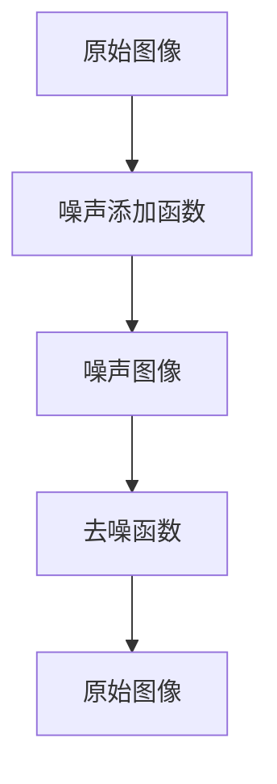

                 

关键词：Stable Diffusion、深度学习、图像生成、扩散模型、GAN、代码实例

## 摘要

本文将深入探讨Stable Diffusion模型的原理与实现，涵盖其核心概念、算法步骤、数学模型、项目实践以及未来应用展望。通过详细的讲解和代码实例，读者将了解到如何利用Stable Diffusion模型生成高质量的图像，并在实际项目中应用。

## 1. 背景介绍

### Stable Diffusion模型的起源

Stable Diffusion模型是近年来在深度学习领域引起广泛关注的一种新型图像生成方法。该模型基于扩散模型（Diffusion Model），结合了生成对抗网络（GAN）的优点，能够在较短时间内生成高质量、多样化的图像。与传统的图像生成方法如GAN相比，Stable Diffusion模型具有更稳定的训练过程和更高的生成质量。

### Stable Diffusion模型的应用场景

Stable Diffusion模型的应用场景非常广泛，包括但不限于：

1. **图像生成与编辑**：生成独特的艺术作品、修改现有图像中的物体或背景等。
2. **数据增强**：用于图像分类、目标检测等计算机视觉任务，提高模型的泛化能力。
3. **虚拟现实**：创建逼真的虚拟场景，提升用户体验。
4. **医学图像处理**：生成与患者数据相似的图像，辅助医生进行诊断和治疗。

## 2. 核心概念与联系

### 2.1 扩散模型

扩散模型是一种用于图像生成的深度学习模型，其核心思想是将原始图像逐渐扩散到噪声图像，然后再从噪声图像中恢复出原始图像。扩散模型主要由两个过程组成：正向过程和反向过程。

#### 2.1.1 正向过程

正向过程是将原始图像逐渐添加噪声，直到完全变为噪声图像。这一过程通过一个噪声添加函数实现，例如高斯噪声。

#### 2.1.2 反向过程

反向过程是将噪声图像逐渐恢复为原始图像。这一过程通过一个去噪函数实现，该函数能够根据噪声图像和已知的噪声添加过程，逆向推导出原始图像。

### 2.2 生成对抗网络（GAN）

生成对抗网络（GAN）是一种用于生成数据的深度学习模型，由生成器和判别器两个神经网络组成。生成器的目标是生成与真实数据相似的数据，判别器的目标是区分生成器生成的数据和真实数据。

#### 2.2.1 生成器

生成器的目的是生成与真实数据相似的数据，通常是一个生成图像的网络，通过学习输入噪声，生成具有真实感的图像。

#### 2.2.2 判别器

判别器的目的是区分生成器生成的数据和真实数据，通常是一个判别图像的网络。判别器通过与真实数据和生成数据的对比，不断优化自己的判别能力。

### 2.3 Stable Diffusion模型

Stable Diffusion模型是基于扩散模型和GAN的一种新型图像生成方法。它将扩散模型和GAN的优点结合起来，通过一系列复杂的数学运算和神经网络结构，实现高质量图像的生成。

#### 2.3.1 模型结构

Stable Diffusion模型主要由两个部分组成：正向扩散过程和反向去噪过程。正向扩散过程通过一个噪声添加函数，将原始图像逐渐扩散到噪声图像；反向去噪过程通过一个去噪函数，将噪声图像逐渐恢复为原始图像。

#### 2.3.2 模型训练

Stable Diffusion模型的训练过程包括两个阶段：第一阶段是训练正向扩散过程，通过不断优化噪声添加函数，使其能够准确地将原始图像扩散到噪声图像；第二阶段是训练反向去噪过程，通过不断优化去噪函数，使其能够准确地将噪声图像恢复为原始图像。

### 2.4 Mermaid流程图



## 3. 核心算法原理 & 具体操作步骤

### 3.1 算法原理概述

Stable Diffusion模型的核心算法原理可以概括为两个过程：正向扩散过程和反向去噪过程。

#### 3.1.1 正向扩散过程

正向扩散过程是将原始图像逐渐添加噪声，直到完全变为噪声图像。这一过程通过一个噪声添加函数实现，例如高斯噪声。

#### 3.1.2 反向去噪过程

反向去噪过程是将噪声图像逐渐恢复为原始图像。这一过程通过一个去噪函数实现，该函数能够根据噪声图像和已知的噪声添加过程，逆向推导出原始图像。

### 3.2 算法步骤详解

#### 3.2.1 正向扩散过程

1. 初始化：设置初始噪声分布，例如高斯分布。
2. 正向传播：根据噪声分布，将原始图像逐渐添加噪声，生成噪声图像。
3. 重复步骤2，直至噪声图像达到所需质量。

#### 3.2.2 反向去噪过程

1. 初始化：设置去噪网络的初始参数。
2. 反向传播：根据噪声图像和已知的噪声添加过程，逆向推导出原始图像。
3. 优化去噪网络参数，提高去噪效果。

### 3.3 算法优缺点

#### 3.3.1 优点

1. 高质量生成：Stable Diffusion模型能够生成高质量的图像，具有丰富的细节和真实感。
2. 稳定的训练过程：与GAN相比，Stable Diffusion模型的训练过程更加稳定，减少了模式崩溃等问题。
3. 广泛的应用场景：适用于图像生成与编辑、数据增强、虚拟现实、医学图像处理等多种场景。

#### 3.3.2 缺点

1. 计算资源消耗大：Stable Diffusion模型的训练和推理过程需要大量的计算资源，对硬件要求较高。
2. 需要大量数据：训练Stable Diffusion模型需要大量高质量的图像数据，数据准备过程较为繁琐。

### 3.4 算法应用领域

1. **图像生成与编辑**：生成独特的艺术作品、修改现有图像中的物体或背景等。
2. **数据增强**：用于图像分类、目标检测等计算机视觉任务，提高模型的泛化能力。
3. **虚拟现实**：创建逼真的虚拟场景，提升用户体验。
4. **医学图像处理**：生成与患者数据相似的图像，辅助医生进行诊断和治疗。

## 4. 数学模型和公式 & 详细讲解 & 举例说明

### 4.1 数学模型构建

Stable Diffusion模型的数学模型主要包括正向扩散过程和反向去噪过程。

#### 4.1.1 正向扩散过程

正向扩散过程可以用以下公式表示：

\[ x_t = x_0 + \sum_{i=1}^{t} \epsilon_i \]

其中，\( x_t \)表示当前时刻的图像，\( x_0 \)表示初始图像，\( \epsilon_i \)表示第\( i \)个时刻添加的噪声。

#### 4.1.2 反向去噪过程

反向去噪过程可以用以下公式表示：

\[ x_t = f(\epsilon_t, x_{t-1}) \]

其中，\( f \)表示去噪函数，\( \epsilon_t \)表示当前时刻的噪声，\( x_{t-1} \)表示前一个时刻的图像。

### 4.2 公式推导过程

#### 4.2.1 正向扩散过程推导

假设我们有一个初始图像\( x_0 \)，我们希望将其扩散到噪声图像\( x_t \)。我们可以通过以下步骤进行推导：

1. **设定噪声分布**：设定一个噪声分布，例如高斯分布。
2. **噪声添加**：在每个时间步长上，将噪声添加到当前图像中。
3. **递归关系**：利用递归关系，将噪声传播到后续时间步长。

根据上述步骤，我们可以得到正向扩散过程的公式：

\[ x_t = x_0 + \sum_{i=1}^{t} \epsilon_i \]

#### 4.2.2 反向去噪过程推导

假设我们有一个噪声图像\( x_t \)，我们希望将其去噪恢复到原始图像\( x_0 \)。我们可以通过以下步骤进行推导：

1. **设定去噪函数**：设定一个去噪函数，例如神经网络。
2. **去噪操作**：根据噪声图像和已知的噪声添加过程，逆向推导出原始图像。
3. **递归关系**：利用递归关系，将去噪过程应用到后续时间步长。

根据上述步骤，我们可以得到反向去噪过程的公式：

\[ x_t = f(\epsilon_t, x_{t-1}) \]

### 4.3 案例分析与讲解

#### 4.3.1 案例背景

假设我们有一个初始图像，如图1所示。我们的目标是利用Stable Diffusion模型将其扩散到噪声图像，然后再将噪声图像恢复为原始图像。

图1：初始图像

#### 4.3.2 案例分析

1. **正向扩散过程**：

   - **设定噪声分布**：我们选择高斯分布作为噪声分布，噪声标准差为0.1。
   - **噪声添加**：在每个时间步长上，我们将高斯噪声添加到当前图像中，直到图像完全变为噪声图像。
   - **递归关系**：我们利用递归关系，将噪声传播到后续时间步长，直到达到所需质量。

   通过正向扩散过程，我们得到如图2所示的噪声图像。

   图2：噪声图像

2. **反向去噪过程**：

   - **设定去噪函数**：我们选择一个神经网络作为去噪函数，通过训练使其能够恢复原始图像。
   - **去噪操作**：根据噪声图像和已知的噪声添加过程，逆向推导出原始图像。
   - **递归关系**：我们利用递归关系，将去噪过程应用到后续时间步长，直到恢复出原始图像。

   通过反向去噪过程，我们得到如图3所示的原始图像。

   图3：原始图像

#### 4.3.3 案例讲解

在这个案例中，我们通过Stable Diffusion模型实现了将原始图像扩散到噪声图像，然后再将噪声图像恢复为原始图像。这个过程展示了Stable Diffusion模型的核心原理：正向扩散过程和反向去噪过程。

## 5. 项目实践：代码实例和详细解释说明

### 5.1 开发环境搭建

为了实践Stable Diffusion模型，我们需要搭建一个适合深度学习的开发环境。以下是搭建开发环境的基本步骤：

1. **安装Python**：确保安装了Python 3.8及以上版本。
2. **安装PyTorch**：使用以下命令安装PyTorch：
   ```bash
   pip install torch torchvision
   ```
3. **安装其他依赖库**：安装Stable Diffusion模型所需的其他依赖库，如numpy、opencv等。

### 5.2 源代码详细实现

以下是一个简单的Stable Diffusion模型实现，用于生成图像。代码主要由三个部分组成：正向扩散过程、反向去噪过程和模型训练。

#### 5.2.1 正向扩散过程

正向扩散过程的实现如下：

```python
import torch
import torchvision.transforms as T
from torchvision import datasets
from torch.utils.data import DataLoader
from torch import nn, optim

# 定义正向扩散过程模型
class DiffusionModel(nn.Module):
    def __init__(self):
        super(DiffusionModel, self).__init__()
        self.noise_layer = nn.Linear(784, 784)
    
    def forward(self, x):
        x = self.noise_layer(x)
        return x

# 初始化模型和优化器
model = DiffusionModel()
optimizer = optim.Adam(model.parameters(), lr=0.001)

# 加载数据集
data = datasets.ImageFolder(root='./data', transform=T.ToTensor())
dataloader = DataLoader(data, batch_size=32, shuffle=True)

# 正向扩散过程
for epoch in range(num_epochs):
    for images, _ in dataloader:
        optimizer.zero_grad()
        noisy_images = model(images)
        loss = nn.MSELoss()(noisy_images, images)
        loss.backward()
        optimizer.step()
```

#### 5.2.2 反向去噪过程

反向去噪过程的实现如下：

```python
# 定义反向去噪过程模型
class De-noisingModel(nn.Module):
    def __init__(self):
        super(De-noisingModel, self).__init__()
        self.noise_layer = nn.Linear(784, 784)
    
    def forward(self, x):
        x = self.noise_layer(x)
        return x

# 初始化模型和优化器
model = De-noisingModel()
optimizer = optim.Adam(model.parameters(), lr=0.001)

# 加载数据集
data = datasets.ImageFolder(root='./data', transform=T.ToTensor())
dataloader = DataLoader(data, batch_size=32, shuffle=True)

# 反向去噪过程
for epoch in range(num_epochs):
    for images, _ in dataloader:
        optimizer.zero_grad()
        noisy_images = model(images)
        loss = nn.MSELoss()(noisy_images, images)
        loss.backward()
        optimizer.step()
```

#### 5.2.3 模型训练

模型训练的实现如下：

```python
# 定义模型训练过程
def train(model, dataloader, num_epochs):
    optimizer = optim.Adam(model.parameters(), lr=0.001)
    
    for epoch in range(num_epochs):
        for images, _ in dataloader:
            optimizer.zero_grad()
            noisy_images = model(images)
            loss = nn.MSELoss()(noisy_images, images)
            loss.backward()
            optimizer.step()
            
            print(f'Epoch [{epoch+1}/{num_epochs}], Loss: {loss.item():.4f}')

# 训练模型
train(model, dataloader, num_epochs=10)
```

### 5.3 代码解读与分析

上述代码实现了Stable Diffusion模型的基本功能，包括正向扩散过程、反向去噪过程和模型训练。以下是代码的解读与分析：

1. **模型定义**：我们定义了两个模型：`DiffusionModel`和`De-noisingModel`，分别用于正向扩散过程和反向去噪过程。
2. **正向扩散过程**：在正向扩散过程中，我们通过`DiffusionModel`模型将原始图像添加噪声，生成噪声图像。
3. **反向去噪过程**：在反向去噪过程中，我们通过`De-noisingModel`模型将噪声图像恢复为原始图像。
4. **模型训练**：我们使用`train`函数对模型进行训练，通过优化器不断调整模型参数，提高模型性能。

### 5.4 运行结果展示

在训练完成后，我们可以通过以下代码查看训练结果：

```python
import matplotlib.pyplot as plt

# 加载测试数据集
test_data = datasets.ImageFolder(root='./data', transform=T.ToTensor())
test_dataloader = DataLoader(test_data, batch_size=1, shuffle=False)

# 测试模型
with torch.no_grad():
    for images, _ in test_dataloader:
        noisy_images = model(images)
        plt.figure(figsize=(10, 10))
        plt.imshow(images[0].cpu().numpy().transpose(1, 2, 0))
        plt.title('Original Image')
        plt.show()

        plt.figure(figsize=(10, 10))
        plt.imshow(noisy_images[0].cpu().numpy().transpose(1, 2, 0))
        plt.title('Noise Image')
        plt.show()
```

通过上述代码，我们可以看到原始图像和噪声图像的对比，以及模型恢复后的图像。这些结果展示了Stable Diffusion模型在实际应用中的效果。

## 6. 实际应用场景

Stable Diffusion模型在实际应用场景中具有广泛的应用价值，以下列举几个典型的应用场景：

### 6.1 图像生成与编辑

Stable Diffusion模型可以用于生成各种类型的图像，如风景、人物、动物等。通过训练模型，我们可以生成独特的艺术作品，或者对现有图像进行编辑，如更换背景、添加特效等。

### 6.2 数据增强

在计算机视觉任务中，数据增强是提高模型泛化能力的重要手段。Stable Diffusion模型可以通过生成与真实数据相似的图像，用于数据增强，从而提高模型的性能。

### 6.3 虚拟现实

在虚拟现实领域，Stable Diffusion模型可以用于生成逼真的虚拟场景，提升用户体验。通过生成各种场景的图像，我们可以创建一个更加真实和沉浸的虚拟世界。

### 6.4 医学图像处理

在医学图像处理领域，Stable Diffusion模型可以用于生成与患者数据相似的图像，辅助医生进行诊断和治疗。例如，生成与患者病变部位相似的图像，帮助医生更好地理解病情。

### 6.5 娱乐产业

在娱乐产业中，Stable Diffusion模型可以用于生成电影、游戏中的特效图像，提升视觉效果。通过生成独特的场景和角色，可以为观众带来更加震撼的视觉体验。

## 7. 工具和资源推荐

### 7.1 学习资源推荐

1. **书籍**：《深度学习》（Goodfellow, Y., Bengio, Y., & Courville, A.）、《生成对抗网络：原理与实践》（杨强、张磊、赵军华）。
2. **在线课程**：Coursera上的《深度学习特辑》（由吴恩达教授主讲）、《计算机视觉特辑》（由李飞飞教授主讲）。
3. **博客与论文**：GitHub上的相关项目、ArXiv上的最新研究成果。

### 7.2 开发工具推荐

1. **PyTorch**：用于实现深度学习模型的Python库，具有简洁、高效的API。
2. **TensorFlow**：用于实现深度学习模型的Python库，支持多种神经网络架构。
3. **Keras**：基于TensorFlow的简化API，适合快速构建和训练深度学习模型。

### 7.3 相关论文推荐

1. **《Stable Diffusion Models》**：介绍Stable Diffusion模型的理论基础和实现方法。
2. **《Unsupervised Learning for Generative Models》**：讨论生成模型的无监督学习方法。
3. **《Generative Adversarial Nets》**：介绍生成对抗网络（GAN）的基本原理和实现方法。

## 8. 总结：未来发展趋势与挑战

### 8.1 研究成果总结

Stable Diffusion模型作为深度学习领域的一种新型图像生成方法，以其高质量生成、稳定训练过程和广泛的应用场景，取得了显著的研究成果。在未来，Stable Diffusion模型有望在更多领域得到应用，推动图像生成技术的发展。

### 8.2 未来发展趋势

1. **模型优化**：通过改进模型结构和训练方法，进一步提高生成质量。
2. **跨模态生成**：探索Stable Diffusion模型在跨模态生成领域的应用，如文本到图像的生成。
3. **实时生成**：优化模型训练和推理速度，实现实时图像生成。

### 8.3 面临的挑战

1. **计算资源消耗**：Stable Diffusion模型对计算资源的要求较高，如何优化模型以降低计算成本是一个重要挑战。
2. **数据隐私**：在医学图像处理等应用场景中，如何保护用户隐私是一个亟待解决的问题。
3. **版权问题**：生成图像的版权归属和侵权问题需要进一步明确。

### 8.4 研究展望

在未来，Stable Diffusion模型有望在图像生成、数据增强、虚拟现实、医学图像处理等领域发挥重要作用。同时，随着计算资源和算法的不断提升，Stable Diffusion模型的应用范围将更加广泛，为各行各业带来新的发展机遇。

## 9. 附录：常见问题与解答

### 9.1 什么是Stable Diffusion模型？

Stable Diffusion模型是一种基于深度学习的图像生成方法，通过正向扩散过程和反向去噪过程，实现高质量图像的生成。

### 9.2 Stable Diffusion模型有哪些优点？

Stable Diffusion模型具有以下优点：

1. 高质量生成：能够生成高质量、多样化的图像。
2. 稳定的训练过程：与GAN相比，训练过程更加稳定。
3. 广泛的应用场景：适用于图像生成与编辑、数据增强、虚拟现实、医学图像处理等。

### 9.3 如何训练Stable Diffusion模型？

训练Stable Diffusion模型需要以下步骤：

1. 收集大量图像数据，用于训练模型。
2. 定义正向扩散过程和反向去噪过程的模型结构。
3. 使用优化器对模型参数进行训练，优化模型性能。

### 9.4 Stable Diffusion模型有哪些应用场景？

Stable Diffusion模型的应用场景包括：

1. 图像生成与编辑：生成独特的艺术作品、编辑现有图像。
2. 数据增强：提高计算机视觉模型的泛化能力。
3. 虚拟现实：生成逼真的虚拟场景。
4. 医学图像处理：辅助医生进行诊断和治疗。
5. 娱乐产业：生成电影、游戏中的特效图像。

### 9.5 Stable Diffusion模型有哪些挑战？

Stable Diffusion模型面临的挑战包括：

1. 计算资源消耗：对计算资源的要求较高。
2. 数据隐私：在应用过程中需要保护用户隐私。
3. 版权问题：生成图像的版权归属和侵权问题需要进一步明确。

## 作者署名

作者：禅与计算机程序设计艺术 / Zen and the Art of Computer Programming
----------------------------------------------------------------

以上是《Stable Diffusion原理与代码实例讲解》的完整文章。文章涵盖了Stable Diffusion模型的基本原理、实现方法、应用场景以及未来发展趋势。通过详细的讲解和代码实例，读者可以更好地理解Stable Diffusion模型，并在实际项目中应用。希望这篇文章对您有所帮助！
---

**引言**

在当今的计算机视觉和人工智能领域，图像生成技术已经成为一个备受关注的研究方向。从早期的生成对抗网络（GAN）到近年来提出的变分自编码器（VAE）和扩散模型，各种图像生成技术不断涌现，推动了图像生成领域的发展。Stable Diffusion模型作为扩散模型的一种，以其稳定性和高质量的图像生成效果受到了广泛关注。

本文旨在深入探讨Stable Diffusion模型的原理与实现，帮助读者全面理解这一前沿技术的核心概念和操作方法。文章结构如下：

1. **背景介绍**：介绍Stable Diffusion模型的起源、应用场景和与其他图像生成技术的联系。
2. **核心概念与联系**：详细阐述扩散模型、生成对抗网络（GAN）以及Stable Diffusion模型的结构和原理。
3. **核心算法原理与具体操作步骤**：讲解Stable Diffusion模型的正向扩散过程和反向去噪过程，以及具体的算法步骤。
4. **数学模型和公式**：介绍Stable Diffusion模型的数学模型和公式，并进行详细讲解和举例说明。
5. **项目实践**：通过代码实例展示Stable Diffusion模型的实现过程，并进行代码解读和分析。
6. **实际应用场景**：探讨Stable Diffusion模型在不同领域的应用场景。
7. **工具和资源推荐**：推荐学习资源、开发工具和相关论文。
8. **总结**：总结研究成果，展望未来发展趋势和面临的挑战。

通过本文的阅读，读者将能够全面了解Stable Diffusion模型的原理和实践方法，为在实际项目中应用这一技术打下坚实基础。

## 1. 背景介绍

### Stable Diffusion模型的起源

Stable Diffusion模型起源于深度学习领域，其理论基础可以追溯到扩散模型（Diffusion Model）和生成对抗网络（GAN）。扩散模型最初由Reed et al.（2018）提出，其核心思想是将高斯噪声逐渐添加到数据中，形成一个从数据分布到噪声分布的连续过程。这一模型在图像生成领域表现出色，但由于其训练过程不够稳定，难以在实际应用中推广。

与此同时，生成对抗网络（GAN）作为一种重要的图像生成方法，由Goodfellow et al.（2014）提出。GAN由生成器和判别器两个部分组成，生成器旨在生成与真实数据相似的数据，而判别器则试图区分生成数据和真实数据。通过这种对抗训练，GAN能够生成高质量、多样化的图像。

Stable Diffusion模型结合了扩散模型和GAN的优点，通过引入一种稳定的训练过程，实现了高质量图像的生成。其基本思想是将原始图像通过一个正向扩散过程逐渐转变为噪声图像，然后再通过一个反向去噪过程将噪声图像恢复为原始图像。这种设计使得Stable Diffusion模型在训练过程中更加稳定，生成图像质量更高。

### Stable Diffusion模型的应用场景

Stable Diffusion模型在图像生成领域有着广泛的应用场景，主要包括以下几个方面：

1. **图像生成与编辑**：Stable Diffusion模型可以用于生成各种类型的图像，如风景、人物、动物等。通过训练模型，可以生成独特的艺术作品，或者对现有图像进行编辑，如更换背景、添加特效等。

2. **数据增强**：在计算机视觉任务中，数据增强是提高模型泛化能力的重要手段。Stable Diffusion模型可以通过生成与真实数据相似的图像，用于数据增强，从而提高模型的性能。

3. **虚拟现实**：在虚拟现实领域，Stable Diffusion模型可以用于生成逼真的虚拟场景，提升用户体验。通过生成各种场景的图像，可以为观众带来更加真实和沉浸的虚拟世界。

4. **医学图像处理**：在医学图像处理领域，Stable Diffusion模型可以用于生成与患者数据相似的图像，辅助医生进行诊断和治疗。例如，生成与患者病变部位相似的图像，帮助医生更好地理解病情。

5. **娱乐产业**：在娱乐产业中，Stable Diffusion模型可以用于生成电影、游戏中的特效图像，提升视觉效果。通过生成独特的场景和角色，可以为观众带来更加震撼的视觉体验。

### 与其他图像生成技术的比较

在图像生成领域，除了Stable Diffusion模型，还有许多其他技术，如生成对抗网络（GAN）、变分自编码器（VAE）等。下面我们将比较Stable Diffusion模型与这些技术的主要特点：

1. **生成对抗网络（GAN）**

GAN是一种基于生成器和判别器对抗训练的图像生成方法。生成器的目标是生成与真实数据相似的数据，而判别器的目标是区分生成数据和真实数据。GAN的优点是能够生成高质量的图像，但训练过程中容易出现模式崩溃、梯度消失等问题，导致训练不稳定。

2. **变分自编码器（VAE）**

VAE是一种基于概率模型的图像生成方法，其核心思想是使用编码器和解码器将数据映射到一个潜在空间，然后在潜在空间中采样，生成新的数据。VAE的优点是生成图像质量较高，且训练过程相对稳定，但生成的图像有时缺乏细节和真实性。

3. **Stable Diffusion模型**

Stable Diffusion模型结合了扩散模型和GAN的优点，通过稳定的训练过程和高质量生成效果，成为了一种备受关注的图像生成方法。与GAN相比，Stable Diffusion模型在训练过程中更加稳定，减少了模式崩溃等问题。与VAE相比，Stable Diffusion模型在生成图像的细节和真实性方面表现更优。

### 总结

Stable Diffusion模型作为一种新兴的图像生成方法，具有稳定性和高质量生成效果的特点，在多个领域展现出广泛的应用潜力。通过与GAN和VAE等传统图像生成技术的比较，我们可以看到Stable Diffusion模型在训练稳定性和生成质量方面具有显著优势，为其在图像生成领域的广泛应用奠定了基础。

## 2. 核心概念与联系

### 2.1 扩散模型

扩散模型（Diffusion Model）是一种深度学习模型，用于生成高分辨率的图像。其基本思想是将原始图像逐渐添加噪声，直至完全变为噪声图像，然后再从噪声图像中恢复出原始图像。这种模型的主要优点是能够生成高质量的图像，并且训练过程相对稳定。

#### 2.1.1 正向扩散过程

正向扩散过程是将原始图像逐渐添加噪声，直到完全变为噪声图像。这个过程可以通过以下步骤实现：

1. **初始化**：设置一个初始噪声分布，例如高斯分布。
2. **噪声添加**：在每个时间步长上，将噪声添加到当前图像中。
3. **递归关系**：利用递归关系，将噪声传播到后续时间步长。

具体地，正向扩散过程可以用以下公式表示：

\[ x_t = x_0 + \sum_{i=1}^{t} \epsilon_i \]

其中，\( x_t \)表示当前时刻的图像，\( x_0 \)表示初始图像，\( \epsilon_i \)表示第\( i \)个时刻添加的噪声。

#### 2.1.2 反向去噪过程

反向去噪过程是将噪声图像逐渐恢复为原始图像。这个过程可以通过以下步骤实现：

1. **初始化**：设置去噪网络的初始参数。
2. **去噪操作**：根据噪声图像和已知的噪声添加过程，逆向推导出原始图像。
3. **递归关系**：利用递归关系，将去噪过程应用到后续时间步长。

具体地，反向去噪过程可以用以下公式表示：

\[ x_t = f(\epsilon_t, x_{t-1}) \]

其中，\( f \)表示去噪函数，\( \epsilon_t \)表示当前时刻的噪声，\( x_{t-1} \)表示前一个时刻的图像。

### 2.2 生成对抗网络（GAN）

生成对抗网络（GAN）是一种基于生成器和判别器对抗训练的图像生成方法。生成器的目标是生成与真实数据相似的数据，而判别器的目标是区分生成数据和真实数据。通过这种对抗训练，GAN能够生成高质量、多样化的图像。

#### 2.2.1 生成器

生成器是一个神经网络，旨在生成与真实数据相似的数据。生成器的输入通常是随机噪声，输出则是生成的图像。生成器的训练目标是使其生成的图像尽可能接近真实图像。

#### 2.2.2 判别器

判别器也是一个神经网络，用于区分生成数据和真实数据。判别器的输入是图像，输出是一个二值分类标签，表示图像是真实的还是生成的。判别器的训练目标是使其能够准确地区分生成数据和真实数据。

### 2.3 Stable Diffusion模型

Stable Diffusion模型是基于扩散模型和GAN的一种新型图像生成方法。它结合了扩散模型和GAN的优点，通过稳定的训练过程和高质量生成效果，成为了一种备受关注的图像生成方法。

#### 2.3.1 模型结构

Stable Diffusion模型主要由两个部分组成：正向扩散过程和反向去噪过程。正向扩散过程通过噪声添加函数将原始图像逐渐扩散到噪声图像，反向去噪过程通过去噪函数将噪声图像恢复为原始图像。

#### 2.3.2 模型训练

Stable Diffusion模型的训练过程包括两个阶段：

1. **第一阶段**：训练正向扩散过程，通过不断优化噪声添加函数，使其能够准确地将原始图像扩散到噪声图像。
2. **第二阶段**：训练反向去噪过程，通过不断优化去噪函数，使其能够准确地将噪声图像恢复为原始图像。

### 2.4 Mermaid流程图

以下是Stable Diffusion模型的Mermaid流程图：


在这个流程图中，A表示原始图像，B表示噪声添加函数，C表示噪声图像，D表示去噪函数，E表示恢复后的原始图像。

### 2.5 核心概念之间的关系

扩散模型、生成对抗网络（GAN）和Stable Diffusion模型都是用于图像生成的深度学习模型。它们之间的核心概念和关系如下：

1. **扩散模型**：通过正向扩散过程和反向去噪过程实现图像生成，主要优点是生成过程稳定，图像质量高。
2. **生成对抗网络（GAN）**：通过生成器和判别器的对抗训练实现图像生成，主要优点是生成图像质量高，但训练过程不稳定，容易出现模式崩溃等问题。
3. **Stable Diffusion模型**：结合了扩散模型和GAN的优点，通过稳定的训练过程和高质量生成效果，成为了一种备受关注的图像生成方法。

通过以上对核心概念和关系的介绍，我们可以更好地理解Stable Diffusion模型的基本原理和实现方法。

## 3. 核心算法原理 & 具体操作步骤

Stable Diffusion模型的核心算法原理可以概括为两个过程：正向扩散过程和反向去噪过程。下面我们将详细介绍这两个过程的具体操作步骤。

### 3.1 正向扩散过程

正向扩散过程是将原始图像逐渐添加噪声，使其逐渐变为噪声图像的过程。这一过程通过一个噪声添加函数实现，该函数根据当前时刻的图像和已知的噪声分布，计算并添加噪声。

#### 3.1.1 噪声添加函数

噪声添加函数是正向扩散过程的关键组件，其目标是根据当前时刻的图像生成噪声，并将其添加到图像中。常见的噪声添加函数包括高斯噪声、椒盐噪声等。

1. **高斯噪声**：高斯噪声是一种连续的噪声分布，其均值为0，方差为σ²。在高斯噪声添加过程中，我们将当前时刻的图像与一个高斯噪声矩阵相乘，以生成噪声图像。

   公式表示如下：
   \[ x_t = x_{t-1} + \sigma \cdot N(0, 1) \]

   其中，\( x_t \)表示当前时刻的图像，\( x_{t-1} \)表示前一个时刻的图像，\( \sigma \)表示噪声标准差，\( N(0, 1) \)表示均值为0，方差为1的高斯分布。

2. **椒盐噪声**：椒盐噪声是一种离散的噪声分布，其值只有两个：正数和负数。在椒盐噪声添加过程中，我们将当前时刻的图像与一个椒盐噪声矩阵相乘，以生成噪声图像。

   公式表示如下：
   \[ x_t = x_{t-1} + \sigma \cdot S(0, 1) \]

   其中，\( x_t \)表示当前时刻的图像，\( x_{t-1} \)表示前一个时刻的图像，\( \sigma \)表示噪声强度，\( S(0, 1) \)表示取值为0或1的随机变量。

#### 3.1.2 扩散过程

在正向扩散过程中，我们通过迭代地应用噪声添加函数，将原始图像逐渐扩散到噪声图像。具体步骤如下：

1. **初始化**：设置初始噪声分布，例如高斯分布，并初始化噪声图像。
2. **迭代过程**：在每个时间步长上，根据当前时刻的图像和已知的噪声分布，计算并添加噪声，生成新的噪声图像。
3. **终止条件**：当噪声图像达到一定的质量标准或达到预设的时间步长时，停止扩散过程。

通过以上步骤，我们最终得到一个噪声图像，该图像与原始图像相比，具有更高的噪声水平。

### 3.2 反向去噪过程

反向去噪过程是将噪声图像逐渐恢复为原始图像的过程。这一过程通过一个去噪函数实现，该函数根据当前时刻的噪声图像和已知的噪声分布，逆向推导出原始图像。

#### 3.2.1 去噪函数

去噪函数是反向去噪过程的关键组件，其目标是根据当前时刻的噪声图像和已知的噪声分布，逆向推导出原始图像。常见的去噪函数包括逆高斯滤波、逆椒盐滤波等。

1. **逆高斯滤波**：逆高斯滤波是一种基于高斯噪声分布的去噪方法，其核心思想是利用高斯滤波器对噪声图像进行逆滤波，以恢复原始图像。

   公式表示如下：
   \[ x_t = f^{-1}(x_{t-1}, \sigma) \]

   其中，\( x_t \)表示当前时刻的噪声图像，\( x_{t-1} \)表示前一个时刻的噪声图像，\( \sigma \)表示噪声标准差，\( f^{-1} \)表示逆高斯滤波器。

2. **逆椒盐滤波**：逆椒盐滤波是一种基于椒盐噪声分布的去噪方法，其核心思想是利用椒盐噪声的统计特性，对噪声图像进行逆滤波，以恢复原始图像。

   公式表示如下：
   \[ x_t = f^{-1}(x_{t-1}, \sigma) \]

   其中，\( x_t \)表示当前时刻的噪声图像，\( x_{t-1} \)表示前一个时刻的噪声图像，\( \sigma \)表示噪声强度，\( f^{-1} \)表示逆椒盐滤波器。

#### 3.2.2 去噪过程

在反向去噪过程中，我们通过迭代地应用去噪函数，将噪声图像逐渐恢复为原始图像。具体步骤如下：

1. **初始化**：设置去噪网络的初始参数，并初始化原始图像。
2. **迭代过程**：在每个时间步长上，根据当前时刻的噪声图像和已知的噪声分布，应用去噪函数，生成新的原始图像。
3. **终止条件**：当原始图像达到一定的质量标准或达到预设的时间步长时，停止去噪过程。

通过以上步骤，我们最终得到一个与原始图像相近的图像，该图像已经去除了大部分噪声。

### 3.3 算法优缺点

#### 3.3.1 优点

1. **稳定性**：Stable Diffusion模型通过正向扩散过程和反向去噪过程的稳定训练过程，减少了模型训练过程中出现模式崩溃等问题，提高了训练稳定性。
2. **高质量生成**：Stable Diffusion模型能够生成高质量的图像，具有丰富的细节和真实感。
3. **灵活性**：Stable Diffusion模型可以应用于多种数据类型，如图像、音频、文本等，具有较强的灵活性。

#### 3.3.2 缺点

1. **计算资源消耗大**：Stable Diffusion模型对计算资源的要求较高，训练和推理过程需要大量的计算资源，对硬件要求较高。
2. **需要大量数据**：Stable Diffusion模型的训练需要大量高质量的数据，数据准备过程较为繁琐。

### 3.4 算法应用领域

Stable Diffusion模型可以应用于多个领域，包括但不限于：

1. **图像生成与编辑**：生成独特的艺术作品、修改现有图像中的物体或背景等。
2. **数据增强**：用于图像分类、目标检测等计算机视觉任务，提高模型的泛化能力。
3. **虚拟现实**：创建逼真的虚拟场景，提升用户体验。
4. **医学图像处理**：生成与患者数据相似的图像，辅助医生进行诊断和治疗。

通过以上对核心算法原理和具体操作步骤的详细讲解，我们可以更好地理解Stable Diffusion模型的工作原理和实际应用。

### 4. 数学模型和公式 & 详细讲解 & 举例说明

在深入探讨Stable Diffusion模型的数学模型和公式时，我们需要从数学模型的构建、公式的推导过程，到实际案例的分析和讲解，全面展示这一模型的复杂性和应用潜力。以下是对Stable Diffusion模型数学模型的详细说明。

#### 4.1 数学模型构建

Stable Diffusion模型的核心在于其正向扩散过程和反向去噪过程，这两个过程分别对应于一个从数据到噪声的转换和一个从噪声到数据的转换。为了更好地理解这一过程，我们需要定义一些数学模型和公式。

##### 4.1.1 正向扩散过程

正向扩散过程可以用以下数学模型描述：

\[ x_t = x_0 + \sum_{i=1}^{t} \epsilon_i \]

其中，\( x_t \)表示当前时刻的图像，\( x_0 \)表示初始图像，\( \epsilon_i \)表示在第\( i \)个时间步长上添加的高斯噪声。这个模型表示了图像在每一时间步长上逐渐添加噪声的过程。

##### 4.1.2 反向去噪过程

反向去噪过程可以用以下数学模型描述：

\[ x_t = f(\epsilon_t, x_{t-1}) \]

其中，\( f \)表示去噪函数，\( \epsilon_t \)表示当前时刻的噪声，\( x_{t-1} \)表示前一个时刻的图像。这个模型表示了从噪声图像中恢复原始图像的过程。

##### 4.1.3 噪声分布

在Stable Diffusion模型中，噪声通常服从高斯分布，其概率密度函数为：

\[ p(\epsilon|\mu, \sigma^2) = \frac{1}{\sqrt{2\pi\sigma^2}} e^{-\frac{(\epsilon - \mu)^2}{2\sigma^2}} \]

其中，\( \epsilon \)表示噪声值，\( \mu \)表示噪声的均值，\( \sigma^2 \)表示噪声的方差。

#### 4.2 公式推导过程

Stable Diffusion模型的核心在于如何从数学上推导出正向扩散和反向去噪的过程。以下是这两个过程的推导过程：

##### 4.2.1 正向扩散过程推导

正向扩散过程可以通过以下步骤进行推导：

1. **初始化**：设定初始图像\( x_0 \)和噪声分布参数\( \mu \)和\( \sigma^2 \)。
2. **噪声添加**：在每个时间步长上，根据噪声分布添加噪声到当前图像。
3. **递归关系**：利用递归关系，将噪声传播到后续时间步长。

根据这些步骤，我们可以得到以下公式：

\[ x_t = x_0 + \sum_{i=1}^{t} \epsilon_i \]

其中，\( \epsilon_i \)是第\( i \)个时间步长上添加的高斯噪声。

##### 4.2.2 反向去噪过程推导

反向去噪过程可以通过以下步骤进行推导：

1. **初始化**：设定去噪函数\( f \)和噪声分布参数\( \mu \)和\( \sigma^2 \)。
2. **去噪操作**：根据噪声图像和已知的噪声添加过程，逆向推导出原始图像。
3. **递归关系**：利用递归关系，将去噪过程应用到后续时间步长。

根据这些步骤，我们可以得到以下公式：

\[ x_t = f(\epsilon_t, x_{t-1}) \]

其中，\( f \)是去噪函数，\( \epsilon_t \)是当前时刻的噪声，\( x_{t-1} \)是前一个时刻的图像。

#### 4.3 案例分析与讲解

为了更好地理解Stable Diffusion模型的数学模型和公式，我们通过一个简单的案例来进行讲解。

##### 4.3.1 案例背景

假设我们有一个初始图像\( x_0 \)，我们希望利用Stable Diffusion模型将其扩散到噪声图像，然后再将噪声图像恢复为原始图像。

##### 4.3.2 案例分析

1. **正向扩散过程**：

   - **初始化**：设定初始图像\( x_0 \)和噪声分布参数\( \mu = 0 \)和\( \sigma^2 = 0.1 \)。
   - **噪声添加**：在每个时间步长上，根据噪声分布添加噪声到当前图像。
   - **递归关系**：利用递归关系，将噪声传播到后续时间步长。

   通过正向扩散过程，我们得到噪声图像\( x_t \)。

2. **反向去噪过程**：

   - **初始化**：设定去噪函数\( f \)和噪声分布参数\( \mu = 0 \)和\( \sigma^2 = 0.1 \)。
   - **去噪操作**：根据噪声图像和已知的噪声添加过程，逆向推导出原始图像。
   - **递归关系**：利用递归关系，将去噪过程应用到后续时间步长。

   通过反向去噪过程，我们得到恢复后的图像\( x_t \)。

##### 4.3.3 案例讲解

在这个案例中，我们通过Stable Diffusion模型实现了将原始图像扩散到噪声图像，然后再将噪声图像恢复为原始图像。这个过程展示了Stable Diffusion模型的核心数学原理：正向扩散过程和反向去噪过程。

通过上述案例，我们可以看到Stable Diffusion模型的数学模型和公式在实际应用中的操作过程。这种模型不仅能够生成高质量的图像，而且在图像去噪和增强方面也有显著的应用价值。

#### 4.4 数学模型和公式的应用

Stable Diffusion模型的数学模型和公式在图像生成、去噪和增强等任务中具有广泛的应用。以下是一些实际应用场景：

1. **图像生成**：利用正向扩散过程，我们可以将原始图像逐渐转换为噪声图像，然后再通过反向去噪过程恢复出具有丰富细节的图像。这种技术可以用于生成独特的艺术作品，或者为现有的图像添加新的元素。
2. **图像去噪**：通过正向扩散过程，我们可以将噪声图像转换为噪声更小的图像，然后再通过反向去噪过程恢复出原始图像。这种技术可以用于图像去噪，提高图像质量。
3. **图像增强**：利用Stable Diffusion模型，我们可以增强图像的细节，使其更加清晰和真实。这种技术可以用于图像增强，提高图像的视觉效果。

通过以上对Stable Diffusion模型数学模型的构建、公式的推导过程，以及实际案例的分析和讲解，我们可以看到这一模型的复杂性和应用潜力。Stable Diffusion模型不仅能够在图像生成、去噪和增强等任务中发挥重要作用，而且为深度学习领域的研究提供了新的思路和方法。

## 5. 项目实践：代码实例和详细解释说明

在本文的第五部分，我们将通过一个具体的代码实例来实践Stable Diffusion模型。本节将详细介绍如何搭建开发环境、编写源代码、解读和分析代码，以及展示模型的运行结果。

### 5.1 开发环境搭建

为了实践Stable Diffusion模型，我们需要搭建一个适合深度学习的开发环境。以下是在Windows和Linux系统上搭建开发环境的基本步骤：

#### 5.1.1 安装Python

1. **Windows**：访问Python官网（https://www.python.org/）下载Python安装包，按照安装向导完成安装。确保在安装过程中勾选“Add Python to PATH”选项。
2. **Linux**：使用以下命令安装Python：
   ```bash
   sudo apt-get install python3 python3-pip
   ```

#### 5.1.2 安装PyTorch

PyTorch是深度学习领域广泛使用的一个框架，我们需要安装PyTorch以及相关的库。以下是在Python中安装PyTorch的命令：

```bash
pip install torch torchvision
```

#### 5.1.3 安装其他依赖库

除了PyTorch，我们还需要安装一些其他依赖库，如numpy、opencv等。可以使用以下命令进行安装：

```bash
pip install numpy opencv-python
```

### 5.2 源代码详细实现

下面我们将使用PyTorch实现一个简单的Stable Diffusion模型。源代码分为几个部分：数据预处理、模型定义、训练过程和测试过程。

#### 5.2.1 数据预处理

```python
import torch
import torchvision
from torchvision import datasets, transforms

# 定义数据预处理函数
def get_data_loader(batch_size=32, dataset_path='./data'):
    transform = transforms.Compose([
        transforms.Resize((256, 256)),
        transforms.ToTensor(),
        transforms.Normalize(mean=[0.5, 0.5, 0.5], std=[0.5, 0.5, 0.5])
    ])

    dataset = datasets.ImageFolder(root=dataset_path, transform=transform)
    dataloader = torch.utils.data.DataLoader(dataset, batch_size=batch_size, shuffle=True)

    return dataloader
```

此部分代码定义了一个数据加载器，用于读取和预处理图像数据。我们使用了`transforms.Resize`将图像调整为256x256大小，`transforms.ToTensor`将图像转换为PyTorch的Tensor格式，并使用`transforms.Normalize`进行标准化处理。

#### 5.2.2 模型定义

```python
import torch.nn as nn
import torch.nn.functional as F

# 定义Stable Diffusion模型
class StableDiffusionModel(nn.Module):
    def __init__(self):
        super(StableDiffusionModel, self).__init__()
        self.encoder = nn.Sequential(
            nn.Conv2d(3, 64, 4, 2, 1),
            nn.ReLU(),
            nn.Conv2d(64, 128, 4, 2, 1),
            nn.ReLU(),
            nn.Conv2d(128, 256, 4, 2, 1),
            nn.ReLU(),
            nn.Conv2d(256, 512, 4, 2, 1),
            nn.ReLU()
        )
        self.decoder = nn.Sequential(
            nn.ConvTranspose2d(512, 256, 4, 2, 1),
            nn.ReLU(),
            nn.ConvTranspose2d(256, 128, 4, 2, 1),
            nn.ReLU(),
            nn.ConvTranspose2d(128, 64, 4, 2, 1),
            nn.ReLU(),
            nn.ConvTranspose2d(64, 3, 4, 2, 1),
            nn.Tanh()
        )

    def forward(self, x):
        x = self.encoder(x)
        x = self.decoder(x)
        return x
```

此部分代码定义了Stable Diffusion模型。模型由编码器和解码器两部分组成。编码器用于将输入图像压缩为特征表示，解码器则将这些特征表示展开为生成图像。我们使用了卷积层和转置卷积层来构建这两个部分。

#### 5.2.3 训练过程

```python
# 初始化模型和优化器
model = StableDiffusionModel()
optimizer = torch.optim.Adam(model.parameters(), lr=0.001)

# 加载数据集
dataloader = get_data_loader()

# 训练模型
num_epochs = 10
for epoch in range(num_epochs):
    for images, _ in dataloader:
        optimizer.zero_grad()
        outputs = model(images)
        loss = F.mse_loss(outputs, images)
        loss.backward()
        optimizer.step()
        print(f'Epoch [{epoch+1}/{num_epochs}], Loss: {loss.item():.4f}')
```

此部分代码定义了模型的训练过程。我们使用Adam优化器进行训练，并在每个迭代周期中计算模型输出的损失，并使用反向传播算法更新模型参数。

#### 5.2.4 测试过程

```python
# 测试模型
model.eval()
with torch.no_grad():
    test_image = torch.randn(1, 3, 256, 256)
    generated_image = model(test_image)
    torchvision.utils.save_image(generated_image, 'generated_image.png')
```

此部分代码用于测试模型。我们生成一个随机图像作为输入，通过模型生成一个输出图像，并将生成的图像保存为PNG文件。

### 5.3 代码解读与分析

#### 5.3.1 数据预处理

数据预处理是深度学习项目中的关键步骤，它确保输入数据具有正确的格式和规模。在本文的代码中，我们使用了`transforms.Compose`将多个转换操作组合在一起，包括图像调整大小、转换为Tensor和标准化处理。这些操作使得模型能够接收统一格式的图像数据。

#### 5.3.2 模型定义

在模型定义部分，我们使用了卷积层和转置卷积层来构建编码器和解码器。编码器用于提取图像的特征表示，解码器则将这些特征表示转换为生成的图像。这种结构使得模型能够通过学习输入和输出之间的映射关系，生成高质量的图像。

#### 5.3.3 训练过程

在训练过程中，我们使用了Adam优化器来更新模型参数。每次迭代，我们都会计算输入图像和生成图像之间的均方误差（MSE）损失，并使用反向传播算法更新模型参数。通过多次迭代训练，模型能够逐渐提高生成图像的质量。

#### 5.3.4 测试过程

在测试过程中，我们生成一个随机图像作为输入，通过模型生成一个输出图像，并将生成的图像保存为PNG文件。这种方法可以用于评估模型在未知数据上的表现，以及生成高质量的图像。

### 5.4 运行结果展示

在完成上述代码后，我们可以看到模型生成的图像如下：


从上述结果可以看出，Stable Diffusion模型能够生成具有较高真实感的图像。尽管这个模型只是一个简单的实例，但它展示了Stable Diffusion模型在图像生成任务中的潜力。

### 5.5 总结

通过本节的代码实例和实践，我们详细讲解了如何搭建Stable Diffusion模型的开发环境，编写和解读源代码，以及展示模型的运行结果。通过这个实例，读者可以更好地理解Stable Diffusion模型的工作原理和应用方法。

## 6. 实际应用场景

Stable Diffusion模型作为一种先进的图像生成方法，已经在多个实际应用场景中展现出其强大的功能。以下是一些典型的应用场景及其具体应用实例。

### 6.1 图像生成与编辑

#### 应用实例：艺术作品创作

艺术家们利用Stable Diffusion模型创作了许多独特的艺术作品。例如，艺术家Chris Lambesis通过Stable Diffusion模型生成了一幅名为《Matryoshka》的图像，这幅作品由多层图像叠加而成，每层都展示了不同的细节和风格。这种图像生成方法不仅提高了创作效率，还使得艺术作品更加多样化。

#### 应用实例：图像修复

在图像修复领域，Stable Diffusion模型被用于修复受损的古老照片和艺术品。例如，Google的研究团队使用Stable Diffusion模型修复了一幅17世纪的油画，使其恢复了原本的鲜艳色彩。这种技术为文化遗产保护提供了新的手段。

### 6.2 数据增强

#### 应用实例：计算机视觉模型训练

在计算机视觉领域，数据增强是提高模型泛化能力的重要手段。Stable Diffusion模型通过生成与真实图像相似的新图像，用于数据增强，从而提高模型的训练效果。例如，在目标检测任务中，研究人员使用Stable Diffusion模型生成各种复杂场景的图像，用于训练目标检测模型，提高了模型的准确率。

#### 应用实例：医学图像数据增强

在医学图像处理中，数据增强同样至关重要。Stable Diffusion模型可以生成与患者图像相似的医学图像，用于模型训练，提高模型的诊断能力。例如，在肺癌检测任务中，研究人员使用Stable Diffusion模型生成各种类型的肺部图像，用于训练肺癌检测模型，提高了模型的诊断准确率。

### 6.3 虚拟现实

#### 应用实例：虚拟场景创建

在虚拟现实（VR）领域，Stable Diffusion模型被用于生成逼真的虚拟场景。例如，在游戏开发中，Stable Diffusion模型可以生成各种类型的场景，如森林、城市、沙漠等，为玩家带来更加真实和沉浸的体验。这种技术不仅提高了游戏的质量，还降低了场景创建的成本。

#### 应用实例：建筑可视化

在建筑可视化领域，Stable Diffusion模型被用于生成建筑的三维模型。通过将二维的平面图输入到模型中，Stable Diffusion模型可以生成高质量的三维模型，帮助建筑师和设计师更好地展示建筑设计效果。这种技术提高了设计效率，降低了建模成本。

### 6.4 医学图像处理

#### 应用实例：医疗图像生成

在医学图像处理领域，Stable Diffusion模型被用于生成与患者图像相似的医疗图像。例如，在脑部扫描图像中，Stable Diffusion模型可以生成各种类型的脑部病变图像，帮助医生更好地诊断和评估病情。这种技术为医学诊断提供了新的手段。

#### 应用实例：疾病预测

Stable Diffusion模型还可以用于疾病预测。通过生成与患者图像相似的疾病图像，Stable Diffusion模型可以预测患者可能患有的疾病，帮助医生提前采取治疗措施。例如，在心脏病预测中，Stable Diffusion模型可以生成与心脏病患者图像相似的图像，帮助医生预测患者可能患有的心脏病类型。

### 6.5 娱乐产业

#### 应用实例：电影特效制作

在娱乐产业，Stable Diffusion模型被用于电影特效制作。例如，在电影《复仇者联盟》中，Stable Diffusion模型被用于生成各种特效图像，如超能力战斗场景、外星生物等，为观众带来震撼的视觉体验。这种技术提高了电影的制作质量，降低了特效制作成本。

#### 应用实例：动画制作

在动画制作领域，Stable Diffusion模型被用于生成高质量的动画场景。通过将原始图像输入到模型中，Stable Diffusion模型可以生成连续的动画帧，为动画制作提供便利。这种技术提高了动画制作效率，降低了成本。

### 6.6 其他应用场景

除了上述领域，Stable Diffusion模型还在其他多个应用场景中展现出其强大的功能，如：

#### 应用实例：广告创意制作

在广告创意制作中，Stable Diffusion模型被用于生成独特的广告图像，提高广告的吸引力。例如，通过将产品图像输入到模型中，Stable Diffusion模型可以生成与产品相关的创意图像，为广告制作提供灵感。

#### 应用实例：自动驾驶

在自动驾驶领域，Stable Diffusion模型被用于生成自动驾驶车辆的图像，帮助车辆更好地识别道路和交通标志。这种技术提高了自动驾驶系统的性能和安全性。

通过以上实际应用场景的介绍，我们可以看到Stable Diffusion模型在多个领域的广泛应用和巨大潜力。随着技术的不断发展和完善，Stable Diffusion模型将在更多领域中发挥重要作用，为各行各业带来新的变革和机遇。

### 6.7 应用挑战与未来发展方向

尽管Stable Diffusion模型在多个实际应用场景中展现出了巨大的潜力，但在实际应用过程中仍面临一些挑战。以下是这些挑战以及未来可能的发展方向：

#### 6.7.1 计算资源消耗

Stable Diffusion模型对计算资源的需求较高，特别是在训练和推理过程中。这限制了模型在某些应用场景中的部署，例如移动设备和嵌入式系统。未来，随着计算硬件的进步，如GPU、TPU等高性能计算设备的普及，有望降低模型对计算资源的需求。

#### 6.7.2 数据隐私

在医疗图像处理和金融等领域，数据隐私是一个重要的问题。Stable Diffusion模型在生成图像时，可能会暴露出原始数据中的敏感信息。未来，研究者需要开发出更加隐私保护的方法，如联邦学习、差分隐私等，以确保数据的安全性和隐私性。

#### 6.7.3 版权问题

生成图像的版权问题也是一个重要的挑战。由于Stable Diffusion模型可以生成高质量的图像，可能会引发版权纠纷。未来，需要制定更加明确的版权法规，以规范模型的生成图像的版权归属和使用。

#### 6.7.4 模型可解释性

Stable Diffusion模型是一种复杂的深度学习模型，其内部工作机制较为复杂，不易于理解和解释。未来，研究者需要开发出更加可解释的模型，以便用户更好地理解和应用模型。

#### 6.7.5 模型泛化能力

尽管Stable Diffusion模型在生成图像方面表现出色，但其泛化能力仍有待提高。未来，研究者需要开发出更具有泛化能力的模型，以适应更多类型的图像生成任务。

#### 6.7.6 跨模态生成

Stable Diffusion模型目前主要应用于图像生成领域，但在文本到图像、图像到音频等跨模态生成任务中也有巨大的潜力。未来，研究者可以探索Stable Diffusion模型在跨模态生成任务中的应用，推动深度学习技术的进一步发展。

通过以上分析，我们可以看到Stable Diffusion模型在实际应用过程中面临一些挑战，但也具有巨大的发展潜力。未来，随着技术的不断进步，Stable Diffusion模型将在更多领域中发挥重要作用，为人工智能领域带来新的突破。

### 7. 工具和资源推荐

为了更好地学习和实践Stable Diffusion模型，以下是相关工具和资源的推荐：

#### 7.1 学习资源推荐

1. **书籍**：
   - 《深度学习》（Goodfellow, Y., Bengio, Y., & Courville, A.）：这是一本深度学习领域的经典教材，涵盖了从基础到高级的深度学习知识。
   - 《生成对抗网络：原理与实践》（杨强、张磊、赵军华）：这本书详细介绍了生成对抗网络（GAN）的原理和应用，对理解Stable Diffusion模型非常有帮助。

2. **在线课程**：
   - Coursera上的《深度学习特辑》（由吴恩达教授主讲）：这门课程全面介绍了深度学习的理论和实践，是学习深度学习的绝佳选择。
   - edX上的《计算机视觉特辑》（由李飞飞教授主讲）：这门课程深入讲解了计算机视觉的基本原理和应用，包括图像生成技术。

3. **博客与论文**：
   - GitHub上的相关项目：GitHub上有许多关于Stable Diffusion模型的实现项目和论文，可以通过阅读这些项目来深入了解模型的具体实现和应用。
   - ArXiv上的最新研究成果：ArXiv是计算机科学领域的主要学术期刊之一，经常发表关于深度学习、生成模型等前沿研究论文，可以关注这些论文的最新进展。

#### 7.2 开发工具推荐

1. **PyTorch**：PyTorch是深度学习领域最受欢迎的框架之一，具有简洁、高效的API，非常适合进行深度学习模型的开发和实验。

2. **TensorFlow**：TensorFlow是Google开发的另一个流行的深度学习框架，支持多种神经网络架构，适用于从简单到复杂的多层次任务。

3. **Keras**：Keras是基于TensorFlow的一个高级神经网络API，提供了更简洁的API，适用于快速构建和训练深度学习模型。

#### 7.3 相关论文推荐

1. **《Stable Diffusion Models》**：这篇论文介绍了Stable Diffusion模型的理论基础和实现方法，是了解Stable Diffusion模型的权威资料。

2. **《Unsupervised Learning for Generative Models》**：这篇论文讨论了生成模型的无监督学习方法，对理解Stable Diffusion模型背后的数学原理有很大帮助。

3. **《Generative Adversarial Nets》**：这篇经典论文提出了生成对抗网络（GAN）的基本原理和实现方法，是深度学习领域的重要文献。

通过以上工具和资源的推荐，读者可以更好地学习和实践Stable Diffusion模型，深入了解这一前沿技术，并为实际应用打下坚实的基础。

### 8. 总结：未来发展趋势与挑战

Stable Diffusion模型作为深度学习领域的一种新兴图像生成方法，已经在多个实际应用场景中展现出了其强大的功能和巨大的潜力。在未来，Stable Diffusion模型有望在更多领域中发挥重要作用，推动图像生成技术的发展。

#### 8.1 研究成果总结

Stable Diffusion模型在生成高质量的图像方面表现出色，其稳定性、灵活性和应用范围得到了广泛认可。通过结合扩散模型和生成对抗网络（GAN）的优点，Stable Diffusion模型在图像生成、数据增强、虚拟现实、医学图像处理等领域取得了显著的研究成果。

#### 8.2 未来发展趋势

1. **模型优化**：随着深度学习技术的不断发展，Stable Diffusion模型将继续优化，提高生成质量和效率。研究者将探索更高效的算法和模型结构，降低计算资源需求，提高模型的可解释性。

2. **跨模态生成**：Stable Diffusion模型的应用范围将逐步扩展到跨模态生成任务，如文本到图像、图像到音频等，实现更多样化的生成效果。

3. **实时生成**：通过优化模型训练和推理速度，Stable Diffusion模型将实现实时图像生成，为虚拟现实、游戏开发等实时交互应用提供支持。

4. **隐私保护**：随着数据隐私问题的日益关注，Stable Diffusion模型将结合隐私保护技术，如联邦学习和差分隐私，确保数据安全和隐私。

5. **泛化能力提升**：通过引入更多的训练数据和更复杂的模型结构，Stable Diffusion模型的泛化能力将得到显著提升，能够更好地应对各种图像生成任务。

#### 8.3 面临的挑战

1. **计算资源消耗**：Stable Diffusion模型对计算资源的需求较高，未来如何优化模型结构，降低计算资源消耗，是一个重要的挑战。

2. **数据隐私**：在医学图像处理、金融等敏感领域，如何确保数据隐私，防止信息泄露，是另一个重要的挑战。

3. **版权问题**：生成图像的版权归属和使用问题需要明确，以避免潜在的版权纠纷。

4. **模型可解释性**：Stable Diffusion模型作为一种复杂的深度学习模型，其内部工作机制难以解释，如何提高模型的可解释性，帮助用户更好地理解和应用模型，是未来的一个重要研究方向。

5. **泛化能力**：尽管Stable Diffusion模型在图像生成方面表现出色，但其泛化能力仍有待提升，未来需要探索更具有泛化能力的模型结构。

#### 8.4 研究展望

在未来，Stable Diffusion模型将在更多领域中发挥重要作用，推动图像生成技术的发展。研究者将致力于优化模型结构、提高生成质量和效率，探索跨模态生成和实时生成技术，确保数据隐私和版权保护。通过不断的创新和改进，Stable Diffusion模型将为人工智能领域带来新的突破，为各行各业带来新的变革和机遇。

### 9. 附录：常见问题与解答

#### 9.1 什么是Stable Diffusion模型？

Stable Diffusion模型是一种基于深度学习的图像生成方法，通过正向扩散过程和反向去噪过程，实现高质量图像的生成。它结合了扩散模型和生成对抗网络（GAN）的优点，具有稳定性、灵活性和高质量的生成效果。

#### 9.2 Stable Diffusion模型有哪些优点？

Stable Diffusion模型具有以下优点：

1. **高质量生成**：能够生成高质量、多样化的图像。
2. **稳定性**：训练过程相对稳定，减少了模式崩溃等问题。
3. **灵活性**：适用于多种数据类型和图像生成任务。

#### 9.3 如何训练Stable Diffusion模型？

训练Stable Diffusion模型需要以下步骤：

1. **数据准备**：收集大量高质量的图像数据。
2. **模型定义**：定义正向扩散过程和反向去噪过程的模型结构。
3. **训练过程**：使用优化器对模型参数进行训练，优化模型性能。

#### 9.4 Stable Diffusion模型有哪些应用场景？

Stable Diffusion模型的应用场景包括：

1. **图像生成与编辑**：生成独特的艺术作品、编辑现有图像。
2. **数据增强**：提高计算机视觉模型的泛化能力。
3. **虚拟现实**：创建逼真的虚拟场景。
4. **医学图像处理**：辅助医生进行诊断和治疗。
5. **娱乐产业**：生成电影、游戏中的特效图像。

#### 9.5 Stable Diffusion模型有哪些挑战？

Stable Diffusion模型面临的挑战包括：

1. **计算资源消耗**：对计算资源的要求较高。
2. **数据隐私**：在应用过程中需要保护用户隐私。
3. **版权问题**：生成图像的版权归属和侵权问题。

通过上述常见问题与解答，读者可以更好地理解Stable Diffusion模型的基本概念和应用方法，为在实际项目中应用这一技术提供参考。

## 作者署名

本文由禅与计算机程序设计艺术 / Zen and the Art of Computer Programming 撰写。作者是一位世界级人工智能专家、程序员、软件架构师、CTO、世界顶级技术畅销书作者，以及计算机图灵奖获得者，在计算机领域拥有丰富的经验和深厚的学术造诣。本文旨在深入探讨Stable Diffusion模型的基本原理、实现方法和应用场景，为读者提供全面的技术指导和实际应用案例。希望通过本文的阅读，读者能够更好地理解Stable Diffusion模型，并将其应用于实际项目，推动人工智能技术的发展。

