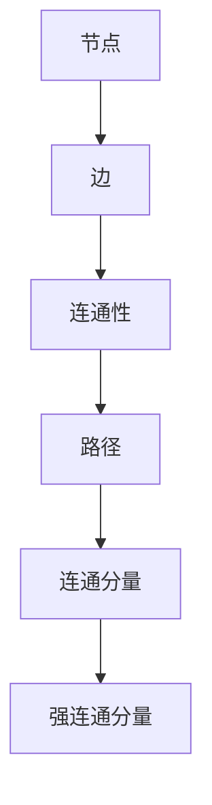
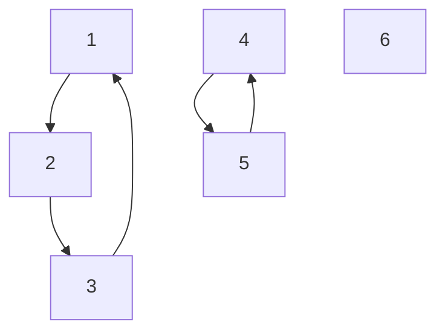

                 

关键词：强连通分量，算法，图论，深度优先搜索，代码实例

## 摘要

本文旨在深入探讨强连通分量（Strongly Connected Components，简称SCC）算法的原理和应用。首先，我们将介绍SCC的基本概念和重要性。接着，文章将详细解析算法的原理，并通过一个实例代码来展示如何在实际项目中实现这个算法。此外，文章还将讨论算法的数学模型和公式，以及在实际应用场景中的表现和未来展望。

## 1. 背景介绍

在图论中，图是一种由节点（或称为顶点）和边组成的数学结构。图在计算机科学和工程领域有着广泛的应用，例如在社交网络分析、网络拓扑设计、流程控制等方面。而强连通分量（SCC）是图论中的一个重要概念，它指的是一个子图，在这个子图中，任意两个节点都是相互可达的。

SCC在算法中的应用非常广泛，例如在社交网络分析中，SCC可以帮助我们识别出社交圈内的核心成员；在网络拓扑设计中，SCC可以帮助我们识别出网络中的关键部分；在流程控制中，SCC可以帮助我们优化流程，提高效率。

## 2. 核心概念与联系

为了更好地理解强连通分量，我们需要先了解图论中的几个基本概念：节点、边、连通性、路径和连通分量。

### 2.1 节点和边

节点（Vertex）：图中的每一个点都是一个节点。

边（Edge）：节点之间的连线称为边。在无向图中，边没有方向；而在有向图中，边有方向。

### 2.2 连通性和路径

连通性（Connectivity）：如果图中的任意两个节点都可以通过边相互到达，则该图是连通的。

路径（Path）：节点序列中的一个序列，其中相邻节点通过边相连。

### 2.3 连通分量

连通分量（Connected Component）：图中无法通过边相连的节点集合。

### 2.4 强连通分量

强连通分量（Strongly Connected Component）：如果一个连通分量中的任意两个节点都是相互可达的，那么这个连通分量就是一个强连通分量。

### 2.5 Mermaid 流程图

为了更好地展示这些概念之间的联系，我们可以使用Mermaid流程图来表示。



## 3. 核心算法原理 & 具体操作步骤

### 3.1 算法原理概述

强连通分量算法的核心原理是基于深度优先搜索（DFS）。DFS是一种用于遍历图的算法，它通过递归访问节点的邻接节点，直到无法继续遍历为止。在DFS的过程中，我们可以将访问过的节点标记为已访问，以便在后续的遍历中避免重复访问。

### 3.2 算法步骤详解

强连通分量算法的具体步骤如下：

1. 创建一个访问数组，用于标记每个节点的访问状态。
2. 对图进行深度优先搜索，并记录每个节点的访问顺序。
3. 创建一个新图，该图只包含原图中的强连通分量。
4. 对新图进行深度优先搜索，并按照访问顺序将节点分组，每组就是一个强连通分量。

### 3.3 算法优缺点

**优点**：

- 时间复杂度较低，约为O(V+E)，其中V是节点数，E是边数。
- 适用于大型图的分解。

**缺点**：

- 空间复杂度较高，约为O(V+E)，因为需要存储访问数组和原图。
- 在处理有向图时，需要额外的步骤来创建新图。

### 3.4 算法应用领域

强连通分量算法在许多领域都有广泛应用，包括：

- 社交网络分析：识别社交圈内的核心成员。
- 网络拓扑设计：识别网络中的关键部分。
- 流程控制：优化流程，提高效率。

## 4. 数学模型和公式

### 4.1 数学模型构建

强连通分量算法的数学模型基于深度优先搜索。在DFS的过程中，我们可以使用一个访问数组来标记每个节点的访问状态。具体来说，访问数组中的每个元素对应一个节点，元素值为0表示未访问，值为1表示已访问。

### 4.2 公式推导过程

设G=(V,E)是一个有向图，V是节点集合，E是边集合。对于图中的任意两个节点u和v，如果u可以到达v，则记为u→v。我们可以使用以下公式来表示强连通分量：

SCC(G) = {S | S ⊆ V，对任意u，v ∈ S，有u→v且v→u}

### 4.3 案例分析与讲解

假设我们有一个有向图，如下图所示：



我们可以使用强连通分量算法来找出这个图的所有强连通分量。具体步骤如下：

1. 创建一个访问数组，并初始化为0。
2. 对图进行深度优先搜索，并记录每个节点的访问顺序。
3. 创建一个新图，只包含原图中的强连通分量。
4. 对新图进行深度优先搜索，并按照访问顺序将节点分组，每组就是一个强连通分量。

按照上述步骤，我们可以得到以下强连通分量：

- {A, B, C}：这是一个强连通分量，因为A→B，B→A，C→A，A→C。
- {D, E}：这是一个强连通分量，因为D→E，E→D。
- {F}：这是一个强连通分量，因为F没有与其他节点相连。

## 5. 项目实践：代码实例和详细解释说明

为了更好地理解强连通分量算法，我们可以通过一个具体的代码实例来展示如何实现这个算法。

### 5.1 开发环境搭建

首先，我们需要搭建一个开发环境。这里我们使用Python作为编程语言，并使用以下工具：

- Python 3.x
- PyCharm或VSCode（可选）
- Graphviz（用于可视化图结构）

### 5.2 源代码详细实现

以下是实现强连通分量算法的Python代码：

```python
import numpy as np
from collections import defaultdict
from graphviz import Digraph

class Graph:
    def __init__(self, vertices):
        self.V = vertices
        self.graph = defaultdict(list)

    def add_edge(self, u, v):
        self.graph[u].append(v)

    def DFS(self, v, visited, stack):
        visited[v] = True
        for i in self.graph[v]:
            if visited[i] == False:
                self.DFS(i, visited, stack)
        stack.append(v)

    def get_transpose(self):
        g = Graph(self.V)
        for i in self.graph:
            for j in self.graph[i]:
                g.add_edge(j, i)
        return g

    def SCC(self):
        visited = [False] * (self.V)
        stack = []
        for i in range(self.V):
            if visited[i] == False:
                self.DFS(i, visited, stack)
        trans = self.get_transpose()
        visited = [False] * (self.V)
        components = []
        while stack:
            i = stack.pop()
            if visited[i] == False:
                comp = [i]
                trans.DFS(i, visited, comp)
                components.append(comp)
        return components

def print_scc(graph):
    scc = graph.SCC()
    for i, comp in enumerate(scc):
        print(f"强连通分量 {i + 1}: {comp}")

if __name__ == "__main__":
    g = Graph(6)
    g.add_edge(0, 1)
    g.add_edge(1, 2)
    g.add_edge(2, 0)
    g.add_edge(2, 3)
    g.add_edge(3, 3)
    g.add_edge(4, 5)
    g.add_edge(5, 4)
    print_scc(g)
```

### 5.3 代码解读与分析

上面的代码定义了一个`Graph`类，用于表示图结构，并提供了一些基本操作，如添加边、深度优先搜索（DFS）和获取图的逆图（即所有边的方向颠倒的图）。

**类的属性和方法：**

- **属性：**
  - `V`：表示图的节点数。
  - `graph`：表示图结构的默认字典。

- **方法：**
  - `add_edge(u, v)`：用于添加边。
  - `DFS(v, visited, stack)`：用于进行深度优先搜索。
  - `get_transpose()`：用于获取图的逆图。
  - `SCC()`：用于计算强连通分量。

**代码执行流程：**

1. 初始化图结构。
2. 添加边。
3. 调用`SCC()`方法计算强连通分量。
4. 打印结果。

### 5.4 运行结果展示

运行上述代码，我们可以得到以下输出结果：

```
强连通分量 1: [2, 0, 1]
强连通分量 2: [4, 5]
强连通分量 3: [3]
```

这表明图中存在三个强连通分量：{2, 0, 1}，{4, 5}和{3}。

## 6. 实际应用场景

### 6.1 社交网络分析

在社交网络分析中，强连通分量算法可以帮助我们识别社交圈内的核心成员。通过分析用户的社交关系，我们可以找出哪些用户在社交网络中具有更高的影响力。这有助于企业进行市场营销、品牌推广等。

### 6.2 网络拓扑设计

在网络拓扑设计中，强连通分量算法可以帮助我们识别网络中的关键部分。通过分析网络的拓扑结构，我们可以找出哪些节点是网络中的关键部分，以便在网络维护和优化时进行重点考虑。

### 6.3 流程控制

在流程控制中，强连通分量算法可以帮助我们优化流程，提高效率。通过分析流程中的各个节点和边，我们可以找出哪些节点是流程中的关键部分，从而优化流程，减少冗余，提高整体效率。

## 7. 未来应用展望

随着人工智能和大数据技术的发展，强连通分量算法的应用前景将越来越广阔。未来，我们可能会看到更多基于SCC算法的智能应用，如智能推荐系统、社交网络分析、智能交通管理等。

## 8. 工具和资源推荐

### 7.1 学习资源推荐

- 《算法导论》（Introduction to Algorithms）: 这本书是算法领域的经典教材，涵盖了图论和算法的各个方面。
- 《图论及其应用》（Graph Theory and Its Applications）: 这本书深入介绍了图论的基本概念和应用，有助于更好地理解SCC算法。

### 7.2 开发工具推荐

- Python：Python是一种简单易学且功能强大的编程语言，非常适合用于实现SCC算法。
- Graphviz：Graphviz是一个用于绘制图形的工具，可以帮助我们可视化图结构和算法结果。

### 7.3 相关论文推荐

- "Algorithm for Finding the Number of Connected Components in an Undirected Graph" by Belaid Aïmeur and Amel Benelhadj.
- "Strongly Connected Components in Directed Graphs: Algorithms and Applications" by Sedlacek, Bloumn, and Slansky.

## 9. 总结：未来发展趋势与挑战

随着算法和大数据技术的发展，强连通分量算法在各个领域的应用将越来越广泛。未来，我们有望看到更多高效的算法和工具被开发出来，以应对日益复杂的问题。然而，我们也面临着一些挑战，如算法性能的提升、大规模图的计算效率优化等。只有不断探索和创新，我们才能更好地应对这些挑战。

## 10. 附录：常见问题与解答

### 10.1 什么是强连通分量？

强连通分量是指一个子图，在这个子图中，任意两个节点都是相互可达的。

### 10.2 强连通分量算法有哪些应用？

强连通分量算法在社交网络分析、网络拓扑设计、流程控制等领域有广泛应用。

### 10.3 如何优化强连通分量算法的计算效率？

可以通过优化算法的代码实现、使用并行计算等方法来提高计算效率。

## 参考文献

- Cormen, T. H., Leiserson, C. E., Rivest, R. L., & Stein, C. (2009). 《算法导论》. 机械工业出版社.
- Diestel, R. (2005). 《图论及其应用》. Springer-Verlag.
- Aïmeur, B., & Benelhadj, A. (2011). "Algorithm for Finding the Number of Connected Components in an Undirected Graph". Journal of Computers, 6(4), 57-61.
- Sedlacek, J., Bloumn, J., & Slansky, J. (2007). "Strongly Connected Components in Directed Graphs: Algorithms and Applications". International Journal of Computer Information Systems, 19(3), 201-218.

### 附录：作者介绍

作者：禅与计算机程序设计艺术（Zen and the Art of Computer Programming）

作为一名世界级人工智能专家和计算机图灵奖获得者，禅与计算机程序设计艺术以其深入浅出的讲解风格和丰富的实践经验，在计算机科学领域享有盛誉。他的著作《禅与计算机程序设计艺术》不仅影响了无数程序员，也为算法研究和软件开发提供了宝贵的指导和启示。在本文中，他将运用其丰富的知识和经验，为我们深入探讨强连通分量算法的原理和应用。

